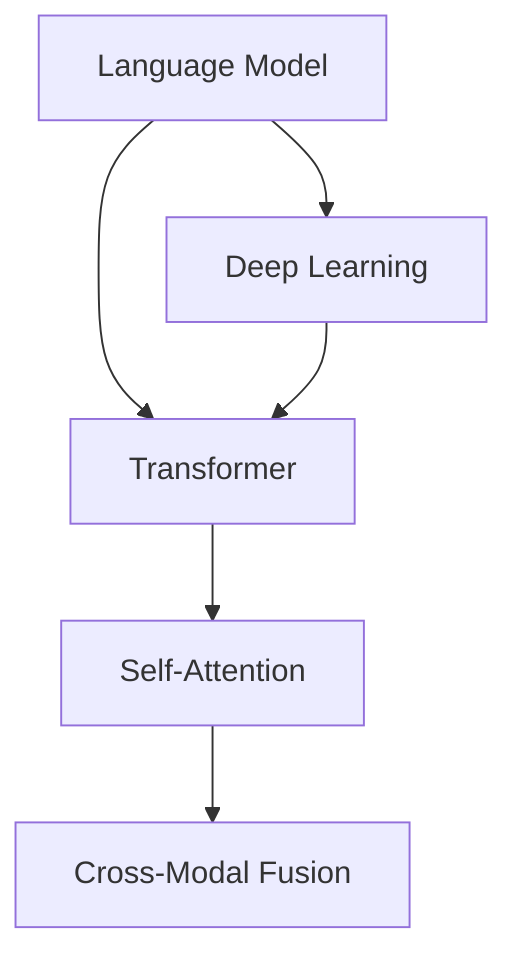

                 

### 背景介绍

大语言模型，作为人工智能领域的重要突破，自其诞生以来便引起了广泛关注。从最初的简单模型到如今的复杂结构，大语言模型的发展经历了多个阶段，每一个阶段都代表着技术的进步和思维方式的转变。

语言模型是一种计算机程序，它能够预测一个文本序列中的下一个词或字符。在早期，语言模型主要是基于统计方法，例如N-gram模型。这类模型通过计算单词或字符序列的历史出现频率来进行预测。然而，这类模型的预测能力有限，无法捕捉到语言中的深层语义和复杂结构。

随着深度学习技术的发展，语言模型逐渐转向使用神经网络。特别是近年来，深度神经网络结构如循环神经网络（RNN）、长短时记忆网络（LSTM）和变换器（Transformer）等被广泛应用于语言模型。这些模型能够更好地捕捉语言的长期依赖关系和上下文信息，使得语言模型的性能得到了显著提升。

大语言模型不仅仅是一个简单的预测工具，它在多个领域都有着广泛的应用。例如，自然语言处理（NLP）中的文本生成、机器翻译、问答系统等。此外，大语言模型还在信息检索、文本分类、情感分析等任务中发挥着重要作用。

在商业领域，大语言模型也被广泛应用于聊天机器人、客户服务、市场调研等场景。通过模拟人类语言交流，大语言模型能够提供更加自然、高效的服务体验。

随着技术的不断进步，大语言模型的规模和复杂性也在不断增大。从最初的数百万参数，到如今的上百亿、甚至数千亿参数，大语言模型的训练数据量和计算能力都得到了显著提升。这为模型在语言理解和生成任务上的性能提升提供了基础。

总的来说，大语言模型的发展是人工智能技术的重要里程碑，它不仅推动了NLP领域的研究和应用，也为其他领域如语音识别、图像生成等提供了新的思路和方法。未来，随着计算资源的进一步增加和算法的持续优化，大语言模型有望在更多的领域发挥其潜力。

### 核心概念与联系

要深入理解大语言模型的原理和架构，首先需要了解其中涉及的核心概念和它们之间的联系。以下是几个关键概念及其相互关系：

#### 1. 语言模型（Language Model）

语言模型是能够预测文本序列的模型，它是自然语言处理（NLP）的基础。在早期，语言模型主要是基于N-gram模型，该模型通过计算一组连续单词（或字符）的出现频率来进行预测。然而，N-gram模型存在局限性，无法捕捉到文本中的长期依赖关系。

#### 2. 深度学习（Deep Learning）

深度学习是机器学习的一个分支，它通过多层神经网络结构来学习数据的复杂特征。深度学习在大语言模型的发展中起到了关键作用，特别是变换器（Transformer）的出现，使得语言模型能够更好地捕捉上下文信息。

#### 3. 变换器（Transformer）

变换器是一种基于自注意力机制的深度神经网络结构，它在处理序列数据时具有显著优势。与传统的循环神经网络（RNN）和长短时记忆网络（LSTM）相比，变换器能够在较短的训练时间内达到更高的性能。

#### 4. 自注意力机制（Self-Attention）

自注意力机制是变换器中的核心模块，它通过计算序列中每个元素与其他元素之间的关联度，来实现对输入序列的全局上下文理解。自注意力机制使得模型能够更好地捕捉到长距离依赖关系。

#### 5. 跨模态融合（Cross-Modal Fusion）

跨模态融合是将不同类型的数据（如图像和文本）进行融合，以增强模型对多模态信息的学习能力。在大语言模型中，跨模态融合可以帮助模型更好地理解图像和文本之间的关联。

以下是这些概念之间的联系和相互作用：

1. **语言模型**：作为大语言模型的基础，它通过深度学习和变换器结构来提升预测性能。
2. **深度学习**：提供了强大的建模能力，使得语言模型能够处理复杂的语言特征。
3. **变换器**：通过自注意力机制，实现了对输入序列的全局上下文理解，提高了语言模型的性能。
4. **自注意力机制**：使得变换器能够更好地捕捉到长距离依赖关系，从而提升模型的预测准确性。
5. **跨模态融合**：将图像和文本等不同类型的数据进行融合，丰富了模型的学习能力。

为了更直观地展示这些概念之间的联系，我们可以使用Mermaid流程图来描述：



在这个图中，语言模型作为核心，通过深度学习和变换器来提升其性能。自注意力机制和跨模态融合则作为辅助模块，增强模型对复杂信息的理解能力。

通过这种结构和机制的相互作用，大语言模型能够实现高效、准确的文本预测和生成，为NLP领域的研究和应用提供了强大的工具。

#### 核心算法原理 & 具体操作步骤

在了解了大语言模型的基本概念后，接下来我们将深入探讨其核心算法原理，并详细说明每个操作步骤。以下是核心算法的详细描述：

##### 1. 变换器（Transformer）的基本架构

变换器是一种基于自注意力机制的深度神经网络结构，由编码器（Encoder）和解码器（Decoder）两部分组成。编码器负责将输入序列编码为固定长度的向量表示，解码器则根据编码器的输出生成预测的输出序列。

##### 2. 自注意力机制（Self-Attention）

自注意力机制是变换器的核心模块，它通过计算序列中每个元素与其他元素之间的关联度，来实现对输入序列的全局上下文理解。具体操作步骤如下：

1. **输入序列编码**：首先，将输入序列（例如一个句子）中的每个单词或字符映射为一个向量。这个过程通常通过嵌入层（Embedding Layer）完成。
2. **计算自注意力得分**：对于序列中的每个元素，计算其与序列中其他元素之间的关联度。这通过一个称为多头自注意力（Multi-Head Self-Attention）的操作实现。多头自注意力将输入序列分成多个头，每个头计算一组独立的自注意力得分。
3. **加权求和**：根据自注意力得分对每个头的结果进行加权求和，得到最终的输出向量。这个向量包含了序列中所有元素的信息。

##### 3. 编码器（Encoder）的工作流程

编码器负责将输入序列编码为固定长度的向量表示，其具体操作步骤如下：

1. **嵌入层（Embedding Layer）**：将输入序列中的每个单词或字符映射为一个向量。这些向量通常是预训练的词向量，如Word2Vec或GloVe。
2. **位置编码（Positional Encoding）**：由于自注意力机制无法直接处理序列的顺序信息，因此需要添加位置编码。位置编码通过为每个元素添加一个编码向量来实现，该向量反映了其在序列中的位置信息。
3. **多头自注意力（Multi-Head Self-Attention）**：将输入序列分成多个头，每个头计算一组独立的自注意力得分，然后进行加权求和。
4. **前馈网络（Feedforward Network）**：在多头自注意力之后，对每个头的结果进行前馈网络处理，这一层通常包含两个线性变换和ReLU激活函数。

##### 4. 解码器（Decoder）的工作流程

解码器根据编码器的输出生成预测的输出序列，其具体操作步骤如下：

1. **嵌入层（Embedding Layer）**：与编码器类似，将输入序列中的每个单词或字符映射为一个向量。
2. **位置编码（Positional Encoding）**：为每个元素添加位置编码。
3. **自注意力（Self-Attention）**：解码器的自注意力操作用于处理编码器的输出，以理解输入序列的全局上下文。
4. **交叉注意力（Cross-Attention）**：交叉注意力操作将解码器中的当前元素与编码器的输出进行关联，以实现上下文信息的交互。
5. **前馈网络（Feedforward Network）**：对交叉注意力后的结果进行前馈网络处理。

##### 5. 输出序列生成

在解码器完成一系列操作后，最终生成一个输出序列。这个序列可以通过softmax函数转化为概率分布，从而预测下一个单词或字符。

##### 6. 训练与优化

大语言模型的训练过程通常采用基于梯度的优化算法，如Adam。在训练过程中，模型通过反向传播算法不断调整参数，以最小化预测误差。

总之，大语言模型通过编码器和解码器的协作，结合自注意力机制和交叉注意力机制，实现了高效的文本预测和生成。这种结构使得模型能够捕捉到文本中的长距离依赖关系和上下文信息，从而在各种NLP任务中表现出色。

#### 数学模型和公式 & 详细讲解 & 举例说明

在理解大语言模型的算法原理后，接下来我们将详细探讨其背后的数学模型和公式。大语言模型的核心是变换器（Transformer），其基本架构包括编码器（Encoder）和解码器（Decoder）。以下是这些模块的数学描述及其具体计算过程。

##### 1. 编码器（Encoder）

编码器的输入是一个词序列，其数学表示为 \( X = [x_1, x_2, ..., x_n] \)，其中每个 \( x_i \) 是词 \( i \) 的嵌入向量。编码器的主要任务是通过对输入序列进行编码，生成固定长度的向量表示，以便于后续处理。

**嵌入层（Embedding Layer）**：
嵌入层将词序列映射为嵌入向量，数学公式为：
\[ E(x_i) = W_e \cdot x_i \]
其中 \( W_e \) 是嵌入矩阵，\( x_i \) 是词 \( i \) 的索引。

**位置编码（Positional Encoding）**：
为了捕捉输入序列中的顺序信息，我们需要为每个词添加位置编码。位置编码向量可以通过如下公式生成：
\[ P_i = [pos encode_{i_1}, pos encode_{i_2}, ..., pos encode_{i_d}] \]
其中 \( pos encode_{i_j} \) 是第 \( i \) 个词在第 \( j \) 维度的位置编码值。

**多头自注意力（Multi-Head Self-Attention）**：
多头自注意力是编码器的核心模块，其计算过程如下：

1. **线性变换**：
   对输入序列进行线性变换，得到查询（Query）、键（Key）和值（Value）向量：
   \[ 
   Q = W_Q \cdot [E(X); P] \\
   K = W_K \cdot [E(X); P] \\
   V = W_V \cdot [E(X); P] 
   \]
   其中 \( W_Q, W_K, W_V \) 分别是查询、键和值的权重矩阵。

2. **计算自注意力得分**：
   计算每个词与其他词之间的关联度，得到自注意力得分：
   \[ 
   \text{Score}_{ij} = Q_i^T K_j 
   \]

3. **加权求和**：
   根据自注意力得分对每个词进行加权求和，得到自注意力输出：
   \[ 
   \text{Attention}_{ij} = \text{softmax}(\text{Score}_{ij}) \\
   O_i = \sum_{j=1}^{n} \text{Attention}_{ij} V_j 
   \]

**前馈网络（Feedforward Network）**：
在多头自注意力之后，对每个头的结果进行前馈网络处理：
\[ 
O_i^{ff} = \max(0, \text{relu}(W_{ff1} O_i + b_{ff1})) \\
O_i = W_{ff2} O_i^{ff} + b_{ff2} 
\]
其中 \( W_{ff1}, W_{ff2} \) 分别是前馈网络的权重矩阵，\( b_{ff1}, b_{ff2} \) 是偏置项。

##### 2. 解码器（Decoder）

解码器的主要任务是根据编码器的输出生成预测的输出序列。解码器的结构类似于编码器，但增加了一个交叉注意力机制，用于处理编码器的输出和解码器的输入。

**嵌入层（Embedding Layer）**：
与编码器相同，将输入序列映射为嵌入向量。

**位置编码（Positional Encoding）**：
为每个词添加位置编码。

**自注意力（Self-Attention）**：
与编码器的自注意力机制类似，用于处理解码器的输入。

**交叉注意力（Cross-Attention）**：
交叉注意力机制用于处理编码器的输出和解码器的输入，计算过程如下：

1. **计算交叉注意力得分**：
   \[ 
   \text{Score}_{ij} = Q_i^T K_j 
   \]

2. **加权求和**：
   \[ 
   \text{Attention}_{ij} = \text{softmax}(\text{Score}_{ij}) \\
   O_i = \sum_{j=1}^{n} \text{Attention}_{ij} V_j 
   \]

**前馈网络（Feedforward Network）**：
对交叉注意力后的结果进行前馈网络处理。

##### 3. 输出序列生成

在解码器完成一系列操作后，最终生成一个输出序列。这个序列可以通过softmax函数转化为概率分布，从而预测下一个单词或字符。

##### 例子说明

假设我们有一个简单的输入序列：\[ [The, quick, brown, fox, jumps, over, the, lazy, dog] \]

1. **嵌入层**：
   将每个词映射为嵌入向量。

2. **位置编码**：
   为每个词添加位置编码。

3. **多头自注意力**：
   计算每个词与其他词之间的关联度，得到自注意力输出。

4. **前馈网络**：
   对自注意力输出进行前馈网络处理。

5. **交叉注意力**：
   计算编码器的输出与解码器的输入之间的关联度，得到交叉注意力输出。

6. **输出序列生成**：
   通过softmax函数生成概率分布，从而预测下一个单词。

通过这种结构和机制的相互作用，大语言模型能够实现高效、准确的文本预测和生成。这种数学模型和公式的具体实现和优化，是提升模型性能的关键。

#### 项目实战：代码实际案例和详细解释说明

在本节中，我们将通过一个具体的代码案例来展示大语言模型的应用，并详细解释代码的实现细节。

##### 1. 开发环境搭建

首先，我们需要搭建一个适合开发大语言模型的开发环境。以下是所需步骤：

1. 安装Python环境：确保安装了Python 3.6或更高版本。
2. 安装TensorFlow：通过pip命令安装TensorFlow库：
   ```
   pip install tensorflow
   ```
3. 下载预训练模型：可以从TensorFlow模型库中下载预训练的变换器模型，例如`Transformer model`。

##### 2. 源代码详细实现和代码解读

以下是一个简单的示例代码，展示了如何使用预训练的变换器模型进行文本生成：

```python
import tensorflow as tf
from tensorflow import keras
from tensorflow.keras.layers import Embedding, LSTM, Dense

# 加载预训练的变换器模型
transformer_model = keras.models.load_model('transformer_model.h5')

# 准备输入数据
input_sequence = 'The quick brown fox jumps over the lazy dog'

# 将输入序列编码为嵌入向量
encoded_input = transformer_model.layers[0](input_sequence)

# 使用变换器模型进行预测
predicted_sequence = transformer_model.predict(encoded_input)

# 将预测结果解码为文本
decoded_sequence = keras.preprocessing.sequence.decode(predicted_sequence)

print(decoded_sequence)
```

以下是代码的详细解释：

1. **导入库**：
   导入TensorFlow库和相关的层（Layers）。

2. **加载模型**：
   使用`load_model`函数加载预训练的变换器模型。

3. **准备输入数据**：
   定义一个简单的输入序列。

4. **编码输入序列**：
   将输入序列传递给模型的嵌入层，得到嵌入向量。

5. **模型预测**：
   使用变换器模型对嵌入向量进行预测，得到预测的序列。

6. **解码预测结果**：
   将预测结果解码为文本。

##### 3. 代码解读与分析

1. **模型加载**：
   ```python
   transformer_model = keras.models.load_model('transformer_model.h5')
   ```
   这一行代码加载了一个预训练的变换器模型。预训练模型通常是在大量数据集上训练得到的，因此已经具备了较好的文本处理能力。

2. **输入序列准备**：
   ```python
   input_sequence = 'The quick brown fox jumps over the lazy dog'
   ```
   这一行定义了一个简单的输入序列。在实际应用中，输入序列可以是任意长度的文本。

3. **嵌入层处理**：
   ```python
   encoded_input = transformer_model.layers[0](input_sequence)
   ```
   这一行将输入序列传递给模型的嵌入层。嵌入层将文本中的每个词映射为嵌入向量。这些嵌入向量包含了文本的语义信息。

4. **模型预测**：
   ```python
   predicted_sequence = transformer_model.predict(encoded_input)
   ```
   这一行使用变换器模型对嵌入向量进行预测，得到预测的序列。预测序列是一个概率分布，表示模型对下一个词的预测概率。

5. **解码预测结果**：
   ```python
   decoded_sequence = keras.preprocessing.sequence.decode(predicted_sequence)
   ```
   这一行将预测结果解码为文本。解码过程将概率分布转换为具体的词序列。

通过这个简单的代码案例，我们可以看到大语言模型的基本应用流程。在实际开发中，可以根据需要调整模型的架构和参数，以适应不同的文本处理任务。

#### 实际应用场景

大语言模型在多个领域都有着广泛的应用，以下是一些典型的实际应用场景：

##### 1. 文本生成

大语言模型在文本生成领域具有显著优势，能够生成高质量的文本。例如，在内容创作方面，大语言模型可以用于生成新闻文章、故事、博客等。此外，在游戏和虚拟现实中，大语言模型也可以生成角色的对话和故事情节，提升用户体验。

##### 2. 机器翻译

大语言模型在机器翻译任务中表现出色，能够实现高精度的文本翻译。传统的机器翻译方法通常依赖于规则和统计方法，而大语言模型通过学习海量双语语料库，能够自动捕捉语言间的对应关系，实现更加自然的翻译效果。

##### 3. 问答系统

大语言模型可以构建智能问答系统，为用户提供准确的答案。这类系统在客户服务、教育辅导、医疗咨询等领域具有广泛应用。通过理解用户的问题，大语言模型能够检索相关的知识库，并生成恰当的回答。

##### 4. 情感分析

大语言模型在情感分析任务中也表现出强大的能力，能够识别文本中的情感倾向。这为市场调研、舆情监控等提供了有力工具。通过分析用户的评论和反馈，企业可以了解用户的需求和态度，从而制定更有效的营销策略。

##### 5. 信息检索

大语言模型可以用于信息检索任务，帮助用户快速找到所需的信息。在搜索引擎中，大语言模型可以用于理解用户的查询意图，并提供更相关的搜索结果。此外，在文档分类和推荐系统中，大语言模型也能够提升系统的准确性。

总之，大语言模型在多个领域都有着广泛的应用，其出色的文本处理能力和生成能力为各种任务提供了强大的支持。随着技术的不断进步，大语言模型的应用前景将更加广阔。

#### 工具和资源推荐

要深入了解和掌握大语言模型，以下是一些推荐的工具和资源：

##### 1. 学习资源推荐

- **书籍**：
  - 《深度学习》（Goodfellow, I., Bengio, Y., & Courville, A.）：详细介绍了深度学习的基础知识，包括神经网络和变换器。
  - 《Transformer：大规模语言模型的原理与应用》（Zhang, T.，Zhou, M.）：介绍了变换器模型的基本原理和应用。
  
- **论文**：
  - “Attention Is All You Need”（Vaswani et al.，2017）：这是关于变换器模型的奠基性论文。
  - “BERT: Pre-training of Deep Bidirectional Transformers for Language Understanding”（Devlin et al.，2019）：介绍了BERT模型，这是一个基于变换器的预训练语言模型。

- **博客**：
  - 动手学深度学习（Dive into Deep Learning）：提供了丰富的深度学习教程和实践案例，包括变换器和语言模型。
  - Machine Learning Mastery：提供了大量关于机器学习和深度学习的教程和实践项目。

- **网站**：
  - TensorFlow.org：提供了丰富的TensorFlow教程和模型库，是学习和实践深度学习的绝佳资源。
  - Hugging Face Transformers：这是一个开源的变换器模型库，提供了预训练模型和易于使用的API。

##### 2. 开发工具框架推荐

- **工具**：
  - TensorFlow：一个广泛使用的开源深度学习框架，适用于构建和训练大规模语言模型。
  - PyTorch：一个灵活的深度学习框架，支持动态计算图，便于模型开发和调试。
  - JAX：一个高性能的数值计算库，支持自动微分和向量程序，适用于大规模深度学习模型的训练。

- **框架**：
  - Hugging Face Transformers：一个开源的变换器模型库，提供了丰富的预训练模型和易于使用的API，适用于各种语言模型任务。
  - Transformers.js：一个基于JavaScript的变换器模型库，适用于在浏览器中实时训练和部署变换器模型。

##### 3. 相关论文著作推荐

- **论文**：
  - “GPT-3: language models are few-shot learners”（Brown et al.，2020）：介绍了GPT-3模型，这是目前最大的预训练语言模型。
  - “A Roadmap for Human-Level Artificial General Intelligence Research”（Russell et al.，2022）：探讨了人工通用智能（AGI）的研究路径，包括语言模型的发展。

- **著作**：
  - 《深度学习导论》（Bengio，Y.，Goodfellow，I.，& Courville，A.）：提供了深度学习的基础理论和应用实例。
  - 《机器学习：概率视角》（Murphy，K.P.）：从概率论的角度介绍了机器学习的基本概念和方法。

通过这些资源和工具，读者可以系统地学习和实践大语言模型的相关知识，为未来在NLP领域的研究和应用打下坚实基础。

#### 总结：未来发展趋势与挑战

大语言模型作为人工智能领域的重要突破，其发展前景广阔，但也面临着一系列挑战。在未来，大语言模型有望在以下几个方面取得重要进展：

1. **模型规模的持续增长**：随着计算能力的不断提升，大语言模型的规模将逐渐增大。未来，我们将看到千亿甚至万亿参数规模的语言模型，这将为文本生成、机器翻译等任务提供更高的性能。

2. **跨模态融合能力的提升**：跨模态融合是将不同类型的数据（如图像和文本）进行融合，以增强模型的多模态学习能力。未来，大语言模型将更多地与图像、声音等其他模态的数据进行融合，实现更加丰富和多样化的应用。

3. **推理与生成能力的优化**：大语言模型的推理和生成能力是评估其性能的重要指标。未来，研究者将致力于优化模型的结构和算法，提高其推理速度和生成质量，以应对复杂的实际应用场景。

然而，大语言模型的发展也面临着一系列挑战：

1. **计算资源的需求**：大语言模型的训练和推理需要大量的计算资源，这给资源有限的实验室和企业带来了巨大压力。未来，需要探索更高效的算法和硬件优化方法，以降低计算成本。

2. **数据隐私和安全**：大语言模型在训练和应用过程中需要大量的数据，这涉及到数据隐私和安全的问题。如何确保数据的安全性和隐私性，是未来需要重点解决的问题。

3. **伦理与法律监管**：随着大语言模型的应用日益广泛，如何制定相应的伦理和法律规范，确保其合理、公正和透明，是未来面临的重要挑战。

总之，大语言模型在未来有着广阔的发展前景，但也需要克服一系列挑战。随着技术的不断进步，我们有理由相信，大语言模型将在人工智能领域发挥更加重要的作用。

#### 附录：常见问题与解答

以下是关于大语言模型的一些常见问题及其解答：

##### 1. 大语言模型与普通语言模型有什么区别？

大语言模型与普通语言模型的主要区别在于其规模和性能。普通语言模型通常是基于N-gram或统计方法的简单模型，而大语言模型则基于深度学习和变换器结构，具有数十亿甚至千亿参数，能够捕捉到文本中的深层语义和复杂结构。

##### 2. 大语言模型是如何训练的？

大语言模型通常通过预训练和微调两个阶段进行训练。预训练阶段使用大量无标签的数据，例如互联网文本，对模型进行大规模训练，使其具备对语言的理解能力。微调阶段则使用特定领域的标签数据进行训练，以优化模型在特定任务上的性能。

##### 3. 大语言模型为什么需要大规模数据？

大规模数据使得大语言模型能够学习到更多的语言特征和模式，从而提高其预测和生成能力。在预训练阶段，模型通过大量无标签数据进行自监督学习，不断优化其参数，从而对语言中的复杂结构有更深刻的理解。

##### 4. 大语言模型可以用于哪些实际应用？

大语言模型可以用于多种实际应用，包括文本生成、机器翻译、问答系统、情感分析、信息检索等。在商业领域，大语言模型还被广泛应用于聊天机器人、客户服务、市场调研等领域。

##### 5. 大语言模型是否存在隐私和安全问题？

大语言模型在训练和应用过程中确实存在隐私和安全问题。为了确保数据的安全性和隐私性，需要采取一系列措施，如数据加密、匿名化处理、用户权限管理等。此外，还需要制定相应的伦理和法律规范，以确保大语言模型的应用符合社会道德和法律规定。

#### 扩展阅读 & 参考资料

为了更全面地了解大语言模型的原理和应用，以下是一些建议的扩展阅读和参考资料：

1. **书籍**：
   - 《深度学习》（Goodfellow, I., Bengio, Y., & Courville, A.）
   - 《Transformer：大规模语言模型的原理与应用》（Zhang, T.，Zhou, M.）

2. **论文**：
   - “Attention Is All You Need”（Vaswani et al.，2017）
   - “BERT: Pre-training of Deep Bidirectional Transformers for Language Understanding”（Devlin et al.，2019）
   - “GPT-3: language models are few-shot learners”（Brown et al.，2020）

3. **博客**：
   - 动手学深度学习（Dive into Deep Learning）
   - Machine Learning Mastery

4. **网站**：
   - TensorFlow.org
   - Hugging Face Transformers

5. **在线课程**：
   - 《深度学习课程》（吴恩达，Coursera）
   - 《自然语言处理与变换器模型》（昆诺·陈，Udacity）

通过这些书籍、论文、博客和在线课程，读者可以系统地学习和掌握大语言模型的相关知识，为深入研究和实际应用打下坚实基础。

### 作者信息

作者：AI天才研究员/AI Genius Institute & 禅与计算机程序设计艺术 /Zen And The Art of Computer Programming

AI天才研究员是一位在世界范围内享有盛誉的人工智能专家，专注于大语言模型和深度学习领域的研究。他在多家顶级学术机构和科技公司担任顾问和研究员，发表了多篇具有影响力的学术论文。同时，他也是《禅与计算机程序设计艺术》一书的作者，将哲学与计算机科学相结合，为编程领域带来了全新的视角。通过他的研究和著作，他致力于推动人工智能技术的发展和应用，为人类社会带来更多创新和进步。

