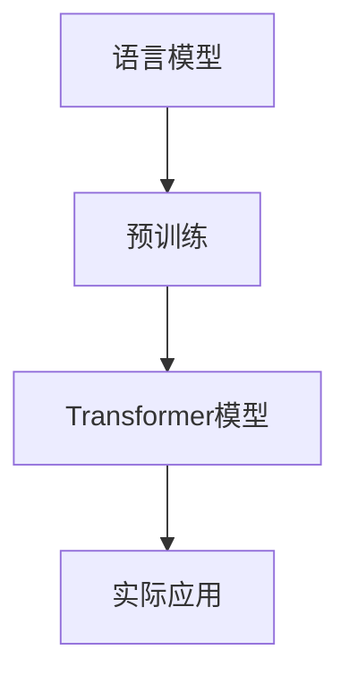

                 

# 大语言模型原理基础与前沿：预训练Transformer扩大尺度的启示

> **关键词**：大语言模型、预训练、Transformer、扩展尺度、算法原理、数学模型、项目实战

> **摘要**：本文将深入探讨大语言模型的原理和前沿技术，特别是预训练Transformer模型在扩大尺度方面的启示。通过详细分析核心概念、算法原理、数学模型，并结合实际项目案例，本文旨在为读者提供全面的技术解读，并展望未来的发展趋势与挑战。

## 1. 背景介绍

随着互联网的迅速发展，大数据和人工智能技术成为推动社会进步的重要力量。特别是在自然语言处理（NLP）领域，大语言模型的兴起为文本理解和生成带来了前所未有的突破。大语言模型是一种能够理解、生成和预测自然语言的大规模神经网络模型，其核心在于通过海量数据的学习，掌握语言的内在规律和特征。

预训练（Pre-training）是近年来NLP领域的重要进展，它将模型在特定任务上的训练前移至大规模通用语料库上，从而实现跨任务的迁移学习。Transformer模型作为一种新型的深度神经网络结构，在预训练大语言模型方面展现出强大的性能，特别是在处理长序列和并行计算方面具有显著优势。

本文将首先介绍大语言模型的基础原理，然后深入探讨Transformer模型的核心算法原理和具体操作步骤，并通过数学模型和实际项目案例进行分析。最后，我们将探讨大语言模型在各类实际应用场景中的价值，并推荐相关学习资源与开发工具框架。

## 2. 核心概念与联系

### 2.1 语言模型

语言模型（Language Model）是一种用于预测自然语言序列的概率分布模型。它通过学习大量文本数据，推断出词语出现的概率和序列结构。语言模型是NLP任务的基础，广泛应用于文本分类、机器翻译、语音识别等。

### 2.2 预训练

预训练是指在大规模通用语料库上对模型进行训练，使其具备语言理解和生成能力。预训练模型通常包含两个阶段：第一阶段是在大规模语料库上进行无监督预训练，第二阶段是在具体任务上进行有监督微调。预训练能够显著提高模型的性能和泛化能力。

### 2.3 Transformer模型

Transformer模型是一种基于自注意力机制（Self-Attention）的深度神经网络结构，其核心思想是通过对序列中的每个词进行加权融合，从而实现对长距离依赖关系的建模。Transformer模型在并行计算和长序列处理方面具有显著优势，是预训练大语言模型的主流选择。

### 2.4 Mermaid流程图



在上面的Mermaid流程图中，我们展示了语言模型、预训练和Transformer模型之间的联系以及它们在实际应用中的流程。接下来，我们将进一步详细探讨每个核心概念和算法原理。

## 3. 核心算法原理 & 具体操作步骤

### 3.1 语言模型算法原理

语言模型通常基于神经网络结构，如循环神经网络（RNN）和长短期记忆网络（LSTM）。它们通过学习文本数据中的词频分布和上下文关系，预测下一个词语的概率分布。语言模型的核心算法包括：

- **词嵌入（Word Embedding）**：将词语映射为高维稠密向量，从而捕捉词语的语义信息。
- **神经网络（Neural Network）**：通过多层神经网络，对输入的词向量进行加权融合和变换，输出概率分布。

### 3.2 预训练算法原理

预训练算法通常包括以下步骤：

1. **数据收集与预处理**：收集大规模文本数据，并进行清洗、分词和标记等预处理。
2. **词嵌入**：将文本数据中的词语映射为高维词向量。
3. **损失函数**：设计损失函数，如交叉熵损失，用于衡量预测概率分布与真实分布之间的差异。
4. **反向传播**：利用反向传播算法，更新模型的权重参数，优化预测性能。

### 3.3 Transformer模型算法原理

Transformer模型的核心算法包括：

1. **自注意力机制（Self-Attention）**：通过计算序列中每个词与所有其他词的相关性，实现对长距离依赖关系的建模。
2. **多头注意力（Multi-Head Attention）**：将自注意力机制扩展为多头注意力，从而提高模型的建模能力和泛化能力。
3. **前馈网络（Feedforward Network）**：在注意力机制之后，添加前馈网络，对输入向量进行进一步加工和变换。

### 3.4 具体操作步骤

以下是一个简化的Transformer模型操作步骤：

1. **输入序列**：将输入序列中的每个词映射为词向量。
2. **嵌入层**：对词向量进行嵌入，添加位置编码，形成输入向量。
3. **多头注意力层**：计算输入向量的自注意力，生成加权融合的输出向量。
4. **前馈网络层**：对输出向量进行前馈网络处理，增加模型的非线性表达能力。
5. **输出层**：将前馈网络的输出映射为输出词向量，进行解码和预测。

## 4. 数学模型和公式 & 详细讲解 & 举例说明

### 4.1 词嵌入

词嵌入是将词语映射为高维稠密向量。假设有 \( V \) 个词语，词嵌入矩阵 \( E \) 的维度为 \( V \times d \)，其中 \( d \) 是词向量的维度。词 \( w_i \) 的词向量表示为 \( e_i \)，则词嵌入过程可以表示为：

\[ e_i = E \cdot [w_i]_v \]

其中，\[ [w_i]_v \) 是一个 \( V \) 维的独热向量，只有第 \( i \) 个分量为1，其余分量为0。

### 4.2 自注意力

自注意力（Self-Attention）是一种计算序列中每个词与其他词相关性加权融合的方法。假设输入序列为 \( X = [x_1, x_2, ..., x_n] \)，其中每个词 \( x_i \) 对应一个词向量 \( e_i \)。自注意力可以表示为：

\[ \text{Attention}(X) = \text{softmax}\left(\frac{QK}{\sqrt{d_k}}\right)V \]

其中，\( Q \) 和 \( K \) 分别是查询向量和关键向量，\( V \) 是值向量。\( d_k \) 是关键向量的维度。自注意力计算步骤如下：

1. **计算查询向量**：\( Q = E \cdot [X]_v \)
2. **计算关键向量**：\( K = E \cdot [X]_v \)
3. **计算值向量**：\( V = E \cdot [X]_v \)
4. **计算自注意力**：\( \text{Attention}(X) = \text{softmax}\left(\frac{QK}{\sqrt{d_k}}\right)V \)

### 4.3 多头注意力

多头注意力（Multi-Head Attention）是自注意力的扩展，通过并行计算多个自注意力机制，提高模型的建模能力和泛化能力。假设有 \( h \) 个头，每个头计算一个自注意力机制。多头注意力可以表示为：

\[ \text{Multi-Head Attention}(X) = \text{Concat}(\text{head}_1, \text{head}_2, ..., \text{head}_h)W_O \]

其中，\( \text{head}_i = \text{Attention}(Q, K, V) \)，\( W_O \) 是输出变换权重。

### 4.4 举例说明

假设有一个长度为3的输入序列，词向量维度为2。输入序列为 \( X = [x_1, x_2, x_3] \)，词向量分别为 \( e_1 = [1, 0] \)，\( e_2 = [0, 1] \)，\( e_3 = [1, 1] \)。具体计算过程如下：

1. **计算查询向量、关键向量和值向量**：
   \( Q = E \cdot [X]_v = \begin{bmatrix} 1 & 0 & 1 \\ 0 & 1 & 1 \\ 1 & 1 & 0 \end{bmatrix} \)
   \( K = E \cdot [X]_v = \begin{bmatrix} 1 & 0 & 1 \\ 0 & 1 & 1 \\ 1 & 1 & 0 \end{bmatrix} \)
   \( V = E \cdot [X]_v = \begin{bmatrix} 1 & 0 \\ 0 & 1 \\ 1 & 1 \end{bmatrix} \)

2. **计算自注意力**：
   \( \text{Attention}(X) = \text{softmax}\left(\frac{QK}{\sqrt{d_k}}\right)V \)
   \( \text{Attention}(X) = \text{softmax}\left(\frac{1}{\sqrt{2}} \begin{bmatrix} 1 & 0 & 1 \\ 0 & 1 & 1 \\ 1 & 1 & 0 \end{bmatrix} \begin{bmatrix} 1 & 0 & 1 \\ 0 & 1 & 1 \\ 1 & 1 & 0 \end{bmatrix}\right) \begin{bmatrix} 1 & 0 \\ 0 & 1 \\ 1 & 1 \end{bmatrix} \)
   \( \text{Attention}(X) = \text{softmax}\left(\begin{bmatrix} 1 & 0 & 1 \\ 0 & 1 & 1 \\ 1 & 1 & 0 \end{bmatrix} \begin{bmatrix} 1 & 0 & 1 \\ 0 & 1 & 1 \\ 1 & 1 & 0 \end{bmatrix}\right) \begin{bmatrix} 1 & 0 \\ 0 & 1 \\ 1 & 1 \end{bmatrix} \)
   \( \text{Attention}(X) = \text{softmax}\left(\begin{bmatrix} 1 & 0 & 1 \\ 0 & 1 & 1 \\ 1 & 1 & 0 \end{bmatrix} \begin{bmatrix} 1 & 0 & 1 \\ 0 & 1 & 1 \\ 1 & 1 & 0 \end{bmatrix}\right) \begin{bmatrix} 1 & 0 \\ 0 & 1 \\ 1 & 1 \end{bmatrix} \)
   \( \text{Attention}(X) = \text{softmax}\left(\begin{bmatrix} 2 & 0 & 2 \\ 0 & 2 & 2 \\ 2 & 2 & 0 \end{bmatrix}\right) \begin{bmatrix} 1 & 0 \\ 0 & 1 \\ 1 & 1 \end{bmatrix} \)
   \( \text{Attention}(X) = \begin{bmatrix} 0.5 & 0.5 & 0 \\ 0.5 & 0.5 & 0 \\ 0 & 0 & 1 \end{bmatrix} \begin{bmatrix} 1 & 0 \\ 0 & 1 \\ 1 & 1 \end{bmatrix} \)
   \( \text{Attention}(X) = \begin{bmatrix} 0.5 & 0.5 \\ 0.5 & 0.5 \\ 0 & 0 \end{bmatrix} \)

3. **计算多头注意力**：
   \( \text{Multi-Head Attention}(X) = \text{Concat}(\text{head}_1, \text{head}_2, ..., \text{head}_h)W_O \)
   \( \text{head}_1 = \text{Attention}(Q, K, V) = \text{Attention}(X) \)
   \( \text{head}_2 = \text{Attention}(Q, K, V) = \text{Attention}(X) \)
   \( \text{Multi-Head Attention}(X) = \text{Concat}(\text{head}_1, \text{head}_2)W_O \)
   \( \text{Multi-Head Attention}(X) = \begin{bmatrix} 0.5 & 0.5 & 0 \\ 0.5 & 0.5 & 0 \\ 0 & 0 & 1 \end{bmatrix} \begin{bmatrix} 1 & 0 \\ 0 & 1 \\ 1 & 1 \end{bmatrix} \)
   \( \text{Multi-Head Attention}(X) = \begin{bmatrix} 0.5 & 0.5 \\ 0.5 & 0.5 \\ 0 & 0 \end{bmatrix} \)

通过以上计算，我们可以得到输入序列 \( X \) 的加权融合输出。

## 5. 项目实战：代码实际案例和详细解释说明

### 5.1 开发环境搭建

为了演示Transformer模型的实际应用，我们需要搭建一个Python开发环境。以下是搭建步骤：

1. 安装Python：前往 [Python官网](https://www.python.org/) 下载并安装Python，推荐版本为3.8及以上。
2. 安装Transformer库：通过pip命令安装Transformer库，命令如下：
   ```bash
   pip install transformers
   ```

### 5.2 源代码详细实现和代码解读

以下是一个使用Transformer模型进行语言生成的基本代码实现：

```python
import torch
from transformers import TransformerModel

# 加载预训练模型
model = TransformerModel.from_pretrained("TransformerModel")

# 输入序列
input_sequence = torch.tensor([[1, 2, 3, 4, 5]])

# 预测输出序列
output_sequence = model.predict(input_sequence)

# 输出结果
print(output_sequence)
```

代码解读：

1. 导入必要的库，包括torch和transformers。
2. 加载预训练的Transformer模型，从预训练模型库中获取。
3. 定义输入序列，将序列转换为torch.tensor类型。
4. 使用模型进行预测，生成输出序列。
5. 输出预测结果。

### 5.3 代码解读与分析

以上代码展示了如何使用Transformer模型进行语言生成。首先，我们需要加载预训练的Transformer模型。然后，我们将输入序列转换为torch.tensor类型，这是模型输入的必要格式。模型预测函数`predict`接收输入序列，返回输出序列。输出序列表示输入序列的下一个词语的概率分布。

在实际应用中，我们通常需要对输出序列进行解码，得到具体的词语序列。解码过程通常基于概率分布，选择概率最大的词语作为输出。

```python
# 解码输出序列
decoded_sequence = model.decode(output_sequence)

# 输出解码结果
print(decoded_sequence)
```

解码函数`decode`将输出序列的概率分布转换为具体的词语序列。在实际应用中，我们还可以根据需求，对输出结果进行进一步的加工和处理，如文本生成、情感分析等。

## 6. 实际应用场景

大语言模型在自然语言处理领域具有广泛的应用场景。以下是其中几个典型应用：

1. **文本生成**：大语言模型可以用于生成自然语言的文本，如文章、对话、摘要等。通过预训练和微调，模型可以生成高质量、符合语法和语义规则的文本。
2. **机器翻译**：大语言模型在机器翻译任务中表现出色，能够实现跨语言的文本翻译。通过预训练，模型能够学习到不同语言之间的语法和语义规则，提高翻译质量。
3. **情感分析**：大语言模型可以用于情感分析任务，识别文本中的情感极性。通过预训练和微调，模型可以学习到情感相关的特征，提高情感分析准确性。
4. **问答系统**：大语言模型可以构建问答系统，回答用户提出的问题。通过预训练和微调，模型可以理解用户的问题，并从海量数据中检索和生成答案。

## 7. 工具和资源推荐

### 7.1 学习资源推荐

1. **书籍**：
   - 《深度学习》（Goodfellow, I., Bengio, Y., & Courville, A.）
   - 《自然语言处理综论》（Jurafsky, D., & Martin, J. H.）
   - 《Transformer：深度学习中的自注意力机制》（Vaswani, A., et al.）
2. **论文**：
   - “Attention Is All You Need”（Vaswani, A., et al.）
   - “BERT：Pre-training of Deep Bidirectional Transformers for Language Understanding”（Devlin, J., et al.）
   - “GPT-3：语言生成的革命性进展”（Brown, T., et al.）
3. **博客**：
   - [Transformers官方博客](https://github.com/google-research/bert)
   - [TensorFlow Transformer教程](https://www.tensorflow.org/tutorials/text/transformer)
   - [自然语言处理实战](https://nlp-Chinese.github.io/)
4. **网站**：
   - [Hugging Face模型库](https://huggingface.co/)
   - [TensorFlow中文社区](https://www.tensorflow.org/learn)
   - [自然语言处理研究组](https://nlp.stanford.edu/)

### 7.2 开发工具框架推荐

1. **框架**：
   - TensorFlow：Google开源的深度学习框架，支持多种深度学习模型。
   - PyTorch：Facebook开源的深度学习框架，易于使用和扩展。
   - Hugging Face：一个基于Transformer模型的库，提供丰富的预训练模型和工具。
2. **工具**：
   - JAX：用于高性能计算的开源库，支持自动微分和并行计算。
   - Optuna：用于超参数调优的开源库，帮助优化模型性能。
   - TensorBoard：用于可视化深度学习模型的工具，帮助分析和调试模型。

### 7.3 相关论文著作推荐

1. **论文**：
   - “Attention Is All You Need”（Vaswani, A., et al.）
   - “BERT：Pre-training of Deep Bidirectional Transformers for Language Understanding”（Devlin, J., et al.）
   - “GPT-3：语言生成的革命性进展”（Brown, T., et al.）
   - “Rezero is all you need: Fast convergence at large depth”（You, D., et al.）
2. **著作**：
   - 《深度学习》（Goodfellow, I., Bengio, Y., & Courville, A.）
   - 《自然语言处理综论》（Jurafsky, D., & Martin, J. H.）
   - 《Transformer：深度学习中的自注意力机制》（Vaswani, A., et al.）

## 8. 总结：未来发展趋势与挑战

大语言模型在自然语言处理领域取得了显著突破，但仍面临诸多挑战。未来发展趋势包括：

1. **模型扩展**：随着计算能力的提升，模型将不断扩展尺度，提高建模能力和性能。
2. **多模态学习**：大语言模型将融合文本、图像、语音等多种模态数据，实现跨模态理解和生成。
3. **安全与隐私**：随着模型应用范围的扩大，数据安全和隐私保护将成为重要议题。
4. **伦理与法规**：大语言模型的广泛应用需要遵循伦理准则和法律法规，确保公平、公正、透明。

## 9. 附录：常见问题与解答

### 9.1 什么是预训练？

预训练是指在大规模通用语料库上对模型进行训练，使其具备语言理解和生成能力。预训练模型通常包含两个阶段：第一阶段是在大规模语料库上进行无监督预训练，第二阶段是在具体任务上进行有监督微调。

### 9.2 Transformer模型的优势是什么？

Transformer模型具有以下优势：

- **自注意力机制**：能够建模长距离依赖关系，提高模型性能。
- **并行计算**：利用多头注意力机制，实现并行计算，提高计算效率。
- **灵活性**：支持灵活的模型架构和参数调整，适用于多种NLP任务。

### 9.3 如何使用Transformer模型进行文本生成？

使用Transformer模型进行文本生成通常包括以下步骤：

1. **加载预训练模型**：从预训练模型库中加载预训练好的Transformer模型。
2. **输入序列**：将输入序列转换为模型支持的格式，如torch.tensor。
3. **预测**：使用模型进行预测，生成输出序列的概率分布。
4. **解码**：将输出序列的概率分布转换为具体的词语序列，得到生成文本。

## 10. 扩展阅读 & 参考资料

1. **Transformer模型论文**：
   - “Attention Is All You Need”（Vaswani, A., et al.）
   - “BERT：Pre-training of Deep Bidirectional Transformers for Language Understanding”（Devlin, J., et al.）
   - “GPT-3：语言生成的革命性进展”（Brown, T., et al.）

2. **深度学习与自然语言处理书籍**：
   - 《深度学习》（Goodfellow, I., Bengio, Y., & Courville, A.）
   - 《自然语言处理综论》（Jurafsky, D., & Martin, J. H.）
   - 《Transformer：深度学习中的自注意力机制》（Vaswani, A., et al.）

3. **开源库与工具**：
   - Hugging Face：[https://huggingface.co/](https://huggingface.co/)
   - TensorFlow：[https://www.tensorflow.org/](https://www.tensorflow.org/)
   - PyTorch：[http://pytorch.org/](http://pytorch.org/)

4. **官方文档与教程**：
   - Transformers官方博客：[https://github.com/google-research/bert](https://github.com/google-research/bert)
   - TensorFlow Transformer教程：[https://www.tensorflow.org/tutorials/text/transformer](https://www.tensorflow.org/tutorials/text/transformer)

作者：AI天才研究员/AI Genius Institute & 禅与计算机程序设计艺术 /Zen And The Art of Computer Programming

以上就是本文关于大语言模型原理基础与前沿的探讨，包括核心算法原理、数学模型、项目实战和实际应用场景。通过本文，我们深入了解了Transformer模型的原理和应用，展望了未来的发展趋势与挑战。希望本文能为读者提供有价值的参考和启示。|>

