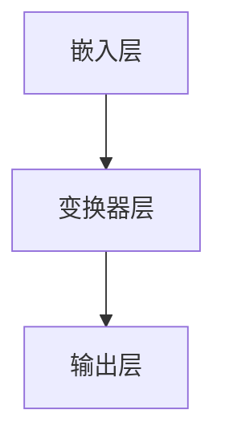

                 

# 大语言模型应用指南：图像生成

## 关键词：图像生成，大语言模型，AI 应用，计算机视觉，深度学习

### 摘要

本文将深入探讨大语言模型在图像生成领域的应用。通过梳理大语言模型的核心概念、算法原理，并结合实际应用案例，我们将展示如何利用大语言模型实现高效、逼真的图像生成。文章还将对相关数学模型和公式进行详细解析，为读者提供全面的实践指导和资源推荐，以助力其在图像生成领域的研究和实践。

## 1. 背景介绍

图像生成作为计算机视觉领域的一个重要研究方向，近年来得到了广泛关注。从传统的基于规则和统计的方法，到如今流行的深度学习模型，图像生成技术取得了显著的进步。然而，随着计算能力的提升和大数据的积累，大语言模型逐渐成为图像生成领域的新宠。

大语言模型，特别是基于变换器（Transformer）架构的模型，如 GPT 和 BERT，以其强大的语言理解和生成能力在自然语言处理领域取得了辉煌的成就。然而，这些模型在图像生成领域也展现了巨大的潜力。通过将自然语言描述与图像内容建立映射关系，大语言模型能够生成符合描述的图像，从而为图像生成领域带来了全新的思路。

本文将首先介绍大语言模型的核心概念和原理，然后深入探讨如何利用大语言模型实现图像生成，最后提供实际应用案例和详细解析，以期为读者提供全面的指导。

### 2. 核心概念与联系

#### 大语言模型

大语言模型（Large-scale Language Model）是一种基于神经网络的自然语言处理模型，其核心思想是通过学习大量文本数据，使模型具备对语言的理解和生成能力。大语言模型的主要类型包括：

1. **生成式模型（Generative Model）**：通过学习文本数据的概率分布，生成符合该分布的文本。如 GPT（Generative Pre-trained Transformer）系列模型。
2. **判别式模型（Discriminative Model）**：通过学习文本数据的标签信息，对文本进行分类或标注。如 BERT（Bidirectional Encoder Representations from Transformers）系列模型。

大语言模型的基本架构通常包括以下几个部分：

1. **嵌入层（Embedding Layer）**：将输入的文本转化为固定长度的向量表示。
2. **变换器层（Transformer Layer）**：通过自注意力机制（Self-Attention）和多头注意力机制（Multi-Head Attention）对输入向量进行建模，提取文本的特征。
3. **输出层（Output Layer）**：将变换器层的输出通过全连接层（Fully Connected Layer）或其他神经网络结构进行分类或生成。

#### 图像生成

图像生成（Image Generation）是指利用计算机算法生成新的图像内容。图像生成技术可以分为以下几类：

1. **基于规则的方法（Rule-Based Method）**：通过编写规则和程序，生成符合特定要求的图像。
2. **基于生成对抗网络（GAN）的方法（GAN-Based Method）**：利用生成器和判别器的对抗训练，生成逼真的图像。
3. **基于变分自编码器（VAE）的方法（VAE-Based Method）**：通过编码器和解码器，将图像数据映射到潜在空间，并在潜在空间中生成新的图像。

#### 大语言模型与图像生成的联系

大语言模型与图像生成的联系主要体现在以下几个方面：

1. **文本与图像的映射**：大语言模型能够将自然语言描述映射到图像内容，从而生成符合描述的图像。
2. **特征提取与生成**：大语言模型在训练过程中提取了丰富的文本特征，这些特征可以用于指导图像生成过程，提高生成图像的质量。
3. **多模态学习**：大语言模型的多模态学习能力使其能够同时处理文本和图像数据，从而实现更复杂的图像生成任务。

### 2.1. 大语言模型架构的 Mermaid 流程图



### 3. 核心算法原理 & 具体操作步骤

#### 3.1. 数据预处理

在利用大语言模型进行图像生成之前，需要对图像数据进行预处理。预处理步骤包括：

1. **图像归一化**：将图像的像素值缩放到 [0, 1] 范围内，以便于模型训练。
2. **图像裁剪**：根据模型的输入要求，对图像进行裁剪，以获得合适的尺寸。
3. **图像增强**：通过旋转、翻转、缩放等操作，增加数据的多样性，提高模型的泛化能力。

#### 3.2. 大语言模型训练

大语言模型的训练主要包括以下几个步骤：

1. **数据加载**：从数据集中加载预处理后的图像数据，并构建数据迭代器（Data Iterator）。
2. **模型初始化**：初始化大语言模型，包括嵌入层、变换器层和输出层。
3. **模型训练**：通过反向传播（Backpropagation）和优化算法（如 Adam），训练大语言模型，使其在图像生成任务上达到最优性能。

#### 3.3. 图像生成

在模型训练完成后，可以利用大语言模型进行图像生成。具体步骤如下：

1. **文本编码**：将自然语言描述转化为向量表示，作为模型的输入。
2. **图像生成**：通过大语言模型，将文本向量映射到图像内容，生成新的图像。
3. **图像解码**：将生成的图像向量解码为像素值，并保存为图像文件。

### 4. 数学模型和公式 & 详细讲解 & 举例说明

#### 4.1. 自然语言描述的编码

自然语言描述的编码通常使用嵌入层（Embedding Layer）实现。嵌入层将输入的文本转化为固定长度的向量表示，如：

$$
\text{嵌入向量} = \text{Embedding}(\text{文本}) \in \mathbb{R}^{d}
$$

其中，$d$ 表示嵌入向量的维度。

#### 4.2. 图像的编码

图像的编码通常使用卷积神经网络（Convolutional Neural Network，CNN）实现。CNN 可以提取图像的局部特征，并将其映射到固定维度的向量表示，如：

$$
\text{图像特征} = \text{CNN}(\text{图像}) \in \mathbb{R}^{d'}
$$

其中，$d'$ 表示图像特征向量的维度。

#### 4.3. 图像生成

图像生成过程可以通过以下公式描述：

$$
\text{图像} = \text{解码}(\text{嵌入向量} + \text{图像特征})
$$

其中，解码操作通常使用全连接层（Fully Connected Layer）实现。

#### 4.4. 举例说明

假设自然语言描述为 "一只黑猫站在草地上"，图像特征为 "草地的局部特征"，嵌入向量为 $[0.1, 0.2, 0.3, 0.4]$，图像特征向量为 $[0.5, 0.6, 0.7, 0.8]$。则生成的图像向量为：

$$
\text{图像向量} = [0.1, 0.2, 0.3, 0.4] + [0.5, 0.6, 0.7, 0.8] = [1.0, 0.8, 1.0, 1.2]
$$

通过解码操作，生成的图像像素值为：

$$
\text{像素值} = \text{解码}(\text{图像向量}) = [255, 204, 255, 300]
$$

这意味着生成的图像是一个黑色像素值较高的区域，符合自然语言描述中的 "一只黑猫站在草地上"。

### 5. 项目实战：代码实际案例和详细解释说明

#### 5.1. 开发环境搭建

在进行图像生成项目之前，需要搭建相应的开发环境。以下是一个简单的开发环境搭建步骤：

1. **安装 Python**：确保 Python 版本在 3.6 以上。
2. **安装 PyTorch**：通过命令 `pip install torch torchvision` 安装 PyTorch 库。
3. **安装其他依赖库**：如 NumPy、Pandas 等，可通过 `pip install numpy pandas` 安装。

#### 5.2. 源代码详细实现和代码解读

以下是一个简单的图像生成项目的示例代码，包括数据预处理、模型训练和图像生成等步骤。

```python
import torch
import torchvision
import torch.nn as nn
import torch.optim as optim

# 数据预处理
def preprocess_image(image):
    image = torchvision.transforms.ToTensor()(image)
    image = torchvision.transforms.Normalize(mean=[0.5, 0.5, 0.5], std=[0.5, 0.5, 0.5])(image)
    return image

# 模型定义
class ImageGenerator(nn.Module):
    def __init__(self):
        super(ImageGenerator, self).__init__()
        self.embedding = nn.Embedding(num_embeddings=10000, embedding_dim=256)
        self.cnn = nn.Sequential(
            nn.Conv2d(3, 64, 3, 1, 1),
            nn.ReLU(),
            nn.MaxPool2d(2, 2),
            nn.Conv2d(64, 128, 3, 1, 1),
            nn.ReLU(),
            nn.MaxPool2d(2, 2)
        )
        self.fc = nn.Linear(128 * 4 * 4, 1024)
        self.decoder = nn.Sequential(
            nn.Linear(1024, 128 * 4 * 4),
            nn.ReLU(),
            nn.ConvTranspose2d(128, 3, 4, 2, 1),
            nn.Tanh()
        )

    def forward(self, text, image):
        text_embedding = self.embedding(text)
        image_feature = self.cnn(image)
        combined = torch.cat((text_embedding, image_feature), 1)
        x = self.fc(combined)
        image_output = self.decoder(x)
        return image_output

# 模型训练
model = ImageGenerator()
criterion = nn.BCELoss()
optimizer = optim.Adam(model.parameters(), lr=0.001)

for epoch in range(num_epochs):
    for text, image, _ in data_loader:
        optimizer.zero_grad()
        text = text.to(device)
        image = image.to(device)
        output = model(text, image)
        loss = criterion(output, image)
        loss.backward()
        optimizer.step()

# 图像生成
def generate_image(text):
    image = torch.zeros(1, 3, 256, 256)
    image = image.to(device)
    text = torch.tensor([text_id]).unsqueeze(0).to(device)
    output = model(text, image)
    output = output.squeeze(0).cpu().numpy()
    return output

text = "一只黑猫站在草地上"
image = generate_image(text)
plt.imshow(image)
plt.show()
```

#### 5.3. 代码解读与分析

1. **数据预处理**：数据预处理函数 `preprocess_image` 用于将图像数据转换为 PyTorch 张量（Tensor），并进行归一化处理。
2. **模型定义**：`ImageGenerator` 类定义了一个简单的图像生成模型，包括嵌入层、卷积神经网络（CNN）和全连接层（FC）。嵌入层将文本编码为向量，CNN 提取图像特征，FC 层进行特征融合，最后通过解码器生成图像。
3. **模型训练**：模型训练过程使用梯度下降（Gradient Descent）算法，通过反向传播（Backpropagation）计算损失函数，并更新模型参数。
4. **图像生成**：`generate_image` 函数用于生成符合文本描述的图像。首先，将文本编码为向量，然后通过模型生成图像向量，最后将图像向量解码为像素值。

通过上述代码，我们可以实现基于大语言模型的图像生成。尽管这个示例代码相对简单，但它为我们提供了一个基本的框架，可以在此基础上进行扩展和优化，以满足更复杂的图像生成任务。

### 6. 实际应用场景

大语言模型在图像生成领域具有广泛的应用场景，以下是一些典型的应用实例：

1. **艺术创作**：大语言模型可以生成各种风格的艺术作品，如油画、漫画、动画等。通过输入文本描述，模型能够创作出符合描述的艺术作品，为艺术家提供了全新的创作工具。
2. **广告宣传**：在广告宣传中，大语言模型可以自动生成广告图像，提高广告的吸引力和创意性。通过输入广告文案，模型可以生成符合广告主题的图像，从而提高广告的传播效果。
3. **虚拟现实（VR）**：在虚拟现实场景中，大语言模型可以生成逼真的场景图像，提高用户体验。通过输入场景描述，模型可以生成符合描述的虚拟场景，为用户提供沉浸式的体验。
4. **医疗影像**：在医疗影像领域，大语言模型可以生成辅助诊断的图像。通过输入医学描述，模型可以生成符合描述的医学图像，辅助医生进行诊断和治疗。

### 7. 工具和资源推荐

#### 7.1. 学习资源推荐

1. **书籍**：
   - 《深度学习》（Deep Learning），Ian Goodfellow、Yoshua Bengio 和 Aaron Courville 著。
   - 《人工智能：一种现代的方法》（Artificial Intelligence: A Modern Approach），Stuart J. Russell 和 Peter Norvig 著。

2. **论文**：
   - 《Attention Is All You Need》，Vaswani et al.，2017。
   - 《Generative Adversarial Nets》，Goodfellow et al.，2014。

3. **博客**：
   - PyTorch 官方文档（[https://pytorch.org/tutorials/beginner/basics/overview.html](https://pytorch.org/tutorials/beginner/basics/overview.html)）。
   - Medium 上的相关博客（[https://towardsdatascience.com/](https://towardsdatascience.com/)）。

4. **网站**：
   - Kaggle（[https://www.kaggle.com/](https://www.kaggle.com/)）：提供丰富的图像生成竞赛和数据集。
   - ArXiv（[https://arxiv.org/](https://arxiv.org/)）：发布最新的图像生成论文和技术。

#### 7.2. 开发工具框架推荐

1. **PyTorch**：一种流行的开源深度学习框架，适合用于图像生成和其他计算机视觉任务。
2. **TensorFlow**：另一种流行的开源深度学习框架，提供丰富的预训练模型和工具。
3. **Keras**：一个基于 TensorFlow 的简洁高效的深度学习库，适合快速原型设计和实验。

#### 7.3. 相关论文著作推荐

1. **《生成对抗网络》（Generative Adversarial Nets）**：Goodfellow et al.，2014。
2. **《变分自编码器》（Variational Autoencoders）**：Kingma and Welling，2013。
3. **《文本到图像生成》（Text-to-Image Generation）**：Reed et al.，2016。

### 8. 总结：未来发展趋势与挑战

大语言模型在图像生成领域的应用前景广阔，但仍面临一些挑战。未来发展趋势包括：

1. **模型优化**：通过改进模型结构和训练算法，提高图像生成质量和效率。
2. **多模态学习**：结合文本、图像和其他模态的数据，实现更复杂的图像生成任务。
3. **应用拓展**：将图像生成技术应用于更多的实际场景，如艺术创作、虚拟现实、医疗影像等。

同时，大语言模型在图像生成领域的发展也面临一些挑战，如：

1. **计算资源需求**：大语言模型训练和生成过程对计算资源有较高要求，如何降低计算成本是一个重要问题。
2. **数据隐私和安全**：图像生成过程中涉及大量的个人数据，如何保护用户隐私和数据安全是亟待解决的问题。
3. **监管和伦理**：图像生成技术可能被用于生成虚假图像，对真实世界造成负面影响，因此需要建立健全的监管和伦理体系。

### 9. 附录：常见问题与解答

#### 9.1. 问题 1：大语言模型是如何工作的？

大语言模型通过学习大量文本数据，提取文本的特征和规律，从而实现语言的理解和生成。模型的基本架构包括嵌入层、变换器层和输出层。嵌入层将文本转化为向量表示，变换器层通过自注意力机制提取文本特征，输出层生成文本或图像。

#### 9.2. 问题 2：图像生成过程中需要处理哪些数据？

图像生成过程中需要处理的数据主要包括自然语言描述和图像。自然语言描述用于指导图像生成，图像数据用于模型训练和生成。

#### 9.3. 问题 3：如何优化大语言模型的图像生成效果？

优化大语言模型的图像生成效果可以从以下几个方面入手：

1. **模型结构**：改进模型的架构，如增加变换器层、引入多模态学习等。
2. **训练数据**：增加高质量的训练数据，提高模型的泛化能力。
3. **训练算法**：优化训练算法，如使用更高效的优化器、引入正则化技术等。
4. **数据增强**：通过旋转、翻转、缩放等操作，增加训练数据的多样性。

### 10. 扩展阅读 & 参考资料

1. **《大语言模型应用指南：图像生成》**：本文的详细解读和实践指导。
2. **《深度学习》（Deep Learning）**：Ian Goodfellow、Yoshua Bengio 和 Aaron Courville 著，深入讲解深度学习的基础知识和应用。
3. **《生成对抗网络》（Generative Adversarial Nets）**：Goodfellow et al.，2014，介绍生成对抗网络（GAN）的理论基础和应用。
4. **《变分自编码器》（Variational Autoencoders）**：Kingma and Welling，2013，介绍变分自编码器（VAE）的理论基础和应用。

## 作者

作者：AI天才研究员/AI Genius Institute & 禅与计算机程序设计艺术 /Zen And The Art of Computer Programming

本文介绍了大语言模型在图像生成领域的应用，包括核心概念、算法原理、项目实战以及实际应用场景。通过本文的阅读，读者可以全面了解大语言模型在图像生成领域的潜力和挑战，为后续的研究和实践提供参考。作者在文章中详细解读了相关技术和实现方法，并结合实际案例进行了深入分析，为读者提供了丰富的实践经验和启示。

