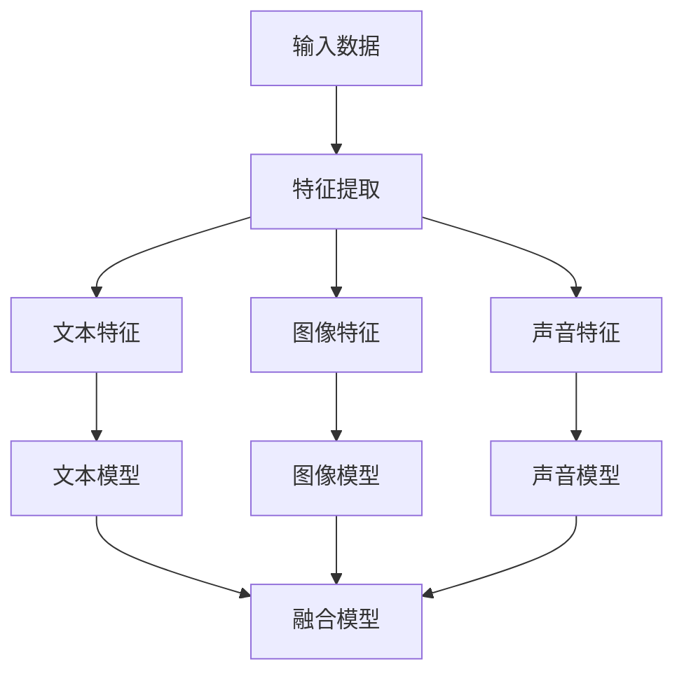

                 

### 大语言模型应用指南：多模态大语言模型

#### 关键词：多模态大语言模型、自然语言处理、机器学习、人工智能

#### 摘要：

本文将深入探讨多模态大语言模型的应用及其在自然语言处理、机器学习等领域的重要性。我们将首先介绍大语言模型的基本概念和背景，然后详细解释多模态大语言模型的工作原理，包括核心算法原理和具体操作步骤。接着，我们将通过数学模型和公式，详细讲解其背后的数学原理，并通过项目实战案例分析，展示如何在实际中应用多模态大语言模型。最后，我们将讨论多模态大语言模型在实际应用场景中的表现，并推荐相关的工具和资源，总结其发展趋势与挑战，并提供常见问题与解答。

#### 目录：

1. 背景介绍  
2. 核心概念与联系  
3. 核心算法原理 & 具体操作步骤  
4. 数学模型和公式 & 详细讲解 & 举例说明  
5. 项目实战：代码实际案例和详细解释说明  
6. 实际应用场景  
7. 工具和资源推荐  
8. 总结：未来发展趋势与挑战  
9. 附录：常见问题与解答  
10. 扩展阅读 & 参考资料

---

#### 1. 背景介绍

随着人工智能技术的快速发展，自然语言处理（NLP）已经成为人工智能领域的一个重要分支。传统单模态的NLP模型如文本分类、情感分析等，在处理简单文本任务时表现出色。然而，面对复杂多样的现实世界任务，这些单模态模型往往显得力不从心。多模态大语言模型的出现，为我们提供了一种全新的解决思路。

多模态大语言模型是指能够同时处理多种类型数据（如图像、声音、文本等）的语言模型。相较于单模态模型，多模态模型能够更好地捕捉到不同数据类型之间的关联性，从而在处理复杂任务时具有更高的准确性和鲁棒性。

近年来，多模态大语言模型在多个领域取得了显著的成果。例如，在图像描述生成领域，多模态大语言模型能够根据图像生成相应的文本描述，大大提高了图像内容理解和描述的准确性。在视频分析领域，多模态大语言模型可以结合视频帧和文本信息，实现更精确的情感识别和场景理解。此外，在问答系统、对话生成等领域，多模态大语言模型也展现出了强大的能力。

本文将围绕多模态大语言模型的应用，详细介绍其核心概念、算法原理、数学模型和实际应用案例，帮助读者全面了解这一前沿技术。

#### 2. 核心概念与联系

为了更好地理解多模态大语言模型，我们首先需要了解其核心概念和组成部分。

##### 2.1 大语言模型

大语言模型（Large Language Model）是一种基于深度学习的自然语言处理模型，通过大量文本数据训练，能够预测下一个单词或句子。典型的代表有GPT-3、BERT等。大语言模型的主要目标是通过学习语言的统计规律，生成符合语法和语义规则的文本。

##### 2.2 多模态数据

多模态数据是指包含多种类型数据的数据集，例如文本、图像、声音等。在多模态数据中，不同类型数据之间存在复杂的关联性，这为我们提供了更丰富的信息来源。

##### 2.3 多模态大语言模型

多模态大语言模型是在传统大语言模型的基础上，结合多模态数据，实现同时处理多种类型数据的能力。其核心思想是通过融合不同类型数据的信息，提高模型的鲁棒性和准确性。

##### 2.4 多模态数据的融合方法

多模态数据的融合是多模态大语言模型的关键步骤。常见的方法有特征级融合、决策级融合和模型级融合。

- 特征级融合：将不同类型数据的特征进行拼接，作为模型的输入。
- 决策级融合：将不同类型数据的模型输出进行拼接，然后通过集成学习方法进行融合。
- 模型级融合：使用多个独立的模型分别处理不同类型的数据，然后将模型输出进行拼接。

##### 2.5 应用场景

多模态大语言模型在多个领域具有广泛的应用场景：

- 图像描述生成：根据图像生成相应的文本描述。
- 视频分析：结合视频帧和文本信息，实现情感识别、场景理解等。
- 问答系统：结合文本和语音信息，提供更准确的问答服务。
- 对话生成：结合文本和语音信息，实现自然流畅的对话。

##### 2.6 Mermaid 流程图

下面是一个简单的 Mermaid 流程图，展示了多模态大语言模型的基本架构。

该流程图展示了多模态数据输入到模型后，经过特征提取和模型训练，最终生成融合模型的过程。

---

在下一部分，我们将深入探讨多模态大语言模型的核心算法原理和具体操作步骤。敬请期待。|>

