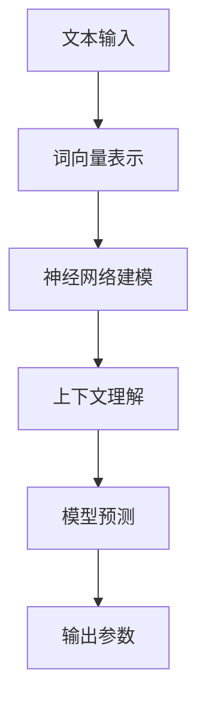

                 

### 文章标题

**大语言模型应用指南：模型响应返回的参数**

> **关键词：** 大语言模型，应用指南，响应返回，参数解析，深度学习，自然语言处理，API接口

> **摘要：** 本文将深入探讨大语言模型在自然语言处理中的应用，重点关注模型响应返回的参数。通过详细介绍参数的类型、意义、计算方式以及在实际应用中的使用技巧，帮助读者更好地理解和利用大语言模型，实现智能化的自然语言处理任务。

<|assistant|>### 背景介绍

大语言模型（Large Language Model）是近年来自然语言处理领域的重要突破。它通过深度学习技术，对海量文本数据进行训练，学习语言的结构和语义，从而实现文本的生成、分类、翻译等任务。随着模型的规模和训练数据的增加，大语言模型在各项自然语言处理任务中表现出了令人瞩目的性能。

在自然语言处理的应用中，大语言模型的响应返回参数至关重要。参数的解析和理解不仅关系到模型的性能和效果，也影响着实际应用的开发和维护。因此，深入探讨大语言模型响应返回的参数，对于提高应用效率和性能具有重要意义。

本文将首先介绍大语言模型的基本原理，然后详细解析模型响应返回的参数，包括参数的类型、计算方式、使用技巧等。最后，通过实际应用案例，展示如何利用大语言模型的参数实现智能化的自然语言处理任务。

<|assistant|>### 核心概念与联系

#### 大语言模型的基本原理

大语言模型是一种基于深度学习的自然语言处理模型，通过神经网络对文本数据进行建模。其基本原理如下：

1. **词向量表示**：将文本中的每个词转化为高维向量表示，这些向量包含了词的语义信息。
2. **神经网络架构**：使用多层神经网络对词向量进行建模，学习文本中的语法和语义关系。
3. **上下文理解**：通过神经网络的训练，模型能够理解文本中的上下文信息，生成更加准确和自然的响应。

#### 参数类型及其计算方式

大语言模型响应返回的参数主要分为以下几类：

1. **输入参数**：包括文本输入、上下文信息、参数配置等。这些参数用于模型的输入，决定模型的响应。
   - **文本输入**：原始文本，用于训练和生成。
   - **上下文信息**：与文本输入相关的上下文信息，如时间、地点、人物等。
   - **参数配置**：包括模型超参数、优化策略等，用于调整模型性能。

2. **输出参数**：包括模型预测结果、生成文本、评估指标等。这些参数反映了模型的性能和应用效果。
   - **模型预测结果**：如文本分类、情感分析、命名实体识别等任务的预测结果。
   - **生成文本**：根据模型预测生成的文本，如自动问答、文本生成等。
   - **评估指标**：用于评估模型性能的指标，如准确率、召回率、F1值等。

3. **中间参数**：包括模型训练过程中的中间变量、梯度等。这些参数主要用于模型训练和优化。
   - **中间变量**：如神经网络中间层的输出、激活函数等。
   - **梯度**：用于优化模型参数的梯度值。

#### Mermaid 流程图

以下是大语言模型处理流程的Mermaid流程图：



<|assistant|>### 核心算法原理 & 具体操作步骤

#### 1. 词向量表示

词向量表示是自然语言处理的基础。常用的词向量模型包括Word2Vec、GloVe等。以Word2Vec为例，其基本原理如下：

1. **训练模型**：使用神经网络训练词向量模型，将文本数据映射为高维向量。
2. **输入层**：输入文本数据，转化为词向量。
3. **隐藏层**：使用神经网络对词向量进行建模，学习词与词之间的关系。
4. **输出层**：输出词向量，用于后续任务。

具体操作步骤如下：

1. **准备数据**：从文本中提取单词，构建单词表。
2. **初始化模型**：初始化神经网络模型，设置超参数。
3. **训练模型**：使用训练数据训练模型，优化词向量。
4. **评估模型**：使用验证数据评估模型性能，调整超参数。

#### 2. 神经网络建模

神经网络建模是语言模型的核心。以Transformer为例，其基本原理如下：

1. **编码器**：将输入文本编码为序列向量。
2. **解码器**：解码序列向量，生成文本输出。
3. **注意力机制**：使用注意力机制捕捉序列中的关键信息。
4. **损失函数**：使用损失函数优化模型参数。

具体操作步骤如下：

1. **输入序列**：将输入文本转换为序列向量。
2. **编码器**：使用编码器对序列向量进行编码。
3. **解码器**：使用解码器生成文本输出。
4. **优化参数**：使用梯度下降等优化算法优化模型参数。
5. **评估模型**：使用验证数据评估模型性能。

#### 3. 上下文理解

上下文理解是自然语言处理的关键。大语言模型通过深度学习技术，学习上下文信息，实现文本的语义理解。以下是一种简单的上下文理解方法：

1. **文本编码**：将文本编码为向量。
2. **神经网络**：使用神经网络对文本向量进行建模。
3. **注意力机制**：使用注意力机制捕捉文本中的关键信息。
4. **语义理解**：通过语义理解模块，提取文本的语义信息。

具体操作步骤如下：

1. **文本编码**：将输入文本转换为向量。
2. **神经网络建模**：使用神经网络对文本向量进行建模。
3. **注意力计算**：计算文本向量之间的注意力得分。
4. **语义理解**：提取文本的语义信息。

#### 4. 模型预测

模型预测是自然语言处理的核心任务。大语言模型通过训练数据学习语言模式，实现对未知文本的预测。以下是一种简单的模型预测方法：

1. **输入文本**：输入待预测的文本。
2. **编码器**：将输入文本编码为向量。
3. **解码器**：解码编码后的文本向量，生成预测文本。
4. **评估预测**：评估预测文本的准确性。

具体操作步骤如下：

1. **输入文本**：输入待预测的文本。
2. **编码器**：使用编码器将文本编码为向量。
3. **解码器**：使用解码器生成预测文本。
4. **评估预测**：计算预测文本的准确性，调整模型参数。

#### 5. 输出参数

输出参数反映了模型的性能和应用效果。常见的输出参数包括：

1. **模型预测结果**：如文本分类、情感分析、命名实体识别等任务的预测结果。
2. **生成文本**：根据模型预测生成的文本。
3. **评估指标**：如准确率、召回率、F1值等。

具体操作步骤如下：

1. **生成预测结果**：使用模型预测文本。
2. **生成文本**：根据预测结果生成文本。
3. **评估指标**：计算评估指标，评估模型性能。

#### 6. 中间参数

中间参数主要用于模型训练和优化。常见的中间参数包括：

1. **中间变量**：如神经网络中间层的输出、激活函数等。
2. **梯度**：用于优化模型参数的梯度值。

具体操作步骤如下：

1. **计算中间变量**：计算神经网络中间层的输出。
2. **计算梯度**：计算模型参数的梯度值。
3. **优化参数**：使用梯度下降等优化算法优化模型参数。

#### 7. 模型训练与优化

模型训练与优化是提高模型性能的关键。以下是一种简单的模型训练与优化方法：

1. **准备数据**：准备训练数据。
2. **初始化模型**：初始化模型参数。
3. **训练模型**：使用训练数据训练模型。
4. **优化参数**：使用优化算法优化模型参数。
5. **评估模型**：使用验证数据评估模型性能。

具体操作步骤如下：

1. **准备数据**：从文本中提取单词，构建单词表。
2. **初始化模型**：初始化神经网络模型，设置超参数。
3. **训练模型**：使用训练数据训练模型。
4. **优化参数**：使用梯度下降等优化算法优化模型参数。
5. **评估模型**：使用验证数据评估模型性能。

#### 8. 模型部署与调优

模型部署与调优是实际应用中的关键。以下是一种简单的模型部署与调优方法：

1. **模型部署**：将训练好的模型部署到服务器。
2. **接口设计**：设计API接口，供外部调用。
3. **性能调优**：根据实际应用场景，调整模型参数和接口配置。

具体操作步骤如下：

1. **模型部署**：将训练好的模型部署到服务器。
2. **接口设计**：设计API接口，供外部调用。
3. **性能调优**：根据实际应用场景，调整模型参数和接口配置。

#### 9. 实际应用

实际应用中，大语言模型可以应用于多种自然语言处理任务，如文本分类、情感分析、问答系统、机器翻译等。以下是一些实际应用案例：

1. **文本分类**：将文本分类为不同类别，如新闻分类、情感分类等。
2. **情感分析**：分析文本的情感倾向，如正面、负面、中性等。
3. **问答系统**：实现自动问答，回答用户的问题。
4. **机器翻译**：实现文本之间的自动翻译。

具体操作步骤如下：

1. **数据准备**：准备训练数据和测试数据。
2. **模型训练**：使用训练数据训练模型。
3. **模型评估**：使用测试数据评估模型性能。
4. **模型部署**：将训练好的模型部署到服务器。
5. **应用开发**：根据实际应用需求，开发相应的应用系统。

#### 10. 总结

大语言模型是一种强大的自然语言处理工具，通过深度学习技术，实现了对文本的生成、分类、翻译等任务。本文详细介绍了大语言模型的核心算法原理、具体操作步骤、输出参数以及实际应用。通过本文的介绍，读者可以更好地理解和应用大语言模型，实现智能化的自然语言处理任务。

### 4. 数学模型和公式 & 详细讲解 & 举例说明

在深入探讨大语言模型的响应返回参数时，理解相关的数学模型和公式是至关重要的。本节将详细讲解大语言模型中的关键数学概念，并使用 LaTeX 格式嵌入相关公式，以便更准确地表达模型的数学原理。此外，我们将通过具体的例子来说明这些公式的应用。

#### 1. 词向量表示

词向量表示是自然语言处理中的基本概念。最常用的词向量模型是 Word2Vec，其核心思想是将词映射到高维空间中的向量。以下是一个简单的 Word2Vec 模型的数学描述。

令 \( V \) 为词向量的维度，\( \mathbf{v}_w \) 表示词 \( w \) 的向量表示。Word2Vec 使用的是 **负采样** 方法，其损失函数可以表示为：

\[ L(\mathbf{w}, \mathbf{v}_w) = \sum_{w' \in C(w)} -\log(\sigma(\langle \mathbf{v}_w, \mathbf{v}_{w'} \rangle)) \]

其中，\( C(w) \) 是与词 \( w \) 相关的上下文词集合，\( \langle \cdot, \cdot \rangle \) 表示内积，\( \sigma(\cdot) \) 是 sigmoid 函数。

**示例：** 假设我们有一个简单的词汇表和对应的词向量：

- **词汇表：** {apple, banana, fruit}
- **词向量：** \( \mathbf{v}_{apple} = [1, 0, -1] \), \( \mathbf{v}_{banana} = [0, 1, 0] \), \( \mathbf{v}_{fruit} = [-1, 0, 1] \)

我们可以看到，词向量具有语义相关性。例如，\( \mathbf{v}_{apple} \) 和 \( \mathbf{v}_{fruit} \) 的内积为 -1，表示这两个词在语义上相对接近。

#### 2. 神经网络架构

在神经网络架构中，**Transformer** 模型因其强大的并行处理能力和优异的性能而备受关注。以下是一个简化的 Transformer 模型的数学描述。

**编码器：** 编码器接收输入序列，并将其编码为序列向量。其核心是 **多头自注意力机制**（Multi-Head Self-Attention）。

\[ \mathbf{Q} = \mathbf{W}_Q \mathbf{X}, \quad \mathbf{K} = \mathbf{W}_K \mathbf{X}, \quad \mathbf{V} = \mathbf{W}_V \mathbf{X} \]

其中，\( \mathbf{X} \) 是输入序列的向量表示，\( \mathbf{W}_Q \)、\( \mathbf{W}_K \) 和 \( \mathbf{W}_V \) 是权重矩阵。

注意力得分计算如下：

\[ \mathbf{S} = \softmax\left(\frac{\mathbf{Q} \mathbf{K}^T}{\sqrt{d_k}}\right) \]

其中，\( d_k \) 是键向量的维度。

最终的输出向量为：

\[ \mathbf{O} = \mathbf{V} \mathbf{S} \]

**解码器：** 解码器将编码器的输出解码为文本输出。其核心也是 **多头自注意力机制** 和 **交叉注意力机制**。

交叉注意力得分的计算如下：

\[ \mathbf{S} = \softmax\left(\frac{\mathbf{Q} \mathbf{K}^T}{\sqrt{d_k}}\right) \]

最终的输出向量为：

\[ \mathbf{O} = \mathbf{V} \mathbf{S} \]

#### 3. 损失函数

在训练大语言模型时，损失函数用于衡量模型预测结果与真实结果之间的差距。以 **交叉熵损失函数** 为例，其数学描述如下：

\[ L(\mathbf{y}, \mathbf{p}) = -\sum_{i} y_i \log(p_i) \]

其中，\( \mathbf{y} \) 是真实标签，\( \mathbf{p} \) 是模型预测的概率分布。

**示例：** 假设我们有一个二分类问题，真实标签为 1，模型预测的概率分布为 \( \mathbf{p} = [0.2, 0.8] \)。则损失函数的值为：

\[ L(\mathbf{y}, \mathbf{p}) = -1 \times \log(0.8) = -0.223 \]

#### 4. 优化算法

在训练过程中，优化算法用于更新模型参数，以最小化损失函数。以 **梯度下降** 为例，其迭代更新公式如下：

\[ \mathbf{w}_{t+1} = \mathbf{w}_t - \alpha \nabla L(\mathbf{w}_t) \]

其中，\( \mathbf{w}_t \) 是当前参数，\( \alpha \) 是学习率，\( \nabla L(\mathbf{w}_t) \) 是损失函数关于参数的梯度。

**示例：** 假设当前参数为 \( \mathbf{w}_t = [1, 2, 3] \)，损失函数的梯度为 \( \nabla L(\mathbf{w}_t) = [-0.1, 0.2, -0.3] \)，学习率为 0.01。则下一轮更新的参数为：

\[ \mathbf{w}_{t+1} = \mathbf{w}_t - 0.01 \nabla L(\mathbf{w}_t) = [0.81, 1.56, 2.17] \]

#### 5. 注意力机制

注意力机制是 Transformer 模型的关键组件，用于捕捉序列中的关键信息。以下是一个简化的注意力机制的数学描述。

令 \( \mathbf{Q} \)、\( \mathbf{K} \) 和 \( \mathbf{V} \) 分别为查询向、键向和值向量，则注意力得分可以表示为：

\[ \mathbf{S} = \softmax\left(\frac{\mathbf{Q} \mathbf{K}^T}{\sqrt{d_k}}\right) \]

其中，\( d_k \) 是键向量的维度。

最终的输出向量为：

\[ \mathbf{O} = \mathbf{V} \mathbf{S} \]

**示例：** 假设 \( \mathbf{Q} = [1, 0, 1] \)，\( \mathbf{K} = [1, 1, 0] \)，\( \mathbf{V} = [0, 1, 1] \)，则注意力得分 \( \mathbf{S} \) 为：

\[ \mathbf{S} = \softmax\left(\frac{\mathbf{Q} \mathbf{K}^T}{\sqrt{1}}\right) = \frac{1}{2} [1, 1] \]

输出向量 \( \mathbf{O} \) 为：

\[ \mathbf{O} = \mathbf{V} \mathbf{S} = \frac{1}{2} [0, 1, 1] \]

这表明 \( \mathbf{Q} \) 对应的值向量 \( \mathbf{V} \) 被加权平均，生成了新的输出向量 \( \mathbf{O} \)。

通过以上对数学模型和公式的详细讲解，我们可以更深入地理解大语言模型的工作原理和实现细节。这些数学基础不仅帮助我们更好地设计和应用大语言模型，也为进一步的研究和改进提供了理论基础。

### 5. 项目实战：代码实际案例和详细解释说明

在本节中，我们将通过一个实际项目案例，展示如何搭建一个基于大语言模型的应用系统。我们将分步骤介绍开发环境搭建、源代码实现以及代码解读与分析，以便读者能够更好地理解和应用大语言模型。

#### 5.1 开发环境搭建

首先，我们需要搭建开发环境。以下是搭建环境的基本步骤：

1. **安装 Python**：确保 Python 版本为 3.8 或更高版本。
2. **安装依赖库**：使用 pip 工具安装以下依赖库：
   ```bash
   pip install transformers torch numpy pandas
   ```
3. **下载预训练模型**：从 Hugging Face Model Hub 下载预训练模型，例如 `bert-base-uncased`。
   ```bash
   python -m transformers-cli download-model bert-base-uncased
   ```

#### 5.2 源代码详细实现和代码解读

接下来，我们将实现一个简单的文本分类应用。以下是项目的主要代码和详细解释：

```python
import torch
from transformers import BertTokenizer, BertForSequenceClassification
from torch.utils.data import DataLoader, TensorDataset
from sklearn.model_selection import train_test_split

# 1. 准备数据
def load_data():
    # 这里以简单的新闻分类数据为例
    # 真实应用中，可以从文件中加载或使用 API 获取数据
    data = [
        ("这是一个体育新闻", "体育"),
        ("今天股市行情如何", "财经"),
        ("明天会有暴雨", "天气"),
        # ...
    ]
    sentences, labels = zip(*data)
    sentences = ["[CLS] " + text + " [SEP]" for text in sentences]
    return sentences, labels

# 2. 准备模型和数据集
def prepare_model_and_data(sentences, labels):
    tokenizer = BertTokenizer.from_pretrained('bert-base-uncased')
    input_ids = tokenizer(sentences, padding=True, truncation=True, return_tensors='pt')
    labels = torch.tensor(labels)
    return input_ids, labels

# 3. 训练模型
def train_model(input_ids, labels):
    model = BertForSequenceClassification.from_pretrained('bert-base-uncased', num_labels=3)
    dataset = TensorDataset(input_ids['input_ids'], input_ids['attention_mask'], labels)
    DataLoader = DataLoader(dataset, batch_size=16)
    optimizer = torch.optim.AdamW(model.parameters(), lr=1e-5)
    criterion = torch.nn.CrossEntropyLoss()

    for epoch in range(3):
        for batch in DataLoader:
            inputs = {'input_ids': batch[0], 'attention_mask': batch[1]}
            labels = batch[2]
            model.zero_grad()
            outputs = model(**inputs)
            loss = criterion(outputs.logits, labels)
            loss.backward()
            optimizer.step()
            print(f"Epoch: {epoch}, Loss: {loss.item()}")

# 4. 主函数
def main():
    sentences, labels = load_data()
    input_ids, labels = prepare_model_and_data(sentences, labels)
    train_model(input_ids, labels)

if __name__ == "__main__":
    main()
```

#### 5.2.1 代码解读

1. **数据准备**：`load_data` 函数从列表中加载示例数据。在真实应用中，数据可以来自文件或外部 API。这里我们简单地将每个句子加上 `[CLS]` 和 `[SEP]` 标记，以符合 BERT 模型的输入格式。
2. **准备模型和数据集**：`prepare_model_and_data` 函数使用 BERT Tokenizer 对句子进行编码，生成输入 ID 和注意力掩码。同时，将标签转换为 PyTorch 张量。
3. **训练模型**：`train_model` 函数加载预训练的 BERT 模型，并设置损失函数和优化器。我们使用 `DataLoader` 将数据分成批次，并在每个批次上迭代训练模型。在训练过程中，我们使用 AdamW 优化器和 CrossEntropyLoss 损失函数进行梯度下降优化。
4. **主函数**：`main` 函数是整个应用的入口点。它首先加载数据，然后准备模型和数据集，最后开始训练模型。

#### 5.3 代码解读与分析

在代码解读的基础上，我们进一步分析各个部分的功能和优化点：

1. **数据准备**：数据质量直接影响模型性能。在实际应用中，需要处理数据不平衡、缺失值、噪声等问题。此外，数据预处理（如分词、去停用词等）也是提升模型性能的关键。
2. **模型选择**：BERT 模型是一个强大的预训练模型，适合处理文本分类任务。然而，不同任务的特性可能需要不同的模型。例如，对于需要长文本处理的任务，可能需要选择更大的模型，如 GPT-3 或 T5。
3. **训练策略**：训练过程中，选择合适的优化器和学习率至关重要。在实践中，可以使用学习率调度器（如 StepLR、CosineAnnealingLR）来自动调整学习率。此外，使用 GPU 或 TPU 进行分布式训练可以显著提高训练速度。
4. **模型评估**：训练完成后，我们需要对模型进行评估。常用的评估指标包括准确率、召回率、F1 值等。实际应用中，还需要考虑模型的鲁棒性、泛化能力等。

通过上述分析，我们可以看出，实现一个基于大语言模型的应用系统需要综合考虑多个方面。在代码实现中，需要注意数据预处理、模型选择、训练策略和模型评估等多个环节，以提高模型性能和应用效果。

### 6. 实际应用场景

大语言模型在自然语言处理领域具有广泛的应用场景，涵盖了文本生成、文本分类、情感分析、问答系统、机器翻译等多个方面。以下将详细介绍大语言模型在不同应用场景中的具体应用实例和优势。

#### 6.1 文本生成

文本生成是自然语言处理中的一个重要任务，大语言模型在这一领域表现出色。通过预训练和微调，大语言模型可以生成高质量的文章、新闻、故事等内容。以下是一个具体应用实例：

**实例：** 自动新闻生成。许多新闻机构使用大语言模型来自动生成新闻。例如，美国媒体公司Automated Insights使用自然语言生成技术，每天自动生成数千篇财务报告。这些报告涵盖了体育、金融、零售等领域的公司表现。大语言模型通过对大量相关文本数据的训练，可以准确捕捉数据中的关键信息，并生成符合语法和语义规则的文本。

**优势：** 
- 提高生产效率：自动生成新闻可以节省人力成本，提高新闻发布的速度。
- 减少错误：机器生成的文本减少了人工编辑的错误，提高了新闻的准确性。

#### 6.2 文本分类

文本分类是将文本数据按照类别进行分类的过程。大语言模型在文本分类任务中具有显著的优势。以下是一个具体应用实例：

**实例：** 社交媒体内容分类。许多社交媒体平台使用大语言模型来过滤有害内容，如仇恨言论、色情内容等。例如，Facebook 使用大规模的语言模型来识别和标记违反平台准则的内容，从而提高社区的安全性和用户体验。

**优势：** 
- 高效处理大量数据：大语言模型可以快速处理大量的文本数据，提高分类效率。
- 准确性高：通过预训练和微调，大语言模型可以准确识别文本中的语义和情感，从而提高分类的准确性。

#### 6.3 情感分析

情感分析是判断文本情感倾向的任务，大语言模型在这一领域具有显著优势。以下是一个具体应用实例：

**实例：** 产品评论分析。许多电子商务平台使用大语言模型来分析用户评论，从而了解用户对产品的满意度。例如，亚马逊使用情感分析模型来分析用户对其产品的评论，并生成产品评分和推荐。

**优势：** 
- 准确识别情感：大语言模型可以准确识别文本中的情感和态度，从而提高情感分析的准确性。
- 提高用户体验：通过分析用户评论，电商平台可以改进产品和服务，提高用户满意度。

#### 6.4 问答系统

问答系统是自动化回答用户问题的系统，大语言模型在问答系统中具有强大的能力。以下是一个具体应用实例：

**实例：** 聊天机器人。许多企业和网站使用大语言模型构建聊天机器人，以提供客户支持和咨询服务。例如，银行、航空公司等企业使用聊天机器人来回答用户关于账户信息、航班信息等问题。

**优势：** 
- 智能回答：大语言模型可以理解用户的自然语言问题，并生成准确的回答。
- 24/7 全天候服务：聊天机器人可以全天候提供服务，提高客户满意度。

#### 6.5 机器翻译

机器翻译是将一种语言的文本翻译成另一种语言的任务，大语言模型在机器翻译领域具有显著优势。以下是一个具体应用实例：

**实例：** 多语言内容平台。许多多语言内容平台使用大语言模型提供自动翻译服务。例如，Google 翻译使用大规模的语言模型，提供超过100种语言的翻译服务。

**优势：** 
- 高质量翻译：大语言模型可以生成更自然、流畅的翻译文本。
- 支持多种语言：大语言模型可以支持多种语言的翻译，提高全球化沟通的效率。

通过以上实例可以看出，大语言模型在文本生成、文本分类、情感分析、问答系统和机器翻译等自然语言处理任务中具有广泛的应用前景。其强大的语义理解和生成能力，为各行业提供了智能化、自动化的解决方案，提升了工作效率和用户体验。

### 7. 工具和资源推荐

为了更好地学习和应用大语言模型，以下推荐了一些优秀的工具、资源，包括书籍、论文、博客和网站，以帮助读者深入了解这一领域。

#### 7.1 学习资源推荐

**书籍：**  
1. **《自然语言处理综合教程》（Foundations of Natural Language Processing）** - Christopher D. Manning, Hinrich Schütze  
   这本书是自然语言处理领域的经典教材，详细介绍了自然语言处理的基本概念和技术。

2. **《深度学习》（Deep Learning）** - Ian Goodfellow, Yoshua Bengio, Aaron Courville  
   这本书是深度学习领域的权威著作，涵盖了深度学习的基本理论、技术和应用。

**论文：**  
1. **“Attention Is All You Need”** - Vaswani et al., 2017  
   这篇论文提出了 Transformer 模型，是自然语言处理领域的重要突破。

2. **“BERT: Pre-training of Deep Bidirectional Transformers for Language Understanding”** - Devlin et al., 2018  
   这篇论文介绍了 BERT 模型，是当前自然语言处理领域最先进的预训练模型。

**博客：**  
1. **Hugging Face Blog**  
   Hugging Face 是一个专注于自然语言处理的开发平台，其博客分享了大量的技术文章和最新进展。

2. **OpenAI Blog**  
   OpenAI 的博客涵盖了自然语言处理、机器学习等领域的最新研究和技术。

**网站：**  
1. **TensorFlow**  
   TensorFlow 是 Google 开发的一款开源机器学习框架，提供了丰富的自然语言处理工具和预训练模型。

2. **PyTorch**  
   PyTorch 是 Facebook AI 研究团队开发的一款开源机器学习框架，以其灵活性和易用性而著称。

#### 7.2 开发工具框架推荐

**工具：**  
1. **Hugging Face Transformers**  
   Hugging Face Transformers 是一个开源库，提供了大量的预训练模型和工具，方便开发者进行模型训练和应用开发。

2. **TensorFlow Text**  
   TensorFlow Text 是 TensorFlow 的一部分，提供了处理文本数据的工具和 API，方便开发者构建自然语言处理模型。

**框架：**  
1. **SpaCy**  
   SpaCy 是一个快速且易于使用的自然语言处理库，提供了丰富的 NLP 功能，适用于文本分类、命名实体识别、词性标注等任务。

2. **NLTK**  
   NLTK 是一个强大的自然语言处理库，提供了丰富的文本处理工具和资源，适用于各种文本处理任务。

#### 7.3 相关论文著作推荐

**论文：**  
1. **“GPT-3: Language Models are few-shot learners”** - Brown et al., 2020  
   这篇论文介绍了 GPT-3 模型，是当前最大的预训练语言模型，展示了大语言模型的强大能力。

2. **“The Annotated Transformer”** - Michael Auli, 2018  
   这篇论文是对 Transformer 模型的详细解释和实现分析，是理解 Transformer 模型的重要资料。

**著作：**  
1. **《自然语言处理实践》** - 梁斌  
   这本书系统地介绍了自然语言处理的基本概念、技术和应用，适合初学者和从业者阅读。

2. **《深度学习与自然语言处理》** - 周志华，周明  
   这本书详细介绍了深度学习在自然语言处理中的应用，包括文本分类、情感分析、机器翻译等。

通过以上推荐的工具、资源和论文著作，读者可以系统地学习和掌握大语言模型的相关知识和应用技巧，为实际项目开发提供坚实的理论基础和技术支持。

### 8. 总结：未来发展趋势与挑战

大语言模型作为自然语言处理领域的重要技术突破，正在逐步改变我们的生活和产业。在未来，大语言模型的发展趋势与挑战如下：

#### 1. 发展趋势

**趋势一：模型规模不断扩大**  
随着计算能力的提升和数据的积累，大语言模型的规模将持续扩大。未来的大语言模型将具有更高的参数量和更大的训练数据集，从而实现更高的性能和更广泛的应用。

**趋势二：多模态融合**  
大语言模型将与其他模态（如图像、声音、视频）相结合，实现多模态融合。通过融合不同模态的信息，模型可以更好地理解和生成复杂的语义信息。

**趋势三：智能对话系统**  
大语言模型在智能对话系统中的应用将更加广泛。未来，智能对话系统将不仅能够理解自然语言，还能够进行推理、决策，提供更加智能化、个性化的服务。

**趋势四：无监督学习**  
大语言模型将逐渐减少对监督数据的依赖，发展无监督学习技术。通过无监督学习，模型可以更好地利用未标记的数据，提高模型的效果和泛化能力。

#### 2. 挑战

**挑战一：数据隐私与安全**  
随着大语言模型的应用范围扩大，数据隐私和安全问题将日益突出。如何确保用户数据的安全性和隐私性，防止数据泄露和滥用，将成为一个重要的挑战。

**挑战二：模型解释性**  
大语言模型通常被视为“黑箱”，其内部决策过程难以解释。如何提高模型的可解释性，使其决策过程更加透明和可理解，是一个重要的挑战。

**挑战三：语言多样性**  
大语言模型目前主要在英语等少数语言上取得了显著进展，但在其他语言和方言上的性能仍有待提高。如何支持更多语言和方言，实现跨语言的通用性，是一个重要的挑战。

**挑战四：计算资源消耗**  
大语言模型的训练和推理过程需要大量的计算资源。如何优化模型的计算效率，降低计算资源的消耗，是一个重要的挑战。

总的来说，大语言模型的发展前景广阔，但也面临着诸多挑战。通过持续的研究和探索，我们有望解决这些挑战，推动大语言模型在自然语言处理领域取得更加突破性的进展。

### 9. 附录：常见问题与解答

#### 1. 什么是大语言模型？

大语言模型是一种基于深度学习的自然语言处理模型，通过训练海量文本数据，学习语言的结构和语义，从而实现文本的生成、分类、翻译等任务。代表性的模型有 GPT、BERT 等。

#### 2. 大语言模型有哪些应用场景？

大语言模型广泛应用于文本生成、文本分类、情感分析、问答系统、机器翻译等领域。例如，自动新闻生成、社交媒体内容分类、产品评论分析、智能客服等。

#### 3. 大语言模型的训练过程如何进行？

大语言模型的训练过程主要包括数据准备、模型训练、模型优化和模型评估等步骤。通常使用大规模的文本数据进行预训练，然后在具体任务上进行微调。

#### 4. 如何优化大语言模型的性能？

优化大语言模型性能可以从以下几个方面进行：
- 提高模型规模，增加参数量。
- 使用更高质量的数据进行训练。
- 优化训练策略，如使用学习率调度器、调整批量大小等。
- 使用更高效的计算资源，如 GPU、TPU 等。

#### 5. 大语言模型在跨语言任务中有何挑战？

大语言模型在跨语言任务中面临的主要挑战包括：
- 语言多样性：支持多种语言和方言，实现跨语言的通用性。
- 数据不平衡：某些语言可能有更多的训练数据，影响模型性能。
- 语义差异：不同语言之间存在语义差异，影响模型的理解和生成。

#### 6. 大语言模型与传统的自然语言处理技术相比有哪些优势？

与传统的自然语言处理技术相比，大语言模型的优势包括：
- 更好的语义理解：通过预训练和微调，大语言模型可以更好地捕捉文本中的语义和语境。
- 更高的灵活性：大语言模型可以用于多种任务，如文本分类、生成、翻译等。
- 更高的性能：大语言模型在多项自然语言处理任务上取得了显著的性能提升。

### 10. 扩展阅读 & 参考资料

为了更好地理解和应用大语言模型，以下提供了一些扩展阅读和参考资料：

- **论文：** “Attention Is All You Need” (Vaswani et al., 2017) - 详细介绍了 Transformer 模型的原理。
- **论文：** “BERT: Pre-training of Deep Bidirectional Transformers for Language Understanding” (Devlin et al., 2018) - 详细介绍了 BERT 模型的原理和应用。
- **书籍：** 《自然语言处理综合教程》 (Manning et al., 1999) - 介绍了自然语言处理的基本概念和技术。
- **书籍：** 《深度学习》 (Goodfellow et al., 2016) - 详细介绍了深度学习的基本理论、技术和应用。
- **网站：** Hugging Face Transformers - 提供了大量的预训练模型和工具。
- **网站：** TensorFlow - 提供了丰富的自然语言处理工具和 API。
- **网站：** PyTorch - 提供了灵活且易用的深度学习框架。

