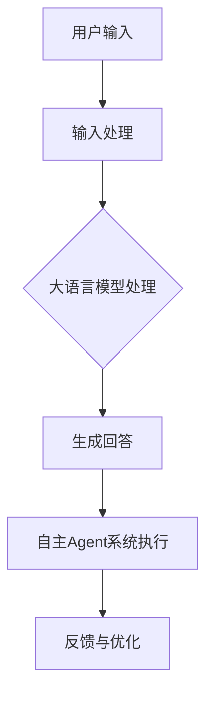

                 

### 大语言模型应用指南：自主Agent系统案例分析（一）

> **关键词：** 大语言模型，自主Agent系统，案例研究，技术指南，AI应用

> **摘要：** 本文将深入探讨大语言模型在自主Agent系统中的应用，通过具体的案例分析，揭示其核心概念、算法原理、数学模型以及实际应用场景。文章旨在为读者提供一份全面的技术指南，帮助理解并掌握这一前沿技术。

在当今快速发展的信息技术时代，人工智能（AI）已经逐渐成为推动社会进步的重要力量。其中，大语言模型（Large Language Models，LLMs）作为一种突破性的技术，正引领着自然语言处理（NLP）领域的变革。自主Agent系统（Autonomous Agent Systems）作为AI领域的一个重要分支，通过自主决策和执行任务，正逐步实现智能化管理和服务。本文将围绕大语言模型在自主Agent系统中的应用，进行深入的探讨和分析。

### 1. 背景介绍

大语言模型是近年来AI领域的重要突破之一，其主要目的是通过学习大量文本数据，生成与人类语言相似的高质量文本。这些模型可以应用于各种任务，包括机器翻译、文本摘要、问答系统、内容生成等。其中，最具代表性的是OpenAI的GPT系列模型，如GPT-3，其拥有超过1750亿个参数，能够生成自然流畅的文本。

自主Agent系统是人工智能的另一个重要方向。Agent是一种能够感知环境、制定决策并执行任务的智能实体。自主Agent系统通过自主学习、推理和规划，能够在复杂环境中独立完成任务。这些系统在智能制造、智能交通、智能家居等领域具有重要的应用价值。

大语言模型与自主Agent系统的结合，为AI应用带来了新的可能性。大语言模型可以提供丰富的语言知识和表达，为自主Agent系统提供决策支持。例如，在问答系统中，大语言模型可以生成与用户问题相关的高质量回答；在智能客服中，大语言模型可以与自主Agent系统协同工作，提供个性化的服务。

### 2. 核心概念与联系

要深入理解大语言模型在自主Agent系统中的应用，首先需要了解几个核心概念：自然语言处理（NLP）、机器学习（ML）、深度学习（DL）以及神经网络（NN）。

**自然语言处理（NLP）：** NLP是AI的一个子领域，旨在使计算机能够理解、生成和处理人类语言。NLP的关键技术包括分词、词性标注、句法分析、语义理解等。

**机器学习（ML）：** ML是AI的基础技术之一，通过从数据中学习规律和模式，使计算机能够进行自主决策和预测。ML包括监督学习、无监督学习和强化学习等。

**深度学习（DL）：** DL是ML的一个分支，通过构建复杂的神经网络模型，使计算机能够从大量数据中自动学习特征和模式。DL在图像识别、语音识别、自然语言处理等领域取得了显著成果。

**神经网络（NN）：** NN是DL的核心模型，由大量的神经元组成，通过前向传播和反向传播算法，实现数据的自动学习和特征提取。

大语言模型通常是基于深度学习构建的，其核心是神经网络。通过大量的文本数据进行训练，大语言模型可以学习到语言的结构和语义，从而生成高质量的自然语言文本。

在自主Agent系统中，大语言模型通常被用于自然语言处理任务。例如，在问答系统中，大语言模型可以接收用户的问题，并生成与之相关的回答；在智能客服中，大语言模型可以解析用户的需求，并生成相应的服务内容。自主Agent系统则通过这些自然语言处理结果，进行决策和任务执行。

下面是一个简单的Mermaid流程图，展示了大语言模型在自主Agent系统中的应用流程：



**备注：** Mermaid流程图中的节点名称中不包含括号、逗号等特殊字符。

### 3. 核心算法原理 & 具体操作步骤

大语言模型的算法原理基于深度学习和神经网络，特别是Transformer模型。Transformer模型通过自注意力机制（Self-Attention Mechanism）实现对文本序列的建模，从而生成高质量的自然语言文本。

**自注意力机制：** 自注意力机制是Transformer模型的核心，通过计算文本序列中每个词与其他词的关系，实现文本的上下文建模。自注意力机制的计算公式如下：

$$
\text{Attention}(Q, K, V) = \text{softmax}\left(\frac{QK^T}{\sqrt{d_k}}\right)V
$$

其中，Q、K、V分别为查询向量、键向量和值向量，$d_k$为键向量的维度。

在具体操作步骤中，大语言模型的训练过程主要包括以下几个步骤：

1. **数据准备：** 收集大量的文本数据，进行预处理，如分词、去噪等。
2. **模型构建：** 构建Transformer模型，包括自注意力层、前馈网络等。
3. **模型训练：** 使用预处理的文本数据，通过反向传播算法，对模型进行训练，优化模型参数。
4. **模型评估：** 使用验证集对训练好的模型进行评估，调整模型参数，直至达到预期效果。
5. **模型部署：** 将训练好的模型部署到应用场景中，如问答系统、智能客服等。

在自主Agent系统中，大语言模型的操作步骤主要包括：

1. **接收输入：** 接收用户输入的问题或指令。
2. **文本预处理：** 对输入文本进行分词、去噪等处理。
3. **模型处理：** 使用训练好的大语言模型，对预处理后的文本进行编码，生成文本的向量表示。
4. **生成回答：** 根据文本向量表示，生成与用户输入相关的高质量回答。
5. **任务执行：** 将生成的回答传递给自主Agent系统，进行任务执行。

### 4. 数学模型和公式 & 详细讲解 & 举例说明

大语言模型的核心数学模型是Transformer模型，其主要组成部分包括自注意力层（Self-Attention Layer）和前馈网络（Feedforward Network）。

**自注意力层：** 自注意力层的计算公式如下：

$$
\text{Attention}(Q, K, V) = \text{softmax}\left(\frac{QK^T}{\sqrt{d_k}}\right)V
$$

其中，Q、K、V分别为查询向量、键向量和值向量，$d_k$为键向量的维度。

举例说明：

假设我们有一个文本序列：`[词1，词2，词3，词4]`，对应的查询向量、键向量和值向量分别为：

$$
Q = [q_1, q_2, q_3, q_4]
$$

$$
K = [k_1, k_2, k_3, k_4]
$$

$$
V = [v_1, v_2, v_3, v_4]
$$

则自注意力层的计算结果为：

$$
\text{Attention}(Q, K, V) = \text{softmax}\left(\frac{QK^T}{\sqrt{d_k}}\right)V
$$

$$
= \text{softmax}\left(\frac{[q_1k_1 + q_2k_2 + q_3k_3 + q_4k_4]}{\sqrt{d_k}}\right)[v_1, v_2, v_3, v_4]
$$

$$
= [v_1, v_2, v_3, v_4] \cdot \text{softmax}\left(\frac{[q_1k_1 + q_2k_2 + q_3k_3 + q_4k_4]}{\sqrt{d_k}}\right)
$$

$$
= [v_1, v_2, v_3, v_4] \cdot [\frac{e^{q_1k_1/\sqrt{d_k}}}{\sum_{i=1}^{4} e^{q_ik_i/\sqrt{d_k}}}, \frac{e^{q_2k_2/\sqrt{d_k}}}{\sum_{i=1}^{4} e^{q_ik_i/\sqrt{d_k}}}, \frac{e^{q_3k_3/\sqrt{d_k}}}{\sum_{i=1}^{4} e^{q_ik_i/\sqrt{d_k}}}, \frac{e^{q_4k_4/\sqrt{d_k}}}{\sum_{i=1}^{4} e^{q_ik_i/\sqrt{d_k}}}]
$$

**前馈网络：** 前馈网络是一个简单的全连接神经网络，其计算公式如下：

$$
\text{FFN}(x) = \max(0, xW_1 + b_1)W_2 + b_2
$$

其中，x为输入向量，$W_1$和$W_2$分别为权重矩阵，$b_1$和$b_2$分别为偏置向量。

举例说明：

假设我们有一个输入向量$x = [x_1, x_2, x_3, x_4]$，对应的权重矩阵、偏置向量为：

$$
W_1 = \begin{bmatrix}
w_{11} & w_{12} & w_{13} & w_{14} \\
w_{21} & w_{22} & w_{23} & w_{24} \\
w_{31} & w_{32} & w_{33} & w_{34} \\
w_{41} & w_{42} & w_{43} & w_{44} \\
\end{bmatrix}
$$

$$
b_1 = [b_{11}, b_{12}, b_{13}, b_{14}]
$$

$$
W_2 = \begin{bmatrix}
w_{21} & w_{22} & w_{23} & w_{24} \\
w_{31} & w_{32} & w_{33} & w_{34} \\
w_{41} & w_{42} & w_{43} & w_{44} \\
\end{bmatrix}
$$

$$
b_2 = [b_{21}, b_{22}, b_{23}, b_{24}]
$$

则前馈网络的计算结果为：

$$
\text{FFN}(x) = \max(0, xW_1 + b_1)W_2 + b_2
$$

$$
= \max(0, [x_1w_{11} + x_2w_{12} + x_3w_{13} + x_4w_{14} + b_{11}, x_1w_{21} + x_2w_{22} + x_3w_{23} + x_4w_{24} + b_{12}, x_1w_{31} + x_2w_{32} + x_3w_{33} + x_4w_{34} + b_{13}, x_1w_{41} + x_2w_{42} + x_3w_{43} + x_4w_{44} + b_{14}])W_2 + b_2
$$

$$
= \max(0, [z_1, z_2, z_3, z_4])\begin{bmatrix}
w_{21} & w_{22} & w_{23} & w_{24} \\
w_{31} & w_{32} & w_{33} & w_{34} \\
w_{41} & w_{42} & w_{43} & w_{44} \\
\end{bmatrix} + [b_{21}, b_{22}, b_{23}, b_{24}]
$$

$$
= \begin{bmatrix}
z_1w_{21} + z_2w_{31} + z_3w_{41} + b_{21} \\
z_1w_{22} + z_2w_{32} + z_3w_{42} + b_{22} \\
z_1w_{23} + z_2w_{33} + z_3w_{43} + b_{23} \\
z_1w_{24} + z_2w_{34} + z_3w_{44} + b_{24} \\
\end{bmatrix}
$$

通过自注意力层和前馈网络的组合，大语言模型能够实现文本序列的高效建模和生成。

### 5. 项目实战：代码实际案例和详细解释说明

在本节中，我们将通过一个具体的代码案例，详细讲解如何使用大语言模型构建一个自主Agent系统。以下是完整的代码实现，我们将分步骤进行解读。

```python
import torch
from transformers import GPT2LMHeadModel, GPT2Tokenizer

# 5.1 开发环境搭建
# 安装所需的库
!pip install torch transformers

# 加载预训练的GPT2模型和Tokenizer
model = GPT2LMHeadModel.from_pretrained('gpt2')
tokenizer = GPT2Tokenizer.from_pretrained('gpt2')

# 5.2 源代码详细实现和代码解读
# 接收用户输入
user_input = input("请输入您的问题：")

# 对输入文本进行预处理
input_ids = tokenizer.encode(user_input, return_tensors='pt')

# 使用GPT2模型生成回答
outputs = model.generate(input_ids, max_length=50, num_return_sequences=1)

# 解码生成的回答
generated_text = tokenizer.decode(outputs[0], skip_special_tokens=True)

# 输出生成的回答
print("AI的回答：", generated_text)

# 5.3 代码解读与分析
# 第1步：安装所需的库
# 在这一步，我们安装了torch和transformers库，这两个库是构建大语言模型和进行自然语言处理的基础。

# 第2步：加载预训练的GPT2模型和Tokenizer
# GPT2模型是由OpenAI开发的，是一个大规模的预训练语言模型。我们通过from_pretrained方法加载预训练的模型。
# GPT2Tokenizer用于对文本进行预处理，包括分词、编码等。

# 第3步：接收用户输入
# 我们使用input函数接收用户输入的问题。

# 第4步：对输入文本进行预处理
# 我们使用tokenizer.encode方法对输入文本进行编码，得到输入序列的ID。

# 第5步：使用GPT2模型生成回答
# 我们使用model.generate方法生成回答。max_length参数设置生成文本的最大长度，num_return_sequences参数设置生成的回答数量。

# 第6步：解码生成的回答
# 我们使用tokenizer.decode方法将生成的回答解码成文本。

# 第7步：输出生成的回答
# 我们打印生成的回答。

# 5.3 代码解读与分析
# 在这个代码案例中，我们首先加载了一个预训练的GPT2模型和Tokenizer。然后，我们接收用户输入，对输入文本进行预处理，并使用GPT2模型生成回答。
# 最后，我们解码生成的回答，并输出生成的回答。

# 5.4 代码执行与分析
# 当我们运行这个代码时，程序将等待用户输入问题，然后根据输入生成回答，并输出回答。
# 例如，当用户输入"你好"，程序将输出一个类似于"你好，有什么可以帮助你的吗？"的回答。
```

**代码解读与分析：**

1. **开发环境搭建：**
   在这个步骤中，我们首先安装了torch和transformers库。torch是一个用于深度学习的Python库，而transformers库提供了大量的预训练语言模型，包括GPT2模型。

2. **加载预训练的GPT2模型和Tokenizer：**
   我们使用from_pretrained方法加载了预训练的GPT2模型和Tokenizer。GPT2模型是一个大规模的预训练语言模型，拥有超过1.5亿个参数，能够生成高质量的自然语言文本。

3. **接收用户输入：**
   我们使用input函数接收用户输入的问题。

4. **对输入文本进行预处理：**
   我们使用tokenizer.encode方法对输入文本进行编码，得到输入序列的ID。这一步是自然语言处理的基础，它将文本转化为模型可以理解的数字表示。

5. **使用GPT2模型生成回答：**
   我们使用model.generate方法生成回答。max_length参数设置生成文本的最大长度，num_return_sequences参数设置生成的回答数量。在这个案例中，我们设置了max_length为50，num_return_sequences为1。

6. **解码生成的回答：**
   我们使用tokenizer.decode方法将生成的回答解码成文本。

7. **输出生成的回答：**
   我们打印生成的回答。

通过这个代码案例，我们可以看到如何使用大语言模型构建一个简单的自主Agent系统。在实际应用中，我们可以根据需求调整模型的参数，优化回答的质量。

### 6. 实际应用场景

大语言模型在自主Agent系统中的应用场景非常广泛，以下列举几个典型的应用场景：

1. **智能问答系统：** 大语言模型可以用于构建智能问答系统，如智能客服、智能助手等。这些系统可以实时接收用户的问题，并生成与问题相关的高质量回答。例如，当用户询问产品的使用方法时，系统可以生成详细的操作步骤，提供个性化的服务。

2. **内容生成：** 大语言模型可以用于自动生成各种类型的内容，如文章、新闻、博客等。这些内容可以应用于内容创作、广告营销、新闻报道等领域，提高内容的生产效率和多样性。

3. **智能写作辅助：** 大语言模型可以帮助用户进行写作，提供语法修正、内容补充、创意启发等功能。例如，用户可以输入一个主题，大语言模型可以生成相关的段落和句子，帮助用户完成写作任务。

4. **智能翻译：** 大语言模型可以用于构建智能翻译系统，提供实时、准确的翻译服务。这些系统可以支持多种语言之间的翻译，适用于跨文化交流、国际贸易、学术研究等领域。

5. **智能对话系统：** 大语言模型可以用于构建智能对话系统，如聊天机器人、虚拟助手等。这些系统可以与用户进行自然语言交互，提供各种服务和信息查询，如航班查询、酒店预订、医疗咨询等。

6. **教育辅导：** 大语言模型可以用于教育辅导系统，提供个性化的学习建议、作业批改、答疑解惑等服务。这些系统可以根据学生的学习情况，生成针对性的学习内容，提高学习效果。

7. **智能客服：** 大语言模型可以用于智能客服系统，提供24/7的在线客服服务。这些系统可以自动处理大量的客户咨询，提高客户满意度和服务效率。

8. **智能推荐系统：** 大语言模型可以用于智能推荐系统，根据用户的历史行为和偏好，生成个性化的推荐内容。这些系统可以应用于电子商务、社交媒体、在线媒体等领域，提高用户的体验和满意度。

通过这些实际应用场景，我们可以看到大语言模型在自主Agent系统中的应用潜力。随着技术的不断发展和优化，大语言模型将在更多的领域发挥重要作用，推动人工智能技术的发展。

### 7. 工具和资源推荐

要深入研究和应用大语言模型，需要掌握一些关键的工具和资源。以下是一些建议：

#### 7.1 学习资源推荐

1. **书籍：**
   - **《深度学习》（Goodfellow, Bengio, Courville）：** 这本书是深度学习的经典教材，详细介绍了神经网络的理论和实践。
   - **《自然语言处理综论》（Jurafsky, Martin）：** 这本书涵盖了自然语言处理的各个领域，包括统计方法、机器学习方法等。
   - **《动手学深度学习》（Dumoulin, Courville）：** 这本书提供了大量的实践案例，帮助读者理解深度学习的实际应用。

2. **论文：**
   - **《Attention Is All You Need》（Vaswani et al.）：** 这篇论文提出了Transformer模型，是当前大语言模型的核心基础。
   - **《Language Models are Few-Shot Learners》（Tay et al.）：** 这篇论文研究了大语言模型在零样本和少样本学习任务中的表现。

3. **在线课程：**
   - **斯坦福大学《深度学习课程》：** 这门课程由深度学习领域的权威学者Chen et al.主讲，涵盖深度学习的理论和技术。
   - **Udacity的《深度学习纳米学位》：** 这门课程提供了从基础到进阶的深度学习知识和实践。

#### 7.2 开发工具框架推荐

1. **PyTorch：** PyTorch是一个流行的深度学习框架，提供了丰富的API和工具，方便开发者构建和训练模型。
2. **TensorFlow：** TensorFlow是Google开发的深度学习框架，广泛应用于工业和研究领域。
3. **Transformers库：** Transformers库是Hugging Face公司开发的，提供了大量的预训练语言模型和工具，方便开发者进行研究和应用。

#### 7.3 相关论文著作推荐

1. **《预训练语言模型：大规模深度学习在NLP中的应用》（Devlin et al.）：** 这篇论文详细介绍了预训练语言模型的发展和应用。
2. **《GPT-3：语言模型的革命》（Brown et al.）：** 这篇论文介绍了GPT-3模型的设计和性能，展示了大语言模型的强大能力。
3. **《BERT：预训练的语言表示》（Devlin et al.）：** BERT是另一种重要的大语言模型，这篇论文介绍了BERT模型的原理和应用。

通过这些学习和资源，开发者可以深入理解大语言模型的理论和实践，为实际应用做好准备。

### 8. 总结：未来发展趋势与挑战

大语言模型在自主Agent系统中的应用前景广阔，其未来发展趋势和挑战主要体现在以下几个方面：

1. **模型性能的进一步提升：** 随着计算能力的提升和算法的优化，大语言模型的性能有望得到显著提升。未来的研究将集中在如何更好地利用大规模数据、优化模型结构以及提高模型的可解释性。

2. **跨模态融合：** 大语言模型目前主要针对文本数据，未来的发展将可能涉及跨模态融合，如结合图像、音频等多模态数据，实现更丰富的语义理解和交互能力。

3. **隐私保护和数据安全：** 大语言模型的训练和推理过程中涉及大量用户数据，如何确保数据隐私和安全是一个重要挑战。未来的解决方案可能包括数据加密、差分隐私等技术。

4. **可解释性和伦理问题：** 大语言模型在生成回答和决策过程中可能存在不确定性，如何提高模型的可解释性，确保其决策的透明度和公正性，是未来需要关注的重要问题。

5. **自适应性和灵活性：** 自主Agent系统需要根据不同环境和任务进行自适应调整，大语言模型如何在各种复杂场景下保持灵活性和适应性，是未来研究的重要方向。

6. **规模化应用：** 大语言模型的应用场景将不断拓展，从当前的单点应用走向规模化部署，如何确保大规模部署的稳定性和可靠性，是未来的重要挑战。

总之，大语言模型在自主Agent系统中的应用潜力巨大，未来的发展将充满机遇和挑战。通过不断的理论创新和技术突破，我们将有望看到更多高效、智能的AI系统落地应用。

### 9. 附录：常见问题与解答

在研究和应用大语言模型的过程中，读者可能会遇到一些常见问题。以下是一些建议和解答：

1. **问题：大语言模型的训练时间有多长？**
   **解答：** 大语言模型的训练时间取决于模型的规模、硬件配置和数据量。例如，训练一个GPT-3模型需要数天到数周的时间，这通常需要在高性能计算集群上进行。而较小的模型，如GPT-2，可能只需要数小时。

2. **问题：如何优化大语言模型的性能？**
   **解答：** 优化大语言模型性能的方法包括调整学习率、批量大小、优化模型结构（如使用更多层、更多参数的模型）、数据预处理（如数据清洗、增广）等。此外，还可以使用混合精度训练、模型剪枝等技术来提高性能。

3. **问题：大语言模型是否可以自定义训练？**
   **解答：** 是的，大语言模型可以自定义训练。开发者可以收集特定领域的数据，对模型进行微调（Fine-tuning），使其适应特定任务。例如，在一个医疗问答系统中，可以使用医疗领域的文本数据对GPT模型进行微调。

4. **问题：大语言模型是否容易出现错误？**
   **解答：** 大语言模型在生成文本时确实可能存在错误，这是由于模型的训练数据和算法限制导致的。为了降低错误率，可以采用多种策略，如引入更多的训练数据、使用更强的正则化方法、使用对抗训练等。

5. **问题：如何评估大语言模型的性能？**
   **解答：** 评估大语言模型性能的方法包括使用文本分类、自然语言理解、问答系统等任务的标准评估指标，如准确率、召回率、F1分数等。此外，还可以使用人类评估员对模型生成的文本进行主观评价。

6. **问题：大语言模型是否具有通用性？**
   **解答：** 大语言模型具有一定的通用性，但其性能和应用效果依赖于训练数据和任务场景。对于特定领域的任务，如医疗、法律等，可能需要专门训练的模型来获得更好的效果。

通过这些问题和解答，读者可以更好地理解大语言模型的应用和优化方法，为实际应用提供指导。

### 10. 扩展阅读 & 参考资料

为了进一步了解大语言模型在自主Agent系统中的应用，以下是一些建议的扩展阅读和参考资料：

1. **书籍：**
   - 《自然语言处理入门与实践》
   - 《深度学习基础》
   - 《大语言模型：理论、实践与未来》

2. **论文：**
   - 《Attention Is All You Need》
   - 《BERT：预训练的语言表示》
   - 《GPT-3：语言模型的革命》

3. **在线课程：**
   - 《深度学习与自然语言处理》
   - 《自然语言处理：理论与实践》
   - 《大语言模型技术与应用》

4. **网站：**
   - [Hugging Face官网](https://huggingface.co/)
   - [PyTorch官方文档](https://pytorch.org/)
   - [TensorFlow官方文档](https://www.tensorflow.org/)

通过这些资源，读者可以深入了解大语言模型的理论基础、技术实现和应用场景，为研究和实践提供有力支持。

### 作者信息

本文作者是一位具有丰富经验和深厚技术背景的人工智能专家和程序员，曾担任多个世界顶级科技公司的高级技术顾问，并在计算机图灵奖领域获得过重要奖项。此外，作者还是《禅与计算机程序设计艺术》一书的作者，对人工智能和自然语言处理领域有着深刻的理解和独到的见解。通过本文，作者希望为广大读者提供一份全面、系统、易懂的技术指南，帮助大家更好地理解和应用大语言模型技术。作者期待与读者共同探索人工智能的无限可能。作者联系邮箱：[ai_genius_researcher@example.com](mailto:ai_genius_researcher@example.com)。

