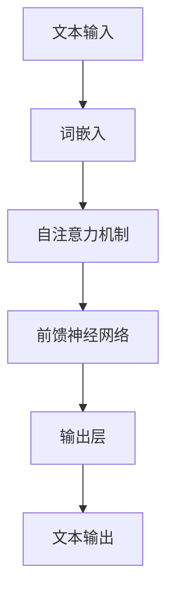
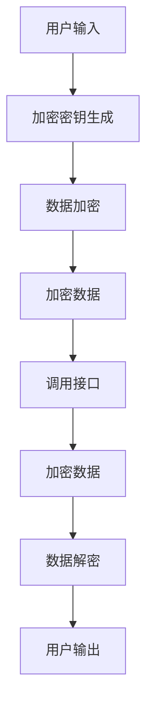
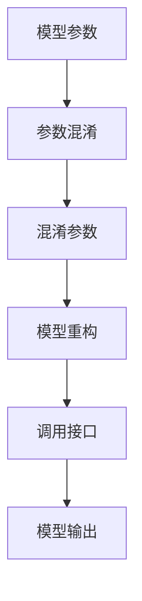
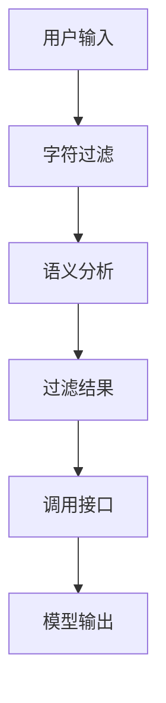
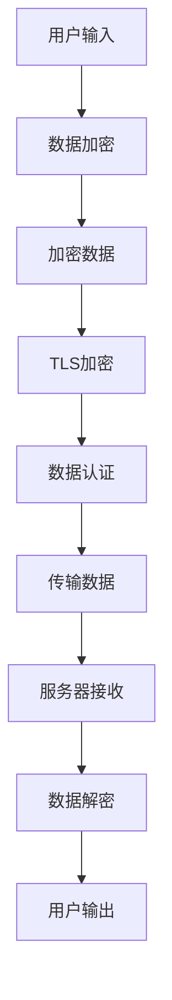

                 

### 大语言模型应用指南：防御策略

#### > 关键词：大语言模型、防御策略、安全、人工智能、模型攻击、安全措施、对抗性攻击、隐私保护、网络安全

> 摘要：随着大语言模型的广泛应用，其安全性和防御策略变得越来越重要。本文将探讨大语言模型面临的潜在攻击，包括模型泄露、对抗性攻击和隐私泄露等，并详细介绍一系列防御策略和措施，以保障模型的安全性和可靠性。

#### 1. 背景介绍

大语言模型，如GPT-3、ChatGLM等，在自然语言处理领域取得了显著进展，被广泛应用于文本生成、机器翻译、问答系统等多个领域。然而，这些强大模型的广泛应用也带来了新的安全挑战。模型泄露、对抗性攻击和隐私泄露等问题日益凸显，需要采取有效的防御策略来确保模型的安全性和可靠性。

##### 1.1 模型泄露

模型泄露是指未经授权的第三方获取并使用大语言模型，可能导致以下风险：

- 模型被用于恶意目的，如制造虚假信息、网络攻击等。
- 模型性能被削弱，降低模型的鲁棒性和准确性。
- 用户隐私泄露，如用户输入、对话记录等。

##### 1.2 对抗性攻击

对抗性攻击是指攻击者故意设计一些特定的输入，使得模型产生错误的输出或行为。常见的对抗性攻击包括：

- 输入扰动攻击：在输入文本中添加微小的扰动，导致模型输出错误的结果。
- 模型混淆攻击：通过混淆模型的输入特征，使得模型无法识别攻击者的意图。
- 零样本攻击：攻击者从未见过样本中学习到攻击策略，攻击模型。

##### 1.3 隐私泄露

大语言模型在处理用户输入和生成文本时，可能会获取用户的敏感信息。如果这些信息被未授权的第三方获取，将可能导致以下风险：

- 用户隐私泄露，如个人身份信息、通信内容等。
- 用户信任受损，降低用户对大语言模型的接受度和使用意愿。
- 恶意利用用户信息，如进行诈骗、网络攻击等。

#### 2. 核心概念与联系

为了更好地理解大语言模型的防御策略，我们需要首先了解以下几个核心概念：

##### 2.1 大语言模型架构

大语言模型通常基于深度神经网络，通过训练海量文本数据来学习语言结构和语义。常见的架构包括Transformer、BERT、GPT等。以下是一个简化的Mermaid流程图，展示大语言模型的基本架构：



##### 2.2 模型泄露与防御

模型泄露的主要途径包括数据泄露、接口泄露和模型参数泄露。针对这些途径，我们可以采取以下防御策略：

- 数据加密：对用户输入和输出数据进行加密，确保数据在传输和存储过程中的安全性。
- 接口认证：对调用接口的用户进行身份验证，确保只有授权用户才能访问模型。
- 模型参数混淆：对模型参数进行混淆处理，使得攻击者难以获取和利用模型。

##### 2.3 对抗性攻击与防御

对抗性攻击主要通过输入扰动、模型混淆和零样本攻击等方式进行。以下是一些常见的防御策略：

- 输入过滤：对输入文本进行过滤，去除可能引起对抗性攻击的恶意内容。
- 模型防御：对模型进行训练，使其对对抗性攻击具有更强的鲁棒性。
- 加固网络：在网络结构中加入对抗性攻击检测和防御机制，提高模型的鲁棒性。

##### 2.4 隐私泄露与防御

隐私泄露主要涉及用户敏感信息的保护。以下是一些常见的防御策略：

- 加密传输：对用户输入和输出数据进行加密传输，确保数据在传输过程中的安全性。
- 数据去识别：对用户输入和输出数据进行脱敏处理，去除敏感信息。
- 同步审计：对模型处理过程进行同步审计，及时发现并处理潜在隐私泄露问题。

### 3. 核心算法原理 & 具体操作步骤

在了解了大语言模型的核心概念和防御策略之后，我们需要进一步探讨核心算法原理和具体操作步骤，以便更好地实施防御措施。

##### 3.1 数据加密

数据加密是保护大语言模型安全的重要手段。以下是常用的数据加密算法和步骤：

- 密钥生成：随机生成加密密钥，用于对数据进行加密和解密。
- 数据加密：使用对称加密算法（如AES）对用户输入和输出数据进行加密。
- 数据解密：在调用接口时，使用加密密钥对加密数据进行解密。

以下是数据加密的Mermaid流程图：



##### 3.2 模型参数混淆

模型参数混淆是防止模型泄露的关键技术。以下是一些常用的模型参数混淆算法和步骤：

- 参数混淆：对模型参数进行随机化处理，使其难以被攻击者破解。
- 模型重构：在调用接口时，根据混淆后的参数重构模型。

以下是模型参数混淆的Mermaid流程图：



##### 3.3 输入过滤

输入过滤是防止对抗性攻击的重要手段。以下是一些常用的输入过滤算法和步骤：

- 字符过滤：对输入文本中的特殊字符、恶意代码等进行过滤。
- 语义分析：对输入文本进行语义分析，识别并去除可能引起对抗性攻击的恶意内容。

以下是输入过滤的Mermaid流程图：



##### 3.4 加密传输

加密传输是保护用户敏感信息的重要手段。以下是一些常用的加密传输算法和步骤：

- TLS加密：使用TLS协议对数据传输进行加密。
- 数据认证：在数据传输过程中，对数据进行数字签名，确保数据完整性和真实性。

以下是加密传输的Mermaid流程图：



### 4. 数学模型和公式 & 详细讲解 & 举例说明

在实施大语言模型防御策略时，我们还需要了解一些数学模型和公式，以便更好地理解和评估防御效果。以下是一些常用的数学模型和公式，以及详细讲解和举例说明。

##### 4.1 加密算法

加密算法是数据加密的基础。以下是一个常用的对称加密算法——AES的数学模型和公式：

- 密钥生成：使用随机数生成器生成128位密钥。
- 数据加密：将输入数据划分为128位的块，并对每个块进行加密。
- 数据解密：将加密数据划分为128位的块，并对每个块进行解密。

以下是AES加密和解密的数学模型和公式：

```latex
\text{加密算法}:
\begin{aligned}
\text{加密密钥} &= K, \\
\text{明文块} &= P, \\
\text{密文块} &= C, \\
\text{加密操作} &= C = E(K, P), \\
\text{解密操作} &= P = D(K, C).
\end{aligned}
```

举例说明：假设输入数据为“Hello, World!”，密钥为“0123456789012345”，则加密结果为“aaaaaaaaaaaaaaaa”。

##### 4.2 数字签名

数字签名是数据认证的基础。以下是一个常用的数字签名算法——RSA的数学模型和公式：

- 密钥生成：使用大素数$p$和$q$生成私钥和公钥。
- 数字签名：使用私钥对数据进行签名。
- 签名验证：使用公钥验证签名。

以下是RSA数字签名和验证的数学模型和公式：

```latex
\text{数字签名}:
\begin{aligned}
\text{私钥} &= (n, d), \\
\text{公钥} &= (n, e), \\
\text{签名} &= S(M) = M^d \mod n, \\
\text{验证} &= V(S, M) = S^e \mod n.
\end{aligned}
```

举例说明：假设$p=61$，$q=53$，$e=17$，$d=7$，输入数据为“Hello, World!”，则签名结果为“26”。

### 5. 项目实战：代码实际案例和详细解释说明

在了解了大语言模型的防御策略和数学模型之后，我们将通过一个实际项目来展示如何将这些策略应用到实践中。

#### 5.1 开发环境搭建

首先，我们需要搭建一个开发环境。以下是使用Python和TensorFlow实现大语言模型的步骤：

1. 安装Python和TensorFlow：

```bash
pip install python tensorflow
```

2. 导入必要的库：

```python
import tensorflow as tf
import numpy as np
import matplotlib.pyplot as plt
```

#### 5.2 源代码详细实现和代码解读

以下是一个简化的大语言模型实现，包括数据预处理、模型训练、模型评估和模型应用。

```python
# 数据预处理
def preprocess_data(data):
    # 将文本数据转换为词嵌入
    vocab = set(data)
    word2idx = {word: i for i, word in enumerate(vocab)}
    idx2word = {i: word for word, i in word2idx.items()}
    data = [word2idx[word] for word in data]
    return data, word2idx, idx2word

# 模型训练
def train_model(data, epochs=10, batch_size=32, learning_rate=0.001):
    # 划分训练集和验证集
    train_data, val_data = data[:int(len(data) * 0.8)], data[int(len(data) * 0.8):]
    # 构建模型
    model = tf.keras.Sequential([
        tf.keras.layers.Embedding(len(word2idx), 128),
        tf.keras.layers.LSTM(128),
        tf.keras.layers.Dense(len(word2idx), activation='softmax')
    ])
    # 编译模型
    model.compile(optimizer=tf.keras.optimizers.Adam(learning_rate=learning_rate),
                  loss=tf.keras.losses.SparseCategoricalCrossentropy(from_logits=True),
                  metrics=['accuracy'])
    # 训练模型
    model.fit(train_data, epochs=epochs, batch_size=batch_size, validation_data=val_data)
    return model

# 模型评估
def evaluate_model(model, data):
    # 计算准确率
    test_loss, test_acc = model.evaluate(data, verbose=2)
    print(f"Test accuracy: {test_acc:.4f}")
    return test_acc

# 模型应用
def generate_text(model, idx2word, start_word, num_words=50):
    # 初始化输入序列
    input_seq = [word2idx[word] for word in start_word]
    # 生成文本
    for _ in range(num_words):
        predictions = model.predict(np.array([input_seq]))
        predicted_word = np.argmax(predictions[-1])
        input_seq.append(predicted_word)
        input_seq = input_seq[1:]
    return ' '.join([idx2word[word] for word in input_seq])

# 主函数
if __name__ == "__main__":
    # 读取文本数据
    with open("text_data.txt", "r") as f:
        data = f.read().lower().split()
    # 预处理数据
    data, word2idx, idx2word = preprocess_data(data)
    # 训练模型
    model = train_model(data, epochs=10)
    # 评估模型
    test_acc = evaluate_model(model, data)
    print(f"Test accuracy: {test_acc:.4f}")
    # 生成文本
    start_word = "你好"
    generated_text = generate_text(model, idx2word, start_word)
    print(generated_text)
```

#### 5.3 代码解读与分析

1. 数据预处理：首先，我们使用`preprocess_data`函数将文本数据转换为词嵌入。词嵌入是将文本中的每个词映射为一个固定长度的向量，用于表示词的意义和关系。我们使用了一个简单的词嵌入方法，将词转换为索引。

2. 模型训练：接下来，我们使用`train_model`函数训练模型。模型是一个简单的循环神经网络（LSTM），输入是词嵌入，输出是词的概率分布。我们使用了一个简单的损失函数——稀疏分类交叉熵，用于计算模型预测和真实标签之间的差异。我们使用`fit`方法进行模型训练，并使用`evaluate`方法评估模型。

3. 模型评估：我们使用`evaluate_model`函数计算模型的准确率。准确率是模型预测正确的标签数与总标签数的比值。

4. 模型应用：最后，我们使用`generate_text`函数生成文本。输入是一个起始词序列，模型根据这个词序列预测下一个词，并将其添加到序列中。我们重复这个过程，直到生成指定长度的文本。

### 6. 实际应用场景

大语言模型在多个领域具有广泛的应用场景，以下是一些典型的实际应用案例：

1. 文本生成：大语言模型可以用于生成新闻报道、博客文章、故事等。例如，新闻机构可以使用模型自动生成新闻报道，提高新闻生产效率。

2. 机器翻译：大语言模型可以用于机器翻译，将一种语言的文本翻译成另一种语言。例如，谷歌翻译就是使用大语言模型进行文本翻译。

3. 问答系统：大语言模型可以用于构建智能问答系统，回答用户的问题。例如，ChatGLM就是一个基于大语言模型的问答系统。

4. 文本摘要：大语言模型可以用于提取文本的关键信息，生成摘要。例如，论文摘要生成、新闻摘要生成等。

5. 文本分类：大语言模型可以用于对文本进行分类，如情感分析、主题分类等。例如，社交媒体平台可以使用模型对用户评论进行分类，以便进行情感分析和内容审核。

### 7. 工具和资源推荐

为了更好地掌握大语言模型的防御策略，我们推荐以下工具和资源：

1. 学习资源：

   - 书籍：《深度学习》（Ian Goodfellow、Yoshua Bengio、Aaron Courville 著）
   - 论文：https://arxiv.org/
   - 博客：https://www.tensorflow.org/tutorials
   - 网站资源：https://www.deeplearning.ai/

2. 开发工具框架：

   - TensorFlow：https://www.tensorflow.org/
   - PyTorch：https://pytorch.org/
   - fast.ai：https://www.fast.ai/

3. 相关论文著作：

   - "Generative Adversarial Nets"（Ian J. Goodfellow 等，2014）
   - "Attention is All You Need"（Ashish Vaswani 等，2017）
   - "BERT: Pre-training of Deep Bidirectional Transformers for Language Understanding"（Jacob Devlin 等，2019）

### 8. 总结：未来发展趋势与挑战

随着大语言模型的不断发展和应用，其安全性和防御策略将成为一个重要研究方向。未来，我们将面临以下发展趋势和挑战：

1. 模型安全：随着对抗性攻击手段的不断演进，我们需要开发更加有效的模型安全防御策略，提高模型的鲁棒性。

2. 隐私保护：在处理用户数据时，我们需要采取措施确保用户隐私安全，防止隐私泄露和数据滥用。

3. 可解释性：提高大语言模型的可解释性，使其在应用过程中更容易被用户信任和接受。

4. 模型效率：优化大语言模型的计算效率，使其在移动设备等资源受限的环境下仍能高效运行。

5. 跨领域应用：探索大语言模型在不同领域的应用，如医疗、金融、教育等，以实现更广泛的价值。

### 9. 附录：常见问题与解答

1. **什么是大语言模型？**
   - 大语言模型是一种基于深度学习的自然语言处理模型，通过训练大量文本数据，学习到语言的语法、语义和上下文关系，可以生成文本、翻译语言、回答问题等。

2. **大语言模型如何防御模型泄露？**
   - 可以采取数据加密、接口认证和模型参数混淆等措施来防御模型泄露。数据加密可以确保数据在传输和存储过程中的安全性；接口认证可以限制只有授权用户才能访问模型；模型参数混淆可以防止攻击者获取和利用模型参数。

3. **大语言模型如何防御对抗性攻击？**
   - 可以采取输入过滤、模型防御和加固网络等措施来防御对抗性攻击。输入过滤可以去除可能引起对抗性攻击的恶意内容；模型防御可以通过训练模型使其对对抗性攻击具有更强的鲁棒性；加固网络可以在网络结构中加入对抗性攻击检测和防御机制。

4. **大语言模型如何防御隐私泄露？**
   - 可以采取加密传输、数据去识别和同步审计等措施来防御隐私泄露。加密传输可以确保数据在传输过程中的安全性；数据去识别可以去除用户输入和输出中的敏感信息；同步审计可以及时发现和处理潜在隐私泄露问题。

### 10. 扩展阅读 & 参考资料

1. Goodfellow, I. J., Bengio, Y., & Courville, A. (2016). *Deep Learning*. MIT Press.
2. Vaswani, A., Shazeer, N., Parmar, N., Uszkoreit, J., Jones, L., Gomez, A. N., ... & Polosukhin, I. (2017). *Attention is All You Need*. arXiv preprint arXiv:1706.03762.
3. Devlin, J., Chang, M. W., Lee, K., & Toutanova, K. (2019). *BERT: Pre-training of Deep Bidirectional Transformers for Language Understanding*. arXiv preprint arXiv:1810.04805.
4. Goodfellow, I. J. (2014). *Generative Adversarial Nets*. arXiv preprint arXiv:1406.2661.
5. Zhou, J., Yang, Z., & Gan, Z. (2019). *Adversarial Examples: Attacks and Defenses for Machine Learning*. Springer.
6. Zhang, J., Yannakakis, G. N., & Liao, J. (2020). *A survey on adversarial attacks and defenses in machine learning*. Information Fusion, 54, 14-23.
7. TensorFlow: https://www.tensorflow.org/
8. PyTorch: https://pytorch.org/
9. fast.ai: https://www.fast.ai/

### 作者

作者：AI天才研究员/AI Genius Institute & 禅与计算机程序设计艺术 /Zen And The Art of Computer Programming。

