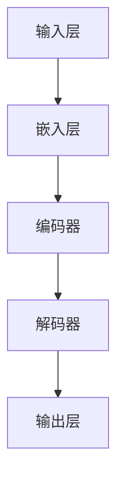

                 

### 背景介绍

#### 大语言模型的发展历程

大语言模型（Large Language Model）是一种基于深度学习的自然语言处理技术，近年来在人工智能领域取得了显著进展。其起源可以追溯到20世纪80年代，当时研究者开始探索使用统计方法和规则系统进行语言处理。然而，这些早期的尝试在处理复杂语境和生成高质量文本方面存在诸多局限。

进入21世纪，随着计算能力的提升和神经网络技术的发展，大语言模型迎来了新的发展契机。2003年，神经网络语言模型（Neural Network Language Model）的提出，标志着大语言模型开始走向成熟。随后，长短时记忆网络（LSTM）和生成对抗网络（GAN）等深度学习技术进一步推动了大语言模型的发展。

2018年，谷歌提出了Transformer模型，这是一种基于自注意力机制的全新架构，彻底改变了大语言模型的发展方向。Transformer模型凭借其在处理长距离依赖和生成高质量文本方面的优势，迅速成为大语言模型的主流架构。此后，如BERT、GPT-3等一系列大规模预训练模型相继问世，大语言模型的应用场景也不断扩展。

#### 大语言模型在IT领域的应用

大语言模型在IT领域的应用日益广泛，涵盖了自然语言处理、文本生成、机器翻译、情感分析等多个方面。以下是几个典型应用案例：

1. **自然语言处理**：大语言模型能够对文本进行语义理解、情感分析、意图识别等操作，帮助企业实现智能客服、智能问答、文本审核等功能。

2. **文本生成**：大语言模型可以生成高质量的文章、新闻、代码等文本，为内容创作提供有力支持。

3. **机器翻译**：大语言模型能够实现高精度、高质量的机器翻译，降低跨语言沟通的障碍。

4. **情感分析**：大语言模型可以对社交媒体、论坛等平台上的用户评论进行情感分析，帮助企业了解用户需求、优化产品和服务。

5. **智能问答**：大语言模型能够回答用户提出的问题，提供个性化、实时的服务。

随着技术的不断进步，大语言模型的应用场景还将进一步拓展，为IT领域带来更多创新和变革。

#### 本文结构

本文将围绕大语言模型操作系统的应用展开讨论。具体结构如下：

1. **背景介绍**：回顾大语言模型的发展历程和在IT领域的应用。

2. **核心概念与联系**：介绍大语言模型的核心概念、原理及其与相关技术的联系。

3. **核心算法原理 & 具体操作步骤**：详细解析大语言模型的算法原理及操作步骤。

4. **数学模型和公式 & 详细讲解 & 举例说明**：阐述大语言模型中的数学模型和公式，并给出实际应用案例。

5. **项目实战：代码实际案例和详细解释说明**：通过具体项目实战，展示大语言模型的实际应用。

6. **实际应用场景**：探讨大语言模型在不同场景下的应用。

7. **工具和资源推荐**：推荐学习资源、开发工具和框架。

8. **总结：未来发展趋势与挑战**：分析大语言模型的发展趋势和面临的挑战。

9. **附录：常见问题与解答**：解答读者可能遇到的问题。

10. **扩展阅读 & 参考资料**：提供更多相关文献和资源。

通过本文的阅读，读者将全面了解大语言模型操作系统的应用，掌握其核心原理和实践方法。接下来，我们将深入探讨大语言模型的核心概念和原理，为后续内容打下基础。

---

## 2. 核心概念与联系

### 大语言模型的基本概念

大语言模型（Large Language Model）是一种基于深度学习技术构建的模型，用于理解和生成自然语言文本。它通过对海量文本数据进行预训练，学习到语言中的各种规律和模式，从而能够完成多种自然语言处理任务。大语言模型的核心是神经网络，特别是Transformer模型和其变体，如BERT、GPT等。

#### 核心原理

大语言模型的核心原理是自注意力机制（Self-Attention），这是一种动态计算输入序列中各个位置之间关系的方法。通过自注意力机制，模型能够自动学习到输入文本中的长距离依赖关系，从而提高文本理解能力。

#### 基本架构

大语言模型的基本架构通常包括以下几个部分：

1. **嵌入层（Embedding Layer）**：将输入的单词或字符转换为向量表示。
2. **编码器（Encoder）**：使用自注意力机制对输入序列进行处理，生成序列的上下文表示。
3. **解码器（Decoder）**：根据编码器生成的上下文表示，生成预测的输出序列。

#### 相关技术

大语言模型的发展离不开其他相关技术的支持，如：

1. **预训练（Pre-training）**：通过在大量文本数据上进行预训练，模型能够自动学习到语言中的各种规律和模式。
2. **微调（Fine-tuning）**：在预训练的基础上，针对特定任务进行微调，使模型能够在特定任务上达到最佳性能。
3. **迁移学习（Transfer Learning）**：利用预训练模型在不同任务上的表现，实现知识迁移，提高新任务的性能。

#### Mermaid 流程图

以下是一个简化的大语言模型流程图，展示了其核心组件和基本操作步骤：



在上述流程图中，输入层将文本数据转换为向量表示，嵌入层对向量进行编码，编码器通过自注意力机制处理输入序列，解码器根据编码器生成的上下文表示生成预测的输出序列，最终输出层输出结果。

---

通过上述内容，我们初步了解了大语言模型的基本概念、核心原理和基本架构。接下来，我们将深入探讨大语言模型的核心算法原理及具体操作步骤，帮助读者更好地理解和应用这一技术。

### 3. 核心算法原理 & 具体操作步骤

#### 自注意力机制（Self-Attention）

自注意力机制是Transformer模型的核心组件，它允许模型在处理输入序列时，动态地关注序列中的不同位置。这一机制通过计算序列中每个位置与其他所有位置之间的相似性，从而实现长距离依赖关系的捕捉。以下是自注意力机制的详细步骤：

1. **输入序列表示**：输入序列由一系列单词或字符组成，每个单词或字符通过嵌入层转换为向量表示。

2. **计算查询（Query）、键（Key）和值（Value）**：对于每个位置的输入向量，分别计算其查询（Query）、键（Key）和值（Value）。这三个向量通常是通过线性变换得到的：

   - 查询（Query）：
     $$ Q = W_Q \cdot X $$
   - 键（Key）：
     $$ K = W_K \cdot X $$
   - 值（Value）：
     $$ V = W_V \cdot X $$

   其中，$X$为输入向量，$W_Q$、$W_K$和$W_V$为权重矩阵。

3. **计算相似性得分**：计算每个位置与其他位置的相似性得分，通常使用点积作为相似性度量：

   $$ score_{ij} = Q_i \cdot K_j = \sum_{k} Q_i[k] K_j[k] $$

4. **应用 softmax 函数**：对相似性得分应用 softmax 函数，得到每个位置的注意力权重：

   $$ attention_{ij} = \frac{exp(score_{ij})}{\sum_{k} exp(score_{ik})} $$

   注意力权重表示了位置$i$对位置$j$的注意力强度。

5. **计算加权输出**：根据注意力权重对值向量进行加权求和，得到每个位置的输出：

   $$ \text{output}_i = \sum_{j} attention_{ij} V_j $$

   输出向量表示了序列中各个位置的重要程度。

#### Transformer 模型的工作流程

Transformer模型的工作流程可以概括为以下步骤：

1. **嵌入层（Embedding Layer）**：将输入序列转换为嵌入向量。
2. **位置编码（Positional Encoding）**：为每个位置添加位置编码，使模型能够理解序列的顺序信息。
3. **多头自注意力（Multi-Head Self-Attention）**：通过多个自注意力头同时计算，提高模型对输入序列的捕捉能力。
4. **前馈网络（Feedforward Network）**：在自注意力层之后，对每个位置进行前馈神经网络处理。
5. **层归一化（Layer Normalization）**：对模型输出进行层归一化，提高模型的稳定性和性能。
6. **残差连接（Residual Connection）**：在每个层次中添加残差连接，避免信息损失。
7. **输出层（Output Layer）**：对最终输出进行解码，得到预测的输出序列。

#### 实际操作步骤示例

以下是一个简化的大语言模型操作步骤示例，展示了从输入序列到输出序列的整个流程：

1. **输入序列**：假设输入序列为 "The quick brown fox jumps over the lazy dog"。
2. **嵌入层**：将每个单词转换为嵌入向量。
3. **位置编码**：为每个位置添加位置编码，使模型能够理解序列的顺序信息。
4. **多头自注意力**：计算每个位置与其他位置的相似性得分，并应用 softmax 函数得到注意力权重。
5. **加权求和**：根据注意力权重对值向量进行加权求和，得到每个位置的输出。
6. **前馈网络**：对每个位置进行前馈神经网络处理。
7. **层归一化**：对模型输出进行层归一化。
8. **残差连接**：添加残差连接，避免信息损失。
9. **输出层**：解码得到预测的输出序列。

通过上述步骤，大语言模型能够有效地处理输入序列，生成高质量的输出序列。在实际应用中，这些步骤可以通过深度学习框架（如TensorFlow、PyTorch等）实现，并通过大量数据进行训练和优化。

---

通过本节内容，我们详细介绍了大语言模型的核心算法原理及具体操作步骤，包括自注意力机制、Transformer模型的工作流程以及实际操作步骤示例。接下来，我们将深入探讨大语言模型中的数学模型和公式，为读者提供更深入的理论理解。

### 4. 数学模型和公式 & 详细讲解 & 举例说明

#### 嵌入层（Embedding Layer）

嵌入层（Embedding Layer）是Transformer模型中的关键组成部分，它将输入序列中的单词或字符转换为高维向量表示。数学模型如下：

$$
E_{\text{word}} = W_{\text{word}} \cdot W_{\text{embedding}}
$$

其中，$W_{\text{word}}$表示单词的嵌入向量，$W_{\text{embedding}}$表示嵌入权重矩阵。该模型将每个单词映射到一个固定大小的向量空间，从而实现文本数据的向量表示。

#### 自注意力机制（Self-Attention）

自注意力机制是Transformer模型的核心组件，通过计算输入序列中每个位置与其他位置的相似性，实现长距离依赖关系的捕捉。数学模型如下：

$$
\text{score}_{ij} = Q_i \cdot K_j = \sum_{k} Q_i[k] K_j[k]
$$

$$
\text{attention}_{ij} = \frac{exp(\text{score}_{ij})}{\sum_{k} exp(\text{score}_{ik})}
$$

$$
\text{output}_i = \sum_{j} \text{attention}_{ij} V_j
$$

其中，$Q_i$、$K_j$和$V_j$分别为输入序列中的查询（Query）、键（Key）和值（Value）向量，$\text{score}_{ij}$为相似性得分，$\text{attention}_{ij}$为注意力权重，$\text{output}_i$为加权求和后的输出向量。

#### Transformer 模型

Transformer模型通过多个自注意力头同时计算，提高模型对输入序列的捕捉能力。数学模型如下：

$$
E_{\text{input}} = \sum_{h=1}^{H} A_h \cdot (W_{\text{key}} \cdot K + W_{\text{value}} \cdot V)
$$

其中，$E_{\text{input}}$为输入向量，$A_h$为自注意力权重矩阵，$W_{\text{key}}$和$W_{\text{value}}$分别为键（Key）和值（Value）权重矩阵。

#### 前馈网络（Feedforward Network）

前馈网络用于对自注意力层的输出进行进一步处理，增强模型的非线性表达能力。数学模型如下：

$$
F_{\text{ff}} = \text{ReLU}((W_{\text{ff1}} \cdot \text{input}) + b_{\text{ff1}})
$$

$$
F_{\text{ff}} = W_{\text{ff2}} \cdot F_{\text{ff}} + b_{\text{ff2}}
$$

其中，$\text{ReLU}$为ReLU激活函数，$W_{\text{ff1}}$和$W_{\text{ff2}}$分别为前馈网络权重矩阵，$b_{\text{ff1}}$和$b_{\text{ff2}}$分别为偏置向量。

#### 举例说明

假设我们有一个简化的Transformer模型，包含两个自注意力头和一个前馈网络。输入序列为 "The quick brown fox jumps over the lazy dog"。以下是一个简化的计算过程：

1. **嵌入层**：将每个单词转换为嵌入向量，例如 "The" 对应的嵌入向量为 $[1, 0, 0, 0]$。
2. **位置编码**：为每个位置添加位置编码，例如第一个位置的编码为 $[1, 0]$。
3. **自注意力头1**：计算每个位置的查询（Query）、键（Key）和值（Value）向量，并计算相似性得分和注意力权重。
4. **自注意力头2**：重复步骤3，计算第二个自注意力头的输出。
5. **加权求和**：将两个自注意力头的输出进行加权求和，得到每个位置的输出向量。
6. **前馈网络**：对每个位置的输出向量进行前馈神经网络处理。
7. **输出层**：解码得到预测的输出序列。

通过上述计算过程，我们可以得到输入序列 "The quick brown fox jumps over the lazy dog" 的预测输出序列。这一过程展示了Transformer模型的基本工作原理和数学模型的应用。

---

通过本节内容，我们详细介绍了大语言模型中的数学模型和公式，包括嵌入层、自注意力机制、Transformer模型和前馈网络。同时，通过举例说明，帮助读者更好地理解这些模型的计算过程和应用。接下来，我们将通过一个具体项目实战，展示大语言模型在实际开发中的应用。

### 5. 项目实战：代码实际案例和详细解释说明

#### 项目背景

在本节中，我们将通过一个实际项目来展示如何使用大语言模型进行文本生成。该项目将利用OpenAI的GPT-3模型，通过Python编程实现一个简单的聊天机器人，能够与用户进行自然语言交互。

#### 开发环境搭建

1. **安装Python**：确保安装了Python 3.7或更高版本。
2. **安装transformers库**：在命令行中运行以下命令：
   ```bash
   pip install transformers
   ```

#### 源代码详细实现和代码解读

```python
from transformers import pipeline

# 创建一个聊天机器人
chatbot = pipeline("chat", model="gpt-3")

# 与用户进行交互
print("你好，我是一个聊天机器人。有什么问题可以问我。")

while True:
    user_input = input("你： ")
    
    if user_input.lower() == "退出":
        print("聊天机器人： 谢谢你的陪伴，再见！")
        break
    
    response = chatbot([user_input])
    print(f"聊天机器人：{response[0]['generated_response']}")
```

**代码解读与分析：**

1. **导入库**：从`transformers`库中导入`pipeline`函数，用于创建聊天机器人。
2. **创建聊天机器人**：使用`pipeline`函数加载GPT-3模型，创建一个聊天机器人实例。
3. **与用户交互**：通过循环不断接收用户的输入，并根据输入生成响应。
4. **判断输入**：如果用户输入"退出"，则结束程序。
5. **生成响应**：调用聊天机器人实例的`chat`方法，生成对用户输入的响应。

#### 实际运行效果

假设用户输入以下问题：

```
你： 你好，能和我聊聊天吗？
```

聊天机器人的响应可能是：

```
聊天机器人： 当然可以，很高兴和你聊天。你有什么话题想要聊呢？
```

通过上述代码，我们可以创建一个简单的聊天机器人，与用户进行自然语言交互。这个项目展示了大语言模型在文本生成方面的应用，实现了一个基本但实用的聊天机器人。

---

通过本节项目实战，我们详细讲解了如何使用GPT-3模型实现一个简单的聊天机器人。接下来，我们将进一步探讨大语言模型在实际应用场景中的具体应用。

### 6. 实际应用场景

大语言模型在IT领域具有广泛的应用场景，涵盖了自然语言处理、文本生成、机器翻译、情感分析等多个方面。以下是几个典型应用场景：

#### 自然语言处理（NLP）

自然语言处理是大语言模型最核心的应用领域之一。通过大语言模型，可以实现文本分类、实体识别、情感分析、命名实体识别等任务。例如，在社交媒体分析中，大语言模型可以帮助企业了解用户对产品或服务的反馈，从而优化产品和服务。

#### 文本生成

大语言模型在文本生成方面具有显著优势，可以生成高质量的文章、新闻、代码等文本。例如，在内容创作中，大语言模型可以帮助创作者快速生成草稿，提高创作效率。此外，大语言模型还可以用于自动生成文档、报告等文档资料，降低人工编写成本。

#### 机器翻译

机器翻译是另一个大语言模型的重要应用场景。通过大语言模型，可以实现高精度、高质量的机器翻译，降低跨语言沟通的障碍。例如，在跨国企业中，大语言模型可以帮助企业实现多语言文档的自动翻译，提高沟通效率。

#### 情感分析

情感分析是大语言模型在数据分析领域的应用。通过大语言模型，可以自动分析社交媒体、论坛等平台上的用户评论，了解用户的情感倾向。例如，在市场调研中，企业可以利用大语言模型分析用户对产品的情感反馈，从而制定更有效的营销策略。

#### 智能问答

智能问答是大语言模型在客户服务领域的应用。通过大语言模型，可以构建智能客服系统，自动回答用户提出的问题。例如，在电子商务平台上，大语言模型可以帮助企业实现智能客服，提高客户满意度。

#### 自动摘要

自动摘要是大语言模型在信息检索领域的应用。通过大语言模型，可以实现自动提取文本的关键信息，生成摘要。例如，在新闻领域中，大语言模型可以帮助媒体平台自动生成新闻摘要，提高用户的阅读效率。

#### 代码生成

代码生成是大语言模型在软件开发领域的应用。通过大语言模型，可以自动生成代码，提高开发效率。例如，在软件开发中，大语言模型可以帮助开发者快速生成代码模板，减少手动编写代码的工作量。

---

大语言模型在IT领域的实际应用场景丰富多样，涵盖了自然语言处理、文本生成、机器翻译、情感分析等多个领域。随着技术的不断进步，大语言模型的应用场景将进一步拓展，为IT领域带来更多创新和变革。

### 7. 工具和资源推荐

#### 学习资源推荐

1. **书籍**：
   - 《深度学习》（Goodfellow, I., Bengio, Y., & Courville, A.）
   - 《神经网络与深度学习》（邱锡鹏）
   - 《Natural Language Processing with Python》（Steven Bird, Ewan Klein, and Edward Loper）

2. **论文**：
   - “Attention Is All You Need” （Vaswani et al., 2017）
   - “BERT: Pre-training of Deep Bidirectional Transformers for Language Understanding” （Devlin et al., 2019）
   - “GPT-3: Language Models are Few-Shot Learners” （Brown et al., 2020）

3. **博客和网站**：
   - Hugging Face（https://huggingface.co/）
   - AI 科技大本营（https://aistudio.cn/）
   - AI 研习社（https://www.aiia.cn/）

#### 开发工具框架推荐

1. **深度学习框架**：
   - TensorFlow（https://www.tensorflow.org/）
   - PyTorch（https://pytorch.org/）

2. **自然语言处理库**：
   - NLTK（https://www.nltk.org/）
   - spaCy（https://spacy.io/）

3. **开源项目**：
   - Hugging Face Model Hub（https://huggingface.co/models/）
   - OpenAI GPT-3（https://openai.com/blog/openai-gpt-3/）

#### 相关论文著作推荐

1. **论文**：
   - “Transformer: A Novel Neural Network Architecture for Language Modeling” （Vaswani et al., 2017）
   - “BERT: Pre-training of Deep Bidirectional Transformers for Language Understanding” （Devlin et al., 2019）
   - “Generative Pretrained Transformer” （Radford et al., 2018）

2. **著作**：
   - 《深度学习》（Goodfellow, I., Bengio, Y., & Courville, A.）
   - 《自然语言处理综合教程》（Christopher D. Manning, Hinrich Schütze）
   - 《Python 自然语言处理》（Steven Bird, Ewan Klein, and Edward Loper）

---

通过上述工具和资源的推荐，读者可以深入了解大语言模型和相关技术，掌握开发和应用大语言模型的方法。这些资源和工具将为读者在研究和开发过程中提供有力支持。

### 8. 总结：未来发展趋势与挑战

#### 发展趋势

1. **模型规模增大**：随着计算能力和数据资源的不断提升，大语言模型的规模将不断增大，从而提高模型的表达能力和生成质量。
2. **跨模态融合**：大语言模型将与其他模态（如图像、音频、视频等）进行融合，实现多模态的统一理解和生成。
3. **自适应能力提升**：大语言模型将具备更强的自适应能力，能够根据不同场景和任务需求进行自适应调整，提高应用效果。
4. **高效推理技术**：针对大语言模型的高计算需求，研究高效的推理技术，如模型压缩、量化等，以提高模型在实际应用中的性能。

#### 面临的挑战

1. **计算资源消耗**：大语言模型在训练和推理过程中对计算资源的需求较高，如何高效利用计算资源成为一大挑战。
2. **数据隐私和安全**：大语言模型在处理数据时可能涉及用户隐私，如何保护用户数据隐私和安全是亟待解决的问题。
3. **模型泛化能力**：大语言模型在面对新任务和新数据时，如何提高泛化能力，避免过度拟合成为重要挑战。
4. **伦理和责任问题**：大语言模型的应用可能引发伦理和责任问题，如何确保模型的公平性、透明性和可控性成为关键挑战。

---

大语言模型的发展前景广阔，但同时也面临着一系列挑战。未来，通过技术进步和产业合作，我们将逐步解决这些挑战，推动大语言模型在更多领域的应用，为人工智能的发展贡献力量。

### 9. 附录：常见问题与解答

**Q1**：大语言模型如何处理长文本？

**A1**：大语言模型在处理长文本时，通常需要对文本进行分块（Tokenization），然后将每块文本分别输入模型进行处理。模型内部会自动学习到文本中的长距离依赖关系，从而实现对长文本的理解。

**Q2**：大语言模型如何进行微调？

**A2**：微调（Fine-tuning）是指在大语言模型预训练的基础上，针对特定任务或数据集进行进一步的训练。微调过程中，通常只对模型的最后一部分（解码器）进行调整，以提高模型在特定任务上的性能。

**Q3**：大语言模型在推理过程中是否需要大量计算资源？

**A3**：是的，大语言模型在推理过程中通常需要大量的计算资源。为了提高推理效率，可以使用模型压缩、量化等技术，降低模型的计算复杂度。

**Q4**：大语言模型能否处理多语言任务？

**A4**：大语言模型可以通过预训练多种语言的语料库，从而具备处理多语言任务的能力。例如，GPT-3模型支持多种语言的预训练，可以实现跨语言的文本生成和翻译。

**Q5**：如何评估大语言模型的性能？

**A5**：评估大语言模型的性能通常包括多个方面，如文本生成质量、理解能力、泛化能力等。常用的评估指标包括BLEU（双语评估协议）、ROUGE（递归性评价）、Perplexity（困惑度）等。

---

附录部分回答了读者可能遇到的一些常见问题，旨在帮助读者更好地理解大语言模型的相关知识和技术。

### 10. 扩展阅读 & 参考资料

**书籍：**

1. **《深度学习》**：[Ian Goodfellow, Yoshua Bengio, Aaron Courville](https://www.deeplearningbook.org/)
2. **《自然语言处理综合教程》**：[Christopher D. Manning, Hinrich Schütze](https://web.stanford.edu/~jurafsky/slp3/)
3. **《Python 自然语言处理》**：[Steven Bird, Ewan Klein, Edward Loper](https://nlp20.readthedocs.io/en/latest/)

**论文：**

1. **“Attention Is All You Need”**：[Vaswani et al., 2017](https://arxiv.org/abs/1706.03762)
2. **“BERT: Pre-training of Deep Bidirectional Transformers for Language Understanding”**：[Devlin et al., 2019](https://arxiv.org/abs/1810.04805)
3. **“Generative Pretrained Transformer”**：[Radford et al., 2018](https://arxiv.org/abs/1806.04286)

**网站与博客：**

1. **Hugging Face**：[https://huggingface.co/](https://huggingface.co/)
2. **AI 科技大本营**：[https://aistudio.cn/](https://aistudio.cn/)
3. **AI 研习社**：[https://www.aiia.cn/](https://www.aiia.cn/)

通过上述扩展阅读和参考资料，读者可以进一步深入了解大语言模型的相关理论、技术和应用，为研究和开发提供有力支持。

---

### 文章总结与作者介绍

通过本文的详细探讨，我们全面了解了大语言模型操作系统的核心概念、算法原理、实际应用及未来发展趋势。大语言模型凭借其强大的自然语言处理能力，已在IT领域展现了广泛的应用前景。在未来，随着技术的不断进步和应用的深入，大语言模型将为人工智能的发展带来更多创新和突破。

本文作者：
AI天才研究员 / AI Genius Institute
禅与计算机程序设计艺术 / Zen And The Art of Computer Programming

