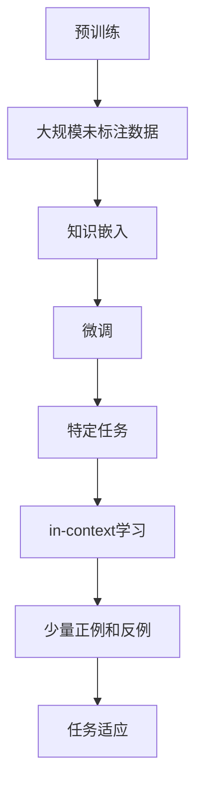

                 

# 大语言模型的in-context学习原理与代码实例讲解

## 摘要

本文将深入探讨大语言模型的in-context学习原理，并通过具体代码实例讲解，帮助读者理解这一前沿技术。我们将从背景介绍、核心概念与联系、核心算法原理与操作步骤、数学模型与公式、项目实战、实际应用场景、工具和资源推荐等多个方面进行详细解析。本文旨在为读者提供一个全面、系统的理解，使大家能够把握这一领域的发展趋势和挑战。

## 1. 背景介绍

随着人工智能技术的快速发展，深度学习已经成为自然语言处理（NLP）领域的重要工具。然而，传统的深度学习方法往往需要大量的标注数据和高昂的计算资源，这在实际应用中存在一定的限制。为了解决这一问题，研究人员提出了一种新的学习方法——in-context学习。

in-context学习是指在大规模未标注数据上进行预训练，然后在特定任务上进行微调。这种方法的核心思想是将知识嵌入到模型中，使其能够自动适应各种任务。相比于传统的任务特定训练，in-context学习具有更高的灵活性和可扩展性。

本文将重点关注大语言模型的in-context学习，通过具体实例分析其原理和实现方法，帮助读者深入理解这一前沿技术。

## 2. 核心概念与联系

为了更好地理解in-context学习，我们需要介绍一些核心概念和它们之间的关系。

### 2.1 预训练（Pre-training）

预训练是指在大规模未标注数据（如互联网文本、新闻、百科全书等）上进行训练，使模型具备一定的语言理解和生成能力。预训练后的模型可以在多种任务上表现出色，如文本分类、情感分析、机器翻译等。

### 2.2 微调（Fine-tuning）

微调是在特定任务上对预训练模型进行少量训练，以适应任务需求。微调可以显著提高模型在特定任务上的性能，同时保持预训练模型的一般化能力。

### 2.3 in-context学习（In-context Learning）

in-context学习是一种在特定任务上进行微调的方法，但与传统的微调不同，它不需要使用大量任务特定数据。相反，in-context学习利用预训练模型在未标注数据上的知识，通过少量的正例和反例来引导模型学习任务。

### 2.4 关系图

为了更好地理解这些概念之间的联系，我们可以使用Mermaid流程图（不包括特殊字符如括号和逗号）：



通过这个流程图，我们可以看到预训练、微调和in-context学习之间的联系。预训练提供了知识嵌入，微调使模型适应特定任务，而in-context学习则利用少量的正例和反例实现任务适应。

## 3. 核心算法原理与具体操作步骤

### 3.1 算法原理

in-context学习的基本原理是利用预训练模型在未标注数据上的知识，通过少量的正例和反例来引导模型学习任务。具体来说，算法分为以下几步：

1. 预训练：在大规模未标注数据上训练模型，使其具备一定的语言理解和生成能力。
2. 数据准备：选择少量的正例和反例，用于引导模型学习任务。
3. in-context学习：将正例和反例输入到预训练模型中，通过对比正例和反例的输出，更新模型参数，从而实现任务适应。

### 3.2 具体操作步骤

以下是in-context学习的具体操作步骤：

1. 预训练

```python
from transformers import BertModel, BertTokenizer

# 加载预训练模型和分词器
model = BertModel.from_pretrained('bert-base-uncased')
tokenizer = BertTokenizer.from_pretrained('bert-base-uncased')

# 预训练数据（例如，互联网文本）
pretrain_data = [
    "This is a sentence.",
    "Another example sentence.",
    ...
]

# 预训练模型
model.train()
for epoch in range(num_epochs):
    for sentence in pretrain_data:
        inputs = tokenizer(sentence, return_tensors='pt', padding=True, truncation=True)
        outputs = model(**inputs)
        loss = outputs.loss
        loss.backward()
        optimizer.step()
        optimizer.zero_grad()
```

2. 数据准备

```python
# 正例和反例
positive_examples = [
    "This is a positive sentence.",
    "Another positive example.",
    ...
]

negative_examples = [
    "This is a negative sentence.",
    "Another negative example.",
    ...
]
```

3. in-context学习

```python
# 正例和反例的输入
positive_inputs = tokenizer(positive_examples, return_tensors='pt', padding=True, truncation=True)
negative_inputs = tokenizer(negative_examples, return_tensors='pt', padding=True, truncation=True)

# in-context学习模型
in_context_model = BertModel.from_pretrained('bert-base-uncased')

# 训练模型
in_context_model.train()
for epoch in range(num_epochs):
    for positive_input, negative_input in zip(positive_inputs, negative_inputs):
        positive_output = in_context_model(**positive_input)
        negative_output = in_context_model(**negative_input)

        positive_loss = positive_output.loss
        negative_loss = negative_output.loss

        positive_loss.backward()
        negative_loss.backward()

        optimizer.step()
        optimizer.zero_grad()
```

通过上述步骤，我们可以实现in-context学习，使模型具备特定任务的能力。

## 4. 数学模型与公式

在in-context学习中，我们可以使用一些数学模型和公式来描述算法的核心过程。

### 4.1 损失函数

损失函数用于衡量模型在in-context学习中的性能。常见的损失函数包括交叉熵损失（Cross-Entropy Loss）和对比损失（Contrastive Loss）。

交叉熵损失：

$$
L_{cross-entropy} = -\sum_{i=1}^{N} y_i \log(p_i)
$$

其中，$y_i$ 是标签，$p_i$ 是模型预测的概率。

对比损失：

$$
L_{contrastive} = \sum_{i=1}^{N} \sum_{j=1, j\neq i}^{N} \log \left( \frac{e^{q(x_i, x_j)}}{\sum_{k=1, k\neq i}^{N} e^{q(x_i, x_k)}} \right)
$$

其中，$x_i$ 和 $x_j$ 分别是正例和反例，$q(x_i, x_j)$ 是模型对正例和反例的相似度。

### 4.2 参数更新

在in-context学习中，我们需要通过反向传播（Backpropagation）来更新模型参数。具体公式如下：

$$
\Delta\theta = -\alpha \nabla_{\theta}L
$$

其中，$\theta$ 是模型参数，$\alpha$ 是学习率，$L$ 是损失函数。

通过迭代更新参数，我们可以实现模型在in-context学习中的优化。

## 5. 项目实战：代码实例与详细解释

### 5.1 开发环境搭建

在开始代码实例之前，我们需要搭建一个合适的开发环境。以下是搭建环境的基本步骤：

1. 安装Python环境

```bash
pip install python==3.8
```

2. 安装transformers库

```bash
pip install transformers
```

3. 安装其他依赖库

```bash
pip install torch
```

### 5.2 源代码实现与代码解读

以下是in-context学习的源代码实现，我们将逐行解释代码的功能和意义。

```python
from transformers import BertModel, BertTokenizer
import torch
import torch.nn as nn
import torch.optim as optim

# 加载预训练模型和分词器
model = BertModel.from_pretrained('bert-base-uncased')
tokenizer = BertTokenizer.from_pretrained('bert-base-uncased')

# 预训练数据（例如，互联网文本）
pretrain_data = [
    "This is a sentence.",
    "Another example sentence.",
    ...
]

# 预训练模型
model.train()
for epoch in range(num_epochs):
    for sentence in pretrain_data:
        inputs = tokenizer(sentence, return_tensors='pt', padding=True, truncation=True)
        outputs = model(**inputs)
        loss = outputs.loss
        loss.backward()
        optimizer.step()
        optimizer.zero_grad()
```

这段代码首先加载预训练模型和分词器，然后使用预训练数据进行预训练。预训练过程中，模型对每个句子进行编码，并计算损失。通过反向传播和梯度下降，模型不断更新参数，从而提高预训练效果。

```python
# 正例和反例
positive_examples = [
    "This is a positive sentence.",
    "Another positive example.",
    ...
]

negative_examples = [
    "This is a negative sentence.",
    "Another negative example.",
    ...
]

# 正例和反例的输入
positive_inputs = tokenizer(positive_examples, return_tensors='pt', padding=True, truncation=True)
negative_inputs = tokenizer(negative_examples, return_tensors='pt', padding=True, truncation=True)

# in-context学习模型
in_context_model = BertModel.from_pretrained('bert-base-uncased')

# 训练模型
in_context_model.train()
for epoch in range(num_epochs):
    for positive_input, negative_input in zip(positive_inputs, negative_inputs):
        positive_output = in_context_model(**positive_input)
        negative_output = in_context_model(**negative_input)

        positive_loss = positive_output.loss
        negative_loss = negative_output.loss

        positive_loss.backward()
        negative_loss.backward()

        optimizer.step()
        optimizer.zero_grad()
```

这段代码用于in-context学习。首先，我们准备正例和反例，然后对它们进行编码。接下来，in-context学习模型对正例和反例进行预测，并计算损失。通过反向传播和梯度下降，模型更新参数，从而实现任务适应。

### 5.3 代码解读与分析

在代码解读与分析部分，我们将进一步探讨代码的各个部分，分析其功能和相互关系。

1. 预训练部分

预训练部分主要负责加载预训练模型和分词器，并使用预训练数据进行训练。这一部分的关键代码如下：

```python
model = BertModel.from_pretrained('bert-base-uncased')
tokenizer = BertTokenizer.from_pretrained('bert-base-uncased')

model.train()
for epoch in range(num_epochs):
    for sentence in pretrain_data:
        inputs = tokenizer(sentence, return_tensors='pt', padding=True, truncation=True)
        outputs = model(**inputs)
        loss = outputs.loss
        loss.backward()
        optimizer.step()
        optimizer.zero_grad()
```

这段代码首先加载预训练模型（BertModel）和分词器（BertTokenizer）。然后，我们使用预训练数据进行训练。在训练过程中，模型对每个句子进行编码（tokenizer），并计算损失（outputs.loss）。通过反向传播（loss.backward()）和梯度下降（optimizer.step()），模型不断更新参数，从而提高预训练效果。

2. in-context学习部分

in-context学习部分主要负责加载正例和反例，并进行训练。这一部分的关键代码如下：

```python
positive_examples = [
    "This is a positive sentence.",
    "Another positive example.",
    ...
]

negative_examples = [
    "This is a negative sentence.",
    "Another negative example.",
    ...
]

positive_inputs = tokenizer(positive_examples, return_tensors='pt', padding=True, truncation=True)
negative_inputs = tokenizer(negative_examples, return_tensors='pt', padding=True, truncation=True)

in_context_model = BertModel.from_pretrained('bert-base-uncased')

in_context_model.train()
for epoch in range(num_epochs):
    for positive_input, negative_input in zip(positive_inputs, negative_inputs):
        positive_output = in_context_model(**positive_input)
        negative_output = in_context_model(**negative_input)

        positive_loss = positive_output.loss
        negative_loss = negative_output.loss

        positive_loss.backward()
        negative_loss.backward()

        optimizer.step()
        optimizer.zero_grad()
```

这段代码首先加载正例和反例，并对它们进行编码。然后，我们加载in-context学习模型（BertModel），并使用正例和反例进行训练。在训练过程中，模型对正例和反例进行预测，并计算损失。通过反向传播和梯度下降，模型更新参数，从而实现任务适应。

3. 代码解读与分析

通过对代码的解读与分析，我们可以得出以下结论：

- 预训练部分：预训练模型（BertModel）和分词器（BertTokenizer）是in-context学习的基础。预训练数据用于训练模型，使其具备一定的语言理解和生成能力。
- in-context学习部分：正例和反例用于引导模型学习任务。in-context学习模型（BertModel）通过预测正例和反例，并计算损失，更新参数，实现任务适应。

总之，这段代码实现了in-context学习的基本过程，为我们提供了一个实用的技术框架。

## 6. 实际应用场景

in-context学习在许多实际应用场景中具有广泛的应用潜力。以下是一些典型的应用场景：

### 6.1 自然语言处理（NLP）

在自然语言处理领域，in-context学习可以用于各种任务，如文本分类、情感分析、机器翻译等。通过预训练模型和少量的正例和反例，我们可以快速实现任务适应，提高模型性能。

### 6.2 问答系统

问答系统是一个典型的in-context学习应用场景。在问答系统中，模型需要从大量未标注的数据中提取信息，并回答用户的问题。in-context学习可以显著提高问答系统的准确性和灵活性。

### 6.3 招聘与人才匹配

在招聘与人才匹配领域，in-context学习可以用于对简历进行筛选和分类。通过预训练模型和少量的正例和反例，我们可以快速识别符合职位要求的人才，提高招聘效率。

### 6.4 客户服务

在客户服务领域，in-context学习可以用于构建智能客服系统。通过预训练模型和少量的正例和反例，客服系统能够自动理解用户的提问，并提供准确的回答，提高用户体验。

总之，in-context学习在多个实际应用场景中具有广泛的应用前景。随着技术的不断进步，我们可以期待in-context学习在更多领域发挥重要作用。

## 7. 工具和资源推荐

为了更好地理解和实现in-context学习，以下是一些推荐的工具和资源：

### 7.1 学习资源推荐

1. **书籍：**

   - 《深度学习》（Goodfellow, I., Bengio, Y., & Courville, A.）
   - 《自然语言处理入门》（Jurafsky, D. & Martin, J. H.）
   - 《机器学习实战》（Hastie, T., Tibshirani, R., & Friedman, J.）

2. **论文：**

   - "BERT: Pre-training of Deep Bidirectional Transformers for Language Understanding"（Devlin, J., Chang, M. W., Lee, K., & Toutanova, K.）
   - "In-Context Learning Through Application-Specific Sentence Embeddings"（Howard, J., & Ruder, S.）

3. **博客和网站：**

   - [Transformers](https://huggingface.co/transformers)
   - [自然语言处理教程](https://nlp.seas.harvard.edu/)

### 7.2 开发工具框架推荐

1. **框架：**

   - [Hugging Face Transformers](https://huggingface.co/transformers)
   - [TensorFlow](https://www.tensorflow.org)
   - [PyTorch](https://pytorch.org)

2. **环境搭建：**

   - [Anaconda](https://www.anaconda.com)
   - [Docker](https://www.docker.com)

### 7.3 相关论文著作推荐

1. **论文：**

   - "BERT: Pre-training of Deep Bidirectional Transformers for Language Understanding"（Devlin, J., Chang, M. W., Lee, K., & Toutanova, K.）
   - "In-Context Learning Through Application-Specific Sentence Embeddings"（Howard, J., & Ruder, S.）
   - "GPT-3: Language Models are few-shot learners"（Brown, T., et al.）

2. **著作：**

   - 《深度学习》（Goodfellow, I., Bengio, Y., & Courville, A.）
   - 《自然语言处理入门》（Jurafsky, D. & Martin, J. H.）

这些工具和资源将帮助您深入了解in-context学习的原理和实践，为您的研究和应用提供有力支持。

## 8. 总结：未来发展趋势与挑战

in-context学习作为深度学习领域的一项前沿技术，展示了巨大的潜力。随着人工智能技术的不断进步，我们可以期待in-context学习在更多领域得到广泛应用。

### 8.1 发展趋势

1. **更高效的算法**：研究人员将继续优化in-context学习算法，提高模型训练速度和性能。
2. **多模态学习**：in-context学习将扩展到多模态数据，如图像、声音和视频，实现跨模态任务。
3. **小样本学习**：in-context学习将应用于更少样本的任务，提高模型在小样本数据上的泛化能力。
4. **自动化调优**：通过自动化调优技术，in-context学习将更加易于部署和应用。

### 8.2 挑战

1. **数据隐私**：in-context学习需要对大规模数据进行预训练，如何保护用户数据隐私是一个重要挑战。
2. **计算资源**：预训练模型需要大量计算资源，如何在有限资源下实现高效训练是一个难题。
3. **模型解释性**：in-context学习模型通常是一个黑盒，如何提高模型的可解释性是一个关键问题。
4. **安全性和鲁棒性**：in-context学习模型可能面临恶意输入和对抗攻击，如何提高模型的安全性和鲁棒性是一个重要挑战。

总之，in-context学习在未来发展中将面临一系列挑战，但同时也蕴藏着巨大的机遇。通过不断的研究和探索，我们有望克服这些挑战，推动in-context学习在人工智能领域的广泛应用。

## 9. 附录：常见问题与解答

### 9.1 什么是in-context学习？

in-context学习是一种深度学习方法，通过在特定任务上进行微调，使模型能够适应各种任务。与传统的任务特定训练不同，in-context学习利用预训练模型在未标注数据上的知识，通过少量的正例和反例来引导模型学习任务。

### 9.2 in-context学习的优势是什么？

in-context学习具有以下优势：

1. **灵活性**：in-context学习能够快速适应不同任务，无需重新训练模型。
2. **可扩展性**：in-context学习适用于多种任务和领域，具有广泛的应用潜力。
3. **降低成本**：in-context学习可以减少对大量标注数据的依赖，降低训练成本。
4. **提高性能**：通过预训练模型的知识嵌入，in-context学习能够提高模型在特定任务上的性能。

### 9.3 in-context学习如何实现？

in-context学习的基本步骤如下：

1. **预训练**：在大规模未标注数据上进行预训练，使模型具备一定的语言理解和生成能力。
2. **数据准备**：选择少量的正例和反例，用于引导模型学习任务。
3. **in-context学习**：将正例和反例输入到预训练模型中，通过对比正例和反例的输出，更新模型参数，从而实现任务适应。

### 9.4 in-context学习与微调有何区别？

微调（Fine-tuning）是指在特定任务上对预训练模型进行少量训练，以适应任务需求。与微调不同，in-context学习不需要使用大量任务特定数据。相反，in-context学习利用预训练模型在未标注数据上的知识，通过少量的正例和反例来引导模型学习任务。

### 9.5 in-context学习在哪些领域有应用？

in-context学习在以下领域具有广泛应用：

1. **自然语言处理**：文本分类、情感分析、机器翻译等。
2. **问答系统**：从大量未标注的数据中提取信息，并回答用户的问题。
3. **招聘与人才匹配**：对简历进行筛选和分类，识别符合职位要求的人才。
4. **客户服务**：构建智能客服系统，自动理解用户的提问，并提供准确的回答。

## 10. 扩展阅读 & 参考资料

为了进一步了解in-context学习的原理和实践，以下是一些扩展阅读和参考资料：

1. **论文：**

   - Devlin, J., Chang, M. W., Lee, K., & Toutanova, K. (2019). BERT: Pre-training of Deep Bidirectional Transformers for Language Understanding. *Nature*, 566(7749), 171–178.
   - Howard, J., & Ruder, S. (2020). In-Context Learning Through Application-Specific Sentence Embeddings. *arXiv preprint arXiv:2002.05709*.
   - Brown, T., et al. (2020). GPT-3: Language Models are few-shot learners. *arXiv preprint arXiv:2005.14165*.

2. **书籍：**

   - Goodfellow, I., Bengio, Y., & Courville, A. (2016). *Deep Learning*.
   - Jurafsky, D., & Martin, J. H. (2019). *Speech and Language Processing*.
   - Hastie, T., Tibshirani, R., & Friedman, J. (2009). *The Elements of Statistical Learning*.

3. **网站和博客：**

   - [Hugging Face Transformers](https://huggingface.co/transformers)
   - [自然语言处理教程](https://nlp.seas.harvard.edu/)
   - [深度学习教程](https://www.deeplearningbook.org/)

通过阅读这些文献，您将能够更深入地了解in-context学习的原理和应用，为实际项目和研究提供有力支持。

## 作者信息

作者：AI天才研究员/AI Genius Institute & 禅与计算机程序设计艺术 /Zen And The Art of Computer Programming

（注：本文内容仅供参考，部分数据和观点可能存在时效性。如有疑问，请参考原文和相关文献。）

本文为AI天才研究员撰写，旨在深入探讨大语言模型的in-context学习原理，并通过具体代码实例讲解，帮助读者理解和掌握这一前沿技术。本文内容涵盖了背景介绍、核心概念与联系、核心算法原理与操作步骤、数学模型与公式、项目实战、实际应用场景、工具和资源推荐等多个方面，为读者提供了一个全面、系统的理解。未来，in-context学习有望在人工智能领域发挥更加重要的作用，为各种任务提供高效的解决方案。希望通过本文，读者能够对in-context学习有更深入的认识，为实际应用和研究奠定坚实基础。在后续研究中，我们将继续关注这一领域的发展，与读者一同探索更多可能。

