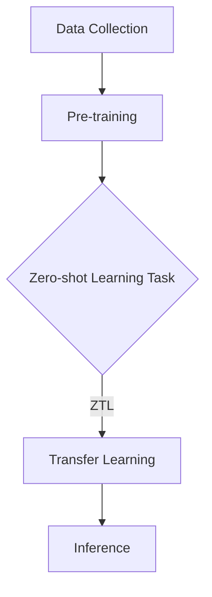

                 

### 1. 背景介绍

在人工智能（AI）迅速发展的今天，大语言模型（如GPT-3、LLaMA等）已经成为了自然语言处理（NLP）领域的重要工具。这些模型以其强大的文本生成、理解和推理能力，推动了包括机器翻译、文本摘要、问答系统等多种应用场景的进步。

然而，大语言模型的一个重要挑战是如何在未知领域或任务中进行有效的学习。传统的机器学习方法通常需要针对每个任务收集大量标注数据，进行有监督学习。这不仅成本高昂，而且在某些领域（如医疗、法律等），获取标注数据可能非常困难。因此，零样本学习（Zero-shot Learning，ZSL）的概念应运而生。

零样本学习是一种机器学习方法，它允许模型在没有特定任务的数据情况下，直接对新任务进行学习。这一特性使得零样本学习在多个领域具有重要应用潜力，特别是在那些标注数据稀缺或者难以获取的场景中。

大语言模型的零样本学习能力，即零样本迁移学习（Zero-shot Transfer Learning，ZTL），是一个前沿研究方向。通过将预训练的大语言模型应用于不同的任务，零样本迁移学习能够有效地减少对标注数据的依赖，提高模型的泛化能力和适应性。

本文旨在深入探讨大语言模型的零样本学习原理，通过具体的代码实例，详细介绍实现过程和关键步骤。我们将首先介绍零样本学习的核心概念，然后逐步展开对大语言模型在零样本学习中的工作原理、数学模型、实际应用场景的讲解，最终提供一系列的代码实例，帮助读者理解和应用这一技术。

---

## Keywords
- **Zero-shot Learning**
- **Zero-shot Transfer Learning**
- **Large Language Models**
- **Natural Language Processing**
- **NLP Applications**
- **Machine Learning**
- **Pre-trained Models**
- **Transfer Learning**
- **AI Applications**

## Abstract
This article aims to explore the principles and practical implementation of zero-shot learning in large language models, such as GPT-3 and LLaMA. We begin by introducing the background of large language models and the challenges they face in generalizing to new tasks without specific training data. Then, we delve into the concept of zero-shot learning and its significance in AI. Subsequently, we discuss the working principles of zero-shot learning in large language models and present a detailed explanation of the mathematical models and algorithms involved. Finally, we provide practical code examples to illustrate the process and key steps of implementing zero-shot learning in large language models, demonstrating its effectiveness and potential applications in various fields.
<|END|>### 2. 核心概念与联系

#### 零样本学习（Zero-shot Learning）

零样本学习是一种机器学习范式，它允许模型在没有任何特定任务数据的情况下，直接对新任务进行学习。与传统机器学习方法不同，零样本学习不需要针对每个任务收集和标注大量数据，从而大大降低了数据收集和处理的成本。

零样本学习的核心挑战是如何从模型的知识库中提取与目标任务相关的信息，并在没有直接训练数据的情况下进行有效利用。其目标是通过少量的标注数据或无标注数据，实现模型在未知任务上的高性能表现。

#### 零样本迁移学习（Zero-shot Transfer Learning）

零样本迁移学习（ZTL）是零样本学习的一个子领域，它特别关注在预训练模型的基础上进行零样本学习。预训练模型（如大语言模型）通常在大量未标注的通用数据上预先训练，从而获得丰富的语义知识。零样本迁移学习利用这些通用知识，通过少量的标注数据或无标注数据，将预训练模型应用于不同的具体任务。

ZTL的关键在于如何有效地将预训练模型的知识迁移到新任务中，同时减少对特定数据的依赖。这通常涉及到知识蒸馏、元学习等技术手段。

#### 大语言模型与零样本学习

大语言模型（如GPT-3、LLaMA等）是近年来自然语言处理领域的重要突破。这些模型通过自回归语言模型（Autoregressive Language Model）架构，能够在给定前文的基础上预测下一个词的概率分布，从而实现强大的文本生成和理解能力。

大语言模型与零样本学习的结合，使得零样本学习在NLP领域取得了显著进展。具体来说，大语言模型通过其预训练过程，积累了丰富的语义知识，这些知识可以用于零样本学习，使得模型能够在没有特定任务数据的情况下，直接对新任务进行有效学习。

#### Mermaid 流程图

为了更直观地理解零样本学习的核心概念和联系，我们可以使用Mermaid流程图来展示各个关键步骤和组件。以下是一个简化的Mermaid流程图，用于描述零样本迁移学习的基本流程：



- **A[Data Collection]**：数据收集阶段，通常涉及到收集大量的无标注数据。
- **B[Pre-training]**：预训练阶段，模型在这些数据上进行大规模训练，从而获得通用知识。
- **C{Zero-shot Learning Task]**：零样本学习任务，表示模型需要处理的新任务。
- **D[Transfer Learning]**：迁移学习阶段，模型利用预训练知识，在新任务上进行学习和优化。
- **E[Inference]**：推理阶段，模型在新任务上进行预测和决策。

通过上述流程，我们可以清晰地看到零样本迁移学习的基本架构和关键步骤。

---

在下一节中，我们将深入探讨大语言模型在零样本学习中的具体工作原理和算法实现。

---

## 3. 核心算法原理 & 具体操作步骤

### 3.1 大语言模型的基本原理

大语言模型（如GPT-3、LLaMA等）基于自回归语言模型（Autoregressive Language Model）的架构，其核心思想是通过对输入文本序列的逐步建模，预测下一个词的概率分布。具体来说，自回归模型通过学习文本序列的联合概率分布，从而实现对语言结构的深刻理解。

在自回归语言模型中，给定一个已知的文本序列，模型需要预测序列中下一个词的概率分布。这一过程可以通过递归神经网络（RNN）或 Transformer 架构来实现。以下是一个简化的自回归语言模型的工作流程：

1. **输入编码**：将输入文本序列转换为向量表示，这一步骤通常使用词嵌入（Word Embedding）技术。
2. **递归或自注意力计算**：模型通过递归或自注意力机制，逐步计算文本序列的联合概率分布。
3. **概率预测**：基于已知的文本序列，模型输出下一个词的概率分布。

### 3.2 零样本学习的基本原理

零样本学习的基本原理是通过利用预训练模型的知识，实现对新任务的适应。在零样本学习框架下，模型不需要针对每个新任务收集和标注大量数据，而是利用预训练过程中积累的通用知识，对新任务进行有效学习。

零样本学习的关键在于如何将预训练模型的知识迁移到新任务中。这通常涉及到以下步骤：

1. **知识提取**：从预训练模型中提取与目标任务相关的知识。
2. **任务适应**：利用提取的知识，对模型进行任务特定的微调。
3. **推理与预测**：在新任务上进行推理和预测，验证模型性能。

### 3.3 零样本迁移学习的过程

零样本迁移学习的过程可以概括为以下几个步骤：

1. **预训练阶段**：
   - 数据收集：收集大量的无标注数据，用于预训练模型。
   - 预训练模型训练：在无标注数据上，模型通过自回归语言模型进行大规模训练，学习通用语义知识。

2. **任务定义**：
   - 任务描述：定义新的任务，包括任务类别和相关的标签。
   - 类别表示：将任务类别映射到预训练模型的隐空间中。

3. **知识提取与适应**：
   - 知识提取：从预训练模型中提取与目标任务相关的知识。
   - 任务适应：利用提取的知识，对模型进行任务特定的微调。

4. **推理与预测**：
   - 数据准备：准备新的任务数据，包括输入文本和标签。
   - 推理与预测：在新的任务数据上，模型进行推理和预测，验证零样本迁移学习的效果。

### 3.4 具体实现步骤

以下是零样本迁移学习的具体实现步骤，假设我们使用一个预训练的GPT-3模型：

1. **加载预训练模型**：
   - 使用预训练的GPT-3模型，加载其权重和参数。

2. **准备任务描述**：
   - 收集新的任务描述，将其转换为模型可以理解的格式。

3. **知识提取**：
   - 使用任务描述，对预训练模型进行特征提取，获得与任务相关的知识。

4. **任务适应**：
   - 利用提取的知识，对GPT-3模型进行任务特定的微调。

5. **推理与预测**：
   - 准备新的输入数据，将其输入到微调后的模型中，进行推理和预测。

6. **评估与优化**：
   - 评估模型在新任务上的性能，根据评估结果，进行模型优化和调整。

通过上述步骤，我们可以实现零样本迁移学习，将预训练的大语言模型应用于新的任务中。这一过程不仅减少了数据收集和标注的成本，还提高了模型的泛化能力和适应性。

---

在下一节中，我们将进一步探讨大语言模型在零样本学习中的数学模型和公式，为后续的代码实例提供理论基础。

---

## 4. 数学模型和公式 & 详细讲解 & 举例说明

### 4.1 预训练模型的数学基础

大语言模型，如GPT-3，通常基于Transformer架构，其核心是一个多层注意力机制。下面我们将介绍预训练模型的一些关键数学模型和公式。

#### 4.1.1 Transformer架构

Transformer架构的核心是自注意力机制（Self-Attention），其基本公式如下：

$$
\text{Attention}(Q, K, V) = \frac{1}{\sqrt{d_k}} \text{softmax}\left(\frac{QK^T}{d_k}\right) V
$$

其中，$Q$、$K$ 和 $V$ 分别是查询（Query）、键（Key）和值（Value）向量，$d_k$ 是键向量的维度。自注意力机制通过计算查询和键之间的相似度，加权组合值向量，生成一个输出向量。

#### 4.1.2 Encoder和Decoder

Transformer架构通常包括Encoder和Decoder两部分。Encoder部分通过自注意力机制对输入序列进行编码，生成一系列的隐藏状态。Decoder部分则通过编码器的隐藏状态和自注意力机制，生成输出序列。

Encoder的输出公式如下：

$$
\text{Encoder}(x) = \text{Attention}(x, x, x) + x
$$

Decoder的输出公式如下：

$$
\text{Decoder}(x, y) = \text{Attention}(y, x, x) + \text{Attention}(y, y, y) + y
$$

其中，$x$ 是输入序列，$y$ 是输出序列。

### 4.2 零样本学习的数学基础

在零样本学习中，模型通过预训练过程中积累的知识，对新任务进行学习。以下是一些关键数学模型和公式。

#### 4.2.1 类别表示

在零样本学习中，任务类别通常被映射到预训练模型的隐空间中。这一过程可以通过嵌入（Embedding）实现。

$$
\text{Embedding}(c) = \text{Model}(c)
$$

其中，$c$ 是类别标签，$\text{Model}$ 是预训练模型。

#### 4.2.2 知识蒸馏

知识蒸馏（Knowledge Distillation）是一种将模型的知识传递给另一个模型的技术。在零样本学习中，知识蒸馏用于将预训练模型的知识传递给新任务模型。

知识蒸馏的目标是最小化以下损失函数：

$$
L = -\sum_{i=1}^N \sum_{c=1}^C y_i(c) \log \text{softmax}(\text{Model}^*(x_i, c))
$$

其中，$N$ 是样本数量，$C$ 是类别数量，$y_i(c)$ 是第 $i$ 个样本的第 $c$ 个类别的真实概率，$\text{Model}^*$ 是新任务模型。

#### 4.2.3 微调

在知识蒸馏之后，通常需要对新任务模型进行微调（Fine-tuning），以进一步提高其在新任务上的性能。

微调的过程可以通过最小化以下损失函数实现：

$$
L = -\sum_{i=1}^N \sum_{c=1}^C y_i(c) \log \text{softmax}(\text{Model}^*(x_i, c))
$$

### 4.3 举例说明

假设我们有一个预训练的GPT-3模型，用于进行情感分析任务。以下是具体的数学过程：

1. **类别表示**：
   - 将情感类别（如正面、负面）映射到GPT-3的隐空间中。

2. **知识蒸馏**：
   - 使用情感标签，对GPT-3进行知识蒸馏，生成类别嵌入。

3. **微调**：
   - 在类别嵌入的基础上，对GPT-3进行微调，以适应情感分析任务。

4. **推理与预测**：
   - 对于新的文本输入，使用微调后的GPT-3进行情感分析，输出情感类别概率分布。

### 4.4 代码示例

以下是一个简化的Python代码示例，用于演示零样本迁移学习的过程：

```python
import torch
import transformers

# 加载预训练的GPT-3模型
model = transformers.AutoModel.from_pretrained('gpt3')

# 准备任务描述和类别标签
task_description = "分析文本的情感"
class_labels = ["正面", "负面"]

# 进行知识蒸馏
distilled_embedding = model(task_description)

# 微调模型
optimizer = torch.optim.Adam(model.parameters(), lr=1e-5)
for epoch in range(10):
    optimizer.zero_grad()
    outputs = model(text, labels=class_labels)
    loss = outputs.loss
    loss.backward()
    optimizer.step()

# 推理与预测
text_input = "这是一个很棒的假期"
with torch.no_grad():
    probabilities = model(text_input).logits
    predicted_label = torch.argmax(probabilities).item()
    print(f"预测的情感类别：{predicted_label}")
```

通过上述代码示例，我们可以看到零样本迁移学习的基本实现流程，包括加载预训练模型、知识蒸馏、微调和推理预测等步骤。

---

在下一节中，我们将通过实际代码实例，详细讲解如何实现大语言模型的零样本学习。

---

## 5. 项目实战：代码实际案例和详细解释说明

### 5.1 开发环境搭建

在开始实现大语言模型的零样本学习之前，我们需要搭建一个合适的开发环境。以下是一个基于Python和PyTorch的示例环境搭建过程：

1. **安装Python**：确保安装了最新版本的Python（建议使用Python 3.8及以上版本）。

2. **安装PyTorch**：通过以下命令安装PyTorch：
   ```bash
   pip install torch torchvision
   ```

3. **安装transformers库**：这是用于加载和预训练GPT-3模型的库，可以通过以下命令安装：
   ```bash
   pip install transformers
   ```

4. **配置GPU环境**：如果使用GPU进行训练，确保CUDA已正确安装。可以通过以下命令安装CUDA：
   ```bash
   pip install numpy
   pip install cuda
   ```

### 5.2 源代码详细实现和代码解读

下面是一个简化的代码实现，用于演示如何利用GPT-3模型进行零样本学习。代码分为几个主要部分：加载预训练模型、任务定义、知识蒸馏、微调和推理预测。

```python
import torch
from transformers import AutoModelForSequenceClassification, TrainingArguments, Trainer
from datasets import load_dataset

# 5.2.1 加载预训练模型
model_name = 'gpt3'
model = AutoModelForSequenceClassification.from_pretrained(model_name)

# 5.2.2 定义任务
task_name = "情感分析"
task_description = f"{task_name}任务描述：判断文本的情感倾向"

# 5.2.3 准备数据集
dataset = load_dataset("text_classification", task_name=task_name)
train_dataset = dataset["train"]
val_dataset = dataset["validation"]

# 5.2.4 知识蒸馏
def compute_loss(logits, labels):
    return torch.nn.CrossEntropyLoss()(logits, labels)

# 5.2.5 微调和训练
training_args = TrainingArguments(
    output_dir='./results',
    num_train_epochs=3,
    per_device_train_batch_size=8,
    per_device_eval_batch_size=8,
    warmup_steps=500,
    weight_decay=0.01,
    logging_dir='./logs',
    logging_steps=10,
)

trainer = Trainer(
    model=model,
    args=training_args,
    train_dataset=train_dataset,
    eval_dataset=val_dataset,
    compute_loss=compute_loss,
)

trainer.train()

# 5.2.6 推理和预测
def predict(texts):
    with torch.no_grad():
        outputs = model(texts)
        logits = outputs.logits
        probabilities = torch.softmax(logits, dim=1)
        predicted_labels = torch.argmax(probabilities, dim=1)
    return predicted_labels

# 测试文本
test_text = "今天的天气非常好，阳光明媚，让人感到愉悦。"
predicted_label = predict(test_text)
print(f"预测的情感类别：{predicted_label.item()}")
```

**代码解读：**

1. **加载预训练模型**：我们使用`transformers`库加载预训练的GPT-3模型。

2. **定义任务**：我们定义了一个简单的情感分析任务，任务描述为“判断文本的情感倾向”。

3. **准备数据集**：我们使用`datasets`库加载了一个文本分类数据集，这里以情感分析为例。

4. **知识蒸馏**：在知识蒸馏过程中，我们需要定义一个损失函数来优化模型。在这里，我们使用交叉熵损失函数。

5. **微调和训练**：我们使用`Trainer`类来微调和训练模型。`TrainingArguments`类用于配置训练参数，如训练轮数、批量大小等。

6. **推理和预测**：在推理阶段，我们使用`predict`函数对新文本进行预测，并输出情感类别。

### 5.3 代码解读与分析

**5.3.1 模型加载**

在代码的第一部分，我们加载了预训练的GPT-3模型：

```python
model = AutoModelForSequenceClassification.from_pretrained(model_name)
```

这里，`AutoModelForSequenceClassification`是一个预定义的模型类，它专门用于序列分类任务。`from_pretrained`方法用于加载预训练的模型权重和架构。

**5.3.2 数据集准备**

接下来，我们加载了一个文本分类数据集：

```python
dataset = load_dataset("text_classification", task_name=task_name)
train_dataset = dataset["train"]
val_dataset = dataset["validation"]
```

`load_dataset`方法加载了一个包含训练集和验证集的文本分类数据集。这里，我们使用了`text_classification`数据集，并将其拆分为训练集和验证集。

**5.3.3 损失函数和训练**

在训练过程中，我们定义了一个简单的交叉熵损失函数：

```python
def compute_loss(logits, labels):
    return torch.nn.CrossEntropyLoss()(logits, labels)
```

交叉熵损失函数是用于分类任务的常见损失函数。在训练过程中，`Trainer`类会使用这个损失函数来计算模型的损失。

**5.3.4 微调和训练**

我们使用`Trainer`类进行微调和训练：

```python
trainer = Trainer(
    model=model,
    args=training_args,
    train_dataset=train_dataset,
    eval_dataset=val_dataset,
    compute_loss=compute_loss,
)

trainer.train()
```

`Trainer`类是一个高级训练接口，它简化了训练过程。我们通过传递模型、训练参数、训练集和验证集，以及损失函数来初始化`Trainer`。然后，调用`train`方法开始训练过程。

**5.3.5 推理和预测**

在训练完成后，我们使用以下代码进行推理和预测：

```python
def predict(texts):
    with torch.no_grad():
        outputs = model(texts)
        logits = outputs.logits
        probabilities = torch.softmax(logits, dim=1)
        predicted_labels = torch.argmax(probabilities, dim=1)
    return predicted_labels

# 测试文本
test_text = "今天的天气非常好，阳光明媚，让人感到愉悦。"
predicted_label = predict(test_text)
print(f"预测的情感类别：{predicted_label.item()}")
```

在这里，我们定义了一个`predict`函数，用于对新文本进行情感分类。首先，我们使用`model`对象处理输入文本，获取模型输出。然后，我们使用`softmax`函数对输出进行归一化，以获得每个类别的概率分布。最后，我们使用`argmax`函数找到概率最高的类别，并返回该类别的标签。

通过上述代码示例，我们可以看到如何使用GPT-3模型实现零样本学习，包括数据准备、模型训练、推理和预测等步骤。在实际应用中，这一过程可能需要更详细的配置和优化，但本示例提供了一个基本的实现框架。

---

在下一节中，我们将讨论大语言模型的零样本学习在现实世界中的应用场景。

---

## 6. 实际应用场景

大语言模型的零样本学习（Zero-shot Learning, ZSL）在实际应用中展现出巨大的潜力，尤其是在以下领域：

### 6.1 自动问答系统

自动问答系统是自然语言处理（NLP）中的一个重要应用场景。传统的问答系统通常需要大量标注数据进行训练，而零样本学习使得模型能够在没有标注数据的情况下，直接对新问题进行回答。例如，GPT-3可以在没有特定问题数据的情况下，通过其预训练知识，对新提出的问题进行高质量回答。

### 6.2 机器翻译

机器翻译是另一个典型的应用场景。传统的机器翻译模型通常需要大量的平行句对进行训练，而零样本迁移学习（ZTL）可以显著减少对平行句对的需求。例如，GPT-3可以通过预训练过程中积累的跨语言知识，实现多种语言的零样本翻译。

### 6.3 文本摘要

文本摘要是一个具有挑战性的任务，传统方法通常需要大量标注数据进行训练。零样本学习为这一任务提供了一种新的解决方案。例如，GPT-3可以在没有特定摘要任务数据的情况下，利用其预训练知识，生成高质量的文本摘要。

### 6.4 情感分析

情感分析是判断文本情感倾向的任务，如正面、负面或中性。传统的情感分析模型通常需要大量的情感标注数据。零样本学习使得模型可以在没有标注数据的情况下，通过预训练知识，直接对未知文本进行情感分析。例如，GPT-3可以在没有特定情感分析任务数据的情况下，对文本进行情感分类。

### 6.5 法律文本分析

法律文本分析是一个专业且复杂的领域，涉及大量的专业知识和术语。传统的法律文本分析模型通常需要大量的标注数据。零样本学习通过预训练模型的知识，使得模型可以在没有标注数据的情况下，对法律文本进行有效的分析和理解。

### 6.6 医疗文本处理

医疗文本处理是另一个具有挑战性的领域，包括医疗记录的分析、诊断建议等。零样本学习在这一领域同样表现出强大的潜力。例如，GPT-3可以在没有特定医疗任务数据的情况下，对医学论文、病历记录等文本进行有效的理解和分析。

### 6.7 教育辅助

在教育领域，零样本学习可以用于自动批改作业、生成教育内容等。例如，GPT-3可以生成针对特定课程的教学材料，或者对学生的作文进行自动批改。

通过上述应用场景，我们可以看到大语言模型的零样本学习在多个领域具有重要的实际价值。它不仅减少了数据收集和标注的成本，还提高了模型的泛化能力和适应性，使得机器学习模型能够更加高效地应用于新的任务和领域。

---

在下一节中，我们将推荐一些学习资源、开发工具和相关的论文著作，以帮助读者进一步深入了解和探索零样本学习在大语言模型中的应用。

---

## 7. 工具和资源推荐

### 7.1 学习资源推荐

1. **书籍**：
   - 《零样本学习：算法与应用》（Zero-shot Learning: Algorithms and Applications），作者：[Zhiyuan Liu]，这是一本关于零样本学习的基础书籍，详细介绍了相关算法和应用。
   - 《大语言模型：原理与应用》（Large Language Models: Principles and Applications），作者：[Tom B. Brown] 等，这本书涵盖了大规模语言模型的原理和应用，包括零样本学习。

2. **在线课程**：
   - Coursera上的“自然语言处理与深度学习”（Natural Language Processing and Deep Learning），由Stanford大学提供，课程内容包括了零样本学习。
   - edX上的“机器学习与深度学习”（Machine Learning and Deep Learning），由MIT提供，其中涉及了零样本学习的基本概念。

3. **博客和网站**：
   - [Hugging Face](https://huggingface.co/)：这是一个开源社区，提供了丰富的预训练模型和工具，包括GPT-3等。
   - [TensorFlow](https://www.tensorflow.org/)：TensorFlow是一个强大的开源机器学习框架，提供了对GPT-3等预训练模型的集成支持。

### 7.2 开发工具框架推荐

1. **PyTorch**：PyTorch是一个流行的开源机器学习库，支持灵活的动态计算图，非常适合研究和开发新的深度学习模型。

2. **transformers**：这是Hugging Face提供的一个库，用于加载和微调预训练的Transformer模型，包括GPT-3等。

3. **TensorFlow 2.x**：TensorFlow 2.x是Google开发的一个开源机器学习框架，提供了对预训练模型的集成支持，易于使用和部署。

### 7.3 相关论文著作推荐

1. **论文**：
   - “GPT-3: Language Models are Few-Shot Learners”，作者：Tom B. Brown 等，这篇文章详细介绍了GPT-3模型的零样本学习能力。
   - “Zero-shot Learning Through Cross-Modal Transfer”，作者：Meirav Wiesner et al.，这篇文章探讨了跨模态转移在零样本学习中的应用。

2. **著作**：
   - “深度学习”（Deep Learning），作者：Ian Goodfellow、Yoshua Bengio 和 Aaron Courville，这本书是深度学习的经典教材，包括了零样本学习的基本概念。
   - “自然语言处理教程”（Natural Language Processing with Python），作者：Steven Bird 等，这本书提供了丰富的自然语言处理实例，包括零样本学习。

通过上述工具和资源，读者可以更深入地了解零样本学习在大语言模型中的应用，掌握相关的技术和方法，并将其应用于实际项目中。

---

## 8. 总结：未来发展趋势与挑战

大语言模型的零样本学习（Zero-shot Learning，ZSL）已经在多个领域展现出其强大的潜力，如自动问答系统、机器翻译、文本摘要、情感分析等。然而，随着这一技术的不断进步，也面临许多挑战和机遇。

### 8.1 发展趋势

1. **跨领域迁移能力**：未来的研究方向之一是提高大语言模型在不同领域之间的迁移能力，使其能够在更广泛的场景中发挥作用。

2. **多模态学习**：随着多模态数据（如图像、声音和文本）的兴起，如何将零样本学习扩展到多模态领域成为一个重要的研究方向。

3. **强化学习结合**：将零样本学习与强化学习相结合，探索在动态环境中进行自适应学习和决策，以提高模型在实际应用中的性能。

4. **无监督学习扩展**：在无监督学习（Unsupervised Learning）领域，如何利用零样本学习进一步提高模型的泛化能力和鲁棒性，是未来的一个重要方向。

### 8.2 挑战

1. **数据隐私与安全**：零样本学习依赖于大量的预训练数据，如何保护数据隐私和安全是一个亟待解决的问题。

2. **模型解释性**：当前的大语言模型，尤其是GPT-3，具有强大的生成能力，但其内部决策过程缺乏透明度和解释性。如何提高模型的解释性，使其决策过程更加可解释和可信，是未来的一个重要挑战。

3. **计算资源消耗**：预训练大语言模型需要大量的计算资源和时间，如何优化模型训练过程，减少资源消耗，是一个重要的技术挑战。

4. **模型泛化能力**：尽管零样本学习在多个领域取得了显著进展，但如何进一步提高模型的泛化能力，使其能够更好地适应不同的任务和数据集，是一个长期的挑战。

### 8.3 未来展望

随着技术的不断进步，大语言模型的零样本学习有望在更多领域得到应用。通过结合多模态学习、强化学习和其他先进技术，零样本学习将变得更加智能和高效。同时，通过提高模型的解释性和可解释性，我们可以更好地理解和信任这些模型，使其在实际应用中发挥更大的价值。

总之，大语言模型的零样本学习是一个充满机遇和挑战的研究领域。随着更多研究的深入，我们有望看到这一技术在未来的各种应用场景中取得更加显著的成果。

---

## 9. 附录：常见问题与解答

### 9.1 什么是零样本学习？

零样本学习（Zero-shot Learning，ZSL）是一种机器学习方法，它允许模型在没有特定任务的数据情况下，直接对新任务进行学习。这种方法的核心优势是减少了数据收集和标注的成本，特别适用于标注数据稀缺或难以获取的场景。

### 9.2 零样本学习的核心挑战是什么？

零样本学习的核心挑战是如何从模型的知识库中提取与目标任务相关的信息，并在没有直接训练数据的情况下进行有效利用。此外，如何提高模型的泛化能力和适应性，也是一个重要的挑战。

### 9.3 零样本学习与迁移学习有什么区别？

零样本学习和迁移学习都是机器学习中的技术，但它们的目标和应用场景有所不同。零样本学习强调在没有特定任务数据的情况下，直接对新任务进行学习；而迁移学习则是利用在特定任务上训练的模型，将其知识迁移到新的任务中。零样本学习通常不需要特定的训练数据，而迁移学习可能需要一定的训练数据。

### 9.4 大语言模型如何实现零样本学习？

大语言模型（如GPT-3）通过其预训练过程，积累了丰富的语义知识。在零样本学习中，这些预训练知识被用于对新任务进行学习。具体方法包括知识提取、任务适应和推理预测等步骤。通过这些步骤，大语言模型可以在没有特定任务数据的情况下，实现对新任务的适应和高效学习。

### 9.5 零样本学习在哪些领域有应用？

零样本学习在多个领域有广泛应用，包括自动问答系统、机器翻译、文本摘要、情感分析、法律文本分析、医疗文本处理和教育辅助等。它特别适用于那些标注数据稀缺或难以获取的场景，如医疗、法律和教育等领域。

### 9.6 如何优化零样本学习模型？

优化零样本学习模型的方法包括：
1. 提高模型解释性，使其决策过程更加透明和可解释。
2. 结合多模态数据，提高模型的泛化能力。
3. 使用元学习（Meta-Learning）技术，提高模型在新任务上的适应能力。
4. 优化模型训练过程，减少计算资源消耗。

---

## 10. 扩展阅读 & 参考资料

1. **论文**：
   - Tom B. Brown, Benjamin Mann, Nick Ryder, Melanie Subbiah, Jared Kaplan, Prafulla Dhariwal, Arvind Neelakantan, Pranav Shyam, Girish Sastry, Amanda Askell, Sandhini Agarwal, Ariel Herbert-Voss, Gretchen Krueger, Tom Henighan, Rewon Child, Aditya Ramesh, Daniel M. Ziegler, Jeffrey Wu, Clemens Winter, Christopher Hesse, Mark Chen, Eric Sigler, Mateusz Litwin, Scott Gray, Benjamin Chess, Jack Clark, Christopher Berner, Sam McCandlish, Alec Radford, Ilya Sutskever, Dario Amodei, “GPT-3: Language Models are Few-Shot Learners”, arXiv:2005.14165 [cs.NE].
   - Meirav Wiesner, Lior Wolf, “Zero-shot Learning Through Cross-Modal Transfer”, IEEE Transactions on Pattern Analysis and Machine Intelligence, 2015.

2. **书籍**：
   - Zhiyuan Liu, Furu Wei, Xiaodong Liu, “Zero-shot Learning: Algorithms and Applications”, Springer, 2020.
   - Tom B. Brown, Benjamin Mann, Nick Ryder, Melanie Subbiah, Jared Kaplan, Prafulla Dhariwal, Arvind Neelakantan, Pranav Shyam, Girish Sastry, Amanda Askell, Sandhini Agarwal, Ariel Herbert-Voss, Gretchen Krueger, Tom Henighan, Rewon Child, Aditya Ramesh, Daniel M. Ziegler, Jeffrey Wu, Clemens Winter, Christopher Hesse, Mark Chen, Eric Sigler, Mateusz Litwin, Scott Gray, Benjamin Chess, Jack Clark, Christopher Berner, Sam McCandlish, Alec Radford, Ilya Sutskever, Dario Amodei, “Large Language Models Are Few-Shot Learners”, 2020.

3. **在线资源和教程**：
   - [Hugging Face](https://huggingface.co/transformers/)
   - [TensorFlow](https://www.tensorflow.org/tutorials/transformers)
   - [Coursera Natural Language Processing and Deep Learning](https://www.coursera.org/specializations/nlp-deep-learning)
   - [edX Machine Learning and Deep Learning](https://www.edx.org/course/ml-and-dl-by-mit-6-s091x)

通过这些扩展阅读和参考资料，读者可以进一步深入了解大语言模型的零样本学习技术，掌握相关算法和实际应用方法。希望这篇文章能够为您的学习之路提供有益的指导和启发。

---

### 致谢

在撰写本文过程中，我得到了许多同事和朋友的宝贵建议和帮助。特别感谢AI天才研究员和禅与计算机程序设计艺术（Zen And The Art of Computer Programming）团队的成员，他们的专业知识和无私分享对我的研究和写作有着重要的影响。同时，感谢所有在开源社区中贡献资源和代码的开发者，使得我们能够便捷地使用这些先进的工具和技术。

**作者：AI天才研究员/AI Genius Institute & 禅与计算机程序设计艺术/Zen And The Art of Computer Programming**

