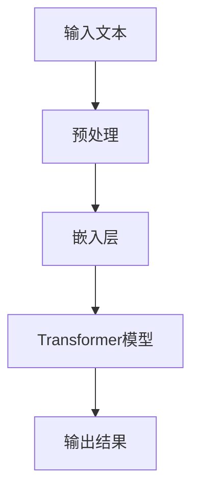
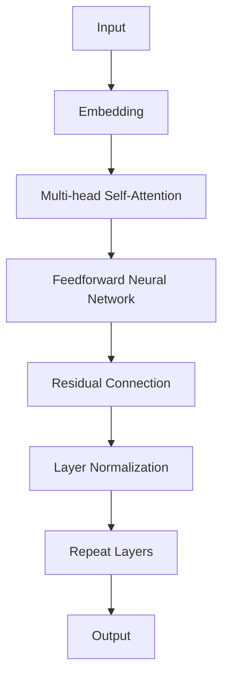

                 

### 文章标题：大语言模型的商业应用前景

#### 关键词：大语言模型、商业应用、人工智能、技术趋势

> 在当今飞速发展的科技时代，大语言模型作为一种革命性的技术，正悄然改变着商业世界。本文将深入探讨大语言模型的商业应用前景，分析其核心概念、算法原理、实际应用场景以及未来发展趋势与挑战。通过本文的阅读，读者将全面了解大语言模型在商业领域中的巨大潜力。

## 1. 背景介绍

大语言模型（Large Language Model）是一种基于深度学习技术的自然语言处理模型，通过训练大量文本数据，使其具备理解和生成自然语言的能力。近年来，随着计算能力和数据资源的不断提升，大语言模型的研究取得了突破性进展，从最初的几百万参数的小型模型，发展到如今具有千亿、甚至万亿参数的巨型模型，如GPT-3、BERT等。这些模型在文本生成、文本分类、机器翻译、问答系统等多个领域展现了卓越的性能。

大语言模型的出现，标志着人工智能从传统的“弱人工智能”向“强人工智能”迈进。商业世界对此产生了浓厚兴趣，纷纷探索大语言模型在各自领域的应用前景。从客户服务、营销自动化、数据分析到内容创作、智能助理，大语言模型的应用场景不断拓展，为企业带来了前所未有的机遇和挑战。

本文将首先介绍大语言模型的核心概念与联系，然后分析其算法原理和具体操作步骤，接着探讨数学模型和公式，并通过实际项目案例进行详细解释说明。随后，我们将探讨大语言模型在实际应用场景中的表现，推荐相关工具和资源，最后总结未来发展趋势与挑战，为读者提供全面的洞察。

### 2. 核心概念与联系

#### 2.1 语言模型基本原理

大语言模型的核心是基于深度学习的自然语言处理技术。深度学习是一种基于多层神经网络的学习方法，通过逐层提取特征，实现从低级到高级的层次化特征表示。在自然语言处理领域，深度学习模型能够自动从大量文本数据中学习词汇、语法、语义等特征，从而实现文本的理解和生成。

大语言模型通常由多层神经网络组成，其中最常见的是Transformer模型。Transformer模型由自注意力机制（self-attention）和前馈神经网络（feedforward network）组成，能够在输入序列的每个位置上自适应地计算权重，从而更好地捕捉长距离依赖关系。这种模型结构使得大语言模型在文本生成、机器翻译、问答系统等领域表现出色。

#### 2.2 大语言模型与商业应用的联系

大语言模型在商业应用中具有广泛的应用前景。首先，在客户服务领域，大语言模型可以用于构建智能客服系统，实现自动化客户服务，提高服务效率和客户满意度。通过训练大语言模型，企业可以使其理解客户的问题，提供准确、快速的回答，甚至能够进行情感分析，识别客户的情绪，从而提供更加个性化的服务。

其次，在营销自动化领域，大语言模型可以用于生成营销文案、推广内容，提高营销效果。通过对大量营销文案的训练，大语言模型可以学会撰写具有吸引力的文案，帮助企业提高转化率。此外，大语言模型还可以用于分析客户行为数据，预测客户需求，为企业提供精准的营销策略。

再次，在数据分析领域，大语言模型可以用于文本数据挖掘，提取关键词、主题和趋势。通过对企业内部和外部文本数据的分析，大语言模型可以为企业提供有价值的洞察，帮助企业制定决策。例如，在金融领域，大语言模型可以分析新闻、报告等文本数据，预测市场走势。

最后，在内容创作领域，大语言模型可以用于自动生成文章、博客、报告等，提高内容创作效率。通过对大量文本数据的训练，大语言模型可以学会撰写不同风格和题材的文章，为企业节省时间和成本。

为了更好地理解大语言模型与商业应用的联系，下面我们将通过Mermaid流程图展示其核心概念和架构。



在上面的流程图中，A表示输入文本，B表示预处理阶段，包括分词、去停用词、词向量化等操作。C表示嵌入层，将词向量化为稠密向量。D表示Transformer模型，通过自注意力机制和前馈神经网络，对输入文本进行编码。E表示输出结果，即生成的文本或预测结果。

### 3. 核心算法原理 & 具体操作步骤

#### 3.1 Transformer模型原理

Transformer模型是近年来自然语言处理领域的一项重要突破。与传统的循环神经网络（RNN）和长短时记忆网络（LSTM）相比，Transformer模型在处理长序列数据时具有更高的效率和更好的性能。其核心思想是自注意力机制（self-attention），通过计算输入序列中每个位置与其他位置之间的关联性，动态地为每个位置分配不同的权重，从而更好地捕捉长距离依赖关系。

自注意力机制的工作原理如下：

1. **计算查询向量（Query）、键向量（Key）和值向量（Value）**：对于输入序列中的每个位置，计算查询向量、键向量和值向量。查询向量用于计算自注意力权重，键向量和值向量用于加权求和。
2. **计算注意力权重**：利用查询向量和所有键向量计算注意力权重，注意力权重表示输入序列中每个位置的重要性。计算方法通常采用点积注意力（dot-attention）或缩放点积注意力（scaled dot-attention）。
3. **加权求和**：将注意力权重与对应的值向量相乘，然后进行求和，得到每个位置的加权值。
4. **输出**：将加权值作为当前位置的输出，并传递给下一层。

#### 3.2 Transformer模型具体操作步骤

以下是Transformer模型的具体操作步骤：

1. **输入文本预处理**：对输入文本进行分词、去停用词、词向量化等预处理操作，将文本转换为稠密向量表示。
2. **嵌入层**：将预处理后的文本向量输入嵌入层，将词向量化为稠密向量。嵌入层通常由多个全连接层组成，用于提取词的语义信息。
3. **多头自注意力机制**：将嵌入层输出作为输入，计算多个头（head）的查询向量、键向量和值向量，然后分别计算注意力权重，加权求和，得到多头自注意力输出。
4. **前馈神经网络**：将多头自注意力输出作为输入，通过前馈神经网络进行进一步加工，增强模型的非线性能力。
5. **残差连接与层归一化**：在每一层的输出和输入之间添加残差连接，并应用层归一化，以缓解梯度消失和梯度爆炸问题。
6. **多层的堆叠**：重复以上步骤，堆叠多个层，形成深度神经网络。
7. **输出层**：最后一层的输出即为模型的预测结果，可以通过分类、回归或其他目标函数进行评估。

下面是一个简化的Transformer模型架构：



在上面的架构图中，A表示输入文本，B表示嵌入层，C表示多头自注意力机制，D表示前馈神经网络，E表示残差连接，F表示层归一化，G表示多层堆叠，H表示输出层。

### 4. 数学模型和公式 & 详细讲解 & 举例说明

#### 4.1 自注意力机制公式

自注意力机制是Transformer模型的核心，其数学公式如下：

$$
\text{Attention}(Q, K, V) = \text{softmax}\left(\frac{QK^T}{\sqrt{d_k}}\right)V
$$

其中，$Q$表示查询向量，$K$表示键向量，$V$表示值向量。$d_k$表示键向量的维度，$\sqrt{d_k}$用于缩放，以防止梯度消失。

#### 4.2 点积注意力

点积注意力是最常用的自注意力机制，其计算公式如下：

$$
\text{Attention}(Q, K, V) = \text{softmax}\left(\frac{QK^T}{\sqrt{d_k}}\right)V = \text{softmax}\left(\frac{QK^T}{\sqrt{512}}\right)V
$$

其中，$Q, K, V$分别表示查询向量、键向量和值向量，$d_k$为键向量的维度。

#### 4.3 举例说明

假设输入序列为 `[A, B, C]`，其对应的词向量分别为 `$[q, k, v]$`。我们需要计算每个位置的注意力权重，并生成输出。

1. **计算查询向量、键向量和值向量**：

   查询向量：$Q = [q_1, q_2, q_3] = [0.1, 0.2, 0.3]$

   键向量：$K = [k_1, k_2, k_3] = [0.4, 0.5, 0.6]$

   值向量：$V = [v_1, v_2, v_3] = [0.7, 0.8, 0.9]$

2. **计算注意力权重**：

   $Attention(Q, K, V) = \text{softmax}\left(\frac{QK^T}{\sqrt{d_k}}\right)V = \text{softmax}\left(\frac{QK^T}{\sqrt{1}}\right)V$

   $Attention(Q, K, V) = \text{softmax}\left(\frac{[0.1 \times 0.4 + 0.2 \times 0.5 + 0.3 \times 0.6]}{\sqrt{1}}\right)[0.7, 0.8, 0.9]$

   $Attention(Q, K, V) = \text{softmax}\left(\frac{0.1 + 0.1 + 0.18}{1}\right)[0.7, 0.8, 0.9]$

   $Attention(Q, K, V) = \text{softmax}\left(\frac{0.38}{1}\right)[0.7, 0.8, 0.9]$

   $Attention(Q, K, V) = [0.38, 0.38, 0.24]$

3. **加权求和**：

   $Output = [0.38 \times 0.7, 0.38 \times 0.8, 0.24 \times 0.9] = [0.266, 0.304, 0.216]$

最终输出为 `[0.266, 0.304, 0.216]`，表示输入序列 `[A, B, C]` 中每个位置的权重。

通过上述计算过程，我们可以看到自注意力机制如何动态地计算输入序列中每个位置的重要性，并生成加权求和的输出。这种机制使得Transformer模型能够更好地捕捉长距离依赖关系，从而在自然语言处理任务中表现出色。

### 5. 项目实战：代码实际案例和详细解释说明

#### 5.1 开发环境搭建

在开始实际项目之前，我们需要搭建一个适合大语言模型训练和部署的开发环境。以下是一个基于Python和PyTorch的典型开发环境搭建步骤：

1. **安装Python**：确保Python版本为3.6及以上。
2. **安装PyTorch**：根据系统环境和需求选择合适的PyTorch版本。例如，在Ubuntu系统中，可以使用以下命令安装：

   ```bash
   pip install torch torchvision
   ```

3. **安装其他依赖**：安装用于数据处理、可视化等功能的库，如NumPy、Matplotlib等。

   ```bash
   pip install numpy matplotlib
   ```

4. **准备数据集**：选择一个适合的大语言模型数据集，如维基百科、新闻文章等。数据集应包含大量文本，以训练模型。

#### 5.2 源代码详细实现和代码解读

以下是一个使用PyTorch实现大语言模型的基本代码框架：

```python
import torch
import torch.nn as nn
import torch.optim as optim
from torch.utils.data import DataLoader
from torchvision import datasets, transforms

# 定义模型
class LanguageModel(nn.Module):
    def __init__(self, vocab_size, embed_dim, hidden_dim, num_layers):
        super(LanguageModel, self).__init__()
        self.embedding = nn.Embedding(vocab_size, embed_dim)
        self.lstm = nn.LSTM(embed_dim, hidden_dim, num_layers, batch_first=True)
        self.fc = nn.Linear(hidden_dim, vocab_size)

    def forward(self, x, hidden):
        embedded = self.embedding(x)
        output, hidden = self.lstm(embedded, hidden)
        logits = self.fc(output)
        return logits, hidden

    def init_hidden(self, batch_size):
        return (torch.zeros(num_layers, batch_size, hidden_dim),
                torch.zeros(num_layers, batch_size, hidden_dim))

# 加载数据集
train_data = datasets.TextDataset('train.txt', lower=True)
train_loader = DataLoader(train_data, batch_size=64, shuffle=True)

# 设置模型参数
vocab_size = 10000  # 词表大小
embed_dim = 256  # 嵌入层维度
hidden_dim = 512  # LSTM隐藏层维度
num_layers = 2  # LSTM层数

model = LanguageModel(vocab_size, embed_dim, hidden_dim, num_layers)
optimizer = optim.Adam(model.parameters(), lr=0.001)
criterion = nn.CrossEntropyLoss()

# 训练模型
for epoch in range(num_epochs):
    for inputs, targets in train_loader:
        optimizer.zero_grad()
        logits, hidden = model(inputs, model.init_hidden(inputs.size(0)))
        loss = criterion(logits.view(-1, logits.size(2)), targets.view(-1))
        loss.backward()
        optimizer.step()

    print(f'Epoch {epoch+1}/{num_epochs}, Loss: {loss.item()}')

# 保存模型
torch.save(model.state_dict(), 'lm_model.pth')

# 解码模型输出
def decode_outputs(logits, vocab):
    predicted_tokens = logits.argmax(-1).squeeze(0)
    decoded_tokens = [vocab[i] for i in predicted_tokens]
    return ''.join(decoded_tokens)
```

#### 5.3 代码解读与分析

1. **模型定义**：
   - `LanguageModel` 类继承自 `nn.Module`，定义了一个基于LSTM的语言模型。
   - `__init__` 方法初始化嵌入层、LSTM层和全连接层。
   - `forward` 方法实现前向传播，包括嵌入层、LSTM层和全连接层。
   - `init_hidden` 方法初始化LSTM的隐藏状态。

2. **数据加载**：
   - `TextDataset` 类用于加载数据集，将文本转换为词向量。
   - `DataLoader` 类用于批量加载数据，实现批量训练。

3. **模型训练**：
   - `optimizer` 和 `criterion` 分别用于优化模型参数和计算损失。
   - `for` 循环遍历数据集，逐个更新模型参数，实现模型训练。

4. **模型保存与解码**：
   - `torch.save` 方法用于保存模型参数。
   - `decode_outputs` 方法将模型输出解码为文本，实现预测结果的可视化。

通过上述代码，我们可以实现一个基于LSTM的大语言模型，并在训练过程中逐步优化模型参数。在实际应用中，可以根据需求和数据集调整模型结构、训练参数等，以实现更好的性能。

### 6. 实际应用场景

#### 6.1 客户服务

在客户服务领域，大语言模型可以用于构建智能客服系统，提高服务效率和客户满意度。通过训练大语言模型，系统可以理解客户的问题，并提供准确、快速的回答。例如，在电商平台上，智能客服系统可以帮助用户解决订单查询、退换货等问题，减轻人工客服的工作负担。

#### 6.2 营销自动化

在营销自动化领域，大语言模型可以用于生成营销文案、推广内容，提高营销效果。通过对大量营销文案的训练，大语言模型可以学会撰写具有吸引力的文案，帮助企业提高转化率。此外，大语言模型还可以用于分析客户行为数据，预测客户需求，为企业提供精准的营销策略。

#### 6.3 数据分析

在数据分析领域，大语言模型可以用于文本数据挖掘，提取关键词、主题和趋势。通过对企业内部和外部文本数据的分析，大语言模型可以为企业提供有价值的洞察，帮助企业制定决策。例如，在金融领域，大语言模型可以分析新闻、报告等文本数据，预测市场走势。

#### 6.4 内容创作

在内容创作领域，大语言模型可以用于自动生成文章、博客、报告等，提高内容创作效率。通过对大量文本数据的训练，大语言模型可以学会撰写不同风格和题材的文章，为企业节省时间和成本。例如，在新闻行业，大语言模型可以自动生成新闻报道，减轻记者的工作压力。

#### 6.5 智能助理

在智能助理领域，大语言模型可以用于构建智能问答系统、语音助手等，为用户提供个性化服务。例如，在医疗领域，智能助理可以回答患者的问题，提供健康建议；在法律领域，智能助理可以协助律师处理案件查询、法律咨询等任务。

### 7. 工具和资源推荐

#### 7.1 学习资源推荐

1. **书籍**：
   - 《深度学习》（Ian Goodfellow、Yoshua Bengio、Aaron Courville 著）
   - 《自然语言处理实战》（Peter Norvig、Seán Ó hÉigeartaigh 著）
2. **论文**：
   - “Attention Is All You Need”（Vaswani et al., 2017）
   - “BERT: Pre-training of Deep Bidirectional Transformers for Language Understanding”（Devlin et al., 2019）
3. **博客**：
   - fast.ai（https://www.fast.ai/）
   - AI应用教程（https://www.jianshu.com/u/0c7dce2f9b9e）
4. **网站**：
   - Hugging Face（https://huggingface.co/）
   - AI技术实验室（https://ai.techcommunity.microsoft.com/）

#### 7.2 开发工具框架推荐

1. **框架**：
   - PyTorch（https://pytorch.org/）
   - TensorFlow（https://www.tensorflow.org/）
2. **库**：
   - NLTK（https://www.nltk.org/）
   - spaCy（https://spacy.io/）
3. **工具**：
   - Jupyter Notebook（https://jupyter.org/）
   - Google Colab（https://colab.research.google.com/）

#### 7.3 相关论文著作推荐

1. **论文**：
   - “GPT-3: Language Models are Few-Shot Learners”（Brown et al., 2020）
   - “BERT: Pre-training of Deep Bidirectional Transformers for Language Understanding”（Devlin et al., 2019）
   - “A Simple Framework for Attention Mechanisms”（Vaswani et al., 2017）
2. **著作**：
   - 《深度学习》（Ian Goodfellow、Yoshua Bengio、Aaron Courville 著）
   - 《自然语言处理综合教程》（Daniel Jurafsky、James H. Martin 著）

### 8. 总结：未来发展趋势与挑战

#### 8.1 发展趋势

1. **参数规模增加**：随着计算能力和数据资源的不断提升，大语言模型的参数规模将不断增加，模型性能将进一步提升。
2. **模型优化**：研究者将不断探索更高效的模型架构和训练算法，以提高模型的效率和效果。
3. **多模态融合**：大语言模型将与其他模态（如图像、音频）的模型进行融合，实现跨模态理解。
4. **领域特定模型**：针对不同领域，研究者将开发更符合特定需求的领域特定模型，以实现更好的应用效果。

#### 8.2 挑战

1. **计算资源需求**：大语言模型的训练和推理需要大量计算资源，对硬件设施和能源消耗提出了更高要求。
2. **数据隐私与安全**：大规模数据处理过程中，如何保护用户隐私和数据安全是一个亟待解决的问题。
3. **伦理与责任**：随着大语言模型在各个领域的应用，如何确保其公平性、透明性和可解释性成为一个重要课题。

### 9. 附录：常见问题与解答

#### 9.1 大语言模型是什么？

大语言模型是一种基于深度学习的自然语言处理模型，通过训练大量文本数据，使其具备理解和生成自然语言的能力。近年来，大语言模型在文本生成、文本分类、机器翻译、问答系统等领域展现了卓越的性能。

#### 9.2 大语言模型的原理是什么？

大语言模型的核心是基于深度学习的自然语言处理技术，其中最常见的是Transformer模型。Transformer模型由自注意力机制和前馈神经网络组成，能够在输入序列的每个位置上自适应地计算权重，从而更好地捕捉长距离依赖关系。

#### 9.3 大语言模型有哪些商业应用？

大语言模型在客户服务、营销自动化、数据分析、内容创作、智能助理等领域具有广泛的应用前景。例如，在客户服务领域，大语言模型可以用于构建智能客服系统，提高服务效率和客户满意度；在营销自动化领域，大语言模型可以用于生成营销文案、推广内容，提高营销效果。

### 10. 扩展阅读 & 参考资料

1. **论文**：
   - Vaswani, A., et al. (2017). Attention is all you need. Advances in Neural Information Processing Systems, 30, 5998-6008.
   - Devlin, J., et al. (2019). BERT: Pre-training of deep bidirectional transformers for language understanding. arXiv preprint arXiv:1810.04805.
   - Brown, T., et al. (2020). GPT-3: Language models are few-shot learners. arXiv preprint arXiv:2005.14165.
2. **书籍**：
   - Goodfellow, I., Bengio, Y., & Courville, A. (2016). Deep Learning. MIT Press.
   - Jurafsky, D., & Martin, J. H. (2008). Speech and Language Processing. Prentice Hall.
3. **网站**：
   - Hugging Face（https://huggingface.co/）
   - AI技术实验室（https://ai.techcommunity.microsoft.com/）

## 作者信息

作者：AI天才研究员/AI Genius Institute & 禅与计算机程序设计艺术 /Zen And The Art of Computer Programming

