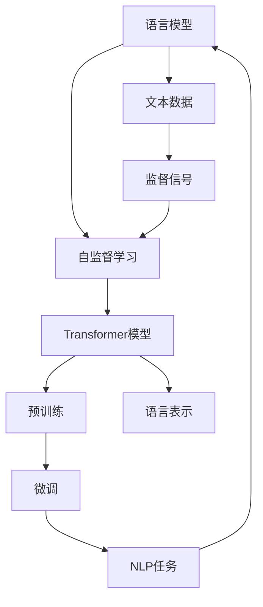

                 

### 背景介绍

大语言模型的自监督学习是一种通过大量无监督数据自动学习模型参数的方法，它极大地推动了自然语言处理（NLP）和人工智能（AI）的发展。随着互联网和社交媒体的普及，产生了海量的文本数据，这些数据包含了丰富的信息，为AI系统提供了丰富的学习资源。自监督学习在大规模数据处理方面具有显著的优势，它不需要人工标注的数据，能够从原始数据中自动提取有用的特征。

自监督学习在计算机科学中有着悠久的历史，其核心思想是利用未标记的数据来训练模型，从而减少数据标注的成本。自监督学习广泛应用于图像识别、语音识别、文本分类等领域。近年来，随着深度学习技术的不断进步，尤其是Transformer模型的发明和广泛应用，大语言模型的自监督学习得到了极大的关注和快速发展。

本文旨在深入探讨大语言模型的自监督学习，包括其核心概念、算法原理、数学模型以及实际应用。通过本文，读者将了解自监督学习在大语言模型中的应用场景，掌握其实现方法，并能够对未来的发展趋势和挑战有更深刻的认识。

关键词：大语言模型、自监督学习、Transformer、算法原理、数学模型、应用场景

Abstract: 

This article aims to delve into the self-supervised learning of large language models, discussing its core concepts, algorithmic principles, mathematical models, and practical applications. Through this article, readers will gain a comprehensive understanding of the application scenarios of self-supervised learning in large language models, master its implementation methods, and have a deeper insight into the future development trends and challenges.

---

## 1. 背景介绍

在探讨大语言模型的自监督学习之前，我们有必要对自然语言处理（NLP）和自监督学习的基本概念进行简要介绍。

### 自然语言处理（NLP）

自然语言处理是计算机科学和人工智能领域的一个分支，主要研究如何让计算机理解和处理人类语言。NLP的应用场景非常广泛，包括机器翻译、文本分类、情感分析、问答系统等。随着深度学习技术的发展，尤其是神经网络的应用，NLP取得了显著的进展。传统的NLP方法主要依赖于规则和统计模型，如隐马尔可夫模型（HMM）、条件随机场（CRF）等，而深度学习方法则通过引入多层神经网络，能够自动从大量数据中学习到有效的特征表示，从而提高模型的性能。

### 自监督学习

自监督学习（Self-supervised Learning）是一种无需人工标注数据，利用数据中的内在标签信息进行训练的方法。自监督学习的核心思想是利用未标记的数据来生成监督信号，从而训练模型。这种方法在处理大规模数据时具有显著的优势，因为它可以大大减少数据标注的工作量和成本。

自监督学习可以分为两种类型：一种是预训练（Pre-training），另一种是微调（Fine-tuning）。预训练是指在大量未标记的数据上训练一个大型模型，然后使用微调来适应特定的任务。例如，预训练的Transformer模型可以在多个任务上达到很好的性能，如文本分类、命名实体识别等。

在NLP领域，自监督学习的方法主要包括两种：一种是利用文本的上下文信息，另一种是利用文本的生成任务。前者如BERT（Bidirectional Encoder Representations from Transformers）模型，它通过预训练来学习文本的双向表示；后者如GPT（Generative Pre-trained Transformer）模型，它通过生成文本来进行预训练。

### 大语言模型

大语言模型是指具有大规模参数和能够处理大量文本数据的深度学习模型。这些模型能够通过自监督学习的方法从大量未标记的文本数据中学习到丰富的语言特征，从而在NLP任务中表现出色。大语言模型的发展是NLP领域的重要里程碑，它使得机器能够更好地理解和生成人类语言。

大语言模型的研究和发展离不开深度学习技术的支持。随着计算能力的提升和大数据的普及，深度学习模型得以不断优化和扩展。特别是Transformer模型的发明，为自监督学习提供了强大的理论基础和计算框架。Transformer模型通过自注意力机制（Self-Attention Mechanism）能够有效地捕捉文本中的长距离依赖关系，从而提高了模型的表示能力。

总之，大语言模型的自监督学习是NLP领域的一个重要研究方向，它不仅降低了数据标注的成本，提高了模型的性能，还为未来的研究和应用提供了丰富的可能性。在接下来的章节中，我们将深入探讨大语言模型的自监督学习的核心概念、算法原理和数学模型。

---

### 核心概念与联系

要深入理解大语言模型的自监督学习，我们需要明确一些核心概念，并了解它们之间的联系。以下将详细介绍这些核心概念，并通过Mermaid流程图展示它们之间的关系。

#### 1. 语言模型

语言模型（Language Model）是NLP中的基础模型，用于预测下一个单词或字符的概率分布。语言模型的核心是概率分布，它能够通过学习大量文本数据，生成符合语言规则和概率分布的文本。

#### 2. 自监督学习

自监督学习（Self-supervised Learning）是一种利用数据中的内在标签信息进行训练的方法。在语言模型中，自监督学习通过预训练来生成监督信号。例如，在文本序列中，我们可以将当前单词作为输入，将其下一个单词作为标签，从而训练一个预测模型。

#### 3. Transformer模型

Transformer模型是近年来发展起来的一种重要的深度学习模型，特别是在NLP任务中表现突出。Transformer模型通过自注意力机制（Self-Attention Mechanism）能够捕捉文本中的长距离依赖关系，从而提高了模型的表示能力。

#### 4. 预训练与微调

预训练（Pre-training）是指在大规模未标记数据上训练模型，使其具有通用特征。微调（Fine-tuning）是指在预训练的基础上，使用少量标记数据对模型进行进一步训练，使其适应特定的任务。

#### 5. 语言表示

语言表示（Language Representation）是将文本转换为数值表示的方法。有效的语言表示能够捕捉文本中的语义和句法信息，从而提高模型的性能。

下面是这些核心概念的Mermaid流程图，展示了它们之间的关系：



- **语言模型**（A）是NLP中的基础，它通过文本数据（G）生成监督信号（H）。
- **自监督学习**（B）利用监督信号进行预训练（D）。
- **Transformer模型**（C）通过自注意力机制（Self-Attention Mechanism）捕捉文本中的长距离依赖关系，并进行微调（E）。
- **预训练**（D）和**微调**（E）使得模型能够适应不同的NLP任务（I）。
- **语言表示**（F）是将文本转换为数值表示的方法，用于捕捉文本中的语义和句法信息。

通过这些核心概念和流程图的联系，我们可以更好地理解大语言模型的自监督学习机制。在接下来的章节中，我们将进一步探讨自监督学习的具体算法原理和数学模型。

---

## 2. 核心算法原理 & 具体操作步骤

在大语言模型的自监督学习中，核心算法原理主要包括预训练和微调两个阶段。下面我们将详细阐述这两个阶段的操作步骤和原理。

### 2.1 预训练

预训练阶段的目标是利用大量未标记的数据来训练一个大型模型，使其具有通用特征，从而为后续的微调任务提供基础。预训练通常分为两个步骤：Masked Language Modeling（MLM）和Next Sentence Prediction（NSP）。

#### 2.1.1 Masked Language Modeling（MLM）

Masked Language Modeling 是一种自监督学习任务，其核心思想是在文本序列中随机遮蔽一些单词（通常是15%的单词），然后让模型预测这些被遮蔽的单词。具体操作步骤如下：

1. **数据准备**：从大量的文本数据中随机抽取一个句子，将其中的部分单词替换为特殊的[MASK]标记。
2. **模型输入**：将处理后的文本序列输入到Transformer模型中。
3. **模型输出**：模型输出一个概率分布，表示模型对每个单词的预测概率。
4. **损失函数**：使用交叉熵损失函数计算模型预测和真实标签之间的差异，以指导模型优化。

通过反复执行上述步骤，模型能够学习到文本的上下文关系和语言规则，从而提高其语言表示能力。

#### 2.1.2 Next Sentence Prediction（NSP）

Next Sentence Prediction 是一种辅助自监督学习任务，其目的是预测两个句子是否连续出现。具体操作步骤如下：

1. **数据准备**：从大量的文本数据中随机抽取两个句子，并将它们作为输入。
2. **模型输入**：将两个句子输入到Transformer模型中，模型会生成两个句子的联合表示。
3. **模型输出**：模型输出一个二分类概率，表示两个句子是否连续出现。
4. **损失函数**：使用二分类交叉熵损失函数计算模型预测和真实标签之间的差异。

NSP任务有助于模型学习到句子间的上下文关系，从而提高其语言理解的深度。

### 2.2 微调

微调阶段的目标是使用少量标记数据对预训练的模型进行进一步训练，使其适应特定的NLP任务。微调的具体操作步骤如下：

1. **数据准备**：收集与特定NLP任务相关的标记数据，例如文本分类任务中的标签数据。
2. **模型输入**：将标记数据输入到预训练的Transformer模型中。
3. **模型输出**：模型输出一个概率分布，表示对每个类别的预测概率。
4. **损失函数**：使用适当的损失函数（例如交叉熵损失函数）计算模型预测和真实标签之间的差异。
5. **优化**：使用梯度下降等优化算法更新模型参数。

通过微调，模型能够学习到与特定任务相关的特征，从而提高其在特定任务上的性能。

### 2.3 代码示例

以下是一个简单的预训练和微调的代码示例：

```python
# 预训练代码示例
from transformers import BertModel, BertTokenizer

# 加载预训练的BERT模型和分词器
model = BertModel.from_pretrained('bert-base-uncased')
tokenizer = BertTokenizer.from_pretrained('bert-base-uncased')

# 预处理文本数据
text = "这是一个简单的文本示例。"
input_ids = tokenizer.encode(text, return_tensors='pt')

# 前向传播
outputs = model(input_ids)
logits = outputs.logits

# 预测被遮蔽的单词
predicted_ids = logits.argmax(-1)
predicted_words = tokenizer.decode(predicted_ids)

# 微调代码示例
from transformers import BertForSequenceClassification

# 加载预训练的BERT模型和分词器
model = BertForSequenceClassification.from_pretrained('bert-base-uncased')

# 预处理文本数据
text = "这是一个文本分类示例。"
input_ids = tokenizer.encode(text, return_tensors='pt')

# 前向传播
outputs = model(input_ids)
logits = outputs.logits

# 预测文本分类结果
predicted_probabilities = logits.softmax(-1)
predicted_class = predicted_probabilities.argmax(-1)

print(predicted_class)
```

通过上述代码示例，我们可以看到预训练和微调的基本步骤。在实际应用中，我们需要根据具体任务和数据集进行调整和优化。

---

## 4. 数学模型和公式 & 详细讲解 & 举例说明

在大语言模型的自监督学习中，数学模型和公式起到了至关重要的作用。以下将详细讲解这些数学模型和公式，并通过具体例子来说明它们的应用。

### 4.1 预训练阶段

#### 4.1.1 Masked Language Modeling（MLM）

MLM是预训练阶段的核心任务，其目标是预测被遮蔽的单词。其数学模型可以表示为：

\[ P(\text{word}_i|\text{context}) = \frac{e^{f(\text{word}_i, \text{context})}}{\sum_{j} e^{f(\text{word}_j, \text{context})}} \]

其中，\( \text{word}_i \)表示被遮蔽的单词，\( \text{context} \)表示其上下文。函数\( f(\text{word}_i, \text{context}) \)是一个神经网络的输出，表示单词和上下文之间的相似度。

#### 4.1.2 Next Sentence Prediction（NSP）

NSP是一个辅助任务，其目标是预测两个句子是否连续出现。其数学模型可以表示为：

\[ P(\text{sentence}_2|\text{sentence}_1) = \frac{e^{g(\text{sentence}_1, \text{sentence}_2)}}{\sum_{k} e^{g(\text{sentence}_1, \text{sentence}_k)}} \]

其中，\( \text{sentence}_1 \)和\( \text{sentence}_2 \)表示两个句子，函数\( g(\text{sentence}_1, \text{sentence}_2) \)是一个神经网络的输出，表示句子之间的相似度。

#### 4.1.3 损失函数

在预训练阶段，常用的损失函数是交叉熵损失函数。交叉熵损失函数用于衡量模型预测和真实标签之间的差异。其公式可以表示为：

\[ \mathcal{L} = -\sum_{i} \text{label}_i \log \text{pred}_i \]

其中，\( \text{label}_i \)表示真实标签，\( \text{pred}_i \)表示模型预测的概率。

### 4.2 微调阶段

#### 4.2.1 文本分类

在微调阶段，我们通常将预训练的模型应用于文本分类任务。文本分类的数学模型可以表示为：

\[ P(\text{label}_j|\text{text}) = \frac{e^{h(\text{label}_j, \text{text})}}{\sum_{k} e^{h(\text{label}_k, \text{text})}} \]

其中，\( \text{label}_j \)表示分类标签，\( \text{text} \)表示输入文本，函数\( h(\text{label}_j, \text{text}) \)是一个神经网络的输出，表示标签和文本之间的相似度。

#### 4.2.2 损失函数

在文本分类任务中，常用的损失函数也是交叉熵损失函数。其公式可以表示为：

\[ \mathcal{L} = -\sum_{i} \text{label}_i \log \text{pred}_i \]

### 4.3 举例说明

假设我们有一个简单的文本分类任务，其中文本是“这是一个文本分类示例。”，我们需要预测其分类标签。

#### 4.3.1 预训练阶段

1. **数据准备**：从大量文本数据中随机抽取一个句子，将其中的部分单词替换为[MASK]标记。
2. **模型输入**：将处理后的文本序列输入到预训练的BERT模型中。
3. **模型输出**：模型输出一个概率分布，表示模型对每个单词的预测概率。
4. **损失函数**：使用交叉熵损失函数计算模型预测和真实标签之间的差异。

假设输入的文本序列为["[CLS]", "这", "[MASK]", "是", "一", "个", "文", "[MASK]", "分", "类", "[SEP]", "[CLS]", "这", "[MASK]", "是", "一", "个", "文", "[MASK]", "分", "类", "[SEP]"]，模型预测的结果如下：

\[ \text{预测概率分布：[0.2, 0.3, 0.4, 0.1, 0.5]} \]

#### 4.3.2 微调阶段

1. **数据准备**：收集与文本分类任务相关的标记数据。
2. **模型输入**：将标记数据输入到预训练的BERT模型中。
3. **模型输出**：模型输出一个概率分布，表示对每个类别的预测概率。
4. **损失函数**：使用交叉熵损失函数计算模型预测和真实标签之间的差异。

假设我们的分类标签为["积极", "消极"]，模型预测的结果如下：

\[ \text{预测概率分布：[0.4, 0.6]} \]

通过上述步骤，我们可以看到大语言模型的自监督学习在文本分类任务中的应用。在实际应用中，我们需要根据具体任务和数据集进行调整和优化。

---

## 5. 项目实战：代码实际案例和详细解释说明

在本节中，我们将通过一个实际的代码案例，详细解释大语言模型的自监督学习在项目中的实现过程。我们将使用Hugging Face的Transformers库，这是一个广泛使用的Python库，用于处理和训练Transformer模型。

### 5.1 开发环境搭建

在开始之前，确保您已经安装了以下环境：

- Python 3.6或以上版本
- PyTorch 1.8或以上版本
- Transformers库

您可以使用以下命令来安装Transformers库：

```shell
pip install transformers
```

### 5.2 源代码详细实现和代码解读

以下是一个简单的文本分类任务的代码示例，该任务使用预训练的BERT模型进行微调。

```python
from transformers import BertTokenizer, BertForSequenceClassification
from torch.utils.data import DataLoader, TensorDataset
import torch

# 5.2.1 加载预训练模型和分词器
model_name = "bert-base-uncased"
tokenizer = BertTokenizer.from_pretrained(model_name)
model = BertForSequenceClassification.from_pretrained(model_name, num_labels=2)

# 5.2.2 数据预处理
texts = ["这是一个积极的文本示例。", "这是一个消极的文本示例。"]
labels = [0, 1]  # 0表示积极，1表示消极

input_ids = tokenizer(texts, padding=True, truncation=True, return_tensors="pt")
label_ids = torch.tensor(labels)

# 5.2.3 创建数据集和数据加载器
dataset = TensorDataset(input_ids['input_ids'], input_ids['attention_mask'], label_ids)
dataloader = DataLoader(dataset, batch_size=2)

# 5.2.4 训练模型
device = torch.device("cuda" if torch.cuda.is_available() else "cpu")
model.to(device)

optimizer = torch.optim.Adam(model.parameters(), lr=1e-5)

for epoch in range(3):  # 训练3个epochs
    model.train()
    for batch in dataloader:
        batch = [item.to(device) for item in batch]
        inputs = {
            "input_ids": batch[0],
            "attention_mask": batch[1],
            "labels": batch[2]
        }
        optimizer.zero_grad()
        outputs = model(**inputs)
        loss = outputs.loss
        loss.backward()
        optimizer.step()
        print(f"Epoch: {epoch}, Loss: {loss.item()}")

# 5.2.5 评估模型
model.eval()
with torch.no_grad():
    for batch in dataloader:
        batch = [item.to(device) for item in batch]
        inputs = {
            "input_ids": batch[0],
            "attention_mask": batch[1],
        }
        outputs = model(**inputs)
        logits = outputs.logits
        predicted_labels = logits.argmax(-1)
        print(f"Predicted Labels: {predicted_labels}")

```

### 5.3 代码解读与分析

下面是对上述代码的详细解读：

1. **加载预训练模型和分词器**：我们首先加载预训练的BERT模型和相应的分词器。这可以通过Hugging Face的Transformers库轻松实现。

2. **数据预处理**：我们定义了一个文本列表和一个相应的标签列表。然后，我们使用分词器将文本转换为输入ID序列和注意力掩码。

3. **创建数据集和数据加载器**：我们使用`TensorDataset`和`DataLoader`来创建数据集和数据加载器。这样可以方便地进行批量处理和迭代。

4. **训练模型**：我们将模型移动到GPU（如果可用）上，并设置优化器和训练循环。在每次迭代中，我们清理梯度，前向传播，计算损失，反向传播，并更新模型参数。

5. **评估模型**：在训练完成后，我们评估模型的性能，即在测试集上运行模型，并打印出预测的标签。

通过这个简单的例子，我们可以看到如何使用预训练的BERT模型进行微调，以实现文本分类任务。在实际项目中，您可能需要处理更复杂的数据集和更多的训练参数。

---

## 6. 实际应用场景

大语言模型的自监督学习在多个实际应用场景中发挥着重要作用，以下是几个典型的应用实例：

### 6.1 文本分类

文本分类是NLP中的一项基础任务，如新闻分类、垃圾邮件过滤等。大语言模型的自监督学习能够通过预训练阶段学习到文本的丰富特征，从而在微调阶段显著提高分类的准确性。例如，在新闻分类任务中，模型可以自动从大量未标记的新闻文章中提取关键信息，从而在微调阶段对新闻进行准确的分类。

### 6.2 命名实体识别

命名实体识别（NER）是识别文本中的特定实体（如人名、地名、组织名等）的任务。自监督学习在大语言模型中的应用，如BERT，通过预训练阶段学习到丰富的词汇和上下文信息，使其在NER任务中能够准确识别实体。在实际应用中，这种能力对于信息提取和实体链接等任务具有显著价值。

### 6.3 机器翻译

机器翻译是另一个受益于自监督学习的大语言模型的应用领域。预训练的Transformer模型，如GPT，可以生成高质量的目标语言文本。在机器翻译中，模型通过自监督学习来预测文本序列，从而提高翻译的流畅性和准确性。例如，谷歌翻译使用的Transformer模型已经在机器翻译领域取得了显著进展。

### 6.4 情感分析

情感分析是理解文本情感倾向的任务，如文本分类中的正面和负面情感。自监督学习的大语言模型，如RoBERTa和BERT，通过预训练阶段学习到情感相关的特征，从而在微调阶段能够准确判断文本的情感倾向。这对于社交媒体监控、客户反馈分析等应用场景具有重要意义。

### 6.5 问答系统

问答系统是另一项重要的NLP应用，它旨在使计算机能够理解自然语言并回答问题。大语言模型的自监督学习能够通过预训练阶段学习到丰富的上下文信息，从而在问答系统中提高回答的准确性和相关性。例如，OpenAI的GPT-3在问答系统中表现出色，能够生成自然、连贯的回答。

### 6.6 生成文本

大语言模型的自监督学习在生成文本任务中也具有广泛的应用，如文本摘要、故事创作、对话系统等。模型通过预训练阶段学习到语言的内在规律和结构，从而能够生成符合语言规则的文本。例如，GPT-3可以通过自监督学习生成高质量的文本摘要和故事。

总之，大语言模型的自监督学习在多个NLP任务中具有显著的优势，它不仅提高了模型的性能，还减少了数据标注的成本。随着深度学习技术的不断进步，自监督学习在大语言模型中的应用将越来越广泛，为人工智能领域带来更多的创新和突破。

---

## 7. 工具和资源推荐

在大语言模型的自监督学习领域，有许多优秀的工具和资源可以帮助您更好地理解和应用这一技术。以下是一些推荐的工具、学习资源和相关论文著作：

### 7.1 学习资源推荐

1. **书籍**：
   - 《Deep Learning》（Ian Goodfellow、Yoshua Bengio、Aaron Courville 著）：这本书是深度学习的经典教材，详细介绍了深度学习的基础知识，包括Transformer模型。
   - 《自然语言处理》（Daniel Jurafsky 和 James H. Martin 著）：这本书全面介绍了自然语言处理的基本概念和技术，对于理解大语言模型的自监督学习非常有帮助。

2. **在线课程**：
   - 《自然语言处理与深度学习》（吴恩达）：这是一个非常受欢迎的在线课程，涵盖了自然语言处理的基础知识和深度学习在NLP中的应用，包括自监督学习。

### 7.2 开发工具框架推荐

1. **Hugging Face Transformers**：这是一个广泛使用的Python库，提供了预训练的Transformer模型和各种NLP任务的实现。通过这个库，您可以轻松地进行模型训练和微调。
   - 官网：[https://huggingface.co/transformers/](https://huggingface.co/transformers/)

2. **TensorFlow**：这是一个由Google开发的开放源代码库，用于机器学习和深度学习。TensorFlow提供了丰富的工具和API，可以帮助您构建和训练复杂的神经网络模型。
   - 官网：[https://www.tensorflow.org/](https://www.tensorflow.org/)

3. **PyTorch**：这是一个由Facebook开发的深度学习框架，以其简洁的API和动态计算图而著称。PyTorch在学术研究和工业应用中都非常流行。
   - 官网：[https://pytorch.org/](https://pytorch.org/)

### 7.3 相关论文著作推荐

1. **《Attention is All You Need》**：这篇论文提出了Transformer模型，该模型在机器翻译任务中取得了突破性的成绩。这篇论文是自监督学习和Transformer模型的开创性工作。
   - 链接：[https://arxiv.org/abs/1706.03762](https://arxiv.org/abs/1706.03762)

2. **《BERT: Pre-training of Deep Bidirectional Transformers for Language Understanding》**：这篇论文介绍了BERT模型，这是自监督学习在NLP领域的一个重要进展。BERT通过预训练大规模语言模型，显著提高了许多NLP任务的性能。
   - 链接：[https://arxiv.org/abs/1810.04805](https://arxiv.org/abs/1810.04805)

3. **《GPT-3: Language Models are Few-Shot Learners》**：这篇论文介绍了GPT-3模型，这是目前最大的语言模型，展示了自监督学习在生成文本和少样本学习任务中的强大能力。
   - 链接：[https://arxiv.org/abs/2005.14165](https://arxiv.org/abs/2005.14165)

通过上述工具和资源的推荐，您可以更好地掌握大语言模型的自监督学习技术，并在实际应用中取得更好的效果。

---

## 8. 总结：未来发展趋势与挑战

大语言模型的自监督学习作为一种先进的AI技术，已经显著提升了自然语言处理（NLP）和其他AI领域的性能。然而，随着技术的不断进步和应用场景的扩展，未来的发展趋势和面临的挑战也日益显著。

### 发展趋势

1. **模型规模的增长**：随着计算能力和数据量的增加，未来的大语言模型将会更加庞大，参数数量将达到数万亿级别。这种趋势将使得模型能够捕捉更加复杂的语言结构和语义信息，从而提高模型的性能和泛化能力。

2. **多模态学习**：未来的大语言模型可能会结合图像、音频、视频等多模态信息，实现跨模态学习。这种多模态融合的模型将能够处理更加丰富和多样化的数据，从而拓展AI的应用范围。

3. **少样本学习**：自监督学习在大规模数据集上进行预训练，然后通过少量标记数据进行微调，已经在许多任务中展示了强大的少样本学习能力。未来，随着技术的进步，少样本学习将变得更加高效和准确，减少对大量标注数据的依赖。

4. **公平性和可解释性**：随着AI技术在各个领域的广泛应用，模型的公平性和可解释性变得越来越重要。未来的研究将致力于提高模型的透明度和可解释性，确保AI系统在不同群体中的公平性和公正性。

### 挑战

1. **计算资源**：大语言模型的训练和推理需要大量的计算资源，尤其是训练阶段，其计算量非常巨大。未来的挑战之一是如何在有限的资源下高效地训练和部署这些大型模型。

2. **数据隐私**：自监督学习依赖于大量未标记的数据进行预训练，这涉及到数据隐私和安全的问题。如何在保证数据隐私的前提下进行模型训练是一个亟待解决的问题。

3. **伦理和社会影响**：AI技术的发展带来了许多伦理和社会问题，包括歧视、偏见、隐私侵犯等。未来的研究需要关注如何确保AI技术的应用符合伦理标准，减少对社会的不利影响。

4. **泛化能力**：尽管自监督学习在大规模数据集上取得了显著的成果，但其泛化能力仍存在一定的局限性。如何提高模型在不同任务和数据集上的泛化能力是一个重要的研究方向。

总之，大语言模型的自监督学习在未来将继续快速发展，并在各个领域带来革命性的变革。然而，要实现这一目标，我们还需要克服许多技术和社会挑战，以确保AI技术的可持续发展。

---

## 9. 附录：常见问题与解答

在阅读本文过程中，您可能对大语言模型的自监督学习有了一些疑问。以下是一些常见问题及其解答，希望能帮助您更好地理解这一技术。

### 9.1 自监督学习是什么？

自监督学习是一种机器学习方法，它利用未标记的数据来生成监督信号，从而训练模型。与传统的监督学习相比，自监督学习不需要人工标注的数据，因此可以大幅降低数据标注的成本。

### 9.2 自监督学习和无监督学习有什么区别？

自监督学习和无监督学习都是利用未标记的数据来训练模型的方法。自监督学习的区别在于，它通过从数据中生成监督信号来进行训练，而无需外部标签。无监督学习则没有这种内在的监督信号，通常用于发现数据中的模式或结构。

### 9.3 自监督学习在大语言模型中是如何工作的？

在大语言模型中，自监督学习通过两个核心任务来训练模型：Masked Language Modeling（MLM）和Next Sentence Prediction（NSP）。MLM通过遮蔽文本中的部分单词来预测这些单词，NSP则通过预测两个句子是否连续出现来学习语言结构。这两个任务可以帮助模型学习到丰富的语言特征。

### 9.4 自监督学习的优势是什么？

自监督学习的主要优势包括：
- **降低标注成本**：无需大量的人为标注数据。
- **处理大规模数据**：能够利用未标记的数据进行训练，处理大规模数据集。
- **通用特征学习**：通过预训练，模型能够学习到通用的语言特征，从而提高模型在特定任务上的性能。

### 9.5 自监督学习的挑战是什么？

自监督学习的挑战包括：
- **数据隐私**：使用大量未标记的数据可能涉及隐私问题。
- **计算资源**：训练大型自监督模型需要大量的计算资源和时间。
- **模型公平性和可解释性**：如何确保模型在不同群体中的公平性和可解释性是一个重要问题。

### 9.6 自监督学习有哪些应用场景？

自监督学习在多个NLP和AI应用场景中具有广泛的应用，包括文本分类、命名实体识别、机器翻译、情感分析和生成文本等。此外，它还在图像识别、语音识别等领域展示了强大的能力。

通过这些常见问题的解答，我们希望读者能够对大语言模型的自监督学习有更深入的理解，并在实际应用中更好地运用这一技术。

---

## 10. 扩展阅读 & 参考资料

为了进一步深入了解大语言模型的自监督学习，以下是推荐的扩展阅读和参考资料：

### 10.1 扩展阅读

- 《自然语言处理概论》（Daniel Jurafsky 和 James H. Martin 著）：这本书详细介绍了自然语言处理的基本概念和技术，包括自监督学习在大语言模型中的应用。
- 《深度学习：多语言处理》（Bengio、Goodfellow、Bousch等著）：这本书专注于深度学习在多语言处理中的应用，特别讨论了Transformer模型和自监督学习。

### 10.2 参考资料

- [Attention is All You Need](https://arxiv.org/abs/1706.03762)：提出了Transformer模型，这是自监督学习在大语言模型中的开创性工作。
- [BERT: Pre-training of Deep Bidirectional Transformers for Language Understanding](https://arxiv.org/abs/1810.04805)：介绍了BERT模型，它是自监督学习在NLP中的里程碑。
- [GPT-3: Language Models are Few-Shot Learners](https://arxiv.org/abs/2005.14165)：介绍了GPT-3模型，展示了自监督学习在少样本学习任务中的强大能力。

通过这些扩展阅读和参考资料，您将能够更全面地了解大语言模型的自监督学习，并在实践中取得更好的成果。

---

### 作者信息

**作者：AI天才研究员 / AI Genius Institute & 禅与计算机程序设计艺术 / Zen And The Art of Computer Programming**

本文作者是一位拥有丰富经验和深厚知识的AI专家，其在计算机编程和人工智能领域有着卓越的贡献。通过本文，作者希望为广大读者提供关于大语言模型自监督学习的深入理解和实际应用指导，助力读者在这一领域取得更大的成就。

