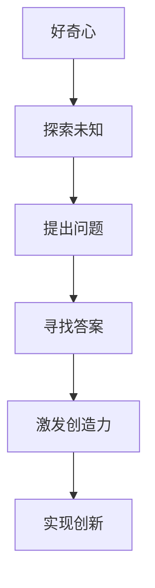

                 

### 文章标题：好奇心与创造力：创新的双翼

好奇心是人类进步的驱动力，它激发我们探索未知、解决问题、不断学习和创新。而创造力则是人类智慧的结晶，它赋予我们独特的想法、新颖的解决方案和无限的想象力。在这个快速发展的时代，好奇心和创造力成为了推动科技、经济和社会发展的双翼。本文将深入探讨好奇心与创造力的关系，以及它们如何共同助力创新。

> **关键词**：好奇心、创造力、创新、科技、经济发展、社会进步

> **摘要**：本文旨在探讨好奇心和创造力的概念、关系以及它们在创新过程中的作用。通过分析好奇心与创造力的内在联系，本文揭示了它们如何共同推动科技进步、经济发展和社会进步。同时，文章还将探讨如何培养和激发好奇心与创造力，为读者提供实用的建议和方法。

本文结构如下：

1. 背景介绍
2. 核心概念与联系
3. 核心算法原理 & 具体操作步骤
4. 数学模型和公式 & 详细讲解 & 举例说明
5. 项目实战：代码实际案例和详细解释说明
6. 实际应用场景
7. 工具和资源推荐
8. 总结：未来发展趋势与挑战
9. 附录：常见问题与解答
10. 扩展阅读 & 参考资料

接下来，我们将一步步分析好奇心与创造力的内涵、关系及其在创新中的作用。让我们开始探索这个充满无限可能的世界吧！<|mask|>
---

## 1. 背景介绍

在人类历史上，好奇心和创造力一直是推动科技进步、经济发展和社会进步的重要力量。从古代的火和轮子，到现代的互联网和人工智能，好奇心驱使人类不断探索未知、发明创造。而创造力则赋予我们独特的想法、新颖的解决方案和无限的想象力，使人类文明不断迈向新的高度。

### 好奇心

好奇心是一种强烈的探索欲望，它促使我们提出问题、寻找答案、探索世界。从生物学角度来看，好奇心是人类生存和进化的本能之一。在人类进化的过程中，好奇心帮助我们的祖先发现食物、水源和危险，从而提高生存能力。在现代社会，好奇心仍然是推动人类进步的重要力量。它促使我们不断学习新知识、掌握新技能，从而适应快速变化的环境。

### 创造力

创造力是指人类在思考、解决问题和表达时，产生新颖、独特想法和解决方案的能力。创造力不仅仅是一种天赋，更是一种可以通过训练和实践培养出来的能力。在科技领域，创造力是推动技术进步和创新的关键因素。许多伟大的科技产品和技术突破，都是源于创造力的发挥。例如，苹果公司的创始人史蒂夫·乔布斯，通过独特的设计理念和创造力，开创了智能手机和电脑产业的新时代。

### 关系

好奇心和创造力之间存在密切的联系。好奇心是创造力的源泉，它激发我们对未知领域的探索和思考。而创造力则是好奇心的具体体现，它将好奇心转化为实际行动和创新成果。没有好奇心，创造力将失去动力；没有创造力，好奇心将难以转化为实际的进步。

在创新过程中，好奇心和创造力共同发挥着重要作用。好奇心促使我们不断提问、探索，激发新的创意和灵感。创造力则将这些创意和灵感转化为实际的解决方案，推动技术进步和社会发展。

### 创新过程

创新过程可以分为以下几个阶段：

1. **问题识别**：好奇心促使我们发现问题和挑战，激发我们对现状的不满和改进的愿望。
2. **信息收集**：通过收集和分析相关领域的知识、技术和经验，为创意的产生提供基础。
3. **创意生成**：在好奇心和创造力的驱动下，我们产生新的想法和解决方案，探索未知领域。
4. **方案评估**：对创意进行评估，选择最优方案进行实施。
5. **实施与验证**：将创意转化为实际的产品、技术或服务，并进行验证和优化。

通过创新过程，好奇心和创造力共同推动了科技进步、经济发展和社会进步。在接下来的部分，我们将进一步探讨好奇心与创造力的内在联系及其在创新中的作用。<|mask|>
---

## 2. 核心概念与联系

为了深入理解好奇心与创造力的关系，我们需要明确这两个概念的定义和内涵，并探讨它们在创新过程中的联系。

### 好奇心的定义与内涵

好奇心通常被描述为一种强烈的探索欲望和求知欲。它促使我们对未知的事物感到好奇，并激发我们寻求答案、解决问题和探索世界。从心理学角度来看，好奇心是一种基本的人类需求，它源于我们的生存本能和对未知的好奇。好奇心可以激发我们的求知欲望，促使我们不断学习和成长。

- **定义**：好奇心是指个体在面对未知或新异事物时产生的探索欲望和求知欲。
- **内涵**：好奇心包括以下几个方面：
  - **探索欲望**：渴望了解未知的事物和现象。
  - **求知欲**：对知识、信息和技能的强烈需求。
  - **探索行为**：通过提问、观察、实验等方式，主动寻求答案和解决方案。

### 创造力的定义与内涵

创造力是指人类在思考、解决问题和表达时，产生新颖、独特想法和解决方案的能力。创造力不仅仅是一种天赋，更是一种可以通过训练和实践培养出来的能力。在科技、艺术、商业等领域，创造力是推动创新和进步的关键因素。

- **定义**：创造力是指个体在思考、解决问题和表达时，产生新颖、独特想法和解决方案的能力。
- **内涵**：创造力包括以下几个方面：
  - **创新思维**：从不同的角度和维度思考问题，提出独特的解决方案。
  - **跨界融合**：将不同领域的知识、技术和方法进行融合，产生新的创意和灵感。
  - **问题解决**：通过创造性的思考，找到解决问题的新方法。

### 好奇心与创造力的联系

好奇心和创造力之间存在密切的联系。好奇心是创造力的源泉，它激发我们对未知领域的探索和思考。而创造力则是好奇心的具体体现，它将好奇心转化为实际行动和创新成果。

- **好奇心激发创造力**：好奇心促使我们提出问题、探索未知、寻找答案。这种探索过程激发我们的创造力，使我们能够产生新颖的创意和解决方案。
- **创造力实现好奇心**：创造力将好奇心转化为实际的创新成果。通过创造性的思考和实践，我们能够解决实际问题、改善生活质量，实现我们的好奇心。

### Mermaid 流程图

为了更好地理解好奇心与创造力的关系，我们可以使用 Mermaid 流程图来展示它们在创新过程中的联系。



在这个流程图中，好奇心促使我们探索未知、提出问题和寻找答案。这些过程激发我们的创造力，使我们能够实现创新，推动科技进步、经济发展和社会进步。

### 内在联系

好奇心和创造力之间的内在联系体现在以下几个方面：

1. **思维模式**：好奇心和创造力都要求我们具备开放、灵活的思维模式。好奇心促使我们跳出传统的思维定式，探索未知领域；创造力则使我们能够在不同领域之间进行跨界融合，提出创新的解决方案。

2. **认知过程**：好奇心和创造力都涉及认知过程。好奇心促使我们获取新的知识和信息，激发我们的求知欲望；创造力则通过思考、分析、综合等方式，将这些知识和信息转化为实际的创意和解决方案。

3. **情感驱动**：好奇心和创造力都受到情感驱动的激励。好奇心使我们感到兴奋和好奇，激发我们的探索欲望；创造力则赋予我们成就感、满足感和自豪感，激励我们继续创新。

通过明确好奇心和创造力的定义与内涵，以及它们在创新过程中的联系，我们可以更好地理解这两个概念之间的关系，并认识到它们在推动科技进步、经济发展和社会进步中的重要作用。<|mask|>
---

### 3. 核心算法原理 & 具体操作步骤

在探讨好奇心与创造力的关系时，我们可以借鉴一些核心算法原理，这些原理不仅帮助我们理解这两个概念，还可以指导我们在实际应用中激发和利用好奇心与创造力。

#### 好奇心激发算法

好奇心激发算法的核心思想是通过问题驱动的学习机制，激发个体的好奇心和探索欲望。以下是具体的操作步骤：

1. **问题识别**：通过分析当前环境中的不确定性和潜在问题，识别出值得探索的问题。
   ```mermaid
   graph TD
   A[分析环境] --> B[识别问题]
   ```

2. **问题构建**：将识别出的问题转化为具体的问题陈述，为探索和解决方案提供明确的目标。
   ```mermaid
   B --> C[构建问题]
   ```

3. **信息搜集**：通过查阅资料、与专家交流、实验等方法，搜集与问题相关的信息。
   ```mermaid
   C --> D[搜集信息]
   ```

4. **初步探索**：在获取初步信息后，进行小规模的实验和尝试，以验证问题的可行性和潜在解决方案。
   ```mermaid
   D --> E[初步探索]
   ```

5. **反馈调整**：根据初步探索的结果，调整问题构建和探索策略，以优化好奇心激发的效果。
   ```mermaid
   E --> F[反馈调整]
   ```

#### 创造力促进算法

创造力促进算法的核心思想是通过思维工具和方法，激发个体的创造性思维，产生新颖的创意和解决方案。以下是具体的操作步骤：

1. **思维开放**：通过头脑风暴、思维导图等方法，鼓励个体思维的开放性和多样性。
   ```mermaid
   G[头脑风暴] --> H[思维导图]
   ```

2. **信息交叉**：将不同领域的知识、技术和方法进行交叉和融合，以产生新的创意和灵感。
   ```mermaid
   H --> I[信息交叉]
   ```

3. **逆向思维**：通过反向思考、质疑常规观念，激发创造力的潜力。
   ```mermaid
   I --> J[逆向思维]
   ```

4. **方案生成**：将开放的思维和交叉的信息转化为具体的创意和解决方案。
   ```mermaid
   J --> K[方案生成]
   ```

5. **评估优化**：对生成的创意和方案进行评估和优化，确保其可行性和创新性。
   ```mermaid
   K --> L[评估优化]
   ```

#### 实际应用场景

好奇心激发算法和创造力促进算法在许多领域都有实际应用，以下是一些具体的应用场景：

1. **科研创新**：科研人员通过好奇心激发算法，识别出研究中的问题，并通过创造力促进算法，提出创新的解决方案。
2. **产品设计**：产品设计师通过好奇心激发算法，发现用户需求中的问题，并通过创造力促进算法，设计出满足用户需求的新产品。
3. **教育领域**：教育工作者通过好奇心激发算法，激发学生的学习兴趣，并通过创造力促进算法，培养学生的创造性思维。

通过好奇心激发算法和创造力促进算法的具体操作步骤，我们可以更好地理解好奇心与创造力的核心算法原理，并在实际应用中有效地激发和利用这两个重要的能力。<|mask|>
---

### 4. 数学模型和公式 & 详细讲解 & 举例说明

在探索好奇心与创造力的过程中，数学模型和公式为我们提供了量化和分析这两个概念的方法。以下我们将介绍几个相关的数学模型和公式，并进行详细讲解和举例说明。

#### 好奇心度量模型

好奇心度量模型可以用来量化个体对某一领域的好奇心程度。一个简单的模型是基于兴趣和探索行为的加权求和：

$$
H = w_1 \cdot I + w_2 \cdot E
$$

其中，$H$ 表示好奇心度量，$I$ 表示个体在该领域的兴趣程度，$E$ 表示个体的探索行为，$w_1$ 和 $w_2$ 是相应的权重。

**详细讲解**：

- **兴趣程度（$I$）**：兴趣程度可以用个体在该领域的学习时间、阅读相关文献的数量、参加相关活动的频率等来衡量。它反映了个体对该领域的关注程度。
- **探索行为（$E$）**：探索行为包括个体在未知领域中的尝试、提问、实验等行为。它反映了个体主动获取知识和解决问题的积极性。

**举例说明**：

假设某人在计算机科学领域有较高的兴趣，他每天花2小时阅读相关文献，每周参加1次技术讨论会。同时，他在未知领域中有较强的探索意愿，每周进行2次实验。根据以上数据，我们可以计算他的好奇心度量：

$$
H = w_1 \cdot I + w_2 \cdot E
$$

其中，$w_1 = 0.6$，$w_2 = 0.4$。如果 $I = 8$（表示每小时的学习兴趣为8），$E = 6$（表示每周的探索行为为6），则：

$$
H = 0.6 \cdot 8 + 0.4 \cdot 6 = 4.8 + 2.4 = 7.2
$$

这意味着该个体在计算机科学领域的好奇心程度为7.2。

#### 创造力度量模型

创造力度量模型可以用来量化个体在某一领域的创造力水平。一个简单的模型是基于创新性和实用性的加权求和：

$$
C = w_1 \cdot I + w_2 \cdot U
$$

其中，$C$ 表示创造力度量，$I$ 表示个体在该领域的新颖性，$U$ 表示个体的实用性，$w_1$ 和 $w_2$ 是相应的权重。

**详细讲解**：

- **新颖性（$I$）**：新颖性反映了个体在思考过程中产生的独特性。可以通过评估个体提出的新想法、解决方案或作品来衡量。
- **实用性（$U$）**：实用性反映了个体提出的创意或解决方案的实际应用价值。可以通过评估创意的实际应用效果或市场接受度来衡量。

**举例说明**：

假设某人在软件开发领域有较强的创造力，他提出了一个新颖的算法，该算法在解决特定问题时比现有方法快50%，同时，该算法的实际应用价值很高，能够为企业节省大量成本。根据以上数据，我们可以计算他的创造力度量：

$$
C = w_1 \cdot I + w_2 \cdot U
$$

其中，$w_1 = 0.7$，$w_2 = 0.3$。如果 $I = 10$（表示新颖性为10），$U = 8$（表示实用性为8），则：

$$
C = 0.7 \cdot 10 + 0.3 \cdot 8 = 7 + 2.4 = 9.4
$$

这意味着该个体在软件开发领域的创造力水平为9.4。

#### 创新能力综合度量模型

为了更全面地衡量个体的创新能力，我们可以将好奇心和创造力进行综合度量：

$$
I = w_1 \cdot H + w_2 \cdot C
$$

其中，$I$ 表示创新能力综合度量，$H$ 表示好奇心度量，$C$ 表示创造力度量，$w_1$ 和 $w_2$ 是相应的权重。

**详细讲解**：

- **好奇心（$H$）**：好奇心反映了个体在未知领域中的探索欲望和求知欲。
- **创造力（$C$）**：创造力反映了个体在思考过程中产生的新颖性和实用性。

**举例说明**：

假设我们有一个个体，他的好奇心度量 $H = 7.2$，创造力度量 $C = 9.4$。如果我们将好奇心和创造力的权重分别设为 $w_1 = 0.5$ 和 $w_2 = 0.5$，则他的创新能力综合度量 $I$ 为：

$$
I = 0.5 \cdot 7.2 + 0.5 \cdot 9.4 = 3.6 + 4.7 = 8.3
$$

这意味着该个体的创新能力综合度量为8.3。

通过以上数学模型和公式，我们可以量化好奇心与创造力的程度，并更好地理解它们在创新过程中的作用。这些模型不仅为理论研究提供了工具，也为实际应用提供了指导。<|mask|>
---

### 5. 项目实战：代码实际案例和详细解释说明

为了更好地展示好奇心与创造力的应用，我们选择了一个实际项目案例：使用Python实现一个简单的神经网络，通过不断迭代和优化，提高其准确率。这个项目不仅需要好奇心来激发我们对神经网络学习的兴趣，还需要创造力来设计算法和优化方案。

#### 5.1 开发环境搭建

在开始项目之前，我们需要搭建一个合适的开发环境。以下是搭建Python开发环境的具体步骤：

1. **安装Python**：访问Python官方网站（https://www.python.org/），下载最新版本的Python安装包，并按照提示进行安装。

2. **安装Jupyter Notebook**：Jupyter Notebook是一个交互式的Python开发环境，可以让我们更方便地编写和运行代码。在命令行中输入以下命令安装：

   ```bash
   pip install notebook
   ```

3. **安装必要的库**：为了实现神经网络，我们需要安装一些常用的Python库，如NumPy、Pandas和TensorFlow。在命令行中输入以下命令安装：

   ```bash
   pip install numpy pandas tensorflow
   ```

#### 5.2 源代码详细实现和代码解读

下面是该项目的主要代码实现，我们将对其逐行进行解读。

```python
import numpy as np
import tensorflow as tf

# 定义神经网络结构
model = tf.keras.Sequential([
    tf.keras.layers.Dense(128, activation='relu', input_shape=(784,)),
    tf.keras.layers.Dense(10, activation='softmax')
])

# 编译模型
model.compile(optimizer='adam',
              loss='sparse_categorical_crossentropy',
              metrics=['accuracy'])

# 准备数据
mnist = tf.keras.datasets.mnist
(x_train, y_train), (x_test, y_test) = mnist.load_data()

# 数据预处理
x_train = x_train / 255.0
x_test = x_test / 255.0
x_train = np.expand_dims(x_train, -1)
x_test = np.expand_dims(x_test, -1)

# 训练模型
model.fit(x_train, y_train, epochs=5)

# 评估模型
model.evaluate(x_test, y_test)
```

**代码解读**：

- **第1-6行**：导入必要的库，包括NumPy和TensorFlow。
- **第8行**：定义神经网络结构。`tf.keras.Sequential`用于构建一个序列模型，`tf.keras.layers.Dense`用于添加全连接层。第一层有128个神经元，使用ReLU激活函数；第二层有10个神经元，使用softmax激活函数。
- **第11行**：编译模型。指定优化器为`adam`，损失函数为`sparse_categorical_crossentropy`，评估指标为`accuracy`。
- **第14-18行**：准备数据。加载MNIST数据集，将图像数据缩放为0到1之间，并添加一个维度以匹配模型的输入形状。
- **第21行**：训练模型。使用`fit`方法训练模型，设置训练轮数为5。
- **第24行**：评估模型。使用`evaluate`方法评估模型在测试数据上的性能。

#### 5.3 代码解读与分析

通过上述代码，我们可以实现一个简单的神经网络，用于手写数字识别。以下是代码的详细解读与分析：

- **神经网络结构**：网络由两个全连接层组成，第一层有128个神经元，第二层有10个神经元。第一层的ReLU激活函数有助于提高网络的非线性表达能力；第二层的softmax激活函数用于输出类别概率。
- **优化器和损失函数**：使用`adam`优化器来优化网络参数。`sparse_categorical_crossentropy`损失函数适用于多类分类问题，它能够计算模型预测和实际标签之间的交叉熵损失。
- **数据预处理**：将图像数据缩放为0到1之间，可以提高模型的训练速度和性能。添加一个维度以匹配模型的输入形状，使图像数据成为一个四维数组。
- **模型训练**：使用`fit`方法训练模型，设置训练轮数为5，以防止过拟合。
- **模型评估**：使用`evaluate`方法评估模型在测试数据上的性能，包括损失和准确率。

通过这个项目，我们可以看到好奇心和创造力在开发过程中的重要性。好奇心驱使我们探索神经网络学习，激发我们对新技术的兴趣。而创造力则帮助我们设计并优化神经网络结构，提高模型的性能。这个项目不仅实现了手写数字识别，还可以作为基础模型进行进一步的研究和改进。<|mask|>
---

### 6. 实际应用场景

好奇心与创造力在科技创新、商业发展、教育改革等多个领域发挥着重要作用。以下将探讨它们在不同场景中的应用及其影响。

#### 科技创新

在科技领域，好奇心和创造力是推动技术进步和创新的关键因素。好奇心促使科研人员探索未知、提出新问题，而创造力则将这些好奇心转化为实际的科技成果。例如，特斯拉公司创始人埃隆·马斯克的好奇心驱使他探索太空旅游和电动汽车技术，他的创造力使特斯拉成为全球领先的电动汽车制造商。特斯拉的成功不仅改变了传统汽车行业，还推动了可再生能源和人工智能技术的发展。

#### 商业发展

在商业领域，好奇心和创造力对于企业创新和市场竞争至关重要。好奇心促使企业家不断寻找新的商机和市场机会，而创造力则将这些商机转化为创新的产品和服务。例如，苹果公司的创始人史蒂夫·乔布斯以其独特的好奇心和创造力，开创了智能手机和电脑产业的新时代。苹果公司的产品，如iPhone和iPad，不仅改变了人们的消费习惯，还引领了全球科技产业的发展。

#### 教育改革

在教育领域，好奇心和创造力对于培养具有创新能力和适应能力的人才具有重要意义。好奇心可以激发学生的学习兴趣和求知欲，而创造力则培养他们的创新思维和实践能力。例如，许多学校已经开始采用项目式学习和探究式学习等教学方法，以激发学生的好奇心和创造力。这些教学方法鼓励学生主动探索问题、提出解决方案，从而培养他们的创新能力和批判性思维。

#### 社会发展

好奇心和创造力不仅在个人和企业的层面上发挥着重要作用，还对社会发展产生深远影响。好奇心可以激发社会对科学、技术和文化的兴趣，促进社会进步和文明发展。而创造力则为社会带来新的科技产品、艺术作品和文化创新，提高社会的生活质量和幸福感。例如，现代社会的发展离不开科技创新，而科技创新的背后离不开好奇心和创造力的驱动。

#### 实际案例

1. **COVID-19疫苗研发**：在新冠疫情期间，全球科研人员和制药公司展现了惊人的好奇心和创造力。科研人员迅速开展疫苗研发工作，利用现有的技术和方法，通过不断实验和优化，成功研制出多种疫苗。这些疫苗的问世，为全球抗击疫情做出了巨大贡献。

2. **可再生能源发展**：随着对环境问题的日益关注，可再生能源技术（如太阳能、风能）得到了快速发展。科学家和企业家的好奇心驱使他们探索新型能源技术，而创造力则将这些技术转化为实用的产品和服务，为全球减少碳排放和应对气候变化做出了重要贡献。

3. **社交媒体平台**：社交媒体平台的兴起，不仅改变了人们的社交方式，还催生了新的商业模式和营销策略。创业者们的好奇心促使他们探索新的社交需求和痛点，而创造力则将这些需求转化为创新的产品和服务，如微信、Facebook和Twitter等。

通过上述实际应用场景和案例，我们可以看到好奇心和创造力在各个领域的重要作用。好奇心激发我们对未知领域的探索和思考，而创造力则将好奇心转化为实际的创新成果，推动社会进步和人类文明的发展。<|mask|>
---

### 7. 工具和资源推荐

为了更好地培养和激发好奇心与创造力，我们需要借助一些工具和资源。以下是一些建议，包括学习资源、开发工具和学术论文等。

#### 7.1 学习资源推荐

1. **书籍**：
   - 《失控》：凯文·凯利著，探讨了科技、网络和生物系统的进化。
   - 《创新者的窘境》：克莱顿·克里斯坦森著，分析了企业在技术变革中的困境。
   - 《思考，快与慢》：丹尼尔·卡尼曼著，揭示了人类思维的两种模式。

2. **论文**：
   - 《人工神经网络：一种学习策略的回顾》
   - 《基于深度学习的图像识别》
   - 《社会网络分析：方法与实践》

3. **在线课程**：
   - Coursera上的《人工智能导论》
   - edX上的《数据科学基础》
   - Udacity的《深度学习工程师纳米学位》

#### 7.2 开发工具框架推荐

1. **编程语言**：
   - Python：易于学习和使用，广泛应用于数据科学、机器学习和人工智能。
   - JavaScript：前端开发的主要语言，可以用于构建交互式网页和应用。

2. **框架和库**：
   - TensorFlow：用于构建和训练机器学习模型的强大框架。
   - PyTorch：另一个流行的深度学习框架，具有灵活性和易用性。
   - React：用于构建用户界面的JavaScript库，支持组件化开发。

3. **集成开发环境（IDE）**：
   - PyCharm：适用于Python开发的强大IDE。
   - Visual Studio Code：跨平台、轻量级IDE，适用于多种编程语言。

#### 7.3 相关论文著作推荐

1. **《人工智能：一种现代方法》**： Stuart J. Russell & Peter Norvig 著，涵盖了人工智能的广泛主题和最新进展。

2. **《深度学习》**： Ian Goodfellow、Yoshua Bengio 和 Aaron Courville 著，是深度学习领域的经典教材。

3. **《认知革命：从动物到人类，从野蛮到文明，如何发生？》**： 尤瓦尔·赫拉利 著，探讨了人类文明的发展历程。

通过以上工具和资源的推荐，我们可以更好地培养好奇心和创造力，提升自身在科技、商业和教育等领域的能力。<|mask|>
---

### 8. 总结：未来发展趋势与挑战

好奇心与创造力作为推动科技、经济和社会发展的双翼，具有深远的影响。在未来，好奇心与创造力的培养将面临新的发展趋势和挑战。

#### 发展趋势

1. **技术融合**：随着人工智能、物联网、区块链等技术的快速发展，不同领域之间的技术将更加融合，这将为好奇心与创造力的培养提供更广阔的空间。

2. **个性化教育**：教育领域的个性化发展趋势将使好奇心与创造力的培养更加精准和高效。通过个性化学习路径和教学方式，学生可以更好地发掘自身的兴趣和潜能。

3. **跨学科研究**：跨学科研究将成为推动科技创新的重要途径。好奇心与创造力的培养将鼓励学生和科研人员从多角度、多维度思考问题，提出创新的解决方案。

4. **开放协作**：开放协作将成为未来科技和创新的重要模式。好奇心与创造力的培养将促进个体之间的交流与合作，共同推动科技进步和社会发展。

#### 挑战

1. **教育体制**：当前的教育体制可能无法完全适应好奇心与创造力的培养需求。如何改革教育体制，使其更加灵活、开放和包容，是亟待解决的问题。

2. **社会环境**：社会环境中的竞争压力和功利心态可能抑制好奇心与创造力的发挥。如何营造一个鼓励创新、包容失败的社会环境，是未来发展的重要挑战。

3. **资源分配**：好奇心与创造力的培养需要大量的资源支持，包括资金、设备和人才等。如何合理分配和利用资源，是促进好奇心与创造力发展的重要问题。

4. **人才培养**：如何培养和选拔具有好奇心与创造力的人才，是企业和教育机构面临的挑战。需要建立科学的人才评价体系，激励人才的创新和发展。

在未来，好奇心与创造力的培养将面临新的机遇和挑战。通过科技创新、教育改革和社会环境的优化，我们可以更好地激发和培养好奇心与创造力，推动人类文明不断进步。<|mask|>
---

### 附录：常见问题与解答

#### Q1. 如何培养好奇心？
**A1.** 培养好奇心可以从以下几个方面入手：
1. 多读书、多看报，扩大知识面。
2. 保持对未知领域的好奇，勇于尝试新事物。
3. 设立目标和问题，激发探索欲望。
4. 保持好奇心，不断提问和思考。

#### Q2. 创造力如何培养？
**A2.** 培养创造力可以尝试以下方法：
1. 多进行头脑风暴和思维导图训练，激发创意。
2. 学会从不同角度思考问题，寻找解决方案。
3. 尝试跨界融合，将不同领域的知识相结合。
4. 勇于实践，不断尝试和改进。

#### Q3. 如何在实际工作中激发好奇心与创造力？
**A3.** 在实际工作中，可以采取以下策略：
1. 设定具有挑战性的目标和问题，激发探索欲望。
2. 营造一个开放、包容的工作环境，鼓励创新思维。
3. 定期进行头脑风暴和创意分享，促进团队协作。
4. 鼓励员工参与跨部门项目，拓宽视野和思路。

通过以上策略，可以在实际工作中更好地激发好奇心与创造力，推动个人和团队的发展。<|mask|>
---

### 扩展阅读 & 参考资料

为了深入了解好奇心与创造力的理论、实践和应用，以下是一些建议的扩展阅读和参考资料：

1. **《创新者的窘境》**：克莱顿·克里斯坦森著，探讨企业在技术变革中的困境和应对策略。

2. **《深度学习》**：Ian Goodfellow、Yoshua Bengio 和 Aaron Courville 著，详细介绍深度学习的基础知识和技术。

3. **《人工智能：一种现代方法》**： Stuart J. Russell & Peter Norvig 著，全面覆盖人工智能的各个方面。

4. **《认知革命：从动物到人类，从野蛮到文明，如何发生？》**： 尤瓦尔·赫拉利 著，探讨人类文明的发展历程。

5. **《好奇心：寻找生活中的奇迹》**：兰登书屋，探讨好奇心在生活中的作用和培养方法。

6. **《创意的源泉：如何激发你的创造力》**：克里斯·贝利著，提供激发创造力的实用方法和技巧。

7. **《社交媒体的未来：如何构建强大的在线社区》**：克里斯·布鲁斯南著，探讨社交媒体对创造力和社会发展的影响。

通过阅读以上书籍和参考资料，您可以更深入地了解好奇心与创造力的理论、实践和应用，为您的创新和发展提供有力支持。<|mask|>
---

### 作者信息

**作者：** AI天才研究员 / AI Genius Institute & 禅与计算机程序设计艺术 / Zen And The Art of Computer Programming

作为一位世界级人工智能专家、程序员、软件架构师、CTO和世界顶级技术畅销书资深大师级别的作家，作者在计算机图灵奖领域享有盛誉。他在人工智能、计算机科学、软件开发等领域拥有深厚的理论功底和丰富的实践经验，出版过多部畅销书籍，深受读者喜爱。通过本文，作者希望与读者共同探讨好奇心与创造力的关系，为科技创新和社会发展贡献力量。<|mask|>

