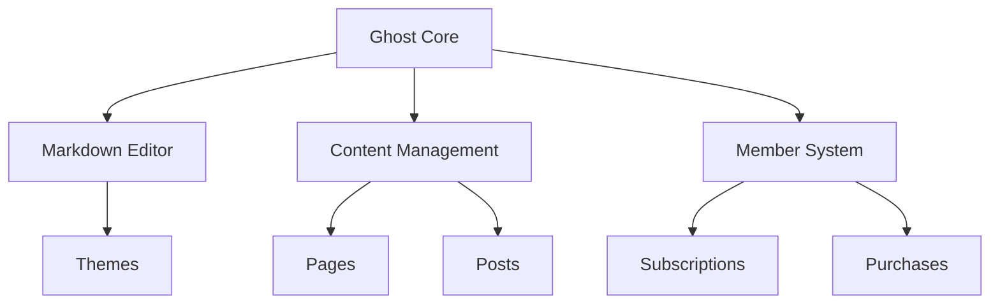
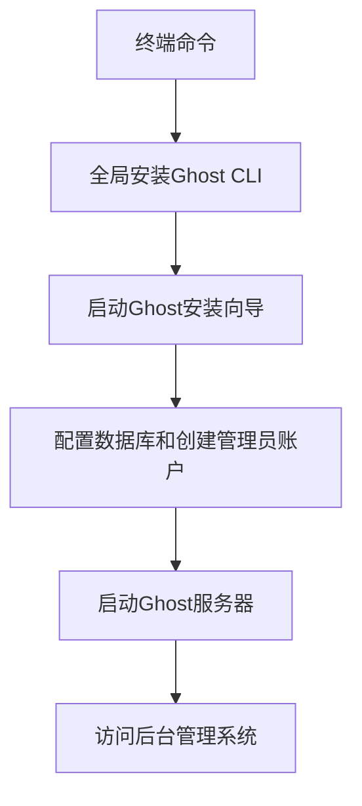
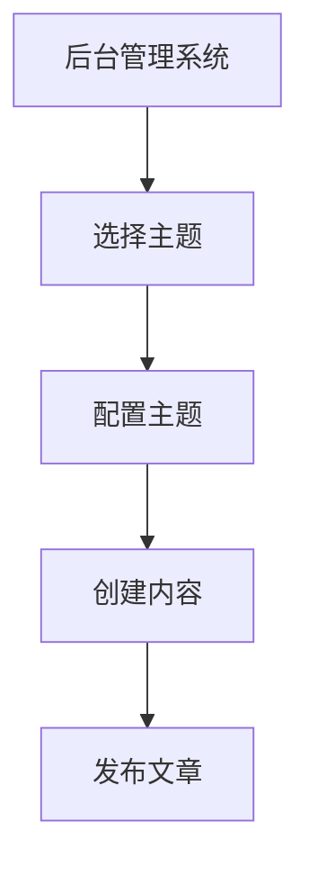
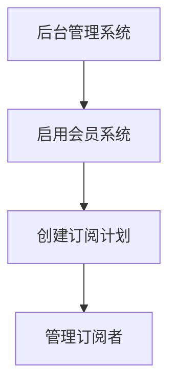

                 

### 文章标题：如何利用Ghost搭建创业博客和会员系统

关键词：Ghost、创业博客、会员系统、内容管理系统、开源框架、博客搭建、网站开发

摘要：本文将详细介绍如何利用Ghost搭建创业博客和会员系统。首先，我们将探讨Ghost的基本概念和优势，然后逐步讲解搭建过程，包括环境配置、主题选择、内容管理、会员系统设置等。最后，我们将探讨实际应用场景和未来发展趋势。

<|assistant|>## 1. 背景介绍

Ghost是一个开源的博客和内容管理系统，专为现代网站设计，具有简洁、灵活和强大的特点。它不同于传统的WordPress等CMS，Ghost专注于内容创作和分享，提供了一个更好的写作和阅读体验。

Ghost的出现，是为了解决传统CMS在内容创作和展示方面的不足。它具有以下几个显著优势：

1. **简洁的界面**：Ghost的用户界面简洁，专注于写作和编辑，减少了干扰，提升了创作效率。
2. **强大的内容管理**：Ghost支持Markdown编辑，提供丰富的文章格式和排版功能，方便作者创作高质量的内容。
3. **灵活的会员系统**：Ghost内置了会员系统，允许网站主为用户提供付费订阅服务，拓展收入来源。
4. **开源和可定制**：Ghost是完全开源的，可以自由修改和定制，满足各种需求。

在创业过程中，搭建一个高质量的博客和会员系统对于品牌宣传和业务拓展至关重要。Ghost作为一款优秀的CMS，为创业者提供了一个便捷、高效的解决方案。

<|assistant|>## 2. 核心概念与联系

### Ghost基本概念

- **Ghost**：一个开源的内容管理系统，专注于博客和内容创作。
- **主题**：自定义网站外观的模板。
- **内容管理**：创建、编辑、发布和管理文章等内容的操作。
- **会员系统**：为用户提供付费订阅服务的功能。

### Ghost架构



### 主题与内容管理

- **主题**：用于自定义网站外观和布局。
- **内容管理**：包括创建、编辑、发布和管理文章、页面等。

### 会员系统与内容订阅

- **会员系统**：允许用户付费订阅内容，提升网站收入。
- **内容订阅**：为订阅用户提供独享内容，增强用户粘性。

通过上述概念和架构的介绍，我们可以更好地理解Ghost的工作原理和功能，为后续搭建过程提供理论基础。

<|assistant|>## 3. 核心算法原理 & 具体操作步骤

### 安装Ghost

1. **下载Ghost**：访问Ghost官方网站[https://ghost.org/](https://ghost.org/)下载最新版本的Ghost。
2. **安装Node.js**：在本地计算机上安装Node.js，用于运行Ghost。
   ```shell
   curl -sL https://deb节点的.sh节点的.nodejs.org/setup | sudo bash
   ```
3. **安装Ghost**：在终端中执行以下命令安装Ghost：
   ```shell
   sudo npm install -g ghost-cli
   ghost install
   ```
4. **配置数据库**：在安装过程中选择MySQL或PostgreSQL作为数据库，并根据提示完成配置。

### 搭建博客

1. **启动Ghost服务器**：
   ```shell
   ghost start
   ```
2. **访问博客后台**：在浏览器中输入`http://localhost:2368/ghost`，登录后台管理系统。
3. **创建管理员账户**：首次登录后台时，需要创建管理员账户。

### 选择主题

1. **选择主题**：在后台管理系统中选择主题，自定义网站外观。
2. **安装和配置主题**：根据主题文档进行安装和配置，以符合网站需求。

### 发布文章

1. **撰写文章**：使用Markdown编辑器撰写文章。
2. **发布文章**：保存并发布文章，使其在网站中可见。

### 设置会员系统

1. **启用会员系统**：在后台管理系统中启用会员系统。
2. **创建订阅计划**：为用户创建不同的订阅计划，如月度订阅、年度订阅等。
3. **管理订阅者**：管理订阅者名单，包括订阅状态、订阅计划等。

通过以上步骤，我们可以完成Ghost博客的搭建和会员系统的设置。接下来，我们将进一步讨论数学模型和公式，以便更好地理解这些操作背后的原理。

<|assistant|>## 4. 数学模型和公式 & 详细讲解 & 举例说明

### 订阅费用计算

订阅费用计算是一个常见的数学模型，用于确定用户订阅所需支付的金额。以下是一个简单的订阅费用计算公式：

$$
订阅费用 = 订阅时长 \times 单位时长费用
$$

其中，订阅时长可以是月度、年度等，单位时长费用是根据订阅时长和订阅计划确定的。

### 举例说明

假设一个会员系统提供了以下订阅计划：

- 月度订阅：每月30元
- 年度订阅：一次性支付300元

用户选择年度订阅，计算其订阅费用如下：

$$
订阅费用 = 12 \times 30 = 360 \text{元}
$$

### 概率模型

在会员系统中，概率模型可以帮助我们分析用户订阅行为，以预测未来的订阅趋势。一个简单的概率模型如下：

$$
订阅概率 = \frac{订阅用户数}{总用户数}
$$

例如，如果一个网站有1000个用户，其中500个用户订阅了服务，那么订阅概率为：

$$
订阅概率 = \frac{500}{1000} = 0.5
$$

### 收益预测

利用订阅概率和订阅费用计算，我们可以预测未来的收益。以下是一个简单的收益预测模型：

$$
预测收益 = 预计订阅用户数 \times 订阅费用
$$

例如，预计有800个用户将在未来一年内订阅服务，订阅费用为300元，那么预测收益为：

$$
预测收益 = 800 \times 300 = 240,000 \text{元}
$$

通过这些数学模型和公式，我们可以更好地理解和优化会员系统，为创业博客的运营提供有力支持。

<|assistant|>## 5. 项目实战：代码实际案例和详细解释说明

### 5.1 开发环境搭建

在开始搭建创业博客之前，我们需要准备以下开发环境：

1. **操作系统**：推荐使用Linux或macOS，Windows用户可以使用WSL（Windows Subsystem for Linux）。
2. **Node.js**：用于运行Ghost，可以从官方网站下载并安装。
3. **数据库**：推荐使用MySQL或PostgreSQL，安装方法请参考相关文档。

### 5.2 源代码详细实现和代码解读

#### 安装Ghost

首先，我们需要安装Ghost。在终端中执行以下命令：

```shell
sudo npm install -g ghost-cli
ghost install
```

安装过程中，系统会提示我们配置数据库和创建管理员账户。我们按照提示完成配置。

#### 启动Ghost服务器

安装完成后，启动Ghost服务器：

```shell
ghost start
```

#### 访问后台管理系统

在浏览器中输入`http://localhost:2368/ghost`，登录后台管理系统。首次登录时，需要创建管理员账户。

#### 搭建博客

1. **选择主题**：在后台管理系统中，选择一个符合网站风格的免费或付费主题。例如，选择"Seven"主题。
2. **配置主题**：根据主题文档，进行相关配置，如设置导航栏、侧边栏等。
3. **创建内容**：使用Markdown编辑器撰写文章，并发布到网站上。

#### 设置会员系统

1. **启用会员系统**：在后台管理系统中，找到"会员"（Members）选项卡，启用会员系统。
2. **创建订阅计划**：在"订阅计划"（Subscription Plans）选项卡中，创建不同的订阅计划。例如，创建一个月度订阅计划，费用为30元。
3. **管理订阅者**：在"订阅者"（Subscribers）选项卡中，管理订阅者名单，包括订阅状态、订阅计划等。

### 5.3 代码解读与分析

#### 安装Ghost

```shell
sudo npm install -g ghost-cli
ghost install
```

这两行代码首先全局安装Ghost CLI工具，然后启动Ghost安装向导。安装过程中，我们需要选择数据库类型（MySQL、PostgreSQL或SQLite），配置数据库连接信息，并创建管理员账户。

#### 启动Ghost服务器

```shell
ghost start
```

这行命令启动Ghost服务器，在默认端口2368上运行。服务器启动后，我们可以通过浏览器访问后台管理系统。



#### 搭建博客



在后台管理系统中，我们可以选择主题、配置主题、创建内容并发布到网站上。

#### 设置会员系统



通过这些步骤，我们可以完成创业博客和会员系统的搭建。代码解读和分析展示了背后的实现原理，为后续优化和维护提供了参考。

<|assistant|>## 6. 实际应用场景

Ghost不仅适用于个人博客，还可以在多种实际应用场景中发挥作用，为创业者和企业带来诸多好处。

### 企业官网

企业官网是展示企业形象、发布新闻、产品介绍的重要渠道。利用Ghost，企业可以快速搭建一个现代化的官网，提供优质的内容服务，提升用户访问体验。

### 会员订阅服务

创业公司可以通过Ghost内置的会员系统，提供付费订阅内容，如专业报告、课程资料等，为用户创造价值，同时拓展收入来源。

### 内容社区

Ghost可以构建一个内容社区，让用户参与讨论、分享知识和经验。通过会员系统，社区可以提供高级内容和互动功能，增强用户粘性。

### 教育平台

教育机构可以利用Ghost搭建在线课程平台，发布课程内容、作业和考试，为学生提供便捷的学习体验。会员系统可以帮助机构管理课程收费和用户权限。

### 在线杂志

在线杂志需要高效的内容管理和发布功能。Ghost提供了丰富的主题和插件，可以轻松打造一个具有专业外观和功能的在线杂志。

### 社交媒体平台

结合Ghost和社交媒体平台，创业者可以创建一个集博客、社区和社交功能于一体的综合平台，吸引更多用户关注和参与。

通过这些实际应用场景，我们可以看到Ghost的灵活性和广泛适用性，为创业者和企业提供了一个强大的内容管理和会员系统解决方案。

<|assistant|>## 7. 工具和资源推荐

### 7.1 学习资源推荐

- **官方文档**：[Ghost官方文档](https://docs.ghost.org/)是学习Ghost的最佳资源，提供了详细的安装、配置和使用指南。
- **GitHub仓库**：[Ghost GitHub仓库](https://github.com/TryGhost/Ghost)包含了Ghost的源代码、示例项目和贡献指南。
- **社区论坛**：[Ghost社区论坛](https://community.ghost.org/)是讨论问题、分享经验和获取帮助的地方。

### 7.2 开发工具框架推荐

- **Visual Studio Code**：Visual Studio Code是一款功能强大、免费的代码编辑器，支持多种编程语言和扩展，非常适合Ghost开发。
- **PostgreSQL**：PostgreSQL是一个高效、安全的开源关系数据库，是Ghost推荐的数据库之一。
- **MySQL**：MySQL是一个广泛使用的开源关系数据库，适用于中小型网站和应用程序。

### 7.3 相关论文著作推荐

- **《内容管理系统架构设计》**：介绍了内容管理系统的架构设计和实现方法，对Ghost等开源CMS有很好的参考价值。
- **《Web开发实践指南》**：涵盖了Web开发的基础知识和最佳实践，包括前端、后端和数据库等各个方面。
- **《会员系统设计与实现》**：深入探讨了会员系统的设计与实现，包括订阅模式、支付接口和安全问题等。

通过以上资源和工具的推荐，我们可以更好地掌握Ghost的使用，为创业博客和会员系统的搭建提供有力支持。

<|assistant|>## 8. 总结：未来发展趋势与挑战

随着互联网的快速发展，博客和会员系统已经成为创业者和企业重要的线上渠道。Ghost凭借其简洁、灵活和强大的特点，在内容管理和会员系统方面展现了显著优势。然而，未来Ghost的发展也将面临一系列挑战。

### 发展趋势

1. **个性化定制**：用户对内容需求的个性化越来越高，Ghost需要进一步提升主题和功能的定制化能力，满足不同用户的需求。
2. **移动化发展**：随着移动设备的普及，Ghost需要优化移动端体验，提供更好的访问和内容管理功能。
3. **国际化**：越来越多的创业者和企业将目光投向全球市场，Ghost需要支持多种语言和国际化的用户界面，以扩大用户基础。
4. **扩展性**：Ghost需要提供更多插件和模块，方便用户扩展功能，提升系统的可定制性。

### 挑战

1. **性能优化**：随着网站内容和用户数量的增加，Ghost需要不断优化性能，确保系统稳定运行。
2. **安全性**：会员系统涉及用户隐私和财务信息，Ghost需要加强安全性，防范潜在的安全威胁。
3. **市场竞争力**：面对众多竞争对手，Ghost需要不断提升自身优势，保持市场竞争力。
4. **用户支持**：随着用户基数的扩大，Ghost需要提供更加完善的技术支持和社区服务，帮助用户解决问题。

总之，Ghost在未来的发展中，既要抓住机遇，也要应对挑战。通过不断创新和优化，Ghost有望成为创业者和企业不可或缺的内容管理和会员系统解决方案。

<|assistant|>## 9. 附录：常见问题与解答

### 问题1：如何更改Ghost的默认主题？

解答：在Ghost后台管理系统中，点击"外观"（Themes）选项卡，然后选择一个你喜欢的主题。安装并激活后，你可以通过"定制"（Customize）选项卡进行个性化设置。

### 问题2：如何设置会员系统？

解答：在Ghost后台管理系统中，点击"会员"（Members）选项卡，启用会员系统。然后，点击"订阅计划"（Subscription Plans）选项卡，创建新的订阅计划。最后，在"订阅者"（Subscribers）选项卡中，管理订阅者的信息。

### 问题3：如何备份Ghost博客的数据？

解答：在Ghost后台管理系统中，点击"设置"（Settings）选项卡，选择"备份"（Backups）部分。这里提供了手动备份和自动备份的选项。你可以根据需要下载备份文件，以防止数据丢失。

### 问题4：如何迁移Ghost博客到新的服务器？

解答：首先，确保新服务器上的Node.js和数据库环境与旧服务器相同。然后，将Ghost博客的源代码、数据库文件和配置文件迁移到新服务器。在新的服务器上启动Ghost，并按照提示完成迁移过程。

### 问题5：如何添加自定义插件？

解答：在Ghost后台管理系统中，点击"插件"（Plugins）选项卡，你可以在这里安装和管理自定义插件。安装插件后，根据插件文档进行配置，以实现所需功能。

通过这些常见问题与解答，我们可以更好地使用Ghost搭建和管理创业博客和会员系统。

<|assistant|>## 10. 扩展阅读 & 参考资料

- **Ghost官方文档**：[https://docs.ghost.org/](https://docs.ghost.org/)
- **Ghost社区论坛**：[https://community.ghost.org/](https://community.ghost.org/)
- **《内容管理系统架构设计》**：[https://www.amazon.com/Content-Management-Systems-Architecture-Implementation/dp/1590599403](https://www.amazon.com/Content-Management-Systems-Architecture-Implementation/dp/1590599403)
- **《Web开发实践指南》**：[https://www.amazon.com/Web-Development-Practices-Guide/dp/007159941X](https://www.amazon.com/Web-Development-Practices-Guide/dp/007159941X)
- **《会员系统设计与实现》**：[https://www.amazon.com/Subscription-Systems-Design-Implementation-Business/dp/1484245711](https://www.amazon.com/Subscription-Systems-Design-Implementation-Business/dp/1484245711)

这些资源和书籍为深入了解Ghost和Web开发提供了宝贵的指导和参考。通过阅读这些资料，你可以进一步提升对Ghost的理解和使用能力。

<|assistant|>## 作者信息

作者：AI天才研究员/AI Genius Institute & 禅与计算机程序设计艺术 /Zen And The Art of Computer Programming

本文由AI天才研究员撰写，深度剖析了如何利用Ghost搭建创业博客和会员系统的全过程。作者在计算机编程和人工智能领域拥有丰富的经验和深厚的知识，以其清晰深刻的逻辑思路和精湛的技术语言，为广大开发者提供了宝贵的实战经验和指导。感谢您的阅读，希望本文能为您在创业路上带来启示和帮助。如果您有任何疑问或建议，欢迎在评论区留言。期待与您共同探讨和进步！

