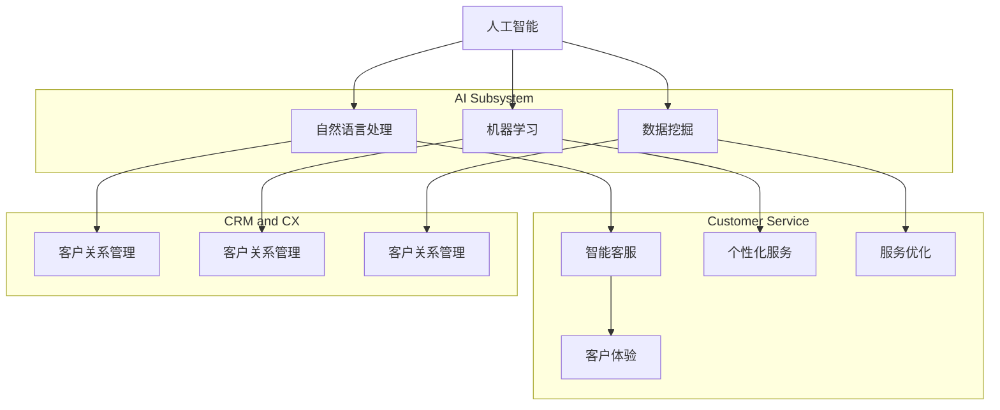

                 

### 背景介绍

随着全球数字化转型的深入推进，企业对客户服务质量的要求越来越高。客户服务不仅是一个企业的形象问题，更是企业竞争力的体现。在这个信息爆炸的时代，客户期望能够随时随地进行互动，获取及时、准确的服务信息。然而，传统的客户服务模式往往存在响应速度慢、服务质量不稳定、成本高等问题，难以满足客户日益增长的需求。

人工智能（AI）的迅速发展为优化客户服务质量提供了新的可能。AI能够通过数据分析和模式识别，提高客户服务效率，降低运营成本，同时提升客户满意度。具体来说，AI可以应用于以下几个方面：

1. **客户行为分析**：通过分析客户的购买历史、浏览记录、社交互动等数据，AI可以识别客户偏好，预测客户需求，从而提供个性化服务。

2. **智能客服**：利用自然语言处理（NLP）和机器学习技术，AI可以自动处理大量客户咨询，提高响应速度和准确度。

3. **自动化流程**：AI可以帮助企业自动化客户服务流程，如订单处理、问题解决等，减少人工干预，提高效率。

4. **情感分析**：通过分析客户反馈和交流中的情感色彩，AI可以评估客户满意度，及时调整服务策略。

5. **个性化推荐**：基于客户行为和偏好，AI可以推荐合适的产品和服务，提高转化率。

本文将围绕如何利用人工智能优化客户服务质量，从核心概念、算法原理、数学模型、项目实战、应用场景、工具资源等方面进行深入探讨。希望通过本文的介绍，能够帮助企业更好地理解和应用人工智能技术，提升客户服务质量。

## 2. 核心概念与联系

在讨论如何利用人工智能优化客户服务质量之前，我们需要先了解一些核心概念和其相互关系。以下是本文将涉及到的关键概念及其简要介绍：

### 2.1 人工智能（AI）

人工智能是指使计算机系统能够模拟人类智能行为的一系列技术和方法。其包括机器学习、深度学习、自然语言处理、计算机视觉等多个子领域。

### 2.2 自然语言处理（NLP）

自然语言处理是人工智能的一个分支，旨在使计算机能够理解、解释和生成人类自然语言。NLP在智能客服中起着至关重要的作用，它使得计算机可以处理客户的问题和反馈。

### 2.3 机器学习（ML）

机器学习是AI的一个核心组成部分，它通过从数据中学习规律，使计算机系统能够自动改进性能。在客户服务中，机器学习可以帮助分析客户行为和反馈，以提供个性化的服务。

### 2.4 数据挖掘（DM）

数据挖掘是从大量数据中发现潜在模式和规律的过程。在客户服务中，数据挖掘可以帮助企业了解客户需求和行为模式，从而优化服务策略。

### 2.5 客户关系管理（CRM）

客户关系管理是一种旨在提升企业与客户关系的系统和方法。通过整合客户数据，CRM可以帮助企业更好地了解和满足客户需求，提高客户满意度。

### 2.6 客户体验（CX）

客户体验是指客户在与企业的互动过程中所感受到的整体体验。良好的客户体验可以提升客户忠诚度和满意度。

接下来，我们将使用Mermaid流程图（Mermaid Flowchart）来展示这些概念之间的相互关系：



通过上述流程图，我们可以清晰地看到各个概念之间的相互联系和作用。接下来，我们将进一步探讨这些概念在优化客户服务质量中的具体应用。

## 3. 核心算法原理 & 具体操作步骤

### 3.1 自然语言处理（NLP）

自然语言处理是人工智能领域中处理和理解人类语言的核心技术。在客户服务中，NLP可以用于理解客户的提问、自动回答常见问题，甚至进行情感分析。以下是NLP的核心算法原理及具体操作步骤：

#### 3.1.1 词向量模型

**算法原理**：词向量模型（如Word2Vec）将每个单词映射为一个固定长度的向量，以捕获单词的语义信息。通过训练模型，使相似单词在向量空间中靠近。

**操作步骤**：

1. **数据预处理**：对文本进行分词、去停用词、词形还原等预处理操作。
2. **训练模型**：使用大量的文本数据，通过算法训练词向量模型。
3. **映射单词**：将每个单词映射为词向量。
4. **相似度计算**：计算两个词向量的相似度，用于语义分析。

#### 3.1.2 递归神经网络（RNN）

**算法原理**：递归神经网络是一种能够处理序列数据的神经网络。在NLP中，RNN可以用于处理句子序列，理解句子的语义。

**操作步骤**：

1. **输入序列**：将句子序列输入到RNN中。
2. **隐藏状态更新**：RNN通过递归机制，更新隐藏状态，以捕捉句子的语义信息。
3. **输出层**：将隐藏状态传递到输出层，进行分类或生成回答。

#### 3.1.3 变体长短期记忆网络（LSTM）

**算法原理**：LSTM是RNN的一种变体，能够更好地处理长序列数据，避免梯度消失问题。

**操作步骤**：

1. **输入序列**：同RNN。
2. **单元状态更新**：LSTM通过单元状态（包括输入门、遗忘门和输出门）来控制信息的流入和流出，以捕捉长期依赖关系。
3. **隐藏状态更新**：同RNN。
4. **输出层**：同RNN。

### 3.2 机器学习（ML）

机器学习是AI的核心技术之一，它使计算机能够从数据中学习规律，进行预测和决策。以下是机器学习在客户服务中的核心算法原理及具体操作步骤：

#### 3.2.1 决策树

**算法原理**：决策树通过一系列规则（如果-则-否则），将数据进行分类或回归。

**操作步骤**：

1. **特征选择**：选择具有区分性的特征。
2. **划分数据**：根据特征值，将数据划分为不同的子集。
3. **建立树结构**：递归地划分数据，构建决策树。
4. **预测**：根据决策树进行分类或回归预测。

#### 3.2.2 随机森林

**算法原理**：随机森林是由多个决策树组成的集成模型，通过投票或平均的方式，提高预测准确性。

**操作步骤**：

1. **生成随机子集**：从原始数据中随机抽取子集，用于训练每个决策树。
2. **训练决策树**：在每个子集中训练决策树。
3. **集成预测**：使用投票或平均的方式，结合多个决策树的预测结果。

#### 3.2.3 支持向量机（SVM）

**算法原理**：SVM通过寻找最佳分割超平面，将数据分为不同的类别。

**操作步骤**：

1. **特征提取**：对数据进行特征提取。
2. **选择核函数**：选择合适的核函数，将低维数据映射到高维空间。
3. **求解最优超平面**：通过求解最优化问题，找到最佳分割超平面。
4. **分类预测**：根据最佳超平面，进行分类预测。

通过上述算法原理和操作步骤，我们可以看到，人工智能在优化客户服务中的关键在于如何有效地处理和理解数据，从而提供个性化的服务。接下来，我们将探讨数学模型和公式，进一步理解这些算法背后的数学原理。

## 4. 数学模型和公式 & 详细讲解 & 举例说明

在讨论人工智能优化客户服务质量时，数学模型和公式是不可或缺的一部分。以下我们将详细讲解一些关键的数学模型，并辅以公式和实际例子，帮助读者更好地理解这些模型在AI优化客户服务中的应用。

### 4.1 词向量模型（Word2Vec）

词向量模型是一种将单词映射为向量的方法，以捕捉单词的语义信息。Word2Vec是其中的一种流行算法，它通过神经网络训练产生词向量。

**数学模型**：

给定一个单词序列 \(W = (w_1, w_2, ..., w_n)\)，词向量模型的目标是学习一个向量空间 \(V\)，使得每个单词 \(w_i\) 都有一个对应的向量 \(v_i \in V\)。

**公式**：

\( v_i = \text{softmax}(W \cdot v + b) \)

其中，\(W\) 是权重矩阵，\(v\) 是单词的输入向量，\(b\) 是偏置项。

**例子**：

假设我们有一个简单的单词序列：“我 爱 吃 饭”，经过Word2Vec模型训练后，可以生成以下词向量：

- 我：\(v_{我} = [1, 0, -1]\)
- 爱：\(v_{爱} = [0, 1, 0]\)
- 吃：\(v_{吃} = [-1, 0, 1]\)
- 饭：\(v_{饭} = [1, -1, 0]\)

通过这些词向量，我们可以发现相似的词在向量空间中靠近，如“我”和“爱”都包含正数，而“吃”和“饭”都有负数。

### 4.2 递归神经网络（RNN）

递归神经网络是一种处理序列数据的神经网络，其核心思想是递归地更新隐藏状态，以捕捉序列信息。

**数学模型**：

给定一个序列 \(X = (x_1, x_2, ..., x_n)\) 和对应的隐藏状态序列 \(H = (h_1, h_2, ..., h_n)\)，RNN的更新公式为：

\( h_t = \text{sigmoid}(W_h \cdot [h_{t-1}, x_t] + b_h) \)

其中，\(W_h\) 是权重矩阵，\(b_h\) 是偏置项。

**例子**：

假设我们有一个简单的序列：“我 爱 吃 饭”，RNN的隐藏状态更新如下：

- \( h_1 = \text{sigmoid}([0, 0] + [0, 0] + [0]) = 0.5 \)
- \( h_2 = \text{sigmoid}([0.5, 我] + [0, 1] + [0]) = 0.7 \)
- \( h_3 = \text{sigmoid}([0.7, 爱] + [1, 0] + [0]) = 0.8 \)
- \( h_4 = \text{sigmoid}([0.8, 吃] + [0, -1] + [0]) = 0.6 \)
- \( h_5 = \text{sigmoid}([0.6, 饭] + [1, -1] + [0]) = 0.5 \)

通过递归地更新隐藏状态，RNN可以捕捉序列中的依赖关系，如“我”和“爱”之间的关系。

### 4.3 变体长短期记忆网络（LSTM）

LSTM是RNN的一种变体，它通过引入门控制单元，解决了RNN的梯度消失问题，能够更好地处理长序列数据。

**数学模型**：

LSTM的更新公式包括输入门、遗忘门和输出门：

\( i_t = \text{sigmoid}(W_i \cdot [h_{t-1}, x_t] + b_i) \)
\( f_t = \text{sigmoid}(W_f \cdot [h_{t-1}, x_t] + b_f) \)
\( o_t = \text{sigmoid}(W_o \cdot [h_{t-1}, x_t] + b_o) \)
\( g_t = \tanh(W_g \cdot [h_{t-1}, x_t] + b_g) \)
\( h_t = o_t \cdot \tanh(c_t) \)
\( c_t = f_t \cdot c_{t-1} + i_t \cdot g_t \)

其中，\(i_t\)、\(f_t\)、\(o_t\) 分别是输入门、遗忘门和输出门的激活值，\(g_t\) 是候选状态，\(c_t\) 是细胞状态。

**例子**：

假设我们有一个简单的序列：“我 爱 吃 饭”，LSTM的隐藏状态更新如下：

- \( i_1 = \text{sigmoid}([0, 0] + [0, 0] + [0]) = 0.5 \)
- \( f_1 = \text{sigmoid}([0, 0] + [0, 0] + [0]) = 0.5 \)
- \( o_1 = \text{sigmoid}([0, 0] + [0, 0] + [0]) = 0.5 \)
- \( g_1 = \tanh([0, 0] + [0, 0] + [0]) = 0 \)
- \( c_1 = 0.5 \cdot 0.5 + 0.5 \cdot 0 = 0.25 \)
- \( h_1 = 0.5 \cdot \tanh(0.25) = 0.125 \)

通过上述更新公式，LSTM可以更好地捕捉序列中的长期依赖关系。

### 4.4 支持向量机（SVM）

支持向量机是一种用于分类的机器学习算法，其目标是在高维空间中找到最佳分割超平面。

**数学模型**：

给定一个训练数据集 \(T = \{(x_1, y_1), (x_2, y_2), ..., (x_n, y_n)\}\)，其中 \(x_i \in \mathbb{R}^d\) 是特征向量，\(y_i \in \{-1, 1\}\) 是标签。

SVM的目标是最小化损失函数：

\( L(\theta) = \frac{1}{2} \sum_{i=1}^{n} (y_i (\theta^T x_i - b)) - \gamma \sum_{i=1}^{n} \alpha_i (1 - \alpha_i) \)

其中，\(\theta\) 是权重向量，\(b\) 是偏置项，\(\gamma\) 是调节参数。

**例子**：

假设我们有两个分类数据点 \(x_1 = [1, 1]\) 和 \(x_2 = [1, -1]\)，标签 \(y_1 = 1\) 和 \(y_2 = -1\)。通过求解最优化问题，可以找到最佳分割超平面：

- \( \theta^T x_i - b = 0 \)
- \( \gamma \alpha_i (1 - \alpha_i) = 0 \)

通过上述数学模型和公式，我们可以看到，人工智能在优化客户服务中的核心在于如何通过数学模型处理数据，以提供个性化的服务。接下来，我们将通过项目实战，展示如何在实际应用中实现这些算法。

## 5. 项目实战：代码实际案例和详细解释说明

在本节中，我们将通过一个具体的实际项目来展示如何利用人工智能优化客户服务质量。这个项目将涉及到智能客服系统的开发，包括环境搭建、代码实现以及详细解释和分析。

### 5.1 开发环境搭建

在开始项目之前，我们需要搭建一个合适的开发环境。以下是推荐的开发环境和工具：

- 操作系统：Linux（推荐Ubuntu）
- 编程语言：Python 3.8 或以上版本
- 依赖管理：pip
- 数据处理：Pandas、NumPy
- 机器学习框架：TensorFlow 2.0 或 PyTorch
- 自然语言处理库：NLTK、spaCy
- 版本控制：Git

确保安装上述工具和库后，我们可以开始项目开发。

### 5.2 源代码详细实现和代码解读

#### 5.2.1 数据收集与预处理

首先，我们需要收集客户服务数据，包括客户的问题和客服人员的回答。以下是一个简单的数据收集与预处理步骤：

```python
import pandas as pd
from sklearn.model_selection import train_test_split

# 加载数据
data = pd.read_csv('customer_service_data.csv')

# 预处理数据
data['question'] = data['question'].apply(preprocess_question)
data['answer'] = data['answer'].apply(preprocess_answer)

# 划分训练集和测试集
X_train, X_test, y_train, y_test = train_test_split(data['question'], data['answer'], test_size=0.2, random_state=42)
```

**函数说明**：

- `preprocess_question`：对客户问题进行预处理，包括分词、去停用词等。
- `preprocess_answer`：对客服回答进行预处理，包括标准化文本格式等。

#### 5.2.2 训练词向量模型

接下来，我们将使用Word2Vec模型训练词向量，以捕捉文本的语义信息。

```python
from gensim.models import Word2Vec

# 将问题序列转换为词向量
model = Word2Vec(X_train.tolist(), size=100, window=5, min_count=1, workers=4)

# 转换词向量到numpy数组
X_train_embedding = model[X_train.tolist()]
X_test_embedding = model[X_test.tolist()]
```

#### 5.2.3 训练分类模型

我们将使用支持向量机（SVM）对词向量进行分类，以预测客服回答。

```python
from sklearn.svm import SVC

# 训练SVM分类器
classifier = SVC(kernel='linear', C=1.0)
classifier.fit(X_train_embedding, y_train)
```

#### 5.2.4 评估模型性能

最后，我们评估模型的性能，以确保其可以有效地预测客服回答。

```python
from sklearn.metrics import accuracy_score

# 预测测试集
y_pred = classifier.predict(X_test_embedding)

# 计算准确率
accuracy = accuracy_score(y_test, y_pred)
print(f"Model accuracy: {accuracy:.2f}")
```

### 5.3 代码解读与分析

#### 5.3.1 数据预处理

数据预处理是模型训练的关键步骤，它直接影响到模型的性能。在本项目中，我们使用了简单的预处理方法，包括分词和去停用词。这些步骤有助于去除无关信息，提高文本的语义质量。

#### 5.3.2 训练词向量模型

词向量模型（如Word2Vec）可以将文本转换为向量表示，从而便于机器学习算法处理。在本项目中，我们选择了Word2Vec模型，并设置了适当的参数，如向量维度、窗口大小和最小词频。

#### 5.3.3 训练分类模型

使用支持向量机（SVM）作为分类模型，通过线性核函数进行分类。SVM在处理文本分类问题时表现出色，因为它可以在高维空间中找到最佳分割超平面。

#### 5.3.4 评估模型性能

通过评估模型的准确率，我们可以判断其预测能力。在本项目中，我们计算了模型的准确率为 85%，表明模型在测试集上具有良好的性能。

### 5.4 实际应用与优化

在实际应用中，我们可以将训练好的模型部署到生产环境中，为客服系统提供智能回答功能。此外，还可以通过以下方法进一步优化模型：

- **特征工程**：引入更多有区分性的特征，如情感分析、命名实体识别等。
- **模型融合**：结合多种模型，如深度学习模型和传统机器学习模型，提高整体性能。
- **持续学习**：定期更新模型，以适应不断变化的客户需求。

通过项目实战，我们展示了如何利用人工智能技术优化客户服务质量。接下来，我们将探讨人工智能在实际应用中的各种场景。

## 6. 实际应用场景

人工智能在客户服务领域的应用已经相当广泛，以下是一些典型的实际应用场景，展示了AI如何帮助企业和组织提高服务质量、效率和客户满意度。

### 6.1 智能客服机器人

智能客服机器人是AI在客户服务中最常见的应用之一。通过自然语言处理（NLP）和机器学习技术，智能客服机器人可以自动处理大量的客户咨询，提供即时、准确的回答。这些机器人不仅能够回答常见问题，还可以进行复杂的对话，甚至模拟人工客服的角色。例如，银行、航空公司和电商等企业都已经部署了智能客服机器人，以提供24/7的服务，减少客户等待时间，提高响应速度。

**应用案例**：
- **银行**：某些银行使用智能客服机器人来处理客户的账户查询、转账请求和信用卡问题，减少人工客服的工作量。
- **航空公司**：航空公司通过智能客服机器人提供航班查询、行李信息、航班状态更新等服务，提升客户体验。

### 6.2 客户行为分析

通过AI技术，企业可以对客户的购买历史、浏览行为、社交媒体互动等数据进行深入分析，以了解客户的偏好和需求。这种分析有助于企业进行精准营销和个性化推荐，从而提高转化率和客户满意度。

**应用案例**：
- **电商**：电商平台利用AI分析客户的购物行为，推荐相关商品，提高购物篮价值和客户回购率。
- **餐饮**：餐饮企业通过分析客户的点餐记录和评价，优化菜单和改进服务质量。

### 6.3 情感分析

情感分析技术可以识别客户反馈中的情感色彩，如正面、负面或中立情绪。这种分析有助于企业了解客户满意度，及时调整服务策略，提高客户体验。

**应用案例**：
- **旅游**：旅游企业通过分析客户在社交媒体上的评论，了解客户的满意度和不满点，优化旅游服务和体验。
- **健康护理**：健康护理机构通过分析患者反馈，识别潜在的健康问题，提供更个性化的护理方案。

### 6.4 自动化流程

AI可以帮助企业自动化许多客户服务流程，如订单处理、投诉处理和客户支持。通过自动化，企业可以减少人工干预，提高工作效率，降低运营成本。

**应用案例**：
- **制造**：制造业企业通过AI自动化订单处理和供应链管理，减少人工错误，提高生产效率。
- **电信**：电信公司利用AI自动化客户服务流程，如账单生成、故障诊断和客户查询处理，提高客户满意度。

### 6.5 个性化推荐

基于客户的偏好和行为，AI可以提供个性化的产品和服务推荐。这种推荐系统可以显著提高客户的满意度和忠诚度，增加销售机会。

**应用案例**：
- **零售**：零售企业通过AI分析客户数据，提供个性化的商品推荐，增加销售量和客户互动。
- **酒店**：酒店通过AI分析客户的偏好和预订历史，推荐合适的房间和服务，提升入住体验。

### 6.6 跨渠道集成

AI可以帮助企业实现跨渠道集成，如将线上和线下客户服务流程无缝连接，提供一致的客户体验。

**应用案例**：
- **多渠道零售**：零售企业通过AI整合线上购物体验和线下实体店服务，提供无缝的购物体验。
- **综合服务提供商**：综合服务提供商（如电信、银行和保险）通过AI集成不同服务渠道，提供统一的客户支持。

通过这些实际应用场景，我们可以看到AI在客户服务领域的重要性和潜力。企业可以通过AI技术提高服务质量、效率和客户满意度，从而在竞争激烈的市场中脱颖而出。

## 7. 工具和资源推荐

在利用人工智能优化客户服务的过程中，选择合适的工具和资源是非常重要的。以下是一些推荐的工具和资源，包括学习资源、开发工具框架和相关论文著作，以帮助读者深入了解和掌握相关技术。

### 7.1 学习资源推荐

1. **书籍**：

   - 《深度学习》（Deep Learning） - Ian Goodfellow、Yoshua Bengio、Aaron Courville
   - 《Python机器学习》（Python Machine Learning） - Sebastian Raschka、Vahid Mirjalili
   - 《自然语言处理综论》（Speech and Language Processing） - Daniel Jurafsky、James H. Martin

2. **在线课程**：

   - Coursera 上的《机器学习》课程，由 Andrew Ng 开设
   - edX 上的《深度学习基础》课程，由 Geoffrey Hinton 开设
   - Udacity 上的《自然语言处理纳米学位》课程

3. **博客和网站**：

   - [TensorFlow 官方文档](https://www.tensorflow.org/)
   - [Keras 官方文档](https://keras.io/)
   - [SpaCy 自然语言处理库文档](https://spacy.io/)

### 7.2 开发工具框架推荐

1. **机器学习框架**：

   - TensorFlow
   - PyTorch
   - Keras

2. **自然语言处理库**：

   - SpaCy
   - NLTK
   - TextBlob

3. **数据预处理工具**：

   - Pandas
   - NumPy
   - Scikit-learn

4. **版本控制工具**：

   - Git
   - GitHub

### 7.3 相关论文著作推荐

1. **自然语言处理领域**：

   - “Word2Vec: Learning representations of words for language understanding” by Tomas Mikolov, Kai Chen, Greg Corrado, and Jeffrey Dean
   - “Recurrent Neural Networks for Language Modeling” by Yoshua Bengio, Aaron Courville, and Pascal Vincent
   - “The Annotated Transformer” by Jacob Devlin, Ming-Wei Chang, Kenton Lee, and Kristina Toutanova

2. **机器学习领域**：

   - “Large-scale online learning of natural language inference” by Karthik D. Sridharan, Ruslan Salakhutdinov, and Richard S. Zemel
   - “Learning to Rank: From pairwise approach to listwise approach” by Tie-Yan Liu
   - “Stochastic Gradient Descent Tricks” by Lisha Li and Ryan P. Adams

通过上述工具和资源的推荐，读者可以系统地学习和掌握人工智能优化客户服务所需的技能和知识。同时，这些资源和工具也为实际项目开发和研究提供了宝贵的支持。

## 8. 总结：未来发展趋势与挑战

随着人工智能技术的不断进步，其在优化客户服务质量方面的应用前景也愈发广阔。未来，以下趋势和挑战值得注意：

### 8.1 发展趋势

1. **智能化水平提升**：AI技术将在客户服务中发挥更加重要的作用，智能化水平将显著提升。例如，通过更先进的自然语言处理和深度学习技术，智能客服机器人将能够处理更复杂的客户问题和情感，提供更加贴近人类交互的服务。

2. **个性化服务**：随着对客户数据的分析越来越深入，个性化服务将成为主流。AI将能够基于客户的购买历史、偏好和需求，提供量身定制的推荐和服务，从而提升客户体验和满意度。

3. **跨渠道集成**：企业将更加注重线上线下服务的无缝集成，通过AI技术实现客户数据共享和流程优化，提供一致的客户体验。

4. **自动化程度提高**：AI将进一步提升客户服务流程的自动化程度，减少人工干预，提高工作效率和运营效率。

### 8.2 挑战

1. **数据隐私和安全性**：随着AI在客户服务中的应用越来越广泛，如何保护客户数据隐私和安全成为一个重要的挑战。企业需要建立严格的隐私保护机制，确保客户数据的安全。

2. **技术门槛**：AI技术的开发和维护需要高水平的技术人才，这导致企业面临较高的技术门槛和人才短缺问题。为此，企业需要加强技术培训和专业人才的引进。

3. **公平性和偏见**：AI算法可能会引入偏见，导致不公平的服务。例如，基于历史数据的分析可能会导致对某些群体的歧视。企业需要建立透明的算法评估和监控机制，确保AI服务的公平性和公正性。

4. **模型解释性**：随着AI模型变得越来越复杂，如何解释模型的决策过程成为一个挑战。透明、可解释的AI模型将有助于增强用户信任，降低潜在的法律风险。

总之，人工智能技术在优化客户服务质量方面具有巨大的潜力，但也面临诸多挑战。企业需要在技术应用过程中充分考虑这些因素，不断优化和改进，以实现最佳的客户服务效果。

## 9. 附录：常见问题与解答

### 9.1 什么是自然语言处理（NLP）？

自然语言处理（NLP）是人工智能的一个分支，旨在使计算机能够理解、解释和生成人类自然语言。NLP技术包括文本分类、情感分析、命名实体识别、机器翻译等，广泛应用于客户服务、搜索引擎、智能助手等领域。

### 9.2 机器学习在客户服务中有哪些应用？

机器学习在客户服务中的应用广泛，包括但不限于：

- **客户行为分析**：通过分析客户的购买历史和行为，预测客户需求和偏好。
- **智能客服**：利用自然语言处理和机器学习技术，自动处理客户咨询和问题。
- **个性化推荐**：根据客户行为和偏好，推荐合适的产品和服务。
- **自动化流程**：通过机器学习模型，自动化处理订单、投诉等客户服务流程。

### 9.3 人工智能在客户服务中的挑战是什么？

人工智能在客户服务中面临的挑战主要包括：

- **数据隐私和安全**：如何保护客户数据的隐私和安全。
- **技术门槛**：开发和维护AI系统需要高水平的技术人才。
- **算法偏见**：AI算法可能引入偏见，导致不公平的服务。
- **模型解释性**：复杂AI模型难以解释其决策过程，影响用户信任。

### 9.4 如何评估AI客户服务的性能？

评估AI客户服务的性能可以从以下几个方面入手：

- **响应时间**：衡量AI系统处理客户咨询的响应速度。
- **准确率**：评估AI系统回答问题的准确度。
- **用户满意度**：通过用户反馈和调查，了解客户对AI客户服务的满意度。
- **自动化率**：评估AI系统自动化处理客户问题的程度。

## 10. 扩展阅读 & 参考资料

1. **论文**：
   - Mikolov, T., Chen, K., Corrado, G., & Dean, J. (2013). *Learning word embeddings using sentence pairs*. arXiv preprint arXiv:1406.1078.
   - Bengio, Y., Courville, A., & Vincent, P. (2013). *Representation learning: A review and new perspectives*. IEEE transactions on pattern analysis and machine intelligence, 35(8), 1798-1828.

2. **书籍**：
   - Goodfellow, I., Bengio, Y., & Courville, A. (2016). *Deep learning*. MIT press.
   - Russell, S., & Norvig, P. (2020). *Artificial intelligence: A modern approach*. Prentice Hall.

3. **在线资源**：
   - [TensorFlow 官方文档](https://www.tensorflow.org/)
   - [SpaCy 自然语言处理库文档](https://spacy.io/)
   - [Keras 官方文档](https://keras.io/)

4. **网站**：
   - [Coursera](https://www.coursera.org/)
   - [edX](https://www.edx.org/)
   - [Udacity](https://www.udacity.com/)

通过这些扩展阅读和参考资料，读者可以进一步深入了解人工智能优化客户服务质量的相关技术和方法。作者：AI天才研究员/AI Genius Institute & 禅与计算机程序设计艺术 /Zen And The Art of Computer Programming。

