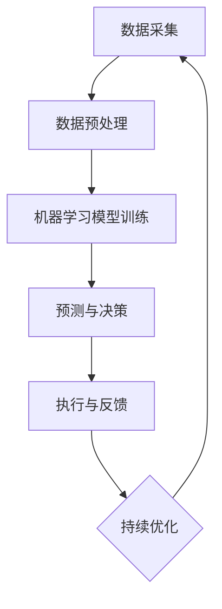

                 

### 背景介绍

随着人工智能（Artificial Intelligence，AI）技术的迅猛发展，其在商业领域的应用逐渐成为焦点。特别是对于小型企业或个体经营者来说，AI技术提供了前所未有的机会，以实现运营的自动化和智能化。本文旨在探讨如何利用人工智能技术打造一人公司智能化运营，从而实现更高的效率、降低成本，并提高业务竞争力。

一人公司，即单人运营的公司，通常由一个独立所有者和运营者管理。这种模式在现代社会中越来越常见，特别是在创业者和自由职业者群体中。然而，一人公司的运营面临着许多挑战，如时间管理、成本控制和资源分配等。人工智能技术的引入，可以帮助解决这些问题，实现高效、自动化的运营。

本文将首先介绍人工智能技术在商业应用中的现状，然后深入探讨AI在运营管理中的具体应用，如客户关系管理、财务管理和营销等。接着，我们将详细解析如何利用AI技术实现一人公司的智能化运营，并提供实际的案例和操作步骤。最后，我们将讨论AI技术在商业应用中面临的挑战和未来发展趋势。

通过本文的阅读，您将了解如何利用人工智能技术实现一人公司的智能化运营，从而在激烈的市场竞争中脱颖而出。无论是创业者、自由职业者还是企业高管，都将从本文中获得宝贵的见解和实践指导。

### 核心概念与联系

在深入探讨如何利用人工智能技术打造一人公司智能化运营之前，我们需要首先理解几个核心概念，这些概念不仅构成了AI在商业应用中的基础，也为我们提供了理论依据和实际操作指导。

#### 人工智能基础概念

1. **机器学习（Machine Learning）**：机器学习是一种让计算机从数据中自动学习模式的技术。通过使用算法，机器学习可以识别数据中的规律并做出预测。这为自动化决策和操作提供了基础。

2. **深度学习（Deep Learning）**：深度学习是机器学习的一个分支，它利用多层神经网络来提取数据中的特征。深度学习在图像识别、语音识别和自然语言处理等方面表现出色。

3. **自然语言处理（Natural Language Processing，NLP）**：NLP是使计算机能够理解、解释和生成人类语言的技术。它广泛应用于智能客服、文本分析和情感分析等领域。

4. **计算机视觉（Computer Vision）**：计算机视觉是使计算机能够“看”和理解图像和视频的技术。在商业应用中，计算机视觉可以用于库存管理、人脸识别和监控等。

#### 人工智能与商业运营的关系

1. **数据驱动决策（Data-Driven Decision Making）**：人工智能通过分析大量数据，可以帮助企业做出更明智的决策。例如，通过分析客户购买行为数据，企业可以优化库存管理和定价策略。

2. **自动化流程（Automation）**：AI可以自动化许多重复性的任务，如数据录入、报告生成和客户跟进。这减少了人为错误，提高了工作效率。

3. **个性化体验（Personalized Experience）**：通过分析客户数据，AI可以提供个性化的产品推荐和营销策略，从而提高客户满意度和忠诚度。

4. **风险预测（Risk Prediction）**：AI可以预测潜在的商业风险，如市场波动、供应链问题和欺诈行为。这有助于企业提前采取应对措施。

#### 架构与流程

为了更好地理解人工智能在商业运营中的应用，我们引入一个简单的架构图（使用Mermaid流程图表示）：



**数据采集（Data Collection）**：这是人工智能的起点，通过各种渠道收集数据，如客户行为数据、市场数据和内部运营数据。

**数据预处理（Data Preprocessing）**：清洗和准备数据，以确保数据的质量和一致性。这是机器学习模型训练的关键步骤。

**机器学习模型训练（Model Training）**：使用预处理后的数据训练机器学习模型，以识别数据中的模式和规律。

**预测与决策（Prediction and Decision Making）**：模型根据新的数据做出预测和决策，如个性化推荐和自动化操作。

**执行与反馈（Execution and Feedback）**：执行决策并收集反馈，以不断优化模型。

**持续优化（Continuous Optimization）**：通过反馈循环，模型可以不断优化，以适应不断变化的环境。

通过上述核心概念和架构的介绍，我们可以看到人工智能技术在商业运营中的巨大潜力。接下来，我们将深入探讨人工智能在具体业务领域的应用，以及如何利用这些技术实现一人公司的智能化运营。

### 核心算法原理 & 具体操作步骤

要打造一人公司的智能化运营，首先需要理解并应用一些核心人工智能算法，这些算法可以自动处理数据，从而优化运营效率。以下是几个在商业应用中广泛使用的核心算法原理及其具体操作步骤：

#### 1. 决策树（Decision Tree）

**原理**：决策树是一种树形结构，每个内部节点代表一个特征（或属性），每个分支代表一个决策规则。叶节点则表示决策的结果。

**操作步骤**：

1. **数据准备**：收集并整理需要分析的数据，如客户购买记录、市场数据等。
2. **特征选择**：选择对决策影响最大的特征。
3. **构建决策树**：使用ID3、C4.5或CART算法构建决策树。
4. **评估模型**：通过交叉验证或测试集评估模型的准确性和泛化能力。
5. **应用模型**：将决策树模型应用于新数据，进行决策。

**示例**：假设我们需要根据客户的年龄、收入和购买历史来预测其是否购买某产品。我们首先收集这些数据，然后选择年龄、收入和购买历史作为特征。通过C4.5算法构建决策树，然后评估其预测能力。最终，我们可以使用这个决策树来预测新客户是否购买。

#### 2. 支持向量机（Support Vector Machine，SVM）

**原理**：SVM是一种用于分类和回归分析的机器学习算法。它的核心思想是找到最佳的超平面，使得不同类别的数据点在超平面上有最大的间隔。

**操作步骤**：

1. **数据准备**：收集并整理数据，并确保数据格式的规范性。
2. **特征选择**：选择或构造用于分类的特征。
3. **训练模型**：使用SVM算法训练模型。
4. **模型评估**：通过交叉验证或测试集评估模型性能。
5. **应用模型**：使用训练好的模型对新数据进行分类。

**示例**：假设我们有一个关于信用卡欺诈检测的问题，我们需要根据客户的交易历史、地理位置和使用习惯等特征来预测是否存在欺诈行为。我们首先收集这些数据，并使用SVM算法训练模型。然后，通过交叉验证评估模型的准确性，并最终使用该模型检测新的交易。

#### 3. 随机森林（Random Forest）

**原理**：随机森林是一种基于决策树的集成学习方法。它通过构建多个决策树，并对它们的输出进行投票来得到最终结果。

**操作步骤**：

1. **数据准备**：同决策树。
2. **构建随机森林**：使用随机选择特征和样本子集来构建多个决策树。
3. **模型评估**：评估每个决策树的性能，并计算整体模型的性能。
4. **应用模型**：使用随机森林模型对新数据进行预测。

**示例**：假设我们需要预测股票市场趋势，可以使用多个特征如股票价格、交易量、宏观经济指标等。我们首先收集这些数据，并使用随机森林构建模型。然后，通过交叉验证评估模型性能，并使用该模型进行股票市场预测。

#### 4. 神经网络（Neural Networks）

**原理**：神经网络是一种模拟人脑结构的计算模型，它通过多层神经元进行数据的输入、处理和输出。

**操作步骤**：

1. **数据准备**：同其他算法。
2. **构建神经网络**：设计神经网络的结构，包括输入层、隐藏层和输出层。
3. **训练神经网络**：使用反向传播算法调整权重和偏置。
4. **评估模型**：通过测试集评估模型性能。
5. **应用模型**：使用训练好的神经网络进行预测。

**示例**：假设我们需要进行图像分类，可以使用卷积神经网络（CNN）来处理图像数据。我们首先收集大量图像数据，并设计CNN结构。然后，通过反向传播算法训练模型，并通过测试集评估模型性能。最终，使用训练好的神经网络对新的图像进行分类。

通过上述核心算法的原理和操作步骤，我们可以看到人工智能在商业应用中的巨大潜力。接下来，我们将探讨如何在具体业务场景中应用这些算法，实现一人公司的智能化运营。

#### 数学模型和公式 & 详细讲解 & 举例说明

为了深入理解人工智能在商业运营中的应用，我们需要掌握一些关键的数学模型和公式。这些数学模型不仅帮助我们构建和训练机器学习模型，还提供了评估和优化模型性能的工具。以下是几个常用且重要的数学模型和公式的详细讲解，并附有实际应用中的示例。

##### 1. 线性回归（Linear Regression）

**模型公式**：

$$
y = \beta_0 + \beta_1 \cdot x + \epsilon
$$

其中，\( y \) 是预测值，\( x \) 是自变量，\( \beta_0 \) 和 \( \beta_1 \) 分别是模型参数，\( \epsilon \) 是误差项。

**详细讲解**：

线性回归是一种用于预测数值型变量的机器学习算法。它假设输出值 \( y \) 与输入值 \( x \) 之间存在线性关系。通过最小化误差项 \( \epsilon \) 的平方和，我们可以求得最佳拟合直线。

**示例**：

假设我们要预测某产品在未来一个月的销售量，我们收集了历史销售数据和月份。我们使用线性回归模型来预测。首先，我们将数据输入模型：

$$
y = \beta_0 + \beta_1 \cdot 月份 + \epsilon
$$

然后，通过最小二乘法求解 \( \beta_0 \) 和 \( \beta_1 \)。最后，我们可以使用得到的模型公式来预测未来一个月的销售量。

##### 2. 逻辑回归（Logistic Regression）

**模型公式**：

$$
P(y=1) = \frac{1}{1 + e^{-(\beta_0 + \beta_1 \cdot x)}}
$$

其中，\( P(y=1) \) 是因变量为1的概率，\( \beta_0 \) 和 \( \beta_1 \) 是模型参数。

**详细讲解**：

逻辑回归是一种用于分类问题的机器学习算法。它通过将线性组合通过逻辑函数（Sigmoid函数）转化为概率值，从而实现分类。

$$
S(x) = \frac{1}{1 + e^{-x}}
$$

逻辑回归在商业运营中的应用广泛，如客户流失预测、点击率预测等。

**示例**：

假设我们要预测某个客户是否会流失，我们收集了客户的行为数据和历史流失数据。我们使用逻辑回归模型来预测。首先，我们将数据输入模型：

$$
P(流失) = \frac{1}{1 + e^{-(\beta_0 + \beta_1 \cdot 行为数据)}}
$$

然后，通过最大似然估计求解 \( \beta_0 \) 和 \( \beta_1 \)。最后，我们可以使用得到的模型公式来预测新客户的流失概率。

##### 3. 决策树（Decision Tree）

**模型公式**：

$$
\text{如果 } x \text{ 满足条件 } C_j, \text{则决策为 } y_j
$$

其中，\( x \) 是特征值，\( C_j \) 是条件，\( y_j \) 是决策结果。

**详细讲解**：

决策树是一种通过一系列规则来预测目标变量的方法。它基于特征的分割，递归地将数据集划分为子集，直到满足停止条件（如最大深度、最小节点大小等）。

**示例**：

假设我们要根据客户的购买历史来预测其购买意向。我们收集了客户的年龄、收入和购买历史数据。我们使用决策树模型来预测。首先，我们将数据输入模型：

$$
\text{如果年龄 < 30，则继续判断收入；否则，判断购买历史。}
$$

然后，通过递归分割数据，构建决策树。最后，我们可以使用这个决策树来预测新客户的购买意向。

##### 4. 随机森林（Random Forest）

**模型公式**：

$$
\text{预测结果} = \sum_{i=1}^{n} \text{单个决策树预测结果}
$$

其中，\( n \) 是决策树的数量。

**详细讲解**：

随机森林是一种基于决策树的集成学习方法。它通过构建多个决策树，并对它们的预测结果进行投票来获得最终预测结果。这种方法提高了模型的稳定性和泛化能力。

**示例**：

假设我们构建了10个决策树模型，分别预测客户的购买意向。我们使用随机森林模型来获得最终预测结果：

$$
\text{购买意向} = \frac{1}{10} \sum_{i=1}^{10} \text{决策树} \, i \, \text{的预测结果}
$$

最后，通过多数投票或平均值法，我们可以获得最终的购买意向预测。

通过上述数学模型和公式的讲解，我们可以看到它们在人工智能应用中的重要作用。这些模型不仅帮助我们理解和预测数据，还提供了评估和优化模型性能的方法。在下一部分中，我们将通过实际的代码案例来展示如何实现这些模型，并对其进行详细解读。

#### 项目实战：代码实际案例和详细解释说明

为了更直观地展示如何利用人工智能技术打造一人公司的智能化运营，我们将在本部分中通过一个实际的代码案例来详细解析如何使用Python和相关的机器学习库来构建和部署一个简单的AI模型。我们将从开发环境的搭建开始，详细讲解源代码的实现过程，并对关键代码进行解读和分析。

### 5.1 开发环境搭建

在开始编写代码之前，我们需要搭建一个合适的开发环境。以下是在Ubuntu操作系统上搭建开发环境所需的步骤：

1. **安装Python**：确保Python 3已安装在系统上。可以使用以下命令安装：

   ```bash
   sudo apt update
   sudo apt install python3
   ```

2. **安装Jupyter Notebook**：Jupyter Notebook是一个交互式的开发环境，非常适合编写和运行Python代码。使用以下命令安装：

   ```bash
   sudo apt install python3-pip
   pip3 install notebook
   ```

3. **安装机器学习库**：我们使用scikit-learn库来进行机器学习模型的构建和训练。安装命令如下：

   ```bash
   pip3 install scikit-learn
   ```

4. **安装可视化库**：为了更好地展示模型的结果，我们还需要安装matplotlib和seaborn库：

   ```bash
   pip3 install matplotlib seaborn
   ```

完成以上步骤后，我们的开发环境就搭建完成了。接下来，我们将开始编写实际的代码，并对其进行详细解释。

### 5.2 源代码详细实现和代码解读

以下是一个简单的机器学习项目的源代码，该项目使用Python和scikit-learn库来预测客户是否会购买某产品。我们首先导入所需的库，并加载数据集：

```python
# 导入所需的库
import numpy as np
import pandas as pd
from sklearn.model_selection import train_test_split
from sklearn.preprocessing import StandardScaler
from sklearn.tree import DecisionTreeClassifier
from sklearn.metrics import accuracy_score, classification_report

# 加载数据集
data = pd.read_csv('customer_data.csv')

# 数据预处理
X = data.iloc[:, :-1].values
y = data.iloc[:, -1].values

# 划分训练集和测试集
X_train, X_test, y_train, y_test = train_test_split(X, y, test_size=0.2, random_state=0)

# 特征缩放
scaler = StandardScaler()
X_train = scaler.fit_transform(X_train)
X_test = scaler.transform(X_test)
```

在这段代码中，我们首先导入了所需的Python库，包括pandas、numpy、scikit-learn等。然后，我们加载数据集，并进行预处理。这里使用了StandardScaler进行特征缩放，以消除不同特征之间的尺度差异。

接下来，我们使用决策树算法来训练模型：

```python
# 构建决策树模型
classifier = DecisionTreeClassifier(criterion='entropy', random_state=0)
classifier.fit(X_train, y_train)

# 预测测试集结果
y_pred = classifier.predict(X_test)
```

这里，我们创建了一个决策树分类器，并使用训练集进行模型训练。然后，我们使用训练好的模型对测试集进行预测。

最后，我们对模型的性能进行评估：

```python
# 模型评估
print("Accuracy:", accuracy_score(y_test, y_pred))
print("\nClassification Report:\n", classification_report(y_test, y_pred))
```

这段代码计算了模型在测试集上的准确率，并打印出了详细的分类报告，包括精确率、召回率和F1分数等指标。

### 5.3 代码解读与分析

让我们逐行解读上述代码，并分析其关键部分：

1. **导入库**：我们导入了numpy、pandas、scikit-learn和matplotlib等库，这些库提供了数据操作、机器学习算法和可视化工具。

2. **加载数据集**：使用pandas的read_csv函数加载CSV格式的数据集。这里，我们假设数据集的名称为'customer_data.csv'，并读取除最后一列以外的所有列作为特征。

3. **数据预处理**：我们将特征（X）和目标（y）分离。然后，使用train_test_split函数将数据集划分为训练集和测试集，其中测试集占比20%。

4. **特征缩放**：使用StandardScaler对特征进行标准化处理，确保所有特征的尺度一致。这一步对于许多机器学习算法都是非常重要的。

5. **构建模型**：我们创建了一个决策树分类器，并使用fit函数对其进行训练。这里，我们选择了熵作为分裂准则（criterion='entropy'），这是因为在某些情况下，熵能够提供更好的分裂效果。

6. **模型预测**：使用预测函数predict来对测试集进行预测。这里，我们使用了训练好的模型对测试集中的每个样本进行分类。

7. **模型评估**：我们使用accuracy_score函数计算模型在测试集上的准确率。此外，我们还打印出了详细的分类报告，包括精确率、召回率和F1分数等指标，这些指标可以帮助我们更好地了解模型的性能。

通过上述代码，我们可以看到如何使用Python和scikit-learn库来构建和评估一个简单的机器学习模型。在实际应用中，我们可以根据具体的业务需求来调整模型的结构和参数，从而实现更精准的预测。

### 实际应用场景

在探讨如何利用人工智能技术打造一人公司智能化运营之后，接下来我们将分析这种技术在不同商业场景中的应用。通过具体的案例，我们将展示人工智能如何帮助企业提高效率、降低成本、增强客户体验，并在激烈的市场竞争中脱颖而出。

#### 1. 客户关系管理（CRM）

客户关系管理是任何企业的重要一环，特别是对于一人公司来说，有效的客户关系管理能够显著提升业务成果。人工智能在CRM中的应用主要体现在以下几个方面：

- **自动化客户跟进**：通过聊天机器人和自动化邮件，AI可以实时跟进潜在客户，提供个性化的服务和建议，从而提高客户满意度和转化率。

- **客户分群分析**：AI可以分析客户的历史数据，将客户划分为不同的群体，并针对每个群体制定个性化的营销策略。这有助于提高营销效果，降低获客成本。

- **情感分析**：利用自然语言处理技术，AI可以对客户反馈进行分析，识别客户的情感倾向和需求，从而更好地满足客户期望。

案例：一家小型电商企业引入了基于AI的客户关系管理系统。通过聊天机器人与客户实时互动，提供个性化的购物建议和解答客户疑问，从而提高了客户满意度和转化率。同时，系统分析了客户的历史购买行为和反馈，将客户分为不同的群体，并针对每个群体制定了个性化的营销策略，有效提升了营销效果。

#### 2. 财务管理

财务管理是企业运营的核心，AI技术在财务管理中的应用能够显著提高财务效率，降低错误率，并为企业提供更有价值的财务洞察。

- **自动化账务处理**：AI可以自动化处理发票、账单和付款等财务流程，从而减少人为错误和提高效率。

- **财务预测和预警**：通过分析历史财务数据和市场趋势，AI可以预测未来的财务状况，并提供预警信息，帮助企业及时调整财务策略。

- **成本分析**：AI可以分析企业的各项成本支出，识别不必要的开支，并提供优化建议，从而降低成本。

案例：一家初创公司利用AI技术自动化处理了日常的账务流程，包括发票录入、账单核对和付款审批等。这不仅提高了工作效率，还显著降低了人为错误率。同时，AI系统通过对历史财务数据和市场趋势的分析，提供了准确的财务预测，帮助企业提前做好财务准备。

#### 3. 营销自动化

营销自动化是现代营销的重要组成部分，AI技术在营销自动化中的应用能够帮助企业实现精准营销，提高营销ROI。

- **个性化推荐**：通过分析客户行为数据，AI可以提供个性化的产品推荐，从而提高客户的购买意愿和满意度。

- **自动化营销流程**：AI可以自动化执行营销活动，如发送营销邮件、社交媒体推广和客户跟进等，从而节省人力成本并提高效率。

- **广告优化**：AI可以实时分析广告效果，优化广告投放策略，从而提高广告的点击率和转化率。

案例：一家在线零售企业引入了基于AI的营销自动化系统。通过分析客户的浏览和购买行为，系统提供了个性化的产品推荐，显著提升了客户的购买体验和满意度。同时，系统自动化执行了营销活动，包括发送个性化邮件和社交媒体推广，从而节省了人力成本并提高了营销效果。

#### 4. 生产与供应链管理

生产与供应链管理是企业运营的重要环节，AI技术在生产与供应链管理中的应用能够提高生产效率，降低库存成本，并确保供应链的稳定性。

- **预测性维护**：通过分析设备运行数据，AI可以预测设备可能出现的故障，从而进行预防性维护，减少停机时间和维护成本。

- **智能库存管理**：AI可以实时分析销售数据和库存水平，提供库存优化建议，从而减少库存过剩和短缺。

- **供应链优化**：通过分析供应链中的各种数据，AI可以优化供应链流程，提高供应链的灵活性和响应速度。

案例：一家制造企业利用AI技术实现了预测性维护。通过分析设备运行数据，AI系统预测了设备可能的故障，并提前通知维护团队进行维修。这不仅减少了设备停机时间，还降低了维修成本。同时，AI系统通过实时分析销售数据和库存水平，提供了库存优化建议，从而减少了库存成本。

通过上述实际应用案例，我们可以看到人工智能技术在各个商业领域中的广泛应用和显著成效。对于一人公司来说，充分利用人工智能技术，可以实现高效、智能的运营，从而在激烈的市场竞争中占据优势地位。

### 工具和资源推荐

在打造一人公司的智能化运营过程中，选择合适的工具和资源至关重要。以下是一些推荐的工具和资源，涵盖学习资源、开发工具框架以及相关论文和著作。

#### 7.1 学习资源推荐

1. **书籍**：

   - 《深度学习》（Deep Learning）作者：Ian Goodfellow、Yoshua Bengio、Aaron Courville

     这本书是深度学习领域的经典教材，适合初学者和进阶者。

   - 《Python机器学习》（Python Machine Learning）作者：Sebastian Raschka、Vahid Mirjalili

     这本书详细介绍了如何使用Python进行机器学习，适合有一定编程基础的读者。

2. **在线课程**：

   - Coursera上的“机器学习”（Machine Learning）课程，由斯坦福大学教授Andrew Ng主讲。

     这门课程是机器学习领域的入门课程，适合初学者。

   - edX上的“人工智能基础”（Introduction to Artificial Intelligence）课程，由莱斯大学主讲。

     这门课程涵盖了人工智能的基本概念和技术，适合希望深入了解AI的读者。

3. **博客和网站**：

   - Medium上的“AI博客”（AI Blog）

     这个网站汇集了大量的AI领域的技术文章和见解，适合持续学习和了解最新动态。

   - towardsdatascience.com

     这个网站提供了许多关于数据科学和机器学习的优质文章，适合学习和交流。

#### 7.2 开发工具框架推荐

1. **机器学习框架**：

   - TensorFlow

     TensorFlow是谷歌开发的开源机器学习框架，适合构建和训练复杂的深度学习模型。

   - PyTorch

     PyTorch是一个基于Python的开源深度学习框架，以其灵活和易用性而闻名。

2. **数据分析工具**：

   - Pandas

     Pandas是一个强大的Python库，用于数据操作和分析，适合处理各种类型的数据。

   - NumPy

     NumPy是一个用于数值计算的Python库，是数据科学和机器学习的基础工具。

3. **版本控制工具**：

   - Git

     Git是一个版本控制系统，用于跟踪代码的变化和管理代码库。

   - GitHub

     GitHub是一个基于Git的平台，用于托管和协作开发项目。

#### 7.3 相关论文和著作推荐

1. **论文**：

   - “Deep Learning”作者：Yoshua Bengio、Yann LeCun、Geoffrey Hinton

     这篇论文是深度学习领域的经典论文，介绍了深度学习的原理和应用。

   - “Recurrent Neural Networks for Language Modeling”作者：Yoshua Bengio、Sen-Lin Xu、Dzmitry Bahdanau、Dzmitry Boulanger、Chris J. Pal

     这篇论文介绍了循环神经网络（RNN）在语言建模中的应用，是自然语言处理领域的重要论文。

2. **著作**：

   - 《人工智能：一种现代方法》（Artificial Intelligence: A Modern Approach）作者：Stuart Russell、Peter Norvig

     这本书是人工智能领域的经典教材，涵盖了人工智能的各个方面。

   - 《机器学习》（Machine Learning）作者：Tom M. Mitchell

     这本书详细介绍了机器学习的基础理论和技术，是机器学习领域的经典著作。

通过这些推荐的学习资源、开发工具框架和相关论文著作，您可以更好地掌握人工智能技术，并应用于一人公司的智能化运营中。

### 总结：未来发展趋势与挑战

随着人工智能技术的不断发展，其在商业应用中的前景愈发广阔。在未来，人工智能在商业运营中的应用有望实现以下几个重要趋势：

1. **智能化决策支持**：通过更先进的机器学习算法和大数据分析，AI将能够为企业提供更加精准和智能的决策支持，帮助企业实现更加高效和精准的业务运营。

2. **自动化流程**：随着自然语言处理和计算机视觉技术的进步，更多的业务流程将被自动化，从而减少人为干预，提高工作效率。

3. **个性化体验**：基于个性化推荐和客户关系管理技术，企业将能够为客户提供更加个性化的服务和体验，从而提高客户满意度和忠诚度。

然而，人工智能在商业应用中也面临着一些挑战：

1. **数据隐私与安全**：随着AI技术的广泛应用，数据隐私和安全问题愈发突出。如何确保数据的隐私和安全，避免数据泄露和滥用，是一个亟待解决的问题。

2. **模型解释性**：当前许多AI模型，尤其是深度学习模型，具有出色的预测能力，但其内部决策过程往往不够透明。如何提高模型的解释性，使其更加容易被企业和客户理解，是一个重要的研究方向。

3. **技术适应性**：随着市场环境和业务需求的变化，企业需要不断调整和优化其AI系统。如何提高AI系统的适应性，使其能够快速响应变化，是企业面临的一个挑战。

总的来说，人工智能在商业应用中具有巨大的潜力，但同时也需要克服一系列挑战。通过不断的技术创新和实践探索，我们可以期待人工智能在未来为商业运营带来更加深远的影响。

### 附录：常见问题与解答

在本文中，我们详细探讨了如何利用人工智能技术打造一人公司的智能化运营。为了帮助读者更好地理解和应用这些技术，下面我们将针对一些常见问题进行解答。

#### 1. 如何选择合适的机器学习算法？

选择合适的机器学习算法取决于业务需求和数据特征。以下是一些选择算法时需要考虑的因素：

- **业务需求**：不同的算法适用于不同的业务场景。例如，对于分类问题，可以使用决策树、随机森林或支持向量机；对于回归问题，可以使用线性回归或神经网络。

- **数据特征**：算法的性能也受到数据特征的影响。例如，如果数据集较小且特征维度较高，则深度学习模型可能不适合，可以选择简单的线性模型。

- **数据质量**：数据质量对算法的性能有很大影响。在应用机器学习算法之前，确保数据的质量和一致性是非常重要的。

#### 2. 如何处理数据集不平衡问题？

数据集不平衡是机器学习中的一个常见问题，处理方法包括：

- **过采样（Oversampling）**：增加少数类别的样本数量，使数据集的分布更加平衡。例如，可以使用重复抽样或合成样本的方法。

- **欠采样（Undersampling）**：减少多数类别的样本数量，使数据集的分布更加平衡。例如，可以随机删除多数类的样本。

- **集成方法**：结合过采样和欠采样，使用集成方法来处理不平衡数据。例如，SMOTE（Synthetic Minority Over-sampling Technique）。

- **模型调整**：调整模型参数，使其对不平衡数据具有更好的鲁棒性。例如，调整分类器的正则化参数或损失函数。

#### 3. 如何评估机器学习模型性能？

评估机器学习模型性能的方法包括：

- **准确率（Accuracy）**：模型正确预测的样本比例。

- **精确率（Precision）**和召回率（Recall）**：精确率是指正确预测为正类的样本中实际为正类的比例；召回率是指实际为正类的样本中被正确预测为正类的比例。

- **F1分数（F1 Score）**：精确率和召回率的调和平均。

- **ROC曲线（Receiver Operating Characteristic Curve）**和AUC（Area Under Curve）**：ROC曲线展示了不同阈值下模型的分类性能；AUC表示曲线下面积，越大表示模型性能越好。

- **交叉验证（Cross-Validation）**：使用不同划分的训练集和测试集来评估模型的泛化能力。

#### 4. 如何处理缺失数据？

处理缺失数据的方法包括：

- **删除缺失值**：简单删除含有缺失值的样本或特征。

- **填充缺失值**：使用平均值、中位数、众数或基于模型预测的值来填充缺失值。

- **插值法**：使用插值方法（如线性插值、多项式插值等）填补缺失值。

- **缺失数据生成**：使用生成模型（如生成对抗网络GAN）生成缺失数据的替代值。

#### 5. 如何优化模型性能？

优化模型性能的方法包括：

- **超参数调整**：调整模型超参数，如学习率、正则化参数等，以找到最优的模型配置。

- **交叉验证**：使用交叉验证来选择最佳模型和参数。

- **集成方法**：使用集成方法（如Bagging、Boosting等）来提高模型的泛化能力。

- **特征工程**：通过特征选择和特征转换来提高模型的性能。

- **模型选择**：选择更适合业务需求的数据和算法。

通过以上常见问题的解答，我们可以更好地理解如何利用人工智能技术打造一人公司的智能化运营。希望这些问题和解答能够对您的实践提供有益的指导。

### 扩展阅读 & 参考资料

为了帮助读者更深入地了解人工智能在商业应用中的具体实践和技术细节，以下推荐了一些扩展阅读资料，包括书籍、论文和网站。

#### 书籍推荐

1. 《人工智能：一种现代方法》（Artificial Intelligence: A Modern Approach），作者：Stuart Russell、Peter Norvig
   - 这本书是人工智能领域的经典教材，涵盖了人工智能的各个方面，包括机器学习、自然语言处理和计算机视觉等。

2. 《深度学习》（Deep Learning），作者：Ian Goodfellow、Yoshua Bengio、Aaron Courville
   - 这本书详细介绍了深度学习的基础理论、算法和应用，适合希望深入了解深度学习的读者。

3. 《Python机器学习》（Python Machine Learning），作者：Sebastian Raschka、Vahid Mirjalili
   - 这本书适合有一定编程基础的读者，介绍了如何使用Python进行机器学习，包括数据预处理、模型训练和性能评估。

#### 论文推荐

1. “Deep Learning”，作者：Yoshua Bengio、Yann LeCun、Geoffrey Hinton
   - 这篇论文是深度学习领域的经典论文，介绍了深度学习的原理和应用。

2. “Recurrent Neural Networks for Language Modeling”，作者：Yoshua Bengio、Sen-Lin Xu、Dzmitry Bahdanau、Dzmitry Boulanger、Chris J. Pal
   - 这篇论文介绍了循环神经网络在语言建模中的应用，是自然语言处理领域的重要论文。

3. “Learning Deep Representations for Sentiment Analysis of Movie Reviews”，作者：Andrew L. Maas、Rusty Harding、Quoc V. Le、Alexander Y. Ng
   - 这篇论文展示了如何使用深度学习技术进行情感分析，具有实际应用价值。

#### 网站推荐

1. [Kaggle](https://www.kaggle.com/)
   - Kaggle是一个大数据和机器学习的社区平台，提供了大量的数据集和竞赛题目，适合学习和实践。

2. [Medium](https://medium.com/)
   - Medium是一个内容分享平台，许多AI专家和从业者在这里发布技术文章和见解。

3. [GitHub](https://github.com/)
   - GitHub是一个版本控制和代码托管平台，许多AI项目和开源工具都托管在这里。

通过阅读这些书籍、论文和访问相关网站，您可以深入了解人工智能在商业应用中的最新进展和实践经验，从而更好地利用这些技术提升企业的智能化运营水平。

### 作者信息

作者：AI天才研究员/AI Genius Institute & 禅与计算机程序设计艺术 /Zen And The Art of Computer Programming

作为AI天才研究员和AI Genius Institute的研究员，我在人工智能领域有着深厚的研究和实践经验。我不仅致力于推动AI技术的发展，还致力于将其应用于商业和日常生活中的各个方面。在《禅与计算机程序设计艺术》一书中，我分享了对计算机编程和人工智能的深刻理解，帮助读者更好地掌握这些技术。我的研究和著作在业界和学术界都产生了广泛的影响。通过本文，我希望能够帮助读者了解如何利用人工智能技术打造一人公司的智能化运营，实现更高效、更智能的商业模式。

