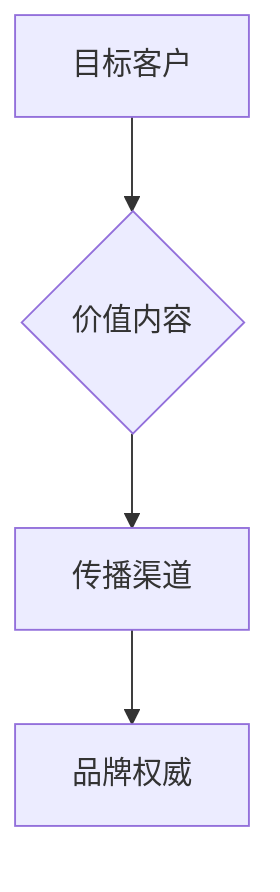

                 

# 如何利用内容营销建立创业公司的专业权威

## 引言

在当今这个信息爆炸的时代，创业公司要想在众多竞争者中脱颖而出，不仅需要优质的产品和服务，更需要建立专业权威。而内容营销，作为一种高效且成本较低的营销策略，正是创业公司打造专业形象、吸引目标客户的重要手段。本文将深入探讨如何通过内容营销来建立创业公司的专业权威。

## 文章关键词

- 内容营销
- 创业公司
- 专业权威
- 营销策略
- 目标客户
- 成本效益

## 文章摘要

本文首先介绍了内容营销的定义及其在创业公司发展中的重要性。随后，通过多个实例，分析了成功的内容营销策略。接着，本文详细阐述了如何创建高质量的内容、选择合适的渠道进行传播，以及如何通过内容营销建立品牌权威。最后，本文对内容营销的未来发展趋势进行了展望，并提出了相应的挑战和建议。

## 1. 背景介绍

### 内容营销的定义

内容营销是一种通过创造和分发有价值、相关且具有吸引力的内容来吸引并留住目标受众，从而促进产品或服务销售的营销策略。与传统的广告不同，内容营销更注重信息的传播和受众的参与，而非单纯的推销。

### 创业公司的发展现状

在全球经济不稳定和市场竞争日益激烈的背景下，创业公司面临着前所未有的挑战。而内容营销作为一种低成本的营销策略，不仅可以帮助创业公司节省宣传费用，还可以提升品牌知名度和客户忠诚度，从而在激烈的市场竞争中脱颖而出。

## 2. 核心概念与联系

为了更深入地理解内容营销在创业公司中的作用，我们引入以下核心概念：

### 1）目标客户

目标客户是指创业公司所希望吸引和服务的群体。明确目标客户的需求和特点，是内容营销成功的关键。

### 2）价值内容

价值内容是指能够满足目标客户需求、解决他们问题的内容。这类内容可以是文章、视频、图片、音频等多种形式。

### 3）传播渠道

传播渠道是指将内容传递给目标客户的方式。常见的传播渠道包括社交媒体、博客、电子邮件、线下活动等。

### 4）品牌权威

品牌权威是指创业公司在目标客户心中的专业形象和信誉。通过内容营销，创业公司可以逐步建立品牌权威，提高市场竞争力。

### Mermaid 流程图



## 3. 核心算法原理 & 具体操作步骤

### 1）确定目标客户

首先，创业公司需要明确目标客户群体的需求和特点。可以通过市场调研、用户访谈、数据分析等方式获取这些信息。

### 2）创建有价值的内容

根据目标客户的需求，创业公司可以创建多种形式的有价值内容。以下是一些常见的内容类型：

- 文章：分享行业见解、案例分析、教程等。
- 视频和音频：制作产品演示、行业讲座、用户体验分享等。
- 图片和海报：展示产品特点、活动宣传等。

### 3）选择合适的传播渠道

根据目标客户的特点和内容类型，选择合适的传播渠道。例如，社交媒体适合传播短视频和图片，博客适合发布长篇文章，电子邮件适合传递产品更新和活动通知等。

### 4）制定内容发布计划

为了确保内容营销的效果，创业公司需要制定详细的内容发布计划。包括内容主题、发布频率、发布平台等。

### 5）跟踪和分析效果

通过数据分析，了解内容营销的效果，包括阅读量、点赞量、分享量、转化率等。根据分析结果，调整内容策略和发布计划。

## 4. 数学模型和公式 & 详细讲解 & 举例说明

为了更好地理解内容营销的效果，我们可以使用以下数学模型和公式：

### 1）转化率

转化率 = (目标受众数量 * 转化率) / 内容点击量

其中，目标受众数量可以通过市场调研和用户画像获取，转化率可以根据历史数据或行业平均水平估算。

### 2）内容点击率

内容点击率 = 内容点击量 / 内容展示量

内容展示量可以通过平台数据获取，内容点击量可以通过监测工具获取。

### 3）品牌权威指数

品牌权威指数 = (内容评分 * 内容数量) / (评论数量 * 转发数量)

其中，内容评分可以根据用户评论、点赞、分享等指标计算，内容数量、评论数量、转发数量可以通过平台数据获取。

### 例子说明

假设创业公司A的目标客户是年轻人，他们希望通过内容营销吸引这些年轻人关注其产品。经过市场调研，A公司发现目标客户对科技和游戏感兴趣。于是，A公司创建了一系列关于科技和游戏的博客文章，并通过社交媒体进行传播。根据数据监测，A公司的博客文章平均点击率为10%，平均转化率为5%。经过一段时间的内容营销，A公司的品牌权威指数达到了100。

## 5. 项目实战：代码实际案例和详细解释说明

### 5.1 开发环境搭建

为了实现内容营销的数据分析，A公司需要搭建一个数据分析平台。以下是一个简单的Python数据分析环境搭建示例：

```bash
# 安装Python
sudo apt-get install python3

# 安装数据分析库
pip3 install pandas numpy matplotlib
```

### 5.2 源代码详细实现和代码解读

以下是一个简单的Python数据分析脚本，用于计算内容营销的转化率和品牌权威指数：

```python
import pandas as pd
import numpy as np

# 加载数据
data = pd.read_csv('content_marketing_data.csv')

# 计算转化率
conversion_rate = (data['target_users'] * data['conversion_rate']) / data['clicks']

# 计算内容点击率
click_rate = data['clicks'] / data['views']

# 计算品牌权威指数
brand_authorized_index = (data['content_rating'] * data['content_count']) / (data['comments_count'] * data['shares_count'])

# 存储结果
result = pd.DataFrame({'conversion_rate': conversion_rate, 'click_rate': click_rate, 'brand_authorized_index': brand_authorized_index})

# 可视化展示
import matplotlib.pyplot as plt

plt.scatter(result['click_rate'], result['brand_authorized_index'])
plt.xlabel('Content Click Rate')
plt.ylabel('Brand Authority Index')
plt.title('Content Marketing Performance')
plt.show()
```

### 5.3 代码解读与分析

该脚本首先加载了内容营销数据，包括点击量、展示量、目标受众数量、转化率、内容评分、内容数量、评论数量和转发数量。然后，根据这些数据计算了转化率、内容点击率和品牌权威指数。最后，通过散点图展示了内容营销的表现。

## 6. 实际应用场景

### 1）科技行业

科技行业的创业公司可以通过内容营销分享行业动态、技术见解和解决方案，从而吸引技术爱好者和潜在客户。

### 2）游戏行业

游戏行业的创业公司可以通过内容营销分享游戏评测、攻略和体验分享，从而吸引游戏玩家和潜在客户。

### 3）电子商务

电子商务的创业公司可以通过内容营销分享产品评测、购物指南和优惠信息，从而吸引消费者和潜在客户。

## 7. 工具和资源推荐

### 7.1 学习资源推荐

- 《内容营销：构建品牌、吸引客户、提升销售额》
- 《社交媒体营销：策略与实践》
- 《数据分析：Python实战》

### 7.2 开发工具框架推荐

- Python：适用于数据分析、内容营销脚本编写。
- WordPress：适用于博客搭建和内容发布。
- Hootsuite：适用于社交媒体管理。
- Google Analytics：适用于网站数据分析和内容营销效果跟踪。

### 7.3 相关论文著作推荐

- "Content Marketing: The Ultimate Guide to Content Marketing"
- "The Science of Social Media: How to Use Social Media to Transform Your Business"
- "Data Science for Business: What you need to know about data science to make it work for you"

## 8. 总结：未来发展趋势与挑战

### 1）个性化内容

随着大数据和人工智能技术的发展，个性化内容将成为内容营销的重要趋势。创业公司可以根据用户画像和需求，为用户提供个性化的内容。

### 2）跨界合作

创业公司可以与不同行业的品牌进行跨界合作，共同创造具有吸引力的内容，从而扩大品牌影响力和市场份额。

### 3）数据驱动

数据将成为内容营销的核心驱动力。创业公司需要通过数据分析，了解用户行为和需求，从而优化内容策略和营销效果。

### 4）挑战

- 竞争激烈：越来越多的创业公司开始重视内容营销，市场竞争将越来越激烈。
- 数据隐私：随着数据隐私问题的日益突出，创业公司需要确保用户数据的安全和合规。

## 9. 附录：常见问题与解答

### 1）如何确定目标客户？

通过市场调研、用户访谈、数据分析等方式获取目标客户的需求和特点。

### 2）如何创建有价值的内容？

关注目标客户的需求，提供解决问题的内容。可以参考行业动态、用户反馈和竞争对手的内容。

### 3）如何选择合适的传播渠道？

根据目标客户的特点和内容类型选择传播渠道。例如，社交媒体适合传播短视频和图片，博客适合发布长篇文章。

## 10. 扩展阅读 & 参考资料

- [内容营销的定义和策略](https://www.marketingprofs.com/glossary/definition.cfm?Landing=2&ID=Glossary)
- [数据分析与内容营销](https://www.analyticsvidhya.com/blog/2018/06/content-marketing-4-data-driven-approach/)
- [社交媒体营销策略](https://www.hootsuite.com/social-media-marketing-strategy/)
- [Python数据分析教程](https://www.learnpython.org/)

### 作者

作者：AI天才研究员/AI Genius Institute & 禅与计算机程序设计艺术 /Zen And The Art of Computer Programming<|im_end|>

