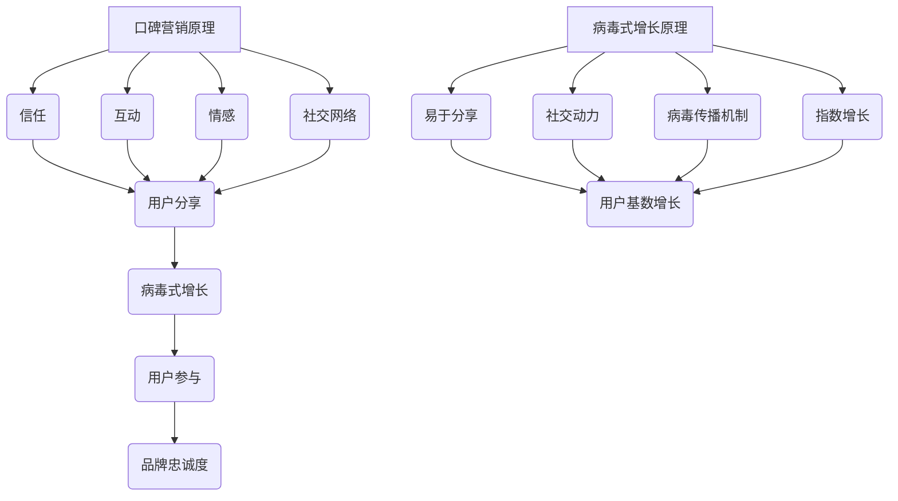
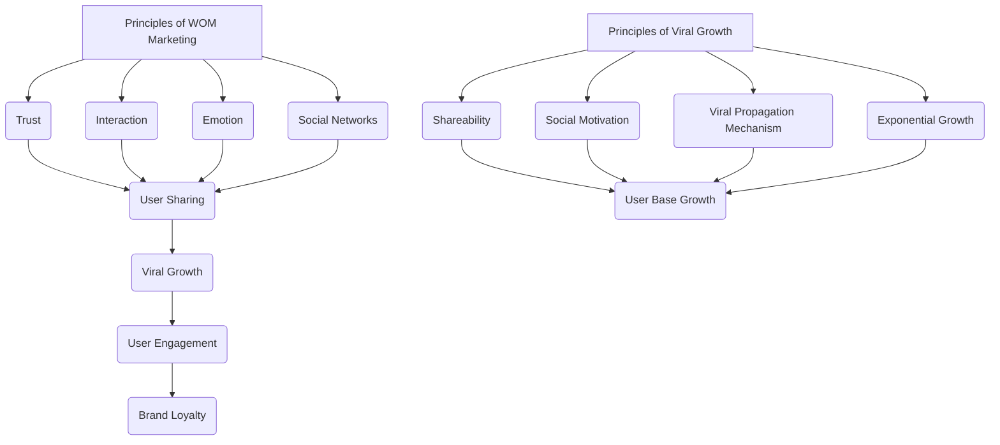

                 

### 背景介绍

#### 什么是口碑营销

口碑营销（Word of Mouth Marketing，简称WOMM）是一种通过消费者的自然传播和推荐来促进产品或品牌知名度、销售和增长的方式。它的核心在于让满意的顾客自发地传播正面信息，从而吸引更多潜在顾客。

口碑营销的历史可以追溯到古希腊时期，当时商人会通过赠送小礼品和提供优质服务来获取顾客的忠诚和口碑。然而，随着互联网和社交媒体的兴起，口碑营销的方式和效果都发生了巨大的变化。

#### 口碑营销的重要性

在现代营销环境中，口碑营销具有以下几个重要特点：

1. **可信度高**：消费者更容易相信其他消费者的评价，尤其是亲朋好友的推荐。
2. **影响力大**：一个满意的顾客可能会影响数十个甚至上百个潜在顾客。
3. **成本效益高**：相较于传统的广告和促销活动，口碑营销通常成本较低，但效果却更为显著。
4. **长效性**：口碑效应可以持续很长时间，有时甚至超越产品生命周期。

#### 病毒式增长的概念

病毒式增长（Viral Growth）是一种通过用户自发传播来迅速扩大用户基数的增长方式。这种增长模式的特点是用户数量的增加速度极快，类似于病毒在人群中迅速传播的过程。

病毒式增长的关键在于创建易于分享和传播的内容或产品，鼓励用户主动推荐给其他潜在用户。这种增长方式通常伴随着极高的用户参与度和品牌忠诚度。

#### 口碑营销与病毒式增长的关联

口碑营销与病毒式增长之间有着密切的关联。口碑营销可以促进病毒式增长，而病毒式增长又可以增强口碑营销的效果。两者相辅相成，共同推动了品牌和产品的成功。

例如，一个产品因其出色的性能和优质的服务获得了消费者的好评，消费者在社交媒体上分享自己的体验，吸引了更多潜在用户的关注。这些新用户又因为口碑效应而加入，形成了一个正向循环，使得品牌和产品迅速获得了广泛的认可和传播。

总的来说，口碑营销和病毒式增长都是现代营销策略中不可或缺的一部分，它们共同构成了一个强大的增长引擎，帮助品牌在竞争激烈的市场中脱颖而出。

---

#### The Introduction of Word of Mouth Marketing

#### What is Word of Mouth Marketing

Word of Mouth Marketing (WOMM) is a strategy that leverages the natural spread of positive information from satisfied customers to promote brand awareness, sales, and growth. At its core, WOMM focuses on creating satisfied customers who willingly share positive experiences and recommendations, thereby attracting more potential customers.

The history of word of mouth marketing can be traced back to ancient Greece, where merchants would offer small gifts and provide excellent service to gain customer loyalty and positive word of mouth. However, with the rise of the internet and social media, the methods and effectiveness of WOMM have evolved significantly.

#### The Importance of Word of Mouth Marketing

In the modern marketing landscape, word of mouth marketing has several key characteristics that make it an essential component of any marketing strategy:

1. **High Credibility**: Consumers are more likely to trust the opinions of other consumers, especially those from friends and family.
2. **Significant Influence**: A single satisfied customer can influence dozens, if not hundreds, of potential customers.
3. **Cost-Effective**: Compared to traditional advertising and promotional activities, WOMM is typically more cost-effective while delivering more significant results.
4. **Long-lasting Effectiveness**: The effect of word of mouth can last for a long time, sometimes even beyond the product lifecycle.

#### The Concept of Viral Growth

Viral growth is a rapid expansion of user base through user-generated and spontaneous sharing. The characteristic of viral growth is the rapid increase in user numbers, similar to how a virus spreads through a population.

The key to viral growth lies in creating content or products that are easy to share and spread, encouraging users to recommend them to others. This growth model is often accompanied by high user engagement and brand loyalty.

#### The Relationship Between Word of Mouth Marketing and Viral Growth

Word of mouth marketing and viral growth are closely related, with each reinforcing the other's effectiveness. They form a powerful growth engine that helps brands stand out in a competitive market.

For example, a product may receive high praise for its exceptional performance and excellent service. Satisfied customers then share their experiences on social media, attracting the attention of potential new users. These new users are then drawn to the brand due to the positive word of mouth, creating a positive feedback loop that leads to rapid recognition and widespread spread of the brand and product.

In summary, word of mouth marketing and viral growth are both essential components of modern marketing strategies, working together to drive brand and product success.

---

在了解了口碑营销和病毒式增长的基本概念和重要性之后，接下来我们将探讨核心概念与联系，以便更好地理解如何利用口碑营销实现病毒式增长。

---

#### Core Concepts and Relationships

After understanding the basic concepts and importance of word of mouth marketing and viral growth, let's delve into the core concepts and their relationships to gain a deeper understanding of how to leverage word of mouth marketing to achieve viral growth.

---

## 2. 核心概念与联系

### 口碑营销的基本原理

口碑营销的核心在于建立消费者之间的信任和互动。以下是口碑营销的一些关键原理：

1. **信任**：消费者更愿意相信其他消费者的评价，尤其是那些具有相似背景和需求的评价。
2. **互动**：消费者之间的互动可以增强品牌的认知度和美誉度。
3. **情感**：情感化的内容更容易引发消费者的共鸣，从而促进口碑传播。
4. **社交网络**：社交媒体和网络平台为口碑传播提供了广泛的空间和便捷的途径。

### 病毒式增长的基本原理

病毒式增长依赖于用户自发的分享和传播。以下是病毒式增长的一些关键原理：

1. **易于分享**：易于分享的内容或产品可以迅速传播，扩大用户基数。
2. **社交动力**：社交动力包括用户的好奇心、利益驱动和归属感等，这些动力可以激发用户主动分享。
3. **病毒传播机制**：病毒传播机制包括病毒载体、病毒代码和传播路径等，这些因素决定了病毒式增长的效率和效果。
4. **指数增长**：病毒式增长通常表现为指数级增长，用户数量的增加速度非常快。

### 口碑营销与病毒式增长的关联

口碑营销和病毒式增长之间的关联可以从以下几个方面来理解：

1. **口碑效应**：良好的口碑可以激发用户的分享欲望，从而实现病毒式增长。
2. **用户参与**：用户参与度是病毒式增长的关键，而口碑营销可以提高用户参与度。
3. **社交媒体**：社交媒体是口碑营销和病毒式增长的重要平台，两者的结合可以产生巨大的传播效果。
4. **品牌忠诚度**：口碑营销和病毒式增长都可以增强品牌忠诚度，从而促进长期增长。

### Mermaid 流程图

以下是一个简化的 Mermaid 流程图，展示了口碑营销和病毒式增长的基本原理和关联：

通过以上流程图，我们可以更清晰地理解口碑营销和病毒式增长之间的相互作用和关联。

---

#### Core Concepts and Relationships

#### Basic Principles of Word of Mouth Marketing

The core of word of mouth marketing lies in building trust and interaction among consumers. Here are some key principles of word of mouth marketing:

1. **Trust**: Consumers are more likely to trust the opinions of other consumers, especially those that have similar backgrounds and needs.
2. **Interaction**: Interaction among consumers can enhance brand awareness and reputation.
3. **Emotion**: Emotional content is more likely to resonate with consumers, thus promoting word of mouth spread.
4. **Social Networks**: Social media and online platforms provide a broad space and convenient channels for word of mouth spread.

#### Basic Principles of Viral Growth

Viral growth relies on users' spontaneous sharing and spread. Here are some key principles of viral growth:

1. **Shareability**: Content or products that are easy to share can spread quickly, expanding the user base.
2. **Social Motivation**: Social motivation includes curiosity, incentive-driven behavior, and a sense of belonging, which can激发 users to share actively.
3. **Viral Propagation Mechanism**: The viral propagation mechanism includes virus carriers, virus code, and propagation paths, which determine the efficiency and effectiveness of viral growth.
4. **Exponential Growth**: Viral growth typically manifests as exponential growth, with the rate of user base expansion being very fast.

#### The Relationship Between Word of Mouth Marketing and Viral Growth

The relationship between word of mouth marketing and viral growth can be understood from several aspects:

1. **Word of Mouth Effect**: Positive word of mouth can inspire users to share, thereby achieving viral growth.
2. **User Engagement**: User engagement is a key factor in viral growth, and word of mouth marketing can increase user engagement.
3. **Social Media**: Social media is an important platform for both word of mouth marketing and viral growth, and their combination can generate significant dissemination effects.
4. **Brand Loyalty**: Word of mouth marketing and viral growth can both enhance brand loyalty, thereby promoting long-term growth.

#### Mermaid Flowchart

Here is a simplified Mermaid flowchart that illustrates the basic principles and relationships of word of mouth marketing and viral growth:

Through this flowchart, we can have a clearer understanding of the interaction and relationships between word of mouth marketing and viral growth.

