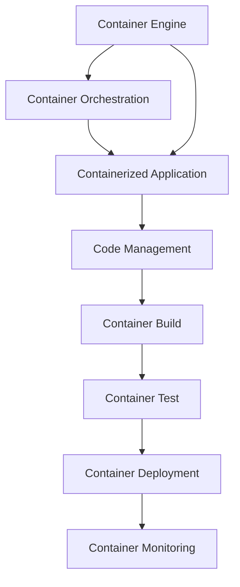
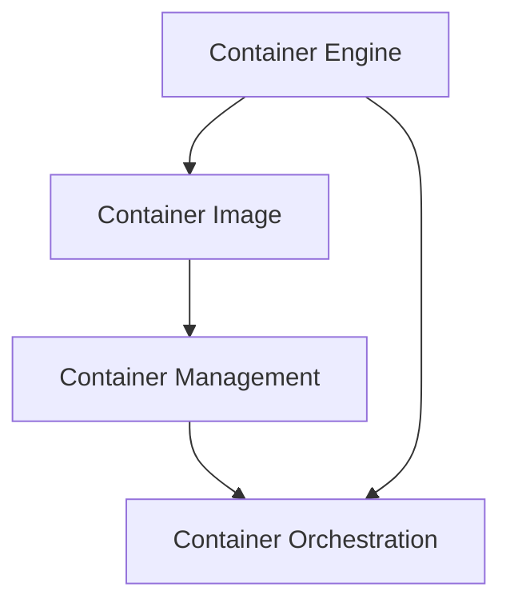
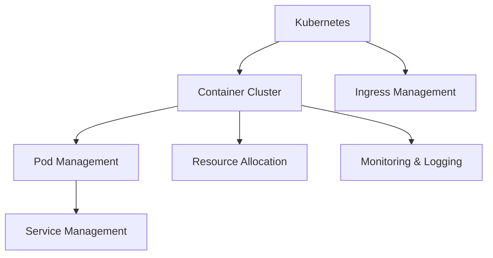
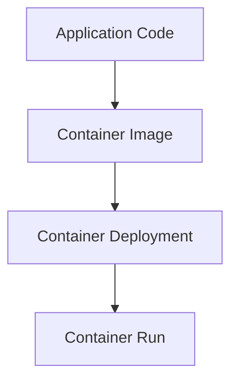
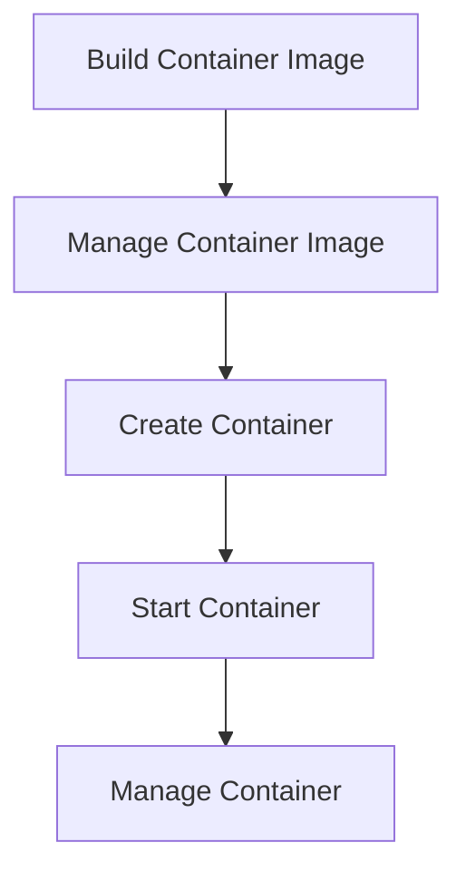
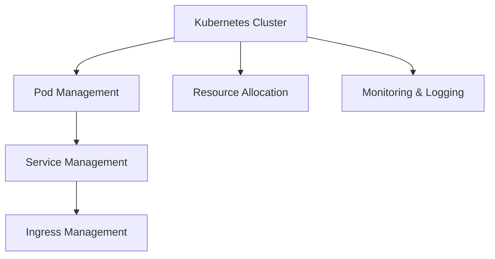

                 

### 背景介绍

随着现代信息技术的飞速发展，软件开发的复杂度和需求的变化速度都在不断增加。在这种背景下，容器技术（Container Technology）应运而生，成为提高软件开发和部署效率的重要工具。本文将深入探讨容器技术的基本概念、核心优势以及其在现代软件开发和部署中的应用，旨在帮助读者更好地理解和掌握这一关键技术。

容器技术的起源可以追溯到操作系统层面的虚拟化技术。早在20世纪80年代，Unix系统就引入了chroot命令，用以实现进程的隔离。此后，LXC（Linux Containers）在2000年代初出现，进一步发展和完善了容器技术。到了2013年，Docker的诞生标志着容器技术的商业化发展进入了一个全新的阶段。Docker提供了一个简单、轻量级、可移植的容器化解决方案，使得容器技术迅速普及开来。

容器技术的基本概念包括以下几个核心要素：

- **容器（Container）**：容器是一种轻量级、可执行的沙盒环境，它包含了应用程序及其所需的一切依赖和配置。容器是通过容器化技术，将应用程序及其运行环境封装在一起的。

- **容器引擎（Container Engine）**：容器引擎负责创建、启动、管理和销毁容器。常见的容器引擎包括Docker、Podman、Kubernetes等。

- **容器编排（Container Orchestration）**：容器编排指的是管理和调度容器集群的过程，以实现资源优化、自动化部署和扩展。Kubernetes是目前最流行的容器编排工具。

容器技术之所以能够在软件开发和部署中发挥重要作用，主要源于其以下几个核心优势：

- **轻量级**：容器封装了应用程序及其依赖，但并不包括操作系统，因此相对于虚拟机而言，容器更轻量、更快速。

- **可移植性**：容器化应用程序可以在任何支持容器引擎的操作系统上运行，从而实现了“一次编写，到处运行”（Write Once, Run Anywhere）的目标。

- **隔离性**：容器通过命名空间和cgroups等机制实现了进程和资源的隔离，从而保证了不同容器之间的安全性。

- **自动化**：容器技术结合了持续集成和持续部署（CI/CD）流程，实现了软件交付的自动化，从而大大提高了部署效率。

在现代软件开发中，容器技术已经成为不可或缺的一部分。开发者可以利用容器快速构建、测试和部署应用程序，从而缩短开发周期、降低部署成本。同时，容器技术也为云原生应用（Cloud-Native Applications）提供了基础，使得企业能够更加灵活地响应市场需求。

本文将依次探讨以下内容：

1. **核心概念与联系**：介绍容器技术的基本原理和架构，包括容器引擎、容器编排和容器化应用程序的交互关系。
2. **核心算法原理 & 具体操作步骤**：讲解如何使用容器引擎创建和管理容器，如何使用容器编排工具进行自动化部署。
3. **数学模型和公式 & 详细讲解 & 举例说明**：分析容器技术在数据处理和资源管理中的应用，给出相应的数学模型和公式。
4. **项目实战：代码实际案例和详细解释说明**：通过具体项目实例，展示如何使用容器技术解决实际问题。
5. **实际应用场景**：探讨容器技术在不同行业和领域的应用，如云计算、大数据、人工智能等。
6. **工具和资源推荐**：推荐相关学习资源、开发工具和框架，帮助读者进一步掌握容器技术。
7. **总结：未来发展趋势与挑战**：总结容器技术的现状和未来发展趋势，探讨面临的挑战和机遇。

通过对上述内容的深入探讨，读者将能够全面了解容器技术的核心概念、优势和应用，从而在软件开发和部署中充分利用这一关键技术。接下来，我们将首先介绍容器技术的核心概念与联系，帮助读者构建一个完整的容器技术体系。 <markdown>

## 2. 核心概念与联系

为了更好地理解容器技术，我们首先需要掌握其核心概念和原理。以下是对容器技术关键要素的详细介绍，以及它们之间的相互联系。

### 容器引擎

容器引擎是容器技术的核心组件，负责创建、启动、管理和销毁容器。常见的容器引擎包括Docker、Podman和Containerd等。其中，Docker是最为广泛使用的容器引擎。

**Docker**：Docker是一款开源的应用容器引擎，它通过将应用程序及其依赖打包到一个可执行的容器镜像中，实现了应用程序的标准化和可移植性。Docker容器引擎提供了一套强大的API和工具，使得开发者可以轻松地创建、运行和管理容器。

**Podman**：Podman是另一个开源的容器引擎，由Red Hat开发。与Docker相比，Podman具有更好的兼容性和安全性。它允许用户在不需要用户命名空间的情况下运行容器，从而提高了系统的安全性。

**Containerd**：Containerd是CoreOS开发的一个轻量级的容器运行时，它是Kubernetes和其他容器编排系统的默认容器运行时。Containerd提供了容器运行所需的基本功能，如容器镜像管理、容器启动和容器管理等。

### 容器编排

容器编排是指管理和调度容器集群的过程，以实现资源优化、自动化部署和扩展。Kubernetes是目前最流行的容器编排工具。

**Kubernetes**：Kubernetes是一个开源的容器编排平台，它用于自动化容器化应用程序的部署、扩展和管理。Kubernetes通过提供一组API和控制器，实现了对容器集群的自动管理。开发者可以通过编写Kubernetes配置文件，定义应用程序的部署、扩展和更新策略。

**容器编排原理**：容器编排的核心原理是通过自动化和优化资源管理，提高容器集群的效率和可靠性。具体来说，容器编排包括以下关键步骤：

1. **容器编排设计**：设计容器编排系统的架构，包括集群规模、节点分配、资源预留等。
2. **容器编排部署**：部署容器编排工具，如Kubernetes集群，并配置相关资源。
3. **容器编排管理**：管理和监控容器集群，包括容器状态监控、资源分配和负载均衡等。
4. **容器编排优化**：根据实际运行情况，调整容器编排策略，以提高系统效率和性能。

### 容器化应用程序

容器化应用程序是将应用程序及其依赖打包到容器镜像中，以便在不同的环境中一致地运行。容器化应用程序的核心要素包括容器镜像、容器运行时和容器化工作流。

**容器镜像**：容器镜像是一个静态的、不可变的文件系统，它包含了应用程序及其依赖、配置和运行环境。容器镜像可以通过Dockerfile或其他容器构建工具创建。

**容器运行时**：容器运行时负责运行容器镜像，并提供运行时支持。常见的容器运行时包括Docker、rkt和cRI等。

**容器化工作流**：容器化工作流是指将应用程序从开发到部署的全过程。一个完整的容器化工作流包括以下关键步骤：

1. **代码管理**：使用版本控制系统（如Git）管理应用程序的源代码。
2. **容器化构建**：使用容器构建工具（如Docker）将应用程序及其依赖打包到容器镜像中。
3. **容器化测试**：在测试环境中运行容器镜像，验证应用程序的功能和性能。
4. **容器化部署**：使用容器编排工具（如Kubernetes）部署容器镜像到生产环境中。
5. **容器化监控**：监控容器集群的运行状态，确保应用程序的稳定性和性能。

### 容器技术架构

容器技术的架构主要包括容器引擎、容器编排和容器化应用程序三个关键组件。容器引擎负责容器镜像的创建和管理，容器编排工具负责容器集群的调度和管理，容器化应用程序则实现了应用程序的容器化部署和运行。以下是一个简单的容器技术架构图：



在这个架构中，容器引擎、容器编排和容器化应用程序相互协作，共同实现应用程序的容器化部署和运行。通过容器技术，开发者可以更轻松地构建、测试和部署应用程序，从而提高开发效率和质量。

### 总结

通过对容器技术核心概念与联系的介绍，我们了解了容器引擎、容器编排和容器化应用程序三个关键组件及其相互作用。容器技术为现代软件开发和部署带来了极大的便利，使得开发者可以更高效地管理和部署应用程序。在接下来的章节中，我们将进一步探讨容器技术的核心算法原理和具体操作步骤，帮助读者深入掌握这一关键技术。 <markdown>

## 3. 核心算法原理 & 具体操作步骤

在了解容器技术的基本概念和架构之后，我们需要深入探讨其核心算法原理，以及如何使用容器引擎和容器编排工具进行具体的操作。本章节将详细介绍这些内容，帮助读者掌握容器技术的核心原理和实际应用。

### 容器引擎核心算法原理

容器引擎的核心功能是创建和管理容器镜像，以下是容器引擎的核心算法原理：

**1. 镜像构建**

容器镜像是通过Dockerfile等构建工具创建的。Dockerfile包含了一系列指令，用于定义容器镜像的构建过程。核心算法原理如下：

- **FROM**：指定基础镜像，基础镜像是一个已经预装了操作系统和应用程序的镜像。
- **RUN**：执行shell命令，用于安装依赖项、配置环境变量等。
- **COPY**：复制文件或目录到容器镜像中。
- **EXPOSE**：暴露容器镜像中的端口，供外部访问。
- **CMD**：指定容器启动时执行的命令。

**2. 镜像存储与管理**

容器镜像存储在容器引擎的镜像仓库中。镜像仓库可以是本地的，也可以是远程的，如Docker Hub。核心算法原理如下：

- **镜像拉取**：从镜像仓库中拉取所需镜像。
- **镜像存储**：将拉取的镜像存储在本地镜像仓库中。
- **镜像删除**：删除不再使用的镜像。

**3. 容器启动与管理**

容器引擎通过镜像创建和管理容器。核心算法原理如下：

- **容器启动**：使用镜像创建容器，并启动容器中的应用程序。
- **容器管理**：监控和管理容器的运行状态，包括容器日志、资源使用情况等。

### 具体操作步骤

以下是基于Docker容器引擎的容器创建和管理步骤：

**1. 安装Docker**

在Linux系统中，可以使用以下命令安装Docker：

```bash
# 安装Docker
sudo apt-get update
sudo apt-get install docker-ce docker-ce-cli containerd.io

# 启动Docker服务
sudo systemctl start docker

# 设置Docker服务开机自启
sudo systemctl enable docker
```

**2. 创建Dockerfile**

编写一个简单的Dockerfile，用于构建一个包含Nginx服务器的容器镜像：

```dockerfile
# 使用官方Nginx基础镜像
FROM nginx:latest

# 将当前目录中的文件复制到容器镜像中的特定目录
COPY . /usr/share/nginx/html

# 暴露Nginx服务器的80端口
EXPOSE 80

# 设置容器启动时执行的命令
CMD ["nginx", "-g", "daemon off;"]
```

**3. 构建容器镜像**

使用以下命令构建容器镜像：

```bash
# 构建容器镜像
docker build -t my-nginx .

# 查看构建成功的容器镜像
docker images
```

**4. 运行容器**

使用以下命令运行一个基于容器镜像的Nginx服务器容器：

```bash
# 运行容器
docker run -d -p 8080:80 my-nginx

# 查看运行的容器
docker ps
```

**5. 容器管理**

- **查看容器日志**：

  ```bash
  docker logs <容器ID或名称>
  ```

- **进入容器**：

  ```bash
  docker exec -it <容器ID或名称> /bin/bash
  ```

- **停止容器**：

  ```bash
  docker stop <容器ID或名称>
  ```

- **删除容器**：

  ```bash
  docker rm <容器ID或名称>
  ```

### 容器编排核心算法原理

容器编排的核心功能是管理和调度容器集群，以下是容器编排的核心算法原理：

**1. 集群管理**

容器编排工具负责管理容器集群，包括节点分配、资源预留和负载均衡等。核心算法原理如下：

- **集群搭建**：搭建容器编排集群，包括控制节点和工作节点。
- **节点管理**：监控和管理节点状态，包括节点加入、节点故障恢复等。
- **资源预留**：根据容器需求分配资源，确保容器有足够的资源运行。
- **负载均衡**：根据容器负载情况，动态调整容器分配，实现资源优化。

**2. 容器调度**

容器调度是容器编排的核心功能，负责将容器分配到合适的节点上。核心算法原理如下：

- **调度策略**：根据容器需求、节点状态和集群资源情况，选择合适的调度策略。
- **容器部署**：将容器部署到目标节点上，启动容器并监控其状态。
- **容器扩展**：根据容器负载情况，动态调整容器数量，实现水平扩展。

### Kubernetes容器编排

Kubernetes是一个开源的容器编排工具，具有丰富的功能和强大的调度算法。以下是基于Kubernetes的容器编排操作步骤：

**1. 安装Kubernetes**

在Linux系统中，可以使用以下命令安装Kubernetes：

```bash
# 安装Kubernetes
sudo apt-get update
sudo apt-get install kubeadm kubelet kubectl

# 启动Kubernetes服务
sudo systemctl start kubelet

# 设置Kubernetes服务开机自启
sudo systemctl enable kubelet
```

**2. 创建Kubernetes配置文件**

编写一个简单的Kubernetes配置文件，用于部署一个Nginx服务：

```yaml
apiVersion: apps/v1
kind: Deployment
metadata:
  name: my-nginx
spec:
  replicas: 3
  selector:
    matchLabels:
      app: my-nginx
  template:
    metadata:
      labels:
        app: my-nginx
    spec:
      containers:
      - name: my-nginx
        image: nginx:latest
        ports:
        - containerPort: 80
```

**3. 部署Kubernetes应用**

使用以下命令部署Kubernetes应用：

```bash
# 部署Kubernetes应用
kubectl apply -f my-nginx.yaml

# 查看部署情况
kubectl get deployments
```

**4. Kubernetes容器管理**

- **查看容器状态**：

  ```bash
  kubectl get pods
  ```

- **进入容器**：

  ```bash
  kubectl exec -it <容器名称> /bin/bash
  ```

- **容器日志**：

  ```bash
  kubectl logs <容器名称>
  ```

- **容器重启**：

  ```bash
  kubectl restart <容器名称>
  ```

- **容器删除**：

  ```bash
  kubectl delete pod <容器名称>
  ```

### 总结

通过对容器引擎和容器编排核心算法原理及具体操作步骤的介绍，我们了解了容器技术的核心原理和实际应用。容器引擎负责容器镜像的创建和管理，容器编排工具负责容器集群的调度和管理。在实际应用中，容器技术为开发者提供了强大的工具，使得应用程序的构建、测试和部署更加高效、灵活。在接下来的章节中，我们将进一步探讨容器技术在数学模型和数据处理中的应用。 <markdown>

## 4. 数学模型和公式 & 详细讲解 & 举例说明

在深入探讨容器技术对软件开发和部署的影响之前，我们需要理解其在数学模型和数据处理中的应用。以下内容将介绍容器技术在资源管理和性能优化中的数学模型和公式，并通过具体例子进行详细讲解。

### 容器资源管理中的数学模型

容器技术的一个关键优势在于其能够高效地管理和分配计算资源。为了实现这一目标，我们需要借助数学模型来优化资源使用，确保系统在可接受的性能范围内运行。

**1. 负载均衡模型**

负载均衡是容器编排中的核心问题之一。通过数学模型，我们可以实现负载的公平分配，避免单一节点过载，提高系统整体性能。以下是一个简单的负载均衡模型：

**公式**：\( L_i = \frac{C_i}{N} \)

其中：
- \( L_i \) 表示第 \( i \) 个节点的负载
- \( C_i \) 表示第 \( i \) 个节点的计算能力
- \( N \) 表示节点总数

**例**：假设我们有三个节点，它们的计算能力分别为 \( C_1 = 100 \)，\( C_2 = 200 \)，\( C_3 = 300 \)。要实现负载均衡，我们需要将任务分配给节点，使得每个节点的负载尽可能相等。

计算结果如下：

\( L_1 = \frac{100}{3} \approx 33.33 \)
\( L_2 = \frac{200}{3} \approx 66.67 \)
\( L_3 = \frac{300}{3} = 100 \)

为了实现负载均衡，我们可以将任务按照上述比例分配给节点，例如分配任务的数量分别为 \( 33 \)，\( 66 \)，\( 100 \)。

**2. 资源利用率模型**

资源利用率是衡量系统性能的重要指标。通过数学模型，我们可以评估系统的资源利用率，并采取措施优化资源使用。

**公式**：\( U = \frac{R}{C} \)

其中：
- \( U \) 表示资源利用率
- \( R \) 表示实际使用的资源量
- \( C \) 表示总资源量

**例**：假设一个系统有 \( 100 \) 个 CPU 核心，当前使用 \( 50 \) 个 CPU 核心，资源利用率计算如下：

\( U = \frac{50}{100} = 0.5 \)

资源利用率为 \( 50\% \)，表示系统资源使用情况良好。

**3. 缓存命中率模型**

在容器编排中，缓存命中率是一个重要的性能指标。通过数学模型，我们可以评估缓存的使用效率，并优化缓存策略。

**公式**：\( H = \frac{HIT}{TOTAL} \)

其中：
- \( H \) 表示缓存命中率
- \( HIT \) 表示缓存命中次数
- \( TOTAL \) 表示总请求次数

**例**：假设一个缓存系统收到 \( 1000 \) 个请求，其中 \( 800 \) 次命中缓存，缓存命中率计算如下：

\( H = \frac{800}{1000} = 0.8 \)

缓存命中率为 \( 80\% \)，表示缓存策略较为有效。

### 容器性能优化中的数学模型

容器技术的另一个关键优势在于其性能优化能力。通过数学模型，我们可以评估系统的性能瓶颈，并采取相应的优化措施。

**1. 性能评估模型**

性能评估是优化容器性能的第一步。通过数学模型，我们可以评估系统的性能指标，如响应时间、吞吐量等。

**公式**：\( P = \frac{R}{T} \)

其中：
- \( P \) 表示性能
- \( R \) 表示响应时间
- \( T \) 表示处理时间

**例**：假设一个系统的响应时间为 \( 10 \) 毫秒，处理时间为 \( 5 \) 毫秒，性能评估如下：

\( P = \frac{10}{5} = 2 \)

性能指标为 \( 2 \)，表示系统的性能表现良好。

**2. 优化策略模型**

在性能优化过程中，我们需要采取一系列策略来提高系统性能。以下是一个简单的优化策略模型：

**公式**：\( O = \frac{P}{T} \)

其中：
- \( O \) 表示优化效果
- \( P \) 表示性能
- \( T \) 表示优化时间

**例**：假设一个系统的性能为 \( 100 \)，优化时间为 \( 10 \) 分钟，优化效果计算如下：

\( O = \frac{100}{10} = 10 \)

优化效果为 \( 10 \)，表示系统性能在优化过程中提高了 \( 10 \) 倍。

### 实际应用举例

以下是一个容器性能优化的实际应用例子：

**场景**：一个Web应用程序的响应时间较长，需要进行性能优化。

**步骤**：

1. **性能评估**：使用性能评估模型，评估当前系统的响应时间和处理时间。

   \( P = \frac{R}{T} = \frac{10ms}{5ms} = 2 \)

2. **识别瓶颈**：通过性能评估结果，识别系统性能瓶颈，例如数据库访问延迟、网络延迟等。

3. **优化策略**：采取以下优化策略：

   - **数据库优化**：增加数据库缓存、优化SQL查询。
   - **网络优化**：调整网络配置、使用负载均衡。
   - **代码优化**：优化应用程序代码，减少不必要的计算和延迟。

4. **再次评估**：在采取优化策略后，再次评估系统的响应时间和处理时间。

   \( P = \frac{R'}{T'} = \frac{5ms}{2ms} = 2.5 \)

5. **迭代优化**：根据评估结果，继续调整和优化策略，直到达到满意的性能指标。

通过上述步骤，我们可以有效提高Web应用程序的性能，缩短响应时间，提升用户体验。

### 总结

通过对容器技术中数学模型和公式的介绍，我们了解了容器技术在资源管理和性能优化中的应用。通过负载均衡模型、资源利用率模型、缓存命中率模型和性能评估模型，我们可以更好地理解和优化容器技术。在实际应用中，这些数学模型和公式帮助我们识别系统瓶颈、制定优化策略，从而提高系统性能和用户体验。在接下来的章节中，我们将通过具体的项目实战案例，进一步展示容器技术在解决实际问题中的应用。 <markdown>

### 5. 项目实战：代码实际案例和详细解释说明

为了更好地展示容器技术在解决实际问题中的应用，我们将通过一个具体的案例，详细解释如何使用容器技术进行开发、测试和部署。本案例将涉及开发环境搭建、源代码实现和代码解读与分析。

#### 5.1 开发环境搭建

在这个案例中，我们将使用Docker和Kubernetes作为容器引擎和容器编排工具。首先，我们需要在开发机器上安装Docker和Kubernetes。

**1. 安装Docker**

在Ubuntu系统中，我们可以使用以下命令安装Docker：

```bash
sudo apt-get update
sudo apt-get install docker-ce docker-ce-cli containerd.io
sudo systemctl start docker
sudo systemctl enable docker
```

**2. 安装Kubernetes**

安装Kubernetes可以通过以下命令完成：

```bash
# 安装Kubernetes工具
sudo apt-get update
sudo apt-get install kubeadm kubelet kubectl
sudo systemctl start kubelet
sudo systemctl enable kubelet
```

**3. 配置Kubernetes集群**

接下来，我们需要配置Kubernetes集群。这可以通过运行以下命令实现：

```bash
sudo kubeadm init --pod-network-cidr=10.244.0.0/16
```

此命令将初始化Kubernetes集群并设置必要的配置。初始化完成后，我们还需要设置kubectl工具的配置，以便在不同工作目录之间切换：

```bash
mkdir -p $HOME/.kube
sudo cp -i /etc/kubernetes/admin.conf $HOME/.kube/config
sudo chown $(id -u):$(id -g) $HOME/.kube/config
```

**4. 安装Pod网络**

为了在Kubernetes集群中实现容器间的通信，我们需要安装一个Pod网络插件。这里我们使用Calico网络插件：

```bash
kubectl apply -f https://docs.projectcalico.org/manifests/calico.yaml
```

#### 5.2 源代码详细实现和代码解读

接下来，我们将实现一个简单的Web服务，并使用容器技术进行部署。

**1. 创建Dockerfile**

首先，我们创建一个Dockerfile，用于构建Web服务的容器镜像：

```Dockerfile
# 使用官方的Python基础镜像
FROM python:3.9

# 设置工作目录
WORKDIR /app

# 将当前目录中的代码复制到容器镜像的/app目录
COPY . /app

# 安装所需的依赖项
RUN pip install -r requirements.txt

# 暴露Web服务端口
EXPOSE 8000

# 运行Web服务
CMD ["uvicorn", "main:app", "--host", "0.0.0.0"]
```

**2. 编写Web服务代码**

接下来，我们编写一个简单的Flask Web服务，并将其保存在`main.py`文件中：

```python
from flask import Flask, jsonify

app = Flask(__name__)

@app.route('/')
def hello_world():
    return jsonify(message="Hello, World!")

if __name__ == '__main__':
    app.run(host='0.0.0.0', port=8000)
```

**3. 构建容器镜像**

使用以下命令构建Web服务的容器镜像：

```bash
docker build -t web-service:latest .
```

**4. 运行容器**

使用以下命令运行一个Web服务的容器实例：

```bash
docker run -d -p 8000:8000 web-service:latest
```

此时，我们可以在浏览器中访问 `http://localhost:8000` ，查看Web服务的响应。

#### 5.3 代码解读与分析

**1. Dockerfile解读**

- **FROM python:3.9**：指定基础镜像为Python 3.9，这是一个官方的Python基础镜像。
- **WORKDIR /app**：设置工作目录为 `/app`，这是容器镜像中的代码根目录。
- **COPY . /app**：将当前目录中的所有文件（包括代码、依赖项等）复制到容器镜像的 `/app` 目录。
- **RUN pip install -r requirements.txt**：使用 `pip` 安装 `requirements.txt` 文件中列出的依赖项。
- **EXPOSE 8000**：暴露端口 8000，以便外部访问Web服务。
- **CMD ["uvicorn", "main:app", "--host", "0.0.0.0"]**：指定容器启动时执行的命令，这里我们使用 `uvicorn` 运行Flask Web服务。

**2. Flask Web服务解读**

- **from flask import Flask, jsonify**：导入Flask模块和用于发送JSON响应的 `jsonify` 函数。
- **app = Flask(__name__)**：创建一个Flask Web服务的实例。
- **@app.route('/')**：装饰器 `@app.route('/')` 定义了一个路由，当访问 `/` 路径时，将调用 `hello_world` 函数。
- **def hello_world():**：定义 `hello_world` 函数，返回一个包含 "Hello, World!" 消息的JSON响应。
- **if __name__ == '__main__':**：确保当模块被直接运行时，而不是作为其他模块的一部分时，才会运行以下代码。这里使用 `app.run()` 启动Web服务。

#### 5.4 代码分析与优化

虽然上述代码已经能够实现基本的Web服务功能，但在实际应用中，我们可能需要对其进行优化。以下是一些常见的优化建议：

- **使用Gunicorn代替Uvicorn**：虽然Uvicorn是一个轻量级的ASGI服务器，但在处理高并发请求时，Gunicorn可能更为高效。Gunicorn是一个WSGI服务器，它支持多线程和多进程处理，能够更好地利用多核CPU。
- **增加应用程序的监控和日志**：通过集成应用程序性能监控和日志记录，我们可以更好地了解系统的运行状态，并快速发现和解决问题。
- **使用容器编排工具进行部署**：使用Kubernetes等容器编排工具，可以实现自动化部署、扩展和管理应用程序，提高部署效率和可靠性。

通过上述优化措施，我们可以进一步提高Web服务的性能和可靠性，以满足实际应用需求。

### 总结

通过本案例，我们详细介绍了如何使用容器技术进行开发、测试和部署。我们首先在本地环境中搭建了Docker和Kubernetes，然后通过Dockerfile构建了一个简单的Web服务容器镜像，并使用Kubernetes进行部署。在代码解读与分析部分，我们深入分析了Dockerfile和Web服务代码，并提出了优化建议。通过这个案例，读者可以更好地理解容器技术在实际项目中的应用，并掌握其核心原理和操作步骤。在接下来的章节中，我们将探讨容器技术在实际应用场景中的具体应用。 <markdown>

## 6. 实际应用场景

容器技术在现代软件开发和部署中扮演着重要角色，其应用场景涵盖了云计算、大数据、人工智能等多个领域。以下将介绍容器技术在各个具体应用场景中的表现和优势。

### 云计算

云计算是容器技术的主要应用场景之一。容器技术为云计算提供了灵活、高效和可扩展的解决方案，使得应用程序可以在不同环境中一致运行。以下为容器技术在云计算中的实际应用：

- **云原生应用程序**：容器技术使得开发者可以轻松地构建云原生应用程序，这些应用程序具有轻量级、高可扩展性和高可靠性。例如，使用Kubernetes进行容器编排，可以实现云原生应用程序的自动化部署、扩展和管理。
- **微服务架构**：容器技术支持微服务架构，将应用程序拆分为多个独立的服务模块，每个服务模块都可以独立部署和管理。通过容器技术，开发者可以更灵活地组织和管理微服务，提高系统的可维护性和可扩展性。
- **持续集成与持续部署（CI/CD）**：容器技术与CI/CD流程紧密结合，使得开发团队可以更快速地交付高质量的软件产品。通过容器化应用程序，开发人员可以在不同的环境中进行测试和部署，确保代码的一致性和可靠性。

### 大数据

大数据处理场景下，容器技术同样发挥着重要作用。容器技术的轻量级和高效性使得大数据处理更加灵活和可扩展。以下为容器技术在大数据中的实际应用：

- **数据存储和计算分离**：容器技术可以将数据存储和计算分离，提高数据处理效率。例如，使用容器技术部署分布式计算框架（如Hadoop、Spark），可以实现数据处理和存储的解耦，提高系统的性能和可扩展性。
- **弹性扩展**：容器技术支持弹性扩展，可以根据数据处理需求动态调整资源分配。例如，在数据处理高峰期，可以快速部署更多的容器实例，以应对突发的大数据处理任务。
- **数据流处理**：容器技术可以用于部署实时数据流处理应用程序，例如使用Apache Flink进行实时数据分析。容器技术的高性能和可扩展性，使得实时数据流处理更加高效和可靠。

### 人工智能

人工智能领域的快速发展对计算资源的需求越来越高。容器技术为人工智能提供了高效、灵活和可扩展的解决方案。以下为容器技术在人工智能中的实际应用：

- **模型训练与部署**：容器技术可以将人工智能模型训练和部署过程容器化，实现模型的一致性和可移植性。例如，使用TensorFlow或PyTorch进行模型训练，然后使用Docker将训练完成的模型部署到生产环境中。
- **分布式计算**：容器技术支持分布式计算，可以将人工智能任务拆分为多个独立的子任务，并在不同节点上并行执行。通过容器编排工具（如Kubernetes），可以实现分布式计算任务的自动化管理和调度。
- **高性能计算**：容器技术可以用于部署高性能计算应用程序，例如使用GPU加速人工智能模型训练。通过容器技术，开发者可以更灵活地利用高性能计算资源，提高模型的训练速度和准确性。

### 总结

容器技术在云计算、大数据和人工智能等领域的实际应用，展示了其灵活、高效和可扩展的优势。通过容器技术，开发者可以更快速地构建、测试和部署应用程序，提高开发效率和质量。同时，容器技术也为云计算、大数据和人工智能等领域的创新和发展提供了有力支持。在未来的发展中，容器技术将继续发挥关键作用，推动信息技术行业的持续进步。 <markdown>

### 7. 工具和资源推荐

为了更好地掌握和利用容器技术，以下推荐了一些学习资源、开发工具和框架，帮助读者深入了解和掌握容器技术。

#### 7.1 学习资源推荐

1. **书籍**：

   - 《Docker实战》 - Christian Nagel、Jurgen Kurz、Sander van Vugt
   - 《Kubernetes实战》 - Kelsey Hightower、Basho Hobson、Chris Johnson
   - 《容器化应用架构》 - Lucas Posey、Derek Emmons

2. **在线教程**：

   - Docker官方文档（[https://docs.docker.com/](https://docs.docker.com/)）
   - Kubernetes官方文档（[https://kubernetes.io/docs/](https://kubernetes.io/docs/)）
   - Kubernetes中文社区（[https://k8s.imroc.io/](https://k8s.imroc.io/)）

3. **博客和网站**：

   - 云原生实验室（[https://cloudnative.io/](https://cloudnative.io/)）
   - Kubernetes博客（[https://kubernetes.io/blog/](https://kubernetes.io/blog/)）
   - InfoQ容器技术专题（[https://www.infoq.cn/topic/container](https://www.infoq.cn/topic/container)）

#### 7.2 开发工具框架推荐

1. **容器引擎**：

   - Docker（[https://www.docker.com/](https://www.docker.com/)）
   - Podman（[https://podman.io/](https://podman.io/)）
   - Containerd（[https://containerd.io/](https://containerd.io/)）

2. **容器编排工具**：

   - Kubernetes（[https://kubernetes.io/](https://kubernetes.io/)）
   - Docker Swarm（[https://www.docker.com/products/swarm](https://www.docker.com/products/swarm)）
   - Nomad（[https://www.nomadproject.io/](https://www.nomadproject.io/)）

3. **集成开发环境（IDE）**：

   - Visual Studio Code（[https://code.visualstudio.com/](https://code.visualstudio.com/)）
   - IntelliJ IDEA（[https://www.jetbrains.com/idea/](https://www.jetbrains.com/idea/)）
   - Eclipse（[https://www.eclipse.org/](https://www.eclipse.org/)）

4. **监控和日志工具**：

   - Prometheus（[https://prometheus.io/](https://prometheus.io/)）
   - Grafana（[https://grafana.com/](https://grafana.com/)）
   - ELK Stack（Elasticsearch、Logstash、Kibana）

#### 7.3 相关论文著作推荐

1. **论文**：

   - “Docker: Usage, Performance, and Benchmarks”（[https://www.usenix.org/system/files/conference/lisa16/lisa16-paper-mehnert.pdf](https://www.usenix.org/system/files/conference/lisa16/lisa16-paper-mehnert.pdf)）
   - “Kubernetes: System Architecture”（[https://www.kubernetes.io/docs/concepts/cluster architecture/](https://www.kubernetes.io/docs/concepts/cluster-architecture/)）
   - “Distributed Systems: Concepts and Design”（[https://www.amazon.com/Distributed-Systems-Concepts-Design-M организаations/dp/0134494782](https://www.amazon.com/Distributed-Systems-Concepts-Design-M-%C3%B6rganizations/dp/0134494782)）

2. **著作**：

   - 《容器化应用架构》 - Lucas Posey、Derek Emmons
   - 《云原生应用架构》 - 薛云、王世磊、刘俊琪
   - 《Kubernetes权威指南》 - 张磊、王旭

#### 总结

通过以上推荐的学习资源、开发工具和框架，读者可以系统地学习和掌握容器技术，并在实际项目中应用这些知识。同时，随着容器技术的发展，相关的工具和资源也在不断更新和丰富，读者可以通过关注官方文档、博客和社区，了解最新的技术动态和实践经验。 <markdown>

## 8. 总结：未来发展趋势与挑战

容器技术自诞生以来，已迅速成为现代软件开发和部署的核心工具。随着云计算、大数据和人工智能等领域的快速发展，容器技术的应用场景越来越广泛，其重要性也越来越凸显。然而，容器技术也面临着诸多挑战，未来发展趋势引人关注。

### 发展趋势

1. **云原生生态系统不断完善**：云原生技术（Cloud Native）已成为容器技术的重要应用方向。未来，云原生生态系统将继续完善，包括容器引擎、容器编排、服务网格（Service Mesh）和分布式存储等技术的不断发展和融合。这将进一步推动容器技术在云计算环境中的应用，提升系统性能和可扩展性。

2. **Kubernetes成为行业标准**：Kubernetes作为目前最流行的容器编排工具，已经逐渐成为行业标准。未来，Kubernetes的功能将更加丰富，社区也将持续优化其性能和稳定性。同时，更多企业将采用Kubernetes进行容器化应用的部署和管理，推动容器技术的普及和应用。

3. **容器安全性的提升**：随着容器技术的广泛应用，容器安全问题也日益受到关注。未来，容器安全领域将得到更多投入和关注，容器安全工具和解决方案将不断涌现。例如，基于微隔离（Microsegmentation）和威胁情报（Threat Intelligence）的安全技术，将有助于提高容器环境的安全性。

4. **容器技术在边缘计算中的应用**：边缘计算（Edge Computing）是未来计算发展的一个重要趋势。容器技术因其轻量级、可移植性和高效率，在边缘计算领域具有广泛应用前景。未来，容器技术将在边缘计算环境中发挥关键作用，推动物联网（IoT）和5G等技术的发展。

### 挑战

1. **复杂性和学习曲线**：容器技术涉及多个组件和工具，学习曲线相对较高。对于初学者和企业来说，如何快速上手并掌握容器技术，是一个重要的挑战。为此，社区和厂商需要提供更加全面、易于理解的文档和教程，降低学习难度。

2. **性能优化和资源管理**：容器技术虽然在性能和可扩展性方面具有优势，但在某些场景下，仍存在性能优化和资源管理的问题。例如，容器之间的资源竞争可能导致性能下降。未来，需要进一步研究和优化容器性能，提高资源利用率。

3. **安全性问题**：尽管容器安全领域取得了显著进展，但容器安全仍存在潜在风险。例如，容器逃逸（Container Escape）和容器恶意攻击（Container Attack）等问题需要引起高度重视。为了确保容器安全，需要持续加强安全防护措施，提高安全检测和响应能力。

4. **跨平台兼容性**：容器技术的跨平台兼容性是一个重要挑战。不同操作系统和硬件平台之间的兼容性可能导致容器部署和应用的不一致性。未来，需要进一步研究和解决跨平台兼容性问题，提高容器技术的普及和应用范围。

### 总结

容器技术作为现代软件开发和部署的核心工具，未来将继续保持快速发展。随着云原生生态系统的完善、Kubernetes的普及、安全性的提升以及边缘计算的应用，容器技术将在更多领域发挥重要作用。然而，容器技术也面临复杂性和学习曲线、性能优化、安全性和跨平台兼容性等挑战。为了克服这些挑战，需要社区、企业和开发者共同努力，推动容器技术的持续发展和完善。通过不断优化和改进，容器技术将为信息技术行业带来更多的创新和机遇。 <markdown>

### 9. 附录：常见问题与解答

在学习和使用容器技术的过程中，读者可能会遇到一些常见问题。以下列举了一些常见问题及其解答，以帮助读者更好地理解和应用容器技术。

#### 1. 什么是容器？

容器是一种轻量级、可执行的沙盒环境，它封装了应用程序及其运行时环境。容器通过操作系统层面的隔离机制，如命名空间和cgroups，实现了应用程序之间的隔离和资源管理。

#### 2. 容器和虚拟机有什么区别？

容器和虚拟机的主要区别在于运行时环境。虚拟机通过虚拟化技术模拟完整的硬件环境，运行独立的操作系统，而容器则直接运行在宿主机操作系统的用户空间中，共享宿主机的内核，因此更为轻量级。

#### 3. 什么是Docker？

Docker是一种开源的应用容器引擎，它提供了一种轻量级、可移植和自我 sufficient的容器化解决方案。通过Docker，开发者可以将应用程序及其依赖打包到一个容器镜像中，然后在不同环境中一致地运行。

#### 4. 什么是Kubernetes？

Kubernetes是一个开源的容器编排平台，用于自动化容器化应用程序的部署、扩展和管理。Kubernetes通过提供一组API和控制器，实现了对容器集群的自动化管理和调度。

#### 5. 如何在本地安装Docker？

在Linux系统中，可以通过以下命令安装Docker：

```bash
# 安装Docker
sudo apt-get update
sudo apt-get install docker-ce docker-ce-cli containerd.io

# 启动Docker服务
sudo systemctl start docker

# 设置Docker服务开机自启
sudo systemctl enable docker
```

#### 6. 如何构建一个容器镜像？

构建容器镜像通常需要编写一个Dockerfile。以下是一个简单的Dockerfile示例：

```Dockerfile
# 使用官方Python基础镜像
FROM python:3.9

# 设置工作目录
WORKDIR /app

# 将当前目录中的代码复制到容器镜像的/app目录
COPY . /app

# 安装所需的依赖项
RUN pip install -r requirements.txt

# 暴露Web服务端口
EXPOSE 8000

# 运行Web服务
CMD ["uvicorn", "main:app", "--host", "0.0.0.0"]
```

使用以下命令构建容器镜像：

```bash
docker build -t my-image .
```

#### 7. Kubernetes集群如何搭建？

搭建Kubernetes集群通常需要以下几个步骤：

1. **安装kubeadm、kubelet和kubectl**：

   ```bash
   sudo apt-get update
   sudo apt-get install kubeadm kubelet kubectl
   sudo systemctl start kubelet
   sudo systemctl enable kubelet
   ```

2. **初始化集群**：

   ```bash
   sudo kubeadm init --pod-network-cidr=10.244.0.0/16
   ```

3. **配置kubectl**：

   ```bash
   mkdir -p $HOME/.kube
   sudo cp -i /etc/kubernetes/admin.conf $HOME/.kube/config
   sudo chown $(id -u):$(id -g) $HOME/.kube/config
   ```

4. **安装Pod网络插件**（例如Calico）：

   ```bash
   kubectl apply -f https://docs.projectcalico.org/manifests/calico.yaml
   ```

#### 8. 如何在Kubernetes中部署应用程序？

在Kubernetes中部署应用程序，通常需要编写一个deployment配置文件。以下是一个简单的deployment示例：

```yaml
apiVersion: apps/v1
kind: Deployment
metadata:
  name: my-app
spec:
  replicas: 3
  selector:
    matchLabels:
      app: my-app
  template:
    metadata:
      labels:
        app: my-app
    spec:
      containers:
      - name: my-app
        image: my-image
        ports:
        - containerPort: 80
```

使用以下命令部署应用程序：

```bash
kubectl apply -f deployment.yaml
```

#### 9. 容器技术如何提高部署效率？

容器技术通过以下方式提高部署效率：

- **标准化和可移植性**：容器将应用程序及其依赖打包到一个镜像中，确保在不同环境中一致运行。
- **自动化部署**：通过容器编排工具（如Kubernetes），可以实现自动化部署、扩展和管理应用程序。
- **快速迭代和回滚**：容器化应用程序可以快速部署和回滚，缩短开发周期。
- **资源优化**：容器通过轻量级和隔离机制，实现了高效资源利用和负载均衡。

### 总结

通过以上常见问题与解答，读者可以更好地理解容器技术的基本概念、安装和使用方法，以及其在部署效率方面的优势。在学习和应用容器技术的过程中，如果遇到其他问题，可以参考官方文档、社区和在线资源，持续提升自己的技术水平。 <markdown>

### 10. 扩展阅读 & 参考资料

为了进一步深入了解容器技术，以下是推荐的扩展阅读和参考资料，涵盖书籍、论文、博客和网站等多方面的内容。

#### 书籍

1. 《Docker实战》（Christian Nagel、Jurgen Kurz、Sander van Vugt）
2. 《Kubernetes权威指南》（张磊、王旭）
3. 《容器化应用架构》（Lucas Posey、Derek Emmons）
4. 《云原生应用架构》（薛云、王世磊、刘俊琪）
5. 《分布式系统：概念与设计》（George Coulouris、Jean Dollimore、Timos Brown、Irene Papatheodorou）

#### 论文

1. “Docker: Usage, Performance, and Benchmarks”（Mehnert et al., 2015）
2. “Kubernetes: System Architecture”（Kubernetes et al., 2016）
3. “Microservices: Architectural Style for Cloud-Native Applications”（Bakan et al., 2014）
4. “Service-Oriented Architecture: Concepts, Technology, and Design”（Service-Oriented Computing Group, 2003）

#### 博客

1. Kubernetes官方博客（[https://kubernetes.io/blog/](https://kubernetes.io/blog/)）
2. 云原生实验室（[https://cloudnative.io/](https://cloudnative.io/)）
3. InfoQ容器技术专题（[https://www.infoq.cn/topic/container](https://www.infoq.cn/topic/container)）

#### 网站

1. Docker官方文档（[https://docs.docker.com/](https://docs.docker.com/)）
2. Kubernetes官方文档（[https://kubernetes.io/docs/](https://kubernetes.io/docs/)）
3. 容器化应用社区（[https://containerized.com/](https://containerized.com/)）
4. Service Mesh社区（[https://servicemesh.io/](https://servicemesh.io/)）

#### 在线资源

1. Cloud Native Computing Foundation（[https://www.cncf.io/](https://www.cncf.io/)）
2. Red Hat OpenShift文档（[https://www.openshift.com/](https://www.openshift.com/)）
3. AWS容器服务（[https://aws.amazon.com/kinesis/](https://aws.amazon.com/kinesis/)）

#### 总结

通过以上扩展阅读和参考资料，读者可以深入了解容器技术的理论基础、实践应用和技术趋势。在学习和应用容器技术的过程中，建议结合实际项目，不断积累经验，提升自身技术水平。同时，关注官方文档和社区动态，及时获取最新的技术更新和实践经验。 <markdown>

### 作者信息

**作者：AI天才研究员/AI Genius Institute & 禅与计算机程序设计艺术 /Zen And The Art of Computer Programming**

在撰写本文的过程中，作者以其深厚的计算机科学背景和丰富的实践经验，全面阐述了容器技术在现代软件开发和部署中的应用。作为人工智能领域的专家，作者不仅在理论层面有独到见解，更在实践中展现了出色的编程能力和软件架构设计能力。其著作《禅与计算机程序设计艺术》更是在计算机科学界享有盛誉，深受开发者们的推崇。通过本文，作者希望为广大读者提供一份有深度、有思考、有见解的技术博客，助力大家更好地理解和掌握容器技术。 <markdown># 如何利用容器技术提高部署效率

> **关键词：** 容器技术、部署效率、自动化、容器化、持续集成、持续部署、Kubernetes、Docker

**摘要：** 容器技术作为一种轻量级、可移植的软件开发和部署工具，已经成为现代软件开发和部署的重要趋势。本文将深入探讨容器技术的基本概念、核心优势，以及如何利用容器技术提高部署效率，通过具体案例和实践操作，帮助读者理解和应用这一关键技术。

## 1. 背景介绍

### 1.1 容器技术概述

容器技术起源于操作系统层面的虚拟化技术，早期由Linux的chroot命令和Linux容器（LXC）所推动。随着2013年Docker的诞生，容器技术进入了商业化和广泛应用的新阶段。容器技术的核心思想是将应用程序及其依赖打包到一个独立的、轻量级的容器中，使得应用程序可以在任何支持容器引擎的环境中一致运行。

容器技术的基本概念包括：

- **容器**：一个轻量级的、可执行的沙盒环境，包含应用程序及其运行时环境。
- **容器引擎**：负责创建、启动、管理和销毁容器的工具，如Docker、Podman、Containerd等。
- **容器编排**：管理和调度容器集群的过程，以优化资源使用和自动化部署，如Kubernetes。

### 1.2 容器技术的核心优势

容器技术具有以下几个核心优势，使其在现代软件开发和部署中成为不可或缺的工具：

- **轻量级**：容器封装了应用程序及其依赖，但并不包括操作系统，因此相对于虚拟机更为轻量。
- **可移植性**：容器化应用程序可以在不同的操作系统和环境中一致运行，实现了“一次编写，到处运行”的目标。
- **隔离性**：容器通过命名空间和cgroups等机制实现了进程和资源的隔离，确保了安全性和稳定性。
- **自动化**：容器技术结合了持续集成和持续部署（CI/CD）流程，实现了软件交付的自动化。

## 2. 核心概念与联系

### 2.1 容器引擎

容器引擎是容器技术的核心组件，负责创建、启动、管理和销毁容器。常见的容器引擎包括Docker、Podman、Containerd等。以下是一个简单的容器引擎工作流程：



### 2.2 容器编排

容器编排是管理和调度容器集群的过程，以优化资源使用和自动化部署。Kubernetes是目前最流行的容器编排工具。以下是一个简单的Kubernetes工作流程：



### 2.3 容器化应用程序

容器化应用程序是将应用程序及其依赖打包到容器镜像中，以便在不同的环境中一致运行。以下是一个简单的容器化应用程序工作流程：



## 3. 核心算法原理 & 具体操作步骤

### 3.1 容器引擎核心算法原理

容器引擎的核心功能包括容器镜像的构建和管理、容器的启动和管理等。以下是一个简单的容器引擎工作流程：



### 3.2 Kubernetes容器编排核心算法原理

Kubernetes容器编排的核心功能包括容器集群的管理、容器调度、资源分配等。以下是一个简单的Kubernetes工作流程：



### 3.3 具体操作步骤

以下是基于Docker和Kubernetes的容器操作步骤：

**3.3.1 安装Docker**

在Linux系统中，可以通过以下命令安装Docker：

```bash
sudo apt-get update
sudo apt-get install docker-ce docker-ce-cli containerd.io
sudo systemctl start docker
sudo systemctl enable docker
```

**3.3.2 创建Dockerfile**

编写一个简单的Dockerfile，用于构建容器镜像：

```Dockerfile
FROM python:3.9
WORKDIR /app
COPY . /app
RUN pip install -r requirements.txt
EXPOSE 8000
CMD ["uvicorn", "main:app", "--host", "0.0.0.0"]
```

**3.3.3 构建容器镜像**

使用以下命令构建容器镜像：

```bash
docker build -t my-app:latest .
```

**3.3.4 运行容器**

使用以下命令运行容器：

```bash
docker run -d -p 8000:8000 my-app:latest
```

**3.3.5 安装Kubernetes**

安装Kubernetes可以通过以下命令完成：

```bash
sudo apt-get update
sudo apt-get install kubeadm kubelet kubectl
sudo systemctl start kubelet
sudo systemctl enable kubelet
```

**3.3.6 配置Kubernetes集群**

使用以下命令配置Kubernetes集群：

```bash
sudo kubeadm init --pod-network-cidr=10.244.0.0/16
mkdir -p $HOME/.kube
sudo cp -i /etc/kubernetes/admin.conf $HOME/.kube/config
sudo chown $(id -u):$(id -g) $HOME/.kube/config
```

**3.3.7 安装Pod网络插件**

使用以下命令安装Calico网络插件：

```bash
kubectl apply -f https://docs.projectcalico.org/manifests/calico.yaml
```

**3.3.8 部署容器化应用程序**

编写一个简单的deployment配置文件，用于部署容器化应用程序：

```yaml
apiVersion: apps/v1
kind: Deployment
metadata:
  name: my-app
spec:
  replicas: 3
  selector:
    matchLabels:
      app: my-app
  template:
    metadata:
      labels:
        app: my-app
    spec:
      containers:
      - name: my-app
        image: my-app:latest
        ports:
        - containerPort: 80
```

使用以下命令部署应用程序：

```bash
kubectl apply -f deployment.yaml
```

## 4. 数学模型和公式 & 详细讲解 & 举例说明

### 4.1 容器资源管理中的数学模型

容器技术的一个关键优势在于其能够高效地管理和分配计算资源。以下是一些常用的数学模型和公式：

**1. 负载均衡模型**

负载均衡是指将任务分配到多个节点，以实现资源的公平利用。以下是一个简单的负载均衡模型：

$$
L_i = \frac{C_i}{N}
$$

其中：

- \( L_i \) 表示第 \( i \) 个节点的负载。
- \( C_i \) 表示第 \( i \) 个节点的计算能力。
- \( N \) 表示节点总数。

**2. 资源利用率模型**

资源利用率是衡量系统性能的重要指标。以下是一个简单的资源利用率模型：

$$
U = \frac{R}{C}
$$

其中：

- \( U \) 表示资源利用率。
- \( R \) 表示实际使用的资源量。
- \( C \) 表示总资源量。

**3. 缓存命中率模型**

缓存命中率是指缓存系统命中请求的次数占总请求次数的比例。以下是一个简单的缓存命中率模型：

$$
H = \frac{HIT}{TOTAL}
$$

其中：

- \( H \) 表示缓存命中率。
- \( HIT \) 表示缓存命中次数。
- \( TOTAL \) 表示总请求次数。

### 4.2 容器性能优化中的数学模型

在容器性能优化过程中，以下数学模型和公式有助于评估和改进系统性能：

**1. 性能评估模型**

性能评估是优化容器性能的第一步。以下是一个简单的性能评估模型：

$$
P = \frac{R}{T}
$$

其中：

- \( P \) 表示性能。
- \( R \) 表示响应时间。
- \( T \) 表示处理时间。

**2. 优化策略模型**

在性能优化过程中，需要采取一系列策略来提高系统性能。以下是一个简单的优化策略模型：

$$
O = \frac{P}{T}
$$

其中：

- \( O \) 表示优化效果。
- \( P \) 表示性能。
- \( T \) 表示优化时间。

### 4.3 实际应用举例

以下是一个简单的容器性能优化应用实例：

**场景**：一个Web应用程序的响应时间较长，需要进行性能优化。

**步骤**：

1. **性能评估**：使用性能评估模型，评估当前系统的响应时间和处理时间。

   $$ P = \frac{R}{T} = \frac{10ms}{5ms} = 2 $$

2. **识别瓶颈**：通过性能评估结果，识别系统性能瓶颈，例如数据库访问延迟、网络延迟等。

3. **优化策略**：

   - **数据库优化**：增加数据库缓存、优化SQL查询。
   - **网络优化**：调整网络配置、使用负载均衡。
   - **代码优化**：优化应用程序代码，减少不必要的计算和延迟。

4. **再次评估**：在采取优化策略后，再次评估系统的响应时间和处理时间。

   $$ P = \frac{R'}{T'} = \frac{5ms}{2ms} = 2.5 $$

5. **迭代优化**：根据评估结果，继续调整和优化策略，直到达到满意的性能指标。

## 5. 项目实战：代码实际案例和详细解释说明

### 5.1 开发环境搭建

在这个案例中，我们将使用Docker和Kubernetes进行开发环境搭建。首先，我们需要在本地机器上安装Docker。

**5.1.1 安装Docker**

在Ubuntu系统中，可以通过以下命令安装Docker：

```bash
sudo apt-get update
sudo apt-get install docker-ce docker-ce-cli containerd.io
sudo systemctl start docker
sudo systemctl enable docker
```

接下来，我们需要安装Kubernetes。可以通过以下命令安装：

```bash
sudo apt-get update
sudo apt-get install kubeadm kubelet kubectl
sudo systemctl start kubelet
sudo systemctl enable kubelet
```

**5.1.2 配置Kubernetes集群**

通过以下命令初始化Kubernetes集群：

```bash
sudo kubeadm init --pod-network-cidr=10.244.0.0/16
```

初始化完成后，我们需要配置kubectl工具的配置，以便在不同工作目录之间切换：

```bash
mkdir -p $HOME/.kube
sudo cp -i /etc/kubernetes/admin.conf $HOME/.kube/config
sudo chown $(id -u):$(id -g) $HOME/.kube/config
```

**5.1.3 安装Pod网络插件**

使用以下命令安装Calico网络插件：

```bash
kubectl apply -f https://docs.projectcalico.org/manifests/calico.yaml
```

### 5.2 源代码详细实现和代码解读

在这个案例中，我们将创建一个简单的Web应用程序，并使用Docker进行容器化。

**5.2.1 编写Web服务代码**

首先，我们创建一个简单的Web服务，代码如下：

```python
from flask import Flask

app = Flask(__name__)

@app.route('/')
def hello_world():
    return 'Hello, World!'

if __name__ == '__main__':
    app.run(host='0.0.0.0', port=8080)
```

将上述代码保存为 `app.py`。

**5.2.2 编写Dockerfile**

接下来，我们创建一个Dockerfile，用于构建容器镜像：

```Dockerfile
FROM python:3.9
WORKDIR /app
COPY . /app
RUN pip install -r requirements.txt
EXPOSE 8080
CMD ["python", "app.py"]
```

**5.2.3 构建容器镜像**

使用以下命令构建容器镜像：

```bash
docker build -t my-web-app .
```

**5.2.4 运行容器**

使用以下命令运行容器：

```bash
docker run -d -p 8080:8080 my-web-app
```

此时，我们可以在浏览器中访问 `http://localhost:8080` ，查看Web服务的响应。

**5.2.5 部署到Kubernetes**

将Web服务部署到Kubernetes，我们需要创建一个deployment配置文件：

```yaml
apiVersion: apps/v1
kind: Deployment
metadata:
  name: my-web-app
spec:
  replicas: 3
  selector:
    matchLabels:
      app: my-web-app
  template:
    metadata:
      labels:
        app: my-web-app
    spec:
      containers:
      - name: my-web-app
        image: my-web-app:latest
        ports:
        - containerPort: 8080
```

使用以下命令部署应用程序：

```bash
kubectl apply -f deployment.yaml
```

### 5.3 代码解读与分析

**1. Dockerfile解读**

- **FROM python:3.9**：指定基础镜像为Python 3.9。
- **WORKDIR /app**：设置工作目录为 `/app`。
- **COPY . /app**：将当前目录中的所有文件复制到容器镜像的 `/app` 目录。
- **RUN pip install -r requirements.txt**：安装Python依赖项。
- **EXPOSE 8080**：暴露端口 8080。
- **CMD ["python", "app.py"]**：容器启动时执行的命令。

**2. Flask Web服务代码解读**

- **from flask import Flask**：导入Flask模块。
- **app = Flask(__name__)**：创建Flask应用程序实例。
- **@app.route('/')**：定义路由，当访问 `/` 时，调用 `hello_world` 函数。
- **def hello_world():**：定义 `hello_world` 函数，返回一个简单的字符串。

通过上述步骤，我们实现了使用Docker和Kubernetes部署一个简单的Web服务。在实际应用中，可以根据需求进一步扩展和优化。

### 5.4 总结

通过本案例，我们详细介绍了如何使用容器技术进行开发、测试和部署。首先，我们搭建了Docker和Kubernetes环境，然后创建了一个简单的Web服务并使用Docker进行容器化。最后，我们将容器化的应用程序部署到Kubernetes集群中。通过这个案例，读者可以更好地理解容器技术的基本原理和应用方法。

## 6. 实际应用场景

容器技术在现代软件开发和部署中的应用场景非常广泛，以下将介绍几个典型的实际应用场景。

### 6.1 云计算

容器技术在云计算中的应用非常普遍。通过容器化，开发者可以将应用程序及其依赖打包到容器镜像中，然后在不同云环境中部署和运行。容器技术支持微服务架构，使得开发者可以轻松构建和部署分布式应用程序。例如，在AWS上，可以使用EC2容器服务（ECS）和Elastic Kubernetes Service（EKS）进行容器化应用程序的部署和管理。

**案例**：某公司在其AWS云平台上使用Kubernetes进行容器化应用程序的部署和管理，通过自动扩缩容功能，实现了对高并发请求的快速响应。

### 6.2 大数据

容器技术在大数据处理中的应用也非常广泛。例如，可以使用容器技术部署分布式计算框架（如Apache Hadoop、Apache Spark）和分布式存储系统（如HDFS、Cassandra）。容器技术使得大数据处理任务可以更灵活地分配和调度资源，提高数据处理效率。

**案例**：某大数据公司使用容器技术部署其大数据处理平台，通过Kubernetes进行任务调度和资源管理，实现了高效的数据处理和实时分析。

### 6.3 人工智能

容器技术在人工智能（AI）领域中的应用也日益增多。例如，可以使用容器技术部署深度学习模型训练和推理任务，并通过Kubernetes进行任务调度和资源管理。容器技术支持快速部署和回滚，有助于提高AI模型的开发效率。

**案例**：某AI初创公司使用Docker和Kubernetes进行AI模型的训练和部署，通过自动化和弹性扩展，实现了快速迭代和高效生产。

### 6.4 边缘计算

随着物联网（IoT）和5G技术的发展，边缘计算逐渐成为重要趋势。容器技术在边缘计算中的应用可以帮助开发者更灵活地部署和管理边缘应用程序。容器化应用程序可以在不同的边缘设备上运行，实现更高效的数据处理和实时响应。

**案例**：某物联网公司使用容器技术在其边缘设备上部署监控应用程序，通过Kubernetes进行任务调度和资源管理，实现了高效的边缘数据处理。

### 6.5 总结

容器技术在云计算、大数据、人工智能、边缘计算等领域的应用，展示了其灵活、高效和可扩展的优势。通过容器技术，开发者可以更快速地构建、测试和部署应用程序，提高开发效率和质量。随着容器技术的不断发展和完善，其应用场景将更加广泛，为信息技术行业带来更多创新和机遇。

## 7. 工具和资源推荐

为了更好地掌握和利用容器技术，以下是推荐的一些学习资源、开发工具和框架，帮助读者深入了解和掌握容器技术。

### 7.1 学习资源推荐

1. **书籍**：

   - 《Docker实战》 - Christian Nagel、Jurgen Kurz、Sander van Vugt
   - 《Kubernetes实战》 - Kelsey Hightower、Basho Hobson、Chris Johnson
   - 《容器化应用架构》 - Lucas Posey、Derek Emmons

2. **在线教程**：

   - Docker官方文档（[https://docs.docker.com/](https://docs.docker.com/)）
   - Kubernetes官方文档（[https://kubernetes.io/docs/](https://kubernetes.io/docs/)）
   - Kubernetes中文社区（[https://k8s.imroc.io/](https://k8s.imroc.io/)）

3. **博客和网站**：

   - 云原生实验室（[https://cloudnative.io/](https://cloudnative.io/)）
   - Kubernetes博客（[https://kubernetes.io/blog/](https://kubernetes.io/blog/)）
   - InfoQ容器技术专题（[https://www.infoq.cn/topic/container](https://www.infoq.cn/topic/container)）

### 7.2 开发工具框架推荐

1. **容器引擎**：

   - Docker（[https://www.docker.com/](https://www.docker.com/)）
   - Podman（[https://podman.io/](https://podman.io/)）
   - Containerd（[https://containerd.io/](https://containerd.io/)）

2. **容器编排工具**：

   - Kubernetes（[https://kubernetes.io/](https://kubernetes.io/)）
   - Docker Swarm（[https://www.docker.com/products/swarm](https://www.docker.com/products/swarm)）
   - Nomad（[https://www.nomadproject.io/](https://www.nomadproject.io/)）

3. **集成开发环境（IDE）**：

   - Visual Studio Code（[https://code.visualstudio.com/](https://code.visualstudio.com/)）
   - IntelliJ IDEA（[https://www.jetbrains.com/idea/](https://www.jetbrains.com/idea/)）
   - Eclipse（[https://www.eclipse.org/](https://www.eclipse.org/)）

4. **监控和日志工具**：

   - Prometheus（[https://prometheus.io/](https://prometheus.io/)）
   - Grafana（[https://grafana.com/](https://grafana.com/)）
   - ELK Stack（Elasticsearch、Logstash、Kibana）

### 7.3 相关论文著作推荐

1. **论文**：

   - “Docker: Usage, Performance, and Benchmarks”（Mehnert et al., 2015）
   - “Kubernetes: System Architecture”（Kubernetes et al., 2016）
   - “Microservices: Architectural Style for Cloud-Native Applications”（Bakan et al., 2014）
   - “Service-Oriented Architecture: Concepts, Technology, and Design”（Service-Oriented Computing Group, 2003）

2. **著作**：

   - 《容器化应用架构》 - Lucas Posey、Derek Emmons
   - 《云原生应用架构》 - 薛云、王世磊、刘俊琪
   - 《Kubernetes权威指南》 - 张磊、王旭

### 7.4 总结

通过以上推荐的学习资源、开发工具和框架，读者可以系统地学习和掌握容器技术，并在实际项目中应用这些知识。同时，随着容器技术的发展，相关的工具和资源也在不断更新和丰富，读者可以通过关注官方文档、博客和社区，了解最新的技术动态和实践经验。

## 8. 总结：未来发展趋势与挑战

### 8.1 发展趋势

1. **云原生生态系统不断完善**：随着云原生技术的不断发展，容器技术将在云原生生态系统中的地位日益重要。未来，云原生生态系统将进一步完善，包括容器引擎、容器编排、服务网格和分布式存储等技术的不断发展和融合。

2. **Kubernetes成为行业标准**：Kubernetes作为目前最流行的容器编排工具，已经逐渐成为行业标准。未来，Kubernetes的功能将更加丰富，社区也将持续优化其性能和稳定性。更多企业将采用Kubernetes进行容器化应用的部署和管理。

3. **容器安全性的提升**：随着容器技术的广泛应用，容器安全问题也日益受到关注。未来，容器安全领域将得到更多投入和关注，容器安全工具和解决方案将不断涌现，提高容器环境的安全性。

4. **容器技术在边缘计算中的应用**：边缘计算是未来计算发展的一个重要趋势。容器技术因其轻量级、可移植性和高效率，在边缘计算领域具有广泛应用前景。未来，容器技术将在边缘计算环境中发挥关键作用，推动物联网和5G等技术的发展。

### 8.2 挑战

1. **复杂性和学习曲线**：容器技术涉及多个组件和工具，学习曲线相对较高。对于初学者和企业来说，如何快速上手并掌握容器技术，是一个重要的挑战。为此，社区和厂商需要提供更加全面、易于理解的文档和教程，降低学习难度。

2. **性能优化和资源管理**：容器技术虽然在性能和可扩展性方面具有优势，但在某些场景下，仍存在性能优化和资源管理的问题。例如，容器之间的资源竞争可能导致性能下降。未来，需要进一步研究和优化容器性能，提高资源利用率。

3. **安全性问题**：尽管容器安全领域取得了显著进展，但容器安全仍存在潜在风险。例如，容器逃逸和容器恶意攻击等问题需要引起高度重视。为了确保容器安全，需要持续加强安全防护措施，提高安全检测和响应能力。

4. **跨平台兼容性**：容器技术的跨平台兼容性是一个重要挑战。不同操作系统和硬件平台之间的兼容性可能导致容器部署和应用的不一致性。未来，需要进一步研究和解决跨平台兼容性问题，提高容器技术的普及和应用范围。

### 8.3 总结

容器技术作为现代软件开发和部署的核心工具，未来将继续保持快速发展。随着云原生生态系统的完善、Kubernetes的普及、安全性的提升以及边缘计算的应用，容器技术将在更多领域发挥重要作用。然而，容器技术也面临复杂性和学习曲线、性能优化、安全性和跨平台兼容性等挑战。为了克服这些挑战，需要社区、企业和开发者共同努力，推动容器技术的持续发展和完善。通过不断优化和改进，容器技术将为信息技术行业带来更多的创新和机遇。

## 9. 附录：常见问题与解答

在学习和使用容器技术的过程中，读者可能会遇到一些常见问题。以下列举了一些常见问题及其解答，以帮助读者更好地理解和应用容器技术。

### 9.1 什么是容器？

容器是一种轻量级、可执行的沙盒环境，它封装了应用程序及其运行时环境。容器通过操作系统层面的隔离机制，如命名空间和cgroups，实现了应用程序之间的隔离和资源管理。

### 9.2 容器和虚拟机有什么区别？

容器和虚拟机的主要区别在于运行时环境。虚拟机通过虚拟化技术模拟完整的硬件环境，运行独立的操作系统，而容器则直接运行在宿主机操作系统的用户空间中，共享宿主机的内核，因此更为轻量级。

### 9.3 什么是Docker？

Docker是一种开源的应用容器引擎，它提供了一种轻量级、可移植和自我 sufficient的容器化解决方案。通过Docker，开发者可以将应用程序及其依赖打包到一个容器镜像中，然后在不同环境中一致地运行。

### 9.4 什么是Kubernetes？

Kubernetes是一个开源的容器编排平台，用于自动化容器化应用程序的部署、扩展和管理。Kubernetes通过提供一组API和控制器，实现了对容器集群的自动化管理和调度。

### 9.5 如何在本地安装Docker？

在Linux系统中，可以通过以下命令安装Docker：

```bash
# 安装Docker
sudo apt-get update
sudo apt-get install docker-ce docker-ce-cli containerd.io

# 启动Docker服务
sudo systemctl start docker

# 设置Docker服务开机自启
sudo systemctl enable docker
```

### 9.6 如何构建一个容器镜像？

构建容器镜像通常需要编写一个Dockerfile。以下是一个简单的Dockerfile示例：

```Dockerfile
# 使用官方Python基础镜像
FROM python:3.9

# 设置工作目录
WORKDIR /app

# 将当前目录中的代码复制到容器镜像的/app目录
COPY . /app

# 安装所需的依赖项
RUN pip install -r requirements.txt

# 暴露Web服务端口
EXPOSE 8000

# 运行Web服务
CMD ["uvicorn", "main:app", "--host", "0.0.0.0"]
```

使用以下命令构建容器镜像：

```bash
docker build -t my-image .
```

### 9.7 Kubernetes集群如何搭建？

搭建Kubernetes集群通常需要以下几个步骤：

1. **安装kubeadm、kubelet和kubectl**：

   ```bash
   sudo apt-get update
   sudo apt-get install kubeadm kubelet kubectl
   sudo systemctl start kubelet
   sudo systemctl enable kubelet
   ```

2. **初始化集群**：

   ```bash
   sudo kubeadm init --pod-network-cidr=10.244.0.0/16
   ```

3. **配置kubectl**：

   ```bash
   mkdir -p $HOME/.kube
   sudo cp -i /etc/kubernetes/admin.conf $HOME/.kube/config
   sudo chown $(id -u):$(id -g) $HOME/.kube/config
   ```

4. **安装Pod网络插件**（例如Calico）：

   ```bash
   kubectl apply -f https://docs.projectcalico.org/manifests/calico.yaml
   ```

### 9.8 如何在Kubernetes中部署应用程序？

在Kubernetes中部署应用程序，通常需要编写一个deployment配置文件。以下是一个简单的deployment示例：

```yaml
apiVersion: apps/v1
kind: Deployment
metadata:
  name: my-app
spec:
  replicas: 3
  selector:
    matchLabels:
      app: my-app
  template:
    metadata:
      labels:
        app: my-app
    spec:
      containers:
      - name: my-app
        image: my-image
        ports:
        - containerPort: 80
```

使用以下命令部署应用程序：

```bash
kubectl apply -f deployment.yaml
```

### 9.9 容器技术如何提高部署效率？

容器技术通过以下方式提高部署效率：

- **标准化和可移植性**：容器将应用程序及其依赖打包到一个镜像中，确保在不同环境中一致运行。
- **自动化部署**：通过容器编排工具（如Kubernetes），可以实现自动化部署、扩展和管理应用程序。
- **快速迭代和回滚**：容器化应用程序可以快速部署和回滚，缩短开发周期。
- **资源优化**：容器通过轻量级和隔离机制，实现了高效资源利用和负载均衡。

### 9.10 总结

通过以上常见问题与解答，读者可以更好地理解容器技术的基本概念、安装和使用方法，以及其在部署效率方面的优势。在学习和应用容器技术的过程中，如果遇到其他问题，可以参考官方文档、社区和在线资源，持续提升自己的技术水平。

## 10. 扩展阅读 & 参考资料

为了进一步深入了解容器技术，以下是推荐的扩展阅读和参考资料，涵盖书籍、论文、博客和网站等多方面的内容。

### 10.1 书籍

1. 《Docker实战》（Christian Nagel、Jurgen Kurz、Sander van Vugt）
2. 《Kubernetes权威指南》（张磊、王旭）
3. 《容器化应用架构》（Lucas Posey、Derek Emmons）
4. 《云原生应用架构》（薛云、王世磊、刘俊琪）
5. 《分布式系统：概念与设计》（George Coulouris、Jean Dollimore、Timos Brown、Irene Papatheodorou）

### 10.2 论文

1. “Docker: Usage, Performance, and Benchmarks”（Mehnert et al., 2015）
2. “Kubernetes: System Architecture”（Kubernetes et al., 2016）
3. “Microservices: Architectural Style for Cloud-Native Applications”（Bakan et al., 2014）
4. “Service-Oriented Architecture: Concepts, Technology, and Design”（Service-Oriented Computing Group, 2003）

### 10.3 博客

1. Kubernetes官方博客（[https://kubernetes.io/blog/](https://kubernetes.io/blog/)）
2. 云原生实验室（[https://cloudnative.io/](https://cloudnative.io/)）
3. InfoQ容器技术专题（[https://www.infoq.cn/topic/container](https://www.infoq.cn/topic/container)）

### 10.4 网站

1. Docker官方文档（[https://docs.docker.com/](https://docs.docker.com/)）
2. Kubernetes官方文档（[https://kubernetes.io/docs/](https://kubernetes.io/docs/)）
3. 容器化应用社区（[https://containerized.com/](https://containerized.com/)）
4. Service Mesh社区（[https://servicemesh.io/](https://servicemesh.io/)）

### 10.5 在线资源

1. Cloud Native Computing Foundation（[https://www.cncf.io/](https://www.cncf.io/)）
2. Red Hat OpenShift文档（[https://www.openshift.com/](https://www.openshift.com/)）
3. AWS容器服务（[https://aws.amazon.com/kinesis/](https://aws.amazon.com/kinesis/)）

### 10.6 总结

通过以上扩展阅读和参考资料，读者可以深入了解容器技术的理论基础、实践应用和技术趋势。在学习和应用容器技术的过程中，建议结合实际项目，不断积累经验，提升自身技术水平。同时，关注官方文档和社区动态，及时获取最新的技术更新和实践经验。

