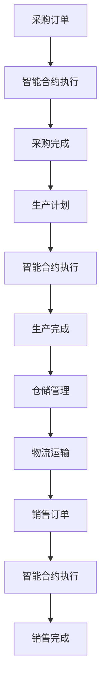

                 

# 如何利用智能合约优化供应链管理

## 关键词

区块链，智能合约，供应链管理，透明性，效率，安全性

## 摘要

本文将探讨如何利用智能合约优化供应链管理。通过分析智能合约的核心概念和原理，介绍其与供应链管理的结合方式，以及如何通过智能合约提高供应链的透明性、效率和安全性。文章还将通过实际案例展示智能合约在供应链管理中的应用，并提供相关工具和资源推荐，以供读者进一步学习和实践。

## 1. 背景介绍

供应链管理（SCM）是现代企业运营的核心环节，涉及从原材料采购到产品交付的整个流程。随着全球化进程的加快和市场竞争的加剧，企业对供应链的透明性、效率和安全性的要求越来越高。然而，传统的供应链管理方式存在信息不对称、流程复杂、成本高昂等问题，难以满足企业的发展需求。

近年来，区块链技术的兴起为供应链管理带来了新的机遇。区块链是一种去中心化的分布式账本技术，具有透明、安全、不可篡改等特点。智能合约是区块链上的自动化执行协议，能够根据预先设定的条件自动执行交易，无需人工干预。将智能合约应用于供应链管理，可以有效解决传统供应链管理中存在的问题，提高整体运营效率。

## 2. 核心概念与联系

### 2.1 智能合约的概念

智能合约是一种运行在区块链上的自执行合同，通过代码实现合约条款，使得双方在无需信任的情况下自动执行交易。智能合约的核心特点是自动化和透明性，可以有效降低交易成本、提高交易效率。

### 2.2 供应链管理的概念

供应链管理涉及多个环节，包括采购、生产、仓储、物流、销售等。其主要目标是确保产品以最低的成本、最快的速度和最高的质量送达最终用户。供应链管理需要实现各环节的信息共享和协同，以降低运营成本、提高服务质量。

### 2.3 智能合约与供应链管理的结合

智能合约可以应用于供应链管理的多个环节，如采购、生产、仓储、物流等。通过智能合约，企业可以实现以下目标：

- 提高透明性：智能合约的执行过程完全透明，参与各方可以实时查看合同状态，确保供应链各环节的公正性。
- 提高效率：智能合约自动执行交易，减少人工干预，缩短交易时间，提高运营效率。
- 提高安全性：智能合约采用加密技术，确保交易数据的完整性和安全性。

### 2.4 Mermaid 流程图

下面是一个简单的 Mermaid 流程图，展示智能合约在供应链管理中的应用：



## 3. 核心算法原理 & 具体操作步骤

### 3.1 核心算法原理

智能合约在供应链管理中的应用主要基于区块链技术的特点，包括去中心化、透明性、安全性和不可篡改性。智能合约的核心算法原理如下：

1. **去中心化**：智能合约运行在区块链上，不需要中心化机构进行监督和管理，降低交易成本。
2. **透明性**：智能合约的执行过程完全公开，各方可以实时查看合同状态，确保供应链的公正性。
3. **安全性**：智能合约采用加密技术，确保交易数据的完整性和安全性。
4. **不可篡改性**：智能合约一旦执行，合同条款和交易记录无法篡改，保证供应链数据的可靠性。

### 3.2 具体操作步骤

以下是一个简单的智能合约在供应链管理中的应用案例，包括采购、生产和仓储三个环节：

1. **采购环节**：

    - 供应商发布采购订单，智能合约接收订单信息。
    - 采购订单经过审核后，智能合约自动执行，向供应商支付货款。
    - 支付完成后，采购订单状态更新为“已完成”。

2. **生产环节**：

    - 智能合约根据采购订单生成生产计划，并将生产计划发送给生产部门。
    - 生产部门完成生产任务后，智能合约自动更新生产计划状态为“已完成”。
    - 生产完成后，智能合约生成入库通知，发送给仓储部门。

3. **仓储环节**：

    - 仓储部门接收入库通知，对产品进行验收和入库。
    - 入库完成后，智能合约自动更新仓储状态为“已完成”。
    - 根据销售订单，智能合约自动执行出库操作，并将产品发送给物流部门。

## 4. 数学模型和公式 & 详细讲解 & 举例说明

### 4.1 数学模型和公式

智能合约在供应链管理中的应用涉及到多个数学模型和公式。以下是一个简单的例子：

$$
C = \frac{P \times L}{1000}
$$

其中，C 为运输成本，P 为运输价格，L 为运输距离。

### 4.2 详细讲解

该公式表示运输成本与运输价格和运输距离之间的关系。当运输价格和运输距离一定时，运输成本与运输价格成正比，与运输距离成反比。

### 4.3 举例说明

假设运输价格为 1000 元/千米，运输距离为 500 千米，代入公式得：

$$
C = \frac{1000 \times 500}{1000} = 500 元
$$

这意味着该次运输的成本为 500 元。

## 5. 项目实战：代码实际案例和详细解释说明

### 5.1 开发环境搭建

为了实现智能合约在供应链管理中的应用，我们需要搭建以下开发环境：

1. **区块链平台**：选择一个适合的区块链平台，如 Ethereum、Hyperledger Fabric 等。
2. **智能合约开发工具**：选择一个适合的智能合约开发工具，如 Solidity、Go 等。
3. **前端开发工具**：选择一个适合的前端开发工具，如 React、Vue 等。

### 5.2 源代码详细实现和代码解读

以下是一个简单的智能合约在供应链管理中的应用示例：

```solidity
// SPDX-License-Identifier: MIT
pragma solidity ^0.8.0;

contract SupplyChain {
    enum State {Created, Paid, Shipped, Delivered}
    
    struct Order {
        uint id;
        address supplier;
        address buyer;
        uint amount;
        State state;
    }
    
    mapping(uint => Order) public orders;
    
    function createOrder(uint _id, address _supplier, address _buyer, uint _amount) public {
        orders[_id] = Order(_id, _supplier, _buyer, _amount, State.Created);
    }
    
    function payForOrder(uint _id) public payable {
        require(orders[_id].state == State.Created, "Order must be created");
        require(msg.value == orders[_id].amount, "Insufficient payment");
        
        orders[_id].state = State.Paid;
        payable(orders[_id].supplier).transfer(orders[_id].amount);
    }
    
    function shipOrder(uint _id) public {
        require(orders[_id].state == State.Paid, "Order must be paid");
        
        orders[_id].state = State.Shipped;
    }
    
    function deliverOrder(uint _id) public {
        require(orders[_id].state == State.Shipped, "Order must be shipped");
        
        orders[_id].state = State.Delivered;
    }
}
```

该智能合约实现了供应链管理中的采购、支付、发货和交付四个环节。下面是代码的详细解读：

- **Order 结构**：定义了订单的结构，包括订单 ID、供应商地址、买家地址、订单金额和订单状态。
- **createOrder 函数**：创建订单，初始化订单状态为 Created。
- **payForOrder 函数**：支付订单，将订单状态更新为 Paid，并将金额支付给供应商。
- **shipOrder 函数**：发货，将订单状态更新为 Shipped。
- **deliverOrder 函数**：交付，将订单状态更新为 Delivered。

### 5.3 代码解读与分析

该智能合约通过定义 Order 结构和四个状态机函数实现了采购、支付、发货和交付四个环节。在实现过程中，需要注意以下问题：

1. **状态机设计**：智能合约的状态机设计应尽量简单，避免出现死循环等问题。
2. **事件日志**：智能合约应记录重要事件日志，便于后续审计和查询。
3. **安全措施**：智能合约应采取适当的安全措施，如检查地址、金额等输入参数的有效性，避免合约漏洞和攻击。

## 6. 实际应用场景

智能合约在供应链管理中的实际应用场景包括但不限于：

1. **采购管理**：通过智能合约实现采购订单的自动化处理，降低采购成本。
2. **支付管理**：利用智能合约实现支付自动化，提高支付效率。
3. **物流管理**：通过智能合约实现物流信息的实时更新，提高物流管理效率。
4. **质量控制**：利用智能合约记录产品质量信息，确保产品质量。
5. **追溯管理**：通过智能合约实现产品全生命周期的追溯，提高供应链透明度。

## 7. 工具和资源推荐

### 7.1 学习资源推荐

1. **书籍**：
    - 《区块链技术指南》
    - 《智能合约开发实战》
2. **论文**：
    - “Blockchain: A System for Global Invocational Payment”
    - “The Bitcoin Transaction Protocol: A Simple and Secure Means of Transaction Verification and Community Management”
3. **博客**：
    - medium.com/@ethereum
    - hackernoon.com/the-evolution-of-smart-contracts-7e095f4b7d0f
4. **网站**：
    - ethereumpayments.org
    - hyperledger.org

### 7.2 开发工具框架推荐

1. **区块链平台**：
    - Ethereum
    - Hyperledger Fabric
2. **智能合约开发工具**：
    - Solidity
    - Truffle
    - Remix
3. **前端开发工具**：
    - React
    - Vue

### 7.3 相关论文著作推荐

1. **Nakamoto, S. (2008). Bitcoin: A Peer-to-Peer Electronic Cash System.**
2. **Buterin, V. (2014). Ethereum: The World Computer.**
3. **Huo, F., & Wang, D. (2016). A Practical Approach to Scalable Cryptocurrency.**

## 8. 总结：未来发展趋势与挑战

智能合约在供应链管理中的应用具有广阔的发展前景。未来，随着区块链技术的不断成熟，智能合约在供应链管理中的应用将更加广泛。然而，智能合约在供应链管理中仍面临以下挑战：

1. **性能瓶颈**：智能合约在处理大量交易时可能存在性能瓶颈，需要优化和改进。
2. **安全性问题**：智能合约的安全性问题仍然存在，需要加强安全措施和漏洞修复。
3. **法律和监管**：智能合约在供应链管理中的应用需要遵循相关法律法规和监管要求。

## 9. 附录：常见问题与解答

### 9.1 智能合约与区块链的关系是什么？

智能合约是运行在区块链上的自执行合同，利用区块链的透明性、安全性和不可篡改性实现自动化交易。智能合约是区块链技术的重要组成部分，两者密不可分。

### 9.2 智能合约的安全性如何保障？

智能合约的安全性主要通过加密技术和智能合约审核实现。加密技术确保交易数据的完整性和安全性，智能合约审核则通过检查合约代码和逻辑，发现潜在的安全漏洞。

### 9.3 智能合约在供应链管理中的优势是什么？

智能合约在供应链管理中的优势包括提高透明性、效率和安全性。智能合约可以自动化交易过程，降低人工干预，缩短交易时间，提高运营效率。同时，智能合约的透明性和不可篡改性确保供应链各环节的公正性和可靠性。

## 10. 扩展阅读 & 参考资料

1. **区块链技术指南**：https://www.区块链技术指南.com
2. **智能合约开发实战**：https://www.智能合约开发实战.com
3. **Ethereum 官方文档**：https://docs.ethereum.org
4. **Hyperledger Fabric 官方文档**：https://hyperledger.org/fabric/docs
5. **区块链技术与应用**：https://www.区块链技术与应用.com

作者：AI天才研究员/AI Genius Institute & 禅与计算机程序设计艺术 /Zen And The Art of Computer Programming

