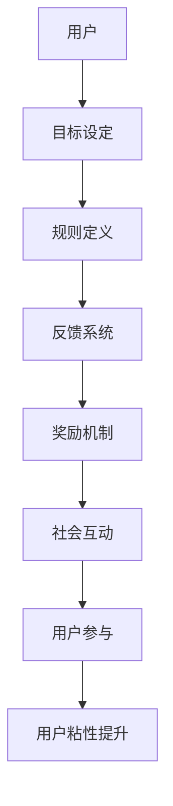

                 

# 如何利用游戏化设计增强用户粘性

> **关键词：** 游戏化设计、用户粘性、动机、奖励机制、用户行为分析

> **摘要：** 本文章将探讨如何通过游戏化设计来增强用户粘性。我们将深入分析游戏化设计的核心概念、原理以及其实际应用，并提供详细的步骤和案例，以帮助开发者更好地理解和应用游戏化设计。

## 1. 背景介绍

在数字化的时代，用户粘性成为了一项关键的成功指标。用户粘性高意味着用户更愿意长时间使用产品或服务，从而带来更多的商业价值。游戏化设计（Gamification）作为一种新兴的设计方法，旨在通过引入游戏元素，如积分、排行榜、奖励等，来激发用户的动机，从而增强用户粘性。

游戏化设计不仅适用于游戏行业，还可以应用于各种非游戏领域，如教育、健康、金融等。通过将游戏机制引入这些领域，开发者可以创造更加吸引人的用户体验，从而提高用户参与度和忠诚度。

### 游戏化设计的起源与发展

游戏化设计的概念最早可以追溯到1970年代，当时心理学家和行为科学家开始研究游戏和激励之间的关系。随着时间的推移，游戏化设计逐渐应用于商业和市场营销领域。

2010年后，随着移动互联网和社交媒体的兴起，游戏化设计得到了更广泛的关注。许多公司开始采用游戏化设计来提高用户参与度和忠诚度，例如，Foursquare引入了积分和排行榜来鼓励用户频繁签到，从而增加了用户粘性。

### 游戏化设计的关键要素

游戏化设计包含多个关键要素，其中最重要的是：

1. **目标（Goals）**：为用户提供明确的目标，这些目标可以是短期或长期的。
2. **规则（Rules）**：定义游戏规则，使玩家了解如何完成任务。
3. **反馈（Feedback）**：提供实时反馈，帮助用户了解自己的进度和成就。
4. **奖励（Rewards）**：给予用户奖励，如积分、徽章、排行榜等，以激励用户。
5. **社会互动（Social）**：鼓励用户之间的互动和竞争，增加游戏的趣味性。

## 2. 核心概念与联系

### 游戏化设计的原理

游戏化设计基于心理学和行为科学原理，尤其是激励理论。激励理论指出，人们受到内在和外在动机的影响，这些动机可以驱动他们的行为。

在游戏化设计中，目标、规则和奖励机制可以激发用户的内在动机，如成就感、自我挑战和社交认同。同时，反馈和社交互动可以增强用户的外在动机，如获得奖励和竞争。

### 游戏化设计的架构

以下是一个简化版的游戏化设计架构，用于说明各个关键要素之间的关系：



### 游戏化设计在不同领域的应用

- **教育领域**：通过积分和徽章来激励学生参与课程和学习活动。
- **健康领域**：通过奖励机制鼓励用户进行体育锻炼和健康监测。
- **金融领域**：通过排行榜和奖励来激励用户参与金融活动，如投资和教育。

## 3. 核心算法原理 & 具体操作步骤

### 奖励机制设计

奖励机制是游戏化设计中的核心，其设计原则包括：

1. **及时反馈**：奖励应与用户行为紧密相关，并在用户完成任务后立即提供。
2. **适当性**：奖励应与用户的目标和需求相匹配。
3. **多样性**：提供多种类型的奖励，以满足不同用户的偏好。
4. **公平性**：确保奖励分配的公平性，以防止玩家产生负面情绪。

具体操作步骤如下：

1. **确定奖励类型**：根据产品目标，选择合适的奖励类型，如积分、徽章、虚拟货币等。
2. **设置奖励条件**：定义用户获得奖励的具体条件，如完成特定任务或达到一定积分。
3. **设计奖励流程**：制定奖励的发放规则，确保奖励的公平性和及时性。
4. **测试与优化**：通过用户反馈和数据分析，不断优化奖励机制。

### 用户行为分析

用户行为分析是游戏化设计中的重要环节，通过分析用户行为，开发者可以了解用户的喜好和动机，从而更好地设计游戏化元素。

具体操作步骤如下：

1. **数据收集**：收集用户行为数据，如点击率、完成任务的时间、使用的功能等。
2. **数据分析**：使用统计方法和机器学习技术分析用户行为数据，提取有价值的信息。
3. **用户画像**：根据数据分析结果，创建用户画像，了解用户的特点和需求。
4. **优化设计**：根据用户画像，调整游戏化设计元素，提高用户参与度和满意度。

### 动机模型设计

动机模型是游戏化设计中的核心，它用于激发用户的内在和外在动机。

具体操作步骤如下：

1. **确定用户动机**：通过问卷调查、访谈等方法了解用户的动机。
2. **构建动机模型**：根据用户动机，构建动机模型，如成就动机、社交动机等。
3. **设计激励策略**：根据动机模型，设计不同的激励策略，如成就奖励、社交互动等。
4. **测试与优化**：通过用户反馈和数据分析，不断优化激励策略。

## 4. 数学模型和公式 & 详细讲解 & 举例说明

### 用户参与度模型

用户参与度是衡量游戏化设计效果的重要指标，以下是一个简单的用户参与度模型：

\[ \text{User Engagement} = f(\text{Goal Achievement}, \text{Feedback}, \text{Reward}) \]

其中，\( f \) 是一个函数，表示用户参与度与目标实现、反馈和奖励之间的关系。

### 成就动机模型

成就动机是指用户在完成任务后获得的成就感。以下是一个简单的成就动机模型：

\[ \text{Motivation} = f(\text{Achievement Level}, \text{Challenge Level}) \]

其中，\( f \) 是一个函数，表示动机与成就水平和挑战水平之间的关系。

### 举例说明

假设一个在线学习平台，通过游戏化设计来提高用户参与度。平台设定了以下奖励机制：

- 完成课程任务获得积分。
- 积分达到一定数量可以获得徽章。
- 徽章可以用于解锁高级课程和功能。

根据用户参与度模型，我们可以预测用户的参与度与积分、徽章和课程解锁之间的关系。

### 数学模型的应用

通过数学模型，我们可以量化用户参与度和动机，从而更好地优化游戏化设计。例如，我们可以使用回归分析方法，分析不同奖励机制对用户参与度的影响，从而找到最佳的设计方案。

## 5. 项目实战：代码实际案例和详细解释说明

### 5.1 开发环境搭建

为了演示游戏化设计，我们将使用一个简单的在线平台，该平台将使用Python和Flask框架进行开发。以下是在开发环境中的步骤：

1. 安装Python 3.x版本。
2. 安装Flask框架：`pip install flask`
3. 创建一个新的Flask项目。

### 5.2 源代码详细实现和代码解读

下面是一个简单的游戏化设计案例，该案例使用积分和徽章来激励用户。

```python
from flask import Flask, render_template, request, session

app = Flask(__name__)
app.secret_key = 'your_secret_key'

# 用户积分和徽章
session['score'] = 0
session['badges'] = []

@app.route('/')
def home():
    return render_template('home.html')

@app.route('/task', methods=['GET', 'POST'])
def task():
    if request.method == 'POST':
        # 用户完成任务
        session['score'] += 10
        # 检查积分是否达到徽章条件
        if session['score'] >= 100:
            session['badges'].append('Bronze')
        elif session['score'] >= 200:
            session['badges'].append('Silver')
        elif session['score'] >= 300:
            session['badges'].append('Gold')
    return render_template('task.html', score=session['score'], badges=session['badges'])

if __name__ == '__main__':
    app.run(debug=True)
```

### 5.3 代码解读与分析

在这个案例中，我们使用Flask框架创建了一个简单的Web应用，用户可以通过完成任务来获得积分和徽章。

1. **用户积分和徽章**：我们使用会话（Session）来存储用户的积分和徽章，这样可以确保用户在不同的请求之间保持状态。

2. **主页**：主页显示了用户的当前积分和徽章。

3. **任务页面**：任务页面允许用户完成任务，每完成一个任务，用户的积分会增加10点。同时，我们检查积分是否达到徽章条件，并根据条件颁发相应的徽章。

4. **代码解析**：`app.route('/')` 定义了主页的路由，`app.route('/task', methods=['GET', 'POST'])` 定义了任务页面的路由。在任务页面，我们使用`request.method == 'POST'` 来判断用户是否提交了任务。如果用户提交了任务，我们增加积分并检查徽章条件。

通过这个案例，我们可以看到如何使用游戏化设计来激励用户，并提高用户粘性。

## 6. 实际应用场景

游戏化设计可以应用于各种实际场景，以下是一些常见应用：

1. **在线教育**：通过游戏化设计，鼓励学生积极参与课程和学习活动，提高学习效果。
2. **健康管理**：通过奖励机制，鼓励用户进行体育锻炼和健康监测，提高健康水平。
3. **金融理财**：通过游戏化设计，鼓励用户参与投资、学习和金融活动，提高用户忠诚度。
4. **企业内部管理**：通过游戏化设计，激励员工参与工作、培训和团队活动，提高工作效率和团队凝聚力。

## 7. 工具和资源推荐

### 7.1 学习资源推荐

- **书籍**：
  - 《游戏化革命》（"Gamification Revolution"） - Gabe Zichermann
  - 《游戏化设计实战》（"Designing for Digital Engagement"） - Greg Stewart

- **论文**：
  - "Gamification in Education: A Systematic Review and Meta-Analysis of Empirical Studies" - Fan et al.
  - "The Role of Rewards in Gamification" - C. B. van Dijk

- **博客**：
  - [Gabe Zichermann's Blog](https://gabriel.zichermann.com/)
  - [Neil McFarland's Blog](https://www.neil.mcfarland.uk/)

### 7.2 开发工具框架推荐

- **游戏化平台**：
  - [Kahoot](https://www.kahoot.com/)
  - [Prodigy](https://www.prodigygame.com/)

- **开发框架**：
  - [Flask](https://flask.palletsprojects.com/)
  - [Django](https://www.djangoproject.com/)

### 7.3 相关论文著作推荐

- "Gamification in Education: A Systematic Review and Meta-Analysis of Empirical Studies" - Fan et al.
- "The Role of Rewards in Gamification" - C. B. van Dijk
- "Gamification at Work: Designing Engaging Business Software" - Yu-kai Chou

## 8. 总结：未来发展趋势与挑战

游戏化设计作为一种新兴的设计方法，在未来将继续发展并应用于更多领域。随着人工智能和大数据技术的发展，游戏化设计将更加精准和个性化，从而更好地满足用户需求。

然而，游戏化设计也面临一些挑战，如过度游戏化可能导致用户疲劳，奖励机制设计不当可能导致用户产生负面情绪。因此，开发者需要在设计游戏化元素时，充分考虑用户的心理和行为特点，确保游戏化设计的有效性和可持续性。

## 9. 附录：常见问题与解答

### Q：游戏化设计是否适用于所有产品？

A：游戏化设计并不是适用于所有产品，但其适用性越来越广泛。在考虑应用游戏化设计时，关键是要确定产品是否需要提高用户参与度和粘性。如果这些目标是产品的核心，那么游戏化设计可能是一个有效的选择。

### Q：如何设计有效的奖励机制？

A：设计有效的奖励机制需要考虑以下因素：
- **目标匹配**：奖励应与用户目标相匹配。
- **及时反馈**：奖励应在用户完成任务后立即提供。
- **适当性**：奖励应适当，既能激励用户，又不会产生过度依赖。
- **多样性**：提供多种类型的奖励，以满足不同用户的偏好。

### Q：游戏化设计是否会导致用户疲劳？

A：是的，过度游戏化可能会导致用户疲劳。为了防止这种情况，开发者需要：
- **控制游戏化程度**：不要过度游戏化，确保游戏化元素与产品目标相匹配。
- **多样化奖励**：提供多种类型的奖励，以保持用户的兴趣。
- **定期更新**：定期更新游戏化元素，以保持新鲜感。

## 10. 扩展阅读 & 参考资料

- "Gamification in Education: A Systematic Review and Meta-Analysis of Empirical Studies" - Fan et al.
- "The Role of Rewards in Gamification" - C. B. van Dijk
- "Gamification at Work: Designing Engaging Business Software" - Yu-kai Chou
- [Gabe Zichermann's Blog](https://gabriel.zichermann.com/)
- [Neil McFarland's Blog](https://www.neil.mcfarland.uk/)

### 作者

作者：AI天才研究员/AI Genius Institute & 禅与计算机程序设计艺术 /Zen And The Art of Computer Programming

