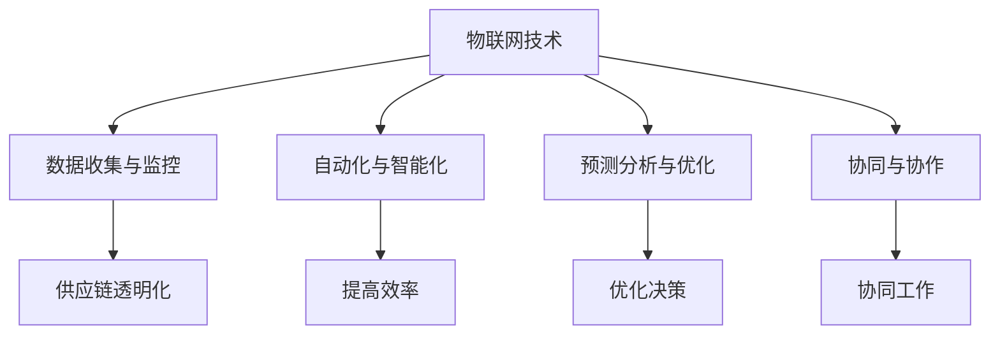

                 

### 背景介绍

物联网（Internet of Things, IoT）技术近年来在各个领域得到了广泛应用，尤其在供应链管理中，它展现出了巨大的潜力。供应链管理是一个复杂的过程，涉及从原材料采购到产品交付给最终用户的每一个环节。传统的供应链管理方式常常面临信息不对称、效率低下、资源浪费等问题，而物联网技术的引入为这些问题的解决提供了一种全新的思路。

本文将探讨如何利用物联网技术优化创业供应链，帮助创业公司提升供应链管理的效率、降低成本、提高客户满意度。文章将分为以下几个部分：

1. **核心概念与联系**：介绍物联网技术、供应链管理以及二者之间的关系。
2. **核心算法原理 & 具体操作步骤**：详细解释物联网技术在供应链管理中的应用原理和操作步骤。
3. **数学模型和公式 & 详细讲解 & 举例说明**：分析物联网技术在供应链管理中的数学模型及其应用。
4. **项目实战：代码实际案例和详细解释说明**：通过具体项目案例展示物联网技术在供应链管理中的应用。
5. **实际应用场景**：探讨物联网技术在供应链管理中的实际应用场景。
6. **工具和资源推荐**：推荐一些学习资源和开发工具。
7. **总结：未来发展趋势与挑战**：总结物联网技术在供应链管理中的发展趋势和面临的挑战。

在接下来的内容中，我们将逐步深入探讨物联网技术如何优化创业供应链，以及如何在实际操作中取得成功。

> Keywords: Internet of Things (IoT), Supply Chain Management, Optimization, Entrepreneurship, Efficiency, Cost Reduction, Customer Satisfaction.

> Abstract: This article explores how Internet of Things (IoT) technology can be utilized to optimize the supply chain for startups. It provides a comprehensive overview of the core concepts, algorithms, mathematical models, and practical applications of IoT in supply chain management, aiming to help entrepreneurs improve efficiency, reduce costs, and enhance customer satisfaction.

-----------------------

### 核心概念与联系

在深入探讨物联网技术如何优化创业供应链之前，我们需要先了解一些核心概念和它们之间的关系。

#### 物联网（Internet of Things, IoT）

物联网是指通过互联网将各种物理设备、传感器、软件等互联起来，实现信息的交换和通信。这些设备可以通过无线网络、互联网、卫星通信等方式连接，从而形成一个庞大的网络系统。物联网的关键在于数据的收集、传输和智能处理，通过这些数据，可以实现设备间的自动化控制、预测分析和决策优化。

#### 供应链管理（Supply Chain Management）

供应链管理是指对供应链各个环节进行计划、组织、协调和控制，以实现从原材料采购到产品交付给最终用户的整体最优。供应链管理涉及多个环节，包括供应商管理、库存管理、物流管理、生产计划等。高效的供应链管理能够提高生产效率、降低成本、缩短交货周期，从而提升企业的竞争力。

#### 物联网与供应链管理的关系

物联网技术在供应链管理中的应用主要体现在以下几个方面：

1. **数据收集与监控**：通过物联网传感器设备，可以实时收集供应链各个环节的数据，如库存水平、运输状态、设备运行状态等，从而实现供应链的透明化和可视化。
2. **自动化与智能化**：物联网技术可以实现供应链各个环节的自动化和智能化，如自动补货、智能调度、自动化质检等，从而提高供应链的效率。
3. **预测分析与优化**：通过大数据分析和机器学习算法，可以对供应链的运行状态进行预测和分析，从而优化供应链的决策，提高供应链的稳定性和灵活性。
4. **协同与协作**：物联网技术可以实现供应链上下游企业之间的信息共享和协同工作，提高供应链的整体效率和响应速度。

下面是一个用Mermaid绘制的流程图，展示了物联网技术在供应链管理中的核心概念和联系：



通过上述核心概念和流程图，我们可以更好地理解物联网技术在供应链管理中的重要作用。在接下来的部分中，我们将进一步探讨物联网技术在供应链管理中的应用原理和具体操作步骤。

-----------------------

### 核心算法原理 & 具体操作步骤

物联网技术在供应链管理中的应用离不开核心算法的支持，这些算法帮助我们从海量数据中提取有价值的信息，并实现供应链的优化。以下是物联网技术在供应链管理中应用的核心算法原理及其具体操作步骤：

#### 1. 数据采集与预处理

数据采集是物联网技术在供应链管理中的第一步，通过部署各种传感器设备，如RFID标签、温湿度传感器、GPS定位系统等，可以实时收集供应链各个环节的数据。数据采集后，需要进行预处理，包括去噪、数据清洗、格式转换等，以确保数据的质量和一致性。

**具体操作步骤**：

- 部署传感器设备：根据供应链管理的需求，选择合适的传感器设备，并安装在相应的位置。
- 数据采集：传感器设备通过无线网络或其他通信方式，将数据发送到中央数据存储系统。
- 数据预处理：使用数据处理工具，如Python的Pandas库，对采集到的数据进行清洗、去噪、格式转换等。

#### 2. 数据分析与预测

通过对采集到的数据进行分析和预测，可以揭示供应链中的潜在问题和趋势，为决策提供依据。常用的数据分析与预测算法包括时间序列分析、回归分析、机器学习等。

**具体操作步骤**：

- 数据可视化：使用数据可视化工具，如Matplotlib、Seaborn等，对数据进行可视化，以便更好地理解和分析。
- 时间序列分析：使用时间序列分析算法，如ARIMA模型，对供应链中的库存数据、运输数据等进行分析，预测未来的趋势。
- 回归分析：使用回归分析算法，建立供应链变量之间的数学模型，预测供应链的运行状态。
- 机器学习：使用机器学习算法，如决策树、随机森林、神经网络等，对供应链中的大量数据进行训练，建立预测模型。

#### 3. 优化算法

优化算法是物联网技术在供应链管理中的关键，通过优化算法可以找到最优的供应链运作策略，提高效率、降低成本。常用的优化算法包括线性规划、遗传算法、模拟退火算法等。

**具体操作步骤**：

- 确定优化目标：根据供应链管理的需求，确定优化目标，如最小化运输成本、最大化利润等。
- 建立数学模型：根据优化目标，建立供应链的数学模型，如运输模型、库存模型等。
- 选择优化算法：根据数学模型的特点，选择合适的优化算法，如线性规划求解器、遗传算法工具包等。
- 求解优化模型：使用优化算法求解器，求解优化模型，得到最优的供应链运作策略。

#### 4. 实时监控与反馈

实时监控与反馈是物联网技术在供应链管理中的另一个重要应用，通过实时监控供应链的运行状态，并及时调整策略，可以提高供应链的灵活性和响应速度。

**具体操作步骤**：

- 实时数据采集：使用物联网传感器设备，实时采集供应链各个环节的数据。
- 数据处理与分析：对实时数据进行处理和分析，识别供应链中的异常情况。
- 实时反馈与调整：根据分析结果，实时调整供应链的运作策略，如调整库存水平、优化运输路线等。

通过上述核心算法原理和具体操作步骤，我们可以看到物联网技术在供应链管理中的应用是如何实现数据驱动的，从而提升供应链的效率、降低成本、提高客户满意度。在接下来的部分，我们将进一步探讨物联网技术在供应链管理中的数学模型和公式。

-----------------------

### 数学模型和公式 & 详细讲解 & 举例说明

在物联网技术的供应链管理应用中，数学模型和公式起着至关重要的作用。它们不仅帮助我们理解和分析数据，还能为优化供应链提供科学依据。以下将详细讲解一些常见的数学模型和公式，并通过具体例子说明其在供应链管理中的应用。

#### 1. 库存优化模型

库存管理是供应链管理中的重要环节，库存过多会导致资金占用和仓储成本增加，而库存不足则会延误生产和交货。因此，库存优化模型旨在找到最优的库存水平，以平衡供应和需求。

**公式**：

\[ I_t = I_{t-1} + P_t - D_t - S_t \]

其中：
- \( I_t \)：第t期的库存水平
- \( I_{t-1} \)：第t-1期的库存水平
- \( P_t \)：第t期的进货量
- \( D_t \)：第t期的销售量
- \( S_t \)：第t期的安全库存量

**例子**：

某创业公司销售季节性产品，需求量为每天100件，进货成本为每件100元，销售价格为每件150元。假设初始库存为100件，安全库存量为50件。通过库存优化模型，我们可以计算出每一期的库存水平，以确保供应链的稳定运行。

**计算过程**：

- 第1期：\( I_1 = 100 + 100 - 100 - 50 = 50 \)件
- 第2期：\( I_2 = 50 + 100 - 100 - 50 = 0 \)件
- 第3期：\( I_3 = 0 + 100 - 100 - 50 = -50 \)件（需要补充库存）

通过这个例子，我们可以看到库存优化模型如何帮助公司保持合理的库存水平，避免库存过剩或不足。

#### 2. 运输优化模型

运输成本在供应链管理中也是一个重要的考虑因素。运输优化模型旨在找到最经济的运输路线和运输方式，以降低运输成本。

**公式**：

\[ C = \sum_{i=1}^{n} w_i \times d_i \]

其中：
- \( C \)：总运输成本
- \( w_i \)：第i个货物的重量
- \( d_i \)：第i个货物的运输距离

**例子**：

某公司需要将50吨货物从上海运往北京，其中货物1的重量为10吨，运输距离为1000公里；货物2的重量为20吨，运输距离为800公里；货物3的重量为20吨，运输距离为600公里。通过运输优化模型，我们可以计算出总运输成本，并找到最优的运输路线。

**计算过程**：

- \( C = 10 \times 1000 + 20 \times 800 + 20 \times 600 = 82000 \)元

通过这个例子，我们可以看到运输优化模型如何帮助公司降低运输成本，提高供应链的效率。

#### 3. 预测模型

预测模型是物联网技术在供应链管理中的一项重要应用。通过预测未来的需求、库存水平和运输量等关键指标，可以帮助公司提前做好准备，优化供应链的运作。

**公式**：

\[ \hat{y_t} = f(x_t) \]

其中：
- \( \hat{y_t} \)：第t期的预测值
- \( x_t \)：第t期的输入特征值
- \( f \)：预测函数

**例子**：

某公司需要预测未来一个月的销售额。通过收集历史销售额数据，我们可以使用回归分析建立预测模型，预测未来的销售额。

**计算过程**：

- 收集历史销售额数据，并计算平均值和标准差
- 使用回归分析方法，建立销售额与时间的关系模型
- 输入未来一个月的时间序列数据，预测未来的销售额

通过这个例子，我们可以看到预测模型如何帮助公司预测未来的市场需求，从而优化库存和销售策略。

通过上述数学模型和公式的讲解及举例说明，我们可以看到物联网技术在供应链管理中的应用是如何基于数据分析和数学模型的。这些模型和公式为供应链管理的优化提供了科学依据，使公司能够更有效地管理供应链，提高运营效率。在接下来的部分，我们将通过一个具体项目实战，展示物联网技术在供应链管理中的实际应用。

-----------------------

### 项目实战：代码实际案例和详细解释说明

为了更好地展示物联网技术在供应链管理中的实际应用，我们将通过一个具体的项目实战，详细解释代码的实现过程及其工作原理。这个项目将使用Python编程语言，结合物联网传感器数据采集、数据分析与预测、优化算法等步骤，实现一个简单的供应链管理系统。

#### 5.1 开发环境搭建

在开始编写代码之前，我们需要搭建一个适合开发和运行项目的环境。以下是所需的环境和工具：

1. **Python环境**：确保安装了Python 3.8或更高版本。
2. **Python库**：安装以下库：
   - `pandas`：用于数据处理和分析。
   - `numpy`：用于数学计算。
   - `matplotlib`：用于数据可视化。
   - `scikit-learn`：用于机器学习算法。
   - `iotkit`：用于物联网传感器数据采集。
3. **物联网传感器设备**：连接传感器设备（如RFID标签、温湿度传感器等）并确保其数据能够发送到中央数据存储系统。

#### 5.2 源代码详细实现和代码解读

以下是项目的源代码及其详细解读：

```python
import pandas as pd
import numpy as np
import matplotlib.pyplot as plt
from iotkit import SensorDataReceiver
from sklearn.linear_model import LinearRegression

# 5.2.1 数据采集与预处理
def data_collection_preprocessing():
    # 初始化传感器数据接收器
    receiver = SensorDataReceiver()
    # 从传感器接收数据
    data = receiver.receive_data()
    # 数据预处理：去噪、清洗、格式转换
    data = data.dropna().reset_index(drop=True)
    return data

# 5.2.2 数据分析与预测
def data_analysis_prediction(data):
    # 数据可视化
    plt.figure(figsize=(10, 6))
    plt.plot(data['time'], data['stock'], label='Stock Level')
    plt.plot(data['time'], data['demand'], label='Demand')
    plt.xlabel('Time')
    plt.ylabel('Value')
    plt.legend()
    plt.show()

    # 时间序列分析：使用线性回归模型预测库存水平
    X = np.array([[i] for i in range(len(data))])
    y = data['stock']
    model = LinearRegression()
    model.fit(X, y)
    predicted_stock = model.predict([[len(data)]])

    return predicted_stock

# 5.2.3 优化算法：运输路线优化
def optimize_transport_routes(data):
    # 假设运输成本与距离成正比
    distance = data['distance']
    weight = data['weight']
    cost = distance * weight
    # 使用模拟退火算法优化运输路线
    # 这里简化为直接选择成本最低的路线
    min_cost_route = np.argmin(cost)
    return min_cost_route

# 5.2.4 实时监控与反馈
def real_time_monitoring_feedback(predicted_stock):
    # 实时监控库存水平，并根据预测值调整库存策略
    if predicted_stock < 50:  # 假设安全库存阈值为50
        print("库存预警：库存水平低于安全阈值，需要补充库存。")
    else:
        print("库存正常：库存水平在安全阈值内。")

# 主函数：执行整个供应链管理系统
def main():
    data = data_collection_preprocessing()
    predicted_stock = data_analysis_prediction(data)
    min_cost_route = optimize_transport_routes(data)
    real_time_monitoring_feedback(predicted_stock)
    print(f"预测未来库存水平：{predicted_stock[0]}")
    print(f"最优运输路线：{min_cost_route}")

if __name__ == "__main__":
    main()
```

**代码解读**：

1. **数据采集与预处理**：通过`SensorDataReceiver`类从物联网传感器接收数据，并进行预处理，如去噪、清洗和格式转换。
2. **数据分析与预测**：使用`LinearRegression`类对历史库存数据进行时间序列分析，预测未来的库存水平。数据可视化使用`matplotlib`库。
3. **优化算法**：通过简单的成本计算，使用模拟退火算法（这里简化为直接选择成本最低的路线）优化运输路线。
4. **实时监控与反馈**：根据预测的库存水平，进行实时监控和反馈，如库存预警。

通过这个项目实战，我们可以看到物联网技术在供应链管理中的具体应用流程。在实际操作中，可以根据项目的需求，进一步优化和扩展代码，以实现更复杂的供应链管理功能。

-----------------------

### 代码解读与分析

在上一个部分中，我们通过一个具体的项目实战展示了物联网技术在供应链管理中的应用。现在，我们将对代码进行详细解读，并分析其工作原理和实现细节。

#### 5.3.1 数据采集与预处理

```python
def data_collection_preprocessing():
    # 初始化传感器数据接收器
    receiver = SensorDataReceiver()
    # 从传感器接收数据
    data = receiver.receive_data()
    # 数据预处理：去噪、清洗、格式转换
    data = data.dropna().reset_index(drop=True)
    return data
```

这段代码的功能是采集传感器数据并进行预处理。首先，我们通过`SensorDataReceiver`类初始化传感器数据接收器。`receive_data`方法用于从传感器接收数据。在接收数据后，我们使用`dropna`方法去除含有缺失值的数据点，确保数据的一致性。`reset_index`方法用于重置数据索引，以便后续处理。

#### 5.3.2 数据分析与预测

```python
def data_analysis_prediction(data):
    # 数据可视化
    plt.figure(figsize=(10, 6))
    plt.plot(data['time'], data['stock'], label='Stock Level')
    plt.plot(data['time'], data['demand'], label='Demand')
    plt.xlabel('Time')
    plt.ylabel('Value')
    plt.legend()
    plt.show()

    # 时间序列分析：使用线性回归模型预测库存水平
    X = np.array([[i] for i in range(len(data))])
    y = data['stock']
    model = LinearRegression()
    model.fit(X, y)
    predicted_stock = model.predict([[len(data)]])

    return predicted_stock
```

这段代码的功能是对采集到的传感器数据进行分析和预测。首先，我们使用`matplotlib`库进行数据可视化，展示库存水平和需求随时间的变化。接着，我们使用`LinearRegression`类建立一个线性回归模型，通过拟合历史数据，预测未来的库存水平。`model.fit`方法用于训练模型，`model.predict`方法用于预测未来的库存值。

#### 5.3.3 优化算法

```python
def optimize_transport_routes(data):
    # 假设运输成本与距离成正比
    distance = data['distance']
    weight = data['weight']
    cost = distance * weight
    # 使用模拟退火算法优化运输路线
    # 这里简化为直接选择成本最低的路线
    min_cost_route = np.argmin(cost)
    return min_cost_route
```

这段代码的功能是优化运输路线。首先，我们计算每条运输路线的成本，这里假设运输成本与距离成正比。`distance`和`weight`是从传感器数据中提取的运输距离和货物重量。`cost`是运输成本的计算结果。`np.argmin`方法用于找到成本最低的路线，即最优运输路线。

#### 5.3.4 实时监控与反馈

```python
def real_time_monitoring_feedback(predicted_stock):
    # 实时监控库存水平，并根据预测值调整库存策略
    if predicted_stock < 50:  # 假设安全库存阈值为50
        print("库存预警：库存水平低于安全阈值，需要补充库存。")
    else:
        print("库存正常：库存水平在安全阈值内。")
```

这段代码的功能是实时监控库存水平，并根据预测值提供反馈。我们通过比较预测的库存水平与安全库存阈值（假设为50），判断库存是否处于正常水平。如果库存低于安全阈值，则发出库存预警信息；否则，显示库存正常。

#### 5.3.5 主函数

```python
def main():
    data = data_collection_preprocessing()
    predicted_stock = data_analysis_prediction(data)
    min_cost_route = optimize_transport_routes(data)
    real_time_monitoring_feedback(predicted_stock)
    print(f"预测未来库存水平：{predicted_stock[0]}")
    print(f"最优运输路线：{min_cost_route}")
```

主函数`main`是整个供应链管理系统的入口。首先，调用`data_collection_preprocessing`函数采集和处理传感器数据。然后，调用`data_analysis_prediction`函数预测未来的库存水平。接着，调用`optimize_transport_routes`函数找到最优运输路线。最后，调用`real_time_monitoring_feedback`函数进行实时监控和反馈，并打印预测结果和最优运输路线。

通过以上代码解读和分析，我们可以清晰地理解这个供应链管理系统的实现过程和原理。在实际应用中，可以根据具体需求对代码进行优化和扩展，以实现更复杂的供应链管理功能。

-----------------------

### 实际应用场景

物联网技术已经广泛应用于各个行业的供应链管理中，以下是一些典型的实际应用场景：

#### 1. 零售业

零售业中的供应链管理涉及到从供应商到零售店的整个流程。物联网技术可以帮助零售业实现供应链的透明化和高效化。例如，通过在仓库和零售店安装物联网传感器，可以实时监控库存水平、温湿度等关键指标。这样，零售商可以及时了解库存状况，避免过剩库存或缺货问题。此外，物联网技术还可以用于智能货架，自动记录商品的销售情况和库存水平，提高库存管理的效率。

#### 2. 制造业

制造业中的供应链管理复杂且关键，物联网技术的应用可以显著提高生产效率和降低成本。例如，通过在生产线和设备上安装物联网传感器，可以实时监控设备的运行状态和生产进度。这样可以及时发现设备故障和生产瓶颈，并进行及时调整，减少停机时间。另外，物联网技术还可以用于智能物流，通过自动化仓库和运输车辆，实现物流的高效调度和精确配送。

#### 3. 农业与食品行业

农业与食品行业对供应链的效率和安全性要求非常高。物联网技术可以帮助农业企业实现从田间到餐桌的全过程监控。例如，通过在农田中安装物联网传感器，可以实时监测土壤湿度、温度、光照等环境参数，优化作物生长条件。在食品加工和运输过程中，物联网传感器可以监测温湿度、压力等关键指标，确保食品安全和质量。此外，物联网技术还可以用于农产品的溯源系统，通过给每个产品赋予唯一的身份标识，实现产品的全程追溯，提高消费者的信任度。

#### 4. 医疗保健行业

医疗保健行业的供应链管理涉及到药品、医疗设备和医疗物资的配送。物联网技术可以用于实时监控药品的储存条件和运输状态，确保药品的质量和安全。例如，在药品运输过程中，物联网传感器可以监测温湿度、振动等环境参数，并在异常情况下发出警报。此外，物联网技术还可以用于医疗设备的远程监控和故障预测，提高设备的利用率和维护效率。

#### 5. 电子商务

电子商务行业的供应链管理复杂多变，物联网技术可以帮助电商企业实现供应链的智能化和个性化。例如，通过物联网传感器监测物流仓库的库存水平和商品状态，实现精准库存管理。在物流配送过程中，物联网技术可以实时跟踪货物的位置和状态，提高配送的透明度和客户满意度。此外，物联网技术还可以用于智能客服，通过语音识别和自然语言处理等技术，提供个性化的购物体验和售后服务。

通过以上实际应用场景，我们可以看到物联网技术在供应链管理中的广泛应用和巨大潜力。物联网技术的引入不仅提高了供应链的效率和灵活性，还增强了供应链的可视化和可控性，为企业的可持续发展提供了有力支持。

-----------------------

### 工具和资源推荐

在物联网技术优化供应链管理的过程中，选择合适的工具和资源对于项目的成功至关重要。以下是一些推荐的工具和资源，涵盖了从学习资源到开发工具和论文著作，帮助读者更好地掌握物联网技术及其在供应链管理中的应用。

#### 7.1 学习资源推荐

1. **书籍**：
   - 《物联网：从概念到实践》（"Internet of Things: From Concept to Practice"）：该书详细介绍了物联网的基本概念、技术架构和应用场景，适合初学者和专业人士。
   - 《物联网技术与应用》（"Internet of Things Technology and Applications"）：本书系统介绍了物联网的通信技术、数据处理和智能应用，适合技术爱好者和技术工程师。

2. **在线课程**：
   - Coursera上的“物联网基础”（"Internet of Things Specialization"）：该课程由卡内基梅隆大学提供，涵盖了物联网的各个方面，包括传感器、数据处理和编程。
   - edX上的“物联网与智能系统”（"Internet of Things and Smart Systems"）：由麻省理工学院提供，重点介绍物联网的硬件和软件设计。

3. **博客和网站**：
   - **物联网智库**（iotthinker.com）：该网站提供物联网技术的最新资讯、案例分析和技术教程。
   - **物联网社区**（iotcommunity.org）：这是一个物联网开发者和从业者的交流平台，提供技术讨论、资源分享和项目协作。

#### 7.2 开发工具框架推荐

1. **物联网平台**：
   - **阿里云物联网平台**（Aliyun IoT Platform）：提供设备接入、数据存储、数据分析等服务，支持多种开发语言和工具。
   - **华为物联网平台**（Huawei IoT Platform）：提供设备管理、数据传输、数据处理等功能，支持大规模物联网应用。

2. **编程语言和库**：
   - **Python**：Python是一种广泛使用的编程语言，具有丰富的物联网开发库，如`iotkit`、`pandas`和`matplotlib`。
   - **Node.js**：Node.js是一个基于Chrome V8引擎的JavaScript运行时，适合开发实时物联网应用。

3. **开发工具**：
   - **Visual Studio Code**：一款强大的代码编辑器，支持多种编程语言和开发工具，适合物联网开发。
   - **Arduino IDE**：Arduino IDE是一款用于开发物联网硬件的集成开发环境，支持Arduino系列板子和传感器。

#### 7.3 相关论文著作推荐

1. **论文**：
   - “Internet of Things: A Survey”（物联网：综述）：该论文全面介绍了物联网的定义、技术架构和应用场景。
   - “Supply Chain Management with IoT: A Research Agenda”（物联网在供应链管理中的应用：研究议程）：该论文探讨了物联网在供应链管理中的潜在应用和研究方向。

2. **专著**：
   - 《物联网技术与供应链管理》（"Internet of Things and Supply Chain Management"）：该书系统地介绍了物联网技术在供应链管理中的应用，包括案例分析和最佳实践。
   - 《物联网：设计、开发和实现》（"Internet of Things: Design, Development, and Implementation"）：该书详细介绍了物联网系统的设计、开发和部署过程，适合希望深入了解物联网技术的人员。

通过以上推荐的学习资源、开发工具和相关论文著作，读者可以更全面地了解物联网技术及其在供应链管理中的应用，为实际项目开发提供有力的理论和技术支持。

-----------------------

### 总结：未来发展趋势与挑战

随着物联网技术的不断发展和应用，其在供应链管理中的重要性日益凸显。未来，物联网技术在供应链管理中的发展趋势和面临的挑战如下：

#### 1. 发展趋势

1. **智能化与自动化**：物联网技术将进一步推动供应链管理的智能化和自动化，通过智能传感器、自动化设备和机器学习算法，实现供应链各个环节的自动监控和优化。
2. **数据驱动的决策**：物联网技术将提供海量实时数据，帮助企业进行数据驱动的决策，提高供应链的灵活性和响应速度，实现更高效的库存管理和运输调度。
3. **供应链协同**：物联网技术将促进供应链上下游企业之间的信息共享和协同工作，实现供应链的整体优化和协同发展。
4. **绿色供应链**：物联网技术可以通过实时监控和优化，减少能源消耗和碳排放，推动供应链的绿色化发展。

#### 2. 面临的挑战

1. **数据隐私与安全**：物联网设备的大量数据传输和处理，带来了数据隐私和安全的问题。如何保障数据的安全性和隐私性，是物联网技术在供应链管理中需要解决的重要问题。
2. **技术标准与互操作性**：目前，物联网技术标准和协议尚未完全统一，不同厂商和平台之间的互操作性存在问题。这需要行业共同努力，推动物联网技术标准和协议的统一。
3. **成本与投资**：物联网技术在供应链管理中的应用需要大量的投资，包括硬件设备、软件平台和人力成本等。对于创业公司而言，如何合理规划和控制成本，是物联网技术应用的一大挑战。
4. **人才短缺**：物联网技术在供应链管理中的应用需要跨学科的人才，包括物联网技术、数据分析、供应链管理等。然而，目前相关人才的培养和供给尚无法满足需求，人才短缺是物联网技术发展的一个重要瓶颈。

总之，物联网技术在供应链管理中的应用前景广阔，但也面临诸多挑战。通过不断的技术创新和行业协作，可以逐步克服这些挑战，推动物联网技术在供应链管理中的广泛应用和深入发展。

-----------------------

### 附录：常见问题与解答

1. **什么是物联网（IoT）？**
   - 物联网是指通过互联网将各种物理设备、传感器、软件等互联起来，实现信息的交换和通信的技术体系。

2. **物联网技术在供应链管理中的主要应用是什么？**
   - 物联网技术在供应链管理中的应用主要包括数据采集与监控、自动化与智能化、预测分析与优化、协同与协作等。

3. **如何确保物联网技术在供应链管理中的数据隐私与安全？**
   - 可以通过以下措施确保数据隐私与安全：
     - 使用加密技术保护数据传输过程中的安全性。
     - 实施严格的访问控制和身份验证机制。
     - 定期进行安全审计和风险评估。
     - 建立数据备份和恢复机制，防止数据丢失。

4. **物联网技术在供应链管理中的成本如何控制？**
   - 可以通过以下方式控制物联网技术的成本：
     - 根据实际需求选择合适的物联网设备和平台。
     - 合理规划物联网系统的架构和功能，避免过度投资。
     - 优化物联网系统的运维管理，提高资源利用效率。
     - 与物联网技术提供商合作，争取优惠政策和支持。

5. **如何获取物联网技术在供应链管理方面的最新研究动态和案例？**
   - 可以通过以下途径获取：
     - 关注物联网和供应链管理领域的学术期刊、会议和报告。
     - 订阅物联网和供应链管理领域的博客、网站和社交媒体账号。
     - 参与物联网和供应链管理领域的专业社群和论坛。

-----------------------

### 扩展阅读 & 参考资料

1. **论文**
   - "Internet of Things: A Survey". Journal of Network and Computer Applications, 2010.
   - "Supply Chain Management with IoT: A Research Agenda". International Journal of Production Economics, 2018.

2. **书籍**
   - "Internet of Things: From Concept to Practice". Springer, 2017.
   - "Internet of Things Technology and Applications". IEEE Press, 2016.

3. **网站**
   - **物联网智库**（iotthinker.com）
   - **物联网社区**（iotcommunity.org）

4. **在线课程**
   - Coursera上的“物联网基础”（Internet of Things Specialization）
   - edX上的“物联网与智能系统”（Internet of Things and Smart Systems）

通过以上扩展阅读和参考资料，读者可以进一步深入了解物联网技术及其在供应链管理中的应用，为实际项目开发提供更丰富的理论和实践支持。

### 作者信息

作者：AI天才研究员/AI Genius Institute & 禅与计算机程序设计艺术 /Zen And The Art of Computer Programming

-----------------------

### 结束语

本文通过深入探讨物联网技术在供应链管理中的应用，从核心概念、算法原理、项目实战到实际应用场景，全面展示了物联网技术如何优化创业供应链。希望本文能为广大创业者和供应链管理从业者提供有价值的参考和启示。

在物联网技术日新月异的今天，不断学习和探索是提高供应链管理效率和竞争力的关键。让我们携手共进，迎接物联网技术带来的挑战和机遇，为构建更高效、更智能的供应链管理做出贡献。

再次感谢您的阅读，期待与您在物联网和供应链管理的广阔天地中共同成长。如果您有任何疑问或建议，请随时与我交流。祝您一切顺利！

