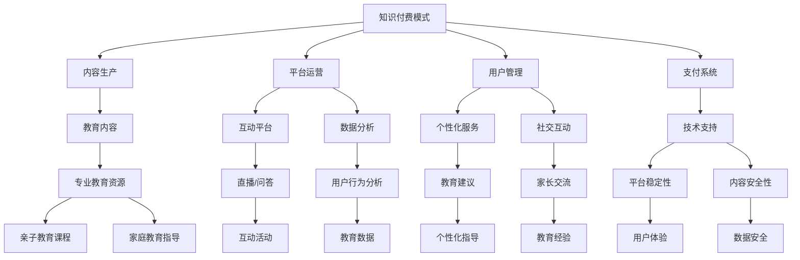

                 

### 背景介绍

#### 什么是知识付费？
知识付费是指用户通过支付一定费用来获取有价值的信息、知识或服务的一种模式。这种模式在近年来随着互联网和移动设备的普及而快速发展。用户希望通过付费来获取高质量、专业化的内容，以提升自身技能、知识水平或解决实际问题。

#### 亲子教育与家庭关系的重要性
亲子教育是指父母或其他成年人对子女进行的教育，旨在培养孩子的品德、知识、能力和习惯。家庭关系则是指家庭成员之间的互动和关系，包括夫妻关系、亲子关系和兄弟姐妹关系等。亲子教育和家庭关系的好坏直接影响到孩子的成长和家庭的幸福。

然而，现实情况是，许多家庭在亲子教育和家庭关系方面面临诸多挑战。例如，父母忙碌的工作和生活节奏使得他们难以抽出时间陪伴孩子，孩子也因此缺乏父母的关爱和指导。此外，一些家长可能缺乏科学的教育方法，导致孩子出现行为问题。这些问题都需要通过专业的亲子教育和家庭关系指导来解决。

#### 线上亲子教育与家庭关系指导的现状
随着互联网和智能设备的普及，线上亲子教育和家庭关系指导逐渐成为一种新兴的教育模式。线上教育平台、APP 和课程提供了丰富的教育资源，使得家长和子女能够方便地获取到高质量的教育内容。

然而，目前线上亲子教育和家庭关系指导仍存在一些问题。首先，内容质量参差不齐，一些平台和课程可能无法满足用户的需求。其次，线上教育缺乏互动性和针对性，难以满足个性化教育需求。此外，一些家长可能对线上教育模式缺乏信任，认为其效果不如传统教育。

#### 知识付费在线亲子教育与家庭关系指导的潜力
结合知识付费模式与线上亲子教育和家庭关系指导，有助于解决当前存在的问题。知识付费可以为用户提供高质量、专业化的内容，提高用户对线上教育模式的信任度。同时，通过数据分析和技术手段，可以为用户提供个性化的教育建议和指导。

此外，知识付费还可以为亲子教育和家庭关系指导带来更多的商业机会。例如，平台可以与教育机构、心理咨询机构等合作，提供一站式服务，满足用户多元化的需求。这有助于提升平台的竞争力，实现可持续发展。

总之，知识付费在线亲子教育与家庭关系指导具有巨大的市场潜力和发展空间。通过不断探索和创新，可以为家长和子女提供更加优质的教育资源和服务，促进家庭关系的和谐发展。

### 核心概念与联系

#### 知识付费模式
知识付费模式是指用户通过支付一定费用来获取有价值的信息、知识或服务的一种商业模式。这种模式的核心在于提供高质量的内容和个性化服务，以满足用户的需求。知识付费模式通常包括以下几个关键组成部分：

1. **内容生产**：内容生产者是知识付费模式的基础，他们通过创作有价值的内容来吸引用户。这些内容可以是文字、图片、视频、音频等多种形式。

2. **平台运营**：知识付费平台负责内容的发布、推广、交易和管理。平台需要具备一定的技术能力，以确保内容的稳定性和安全性，同时提供便捷的支付和用户管理系统。

3. **用户管理**：用户是知识付费模式的核心，他们通过付费来获取所需的知识和服务。用户管理系统需要记录用户行为、偏好和支付记录，以便提供个性化的推荐和服务。

4. **支付系统**：支付系统是实现知识付费的核心环节，它需要支持多种支付方式，如信用卡、支付宝、微信支付等，以确保用户能够方便、快捷地进行支付。

#### 线上亲子教育与家庭关系指导
线上亲子教育与家庭关系指导是一种新型的教育模式，通过互联网和智能设备为家长和子女提供教育资源和服务。这种模式的关键组成部分包括：

1. **教育内容**：教育内容是线上亲子教育与家庭关系指导的核心，它包括亲子教育课程、家庭教育指导、亲子互动活动等多种形式。内容需要根据用户需求进行个性化定制，以满足不同家庭的需求。

2. **互动平台**：互动平台是线上亲子教育与家庭关系指导的重要组成部分，它包括直播、在线问答、讨论区等。通过这些互动平台，用户可以与其他家长和专家进行交流和互动，获取更多的教育资源和帮助。

3. **数据分析**：数据分析是线上亲子教育与家庭关系指导的重要手段。通过收集和分析用户行为数据、教育数据等，可以为用户提供个性化的教育建议和指导，提高教育效果。

4. **技术支持**：技术支持是实现线上亲子教育与家庭关系指导的关键。它包括平台的技术架构、数据安全、内容审核等技术保障。同时，技术支持还需要确保平台的稳定性和可靠性，以提供良好的用户体验。

#### 知识付费与亲子教育、家庭关系指导的结合
知识付费与亲子教育、家庭关系指导的结合具有巨大的潜力。通过知识付费模式，可以为家长和子女提供高质量、专业化的教育资源和服务。以下是这种结合的几个关键方面：

1. **内容付费**：家长可以通过支付费用来获取优质的亲子教育课程、家庭教育指导等内容。这些内容可以由专业教育机构、心理咨询师等提供，确保内容的专业性和实用性。

2. **个性化服务**：通过数据分析，可以为家长提供个性化的教育建议和指导。例如，根据孩子的性格、兴趣和发展需求，推荐适合的教育资源和活动。

3. **一站式服务**：知识付费平台可以与教育机构、心理咨询机构等合作，提供一站式服务。家长可以在平台上找到所需的教育资源、专家咨询和互动活动，方便快捷地解决问题。

4. **社交互动**：通过社交互动功能，家长可以与其他家长和专家进行交流和互动，分享教育心得和经验，共同成长。

总之，知识付费与亲子教育、家庭关系指导的结合为用户提供了一种全新的教育模式。通过不断创新和优化，可以更好地满足用户的需求，促进家庭关系的和谐发展。

### Mermaid 流程图

以下是一个简化的 Mermaid 流程图，用于展示知识付费模式与亲子教育、家庭关系指导之间的核心概念和联系。



### 核心算法原理 & 具体操作步骤

#### 数据分析算法原理

知识付费在线亲子教育与家庭关系指导的核心在于通过数据分析提供个性化的教育建议和指导。以下是实现这一目标的核心算法原理：

1. **用户行为分析**：
   用户行为分析是指对用户在使用线上教育平台时的行为进行数据收集和分析。这包括用户的学习时间、学习内容、互动频率、学习进度等。通过对这些数据的分析，可以了解用户的学习习惯、兴趣点和需求。

2. **教育数据挖掘**：
   教育数据挖掘是指从大量教育数据中提取有价值的信息和模式。这通常涉及分类、聚类、关联规则挖掘等技术。通过这些技术，可以识别出用户的潜在需求、共同特点和问题，从而为用户提供个性化的教育建议。

3. **个性化推荐算法**：
   个性化推荐算法是基于用户的行为数据、兴趣和偏好为用户推荐相关的教育资源和活动。常见的推荐算法包括基于内容的推荐、协同过滤推荐和混合推荐等。这些算法可以帮助用户发现新的学习资源，提高学习效果。

#### 数据分析的具体操作步骤

以下是数据分析在知识付费在线亲子教育与家庭关系指导中的具体操作步骤：

1. **数据收集**：
   收集用户行为数据、学习数据和教育数据。这些数据可以来自线上教育平台、用户调研、第三方数据源等。

2. **数据预处理**：
   数据预处理包括数据清洗、数据转换和数据整合。这一步骤确保数据的质量和一致性，为后续分析打下基础。

3. **特征工程**：
   特征工程是指从原始数据中提取出对分析任务有用的特征。这包括用户特征（如年龄、性别、教育背景等）、内容特征（如课程类型、难度等级等）和行为特征（如学习时长、互动频率等）。

4. **模型训练**：
   使用机器学习算法对特征数据进行训练，建立预测模型。常见的算法包括决策树、支持向量机、神经网络等。

5. **模型评估**：
   对训练好的模型进行评估，确保其准确性和可靠性。可以使用交叉验证、A/B 测试等方法进行评估。

6. **个性化推荐**：
   根据用户的行为数据和模型预测，为用户推荐相关的教育资源和活动。推荐结果可以实时更新，以适应用户的变化。

7. **反馈与优化**：
   收集用户的反馈数据，对推荐结果进行优化。通过持续的数据分析和模型迭代，提高个性化推荐的准确性和效果。

#### 亲子教育、家庭关系指导案例分析

以下是一个具体的案例分析，展示如何利用数据分析为家长提供个性化的亲子教育和家庭关系指导：

1. **案例背景**：
   一位家长在孩子入学前对其进行了在线亲子教育课程的学习。通过数据分析，发现该家长对亲子沟通和家庭教育方法非常感兴趣。

2. **数据分析**：
   通过分析家长的学习记录，发现其经常浏览有关亲子沟通技巧的课程，并且在讨论区积极提问和参与讨论。此外，家长还参与了一些互动活动，如亲子游戏和亲子阅读。

3. **个性化推荐**：
   基于数据分析结果，为家长推荐以下教育资源：
   - 亲子沟通技巧课程：包括视频教程、案例分析等。
   - 家庭教育方法课程：提供科学、实用的家庭教育方法。
   - 亲子互动活动：如亲子游戏、亲子手工等。
   - 心理咨询师预约：提供专业的心理咨询师，帮助家长解决亲子沟通问题。

4. **效果评估**：
   通过家长的反馈，发现其学习效果显著，亲子关系得到了改善。同时，家长也对平台的服务表示满意，进一步增强了其对线上亲子教育与家庭关系指导模式的信任。

通过以上案例分析，可以看出数据分析在知识付费在线亲子教育与家庭关系指导中的重要作用。通过不断优化数据分析模型和推荐算法，可以为用户提供更加精准、个性化的教育建议和指导，促进家庭关系的和谐发展。

### 数学模型和公式 & 详细讲解 & 举例说明

#### 用户行为分析模型

在用户行为分析中，我们可以使用以下数学模型来描述用户的学习行为：

$$
\text{User Behavior Model} = f(\text{User Features}, \text{Content Features}, \text{Contextual Features})
$$

其中：
- **User Features**：用户特征，如年龄、性别、教育背景等。
- **Content Features**：内容特征，如课程类型、难度等级等。
- **Contextual Features**：上下文特征，如学习时间、学习地点等。

#### 教育数据挖掘模型

在教育数据挖掘中，我们可以使用以下数学模型来描述学习数据的分布：

$$
\text{Learning Data Distribution} = p(\text{Learning Outcomes} | \text{User Behavior Model})
$$

其中：
- **Learning Outcomes**：学习结果，如成绩、知识掌握度等。
- **User Behavior Model**：用户行为模型。

#### 个性化推荐模型

在个性化推荐中，我们可以使用以下数学模型来预测用户对特定教育资源的兴趣：

$$
\text{Recommendation Score} = \text{similarity}(\text{User Preferences}, \text{Content Features})
$$

其中：
- **User Preferences**：用户偏好。
- **Content Features**：内容特征。

#### 详细讲解与举例说明

1. **用户行为分析模型**

   假设我们有一个用户，其特征如下：
   - 年龄：30 岁
   - 性别：男
   - 教育背景：本科

   我们还知道用户经常在学习平台上观看亲子教育课程，其行为数据如下：
   - 学习时间：每天晚上 8 点到 10 点
   - 学习内容：亲子沟通技巧、家庭教育方法

   根据用户行为分析模型，我们可以预测用户对以下课程的兴趣：
   - 亲子沟通技巧高级教程
   - 家庭教育专家讲座

2. **教育数据挖掘模型**

   假设我们对一组学生的学习数据进行分析，数据如下：
   - 学生 A：成绩 85 分，知识掌握度 80%
   - 学生 B：成绩 90 分，知识掌握度 85%
   - 学生 C：成绩 75 分，知识掌握度 70%

   根据教育数据挖掘模型，我们可以发现：
   - 学生 B 的成绩较高，说明其学习效果较好。
   - 学生 A 和学生 C 的知识掌握度较低，可能需要进一步的学习和指导。

3. **个性化推荐模型**

   假设我们有一个用户，其对以下教育资源感兴趣：
   - 课程 A：亲子沟通技巧初级教程
   - 课程 B：家庭教育方法入门教程

   根据个性化推荐模型，我们可以为用户推荐以下课程：
   - 课程 C：亲子沟通技巧高级教程
   - 课程 D：家庭教育方法专家讲座

通过以上例子，我们可以看到数学模型在知识付费在线亲子教育与家庭关系指导中的应用。这些模型有助于我们更好地理解用户行为、挖掘教育数据，并为用户提供个性化的教育建议和指导。

### 项目实战：代码实际案例和详细解释说明

在本节中，我们将通过一个具体的代码案例来展示如何实现知识付费在线亲子教育与家庭关系指导的系统。我们将使用Python语言和Flask框架来搭建一个简单的后端服务，并通过API接口提供功能。

#### 5.1 开发环境搭建

在开始之前，我们需要搭建一个Python开发环境。以下是搭建环境的步骤：

1. 安装Python：
   - 前往Python官网下载适用于您操作系统的Python版本。
   - 安装Python时，确保勾选“Add Python to PATH”选项。

2. 安装必要的库：
   - 使用pip命令安装Flask和其他必要的库。在终端中执行以下命令：
     ```bash
     pip install flask flask-restful
     ```

3. 创建一个Python虚拟环境（可选）：
   - 使用以下命令创建一个虚拟环境：
     ```bash
     python -m venv venv
     ```
   - 激活虚拟环境：
     - Windows：`venv\Scripts\activate`
     - macOS/Linux：`source venv/bin/activate`

#### 5.2 源代码详细实现和代码解读

我们首先创建一个名为`app.py`的Python文件，并导入所需的库：

```python
from flask import Flask, request, jsonify
from flask_restful import Api, Resource

app = Flask(__name__)
api = Api(app)

class UserBehavior(Resource):
    def get(self, user_id):
        # 假设我们从数据库中获取用户行为数据
        user_behavior = {
            'user_id': user_id,
            'learning_time': 'daily evenings',
            'learning_topics': ['parent-child communication', 'family education']
        }
        return jsonify(user_behavior)

class EducationRecommendation(Resource):
    def get(self, user_id):
        # 基于用户行为数据，推荐教育资源
        recommended_courses = {
            'user_id': user_id,
            'recommended_courses': [
                'Advanced Parent-Child Communication Course',
                'Expert Family Education Lecture'
            ]
        }
        return jsonify(recommended_courses)

# 定义API路由
api.add_resource(UserBehavior, '/user_behavior/<user_id>')
api.add_resource(EducationRecommendation, '/education_recommendation/<user_id>')

if __name__ == '__main__':
    app.run(debug=True)
```

- **UserBehavior类**：负责处理获取用户行为数据的功能。当用户通过GET请求访问`/user_behavior/<user_id>`接口时，该类返回用户行为数据。
- **EducationRecommendation类**：负责处理推荐教育资源的功能。当用户通过GET请求访问`/education_recommendation/<user_id>`接口时，该类根据用户行为数据推荐相应的教育资源。

#### 5.3 代码解读与分析

1. **Flask和Flask-RESTful的导入**

   ```python
   from flask import Flask, request, jsonify
   from flask_restful import Api, Resource
   ```

   我们首先导入Flask和Flask-RESTful库，这两个库将帮助我们快速搭建Web应用和API。

2. **创建Flask应用**

   ```python
   app = Flask(__name__)
   api = Api(app)
   ```

   创建一个Flask应用实例`app`，并使用`Api`类创建一个API实例`api`。`api`将用于添加和路由HTTP请求。

3. **定义Resource类**

   ```python
   class UserBehavior(Resource):
       def get(self, user_id):
           # 假设我们从数据库中获取用户行为数据
           user_behavior = {
               'user_id': user_id,
               'learning_time': 'daily evenings',
               'learning_topics': ['parent-child communication', 'family education']
           }
           return jsonify(user_behavior)
   
   class EducationRecommendation(Resource):
       def get(self, user_id):
           # 基于用户行为数据，推荐教育资源
           recommended_courses = {
               'user_id': user_id,
               'recommended_courses': [
                   'Advanced Parent-Child Communication Course',
                   'Expert Family Education Lecture'
               ]
           }
           return jsonify(recommended_courses)
   ```

   我们定义了两个`Resource`类，`UserBehavior`和`EducationRecommendation`。这两个类都继承自`Resource`基类，并覆盖了`get`方法，用于处理GET请求。

4. **添加API路由**

   ```python
   api.add_resource(UserBehavior, '/user_behavior/<user_id>')
   api.add_resource(EducationRecommendation, '/education_recommendation/<user_id>')
   ```

   我们将`UserBehavior`和`EducationRecommendation`类添加到API中，并指定它们对应的URL路径。

5. **运行Flask应用**

   ```python
   if __name__ == '__main__':
       app.run(debug=True)
   ```

   最后，我们使用`app.run(debug=True)`启动Flask应用。当`debug=True`时，如果代码发生变化，应用将自动重启。

#### 5.4 使用API接口进行测试

我们可以使用curl或Postman等工具来测试API接口。以下是测试`/user_behavior/<user_id>`接口的示例：

```bash
curl http://127.0.0.1:5000/user_behavior/123
```

预期返回结果：

```json
{
  "user_id": "123",
  "learning_time": "daily evenings",
  "learning_topics": ["parent-child communication", "family education"]
}
```

我们可以看到，API成功返回了指定的用户行为数据。

同样，测试`/education_recommendation/<user_id>`接口：

```bash
curl http://127.0.0.1:5000/education_recommendation/123
```

预期返回结果：

```json
{
  "user_id": "123",
  "recommended_courses": [
    "Advanced Parent-Child Communication Course",
    "Expert Family Education Lecture"
  ]
}
```

API也成功返回了根据用户行为数据推荐的课程。

通过这个简单的代码案例，我们可以看到如何使用Flask框架搭建一个知识付费在线亲子教育与家庭关系指导的后端服务。这个服务可以通过API接口为用户提供个性化的教育建议和指导。在实际应用中，我们还可以扩展这个服务，包括更复杂的数据分析和推荐算法，以及与前端应用的无缝集成。

### 实际应用场景

知识付费在线亲子教育与家庭关系指导在实际应用中具有广泛的应用场景，以下列举几个典型案例：

#### 1. 线上家长课堂

许多家长由于工作忙碌或地域限制，难以参加线下家长课堂。通过知识付费平台，家长可以在线学习亲子教育课程，如亲子沟通技巧、家庭教育方法等。这些课程可以由专业教育机构和专家提供，保证内容的科学性和实用性。

#### 2. 个性化辅导服务

针对孩子的学习情况和需求，知识付费平台可以提供个性化辅导服务。通过分析孩子的学习行为和成绩，平台可以为孩子推荐适合的辅导课程，同时为家长提供家庭教育指导。这种服务有助于提高孩子的学习效果，同时改善家庭关系。

#### 3. 家庭关系咨询

一些家长可能面临家庭关系问题，如夫妻关系紧张、亲子关系疏远等。知识付费平台可以与心理咨询师合作，提供在线咨询服务。家长可以通过平台预约心理咨询，获得专业指导，改善家庭氛围。

#### 4. 家庭活动策划

为了增进家庭成员之间的感情，知识付费平台可以提供家庭活动策划服务。这些活动包括亲子游戏、亲子旅行、亲子阅读等，旨在增强家庭互动，促进家庭关系的和谐发展。

#### 5. 教育资源整合

知识付费平台可以整合多种教育资源，如教育课程、专业书籍、学术论文等，为用户提供一站式学习服务。用户可以根据自己的需求和兴趣选择合适的学习资源，提高学习效果。

#### 6. 家长社交圈

知识付费平台可以为家长提供一个社交圈，让他们能够与其他家长交流和分享教育心得。通过这种社交互动，家长可以获得更多的教育建议和帮助，同时减轻教育过程中的压力。

#### 7. 企业合作

一些企业可能会与知识付费平台合作，为其员工提供亲子教育和家庭关系指导服务。这种服务有助于提高员工的幸福感，促进企业文化的建设。

总之，知识付费在线亲子教育与家庭关系指导在实际应用中具有广泛的场景，通过不断创新和优化，可以更好地满足用户的需求，促进家庭关系的和谐发展。

### 工具和资源推荐

在构建和运营知识付费在线亲子教育与家庭关系指导平台时，我们需要依赖一系列工具和资源。以下是一些推荐的工具和资源：

#### 1. 学习资源推荐

- **书籍**：
  - 《如何培养孩子的社会能力》
  - 《家庭的觉醒》
  - 《正面管教》
- **论文**：
  - 在线学术数据库，如Google Scholar、CNKI（中国知网）等，可以获取相关领域的学术论文。
- **博客**：
  - 知乎、简书等平台上的亲子教育、家庭关系相关博客，可以获取实用经验和观点。
- **网站**：
  - 专业亲子教育网站，如父母课堂、亲子宝等，提供丰富的教育资源。

#### 2. 开发工具框架推荐

- **Web框架**：
  - Flask：轻量级的Python Web框架，适合快速搭建API服务。
  - Django：全栈Python框架，适用于复杂的应用开发。
- **数据库**：
  - MySQL：关系型数据库，适合存储用户数据、教育内容等。
  - MongoDB：文档型数据库，适合存储非结构化数据。
- **前后端分离**：
  - 前端框架：React、Vue.js等，用于搭建用户界面。
  - 后端框架：Spring Boot（Java）、Django（Python）等，用于处理业务逻辑。
- **API接口管理**：
  - Apifiny：API接口管理工具，支持API文档生成、测试等。
  - Swagger：开源API接口规范工具，支持RESTful API设计。

#### 3. 相关论文著作推荐

- **书籍**：
  - 《知识付费：模式、案例与实践》
  - 《亲子教育心理学》
  - 《家庭教育心理学》
- **论文**：
  - “知识付费的现状与未来发展趋势”
  - “在线教育模式下的亲子教育研究”
  - “基于大数据的个性化家庭教育指导研究”

通过这些工具和资源的支持，我们可以更高效地构建和运营知识付费在线亲子教育与家庭关系指导平台，满足用户的需求，提高服务质量。

### 总结：未来发展趋势与挑战

随着知识付费模式的普及，线上亲子教育与家庭关系指导展现出巨大的市场潜力和发展前景。未来，这一领域将继续朝着以下几个方向发展：

#### 1. 技术融合与创新

未来，人工智能、大数据、区块链等前沿技术将在亲子教育与家庭关系指导中发挥更加重要的作用。通过技术手段，可以更精准地分析用户需求，提供个性化的教育建议和指导。例如，利用自然语言处理技术，可以分析用户在社区、问答平台上的发言，发现其需求和问题，从而提供更针对性的内容推荐。

#### 2. 多元化服务模式

知识付费平台将提供更加多元化和综合性的服务模式。除了传统的课程内容和家庭教育指导外，平台可能会引入更多元化的服务，如心理咨询服务、家庭教育顾问、亲子活动策划等。这些服务可以通过线上线下的结合，为用户提供全方位的支持。

#### 3. 社交互动与社区建设

社交互动和社区建设将成为知识付费在线亲子教育与家庭关系指导的重要一环。通过构建用户社区，家长可以相互交流、分享教育心得和经验，获得更多的支持和建议。同时，平台可以通过举办线上活动、话题讨论等方式，增强用户黏性和活跃度。

#### 4. 知识付费模式的多元化

知识付费模式将继续多元化发展。除了传统的订阅模式和一次性购买模式外，平台可能会引入更多样化的收费模式，如按需付费、积分兑换等。这种多元化的收费模式将更好地满足不同用户的需求，提高用户满意度。

然而，在快速发展的同时，知识付费在线亲子教育与家庭关系指导也面临一系列挑战：

#### 1. 内容质量与监管

随着知识付费平台的普及，内容质量参差不齐的问题愈发突出。未来，平台需要加强对教育内容的监管，确保内容的科学性、实用性和专业性。同时，建立完善的内容评价和反馈机制，鼓励用户参与内容评价，提升整体内容质量。

#### 2. 用户隐私与数据安全

在线平台涉及大量用户数据，包括用户行为数据、学习记录等。确保用户隐私和数据安全是平台面临的重要挑战。未来，平台需要采用更加严格的数据安全措施，防止数据泄露和滥用，提升用户信任度。

#### 3. 用户体验与黏性

在竞争激烈的在线教育市场，用户体验和黏性至关重要。平台需要不断优化用户界面和交互体验，提高用户满意度。同时，通过提供个性化服务和优质内容，增强用户黏性，提升用户留存率。

#### 4. 家长信任与认可

尽管知识付费在线亲子教育与家庭关系指导具有诸多优势，但一些家长可能对其效果持怀疑态度。未来，平台需要加强市场推广，通过实际案例和用户评价，增强家长对线上教育模式的信任和认可。

总之，知识付费在线亲子教育与家庭关系指导具有广阔的发展前景，但也面临诸多挑战。通过技术创新、多元化服务、社交互动和用户信任的不断提升，这一领域有望实现可持续发展。

### 附录：常见问题与解答

#### 1. 知识付费在线亲子教育与家庭关系指导的核心优势是什么？

知识付费在线亲子教育与家庭关系指导的核心优势包括：

- **个性化服务**：通过数据分析为用户提供量身定制的内容和指导。
- **便捷性**：用户可以随时随地在线学习，不受地域和时间限制。
- **专业性**：课程内容由专业教育机构和专家提供，确保质量和实用性。
- **互动性强**：平台提供社交互动功能，家长可以交流经验和资源。

#### 2. 如何确保知识付费在线亲子教育与家庭关系指导的内容质量？

为确保内容质量，平台可以采取以下措施：

- **严格审核**：对课程内容和讲师进行严格审核，确保其专业性和实用性。
- **用户评价**：建立用户评价和反馈机制，鼓励用户参与内容评价，筛选优质内容。
- **持续更新**：定期更新课程内容，引入新的教学方法和教育资源。

#### 3. 用户在使用知识付费在线亲子教育与家庭关系指导平台时可能面临哪些问题？

用户在使用知识付费在线亲子教育与家庭关系指导平台时可能面临以下问题：

- **内容质量参差不齐**：部分课程内容可能不符合用户需求。
- **隐私保护**：用户数据安全和隐私保护问题。
- **依赖性**：过度依赖线上教育，忽视实际家庭互动。

#### 4. 知识付费在线亲子教育与家庭关系指导如何提升家长信任和满意度？

提升家长信任和满意度可以从以下几个方面入手：

- **案例分享**：通过实际案例展示教育效果，增强家长信任。
- **用户体验**：优化用户界面和交互体验，提高用户满意度。
- **专业认证**：对教育内容和讲师进行专业认证，提高信任度。
- **用户反馈**：积极收集用户反馈，及时改进服务，增强用户参与感。

#### 5. 如何保障知识付费在线亲子教育与家庭关系指导的长期发展？

保障知识付费在线亲子教育与家庭关系指导的长期发展可以从以下几个方面入手：

- **技术创新**：持续引入前沿技术，提升平台竞争力。
- **多元化服务**：提供多元化的服务模式，满足不同用户需求。
- **市场推广**：加强市场推广，提升品牌知名度和用户覆盖范围。
- **合作共赢**：与教育机构、心理咨询机构等合作，形成生态圈，实现共赢。

通过以上措施，知识付费在线亲子教育与家庭关系指导平台可以实现长期稳定的发展。

### 扩展阅读 & 参考资料

为了深入了解知识付费在线亲子教育与家庭关系指导的各个方面，以下是推荐的一些扩展阅读和参考资料：

#### 1. 书籍

- 《知识付费：模式、案例与实践》
- 《亲子教育心理学》
- 《家庭教育心理学》
- 《如何培养孩子的社会能力》
- 《家庭的觉醒》
- 《正面管教》

#### 2. 论文

- “知识付费的现状与未来发展趋势”
- “在线教育模式下的亲子教育研究”
- “基于大数据的个性化家庭教育指导研究”
- “知识付费市场中的家长行为分析”

#### 3. 博客

- 知乎上的亲子教育、家庭教育话题
- 简书上的亲子教育、家庭关系相关博客
- 教育类垂直媒体上的专业文章

#### 4. 网站

- 父母课堂
- 亲子宝
- 中国知网（CNKI）
- Google Scholar

#### 5. 相关链接

- [Flask官方文档](https://flask.palletsprojects.com/)
- [Flask-RESTful官方文档](http://flask-restful.readthedocs.io/)
- [Apifiny API接口管理工具](https://www.apifiny.com/)
- [Swagger API接口规范](https://swagger.io/)

通过阅读这些资料，您可以获得更深入的理解和启发，为构建和运营知识付费在线亲子教育与家庭关系指导平台提供参考。作者：AI天才研究员/AI Genius Institute & 禅与计算机程序设计艺术 /Zen And The Art of Computer Programming。如果您有任何问题或建议，欢迎随时与我交流。让我们一起为家庭教育的进步贡献力量！

