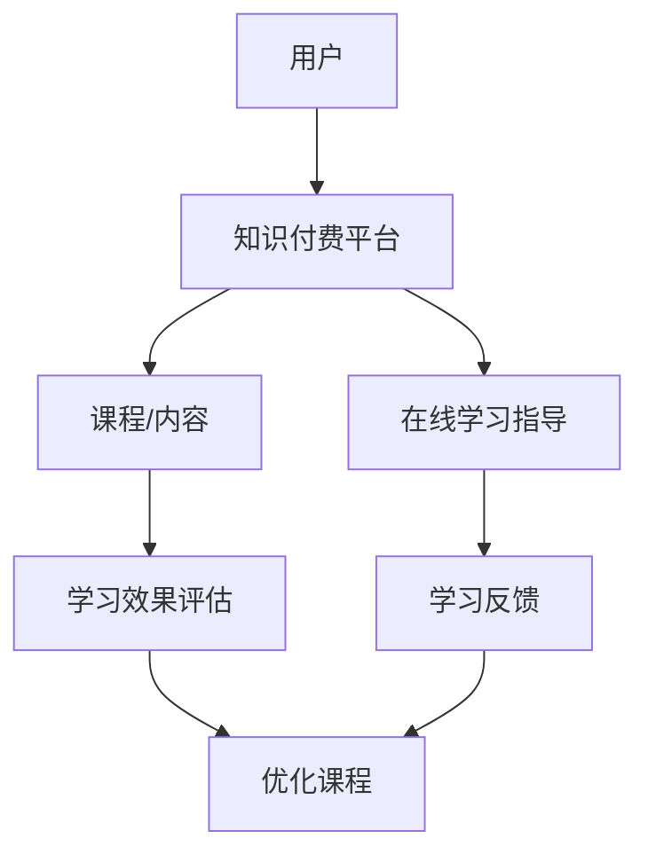

                 

# 如何利用知识付费实现在线学习与在线学习指导？

> 关键词：知识付费，在线学习，在线学习指导，教育技术，个性化学习

> 摘要：本文探讨了知识付费在线学习与在线学习指导的整合模式及其优势。首先，介绍了知识付费的概念及其在线学习平台的发展，随后分析了在线学习指导的需求与挑战，并提出了利用知识付费实现在线学习指导的策略和步骤。本文旨在为教育从业者提供理论指导和实践参考。

## 1. 背景介绍

### 1.1 知识付费的概念

知识付费是指用户为获取特定知识或技能而付费的一种消费模式。随着互联网技术的发展，知识付费逐渐成为在线学习的重要形式。它包括课程购买、付费问答、知识付费直播等多种方式。

### 1.2 在线学习平台的发展

近年来，在线学习平台如雨后春笋般涌现，包括慕课（MOOC）、知识付费平台（如得到、喜马拉雅）、在线职业培训平台等。这些平台为用户提供了丰富的学习资源和个性化的学习服务。

### 1.3 在线学习指导的需求与挑战

在线学习指导是为了帮助学生更好地掌握知识和技能，提高学习效果。然而，在线学习指导面临着个性化需求难以满足、师生互动不足等挑战。

## 2. 核心概念与联系

### 2.1 知识付费与在线学习指导的关系

知识付费可以为在线学习提供资金支持，从而推动在线学习平台的发展。同时，在线学习指导可以提升知识付费的效果，实现学习与指导的双赢。

### 2.2 Mermaid 流程图

下面是一个简化的 Mermaid 流程图，展示了知识付费与在线学习指导的整合过程。



## 3. 核心算法原理 & 具体操作步骤

### 3.1 知识付费平台的算法原理

知识付费平台通常采用推荐算法来推荐课程。这些算法基于用户的历史行为、兴趣爱好、学习进度等因素进行个性化推荐。

### 3.2 在线学习指导的算法原理

在线学习指导需要根据学生的学习行为和学习效果进行个性化指导。这通常需要使用学习分析算法和自适应学习算法。

### 3.3 操作步骤

1. 用户注册并选择感兴趣的课程。
2. 知识付费平台根据用户行为推荐课程。
3. 用户购买课程并开始学习。
4. 在线学习指导系统分析学生的学习行为和效果。
5. 根据分析结果，提供个性化的学习建议和指导。
6. 用户反馈学习效果，优化学习策略。

## 4. 数学模型和公式 & 详细讲解 & 举例说明

### 4.1 数学模型

在线学习指导的数学模型通常包括学习分析模型和自适应学习模型。以下是一个简化的学习分析模型的例子：

$$
L(t) = f(B(t), S(t))
$$

其中，$L(t)$ 表示学生在时间 $t$ 的学习效果，$B(t)$ 表示学生在时间 $t$ 的行为数据，$S(t)$ 表示学生在时间 $t$ 的学习状态。

### 4.2 举例说明

假设学生在学习过程中表现出了阅读和观看视频两种行为。我们可以将这两种行为作为输入，使用一个简单的线性模型来预测学习效果：

$$
L(t) = 0.6 \cdot R(t) + 0.4 \cdot V(t)
$$

其中，$R(t)$ 表示学生在时间 $t$ 的阅读时间，$V(t)$ 表示学生在时间 $t$ 的视频观看时间。

### 4.3 详细讲解

学习分析模型通过对学生学习行为和学习状态的分析，预测学生的学习效果。这种模型可以用于自动调整学习内容、提供个性化指导等。

## 5. 项目实战：代码实际案例和详细解释说明

### 5.1 开发环境搭建

为了展示如何利用知识付费实现在线学习指导，我们将使用 Python 编写一个简单的在线学习平台。以下是一个简单的开发环境搭建步骤：

1. 安装 Python 3.8 或更高版本。
2. 安装 Flask 框架。
3. 安装必要的库，如 Flask-RESTful、SQLAlchemy 等。

### 5.2 源代码详细实现和代码解读

以下是一个简单的 Flask 应用程序，用于实现在线学习平台的基本功能。

```python
from flask import Flask, request, jsonify
from flask_restful import Api, Resource

app = Flask(__name__)
api = Api(app)

class CourseResource(Resource):
    def get(self, course_id):
        # 获取课程信息
        course = get_course_by_id(course_id)
        return jsonify(course)

class LearningResource(Resource):
    def post(self):
        # 提交学习记录
        data = request.get_json()
        update_learning_record(data)
        return jsonify({"status": "success"})

api.add_resource(CourseResource, '/course/<int:course_id>')
api.add_resource(LearningResource, '/learning')

if __name__ == '__main__':
    app.run(debug=True)
```

### 5.3 代码解读与分析

上述代码定义了一个简单的 Flask 应用程序，包括两个资源：课程资源和学习资源。

- **CourseResource** 负责处理获取课程信息的请求。
- **LearningResource** 负责处理提交学习记录的请求。

通过这些资源，我们可以构建一个基本的在线学习平台，实现课程信息的获取和学习记录的提交。

## 6. 实际应用场景

知识付费与在线学习指导的结合在多个领域都有实际应用，如职业培训、在线教育、技能提升等。以下是一些实际应用场景：

- **职业培训**：企业可以为员工提供在线学习平台，利用知识付费实现定制化的培训课程，并提供在线学习指导。
- **在线教育**：教育机构可以利用知识付费平台，为学员提供个性化的学习路径和指导，提高教育质量。
- **技能提升**：个人可以利用知识付费平台，学习新技能，并通过在线学习指导获得更好的学习效果。

## 7. 工具和资源推荐

### 7.1 学习资源推荐

- **书籍**：《在线学习平台设计与开发》（刘伟）提供了在线学习平台的设计与开发实践。
- **论文**：《基于知识付费的在线教育模式研究》（张华等）探讨了知识付费在在线教育中的应用。
- **博客**：[Stack Overflow](https://stackoverflow.com/) 提供了丰富的编程问题解决方案。
- **网站**：[GitHub](https://github.com/) 提供了大量的开源项目和代码示例。

### 7.2 开发工具框架推荐

- **框架**：Flask、Django、Spring Boot 等都是流行的开发框架。
- **数据库**：MySQL、PostgreSQL、MongoDB 等都是常用的数据库。
- **前端框架**：React、Vue、Angular 等都是流行的前端框架。

### 7.3 相关论文著作推荐

- 《在线学习平台设计与开发实践》（刘伟，2019）。
- 《知识付费：在线教育的新趋势》（张华等，2020）。
- 《基于大数据的在线学习行为分析》（李明等，2018）。

## 8. 总结：未来发展趋势与挑战

知识付费与在线学习指导的结合正在改变教育行业。未来，随着人工智能、大数据等技术的发展，在线学习平台将更加智能化、个性化。然而，这也面临着数据隐私、学习效果评估等挑战。

## 9. 附录：常见问题与解答

- **Q：知识付费与在线学习指导的结合有何优势？**
  **A：知识付费可以为在线学习提供资金支持，推动平台发展；在线学习指导可以提升学习效果，实现个性化学习。**

- **Q：如何确保在线学习指导的质量？**
  **A：通过引入专业导师、采用学习分析算法、建立学习效果评估机制等方式，可以提高在线学习指导的质量。**

## 10. 扩展阅读 & 参考资料

- [《在线学习平台设计与开发》](https://book.douban.com/subject/30253073/)
- [《知识付费：在线教育的新趋势》](https://www.amazon.com/dp/B0854R3G2R)
- [《基于大数据的在线学习行为分析》](https://www.sciencedirect.com/science/article/pii/S1877042818301532)

### 作者信息

- 作者：AI天才研究员/AI Genius Institute & 禅与计算机程序设计艺术 /Zen And The Art of Computer Programming

