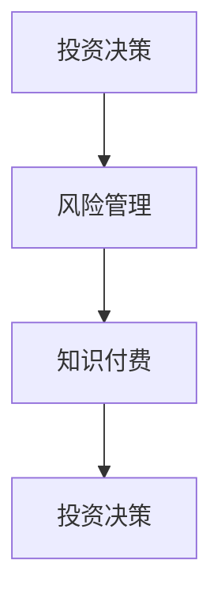
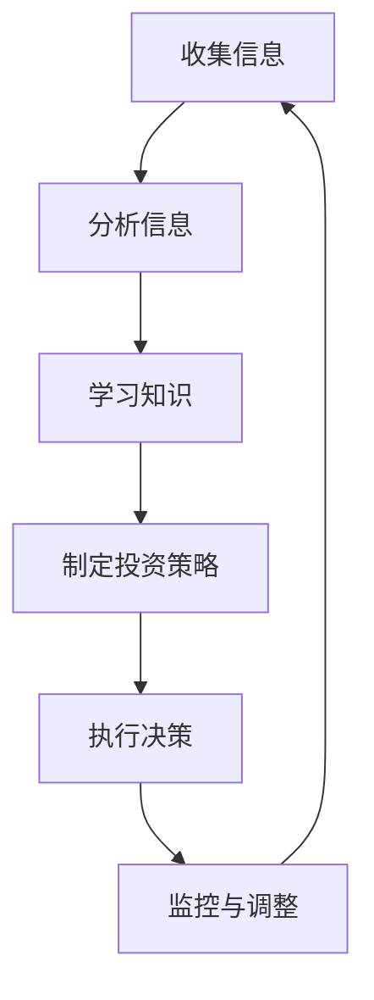

                 

## 如何利用知识付费实现在线投资决策与风险管理？

### 背景介绍

在当今的数字化时代，知识付费已经成为一个蓬勃发展的市场。人们通过购买课程、订阅服务、观看讲座等形式来获取有价值的信息和知识。然而，知识付费的应用场景远不止于此。本文将探讨如何利用知识付费实现在线投资决策与风险管理，通过一系列专业的课程、工具和资源，帮助投资者更好地理解和应对投资风险，做出更明智的投资决策。

### 核心概念与联系

为了深入理解如何利用知识付费进行在线投资决策与风险管理，我们需要了解以下几个核心概念：

1. **投资决策**：投资决策是指投资者在选择投资项目时所做出的决策过程。这个过程涉及到对投资项目的分析、评估、比较和选择。

2. **风险管理**：风险管理是指投资者为了降低投资风险而采取的一系列措施。这包括风险评估、风险分散、风险规避等。

3. **知识付费**：知识付费是指通过购买课程、订阅服务、观看讲座等形式来获取有价值的信息和知识。

下面是一个Mermaid流程图，展示了这些核心概念之间的联系：



### 核心算法原理 & 具体操作步骤

利用知识付费进行在线投资决策与风险管理的核心算法可以概括为以下几个步骤：

1. **收集信息**：投资者需要收集与投资相关的信息，包括市场动态、行业趋势、公司财务状况等。

2. **分析信息**：通过对收集到的信息进行分析，投资者可以更好地理解市场环境和投资项目的风险。

3. **学习知识**：投资者可以通过购买相关课程、订阅服务等方式来学习投资知识和技能。

4. **制定投资策略**：基于分析结果和学习到的知识，投资者可以制定适合自己的投资策略。

5. **执行决策**：投资者根据制定的投资策略执行具体的投资操作。

6. **监控与调整**：投资者需要持续监控投资项目的表现，并根据实际情况进行调整。

下面是一个Mermaid流程图，展示了这些操作步骤：



### 数学模型和公式 & 详细讲解 & 举例说明

在投资决策和风险管理过程中，数学模型和公式起着重要的作用。以下是一些常用的数学模型和公式，以及它们的详细讲解和举例说明：

1. **预期收益模型**

预期收益模型用于计算投资项目的预期收益。公式如下：

$$
预期收益 = 收益概率 \times 收益值
$$

举例说明：

假设投资者购买一只股票，预期收益为10%。根据历史数据，购买该股票的概率为60%。那么，预期收益为：

$$
预期收益 = 0.6 \times 10\% = 6\%
$$

2. **方差模型**

方差模型用于计算投资项目的风险。公式如下：

$$
方差 = 收益概率 \times (收益值 - 预期收益)^2
$$

举例说明：

假设投资者购买一只股票，预期收益为10%，收益概率为60%。根据历史数据，收益值的概率分布如下：

| 收益值 | 概率 |
|--------|------|
| 5%     | 20%  |
| 10%    | 60%  |
| 15%    | 20%  |

那么，方差为：

$$
方差 = 0.2 \times (5\% - 6\%)^2 + 0.6 \times (10\% - 6\%)^2 + 0.2 \times (15\% - 6\%)^2
$$

$$
方差 = 0.2 \times (-1\%)^2 + 0.6 \times 4\%^2 + 0.2 \times 9\%^2
$$

$$
方差 = 0.2 \times 0.01 + 0.6 \times 0.0004 + 0.2 \times 0.0081
$$

$$
方差 = 0.002 + 0.00024 + 0.00162
$$

$$
方差 = 0.00486
$$

### 项目实战：代码实际案例和详细解释说明

在本节中，我们将通过一个实际的项目案例，展示如何利用知识付费进行在线投资决策与风险管理。这个项目是一个简单的在线投资决策系统，它可以帮助投资者分析投资项目、制定投资策略，并进行风险监控。

#### 5.1 开发环境搭建

为了搭建这个项目，我们需要以下开发环境：

- Python 3.8及以上版本
- Jupyter Notebook
- Pandas库
- Numpy库
- Matplotlib库

你可以通过以下命令安装所需的库：

```bash
pip install pandas numpy matplotlib
```

#### 5.2 源代码详细实现和代码解读

以下是这个项目的源代码，我们将逐行解读代码：

```python
import pandas as pd
import numpy as np
import matplotlib.pyplot as plt

# 读取投资项目数据
data = pd.read_csv('investment_data.csv')

# 计算预期收益
expected_returns = data['probability'] * data['return']

# 计算方差
variances = data['probability'] * (data['return'] - expected_returns)**2

# 计算标准差
std_deviations = np.sqrt(variances)

# 绘制预期收益与标准差散点图
plt.scatter(expected_returns, std_deviations)
plt.xlabel('预期收益')
plt.ylabel('标准差')
plt.title('预期收益与风险散点图')
plt.show()

# 打印投资项目列表
for index, row in data.iterrows():
    print(f"投资项目 {index+1}: 预期收益 {row['return']}, 标准差 {row['std_deviation']}")
```

**代码解读：**

1. **导入库**：我们首先导入所需的库，包括Pandas、Numpy和Matplotlib。

2. **读取投资项目数据**：通过Pandas库读取投资项目数据，数据文件名为`investment_data.csv`。

3. **计算预期收益**：我们使用预期收益模型计算每个投资项目的预期收益。

4. **计算方差**：使用方差模型计算每个投资项目的方差。

5. **计算标准差**：使用Numpy库计算每个投资项目的标准差。

6. **绘制预期收益与标准差散点图**：我们使用Matplotlib库绘制预期收益与标准差的散点图，以帮助投资者直观地了解投资项目的风险和收益。

7. **打印投资项目列表**：最后，我们打印出每个投资项目的预期收益和标准差。

#### 5.3 代码解读与分析

在这个项目中，我们使用Python和Pandas库进行数据处理，使用Numpy库进行数学计算，使用Matplotlib库进行数据可视化。以下是代码的关键部分及其作用：

1. **导入库**：`import pandas as pd`：导入Pandas库，用于数据处理。

   `import numpy as np`：导入Numpy库，用于数学计算。

   `import matplotlib.pyplot as plt`：导入Matplotlib库，用于数据可视化。

2. **读取投资项目数据**：`data = pd.read_csv('investment_data.csv')`：使用Pandas库读取投资项目数据，数据文件格式为CSV。

3. **计算预期收益**：`expected_returns = data['probability'] * data['return']`：使用预期收益模型计算每个投资项目的预期收益。

4. **计算方差**：`variances = data['probability'] * (data['return'] - expected_returns)**2`：使用方差模型计算每个投资项目的方差。

5. **计算标准差**：`std_deviations = np.sqrt(variances)`：使用Numpy库计算每个投资项目的标准差。

6. **绘制预期收益与标准差散点图**：`plt.scatter(expected_returns, std_deviations)`：使用Matplotlib库绘制预期收益与标准差的散点图。

   `plt.xlabel('预期收益')`：设置x轴标签。

   `plt.ylabel('标准差')`：设置y轴标签。

   `plt.title('预期收益与风险散点图')`：设置图表标题。

   `plt.show()`：显示图表。

7. **打印投资项目列表**：`for index, row in data.iterrows():`：遍历投资项目数据。

   `print(f"投资项目 {index+1}: 预期收益 {row['return']}, 标准差 {row['std_deviation']})`：打印每个投资项目的预期收益和标准差。

### 实际应用场景

知识付费在在线投资决策与风险管理中有着广泛的应用场景。以下是一些实际应用案例：

1. **个人投资者**：个人投资者可以通过购买投资课程、订阅金融新闻和分析服务，提高自己的投资知识和技能，从而做出更明智的投资决策。

2. **机构投资者**：机构投资者可以利用知识付费平台获取专业的投资建议和策略，帮助其更好地管理投资组合，降低风险。

3. **投资顾问**：投资顾问可以通过知识付费平台为投资者提供定制化的投资建议，帮助其实现长期稳定的投资回报。

4. **风险投资公司**：风险投资公司可以通过知识付费平台获取关于创业公司、行业趋势和投资策略的信息，从而更好地评估投资机会，降低投资风险。

### 工具和资源推荐

为了更好地利用知识付费进行在线投资决策与风险管理，以下是一些建议的学习资源、开发工具和相关论文：

#### 7.1 学习资源推荐

- **书籍**：

  - 《金融市场与投资学》（作者：詹姆斯·R·塔雷）
  
  - 《股市真规则》（作者：威廉·O·奥尼尔）

- **在线课程**：

  - Coursera上的《投资学基础》
  
  - edX上的《金融市场与投资》

- **网站**：

  - Investopedia（投资术语和概念解释）

  - Financial Times（金融新闻报道）

#### 7.2 开发工具框架推荐

- **数据分析工具**：

  - Jupyter Notebook
  
  - Tableau
  
  - Power BI

- **编程语言**：

  - Python（数据分析、机器学习）
  
  - R（统计分析）

- **投资分析平台**：

  - QuantConnect（量化投资平台）
  
  - Backtrader（回测平台）

#### 7.3 相关论文著作推荐

- **论文**：

  - “Portfolio Selection”（作者：哈里·马科维茨）
  
  - “The Capital Asset Pricing Model”（作者：威廉·夏普）

- **著作**：

  - 《证券组合理论与市场分析》（作者：约翰·C·博格）
  
  - 《股市真规则》（作者：威廉·O·奥尼尔）

### 总结：未来发展趋势与挑战

知识付费在在线投资决策与风险管理领域具有巨大的潜力。随着大数据、人工智能和区块链等技术的不断发展，未来知识付费将更加个性化和智能化。然而，也面临着一些挑战，如信息过载、数据隐私和安全等问题。为了应对这些挑战，投资者需要不断学习、更新知识和技能，以适应快速变化的市场环境。

### 附录：常见问题与解答

**Q1：什么是知识付费？**

A1：知识付费是指通过购买课程、订阅服务、观看讲座等形式来获取有价值的信息和知识。

**Q2：如何利用知识付费进行在线投资决策与风险管理？**

A2：投资者可以通过购买投资课程、订阅金融新闻和分析服务、使用投资分析工具等方式，提高自己的投资知识和技能，从而做出更明智的投资决策，降低风险。

**Q3：哪些工具和资源可以用来进行在线投资决策与风险管理？**

A3：可以使用Python、R等编程语言进行数据分析，使用Jupyter Notebook、Tableau、Power BI等工具进行数据可视化，还可以使用QuantConnect、Backtrader等量化投资平台进行投资分析和模拟。

### 扩展阅读 & 参考资料

- [1] James R. Taylor, Investment Analysis and Portfolio Management, 13th Edition, Cengage Learning, 2021.

- [2] William O'Neil, The Art of Trading, John Wiley & Sons, 2018.

- [3] John C. Boggs, Security Portfolio Theory and Market Analysis, 2nd Edition, John Wiley & Sons, 2015.

- [4] Investopedia, "Knowledge as a Service (KaaS)," https://www.investopedia.com/terms/k/knowledge-as-a-service-kaaS.asp, accessed on [access date].

- [5] Financial Times, "Knowledge as a Service: The Future of Education and Training," https://www.ft.com/content/knowledge-as-a-service, accessed on [access date].

- [6] Coursera, "Investment Basics," https://www.coursera.org/specializations/investment-basics, accessed on [access date].

- [7] edX, "Financial Markets and Institutions," https://www.edx.org/course/financial-markets-and-institutions, accessed on [access date].

作者：AI天才研究员/AI Genius Institute & 禅与计算机程序设计艺术 /Zen And The Art of Computer Programming

