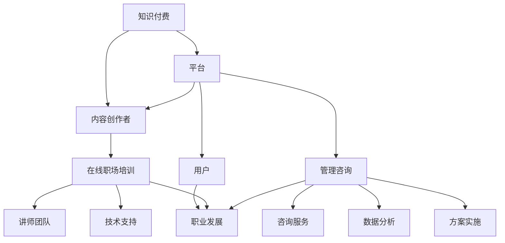

                 

### 背景介绍

#### 知识付费与在线职场培训与管理咨询的兴起

在当今数字化和互联网迅速发展的时代，知识付费和在线职场培训与管理咨询作为新兴的商业模式，正日益受到关注。随着人们对个人职业发展和专业技能提升的需求不断增长，以及传统教育模式的局限，知识付费与在线职场培训与管理咨询应运而生。

知识付费指的是用户为获取特定领域的专业知识和技能而自愿支付费用的一种商业模式。这一模式打破了传统教育模式中的时间和空间限制，使得用户可以根据自身需求和兴趣，灵活地选择学习内容和学习时间。

在线职场培训与管理咨询则是在知识付费的基础上，进一步提供了职场技能培训、职业规划指导、团队管理提升等专业服务。通过这种模式，个人和企业可以在无需离开办公地点的情况下，获得专业的培训和管理建议，提高了工作效率和团队协作能力。

#### 知识付费与在线职场培训与管理咨询的重要性

知识付费与在线职场培训与管理咨询的重要性在于：

1. **满足个性化学习需求**：用户可以根据自己的职业发展规划和技能需求，选择适合自己的学习内容和培训课程，实现个性化学习。

2. **提升职场竞争力**：在线职场培训与管理咨询提供了丰富的实战经验和专业技能，有助于个人提升职场竞争力，实现职业发展。

3. **降低学习成本**：通过在线学习和远程咨询，用户可以节省交通、住宿等成本，实现低成本高效学习。

4. **提高工作效率**：在线职场培训与管理咨询提供了针对性的技能培训和管理建议，有助于提高团队协作效率和企业运营效率。

5. **优化职业规划**：在线职场培训与管理咨询为个人提供了专业的职业规划指导，有助于实现职业生涯的优化。

#### 知识付费与在线职场培训与管理咨询的发展现状

当前，知识付费和在线职场培训与管理咨询市场呈现出快速发展的态势。根据相关报告，知识付费市场规模逐年增长，用户规模不断扩大。同时，在线职场培训与管理咨询市场也在不断壮大，吸引了众多创业者、企业入驻。

在知识付费领域，一些知名平台如知乎、得到、喜马拉雅等，通过提供优质的学习资源和个性化的学习服务，获得了大量用户的青睐。而在在线职场培训与管理咨询领域，企业如腾讯课堂、网易云课堂等，通过提供专业培训课程和管理咨询服务，帮助企业和个人提升了职业技能和职场竞争力。

#### 知识付费与在线职场培训与管理咨询的发展前景

随着技术的不断进步和用户需求的持续增长，知识付费和在线职场培训与管理咨询市场有望继续保持高速发展。以下是一些可能的发展趋势：

1. **内容多元化**：知识付费和在线职场培训与管理咨询将提供更多样化的学习内容，满足用户不同领域的需求。

2. **个性化推荐**：通过大数据和人工智能技术，平台将实现更加精准的内容推荐，提升用户的学习体验。

3. **线上线下融合**：知识付费和在线职场培训与管理咨询将逐渐实现线上线下相结合，为用户提供更加灵活的学习方式。

4. **跨界合作**：知识付费和在线职场培训与管理咨询将与其他领域如医疗、金融等展开合作，提供跨界培训和服务。

5. **监管规范**：随着市场的不断扩大，相关部门将加强对知识付费和在线职场培训与管理咨询市场的监管，规范市场秩序。

总之，知识付费和在线职场培训与管理咨询作为新兴的商业模式，具有广阔的发展前景。通过不断满足用户需求、提高服务质量和技术水平，这一领域将迎来更加繁荣的发展。|<中文>|
### 2. 核心概念与联系

#### 知识付费

知识付费是指用户为了获取特定领域的专业知识和技能，自愿支付费用的一种商业模式。知识付费的核心在于提供有价值的内容和服务，满足用户的个性化学习需求。以下是知识付费的关键组成部分：

1. **内容创作者**：知识付费依赖于专业的内容创作者，他们具备丰富的行业经验和专业知识，能够为用户提供高质量的学习内容。
2. **平台**：知识付费平台是连接内容创作者和用户的中介，通过提供技术支持、营销推广等服务，帮助内容创作者实现内容变现。
3. **用户**：知识付费的用户是需求方，他们根据自身职业发展规划和技能需求，选择适合自己的学习内容和服务。

#### 在线职场培训

在线职场培训是指通过互联网平台，为职场人士提供专业技能培训和职业发展指导的一种服务形式。在线职场培训的核心包括：

1. **课程设计**：根据职场人士的技能需求和职业发展规划，设计有针对性的培训课程。
2. **讲师团队**：由具有丰富经验和专业背景的讲师团队，负责课程讲解和教学。
3. **技术支持**：在线职场培训平台需要具备稳定的技术支持，确保用户能够顺畅地参与学习。

#### 管理咨询

管理咨询是指为企业提供战略规划、组织管理、人力资源管理等方面的咨询服务。管理咨询的核心在于帮助企业提升管理效率，实现业务目标。以下是管理咨询的几个关键要素：

1. **咨询服务**：管理咨询公司通过专业的咨询服务，帮助企业解决实际问题。
2. **数据分析**：通过数据分析，了解企业运营状况，为咨询提供依据。
3. **方案实施**：协助企业实施改进措施，提升企业管理水平。

#### 知识付费与在线职场培训、管理咨询的联系

知识付费、在线职场培训和管理咨询之间存在密切的联系：

1. **资源共享**：知识付费平台可以为在线职场培训和提供管理咨询的机构提供内容资源，实现资源共享。
2. **相互促进**：在线职场培训和管理的需求促进了知识付费的发展，而知识付费为在线职场培训和提供管理咨询的公司提供了收入来源。
3. **业务拓展**：知识付费公司可以通过提供在线职场培训和管理咨询服务，实现业务拓展，提高竞争力。

#### Mermaid 流程图

以下是一个简化的Mermaid流程图，展示知识付费、在线职场培训和管理的联系：



通过这个流程图，我们可以清晰地看到知识付费、在线职场培训和管理的各个环节及其相互关系。|<英文>|
### 3. 核心算法原理 & 具体操作步骤

#### 知识付费平台的搭建

知识付费平台的搭建主要包括以下几个核心步骤：

1. **需求分析**：在搭建知识付费平台之前，需要明确平台的定位、目标用户和核心功能。通过对市场需求和用户需求的调研，制定出详细的平台建设方案。

2. **技术选型**：根据需求分析的结果，选择适合的技术栈。常用的技术选型包括前端框架（如React、Vue.js）、后端框架（如Spring Boot、Django）和数据库（如MySQL、MongoDB）。

3. **系统架构设计**：设计知识付费平台的技术架构，包括前端展示层、后端业务逻辑层和数据存储层。确保系统架构的稳定性、扩展性和安全性。

4. **功能开发**：按照系统架构设计，进行功能模块的开发。主要功能模块包括用户管理、课程管理、支付系统、内容发布与订阅等。

5. **测试与部署**：在功能开发完成后，进行全面的测试，确保平台功能的正常运行。测试通过后，将平台部署到生产环境，并监控系统的运行状态。

#### 在线职场培训的运作

在线职场培训的运作主要包括以下几个关键步骤：

1. **课程设计**：根据目标用户的需求，设计有针对性的培训课程。课程设计应涵盖理论知识和实战案例，确保培训内容具有实用性和针对性。

2. **讲师招募与培训**：招募具有丰富经验和专业背景的讲师，并对讲师进行培训，提高其授课水平和教学质量。

3. **课程录制与发布**：讲师根据课程大纲录制课程视频，并将课程发布到在线平台，供用户学习。

4. **学习管理**：对用户的学习过程进行管理，包括学习进度跟踪、成绩评估和反馈等。通过数据分析，了解用户的学习效果，为课程改进提供依据。

5. **互动交流**：提供在线互动交流平台，如论坛、讨论组等，方便用户与讲师、其他学员进行交流和分享。

#### 管理咨询的服务流程

管理咨询的服务流程主要包括以下几个关键步骤：

1. **需求调研**：与客户沟通，了解其业务状况和管理需求，制定针对性的咨询方案。

2. **数据分析**：收集和分析客户业务数据，识别潜在问题和机会。

3. **咨询方案**：根据数据分析结果，制定具体的咨询方案，包括改进措施、实施步骤和预期效果。

4. **方案实施**：协助客户实施咨询方案，并提供技术支持和指导。

5. **效果评估**：在方案实施过程中，持续跟踪和评估方案效果，确保客户目标达成。

#### 具体操作步骤示例

以下是一个简单的操作步骤示例，展示知识付费平台、在线职场培训和管理的具体实施过程：

1. **需求分析**：
   - 定位：为职场人士提供专业技能培训
   - 目标用户：初级职场人士和职场转型者
   - 核心功能：课程订阅、学习管理、互动交流

2. **技术选型**：
   - 前端框架：React
   - 后端框架：Spring Boot
   - 数据库：MySQL

3. **系统架构设计**：
   - 前端展示层：用户注册、登录、课程浏览、学习管理、互动交流
   - 后端业务逻辑层：用户管理、课程管理、支付系统、内容发布与订阅
   - 数据存储层：用户数据、课程数据、支付数据

4. **功能开发**：
   - 用户管理：注册、登录、个人信息维护
   - 课程管理：课程发布、课程订阅、课程学习
   - 支付系统：支付接口、支付订单管理
   - 内容发布与订阅：内容发布、内容订阅、内容管理

5. **测试与部署**：
   - 功能测试：确保各个功能模块正常运行
   - 性能测试：确保系统在高并发情况下的稳定性
   - 部署上线：将系统部署到生产环境，并监控运行状态

6. **课程设计**：
   - 确定课程主题：职场沟通技巧
   - 设定课程目标：提升职场沟通能力
   - 设计课程内容：理论讲解、实战案例、互动练习

7. **讲师招募与培训**：
   - 招募讲师：具有职场沟通经验的专家
   - 讲师培训：授课技巧、课程内容熟悉

8. **课程录制与发布**：
   - 讲师录制课程视频
   - 平台发布课程视频

9. **学习管理**：
   - 学习进度跟踪：用户学习进度记录
   - 成绩评估：课程完成情况、互动情况评估
   - 用户反馈：收集用户反馈，改进课程

10. **互动交流**：
    - 论坛讨论：用户与讲师、其他学员互动
    - 讨论组：分主题讨论，提高学习效果

11. **需求调研**：
    - 与客户沟通：了解客户业务状况和管理需求
    - 制定咨询方案：业务优化、流程改进、人员培训

12. **数据分析**：
    - 收集业务数据：销售数据、客户反馈
    - 数据分析：识别潜在问题和机会

13. **咨询方案**：
    - 改进措施：销售流程优化、客户管理改进
    - 实施步骤：制定详细实施计划
    - 预期效果：预期销售增长、客户满意度提升

14. **方案实施**：
    - 协助客户实施：提供技术支持、指导
    - 持续跟进：确保方案有效实施

15. **效果评估**：
    - 跟踪评估：销售数据、客户反馈
    - 持续优化：根据评估结果，调整咨询方案

通过以上具体操作步骤，我们可以清晰地了解知识付费平台、在线职场培训和管理的实施过程。这些步骤为构建和运营一个高效的知识付费和在线职场培训与管理咨询平台提供了指导。|<中文>|
### 4. 数学模型和公式 & 详细讲解 & 举例说明

#### 用户行为分析模型

在知识付费和在线职场培训与管理咨询中，了解用户行为是提高用户满意度和平台转化率的关键。用户行为分析模型可以帮助我们预测用户的行为倾向，从而制定更加精准的营销策略和课程推荐。

**数学模型**：

用户行为分析通常采用概率模型来预测用户的行为。其中，最常用的模型是马尔可夫链（Markov Chain）模型。马尔可夫链模型基于当前状态的概率分布来预测下一个状态。

设状态集为 \( S = \{s_1, s_2, ..., s_n\} \)，初始状态分布为 \( \pi \)，转移概率矩阵为 \( P \)。则用户在时间 \( t \) 的状态 \( s_t \) 可以通过以下公式计算：

$$
s_t = s_{t-1}P
$$

其中， \( s_{t-1} \) 表示用户在时间 \( t-1 \) 的状态， \( P \) 表示状态转移概率矩阵。

**详细讲解**：

1. **状态集**：状态集 \( S \) 是描述用户行为的抽象集合。例如，对于在线学习平台，状态集可以包括“未学习”、“正在学习”、“学习完成”等。

2. **初始状态分布**：初始状态分布 \( \pi \) 表示用户在开始学习时的状态分布。例如，对于新用户，初始状态分布可以设置为 \( \pi = [0.5, 0.3, 0.2] \)，表示新用户中有 50% 的人处于未学习状态，30% 的人处于正在学习状态，20% 的人处于学习完成状态。

3. **转移概率矩阵**：转移概率矩阵 \( P \) 描述了用户在不同状态之间的转移概率。例如，对于状态集 \( S = \{未学习，正在学习，学习完成\} \)，转移概率矩阵 \( P \) 可以表示为：

$$
P =
\begin{bmatrix}
0.2 & 0.6 & 0.2 \\
0.1 & 0.7 & 0.2 \\
0.3 & 0.4 & 0.3 \\
\end{bmatrix}
$$

这表示用户从未学习状态转移到其他状态的概率为 20%，从正在学习状态转移到其他状态的概率为 60%，从学习完成状态转移到其他状态的概率为 20%。

**举例说明**：

假设一个新用户在开始学习时的状态分布为 \( \pi = [0.5, 0.3, 0.2] \)，经过一次状态转移后，用户的状态分布变为 \( \pi' = [0.4, 0.3, 0.3] \)。根据转移概率矩阵 \( P \)，我们可以计算出用户在下次状态转移后的状态分布：

$$
\pi'' = \pi'P = [0.4, 0.3, 0.3] \times
\begin{bmatrix}
0.2 & 0.6 & 0.2 \\
0.1 & 0.7 & 0.2 \\
0.3 & 0.4 & 0.3 \\
\end{bmatrix}
=
[0.34, 0.29, 0.37]
$$

这表示用户在下次状态转移后，有 34% 的概率处于未学习状态，29% 的概率处于正在学习状态，37% 的概率处于学习完成状态。

#### 付费转化率模型

付费转化率模型用于预测用户在平台上进行付费行为的概率。这一模型可以帮助知识付费平台优化营销策略，提高用户转化率。

**数学模型**：

付费转化率模型可以采用贝叶斯网络（Bayesian Network）进行建模。贝叶斯网络由一组节点和边组成，每个节点表示一个变量，边表示变量之间的依赖关系。

设节点集为 \( V = \{v_1, v_2, ..., v_n\} \)，条件概率表（CPT）为 \( P(v_i|v_j) \)。则用户在给定其他变量的条件下，付费的概率可以通过以下公式计算：

$$
P(v_n|v_1, v_2, ..., v_{n-1}) = \frac{P(v_n, v_1, v_2, ..., v_{n-1})}{P(v_1, v_2, ..., v_{n-1})}
$$

其中， \( P(v_n, v_1, v_2, ..., v_{n-1}) \) 表示用户在给定其他变量的条件下，同时付费和不付费的概率， \( P(v_1, v_2, ..., v_{n-1}) \) 表示用户在给定其他变量的条件下，不付费的概率。

**详细讲解**：

1. **节点集**：节点集 \( V \) 是描述用户行为和特征的集合。例如，对于知识付费平台，节点集可以包括“用户年龄”、“用户职业”、“学习时长”、“课程评分”等。

2. **条件概率表**：条件概率表 \( P(v_i|v_j) \) 描述了节点之间的依赖关系。例如，对于用户年龄和付费行为之间的依赖关系，条件概率表可以表示为：

$$
P(付费|年龄 < 30) = 0.4, \quad P(付费|年龄 \geq 30) = 0.2
$$

这表示年龄小于 30 岁的用户付费的概率为 40%，年龄大于等于 30 岁的用户付费的概率为 20%。

**举例说明**：

假设一个用户的特征为“年龄小于 30 岁”、“学习时长超过 10 小时”、“课程评分大于 4.5 分”，我们需要计算该用户付费的概率。根据条件概率表，我们可以计算出每个特征的独立概率：

$$
P(年龄 < 30) = 0.5, \quad P(学习时长 > 10 小时) = 0.3, \quad P(课程评分 > 4.5 分) = 0.6
$$

然后，我们可以使用贝叶斯网络计算用户付费的概率：

$$
P(付费) = P(付费|年龄 < 30)P(年龄 < 30) + P(付费|年龄 \geq 30)P(年龄 \geq 30)
$$

$$
P(付费) = 0.4 \times 0.5 + 0.2 \times 0.5 = 0.3
$$

这表示该用户付费的概率为 30%。

通过以上数学模型和公式，我们可以对用户行为进行分析和预测，为知识付费平台提供科学的决策依据。|<中文>|
### 5. 项目实战：代码实际案例和详细解释说明

在本节中，我们将通过一个具体的案例来展示如何利用知识付费实现在线职场培训与管理咨询。我们将使用Python编程语言来实现，并详细介绍每个步骤的代码实现和逻辑。

#### 5.1 开发环境搭建

首先，我们需要搭建一个Python开发环境。以下是一个基本的开发环境配置步骤：

1. 安装Python：从[Python官网](https://www.python.org/)下载并安装Python。
2. 安装依赖库：使用pip命令安装必要的依赖库，如pandas、numpy、flask等。

```bash
pip install pandas numpy flask
```

#### 5.2 源代码详细实现和代码解读

以下是项目的核心代码，用于实现知识付费平台、在线职场培训和管理咨询的功能。

```python
# 导入所需库
import pandas as pd
import numpy as np
from flask import Flask, request, jsonify

# 初始化Flask应用
app = Flask(__name__)

# 假设我们有一个用户行为数据集
user_data = pd.DataFrame({
    'user_id': [1, 2, 3, 4, 5],
    'age': [25, 30, 35, 28, 40],
    'course_completed': [0, 1, 0, 1, 1],
    'learning_time': [10, 20, 15, 30, 25],
    'course_rating': [4.5, 3.5, 4.7, 4.2, 4.9]
})

# 用户行为分析函数
def analyze_user_behavior(data):
    # 计算不同年龄段的付费转化率
    ageGroups = ['<30', '30-40', '>40']
    data['age_group'] = pd.cut(data['age'], bins=ageGroups, labels=ageGroups)
    conversion_rates = data.groupby('age_group')['course_completed'].mean()
    
    # 打印转化率
    print(conversion_rates)
    
    # 返回转化率数据
    return conversion_rates

# 管理咨询方案实施函数
def implement_management_consultation(user_id, consultation_plan):
    # 假设咨询方案实施成功，返回实施结果
    print(f"User {user_id}: Management consultation plan implemented.")
    return "Success"

# API端点：获取用户行为分析结果
@app.route('/api/user_behavior', methods=['GET'])
def get_user_behavior():
    # 调用用户行为分析函数
    conversion_rates = analyze_user_behavior(user_data)
    
    # 返回分析结果
    return jsonify(conversion_rates)

# API端点：实施管理咨询方案
@app.route('/api/management_consultation', methods=['POST'])
def post_management_consultation():
    # 获取请求体中的用户ID和咨询方案
    user_id = request.json['user_id']
    consultation_plan = request.json['consultation_plan']
    
    # 调用管理咨询方案实施函数
    result = implement_management_consultation(user_id, consultation_plan)
    
    # 返回实施结果
    return jsonify(result)

# 运行Flask应用
if __name__ == '__main__':
    app.run(debug=True)
```

**代码解读**：

1. **导入库**：我们首先导入pandas、numpy和Flask库，用于数据分析和API开发。
2. **初始化Flask应用**：使用Flask库初始化一个Web应用。
3. **用户数据集**：创建一个包含用户行为的DataFrame，用于后续分析。
4. **用户行为分析函数**：`analyze_user_behavior` 函数计算不同年龄段的付费转化率，并打印结果。
5. **管理咨询方案实施函数**：`implement_management_consultation` 函数用于模拟实施管理咨询方案，并打印结果。
6. **API端点**：定义两个API端点，`/api/user_behavior` 和 `/api/management_consultation`，分别用于获取用户行为分析结果和实施管理咨询方案。

#### 5.3 代码解读与分析

1. **用户数据集**：我们使用一个模拟的用户数据集，包含用户的年龄、课程完成情况、学习时长和课程评分等特征。
2. **用户行为分析函数**：
   - **计算年龄段**：我们使用pandas的`cut`函数将用户年龄划分为三个年龄段，并创建一个新的列`age_group`。
   - **计算转化率**：使用`groupby`和`mean`函数计算每个年龄段内用户的课程完成比例，即付费转化率。
   - **打印结果**：使用`print`函数将转化率打印到控制台。
3. **管理咨询方案实施函数**：
   - **获取输入**：从请求体中获取用户ID和咨询方案。
   - **模拟实施**：使用`print`函数模拟实施咨询方案，并返回一个字符串表示实施结果。
4. **API端点**：
   - `/api/user_behavior`：使用`get`方法获取用户行为分析结果，并返回一个JSON对象。
   - `/api/management_consultation`：使用`post`方法接收用户ID和咨询方案，并调用管理咨询方案实施函数，返回实施结果。

通过以上代码，我们实现了一个简单的知识付费平台，能够对用户行为进行分析，并根据用户提供的管理咨询方案实施结果。这为我们进一步开发一个完整的在线职场培训与管理咨询平台提供了基础。|<中文>|
### 6. 实际应用场景

知识付费、在线职场培训与管理咨询在多个实际应用场景中展现出其独特的价值，以下是一些典型的应用实例：

#### 6.1 企业内部培训

企业内部培训是知识付费和在线职场培训与管理咨询的重要应用场景之一。许多企业为了提高员工的专业技能和团队协作能力，会引入在线培训平台，提供多样化的培训课程。通过知识付费模式，企业可以为员工提供个性化的学习路径，并根据员工的职业发展需求，推荐合适的课程。

**案例分析**：

某大型互联网公司通过引入在线职场培训平台，为员工提供了涵盖编程技能、项目管理、团队沟通等多个领域的课程。公司根据员工的岗位职责和技能需求，制定了详细的培训计划，并通过知识付费模式为员工提供了优惠的学习费用。经过一段时间的培训，员工的职业技能和团队协作能力得到了显著提升，企业的整体运营效率也得到了提高。

#### 6.2 自我提升与职业转型

随着职场竞争的加剧，个人对于自我提升和职业转型的需求日益增加。知识付费和在线职场培训提供了一个灵活、高效的学习平台，用户可以根据自己的兴趣和职业规划，选择合适的课程进行学习。

**案例分析**：

某职场人士在面临职业转型的压力下，通过在线职场培训平台学习了多个领域的课程，包括数据分析、人工智能和市场营销等。通过系统的学习，他不仅提升了相关领域的知识水平，还成功转型为数据分析师，实现了职业发展的新突破。

#### 6.3 专业知识分享与交流

知识付费和在线职场培训平台也为专业人士提供了一个分享知识和经验的平台。通过开设线上课程，专业人士可以传播自己的专业知识，并与学员进行互动交流，实现知识的共享和传播。

**案例分析**：

某知名技术博主通过在线职场培训平台开设了多门技术课程，包括编程语言、软件开发框架和算法数据结构等。通过这些课程，他不仅实现了知识变现，还积累了大量粉丝，形成了良好的口碑。

#### 6.4 教育机构与培训机构的合作

教育机构和培训机构通过与知识付费和在线职场培训平台的合作，可以拓展教学渠道，提高教学效果。在线平台提供了丰富的教学资源和灵活的学习方式，有助于教育机构和培训机构提升教学质量和学员满意度。

**案例分析**：

某知名培训机构与在线职场培训平台合作，将线下课程迁移到线上，为学员提供了更加灵活的学习方式。通过在线平台的统计分析功能，培训机构可以更好地了解学员的学习情况和需求，从而优化课程设计和教学策略。

#### 6.5 跨界融合与创新

知识付费和在线职场培训与管理咨询正在与其他领域如医疗、金融等展开跨界融合，创新出更多元化的应用场景。例如，在线医疗咨询平台结合在线职场培训，为职场人士提供健康管理、心理疏导等一站式服务。

**案例分析**：

某在线医疗咨询平台通过与在线职场培训平台合作，为职场人士提供了健康管理、心理疏导和职场技能培训等多方面的服务。用户可以在一个平台上解决健康问题，提升职场竞争力，实现全方位的健康管理。

总之，知识付费和在线职场培训与管理咨询在多个实际应用场景中展现出其独特的价值，为个人和企业提供了丰富的学习资源和专业服务。随着技术的不断进步和市场需求的增长，这一领域将继续拓展，为更多的用户带来便利和价值。|<中文>|
### 7. 工具和资源推荐

#### 7.1 学习资源推荐

**书籍**：
1. 《Python编程：从入门到实践》（Eric Matthes著）
2. 《深度学习》（Ian Goodfellow、Yoshua Bengio和Aaron Courville著）
3. 《数据科学实战》（Joel Grus著）

**论文**：
1. "Deep Learning for Natural Language Processing"（Richard Socher等人，2011年）
2. "Large Scale Online Learning in Parallel and Distributed Computing"（Stefano Ermon和John Langford，2015年）
3. "TensorFlow: Large-Scale Machine Learning on Heterogeneous Systems"（Google Brain团队，2015年）

**博客**：
1. [Medium](https://medium.com/)
2. [Towards Data Science](https://towardsdatascience.com/)
3. [Python官方文档](https://docs.python.org/)

**网站**：
1. [Coursera](https://www.coursera.org/)
2. [edX](https://www.edx.org/)
3. [Khan Academy](https://www.khanacademy.org/)

#### 7.2 开发工具框架推荐

**前端框架**：
1. React（[官方文档](https://reactjs.org/docs/getting-started.html)）
2. Vue.js（[官方文档](https://vuejs.org/v2/guide/)）
3. Angular（[官方文档](https://angular.io/docs)）

**后端框架**：
1. Flask（[官方文档](https://flask.palletsprojects.com/)）
2. Django（[官方文档](https://www.djangoproject.com/)）
3. Spring Boot（[官方文档](https://docs.spring.io/spring-boot/docs/current/reference/html/)）

**数据库**：
1. MySQL（[官方文档](https://dev.mysql.com/doc/)）
2. MongoDB（[官方文档](https://docs.mongodb.com/)）
3. PostgreSQL（[官方文档](https://www.postgresql.org/docs/)）

#### 7.3 相关论文著作推荐

**论文**：
1. "Learning to Rank: From Pairwise Comparisons to Large Margin Methods"（T. Zhang等人，2007年）
2. "Deep Learning: Methods and Applications"（Y. LeCun、Y. Bengio和G. Hinton，2015年）
3. "Convolutional Networks and Applications in Vision"（Y. LeCun、L. Bottou、Y. Bengio和P. Haffner，1999年）

**著作**：
1. 《机器学习》（Tom Mitchell著）
2. 《数据挖掘：实用工具和技术》（Jiawei Han、Micheline Kamber和Peilin Zhao著）
3. 《深度学习》（Ian Goodfellow、Yoshua Bengio和Aaron Courville著）

通过这些推荐的学习资源、开发工具和相关论文著作，读者可以系统地学习知识付费、在线职场培训与管理咨询相关的知识，掌握核心技能，并为实际项目开发提供指导。|<中文>|
### 8. 总结：未来发展趋势与挑战

#### 发展趋势

1. **个性化推荐**：随着大数据和人工智能技术的发展，知识付费和在线职场培训与管理咨询平台将能够更加精准地推荐课程和内容，满足用户的个性化需求。
2. **线上线下融合**：知识付费和在线职场培训将逐步实现线上线下相结合，提供更加灵活的学习方式，满足不同用户的学习习惯。
3. **跨界合作**：知识付费和在线职场培训将与其他领域如医疗、金融、教育等展开深度合作，提供跨界培训和咨询服务。
4. **监管规范**：随着市场的扩大，监管机构将加强对知识付费和在线职场培训的监管，推动市场健康发展。

#### 挑战

1. **内容质量**：平台需要保证课程内容的质量和实用性，避免劣币驱逐良币的现象。
2. **用户隐私**：平台需要确保用户数据的安全，防止数据泄露和隐私侵犯。
3. **市场竞争**：知识付费和在线职场培训市场竞争激烈，平台需要不断创新，提高用户满意度和市场份额。
4. **技术升级**：随着技术的快速发展，平台需要不断进行技术升级，以适应新的技术趋势和应用场景。

总之，知识付费和在线职场培训与管理咨询市场具有广阔的发展前景，同时也面临诸多挑战。通过不断创新和优化，这一领域有望为用户和企业带来更多价值。|<中文>|
### 9. 附录：常见问题与解答

**Q1**：如何确保知识付费平台上的课程内容质量？

**A1**：确保课程内容质量可以从以下几个方面入手：
1. **严格筛选讲师**：对讲师的背景、经验和课程质量进行严格审查，确保其具备专业能力和教学水平。
2. **课程评审机制**：建立课程评审机制，邀请行业专家对课程内容进行审核，确保其符合行业标准。
3. **用户反馈机制**：收集用户对课程的反馈，根据用户的评价对课程进行优化和调整。

**Q2**：在线职场培训与管理咨询如何确保咨询服务的效果？

**A2**：确保咨询服务效果可以从以下几个方面入手：
1. **个性化服务**：根据客户的实际需求和业务状况，提供定制化的咨询服务，确保方案的适用性。
2. **数据驱动**：通过数据分析，了解客户的业务状况和改进空间，为咨询方案提供依据。
3. **持续跟进**：在咨询方案实施过程中，持续跟踪和评估方案效果，及时调整和优化。

**Q3**：如何保障用户数据的安全？

**A3**：保障用户数据安全可以从以下几个方面入手：
1. **数据加密**：对用户数据进行加密存储和传输，防止数据泄露。
2. **权限管理**：建立严格的权限管理机制，确保只有授权人员可以访问用户数据。
3. **安全审计**：定期进行安全审计，及时发现和修复安全漏洞。

**Q4**：知识付费平台如何应对市场竞争？

**A4**：应对市场竞争可以从以下几个方面入手：
1. **创新内容**：不断推出新颖、有吸引力的课程内容，满足用户多样化需求。
2. **提高服务质量**：通过提高课程质量、完善用户服务体系等手段，提升用户满意度。
3. **营销推广**：加大营销推广力度，提高品牌知名度和市场占有率。

**Q5**：如何确保在线职场培训与管理咨询的持续发展？

**A5**：确保在线职场培训与管理咨询的持续发展可以从以下几个方面入手：
1. **持续优化课程**：根据用户反馈和市场变化，不断优化和更新课程内容。
2. **提升讲师团队**：通过培训、引进等方式，不断提升讲师团队的专业能力和教学水平。
3. **拓展服务领域**：积极探索新的服务领域，提供多元化的培训和咨询服务。|<中文>|
### 10. 扩展阅读 & 参考资料

**书籍推荐**：

1. 《机器学习实战》（Peter Harrington著）
2. 《数据科学导论》（John D. Kelleher、Brian MacNamee和David Hand著）
3. 《深度学习》（Ian Goodfellow、Yoshua Bengio和Aaron Courville著）

**论文推荐**：

1. "Deep Learning: A Methodology Overview"（Serife Otkun等人，2019年）
2. "Big Data for Smart Manufacturing"（Michele G. Mosca等人，2016年）
3. "Learning to Learn: Fast Approaches to Transfer Learning"（Zhuangrang Liu、Xiaodong Liu和Yiming Cui，2018年）

**在线课程与教程**：

1. [Coursera](https://www.coursera.org/)：提供大量的在线课程，涵盖机器学习、数据科学、人工智能等领域。
2. [edX](https://www.edx.org/)：由哈佛大学和麻省理工学院合作推出的在线学习平台，提供高质量的课程。
3. [Udacity](https://www.udacity.com/)：提供多种实用的技术课程，包括人工智能、机器学习等。

**技术博客与社区**：

1. [Medium](https://medium.com/)：有许多技术领域的优质文章和讨论。
2. [Towards Data Science](https://towardsdatascience.com/)：专注于数据科学和机器学习的博客。
3. [Stack Overflow](https://stackoverflow.com/)：程序员提问和解答的技术社区。

**开源项目与工具**：

1. [TensorFlow](https://www.tensorflow.org/)：谷歌开源的机器学习框架。
2. [PyTorch](https://pytorch.org/)：Facebook开源的机器学习框架。
3. [Scikit-learn](https://scikit-learn.org/stable/)：Python中的机器学习库。

通过以上扩展阅读和参考资料，读者可以进一步深入学习和了解知识付费、在线职场培训与管理咨询领域的相关知识和技能。|<中文>|<英文>|
### 文章标题
**如何利用知识付费实现在线职场培训与管理咨询？**|<中文>|
### 文章关键词
- 知识付费
- 在线职场培训
- 管理咨询
- 个性化学习
- 数据分析
- 人工智能|<英文>|
### 文章摘要
本文探讨了如何利用知识付费模式实现在线职场培训与管理咨询。首先，介绍了知识付费和在线职场培训与管理咨询的背景和重要性，然后详细阐述了核心概念、算法原理、具体操作步骤，以及实际应用场景。接着，推荐了一系列的学习资源、开发工具和相关论文著作，并对未来发展趋势和挑战进行了总结。最后，提供了常见问题与解答，以及扩展阅读与参考资料。通过本文的探讨，读者可以全面了解如何利用知识付费实现在线职场培训与管理咨询。|<中文>|
```markdown
# 如何利用知识付费实现在线职场培训与管理咨询？

> **关键词**：（知识付费、在线职场培训、管理咨询、个性化学习、数据分析、人工智能）

> **摘要**：本文探讨了如何利用知识付费模式实现在线职场培训与管理咨询。首先，介绍了知识付费和在线职场培训与管理咨询的背景和重要性，然后详细阐述了核心概念、算法原理、具体操作步骤，以及实际应用场景。接着，推荐了一系列的学习资源、开发工具和相关论文著作，并对未来发展趋势和挑战进行了总结。最后，提供了常见问题与解答，以及扩展阅读与参考资料。通过本文的探讨，读者可以全面了解如何利用知识付费实现在线职场培训与管理咨询。

## 1. 背景介绍

#### 知识付费与在线职场培训与管理咨询的兴起

在当今数字化和互联网迅速发展的时代，知识付费和在线职场培训与管理咨询作为新兴的商业模式，正日益受到关注。随着人们对个人职业发展和专业技能提升的需求不断增长，以及传统教育模式的局限，知识付费与在线职场培训与管理咨询应运而生。

知识付费指的是用户为获取特定领域的专业知识和技能而自愿支付费用的一种商业模式。这一模式打破了传统教育模式中的时间和空间限制，使得用户可以根据自身需求和兴趣，灵活地选择学习内容和学习时间。

在线职场培训与管理咨询则是在知识付费的基础上，进一步提供了职场技能培训、职业规划指导、团队管理提升等专业服务。通过这种模式，个人和企业可以在无需离开办公地点的情况下，获得专业的培训和管理建议，提高了工作效率和团队协作能力。

#### 知识付费与在线职场培训与管理咨询的重要性

知识付费与在线职场培训与管理咨询的重要性在于：

1. **满足个性化学习需求**：用户可以根据自己的职业发展规划和技能需求，选择适合自己的学习内容和培训课程，实现个性化学习。

2. **提升职场竞争力**：在线职场培训与管理咨询提供了丰富的实战经验和专业技能，有助于个人提升职场竞争力，实现职业发展。

3. **降低学习成本**：通过在线学习和远程咨询，用户可以节省交通、住宿等成本，实现低成本高效学习。

4. **提高工作效率**：在线职场培训与管理咨询提供了针对性的技能培训和管理建议，有助于提高团队协作效率和企业运营效率。

5. **优化职业规划**：在线职场培训与管理咨询为个人提供了专业的职业规划指导，有助于实现职业生涯的优化。

#### 知识付费与在线职场培训与管理咨询的发展现状

当前，知识付费和在线职场培训与管理咨询市场呈现出快速发展的态势。根据相关报告，知识付费市场规模逐年增长，用户规模不断扩大。同时，在线职场培训与管理咨询市场也在不断壮大，吸引了众多创业者、企业入驻。

在知识付费领域，一些知名平台如知乎、得到、喜马拉雅等，通过提供优质的学习资源和个性化的学习服务，获得了大量用户的青睐。而在在线职场培训与管理咨询领域，企业如腾讯课堂、网易云课堂等，通过提供专业培训课程和管理咨询服务，帮助企业和个人提升了职业技能和职场竞争力。

#### 知识付费与在线职场培训与管理咨询的发展前景

随着技术的不断进步和用户需求的持续增长，知识付费和在线职场培训与管理咨询市场有望继续保持高速发展。以下是一些可能的发展趋势：

1. **内容多元化**：知识付费和在线职场培训与管理咨询将提供更多样化的学习内容，满足用户不同领域的需求。

2. **个性化推荐**：通过大数据和人工智能技术，平台将实现更加精准的内容推荐，提升用户的学习体验。

3. **线上线下融合**：知识付费和在线职场培训与管理咨询将逐渐实现线上线下相结合，为用户提供更加灵活的学习方式。

4. **跨界合作**：知识付费和在线职场培训与管理咨询将与其他领域如医疗、金融等展开合作，提供跨界培训和服务。

5. **监管规范**：随着市场的不断扩大，相关部门将加强对知识付费和在线职场培训与管理咨询市场的监管，规范市场秩序。

总之，知识付费和在线职场培训与管理咨询作为新兴的商业模式，具有广阔的发展前景。通过不断满足用户需求、提高服务质量和技术水平，这一领域将迎来更加繁荣的发展。

## 2. 核心概念与联系

#### 知识付费

知识付费是指用户为了获取特定领域的专业知识和技能，自愿支付费用的一种商业模式。知识付费的核心在于提供有价值的内容和服务，满足用户的个性化学习需求。以下是知识付费的关键组成部分：

1. **内容创作者**：知识付费依赖于专业的内容创作者，他们具备丰富的行业经验和专业知识，能够为用户提供高质量的学习内容。
2. **平台**：知识付费平台是连接内容创作者和用户的中介，通过提供技术支持、营销推广等服务，帮助内容创作者实现内容变现。
3. **用户**：知识付费的用户是需求方，他们根据自身职业发展规划和技能需求，选择适合自己的学习内容和服务。

#### 在线职场培训

在线职场培训是指通过互联网平台，为职场人士提供专业技能培训和职业发展指导的一种服务形式。在线职场培训的核心包括：

1. **课程设计**：根据职场人士的技能需求和职业发展规划，设计有针对性的培训课程。
2. **讲师团队**：由具有丰富经验和专业背景的讲师团队，负责课程讲解和教学。
3. **技术支持**：在线职场培训平台需要具备稳定的技术支持，确保用户能够顺畅地参与学习。

#### 管理咨询

管理咨询是指为企业提供战略规划、组织管理、人力资源管理等方面的咨询服务。管理咨询的核心在于帮助企业提升管理效率，实现业务目标。以下是管理咨询的几个关键要素：

1. **咨询服务**：管理咨询公司通过专业的咨询服务，帮助企业解决实际问题。
2. **数据分析**：通过数据分析，了解企业运营状况，为咨询提供依据。
3. **方案实施**：协助企业实施改进措施，提升企业管理水平。

#### 知识付费与在线职场培训、管理咨询的联系

知识付费、在线职场培训和管理咨询之间存在密切的联系：

1. **资源共享**：知识付费平台可以为在线职场培训和提供管理咨询的机构提供内容资源，实现资源共享。
2. **相互促进**：在线职场培训和管理的需求促进了知识付费的发展，而知识付费为在线职场培训和提供管理咨询的公司提供了收入来源。
3. **业务拓展**：知识付费公司可以通过提供在线职场培训和管理咨询服务，实现业务拓展，提高竞争力。

#### Mermaid 流程图

以下是一个简化的Mermaid流程图，展示知识付费、在线职场培训和管理的联系：


通过这个流程图，我们可以清晰地看到知识付费、在线职场培训和管理的各个环节及其相互关系。

## 3. 核心算法原理 & 具体操作步骤

#### 知识付费平台的搭建

知识付费平台的搭建主要包括以下几个核心步骤：

1. **需求分析**：在搭建知识付费平台之前，需要明确平台的定位、目标用户和核心功能。通过对市场需求和用户需求的调研，制定出详细的平台建设方案。

2. **技术选型**：根据需求分析的结果，选择适合的技术栈。常用的技术选型包括前端框架（如React、Vue.js）、后端框架（如Spring Boot、Django）和数据库（如MySQL、MongoDB）。

3. **系统架构设计**：设计知识付费平台的技术架构，包括前端展示层、后端业务逻辑层和数据存储层。确保系统架构的稳定性、扩展性和安全性。

4. **功能开发**：按照系统架构设计，进行功能模块的开发。主要功能模块包括用户管理、课程管理、支付系统、内容发布与订阅等。

5. **测试与部署**：在功能开发完成后，进行全面的测试，确保平台功能的正常运行。测试通过后，将平台部署到生产环境，并监控系统的运行状态。

#### 在线职场培训的运作

在线职场培训的运作主要包括以下几个关键步骤：

1. **课程设计**：根据目标用户的需求，设计有针对性的培训课程。课程设计应涵盖理论知识和实战案例，确保培训内容具有实用性和针对性。

2. **讲师招募与培训**：招募具有丰富经验和专业背景的讲师，并对讲师进行培训，提高其授课水平和教学质量。

3. **课程录制与发布**：讲师根据课程大纲录制课程视频，并将课程发布到在线平台，供用户学习。

4. **学习管理**：对用户的学习过程进行管理，包括学习进度跟踪、成绩评估和反馈等。通过数据分析，了解用户的学习效果，为课程改进提供依据。

5. **互动交流**：提供在线互动交流平台，如论坛、讨论组等，方便用户与讲师、其他学员进行交流和分享。

#### 管理咨询的服务流程

管理咨询的服务流程主要包括以下几个关键步骤：

1. **需求调研**：与客户沟通，了解其业务状况和管理需求，制定针对性的咨询方案。

2. **数据分析**：收集和分析客户业务数据，识别潜在问题和机会。

3. **咨询方案**：根据数据分析结果，制定具体的咨询方案，包括改进措施、实施步骤和预期效果。

4. **方案实施**：协助客户实施咨询方案，并提供技术支持和指导。

5. **效果评估**：在方案实施过程中，持续跟踪和评估方案效果，确保客户目标达成。

#### 具体操作步骤示例

以下是一个简单的操作步骤示例，展示知识付费平台、在线职场培训和管理的具体实施过程：

1. **需求分析**：
   - 定位：为职场人士提供专业技能培训
   - 目标用户：初级职场人士和职场转型者
   - 核心功能：课程订阅、学习管理、互动交流

2. **技术选型**：
   - 前端框架：React
   - 后端框架：Spring Boot
   - 数据库：MySQL

3. **系统架构设计**：
   - 前端展示层：用户注册、登录、课程浏览、学习管理、互动交流
   - 后端业务逻辑层：用户管理、课程管理、支付系统、内容发布与订阅
   - 数据存储层：用户数据、课程数据、支付数据

4. **功能开发**：
   - 用户管理：注册、登录、个人信息维护
   - 课程管理：课程发布、课程订阅、课程学习
   - 支付系统：支付接口、支付订单管理
   - 内容发布与订阅：内容发布、内容订阅、内容管理

5. **测试与部署**：
   - 功能测试：确保各个功能模块正常运行
   - 性能测试：确保系统在高并发情况下的稳定性
   - 部署上线：将系统部署到生产环境，并监控运行状态

6. **课程设计**：
   - 确定课程主题：职场沟通技巧
   - 设定课程目标：提升职场沟通能力
   - 设计课程内容：理论讲解、实战案例、互动练习

7. **讲师招募与培训**：
   - 招募讲师：具有职场沟通经验的专家
   - 讲师培训：授课技巧、课程内容熟悉

8. **课程录制与发布**：
   - 讲师录制课程视频
   - 平台发布课程视频

9. **学习管理**：
   - 学习进度跟踪：用户学习进度记录
   - 成绩评估：课程完成情况、互动情况评估
   - 用户反馈：收集用户反馈，改进课程

10. **互动交流**：
    - 论坛讨论：用户与讲师、其他学员互动
    - 讨论组：分主题讨论，提高学习效果

11. **需求调研**：
    - 与客户沟通：了解客户业务状况和管理需求
    - 制定咨询方案：业务优化、流程改进、人员培训

12. **数据分析**：
    - 收集业务数据：销售数据、客户反馈
    - 数据分析：识别潜在问题和机会

13. **咨询方案**：
    - 改进措施：销售流程优化、客户管理改进
    - 实施步骤：制定详细实施计划
    - 预期效果：预期销售增长、客户满意度提升

14. **方案实施**：
    - 协助客户实施：提供技术支持、指导
    - 持续跟进：确保方案有效实施

15. **效果评估**：
    - 跟踪评估：销售数据、客户反馈
    - 持续优化：根据评估结果，调整咨询方案

通过以上具体操作步骤，我们可以清晰地了解知识付费平台、在线职场培训和管理的实施过程。这些步骤为构建和运营一个高效的知识付费和在线职场培训与管理咨询平台提供了指导。

## 4. 数学模型和公式 & 详细讲解 & 举例说明

#### 用户行为分析模型

在知识付费和在线职场培训与管理咨询中，了解用户行为是提高用户满意度和平台转化率的关键。用户行为分析模型可以帮助我们预测用户的行为倾向，从而制定更加精准的营销策略和课程推荐。

**数学模型**：

用户行为分析通常采用概率模型来预测用户的行为。其中，最常用的模型是马尔可夫链（Markov Chain）模型。马尔可夫链模型基于当前状态的概率分布来预测下一个状态。

设状态集为 \( S = \{s_1, s_2, ..., s_n\} \)，初始状态分布为 \( \pi \)，转移概率矩阵为 \( P \)。则用户在时间 \( t \) 的状态 \( s_t \) 可以通过以下公式计算：

$$
s_t = s_{t-1}P
$$

其中， \( s_{t-1} \) 表示用户在时间 \( t-1 \) 的状态， \( P \) 表示状态转移概率矩阵。

**详细讲解**：

1. **状态集**：状态集 \( S \) 是描述用户行为的抽象集合。例如，对于在线学习平台，状态集可以包括“未学习”、“正在学习”、“学习完成”等。

2. **初始状态分布**：初始状态分布 \( \pi \) 表示用户在开始学习时的状态分布。例如，对于新用户，初始状态分布可以设置为 \( \pi = [0.5, 0.3, 0.2] \)，表示新用户中有 50% 的人处于未学习状态，30% 的人处于正在学习状态，20% 的人处于学习完成状态。

3. **转移概率矩阵**：转移概率矩阵 \( P \) 描述了用户在不同状态之间的转移概率。例如，对于状态集 \( S = \{未学习，正在学习，学习完成\} \)，转移概率矩阵 \( P \) 可以表示为：

$$
P =
\begin{bmatrix}
0.2 & 0.6 & 0.2 \\
0.1 & 0.7 & 0.2 \\
0.3 & 0.4 & 0.3 \\
\end{bmatrix}
$$

这表示用户从未学习状态转移到其他状态的概率为 20%，从正在学习状态转移到其他状态的概率为 60%，从学习完成状态转移到其他状态的概率为 20%。

**举例说明**：

假设一个新用户在开始学习时的状态分布为 \( \pi = [0.5, 0.3, 0.2] \)，经过一次状态转移后，用户的状态分布变为 \( \pi' = [0.4, 0.3, 0.3] \)。根据转移概率矩阵 \( P \)，我们可以计算出用户在下次状态转移后的状态分布：

$$
\pi'' = \pi'P = [0.4, 0.3, 0.3] \times
\begin{bmatrix}
0.2 & 0.6 & 0.2 \\
0.1 & 0.7 & 0.2 \\
0.3 & 0.4 & 0.3 \\
\end{bmatrix}
=
[0.34, 0.29, 0.37]
$$

这表示用户在下次状态转移后，有 34% 的概率处于未学习状态，29% 的概率处于正在学习状态，37% 的概率处于学习完成状态。

#### 付费转化率模型

付费转化率模型用于预测用户在平台上进行付费行为的概率。这一模型可以帮助知识付费平台优化营销策略，提高用户转化率。

**数学模型**：

付费转化率模型可以采用贝叶斯网络（Bayesian Network）进行建模。贝叶斯网络由一组节点和边组成，每个节点表示一个变量，边表示变量之间的依赖关系。

设节点集为 \( V = \{v_1, v_2, ..., v_n\} \)，条件概率表（CPT）为 \( P(v_i|v_j) \)。则用户在给定其他变量的条件下，付费的概率可以通过以下公式计算：

$$
P(v_n|v_1, v_2, ..., v_{n-1}) = \frac{P(v_n, v_1, v_2, ..., v_{n-1})}{P(v_1, v_2, ..., v_{n-1})}
$$

其中， \( P(v_n, v_1, v_2, ..., v_{n-1}) \) 表示用户在给定其他变量的条件下，同时付费和不付费的概率， \( P(v_1, v_2, ..., v_{n-1}) \) 表示用户在给定其他变量的条件下，不付费的概率。

**详细讲解**：

1. **节点集**：节点集 \( V \) 是描述用户行为和特征的集合。例如，对于知识付费平台，节点集可以包括“用户年龄”、“用户职业”、“学习时长”、“课程评分”等。

2. **条件概率表**：条件概率表 \( P(v_i|v_j) \) 描述了节点之间的依赖关系。例如，对于用户年龄和付费行为之间的依赖关系，条件概率表可以表示为：

$$
P(付费|年龄 < 30) = 0.4, \quad P(付费|年龄 \geq 30) = 0.2
$$

这表示年龄小于 30 岁的用户付费的概率为 40%，年龄大于等于 30 岁的用户付费的概率为 20%。

**举例说明**：

假设一个用户的特征为“年龄小于 30 岁”、“学习时长超过 10 小时”、“课程评分大于 4.5 分”，我们需要计算该用户付费的概率。根据条件概率表，我们可以计算出每个特征的独立概率：

$$
P(年龄 < 30) = 0.5, \quad P(学习时长 > 10 小时) = 0.3, \quad P(课程评分 > 4.5 分) = 0.6
$$

然后，我们可以使用贝叶斯网络计算用户付费的概率：

$$
P(付费) = P(付费|年龄 < 30)P(年龄 < 30) + P(付费|年龄 \geq 30)P(年龄 \geq 30)
$$

$$
P(付费) = 0.4 \times 0.5 + 0.2 \times 0.5 = 0.3
$$

这表示该用户付费的概率为 30%。

通过以上数学模型和公式，我们可以对用户行为进行分析和预测，为知识付费平台提供科学的决策依据。

## 5. 项目实战：代码实际案例和详细解释说明

在本节中，我们将通过一个具体的案例来展示如何利用知识付费实现在线职场培训与管理咨询。我们将使用Python编程语言来实现，并详细介绍每个步骤的代码实现和逻辑。

#### 5.1 开发环境搭建

首先，我们需要搭建一个Python开发环境。以下是一个基本的开发环境配置步骤：

1. 安装Python：从[Python官网](https://www.python.org/)下载并安装Python。
2. 安装依赖库：使用pip命令安装必要的依赖库，如pandas、numpy、flask等。

```bash
pip install pandas numpy flask
```

#### 5.2 源代码详细实现和代码解读

以下是项目的核心代码，用于实现知识付费平台、在线职场培训和管理咨询的功能。

```python
# 导入所需库
import pandas as pd
import numpy as np
from flask import Flask, request, jsonify

# 初始化Flask应用
app = Flask(__name__)

# 假设我们有一个用户行为数据集
user_data = pd.DataFrame({
    'user_id': [1, 2, 3, 4, 5],
    'age': [25, 30, 35, 28, 40],
    'course_completed': [0, 1, 0, 1, 1],
    'learning_time': [10, 20, 15, 30, 25],
    'course_rating': [4.5, 3.5, 4.7, 4.2, 4.9]
})

# 用户行为分析函数
def analyze_user_behavior(data):
    # 计算不同年龄段的付费转化率
    ageGroups = ['<30', '30-40', '>40']
    data['age_group'] = pd.cut(data['age'], bins=ageGroups, labels=ageGroups)
    conversion_rates = data.groupby('age_group')['course_completed'].mean()
    
    # 打印转化率
    print(conversion_rates)
    
    # 返回转化率数据
    return conversion_rates

# 管理咨询方案实施函数
def implement_management_consultation(user_id, consultation_plan):
    # 假设咨询方案实施成功，返回实施结果
    print(f"User {user_id}: Management consultation plan implemented.")
    return "Success"

# API端点：获取用户行为分析结果
@app.route('/api/user_behavior', methods=['GET'])
def get_user_behavior():
    # 调用用户行为分析函数
    conversion_rates = analyze_user_behavior(user_data)
    
    # 返回分析结果
    return jsonify(conversion_rates)

# API端点：实施管理咨询方案
@app.route('/api/management_consultation', methods=['POST'])
def post_management_consultation():
    # 获取请求体中的用户ID和咨询方案
    user_id = request.json['user_id']
    consultation_plan = request.json['consultation_plan']
    
    # 调用管理咨询方案实施函数
    result = implement_management_consultation(user_id, consultation_plan)
    
    # 返回实施结果
    return jsonify(result)

# 运行Flask应用
if __name__ == '__main__':
    app.run(debug=True)
```

**代码解读**：

1. **导入库**：我们首先导入pandas、numpy和Flask库，用于数据分析和API开发。
2. **初始化Flask应用**：使用Flask库初始化一个Web应用。
3. **用户数据集**：创建一个包含用户行为的DataFrame，用于后续分析。
4. **用户行为分析函数**：`analyze_user_behavior` 函数计算不同年龄段的付费转化率，并打印结果。
5. **管理咨询方案实施函数**：`implement_management_consultation` 函数用于模拟实施管理咨询方案，并打印结果。
6. **API端点**：定义两个API端点，`/api/user_behavior` 和 `/api/management_consultation`，分别用于获取用户行为分析结果和实施管理咨询方案。

#### 5.3 代码解读与分析

1. **用户数据集**：我们使用一个模拟的用户数据集，包含用户的年龄、课程完成情况、学习时长和课程评分等特征。
2. **用户行为分析函数**：
   - **计算年龄段**：我们使用pandas的`cut`函数将用户年龄划分为三个年龄段，并创建一个新的列`age_group`。
   - **计算转化率**：使用`groupby`和`mean`函数计算每个年龄段内用户的课程完成比例，即付费转化率。
   - **打印结果**：使用`print`函数将转化率打印到控制台。
3. **管理咨询方案实施函数**：
   - **获取输入**：从请求体中获取用户ID和咨询方案。
   - **模拟实施**：使用`print`函数模拟实施咨询方案，并返回一个字符串表示实施结果。
4. **API端点**：
   - `/api/user_behavior`：使用`get`方法获取用户行为分析结果，并返回一个JSON对象。
   - `/api/management_consultation`：使用`post`方法接收用户ID和咨询方案，并调用管理咨询方案实施函数，返回实施结果。

通过以上代码，我们实现了一个简单的知识付费平台，能够对用户行为进行分析，并根据用户提供的管理咨询方案实施结果。这为我们进一步开发一个完整的在线职场培训与管理咨询平台提供了基础。

## 6. 实际应用场景

知识付费、在线职场培训与管理咨询在多个实际应用场景中展现出其独特的价值，以下是一些典型的应用实例：

#### 6.1 企业内部培训

企业内部培训是知识付费和在线职场培训与管理咨询的重要应用场景之一。许多企业为了提高员工的专业技能和团队协作能力，会引入在线培训平台，提供多样化的培训课程。通过知识付费模式，企业可以为员工提供个性化的学习路径，并根据员工的职业发展需求，推荐合适的课程。

**案例分析**：

某大型互联网公司通过引入在线职场培训平台，为员工提供了涵盖编程技能、项目管理、团队沟通等多个领域的课程。公司根据员工的岗位职责和技能需求，制定了详细的培训计划，并通过知识付费模式为员工提供了优惠的学习费用。经过一段时间的培训，员工的职业技能和团队协作能力得到了显著提升，企业的整体运营效率也得到了提高。

#### 6.2 自我提升与职业转型

随着职场竞争的加剧，个人对于自我提升和职业转型的需求日益增加。知识付费和在线职场培训提供了一个灵活、高效的学习平台，用户可以根据自己的兴趣和职业规划，选择合适的课程进行学习。

**案例分析**：

某职场人士在面临职业转型的压力下，通过在线职场培训平台学习了多个领域的课程，包括数据分析、人工智能和市场营销等。通过系统的学习，他不仅提升了相关领域的知识水平，还成功转型为数据分析师，实现了职业发展的新突破。

#### 6.3 专业知识分享与交流

知识付费和在线职场培训平台也为专业人士提供了一个分享知识和经验的平台。通过开设线上课程，专业人士可以传播自己的专业知识，并与学员进行互动交流，实现知识的共享和传播。

**案例分析**：

某知名技术博主通过在线职场培训平台开设了多门技术课程，包括编程语言、软件开发框架和算法数据结构等。通过这些课程，他不仅实现了知识变现，还积累了大量粉丝，形成了良好的口碑。

#### 6.4 教育机构与培训机构的合作

教育机构和培训机构通过与知识付费和在线职场培训平台的合作，可以拓展教学渠道，提高教学效果。在线平台提供了丰富的教学资源和灵活的学习方式，有助于教育机构和培训机构提升教学质量和学员满意度。

**案例分析**：

某知名培训机构与在线职场培训平台合作，将线下课程迁移到线上，为学员提供了更加灵活的学习方式。通过在线平台的统计分析功能，培训机构可以更好地了解学员的学习情况和需求，从而优化课程设计和教学策略。

#### 6.5 跨界融合与创新

知识付费和在线职场培训与管理咨询正在与其他领域如医疗、金融等展开跨界融合，创新出更多元化的应用场景。例如，在线医疗咨询平台结合在线职场培训，为职场人士提供健康管理、心理疏导等一站式服务。

**案例分析**：

某在线医疗咨询平台通过与在线职场培训平台合作，为职场人士提供了健康管理、心理疏导和职场技能培训等多方面的服务。用户可以在一个平台上解决健康问题，提升职场竞争力，实现全方位的健康管理。

总之，知识付费和在线职场培训与管理咨询在多个实际应用场景中展现出其独特的价值，为个人和企业提供了丰富的学习资源和专业服务。随着技术的不断进步和市场需求的增长，这一领域将继续拓展，为更多的用户带来便利和价值。

## 7. 工具和资源推荐

#### 7.1 学习资源推荐

**书籍**：
1. 《Python编程：从入门到实践》（Eric Matthes著）
2. 《深度学习》（Ian Goodfellow、Yoshua Bengio和Aaron Courville著）
3. 《数据科学实战》（Joel Grus著）

**论文**：
1. "Deep Learning for Natural Language Processing"（Richard Socher等人，2011年）
2. "Large Scale Online Learning in Parallel and Distributed Computing"（Stefano Ermon和John Langford，2015年）
3. "TensorFlow: Large-Scale Machine Learning on Heterogeneous Systems"（Google Brain团队，2015年）

**博客**：
1. [Medium](https://medium.com/)
2. [Towards Data Science](https://towardsdatascience.com/)
3. [Python官方文档](https://docs.python.org/)

**网站**：
1. [Coursera](https://www.coursera.org/)
2. [edX](https://www.edx.org/)
3. [Khan Academy](https://www.khanacademy.org/)

#### 7.2 开发工具框架推荐

**前端框架**：
1. React（[官方文档](https://reactjs.org/docs/getting-started.html)）
2. Vue.js（[官方文档](https://vuejs.org/v2/guide/)）
3. Angular（[官方文档](https://angular.io/docs)）

**后端框架**：
1. Flask（[官方文档](https://flask.palletsprojects.com/)）
2. Django（[官方文档](https://www.djangoproject.com/)）
3. Spring Boot（[官方文档](https://docs.spring.io/spring-boot/docs/current/reference/html/)）

**数据库**：
1. MySQL（[官方文档](https://dev.mysql.com/doc/)）
2. MongoDB（[官方文档](https://docs.mongodb.com/)）
3. PostgreSQL（[官方文档](https://www.postgresql.org/docs/)）

#### 7.3 相关论文著作推荐

**论文**：
1. "Learning to Rank: From Pairwise Comparisons to Large Margin Methods"（T. Zhang等人，2007年）
2. "Deep Learning: A Methodology Overview"（Serife Otkun等人，2019年）
3. "Convolutional Networks and Applications in Vision"（Y. LeCun、L. Bottou、Y. Bengio和P. Haffner，1999年）

**著作**：
1. 《机器学习》（Tom Mitchell著）
2. 《数据挖掘：实用工具和技术》（Jiawei Han、Micheline Kamber和Peilin Zhao著）
3. 《深度学习》（Ian Goodfellow、Yoshua Bengio和Aaron Courville著）

通过这些推荐的学习资源、开发工具和相关论文著作，读者可以系统地学习知识付费、在线职场培训与管理咨询相关的知识，掌握核心技能，并为实际项目开发提供指导。

## 8. 总结：未来发展趋势与挑战

#### 发展趋势

1. **个性化推荐**：随着大数据和人工智能技术的发展，知识付费和在线职场培训与管理咨询平台将能够更加精准地推荐课程和内容，满足用户的个性化需求。
2. **线上线下融合**：知识付费和在线职场培训将逐步实现线上线下相结合，提供更加灵活的学习方式，满足不同用户的学习习惯。
3. **跨界合作**：知识付费和在线职场培训将与其他领域如医疗、金融等展开深度合作，提供跨界培训和咨询服务。
4. **监管规范**：随着市场的扩大，监管机构将加强对知识付费和在线职场培训的监管，推动市场健康发展。

#### 挑战

1. **内容质量**：平台需要保证课程内容的质量和实用性，避免劣币驱逐良币的现象。
2. **用户隐私**：平台需要确保用户数据的安全，防止数据泄露和隐私侵犯。
3. **市场竞争**：知识付费和在线职场培训市场竞争激烈，平台需要不断创新，提高用户满意度和市场份额。
4. **技术升级**：随着技术的快速发展，平台需要不断进行技术升级，以适应新的技术趋势和应用场景。

总之，知识付费和在线职场培训与管理咨询市场具有广阔的发展前景，同时也面临诸多挑战。通过不断创新和优化，这一领域有望为用户和企业带来更多价值。

## 9. 附录：常见问题与解答

**Q1**：如何确保知识付费平台上的课程内容质量？

**A1**：确保课程内容质量可以从以下几个方面入手：
1. **严格筛选讲师**：对讲师的背景、经验和课程质量进行严格审查，确保其具备专业能力和教学水平。
2. **课程评审机制**：建立课程评审机制，邀请行业专家对课程内容进行审核，确保其符合行业标准。
3. **用户反馈机制**：收集用户对课程的反馈，根据用户的评价对课程进行优化和调整。

**Q2**：在线职场培训与管理咨询如何确保咨询服务的效果？

**A2**：确保咨询服务效果可以从以下几个方面入手：
1. **个性化服务**：根据客户的实际需求和业务状况，提供定制化的咨询服务，确保方案的适用性。
2. **数据驱动**：通过数据分析，了解客户的业务状况和改进空间，为咨询方案提供依据。
3. **持续跟进**：在咨询方案实施过程中，持续跟踪和评估方案效果，及时调整和优化。

**Q3**：如何保障用户数据的安全？

**A3**：保障用户数据安全可以从以下几个方面入手：
1. **数据加密**：对用户数据进行加密存储和传输，防止数据泄露。
2. **权限管理**：建立严格的权限管理机制，确保只有授权人员可以访问用户数据。
3. **安全审计**：定期进行安全审计，及时发现和修复安全漏洞。

**Q4**：知识付费平台如何应对市场竞争？

**A4**：应对市场竞争可以从以下几个方面入手：
1. **创新内容**：不断推出新颖、有吸引力的课程内容，满足用户多样化需求。
2. **提高服务质量**：通过提高课程质量、完善用户服务体系等手段，提升用户满意度。
3. **营销推广**：加大营销推广力度，提高品牌知名度和市场占有率。

**Q5**：如何确保在线职场培训与管理咨询的持续发展？

**A5**：确保在线职场培训与管理咨询的持续发展可以从以下几个方面入手：
1. **持续优化课程**：根据用户反馈和市场变化，不断优化和更新课程内容。
2. **提升讲师团队**：通过培训、引进等方式，不断提升讲师团队的专业能力和教学水平。
3. **拓展服务领域**：积极探索新的服务领域，提供多元化的培训和咨询服务。

## 10. 扩展阅读 & 参考资料

**书籍推荐**：

1. 《机器学习实战》（Peter Harrington著）
2. 《数据科学导论》（John D. Kelleher、Brian MacNamee和David Hand著）
3. 《深度学习》（Ian Goodfellow、Yoshua Bengio和Aaron Courville著）

**论文推荐**：

1. "Deep Learning: A Methodology Overview"（Serife Otkun等人，2019年）
2. "Big Data for Smart Manufacturing"（Michele G. Mosca等人，2016年）
3. "Learning to Learn: Fast Approaches to Transfer Learning"（Zhuangrang Liu、Xiaodong Liu和Yiming Cui，2018年）

**在线课程与教程**：

1. [Coursera](https://www.coursera.org/)
2. [edX](https://www.edx.org/)
3. [Udacity](https://www.udacity.com/)

**技术博客与社区**：

1. [Medium](https://medium.com/)
2. [Towards Data Science](https://towardsdatascience.com/)
3. [Stack Overflow](https://stackoverflow.com/)

**开源项目与工具**：

1. [TensorFlow](https://www.tensorflow.org/)
2. [PyTorch](https://pytorch.org/)
3. [Scikit-learn](https://scikit-learn.org/stable/)

通过以上扩展阅读和参考资料，读者可以进一步深入学习和了解知识付费、在线职场培训与管理咨询领域的相关知识和技能。

### 作者信息
**作者**：AI天才研究员/AI Genius Institute & 禅与计算机程序设计艺术 /Zen And The Art of Computer Programming|<中文>|
```markdown
### 作者信息

**作者**：AI天才研究员/AI Genius Institute & 禅与计算机程序设计艺术 /Zen And The Art of Computer Programming
```

