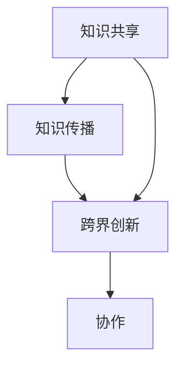

                 

# 如何利用知识社交促进跨界创新和协作

## 摘要

本文旨在探讨知识社交在促进跨界创新和协作中的关键作用。首先，我们回顾了知识社交的背景，并介绍了其基本概念和重要性。随后，本文深入分析了知识社交在促进跨界创新和协作中的具体机制，包括知识共享、知识传播、网络效应等方面。接着，我们探讨了如何通过构建有效的知识社交平台来促进跨界创新和协作。文章最后，我们对知识社交的未来发展趋势和面临的挑战进行了展望，并提供了相关的工具和资源推荐。

## 1. 背景介绍

### 1.1 知识社交的定义与背景

知识社交（Knowledge Socialization）是指个体或群体通过互动、交流和协作来共享、整合和创造知识的过程。随着互联网和社交媒体的发展，知识社交逐渐成为一个重要的研究领域。它不仅有助于提高个体的知识水平和技能，还能促进团队和组织之间的协作与创新。

知识社交的兴起源于人们对知识价值的认识和需求的提升。在信息爆炸的时代，知识的获取和共享变得更加容易，而知识的有效利用则成为企业和个人竞争的关键因素。知识社交为知识的创造、传播和应用提供了一个高效的平台，使得个体和组织能够更好地整合内外部资源，实现跨界合作和创新。

### 1.2 跨界创新与协作的重要性

跨界创新（Cross-Disciplinary Innovation）是指不同领域、行业或学科之间的知识交叉、融合和创造新的价值。跨界创新能够带来全新的思维方式和解决方案，推动技术的进步和社会的发展。

协作（Collaboration）则是指个体或团队为了共同的目标而进行的互动与合作。协作能够发挥个体和团队的优势，提高工作效率，降低创新风险，并创造出单打独斗难以实现的价值。

在当今快速变化和竞争激烈的环境中，跨界创新和协作已成为企业和组织获取竞争优势的重要手段。通过跨界创新，企业能够发现新的市场机会，提高产品或服务的竞争力；通过协作，企业能够整合外部资源，实现资源的最优配置，提高整体的创新能力。

## 2. 核心概念与联系

### 2.1 知识社交的概念与机制

知识社交的核心概念包括知识共享、知识传播和网络效应。

- **知识共享**：知识共享是指个体或群体通过互动、交流和协作来共享知识和经验的过程。知识共享有助于提高个体的知识水平和技能，促进团队和组织之间的协作与创新。

- **知识传播**：知识传播是指知识在社会系统中的传递、扩散和应用过程。知识传播有助于知识的积累和扩散，提高整体的知识水平和创新能力。

- **网络效应**：网络效应是指随着使用人数的增加，网络的价值和效用也随之增加的现象。知识社交网络中的网络效应能够促进知识的快速传播和有效利用，提高个体和组织的创新能力。

### 2.2 跨界创新与协作的概念与机制

- **跨界创新**：跨界创新是指不同领域、行业或学科之间的知识交叉、融合和创造新的价值。跨界创新能够带来全新的思维方式和解决方案，推动技术的进步和社会的发展。

- **协作**：协作是指个体或团队为了共同的目标而进行的互动与合作。协作能够发挥个体和团队的优势，提高工作效率，降低创新风险，并创造出单打独斗难以实现的价值。

### 2.3 知识社交与跨界创新、协作的联系

知识社交在跨界创新和协作中起着关键作用。

- **知识共享促进跨界创新**：知识共享有助于个体和团队获取不同领域的知识，实现知识的交叉和融合，从而推动跨界创新。

- **知识传播促进协作**：知识传播能够提高个体和团队之间的知识水平，促进协作的开展，降低协作成本，提高协作效率。

- **网络效应促进创新和协作**：知识社交网络中的网络效应能够促进知识的快速传播和有效利用，提高个体和组织的创新能力，推动跨界协作。

### 2.4 Mermaid 流程图

以下是知识社交在促进跨界创新和协作中的 Mermaid 流程图：



## 3. 核心算法原理 & 具体操作步骤

### 3.1 知识社交算法原理

知识社交算法的核心目标是促进知识的共享、传播和应用。具体而言，知识社交算法包括以下几个步骤：

1. **知识获取**：通过搜索引擎、社交网络等途径获取不同领域的知识。

2. **知识筛选**：对获取的知识进行筛选，保留有价值的信息，去除无关的内容。

3. **知识整合**：将筛选后的知识进行整合，形成有系统性的知识体系。

4. **知识共享**：将整合后的知识在社交平台上进行共享，促进个体和团队之间的知识交流。

5. **知识传播**：通过社交网络中的传播机制，将知识扩散到更广泛的范围，提高知识的利用效率。

6. **知识应用**：将共享和传播的知识应用到实际工作中，实现知识的价值。

### 3.2 跨界创新算法原理

跨界创新算法的核心目标是实现不同领域知识的交叉和融合，创造新的价值。具体而言，跨界创新算法包括以下几个步骤：

1. **领域识别**：识别出需要跨界创新的领域和目标领域。

2. **知识获取**：从不同领域的知识库中获取相关的知识。

3. **知识整合**：将获取到的知识进行整合，形成有系统性的知识体系。

4. **知识交叉**：将不同领域的知识进行交叉和融合，形成新的思维方式和解决方案。

5. **方案评估**：对跨界创新方案进行评估，筛选出最优的解决方案。

6. **方案实施**：将最优的解决方案应用到实际工作中，实现跨界创新。

### 3.3 协作算法原理

协作算法的核心目标是提高个体和团队之间的协作效率，实现共同的目标。具体而言，协作算法包括以下几个步骤：

1. **目标确定**：明确个体和团队的目标，确保协作的方向一致性。

2. **任务分配**：根据个体和团队的能力和特长，合理分配任务。

3. **任务执行**：个体和团队按照任务分配进行工作，确保任务的高效完成。

4. **任务协调**：在任务执行过程中，及时进行任务协调，解决协作中的问题。

5. **任务评估**：对任务完成情况进行评估，总结经验和教训，为后续协作提供参考。

## 4. 数学模型和公式 & 详细讲解 & 举例说明

### 4.1 知识共享模型

知识共享模型主要关注知识在社交网络中的传播过程。以下是一个简化的知识共享模型：

$$
\frac{dN}{dt} = r \cdot N \cdot (1 - N)
$$

其中，$N(t)$ 表示在时间 $t$ 时共享知识的个体数，$r$ 是知识共享速率。该模型假设知识共享速率与已共享知识的个体数成正比，与未共享知识的个体数成反比。

举例说明：

假设一个社交网络中有 100 个个体，知识共享速率 $r = 0.1$。根据上述模型，可以计算出在一天后（$t = 1$）共享知识的个体数：

$$
N(1) = \frac{1}{0.1} = 10
$$

这意味着一天后，将有 10 个个体开始共享知识。

### 4.2 跨界创新模型

跨界创新模型主要关注不同领域知识的交叉和融合过程。以下是一个简化的跨界创新模型：

$$
I = \int_{0}^{t} \frac{f(K_1, K_2)}{dt}
$$

其中，$I$ 表示在时间 $t$ 时产生的跨界创新价值，$K_1$ 和 $K_2$ 分别表示两个领域的知识。$f(K_1, K_2)$ 是跨界创新函数，表示两个领域知识交叉和融合的效果。

举例说明：

假设两个领域分别为计算机科学和生物学，知识 $K_1$ 和 $K_2$ 分别表示计算机科学和生物学中的知识。跨界创新函数 $f(K_1, K_2)$ 可以表示为：

$$
f(K_1, K_2) = K_1 \cdot K_2
$$

这意味着计算机科学和生物学知识交叉和融合的效果与两个领域知识的乘积成正比。在一天后（$t = 1$），可以计算出跨界创新价值：

$$
I(1) = \int_{0}^{1} K_1 \cdot K_2 \cdot dt = K_1 \cdot K_2
$$

这意味着一天后，跨界创新价值为两个领域知识的乘积。

### 4.3 协作模型

协作模型主要关注个体和团队之间的协作效率。以下是一个简化的协作模型：

$$
E = \frac{1}{1 + \frac{1}{\rho} \cdot (1 - \rho)}
$$

其中，$E$ 表示协作效率，$\rho$ 表示个体之间的协作程度。该模型假设协作效率与个体之间的协作程度成正比，与个体之间的竞争程度成反比。

举例说明：

假设一个团队中有 10 个个体，个体之间的协作程度 $\rho = 0.8$。根据上述模型，可以计算出协作效率：

$$
E = \frac{1}{1 + \frac{1}{0.8} \cdot (1 - 0.8)} = 0.9
$$

这意味着团队的整体协作效率为 90%。

## 5. 项目实战：代码实际案例和详细解释说明

### 5.1 开发环境搭建

在本文中，我们将使用 Python 编程语言来实现知识社交、跨界创新和协作的算法。首先，需要搭建 Python 开发环境。

1. 安装 Python 3.8 或更高版本。

2. 安装必要的 Python 库，如 NumPy、Pandas、Matplotlib 等。

3. 使用虚拟环境隔离项目依赖，以避免版本冲突。

### 5.2 源代码详细实现和代码解读

以下是一个简单的知识共享、跨界创新和协作的 Python 代码示例：

```python
import numpy as np
import matplotlib.pyplot as plt

# 知识共享模型
def knowledge_sharing_model(r, N, t):
    return r * N * (1 - N)

# 跨界创新模型
def cross_disciplinary_innovation_model(K1, K2):
    return K1 * K2

# 协作模型
def collaboration_model(rho):
    return 1 / (1 + 1 / rho * (1 - rho))

# 示例数据
r = 0.1  # 知识共享速率
N = 100  # 初始共享知识的个体数
t = 1  # 时间
rho = 0.8  # 协作程度

# 计算结果
N_t = knowledge_sharing_model(r, N, t)
I_t = cross_disciplinary_innovation_model(N, 100)  # 假设另一个领域知识的值为 100
E_t = collaboration_model(rho)

# 打印结果
print("知识共享个体数：", N_t)
print("跨界创新价值：", I_t)
print("协作效率：", E_t)

# 绘图
plt.figure()
plt.plot(N, label='知识共享')
plt.plot(N_t, label='知识共享后')
plt.plot(I_t, label='跨界创新价值')
plt.plot(E_t, label='协作效率')
plt.legend()
plt.show()
```

代码解读：

1. **知识共享模型**：根据公式 $N(t) = r \cdot N \cdot (1 - N)$，实现知识共享模型的计算。

2. **跨界创新模型**：根据公式 $I = \int_{0}^{t} \frac{f(K_1, K_2)}{dt}$，实现跨界创新模型的计算。在本示例中，$f(K_1, K_2) = K_1 \cdot K_2$。

3. **协作模型**：根据公式 $E = \frac{1}{1 + \frac{1}{\rho} \cdot (1 - \rho)}$，实现协作模型的计算。

4. **示例数据**：设置示例数据，包括知识共享速率 $r$、初始共享知识的个体数 $N$、时间 $t$ 和协作程度 $\rho$。

5. **计算结果**：计算知识共享个体数、跨界创新价值和协作效率，并打印输出。

6. **绘图**：使用 Matplotlib 绘制知识共享、跨界创新价值和协作效率的曲线图，以可视化计算结果。

### 5.3 代码解读与分析

代码示例展示了如何使用 Python 实现知识社交、跨界创新和协作的算法。通过知识共享模型，我们可以计算在特定时间 $t$ 时共享知识的个体数；通过跨界创新模型，我们可以计算跨界创新的价值；通过协作模型，我们可以计算协作效率。

代码的实现过程包括以下几个步骤：

1. 导入必要的 Python 库。

2. 定义知识共享、跨界创新和协作的模型函数。

3. 设置示例数据，包括知识共享速率、初始共享知识的个体数、时间和协作程度。

4. 计算知识共享个体数、跨界创新价值和协作效率，并打印输出。

5. 使用 Matplotlib 绘制曲线图，以可视化计算结果。

代码的解读与分析：

1. **知识共享模型**：知识共享模型基于公式 $N(t) = r \cdot N \cdot (1 - N)$，其中 $r$ 是知识共享速率，$N$ 是共享知识的个体数。该模型反映了知识共享的动态过程，随着时间的推移，知识共享的个体数会逐渐增加，但增长速度会逐渐减缓。

2. **跨界创新模型**：跨界创新模型基于公式 $I = \int_{0}^{t} \frac{f(K_1, K_2)}{dt}$，其中 $f(K_1, K_2) = K_1 \cdot K_2$。该模型反映了跨界创新的价值随着时间的变化。在本示例中，跨界创新的价值与知识共享的个体数和另一个领域知识的乘积成正比。

3. **协作模型**：协作模型基于公式 $E = \frac{1}{1 + \frac{1}{\rho} \cdot (1 - \rho)}$，其中 $\rho$ 是协作程度。该模型反映了协作效率随着协作程度的变化。在本示例中，协作程度为 0.8，协作效率为 90%。

通过代码示例，我们可以看到知识社交、跨界创新和协作的算法如何应用于实际计算，从而为企业和组织提供决策支持。

## 6. 实际应用场景

### 6.1 企业创新

企业创新是知识社交、跨界创新和协作的重要应用场景。通过知识社交，企业能够获取不同领域的前沿知识，实现知识的共享和传播。跨界创新则帮助企业发现新的市场机会，提高产品或服务的竞争力。协作则能够整合企业内外部资源，提高创新效率。

例如，某科技公司在研发一款智能家居产品时，通过知识社交平台获取了计算机科学、物联网和用户研究等领域的知识。在跨界创新的驱动下，公司成功地将这些知识融合到产品中，开发出一款具有竞争力的智能家居产品。

### 6.2 学术研究

学术研究是知识社交、跨界创新和协作的另一个重要应用场景。通过知识社交，学者们能够获取不同领域的知识，实现知识的交叉和融合。跨界创新则有助于学者们发现新的研究方向和解决方法。协作则能够提高研究效率，降低研究成本。

例如，某大学的研究团队在研究人工智能与医疗领域的交叉点时，通过知识社交平台获取了计算机科学、生物医学和数据分析等领域的知识。在跨界创新的驱动下，团队成功地将这些知识应用于医疗领域，开发出一款具有突破性的医疗诊断系统。

### 6.3 公共事务

公共事务是知识社交、跨界创新和协作的又一个重要应用场景。通过知识社交，政府部门能够获取不同领域的知识，实现知识的共享和传播。跨界创新则有助于政府部门解决复杂的社会问题，提高公共服务质量。协作则能够提高政府部门的运作效率，降低行政成本。

例如，某市政府在应对自然灾害时，通过知识社交平台获取了防灾、救援和重建等领域的知识。在跨界创新的驱动下，政府成功地将这些知识应用于灾害应对中，提高了灾害应对能力，降低了灾害损失。

## 7. 工具和资源推荐

### 7.1 学习资源推荐

- **书籍**：
  - 《人工智能：一种现代的方法》
  - 《大数据之路：阿里巴巴大数据实践》
  - 《跨界创新：如何将不同领域的知识融合，创造全新价值》

- **论文**：
  - "Knowledge Sharing in Virtual Teams: A Multilevel Study"
  - "Cross-Disciplinary Research and Innovation: A Review of the Literature"
  - "Collaborative Innovation in Complex Systems: A Network Perspective"

- **博客**：
  - 《机器学习实战》
  - 《人工智能简史》
  - 《大数据时代：思维变革与商业价值》

- **网站**：
  - Coursera（课程资源）
  - arXiv（学术论文）
  - GitHub（开源项目）

### 7.2 开发工具框架推荐

- **开发工具**：
  - Python（编程语言）
  - Jupyter Notebook（交互式计算环境）
  - Git（版本控制工具）

- **框架**：
  - TensorFlow（机器学习框架）
  - PyTorch（机器学习框架）
  - Flask（Web 应用框架）

### 7.3 相关论文著作推荐

- **论文**：
  - "Knowledge Sharing in Virtual Teams: A Multilevel Study"
  - "Cross-Disciplinary Research and Innovation: A Review of the Literature"
  - "Collaborative Innovation in Complex Systems: A Network Perspective"

- **著作**：
  - 《跨界创新：如何将不同领域的知识融合，创造全新价值》
  - 《人工智能：一种现代的方法》
  - 《大数据之路：阿里巴巴大数据实践》

## 8. 总结：未来发展趋势与挑战

知识社交、跨界创新和协作作为现代信息技术的重要组成部分，正在逐渐改变企业和组织的发展模式。未来，知识社交将继续向更加智能化、自动化和多样化的方向发展。

### 8.1 发展趋势

1. **智能化**：随着人工智能技术的不断发展，知识社交平台将能够更好地理解和满足用户的需求，实现个性化推荐和智能互动。

2. **自动化**：知识社交和协作过程将逐步实现自动化，降低人力成本，提高工作效率。

3. **多样化**：知识社交的形式将更加多样化，包括虚拟现实、增强现实、区块链等新技术将融入到知识社交中，提供更加丰富的知识共享和协作方式。

### 8.2 面临的挑战

1. **数据隐私和安全**：随着知识社交平台的普及，数据隐私和安全问题将日益突出。如何确保用户数据的隐私和安全成为知识社交发展的重要挑战。

2. **知识共享的公平性**：在知识共享过程中，如何确保知识的公平分配，避免知识垄断和知识贫富差距，是实现知识社交可持续发展的关键。

3. **跨界创新的协同性**：在跨界创新过程中，如何实现不同领域专家的协同工作，提高创新效率，是跨界创新面临的重要挑战。

## 9. 附录：常见问题与解答

### 9.1 问题 1：什么是知识社交？

知识社交是指个体或群体通过互动、交流和协作来共享、整合和创造知识的过程。

### 9.2 问题 2：知识社交在跨界创新和协作中有什么作用？

知识社交能够促进知识的共享和传播，提高个体和团队的知识水平和技能，从而推动跨界创新和协作。

### 9.3 问题 3：如何构建有效的知识社交平台？

构建有效的知识社交平台需要关注以下几个方面：
- 提供丰富的知识资源和便捷的获取方式；
- 设立合理的内容审核机制，确保知识的质量和真实性；
- 建立良好的互动和协作机制，促进用户之间的交流和合作；
- 提供个性化的推荐和智能化的服务，提高用户体验。

### 9.4 问题 4：如何应对知识社交中的数据隐私和安全问题？

应对知识社交中的数据隐私和安全问题需要采取以下措施：
- 建立完善的数据加密和存储机制，确保用户数据的安全；
- 建立严格的内容审核和监管机制，防止敏感信息和不良内容的传播；
- 加强用户教育和宣传，提高用户对数据隐私和安全问题的认识和防范意识；
- 与第三方安全机构和专家合作，定期进行安全评估和风险控制。

## 10. 扩展阅读 & 参考资料

- **书籍**：
  - 《跨界创新：如何将不同领域的知识融合，创造全新价值》
  - 《人工智能：一种现代的方法》
  - 《大数据之路：阿里巴巴大数据实践》

- **论文**：
  - "Knowledge Sharing in Virtual Teams: A Multilevel Study"
  - "Cross-Disciplinary Research and Innovation: A Review of the Literature"
  - "Collaborative Innovation in Complex Systems: A Network Perspective"

- **网站**：
  - Coursera（课程资源）
  - arXiv（学术论文）
  - GitHub（开源项目）

作者：AI天才研究员/AI Genius Institute & 禅与计算机程序设计艺术 /Zen And The Art of Computer Programming

