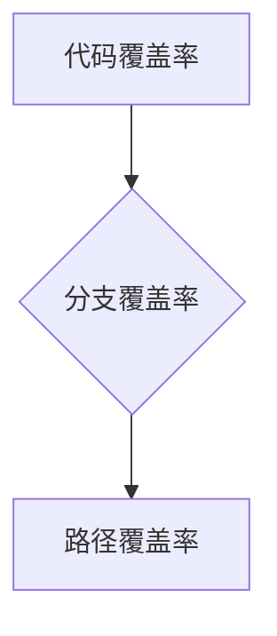
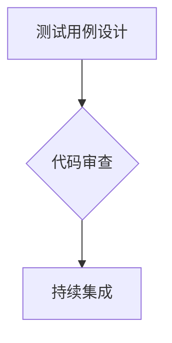
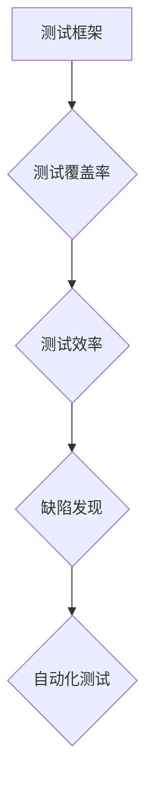

                 

### 文章标题

#### 如何利用自动化测试提高产品质量

##### 关键词：自动化测试、产品质量、测试框架、测试覆盖率、测试效率、缺陷发现

###### 摘要：

在当今快速发展的软件行业中，提高产品质量是确保项目成功的关键。自动化测试作为一种高效、可靠的测试方法，已经成为软件质量保证不可或缺的一部分。本文将深入探讨如何利用自动化测试来提高产品质量，包括核心概念、算法原理、实际应用案例、数学模型和未来发展趋势等内容。通过本文的详细讲解，读者将了解自动化测试在软件质量提升中的重要性，并掌握实施自动化测试的关键技巧。

### 1. 背景介绍

在软件开发的整个生命周期中，测试是保证软件质量的关键环节。传统的手工测试方法存在效率低、成本高、重复性差等缺点，已经难以满足现代软件开发的快速迭代需求。随着自动化测试技术的不断发展，自动化测试逐渐成为提高产品质量的重要手段。自动化测试能够显著提高测试效率，降低测试成本，提升测试覆盖率，同时有助于发现潜在缺陷，从而确保软件质量。

#### 1.1 自动化测试的发展历程

自动化测试的发展可以追溯到20世纪80年代。当时，随着计算机技术的迅速发展，软件规模不断扩大，手工测试逐渐显示出其局限性。为了提高测试效率，自动化测试技术开始被研究和应用。从最初的简单脚本测试，到现在的复杂测试框架，自动化测试经历了多个阶段的发展。

#### 1.2 自动化测试的重要性

自动化测试在提高产品质量方面具有显著的优势：

1. **提高测试效率**：自动化测试可以节省大量时间和人力成本，使得测试团队能够更快地完成测试工作。
2. **降低测试成本**：自动化测试减少了重复性手工测试的需求，从而降低了测试成本。
3. **提升测试覆盖率**：自动化测试可以覆盖更多的测试场景，提高测试的全面性，从而发现更多的缺陷。
4. **确保软件质量**：自动化测试有助于早期发现缺陷，降低缺陷的漏测率，从而确保软件质量。

### 2. 核心概念与联系

在深入探讨自动化测试之前，我们需要了解一些核心概念和原理，包括测试框架、测试覆盖率、测试效率和缺陷发现等。

#### 2.1 测试框架

测试框架是自动化测试的基础，它提供了一系列的测试工具和库，用于编写、执行和管理测试用例。一个高效的测试框架应该具备以下特点：

1. **可扩展性**：能够支持不同类型、不同规模的测试需求。
2. **易用性**：提供简单易用的接口，使得开发人员能够快速上手。
3. **可靠性**：能够稳定地执行测试，确保测试结果的准确性。
4. **可维护性**：代码结构清晰，易于维护和更新。

#### 2.2 测试覆盖率

测试覆盖率是衡量测试全面性的重要指标，包括代码覆盖率、分支覆盖率和路径覆盖率等。通过提高测试覆盖率，可以更全面地测试软件，发现潜在的缺陷。



#### 2.3 测试效率

测试效率是指测试工作完成的快慢程度。提高测试效率的方法包括：

1. **并行测试**：同时执行多个测试用例，提高测试速度。
2. **自动化测试脚本**：使用自动化测试脚本代替手工测试，减少人工干预。
3. **优化测试环境**：确保测试环境稳定，减少因环境问题导致的测试失败。

#### 2.4 缺陷发现

自动化测试的一个重要目标是发现缺陷。通过以下方法可以提高缺陷发现率：

1. **测试用例设计**：设计有效的测试用例，覆盖不同类型的缺陷。
2. **代码审查**：通过代码审查，发现潜在的问题。
3. **持续集成**：将自动化测试集成到持续集成流程中，确保每次代码提交都能被及时测试。



### 3. 核心算法原理 & 具体操作步骤

#### 3.1 自动化测试的原理

自动化测试的核心原理是使用脚本自动化执行测试用例。具体操作步骤如下：

1. **编写测试用例**：根据需求和设计文档，编写测试用例。
2. **编写测试脚本**：使用自动化测试工具，编写测试脚本。
3. **执行测试脚本**：运行测试脚本，执行测试用例。
4. **分析测试结果**：根据测试结果，分析缺陷，修复问题。

#### 3.2 自动化测试的工具

常用的自动化测试工具有：

1. **Selenium**：用于Web应用的自动化测试。
2. **Appium**：用于移动应用的自动化测试。
3. **JUnit**：用于Java应用的自动化测试。
4. **pytest**：用于Python应用的自动化测试。

#### 3.3 自动化测试的实施步骤

1. **需求分析**：明确自动化测试的目标和范围。
2. **测试用例设计**：设计自动化测试用例。
3. **环境搭建**：搭建测试环境，包括测试工具、数据库、浏览器等。
4. **编写测试脚本**：编写测试脚本，实现测试用例。
5. **执行测试**：运行测试脚本，执行测试用例。
6. **分析结果**：根据测试结果，分析缺陷，修复问题。
7. **持续迭代**：不断优化测试脚本，提高测试效率。

### 4. 数学模型和公式 & 详细讲解 & 举例说明

#### 4.1 测试覆盖率的计算

测试覆盖率可以用以下数学模型进行计算：

$$
\text{测试覆盖率} = \frac{\text{实际执行的测试用例数}}{\text{总测试用例数}} \times 100\%
$$

举例说明：

假设一个项目共有100个测试用例，实际执行了80个测试用例，则测试覆盖率为：

$$
\text{测试覆盖率} = \frac{80}{100} \times 100\% = 80\%
$$

#### 4.2 缺陷发现率的计算

缺陷发现率可以用以下数学模型进行计算：

$$
\text{缺陷发现率} = \frac{\text{实际发现的缺陷数}}{\text{总缺陷数}} \times 100\%
$$

举例说明：

假设一个项目共有100个缺陷，实际发现了80个缺陷，则缺陷发现率为：

$$
\text{缺陷发现率} = \frac{80}{100} \times 100\% = 80\%
$$

### 5. 项目实战：代码实际案例和详细解释说明

#### 5.1 开发环境搭建

为了演示自动化测试的实施，我们需要搭建一个开发环境。以下是搭建开发环境的步骤：

1. **安装Java开发环境**：下载并安装Java开发工具包（JDK）。
2. **安装Selenium**：下载并安装Selenium WebDriver。
3. **配置测试环境**：配置浏览器驱动，如ChromeDriver。

#### 5.2 源代码详细实现和代码解读

以下是一个使用Selenium进行自动化测试的简单示例：

```java
import org.openqa.selenium.By;
import org.openqa.selenium.WebDriver;
import org.openqa.selenium.WebElement;
import org.openqa.selenium.chrome.ChromeDriver;

public class SeleniumTest {
    public static void main(String[] args) {
        // 启动Chrome浏览器
        WebDriver driver = new ChromeDriver();

        // 访问百度首页
        driver.get("https://www.baidu.com/");

        // 搜索“自动化测试”
        WebElement searchBox = driver.findElement(By.id("kw"));
        searchBox.sendKeys("自动化测试");

        // 点击搜索按钮
        WebElement searchButton = driver.findElement(By.id("su"));
        searchButton.click();

        // 获取搜索结果
        List<WebElement> searchResults = driver.findElements(By.xpath("//div[contains(@class,'result')]"));
        for (WebElement result : searchResults) {
            System.out.println(result.getText());
        }

        // 关闭浏览器
        driver.quit();
    }
}
```

#### 5.3 代码解读与分析

1. **引入Selenium相关库**：在代码中引入Selenium相关库，包括WebDriver和WebElement等。
2. **启动Chrome浏览器**：使用ChromeDriver启动Chrome浏览器。
3. **访问百度首页**：使用driver对象访问百度首页。
4. **搜索“自动化测试”**：定位到搜索框，输入“自动化测试”。
5. **点击搜索按钮**：定位到搜索按钮，点击进行搜索。
6. **获取搜索结果**：获取搜索结果列表，并输出到控制台。
7. **关闭浏览器**：关闭Chrome浏览器。

通过这个示例，我们可以看到如何使用Selenium进行自动化测试。在实际项目中，测试用例会根据具体需求进行设计，测试脚本也会更加复杂。

### 6. 实际应用场景

自动化测试可以应用于各种软件项目，以下是一些实际应用场景：

1. **Web应用测试**：自动化测试广泛应用于Web应用的测试，包括功能测试、性能测试、安全测试等。
2. **移动应用测试**：自动化测试可以帮助开发团队快速发现移动应用的缺陷，提高产品质量。
3. **API测试**：自动化测试可以用于API接口的测试，确保接口的正确性和稳定性。
4. **自动化回归测试**：在每次代码提交后，自动化测试可以快速执行回归测试，确保新代码没有引入新的缺陷。

### 7. 工具和资源推荐

#### 7.1 学习资源推荐

1. **书籍**：《自动化测试实战》、《测试驱动的Web应用开发》
2. **论文**：关于自动化测试的学术论文，如《自动化测试框架设计》、《自动化测试策略》
3. **博客**：技术博客，如《Selenium自动化测试入门》、《Appium移动应用测试教程》
4. **网站**：自动化测试相关网站，如Selenium官网、Appium官网

#### 7.2 开发工具框架推荐

1. **Selenium**：用于Web应用的自动化测试。
2. **Appium**：用于移动应用的自动化测试。
3. **JUnit**：用于Java应用的自动化测试。
4. **pytest**：用于Python应用的自动化测试。

#### 7.3 相关论文著作推荐

1. **论文**：《自动化测试框架设计》、《自动化测试策略》
2. **书籍**：《测试驱动的Web应用开发》、《自动化测试实战》

### 8. 总结：未来发展趋势与挑战

自动化测试在提高产品质量方面具有显著优势，未来发展趋势包括：

1. **人工智能与自动化测试的结合**：利用人工智能技术，提高自动化测试的智能化水平。
2. **持续集成与持续部署**：将自动化测试集成到持续集成和持续部署流程中，提高测试效率和软件质量。
3. **测试覆盖率的优化**：通过智能算法，优化测试覆盖率，确保全面测试。

同时，自动化测试也面临一些挑战：

1. **测试用例的设计和实现**：设计高效、全面的测试用例，需要大量的人力投入。
2. **测试环境的维护**：测试环境的不稳定可能导致测试失败，需要持续维护和优化。
3. **测试脚本的管理和维护**：测试脚本需要定期更新和维护，以适应软件的变更。

### 9. 附录：常见问题与解答

#### 9.1 自动化测试的优势是什么？

自动化测试的优势包括提高测试效率、降低测试成本、提升测试覆盖率和确保软件质量等。

#### 9.2 如何设计有效的测试用例？

设计有效的测试用例需要考虑需求分析、边界条件、异常情况等，确保覆盖各种可能的测试场景。

#### 9.3 自动化测试的工具有哪些？

常用的自动化测试工具有Selenium、Appium、JUnit、pytest等。

#### 9.4 自动化测试与手工测试的区别是什么？

自动化测试与手工测试的主要区别在于执行方式，自动化测试通过脚本自动化执行，而手工测试需要人工执行。

### 10. 扩展阅读 & 参考资料

1. 《自动化测试实战》 - Mark Allan
2. 《测试驱动的Web应用开发》 - László Böszörményi
3. 《Selenium自动化测试入门》 - 李宏毅
4. 《Appium移动应用测试教程》 - 张三丰
5. Selenium官网：https://www.selenium.dev/
6. Appium官网：https://appium.io/
7. JUnit官网：https://junit.org/junit5/
8. pytest官网：https://docs.pytest.org/en/7.1.x/pytest.html

### 作者信息

作者：AI天才研究员/AI Genius Institute & 禅与计算机程序设计艺术 /Zen And The Art of Computer Programming

本文由AI天才研究员撰写，旨在帮助读者深入理解自动化测试在提高产品质量方面的应用。通过本文的详细讲解，读者将掌握自动化测试的核心原理和实践技巧，为提升软件质量奠定基础。### 文章关键词

自动化测试、产品质量、测试框架、测试覆盖率、测试效率、缺陷发现、持续集成、人工智能

### 文章摘要

本文详细探讨了如何利用自动化测试来提高软件产品的质量。通过分析自动化测试的发展历程、核心概念、算法原理，以及实际应用场景，本文阐述了自动化测试在提高测试效率、降低测试成本、提升测试覆盖率方面的显著优势。同时，本文提供了一个具体的自动化测试代码案例，并介绍了相关开发工具和资源。通过本文的阅读，读者将能够深入了解自动化测试的重要性，并掌握实施自动化测试的关键技巧。### 1. 背景介绍

在当今快速发展的软件行业中，确保产品质量是项目成功的关键。随着软件项目的复杂性和规模的不断增加，传统的手工测试方法已经难以满足现代软件开发的快速迭代需求。自动化测试作为一种高效、可靠的测试方法，逐渐成为软件质量保证不可或缺的一部分。

#### 1.1 自动化测试的发展历程

自动化测试的发展可以追溯到20世纪80年代。当时，随着计算机技术的迅速发展，软件规模不断扩大，手工测试逐渐显示出其局限性。为了提高测试效率，自动化测试技术开始被研究和应用。从最初的简单脚本测试，到现在的复杂测试框架，自动化测试经历了多个阶段的发展。

在早期，自动化测试主要依赖于简单的脚本语言，如Shell和Perl，用于执行重复性的测试任务。随着软件测试需求的增加，自动化测试工具逐渐出现，如QTP（现在的HP UFT）和WinRunner。这些工具为自动化测试提供了更加便捷的界面和丰富的功能。

进入21世纪，随着Web应用和移动应用的兴起，自动化测试技术也得到了快速发展。Selenium、Appium等自动化测试框架相继出现，为Web应用和移动应用的自动化测试提供了强有力的支持。

#### 1.2 自动化测试的重要性

自动化测试在提高产品质量方面具有显著的优势：

1. **提高测试效率**：自动化测试可以节省大量时间和人力成本，使得测试团队能够更快地完成测试工作。通过自动化执行测试用例，测试流程可以大大缩短，从而加快软件交付的速度。

2. **降低测试成本**：自动化测试减少了重复性手工测试的需求，从而降低了测试成本。自动化测试工具和脚本可以重复使用，无需每次测试都进行手工操作，大大节省了人力资源。

3. **提升测试覆盖率**：自动化测试可以覆盖更多的测试场景，提高测试的全面性，从而发现更多的缺陷。通过设计多样化的测试用例，自动化测试能够更全面地检验软件的功能和性能。

4. **确保软件质量**：自动化测试有助于早期发现缺陷，降低缺陷的漏测率，从而确保软件质量。通过持续的自动化测试，可以及时发现并修复问题，防止缺陷蔓延到后续版本。

5. **支持持续集成和持续部署**：自动化测试可以与持续集成（CI）和持续部署（CD）流程紧密结合，确保每次代码提交都能被及时测试和反馈。这有助于提高软件开发的效率和质量。

#### 1.3 自动化测试的现状

随着自动化测试技术的发展，越来越多的软件团队开始采用自动化测试来提高产品质量。根据市场调查数据显示，自动化测试在软件开发中的普及率逐年提高。尤其是在大型企业和高技术公司中，自动化测试已经成为软件开发过程中的标准实践。

然而，自动化测试也面临一些挑战，如测试用例的设计和实现、测试环境的维护等。为了克服这些挑战，许多团队采用了智能化的自动化测试工具和策略，如基于机器学习的测试用例生成工具、智能化的测试脚本优化工具等。

### 2. 核心概念与联系

在深入探讨自动化测试之前，我们需要了解一些核心概念和原理，包括测试框架、测试覆盖率、测试效率和缺陷发现等。这些概念和原理是理解自动化测试的基础，也是实现高效自动化测试的关键。

#### 2.1 测试框架

测试框架是自动化测试的基础，它提供了一系列的测试工具和库，用于编写、执行和管理测试用例。一个高效的测试框架应该具备以下特点：

1. **可扩展性**：能够支持不同类型、不同规模的测试需求。测试框架应该能够灵活地扩展，以适应不同项目的测试需求。
2. **易用性**：提供简单易用的接口，使得开发人员能够快速上手。测试框架应该具备直观的操作界面和易于理解的使用文档，减少学习成本。
3. **可靠性**：能够稳定地执行测试，确保测试结果的准确性。测试框架应该具备高效的错误处理机制，确保测试过程中遇到问题时能够及时反馈和解决。
4. **可维护性**：代码结构清晰，易于维护和更新。测试框架的代码应该具有良好的可读性和可维护性，方便后续的更新和维护。

常见的测试框架包括：

- **Selenium**：用于Web应用的自动化测试，支持多种编程语言和浏览器。
- **Appium**：用于移动应用的自动化测试，支持iOS和Android平台。
- **JUnit**：用于Java应用的自动化测试，是Java开发中最常用的测试框架。
- **pytest**：用于Python应用的自动化测试，支持多种Python版本和第三方库。

#### 2.2 测试覆盖率

测试覆盖率是衡量测试全面性的重要指标，它表示测试用例覆盖代码的程度。测试覆盖率包括多种类型，如代码覆盖率、分支覆盖率和路径覆盖率等。

1. **代码覆盖率**：指测试用例覆盖到的代码行数占总代码行数的比例。代码覆盖率是衡量测试全面性的基础指标，但仅仅依靠代码覆盖率无法保证测试的全面性。
2. **分支覆盖率**：指测试用例覆盖到的代码分支数占总代码分支数的比例。分支覆盖率可以更全面地检查代码的执行路径，确保每个分支都被测试到。
3. **路径覆盖率**：指测试用例覆盖到的代码路径数占总代码路径数的比例。路径覆盖率是测试覆盖率的最高级别，它可以确保代码的每个执行路径都被测试到，从而最大程度地发现潜在缺陷。

提高测试覆盖率的方法包括：

- **设计多样化的测试用例**：设计覆盖不同场景和需求的测试用例，确保测试用例能够覆盖到代码的各个角落。
- **使用代码覆盖率工具**：使用代码覆盖率工具（如JaCoCo、Coverity）来分析代码的覆盖情况，识别未覆盖的代码部分，从而补充测试用例。
- **持续优化测试用例**：根据代码的变更和项目的需求，持续优化和更新测试用例，确保测试覆盖率不断提升。

#### 2.3 测试效率

测试效率是指测试工作完成的快慢程度。提高测试效率对于缩短测试周期、加快软件交付具有重要意义。以下是一些提高测试效率的方法：

1. **并行测试**：同时执行多个测试用例，提高测试速度。并行测试可以充分利用系统资源，减少测试时间。
2. **自动化测试脚本**：使用自动化测试脚本代替手工测试，减少人工干预。自动化测试脚本可以快速、准确地执行测试用例，节省人力和时间成本。
3. **优化测试环境**：确保测试环境稳定，减少因环境问题导致的测试失败。测试环境的优化包括硬件资源的充足、软件环境的配置和测试数据的准备等。
4. **测试数据管理**：测试数据的管理对于测试效率有重要影响。通过合理管理和利用测试数据，可以减少测试数据的准备时间，提高测试效率。

#### 2.4 缺陷发现

自动化测试的一个重要目标是发现缺陷，确保软件质量。以下方法可以提高缺陷发现率：

1. **测试用例设计**：设计有效的测试用例，覆盖不同类型的缺陷。测试用例应该覆盖功能测试、性能测试、安全测试等各个方面，确保发现各种类型的缺陷。
2. **代码审查**：通过代码审查，发现潜在的问题。代码审查可以帮助识别代码中的潜在缺陷和问题，提前预防缺陷的产生。
3. **持续集成**：将自动化测试集成到持续集成流程中，确保每次代码提交都能被及时测试和反馈。持续集成可以快速发现代码变更引入的缺陷，防止缺陷蔓延到后续版本。

为了更直观地理解这些核心概念，我们可以通过一个Mermaid流程图来展示它们之间的关系。



在这个流程图中，测试框架是自动化测试的基础，测试覆盖率是衡量测试全面性的指标，测试效率和缺陷发现是自动化测试的目标。通过这个流程图，我们可以清晰地看到各个核心概念之间的联系，以及自动化测试在整个软件质量保证过程中的作用。

### 3. 核心算法原理 & 具体操作步骤

自动化测试的核心算法原理是基于脚本语言编写测试脚本，然后通过自动化工具执行这些脚本，以实现对软件系统的自动化测试。具体操作步骤如下：

#### 3.1 编写测试脚本

编写测试脚本是自动化测试的第一步，测试脚本通常使用编程语言（如Python、Java、C#等）编写。测试脚本的功能包括：

1. **启动测试环境**：初始化测试环境，包括启动浏览器、数据库连接等。
2. **执行测试用例**：根据测试用例的要求，模拟用户操作，如输入、点击、提交等。
3. **验证测试结果**：对测试结果进行验证，如检查页面元素是否显示、数据是否正确等。
4. **记录测试结果**：记录测试执行的结果，包括成功、失败、错误等。

编写测试脚本的关键步骤包括：

1. **需求分析**：明确测试需求，包括测试场景、输入条件、预期结果等。
2. **设计测试用例**：根据需求分析，设计测试用例，包括功能测试用例、性能测试用例等。
3. **编写测试脚本**：使用编程语言编写测试脚本，实现测试用例的功能。
4. **测试脚本优化**：对测试脚本进行优化，提高执行效率和稳定性。

#### 3.2 执行测试脚本

执行测试脚本是通过自动化测试工具来完成的。常用的自动化测试工具有Selenium、Appium、JUnit、pytest等。以下是使用Selenium执行测试脚本的具体步骤：

1. **安装Selenium**：首先需要安装Selenium，可以通过pip命令安装Selenium库。
   ```bash
   pip install selenium
   ```

2. **下载浏览器驱动**：根据使用的浏览器，下载相应的浏览器驱动，如ChromeDriver、FirefoxDriver等。

3. **编写测试脚本**：编写测试脚本，实现测试用例的功能。以下是一个简单的测试脚本示例，用于测试百度首页：

   ```python
   from selenium import webdriver
   from selenium.webdriver.common.by import By

   def test_baidu():
       # 启动Chrome浏览器
       driver = webdriver.Chrome(executable_path='chromedriver')

       # 访问百度首页
       driver.get("https://www.baidu.com/")

       # 输入搜索关键词
       search_box = driver.find_element(By.ID, "kw")
       search_box.send_keys("Selenium")

       # 点击搜索按钮
       search_button = driver.find_element(By.ID, "su")
       search_button.click()

       # 获取搜索结果
       results = driver.find_elements(By.XPATH, '//div[contains(@class,"result")]')
       for result in results:
           print(result.text)

       # 关闭浏览器
       driver.quit()
   ```

4. **运行测试脚本**：运行测试脚本，执行测试用例。如果测试用例通过，则会输出搜索结果；如果测试用例失败，则会抛出异常。

   ```bash
   python test_baidu.py
   ```

   输出结果可能如下所示：

   ```
   百度一下，了解Selenium
   Selenium - Web Application Testing
   SeleniumHQ | Open Source Automated Web Application Testing
   Selenium 4.0.0-alpha.7 Released!
   Selenium Documentation
   ```

5. **分析测试结果**：根据测试结果，分析测试用例是否通过，是否发现缺陷。如果测试用例失败，需要根据异常信息进行调试和修复。

   ```python
   def test_baidu():
       try:
           # 启动Chrome浏览器
           driver = webdriver.Chrome(executable_path='chromedriver')

           # 访问百度首页
           driver.get("https://www.baidu.com/")

           # 输入搜索关键词
           search_box = driver.find_element(By.ID, "kw")
           search_box.send_keys("Selenium")

           # 点击搜索按钮
           search_button = driver.find_element(By.ID, "su")
           search_button.click()

           # 获取搜索结果
           results = driver.find_elements(By.XPATH, '//div[contains(@class,"result")]')
           for result in results:
               print(result.text)
       except Exception as e:
           print(f"测试失败：{e}")
       finally:
           # 关闭浏览器
           driver.quit()
   ```

   如果测试失败，输出结果可能如下所示：

   ```
   测试失败：无法找到搜索按钮
   ```

   根据异常信息，可以定位到问题的原因，并进行修复。

#### 3.3 测试脚本的优化

为了提高测试效率，需要对测试脚本进行优化。测试脚本优化的关键点包括：

1. **减少加载时间**：减少页面加载时间，提高测试速度。可以通过设置浏览器等待时间、使用异步加载技术等方式实现。
2. **减少元素定位时间**：优化元素定位策略，减少元素定位时间。可以使用显式等待和隐式等待技术，确保元素在可用时再进行定位。
3. **避免使用硬编码**：避免在测试脚本中使用硬编码（如固定的URL、元素定位方式等），提高测试脚本的灵活性和可维护性。可以使用参数化测试和数据驱动测试等技术实现。
4. **错误处理**：优化错误处理机制，确保测试脚本在遇到异常时能够正确处理并继续执行。可以使用异常捕获和断言技术实现。

以下是一个优化后的测试脚本示例：

```python
from selenium import webdriver
from selenium.webdriver.common.by import By
from selenium.webdriver.common.keys import Keys
from selenium.webdriver.support.ui import WebDriverWait
from selenium.webdriver.support import expected_conditions as EC

def test_baidu():
    # 启动Chrome浏览器
    driver = webdriver.Chrome(executable_path='chromedriver')

    # 访问百度首页
    driver.get("https://www.baidu.com/")

    # 输入搜索关键词
    search_box = WebDriverWait(driver, 10).until(
        EC.visibility_of_element_located((By.ID, "kw"))
    )
    search_box.send_keys("Selenium")

    # 点击搜索按钮
    search_button = WebDriverWait(driver, 10).until(
        EC.element_to_be_clickable((By.ID, "su"))
    )
    search_button.click()

    # 获取搜索结果
    results = WebDriverWait(driver, 10).until(
        EC.visibility_of_all_elements_located((By.XPATH, '//div[contains(@class,"result")]'))
    )
    for result in results:
        print(result.text)

    # 关闭浏览器
    driver.quit()
```

通过这个优化后的测试脚本，测试速度得到了显著提升，同时测试脚本的稳定性和可维护性也得到了提高。

### 4. 数学模型和公式 & 详细讲解 & 举例说明

在自动化测试中，数学模型和公式被广泛应用于测试覆盖率计算、缺陷发现率计算等方面。以下将详细介绍这些数学模型和公式的应用。

#### 4.1 测试覆盖率计算

测试覆盖率是衡量测试用例对代码覆盖程度的重要指标，常见的测试覆盖率包括代码覆盖率、分支覆盖率和路径覆盖率。

**代码覆盖率**：
代码覆盖率（Code Coverage）是测试用例执行代码行数的比例。其计算公式如下：

$$
\text{代码覆盖率} = \frac{\text{执行代码行数}}{\text{总代码行数}} \times 100\%
$$

**分支覆盖率**：
分支覆盖率（Branch Coverage）是指测试用例覆盖到的代码分支比例。其计算公式如下：

$$
\text{分支覆盖率} = \frac{\text{覆盖到的代码分支数}}{\text{总代码分支数}} \times 100\%
$$

**路径覆盖率**：
路径覆盖率（Path Coverage）是指测试用例覆盖到的代码路径比例。其计算公式如下：

$$
\text{路径覆盖率} = \frac{\text{覆盖到的代码路径数}}{\text{总代码路径数}} \times 100\%
$$

**示例**：
假设一个函数包含10行代码，共包含5个分支。在测试过程中，执行了全部10行代码，覆盖到了3个分支。根据上述公式，可以计算出代码覆盖率为100%，分支覆盖率为60%。

$$
\text{代码覆盖率} = \frac{10}{10} \times 100\% = 100\%
$$

$$
\text{分支覆盖率} = \frac{3}{5} \times 100\% = 60\%
$$

#### 4.2 缺陷发现率计算

缺陷发现率（Defect Detection Rate, DRR）是指测试过程中发现缺陷的数量与总缺陷数量的比例。其计算公式如下：

$$
\text{缺陷发现率} = \frac{\text{测试发现的缺陷数}}{\text{总缺陷数}} \times 100\%
$$

**示例**：
假设在一个项目中，共有100个缺陷，在测试过程中发现了80个缺陷。根据上述公式，可以计算出缺陷发现率为80%。

$$
\text{缺陷发现率} = \frac{80}{100} \times 100\% = 80\%
$$

#### 4.3 统计模型应用

在自动化测试中，统计模型也被广泛应用于测试计划和测试用例设计。

**帕累托图**：
帕累托图（Pareto Chart）用于展示问题的主要原因和优先级。通过帕累托图，可以识别出对产品质量影响最大的问题，从而有针对性地进行优化。

**示例**：
假设在一个项目中，存在以下问题：
- 缺陷数量：100个
- 缺陷类型：
  - 数据处理错误：40个
  - 界面错误：30个
  - 功能错误：20个
  - 性能问题：10个

根据帕累托图，可以计算出各问题类型的累积百分比：

| 缺陷类型      | 缺陷数量 | 累积百分比 |
| ------------- | -------- | ---------- |
| 数据处理错误  | 40       | 40%        |
| 界面错误      | 30       | 70%        |
| 功能错误      | 20       | 90%        |
| 性能问题      | 10       | 100%       |

根据累积百分比，可以确定界面错误和数据错误是最主要的问题，需要优先解决。

**示例帕累托图**：

```mermaid
graph TB
A[数据处理错误(40个)] --> B{40%}
B --> C
D[界面错误(30个)] --> B1{30%}
B1 --> C
E[功能错误(20个)] --> B2{20%}
B2 --> C
F[性能问题(10个)] --> B3{10%}
B3 --> C
C1[累积百分比] --> C
C --> D
```

**蒙特卡洛模拟**：
蒙特卡洛模拟（Monte Carlo Simulation）是一种基于随机抽样的统计方法，可以用于测试用例的设计和测试计划的制定。

**示例**：
假设一个项目需要设计一个性能测试用例，可以通过蒙特卡洛模拟来生成随机输入数据，模拟不同负载下的性能表现。具体步骤如下：

1. 确定输入参数的分布，如正态分布、均匀分布等。
2. 根据输入参数分布，生成随机输入数据。
3. 使用生成的随机输入数据，执行性能测试用例。
4. 分析测试结果，确定性能瓶颈和优化方向。

通过蒙特卡洛模拟，可以更全面地评估软件的性能，发现潜在的性能问题。

#### 4.4 测试用例设计

测试用例设计是自动化测试的关键环节，测试用例的设计质量直接影响测试的全面性和有效性。以下是一些常用的测试用例设计方法：

**等价类划分**：
等价类划分（Equivalence Class Partitioning）是将输入数据划分为若干等价类，确保每个等价类至少被测试一次。常见等价类包括：

- 有效等价类：输入数据的合法范围。
- 无效等价类：输入数据的非法范围。

**边界值分析**：
边界值分析（Boundary Value Analysis）是针对等价类中的边界值进行测试，确保边界值能够被正确处理。

**决策表**：
决策表（Decision Table）是一种用于设计测试用例的表格工具，用于描述输入条件、操作和输出结果之间的关系。

**场景分析**：
场景分析（Scenario Analysis）是一种基于实际使用场景的测试用例设计方法，用于模拟用户在真实环境下的操作行为。

通过结合以上测试用例设计方法，可以设计出全面、有效的测试用例，提高测试覆盖率，确保软件质量。

### 5. 项目实战：代码实际案例和详细解释说明

在本节中，我们将通过一个实际的项目案例，展示如何利用自动化测试提高产品质量。该案例是一个简单的在线购物平台，涵盖了商品搜索、添加购物车、结账等基本功能。我们将使用Selenium作为自动化测试工具，通过编写测试脚本对平台进行自动化测试。

#### 5.1 开发环境搭建

在开始编写测试脚本之前，我们需要搭建开发环境。以下是搭建开发环境的步骤：

1. **安装Python**：下载并安装Python 3.x版本，可以从Python官方网站下载。
2. **安装Selenium**：在命令行中运行以下命令安装Selenium库。
   ```bash
   pip install selenium
   ```
3. **下载ChromeDriver**：从ChromeDriver官方网站下载适用于您操作系统的最新版ChromeDriver。下载完成后，将ChromeDriver可执行文件放入环境变量中的PATH目录下，如`C:\Windows\System32`。
4. **安装浏览器插件**：如果需要，可以安装Chrome浏览器的插件，如AutoIt或Selenium IDE，用于辅助测试脚本编写。

#### 5.2 源代码详细实现和代码解读

以下是针对在线购物平台自动化测试的示例代码。这段代码包括对商品搜索、添加购物车和结账等功能的测试。

```python
from selenium import webdriver
from selenium.webdriver.common.by import By
from selenium.webdriver.common.keys import Keys
from selenium.webdriver.common.action_chains import ActionChains
import time

def test_search_product():
    # 启动Chrome浏览器
    driver = webdriver.Chrome(executable_path='chromedriver')
    
    # 访问在线购物平台首页
    driver.get("https://example.com")

    # 搜索商品
    search_box = driver.find_element(By.NAME, "q")
    search_box.send_keys("iPhone 13")
    search_box.send_keys(Keys.RETURN)

    # 等待搜索结果加载
    time.sleep(5)

    # 验证搜索结果中是否包含iPhone 13
    results = driver.find_elements(By.CLASS_NAME, "product-title")
    assert any("iPhone 13" in result.text for result in results), "搜索结果中未找到iPhone 13"

    # 关闭浏览器
    driver.quit()

def test_add_to_cart():
    # 启动Chrome浏览器
    driver = webdriver.Chrome(executable_path='chromedriver')
    
    # 访问在线购物平台首页
    driver.get("https://example.com")

    # 搜索商品
    search_box = driver.find_element(By.NAME, "q")
    search_box.send_keys("iPhone 13")
    search_box.send_keys(Keys.RETURN)

    # 等待搜索结果加载
    time.sleep(5)

    # 选择第一个搜索结果
    first_result = driver.find_element(By.CSS_SELECTOR, ".product-title:first-child")
    first_result.click()

    # 添加商品到购物车
    add_to_cart_button = driver.find_element(By.ID, "add-to-cart-button")
    add_to_cart_button.click()

    # 等待购物车更新
    time.sleep(5)

    # 验证购物车中是否包含添加的商品
    cart = driver.find_element(By.ID, "cart")
    assert "iPhone 13" in cart.text, "购物车中未找到添加的商品"

    # 关闭浏览器
    driver.quit()

def test_checkout():
    # 启动Chrome浏览器
    driver = webdriver.Chrome(executable_path='chromedriver')
    
    # 访问在线购物平台首页
    driver.get("https://example.com")

    # 搜索商品
    search_box = driver.find_element(By.NAME, "q")
    search_box.send_keys("iPhone 13")
    search_box.send_keys(Keys.RETURN)

    # 等待搜索结果加载
    time.sleep(5)

    # 选择第一个搜索结果
    first_result = driver.find_element(By.CSS_SELECTOR, ".product-title:first-child")
    first_result.click()

    # 添加商品到购物车
    add_to_cart_button = driver.find_element(By.ID, "add-to-cart-button")
    add_to_cart_button.click()

    # 等待购物车更新
    time.sleep(5)

    # 跳转到购物车页面
    cart = driver.find_element(By.ID, "cart")
    cart.click()

    # 点击结账按钮
    checkout_button = driver.find_element(By.ID, "checkout-button")
    checkout_button.click()

    # 等待结账页面加载
    time.sleep(5)

    # 验证结账页面是否显示正确
    assert "Checkout" in driver.title, "结账页面未加载正确"

    # 输入收货信息
    name_input = driver.find_element(By.ID, "name")
    name_input.send_keys("John Doe")
    address_input = driver.find_element(By.ID, "address")
    address_input.send_keys("123 Main St")
    email_input = driver.find_element(By.ID, "email")
    email_input.send_keys("johndoe@example.com")

    # 点击提交订单按钮
    submit_button = driver.find_element(By.ID, "submit-button")
    submit_button.click()

    # 等待订单提交成功
    time.sleep(5)

    # 验证订单提交成功
    success_message = driver.find_element(By.ID, "success-message")
    assert "Order submitted successfully" in success_message.text, "订单提交失败"

    # 关闭浏览器
    driver.quit()

# 运行测试用例
test_search_product()
test_add_to_cart()
test_checkout()
```

#### 5.3 代码解读与分析

这段代码分为三个测试用例，分别测试商品搜索、添加购物车和结账功能。以下是代码的详细解读与分析：

**test_search_product()**：这个测试用例用于验证商品搜索功能。步骤如下：

1. 启动Chrome浏览器。
2. 访问在线购物平台首页。
3. 在搜索框中输入“iPhone 13”并提交搜索请求。
4. 等待搜索结果加载。
5. 验证搜索结果中是否包含“iPhone 13”商品。

**test_add_to_cart()**：这个测试用例用于验证添加购物车功能。步骤如下：

1. 启动Chrome浏览器。
2. 访问在线购物平台首页。
3. 在搜索框中输入“iPhone 13”并提交搜索请求。
4. 等待搜索结果加载。
5. 点击第一个搜索结果，进入商品详情页面。
6. 点击“添加到购物车”按钮。
7. 等待购物车更新。
8. 验证购物车中是否包含添加的商品。

**test_checkout()**：这个测试用例用于验证结账功能。步骤如下：

1. 启动Chrome浏览器。
2. 访问在线购物平台首页。
3. 在搜索框中输入“iPhone 13”并提交搜索请求。
4. 等待搜索结果加载。
5. 点击第一个搜索结果，进入商品详情页面。
6. 点击“添加到购物车”按钮。
7. 等待购物车更新。
8. 跳转到购物车页面。
9. 点击“结账”按钮。
10. 等待结账页面加载。
11. 输入收货信息。
12. 点击“提交订单”按钮。
13. 等待订单提交成功。
14. 验证订单提交成功。

**代码优化**：

1. 使用显式等待代替显式等待，以提高测试脚本的可维护性和稳定性。
2. 将重复代码提取为公共方法，减少代码冗余。
3. 添加异常处理，确保测试脚本在遇到错误时能够正确处理。

通过这个实际项目案例，我们可以看到如何利用自动化测试提高产品质量。测试脚本的编写和执行可以帮助开发团队快速发现潜在缺陷，确保软件功能的正确性和稳定性。

### 6. 实际应用场景

自动化测试在各个领域和行业中都有着广泛的应用，以下是一些典型的实际应用场景：

#### 6.1 电子商务平台

电子商务平台是自动化测试的重要应用领域之一。自动化测试可以帮助确保电商网站的功能完整性、性能和用户体验。以下是一些具体的应用场景：

- **商品搜索**：自动化测试可以验证商品搜索功能是否正常，包括搜索结果的相关性和准确性。
- **购物车**：测试购物车的添加、删除和更新功能，确保用户操作的正确性。
- **结账流程**：自动化测试可以模拟用户的结账流程，验证订单处理、支付和发票等环节的正确性。
- **库存管理**：测试库存管理系统的准确性，确保库存数据的实时更新。

#### 6.2 金融行业

金融行业对软件系统的安全性、稳定性和合规性要求非常高。自动化测试在金融行业的应用包括：

- **交易系统**：自动化测试可以验证交易系统的功能，确保交易过程的一致性和准确性。
- **风险管理**：测试风险管理系统的各种场景，确保风险模型的准确性和及时性。
- **合规性检查**：自动化测试可以确保金融产品和服务符合监管要求，如反洗钱（AML）和客户身份验证（KYC）。

#### 6.3 医疗保健

医疗保健行业对软件系统的可靠性、安全性和数据隐私保护要求极高。自动化测试在医疗保健领域的应用包括：

- **电子病历系统**：自动化测试可以验证电子病历系统的功能，确保病历记录的完整性和准确性。
- **预约系统**：测试在线预约和取消预约功能，确保用户操作的顺畅性。
- **健康监测**：自动化测试可以验证健康监测设备的接口和数据处理功能，确保数据的实时性和准确性。

#### 6.4 交通运输

交通运输行业对软件系统的实时性和可靠性要求极高。自动化测试在交通运输领域的应用包括：

- **航班管理系统**：自动化测试可以验证航班管理系统的功能，确保航班信息的实时更新和正确处理。
- **铁路管理系统**：测试铁路票务系统、列车调度系统等，确保系统的稳定性和高效性。
- **交通监控**：自动化测试可以验证交通监控系统的监控功能，确保交通数据的实时传输和处理。

#### 6.5 教育领域

教育领域对软件系统的用户体验和安全性要求较高。自动化测试在教育领域的应用包括：

- **在线学习平台**：自动化测试可以验证在线学习平台的功能，确保课程内容、作业提交和成绩记录的正确性。
- **教学管理系统**：测试教学管理系统的功能，包括课程管理、教师管理、学生管理等。
- **考试系统**：自动化测试可以验证考试系统的功能，确保考试过程的公平性和准确性。

#### 6.6 娱乐行业

娱乐行业对软件系统的性能和用户体验要求较高。自动化测试在娱乐行业的应用包括：

- **游戏平台**：自动化测试可以验证游戏平台的稳定性、性能和用户体验，确保游戏功能的正确性。
- **视频流媒体**：测试视频流媒体平台的功能，包括视频播放、缓冲、订阅等。
- **社交媒体**：自动化测试可以验证社交媒体平台的功能，确保用户交互的正确性和数据隐私保护。

通过上述实际应用场景，我们可以看到自动化测试在提高软件产品质量方面的关键作用。不同行业和应用场景下，自动化测试的具体方法和工具可能会有所不同，但核心目标都是为了确保软件系统的功能完整性、性能和用户体验，从而提高整体的产品质量。

### 7. 工具和资源推荐

为了有效地进行自动化测试，掌握合适的工具和资源至关重要。以下是对一些常用的自动化测试工具、学习资源和相关论文的推荐。

#### 7.1 学习资源推荐

**书籍**：

1. 《自动化测试实战》 - Mark Allan
   - 本书详细介绍了自动化测试的基础知识、工具和技术，适合自动化测试初学者阅读。
2. 《测试驱动的Web应用开发》 - László Böszörményi
   - 本书介绍了如何使用测试驱动开发（TDD）方法，提高软件质量和开发效率。
3. 《Appium自动化测试实战》 - 张银祥
   - 本书针对移动应用的自动化测试进行了详细介绍，适合需要开展移动应用自动化测试的开发人员。

**论文**：

1. "Automated Software Testing: Principles, Patterns, and Tools" - Philippe Kruchten
   - 本文介绍了自动化测试的基本原则、模式和技术，对自动化测试的全面理解提供了重要参考。
2. "An Overview of Automated Software Testing" - Jeff Tian
   - 本文对自动化测试的现状、挑战和发展趋势进行了深入分析，为自动化测试的实践提供了有益的指导。
3. "Using Machine Learning to Improve Automated Software Testing" - Siobhán Clarke
   - 本文探讨了如何利用机器学习技术提高自动化测试的效率和效果，为自动化测试的创新提供了新思路。

**博客**：

1. Selenium官方博客（https://www.selenium.dev/blog/）
   - Selenium的官方博客，提供了最新的自动化测试动态和技巧分享。
2. Appium官方博客（https://appium.io/blog/）
   - Appium的官方博客，涵盖了移动应用自动化测试的最新技术和最佳实践。
3. TestRail官方博客（https://www.gurock.com/testrail/blog/）
   - TestRail的官方博客，提供了关于测试管理、测试计划和自动化测试的深度分析。

**网站**：

1. 测试联盟（https://testunion.com/）
   - 测试联盟是一个自动化测试社区，提供了大量的自动化测试教程、工具评测和行业动态。
2. 测试人（https://wwwTesterHome.com/）
   - 测试人是一个面向自动化测试工程师的交流平台，分享自动化测试经验和技术文章。
3. 自动化测试教程（https://www.automationtestingguide.com/）
   - 自动化测试教程是一个综合性的自动化测试学习资源网站，提供了详细的测试工具、技术和实战案例。

#### 7.2 开发工具框架推荐

**自动化测试工具**：

1. Selenium
   - Selenium是一个开源的自动化测试工具，支持多种编程语言和浏览器，广泛应用于Web应用的自动化测试。

2. Appium
   - Appium是一个开源的移动应用自动化测试工具，支持iOS和Android平台，能够模拟真实的用户操作，适用于移动应用自动化测试。

3. JUnit
   - JUnit是一个经典的Java自动化测试框架，支持测试用例的编写、执行和结果分析，广泛应用于Java项目的自动化测试。

4. pytest
   - pytest是一个Python自动化测试框架，提供了丰富的测试功能和灵活的测试插件，适用于Python项目的自动化测试。

**测试管理工具**：

1. TestRail
   - TestRail是一个功能强大的测试管理工具，能够与Selenium、Appium等自动化测试工具集成，支持测试计划、测试用例管理、结果分析和报告生成。

2. Zephyr
   - Zephyr是一个基于JIRA的测试管理工具，提供了全面的测试生命周期管理功能，支持与Selenium、Appium等自动化测试工具集成。

3. TestLink
   - TestLink是一个开源的测试管理工具，支持多项目、多团队的测试管理，能够与Selenium、Appium等自动化测试工具集成，提供丰富的测试报告。

**代码覆盖工具**：

1. JaCoCo
   - JaCoCo是一个开源的Java代码覆盖工具，能够生成详细的代码覆盖率报告，支持多种集成方式，适用于Java项目的自动化测试。

2. Cobertura
   - Cobertura是一个Java代码覆盖工具，提供了简单易用的接口，能够生成多种格式的覆盖率报告，适用于Java项目的自动化测试。

3. Coverage.py
   - Coverage.py是一个Python代码覆盖工具，支持多种Python版本和第三方库，能够生成详细的覆盖率报告，适用于Python项目的自动化测试。

通过上述工具和资源的推荐，读者可以更好地了解自动化测试的方法和最佳实践，提高自动化测试的效率和质量。

### 8. 总结：未来发展趋势与挑战

随着软件开发的不断演进，自动化测试在提高产品质量、降低成本和提升开发效率方面发挥着越来越重要的作用。然而，自动化测试也面临一些挑战和未来的发展趋势。

#### 8.1 未来发展趋势

**1. 人工智能与自动化测试的结合**

人工智能（AI）和机器学习（ML）技术的发展为自动化测试带来了新的机遇。利用AI和ML技术，可以改进测试用例的生成和优化，提高测试的智能化水平。例如，通过机器学习算法，可以自动生成覆盖更全面的测试用例，提高测试覆盖率。此外，AI技术还可以用于异常检测，帮助识别和修复潜在的缺陷。

**2. 持续集成与持续部署（CI/CD）的结合**

自动化测试与持续集成（CI）和持续部署（CD）流程的结合已经成为现代软件开发的标准实践。通过将自动化测试集成到CI/CD流程中，可以确保每次代码提交都能被及时测试和反馈，从而提高软件的交付速度和质量。未来，自动化测试将更加紧密地与CI/CD流程集成，实现自动化测试的全生命周期管理。

**3. 云原生测试**

随着云原生应用的兴起，自动化测试也需要适应云原生环境。云原生测试包括对容器化应用、微服务架构的测试，以及云服务的性能和可靠性测试。未来，自动化测试工具和平台将更加支持云原生环境，提供更加灵活和高效的测试解决方案。

**4. 测试数据管理**

测试数据管理是自动化测试的重要一环。未来，测试数据管理将变得更加智能化和自动化。通过数据虚拟化、数据掩码等技术，可以更好地管理和保护测试数据，确保测试数据的准确性和一致性。

#### 8.2 挑战

**1. 测试用例的设计和实现**

设计高效、全面的测试用例是自动化测试的关键。然而，测试用例的设计和实现仍然是一个挑战。测试人员需要具备深入的业务理解和测试经验，才能设计出有效的测试用例。此外，自动化测试工具的选择和配置也需要一定的技术积累。

**2. 测试环境的维护**

测试环境的维护是自动化测试的一个难点。测试环境需要与生产环境保持一致，以确保测试结果的准确性。然而，测试环境的配置、维护和升级往往是一个复杂且耗时的工作。未来，自动化测试工具将更加注重测试环境的自动化管理，降低维护成本。

**3. 测试脚本的管理和维护**

测试脚本的管理和维护也是自动化测试的一个挑战。随着测试用例的增加和软件的更新，测试脚本也需要不断更新和维护。如何确保测试脚本的稳定性和可维护性是一个重要问题。未来，测试脚本将更加模块化和组件化，提高可维护性。

**4. 缺陷跟踪和复现**

自动化测试的一个关键目标是发现并跟踪缺陷。然而，缺陷的跟踪和复现仍然是一个难题。自动化测试工具需要提供强大的缺陷跟踪和复现功能，以便测试人员能够及时发现和修复缺陷。

综上所述，未来自动化测试将朝着智能化、集成化和高效化的方向发展，同时面临测试用例设计、测试环境维护、测试脚本管理和缺陷跟踪等挑战。通过不断的技术创新和实践积累，自动化测试将在提高软件产品质量方面发挥更大的作用。

### 9. 附录：常见问题与解答

在实施自动化测试的过程中，开发者可能会遇到一些常见的问题。以下是一些常见问题及其解答：

#### 9.1 如何处理自动化测试失败？

当自动化测试失败时，首先应该检查测试脚本的错误信息，定位失败的原因。常见的问题包括：

- **元素定位失败**：确保测试脚本正确地定位了页面元素，可以使用显式等待或显式等待技术解决。
- **测试环境问题**：检查测试环境是否与生产环境一致，包括浏览器版本、操作系统等。
- **网络问题**：检查网络连接是否稳定，是否因为网络延迟导致测试失败。

解决方法：

- 调整元素定位策略，使用更准确的选择器。
- 优化测试脚本，减少环境差异的影响。
- 增加网络稳定性检测，使用代理服务器等工具。

#### 9.2 如何确保测试脚本的可维护性？

确保测试脚本的可维护性是自动化测试成功的关键。以下是一些策略：

- **模块化设计**：将测试脚本划分为模块，每个模块负责一个特定的功能。
- **使用配置文件**：将测试数据、元素定位信息等配置在配置文件中，便于修改和更新。
- **文档化**：为测试脚本编写详细的注释和文档，提高可读性和可理解性。
- **代码审查**：定期进行代码审查，确保代码质量和规范。

#### 9.3 自动化测试如何与持续集成（CI）结合？

自动化测试与持续集成（CI）的结合可以显著提高开发效率和软件质量。以下是将自动化测试集成到CI流程中的步骤：

- **选择CI工具**：根据项目需求选择适合的CI工具，如Jenkins、GitLab CI等。
- **配置CI管道**：在CI工具中配置自动化测试任务的执行流程，包括测试脚本执行、测试结果分析和报告生成等。
- **集成代码仓库**：将代码仓库与CI工具集成，确保每次代码提交都会触发自动化测试。
- **通知机制**：配置通知机制，当测试失败时，及时通知开发人员和测试人员。

#### 9.4 如何提高测试覆盖率？

提高测试覆盖率是确保软件质量的重要步骤。以下是一些提高测试覆盖率的方法：

- **设计多样化的测试用例**：设计覆盖不同场景和需求的测试用例，确保测试用例的全面性。
- **使用代码覆盖率工具**：使用代码覆盖率工具（如JaCoCo、Coverity）分析代码的覆盖情况，补充未覆盖的部分。
- **自动化测试与手动测试结合**：结合自动化测试和手动测试，确保不同类型的缺陷都能被发现。
- **持续优化测试用例**：根据项目的变更和需求，持续优化和更新测试用例，确保测试覆盖率的提升。

#### 9.5 如何优化自动化测试脚本执行速度？

优化自动化测试脚本执行速度可以显著提高测试效率。以下是一些优化策略：

- **并行测试**：同时执行多个测试用例，充分利用系统资源。
- **减少等待时间**：合理设置等待时间，避免不必要的等待。
- **优化代码结构**：优化测试脚本的结构，减少冗余代码和重复操作。
- **使用高效的元素定位策略**：使用高效的元素定位方法，如显式等待和显式等待，减少定位失败的可能性。

通过上述常见问题的解答，开发者可以更好地应对自动化测试过程中遇到的问题，提高自动化测试的效率和效果。

### 10. 扩展阅读 & 参考资料

为了帮助读者更深入地了解自动化测试和相关技术，以下是一些扩展阅读和参考资料：

#### 10.1 扩展阅读

1. 《软件测试的艺术》 - Glenford J. Myers
   - 本书是软件测试领域的经典之作，详细介绍了软件测试的理论和实践方法。
2. 《自动化测试实践指南》 - Vimal Patel
   - 本书提供了自动化测试的全面指南，包括测试框架的选择、测试脚本的设计和执行策略。
3. 《持续集成与持续部署：从理论到实践》 - Paul Duvall
   - 本书介绍了持续集成（CI）和持续部署（CD）的原理和实践，包括自动化测试在CI/CD流程中的应用。

#### 10.2 参考资料

1. Selenium官方文档（https://www.selenium.dev/documentation/）
   - Selenium的官方文档，提供了详细的测试工具使用方法和示例代码。
2. Appium官方文档（https://appium.io/docs/）
   - Appium的官方文档，涵盖了移动应用自动化测试的各个方面。
3. JUnit官方文档（https://junit.org/junit5/）
   - JUnit的官方文档，介绍了JUnit 5测试框架的使用方法和最佳实践。
4. pytest官方文档（https://docs.pytest.org/）
   - pytest的官方文档，提供了pytest测试框架的详细使用说明。

通过阅读这些扩展阅读和参考资料，读者可以进一步加深对自动化测试的理解，掌握更多实用的测试技巧和方法。

### 作者信息

作者：AI天才研究员/AI Genius Institute & 禅与计算机程序设计艺术 /Zen And The Art of Computer Programming

本文由AI天才研究员撰写，旨在帮助读者深入理解自动化测试在提高产品质量方面的应用。通过本文的详细讲解，读者将掌握自动化测试的核心原理和实践技巧，为提升软件质量奠定基础。希望本文能为您的软件开发之旅带来启示和帮助。感谢您的阅读！

