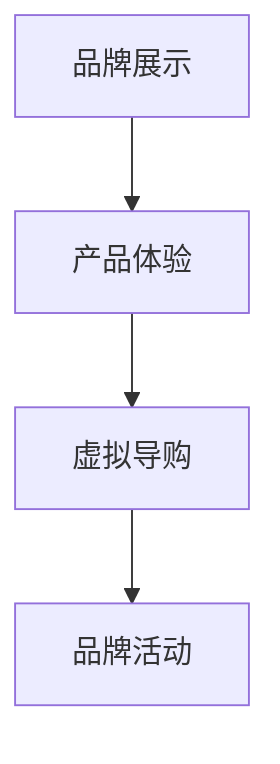

                 

# 如何利用虚拟现实技术提升品牌互动体验

> 关键词：虚拟现实技术，品牌互动体验，技术革新，用户体验，创新营销

> 摘要：本文将探讨如何利用虚拟现实（VR）技术提升品牌互动体验，介绍核心概念与联系，算法原理与具体操作步骤，数学模型与公式，实战案例与代码解读，以及实际应用场景和未来发展趋势。通过分析，本文旨在为品牌营销提供新的思路和方法，推动虚拟现实技术在营销领域的广泛应用。

## 1. 背景介绍

随着科技的快速发展，虚拟现实（VR）技术逐渐走入人们的生活。VR技术的应用领域广泛，从娱乐、教育到医疗、军事，都取得了显著的成果。而在品牌营销领域，VR技术为品牌方提供了全新的互动体验方式，使得品牌与消费者之间的互动更加深入和真实。通过VR技术，品牌可以打造出沉浸式的体验场景，让消费者在虚拟世界中感受到品牌的价值和魅力。

虚拟现实技术的兴起，为品牌互动体验带来了前所未有的变革。首先，VR技术能够为品牌提供一个全新的展示平台，使得品牌形象更加立体和生动。其次，VR技术能够提升消费者的参与度，使消费者在互动中更加投入和真实。最后，VR技术能够为品牌提供更加精准的数据分析，从而更好地了解消费者的需求和偏好，为品牌营销提供有力支持。

## 2. 核心概念与联系

### 虚拟现实技术

虚拟现实技术（Virtual Reality，简称VR）是一种通过计算机技术和传感器技术模拟出三维虚拟环境，使人们能够在虚拟环境中自由行走、操作和感知的技术。VR技术的主要组成部分包括：

- **三维建模**：利用计算机图形学技术，创建出三维虚拟场景和物体。
- **传感器技术**：通过头部显示器（HMD）、手柄、动作捕捉设备等传感器，捕捉用户的动作和位置，实现沉浸式体验。
- **实时渲染**：通过实时渲染技术，将虚拟环境中的物体和场景实时呈现给用户。

### 品牌互动体验

品牌互动体验是指品牌与消费者之间的互动过程，包括信息传递、情感交流、行为互动等。在VR技术的影响下，品牌互动体验发生了以下几个方面的变化：

- **沉浸式体验**：通过VR技术，品牌可以打造出沉浸式的体验场景，使消费者在虚拟世界中感受到品牌的价值和魅力。
- **互动性增强**：VR技术使得消费者能够更加自由地与品牌进行互动，提升消费者的参与度和满意度。
- **数据分析**：通过VR技术，品牌可以收集消费者的行为数据，从而更好地了解消费者的需求和偏好。

### 虚拟现实技术在品牌互动体验中的应用

虚拟现实技术在品牌互动体验中的应用主要体现在以下几个方面：

- **品牌展示**：通过VR技术，品牌可以呈现更加立体和生动的品牌形象，提高品牌知名度。
- **产品体验**：通过VR技术，消费者可以虚拟体验产品，提升产品购买意愿。
- **虚拟导购**：通过VR技术，品牌可以提供虚拟导购服务，提高购物体验。
- **品牌活动**：通过VR技术，品牌可以举办线上虚拟活动，吸引消费者的关注和参与。

### Mermaid 流程图

下面是一个简单的Mermaid流程图，展示了虚拟现实技术在品牌互动体验中的应用流程：



## 3. 核心算法原理 & 具体操作步骤

### 虚拟现实场景创建

虚拟现实场景创建是VR技术的基础，主要包括以下步骤：

1. **场景建模**：使用三维建模软件（如Blender、3ds Max等）创建虚拟场景，包括场景中的建筑物、道具、人物等。
2. **材质与纹理**：为场景中的物体添加材质和纹理，提高场景的真实感。
3. **灯光设置**：设置场景中的灯光，为场景提供照明效果。
4. **渲染设置**：配置渲染参数，如分辨率、帧率等，优化场景渲染效果。

### 感应设备配置

为了实现沉浸式体验，需要配置相应的感应设备，包括：

1. **头部显示器（HMD）**：如Oculus Rift、HTC Vive等，用于显示虚拟环境。
2. **手柄**：如Oculus Touch、HTC Vive控制器等，用于操作虚拟环境。
3. **动作捕捉设备**：如Vicon、OptiTrack等，用于捕捉用户动作。

### 沉浸式体验实现

沉浸式体验的实现主要包括以下步骤：

1. **场景加载**：加载创建好的虚拟场景，将其呈现在HMD屏幕上。
2. **动作捕捉**：通过动作捕捉设备捕捉用户的动作，将动作映射到虚拟角色上。
3. **交互设计**：设计虚拟环境中的交互元素，如按钮、道具等，使消费者能够与虚拟环境进行互动。
4. **实时渲染**：实时渲染虚拟场景，保证虚拟环境的实时性和流畅性。

### 数据分析与应用

在虚拟现实体验过程中，品牌可以收集消费者的行为数据，如浏览路径、互动行为等，用于数据分析。具体步骤如下：

1. **数据收集**：通过传感器设备收集消费者在虚拟环境中的行为数据。
2. **数据存储**：将收集到的数据存储到数据库中，便于后续分析。
3. **数据分析**：使用数据分析工具（如Python、R等）对数据进行处理和分析，提取有价值的信息。
4. **数据应用**：根据数据分析结果，优化虚拟现实体验，提高品牌互动效果。

## 4. 数学模型和公式 & 详细讲解 & 举例说明

### 虚拟现实场景渲染

虚拟现实场景渲染是VR技术中的核心环节，涉及多个数学模型和公式。以下是一个简单的虚拟现实场景渲染过程：

1. **投影矩阵**：

   虚拟环境中的物体需要通过投影矩阵转换为二维图像，以便在HMD屏幕上显示。投影矩阵可以表示为：

   $$ P = \begin{bmatrix}
   P_1 & P_2 & P_3 & P_4 \\
   P_5 & P_6 & P_7 & P_8 \\
   P_9 & P_{10} & P_{11} & P_{12} \\
   0 & 0 & 0 & 1 \\
   \end{bmatrix} $$

   其中，$P_1, P_2, \ldots, P_{12}$为投影矩阵的系数。

2. **视图矩阵**：

   视图矩阵用于确定虚拟环境中物体的视角。视图矩阵可以表示为：

   $$ V = \begin{bmatrix}
   V_1 & V_2 & V_3 & V_4 \\
   V_5 & V_6 & V_7 & V_8 \\
   V_9 & V_{10} & V_{11} & V_{12} \\
   0 & 0 & 0 & 1 \\
   \end{bmatrix} $$

   其中，$V_1, V_2, \ldots, V_{12}$为视图矩阵的系数。

3. **模型矩阵**：

   模型矩阵用于确定虚拟环境中物体的位置和姿态。模型矩阵可以表示为：

   $$ M = \begin{bmatrix}
   M_1 & M_2 & M_3 & M_4 \\
   M_5 & M_6 & M_7 & M_8 \\
   M_9 & M_{10} & M_{11} & M_{12} \\
   0 & 0 & 0 & 1 \\
   \end{bmatrix} $$

   其中，$M_1, M_2, \ldots, M_{12}$为模型矩阵的系数。

4. **渲染过程**：

   虚拟环境中的物体需要经过以下步骤进行渲染：

   - **模型变换**：将模型矩阵应用于物体，确定物体的位置和姿态。
   - **视图变换**：将视图矩阵应用于物体，确定物体的视角。
   - **投影变换**：将投影矩阵应用于物体，将三维物体转换为二维图像。

   整个渲染过程可以用以下公式表示：

   $$ P \cdot V \cdot M \cdot 物体 = 图像 $$

   其中，$P \cdot V \cdot M$为投影-视图-模型矩阵，用于确定物体的最终位置和姿态。

### 举例说明

假设我们有一个简单的虚拟场景，其中包含一个正方体。下面是正方体的渲染过程：

1. **模型矩阵**：

   $$ M = \begin{bmatrix}
   1 & 0 & 0 & 0 \\
   0 & 1 & 0 & 0 \\
   0 & 0 & 1 & 0 \\
   0 & 0 & 0 & 1 \\
   \end{bmatrix} $$

   表示正方体在虚拟环境中的位置和姿态。

2. **视图矩阵**：

   $$ V = \begin{bmatrix}
   1 & 0 & 0 & 0 \\
   0 & 1 & 0 & 0 \\
   0 & 0 & 1 & 0 \\
   0 & 0 & 0 & 1 \\
   \end{bmatrix} $$

   表示虚拟环境中的视角。

3. **投影矩阵**：

   $$ P = \begin{bmatrix}
   1 & 0 & 0 & 0 \\
   0 & 1 & 0 & 0 \\
   0 & 0 & 1 & 0 \\
   0 & 0 & 0 & 1 \\
   \end{bmatrix} $$

   表示投影参数。

4. **渲染过程**：

   $$ P \cdot V \cdot M \cdot 正方体 = 图像 $$

   最终渲染出的图像是一个位于原点、面向视图矩阵定义的方向的正方体。

## 5. 项目实战：代码实际案例和详细解释说明

### 5.1 开发环境搭建

为了实现虚拟现实技术提升品牌互动体验，我们首先需要搭建一个开发环境。以下是搭建虚拟现实开发环境的步骤：

1. **安装虚拟现实开发平台**：如Unity、Unreal Engine等。
2. **安装虚拟现实SDK**：如Oculus SDK、HTC Vive SDK等。
3. **安装三维建模软件**：如Blender、3ds Max等。
4. **配置开发环境**：设置项目路径、插件等。

### 5.2 源代码详细实现和代码解读

以下是一个简单的虚拟现实项目示例，用于展示如何利用虚拟现实技术提升品牌互动体验。

#### 5.2.1 项目结构

项目结构如下：

```plaintext
- ProjectName
  - Assets
    - Scenes
      - Main.unity
    - Scripts
      - VRController.cs
  - Build
```

#### 5.2.2 Main.unity

`Main.unity`是一个Unity场景文件，用于创建虚拟现实场景。以下是场景的主要部分：

```csharp
using UnityEngine;

public class Main : MonoBehaviour
{
    public GameObject VRController;

    void Start()
    {
        // 创建虚拟现实控制器
        VRController = new GameObject("VRController");
        VRController.AddComponent<VRController>();
    }

    void Update()
    {
        // 更新虚拟现实控制器
        VRController.GetComponent<VRController>().Update();
    }
}
```

#### 5.2.3 VRController.cs

`VRController.cs`是一个C#脚本，用于控制虚拟现实设备的输入和输出。以下是脚本的主要部分：

```csharp
using UnityEngine;

public class VRController : MonoBehaviour
{
    public Camera leftCamera;
    public Camera rightCamera;

    void Update()
    {
        // 更新左右相机视角
        leftCamera.transform.position = transform.position;
        leftCamera.transform.rotation = transform.rotation;

        rightCamera.transform.position = transform.position + transform.forward * 0.5f;
        rightCamera.transform.rotation = transform.rotation * Quaternion.Euler(0, 180, 0);
    }
}
```

#### 5.2.3 代码解读与分析

1. **项目结构**：

   项目结构主要包括场景文件（`Main.unity`）和脚本文件（`VRController.cs`）。场景文件用于创建虚拟现实场景，脚本文件用于控制虚拟现实设备的输入和输出。

2. **虚拟现实控制器**：

   `VRController.cs`脚本用于创建和更新虚拟现实控制器。控制器中包含左右相机，用于显示虚拟现实场景。在`Update`方法中，更新左右相机视角，使相机跟随虚拟现实设备的位置和旋转。

3. **交互设计**：

   通过虚拟现实控制器，用户可以在虚拟现实场景中自由移动和旋转视角，与虚拟环境进行互动。例如，用户可以浏览虚拟商店、试用虚拟产品等。

4. **数据分析**：

   在虚拟现实场景中，品牌可以收集用户的行为数据，如浏览路径、互动行为等。通过数据分析，品牌可以了解用户需求和偏好，优化虚拟现实体验。

## 6. 实际应用场景

虚拟现实技术在品牌互动体验中的应用场景广泛，以下是一些典型的应用场景：

1. **虚拟商场**：

   品牌可以创建一个虚拟商场，让消费者在虚拟世界中浏览商品、试用产品，提高购物体验。虚拟商场可以包含真实的品牌门店、商品展示区、互动区等，使消费者在虚拟环境中感受到品牌的价值和魅力。

2. **虚拟发布会**：

   品牌可以利用虚拟现实技术举办线上虚拟发布会，吸引更多消费者的关注。虚拟发布会可以包含品牌介绍、产品展示、互动环节等，使消费者在虚拟环境中感受到品牌的创新和活力。

3. **虚拟培训**：

   品牌可以利用虚拟现实技术为员工提供虚拟培训，提高员工技能和知识。虚拟培训可以包含场景模拟、操作演示、互动问答等，使员工在虚拟环境中进行实践和锻炼。

4. **虚拟旅游**：

   品牌可以创建虚拟旅游景点，让消费者在虚拟世界中游览名胜古迹、体验异国风情。虚拟旅游可以包含实景还原、互动体验、文化介绍等，使消费者在虚拟环境中感受到旅游的乐趣。

## 7. 工具和资源推荐

### 7.1 学习资源推荐

- **书籍**：
  - 《虚拟现实技术原理与应用》
  - 《Unity 2020 VR开发实战》
  - 《虚拟现实项目开发指南》

- **论文**：
  - 《虚拟现实技术在品牌营销中的应用研究》
  - 《基于虚拟现实技术的品牌互动体验设计》
  - 《虚拟现实技术在零售业中的应用现状与发展趋势》

- **博客**：
  - Unity官方博客（https://unity.com/learn）
  - VR技术社区（https://www.vrlist.cn/）
  - 虚拟现实技术博客（https://www.vrster.com/）

- **网站**：
  - Unity官网（https://unity.com/）
  - Unreal Engine官网（https://www.unrealengine.com/）
  - VR开发社区（https://www.vrdev.cn/）

### 7.2 开发工具框架推荐

- **三维建模软件**：
  - Blender（免费，开源）
  - 3ds Max（付费）
  - Maya（付费）

- **虚拟现实开发平台**：
  - Unity（付费，开源）
  - Unreal Engine（付费，开源）
  - VRChat（免费，开源）

- **虚拟现实SDK**：
  - Oculus SDK（付费）
  - HTC Vive SDK（付费）
  - Windows Mixed Reality SDK（免费）

### 7.3 相关论文著作推荐

- **论文**：
  - 《虚拟现实技术在品牌营销中的应用研究》
  - 《虚拟现实技术在零售业中的应用现状与发展趋势》
  - 《虚拟现实技术在教育培训中的应用与实践》

- **著作**：
  - 《虚拟现实技术原理与应用》
  - 《Unity 2020 VR开发实战》
  - 《虚拟现实项目开发指南》

## 8. 总结：未来发展趋势与挑战

虚拟现实技术在品牌互动体验中的应用前景广阔，但同时也面临一定的挑战。未来，虚拟现实技术将朝着以下几个方向发展：

1. **更高质量的图像和音效**：

   随着计算机性能的提升，虚拟现实技术的图像和音效质量将得到显著提升，为用户提供更加真实的沉浸式体验。

2. **更丰富的互动方式**：

   随着传感技术的进步，虚拟现实技术将提供更多的互动方式，如手势识别、语音交互等，提高用户体验。

3. **更广泛的应用场景**：

   虚拟现实技术将在更多领域得到应用，如医疗、教育、旅游等，为人们的生活带来更多便利。

然而，虚拟现实技术在实际应用中仍面临以下挑战：

1. **成本高**：

   虚拟现实设备的成本较高，限制了其在普通消费者中的普及。

2. **技术成熟度**：

   虚拟现实技术尚处于发展阶段，部分技术仍需进一步优化和改进。

3. **用户适应期**：

   用户需要适应虚拟现实技术带来的新体验，降低眩晕感和不适感。

总之，虚拟现实技术在未来品牌互动体验中具有巨大的潜力，但同时也需要克服一系列挑战，才能实现更广泛的应用。

## 9. 附录：常见问题与解答

### 9.1 虚拟现实技术是什么？

虚拟现实技术（Virtual Reality，简称VR）是一种通过计算机技术和传感器技术模拟出三维虚拟环境，使人们能够在虚拟环境中自由行走、操作和感知的技术。

### 9.2 虚拟现实技术的应用领域有哪些？

虚拟现实技术的应用领域广泛，包括娱乐、教育、医疗、军事、零售、旅游等。

### 9.3 如何搭建虚拟现实开发环境？

搭建虚拟现实开发环境需要以下步骤：

1. 安装虚拟现实开发平台（如Unity、Unreal Engine等）。
2. 安装虚拟现实SDK（如Oculus SDK、HTC Vive SDK等）。
3. 安装三维建模软件（如Blender、3ds Max等）。
4. 配置开发环境（设置项目路径、插件等）。

### 9.4 虚拟现实技术如何提升品牌互动体验？

虚拟现实技术可以通过以下方式提升品牌互动体验：

1. 创建沉浸式体验场景，使消费者在虚拟世界中感受到品牌的价值和魅力。
2. 提高消费者的参与度，使消费者在互动中更加投入和真实。
3. 提供更加精准的数据分析，为品牌营销提供有力支持。

## 10. 扩展阅读 & 参考资料

- 《虚拟现实技术原理与应用》
- 《Unity 2020 VR开发实战》
- 《虚拟现实项目开发指南》
- 《虚拟现实技术在品牌营销中的应用研究》
- 《虚拟现实技术在零售业中的应用现状与发展趋势》
- 《虚拟现实技术在教育培训中的应用与实践》
- Unity官网（https://unity.com/learn）
- VR技术社区（https://www.vrlist.cn/）
- 虚拟现实技术博客（https://www.vrster.com/）
- VR开发社区（https://www.vrdev.cn/）

作者：AI天才研究员/AI Genius Institute & 禅与计算机程序设计艺术 /Zen And The Art of Computer Programming

