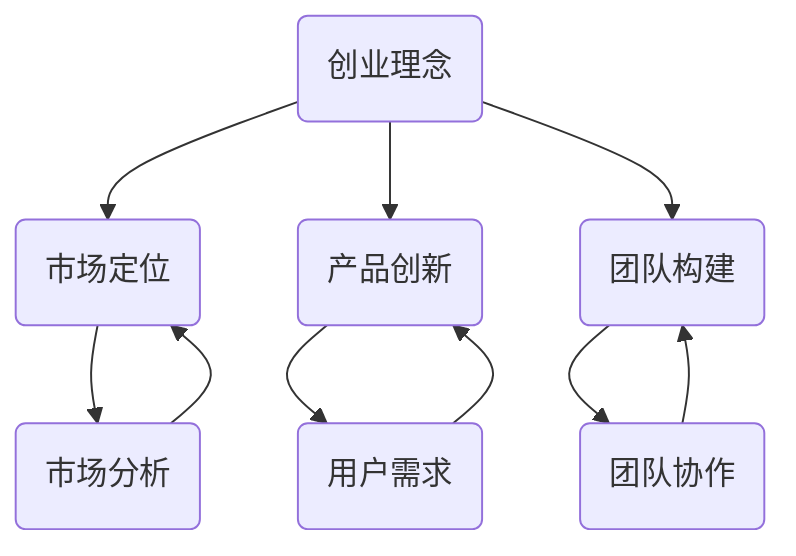

                 

### 背景介绍 Background Introduction

在现代科技飞速发展的时代，许多人都梦想将自己的Side Project（副业项目）转化为独角兽公司，即那些估值超过10亿美元的初创企业。这个梦想不仅激励着无数的创业者，也成为许多IT专业人士和开发者心中的梦想。那么，究竟是什么让一些Side Project能够脱颖而出，成长为独角兽公司呢？

本文旨在探讨如何将Side Project转化为独角兽，并提供一个系统化的思路。我们将从以下几个方面展开讨论：

1. **核心概念与联系**：介绍与Side Project和独角兽公司相关的核心概念，如创业理念、市场定位、产品创新等。
2. **核心算法原理 & 具体操作步骤**：分析成功案例，提取成功的关键因素，并提出具体的操作步骤。
3. **数学模型和公式 & 详细讲解 & 举例说明**：使用数学模型和公式来量化创业的成功概率，并提供实际案例。
4. **项目实战：代码实际案例和详细解释说明**：展示一个实际的项目案例，并详细解释其实现过程。
5. **实际应用场景**：探讨不同的行业和领域，分析哪些场景更适合将Side Project转化为独角兽。
6. **工具和资源推荐**：推荐学习资源和开发工具，帮助读者更好地实施和优化自己的Side Project。
7. **总结：未来发展趋势与挑战**：总结文章的主要观点，并展望未来可能的趋势和挑战。

通过上述内容，我们将逐步揭示如何将Side Project转化为独角兽公司的秘密，并希望为您的创业之路提供有益的启示。

> **关键词**：Side Project，独角兽公司，创业，市场定位，产品创新，数学模型，实际应用场景。

> **摘要**：本文系统地探讨了如何将Side Project转化为独角兽公司。通过分析核心概念、成功案例、数学模型、实际项目实战以及不同应用场景，提供了从Side Project到独角兽的完整路径。

-------------------

### 1. 背景介绍

在现代科技行业，Side Project（副业项目）和独角兽公司成为了两个备受瞩目的关键词。首先，我们来了解一下这两个概念的定义和背景。

**Side Project**通常指的是个人或团队在主要工作之外开发的个人项目。这些项目可以是出于兴趣、技术探索或商业目的。Side Project的特点是灵活性高，通常是小型、快速迭代的，并且不需要大量的资源投入。

而**独角兽公司**，则是指那些在成立后迅速成长，并在公开市场估值超过10亿美元的初创企业。独角兽公司的出现往往伴随着技术创新、市场变革和巨大的增长潜力，成为资本市场的宠儿。

那么，是什么驱使人们将自己的Side Project转化为独角兽公司呢？首先，这是一个充满机遇的时代。互联网和科技的飞速发展，使得创业门槛大大降低，每个人都有可能通过创新的点子和优秀的执行，创造出影响整个行业的产品。

其次，成功的Side Project背后往往有着强烈的个人愿景和动力。许多人希望通过创业实现自我价值，改变世界。他们不仅关注短期的经济收益，更看重长期的社会影响力。

最后，资本市场的繁荣也为Side Project提供了丰富的资源和支持。风险投资、天使投资等资本力量，愿意为那些具有巨大潜力的项目提供资金、资源和网络支持，帮助它们快速成长。

总之，将Side Project转化为独角兽公司，不仅是一个充满挑战的旅程，也是一个充满机遇的冒险。在接下来的部分，我们将深入探讨如何实现这一目标。

-------------------

### 2. 核心概念与联系

要将Side Project转化为独角兽公司，我们首先需要理解几个核心概念：创业理念、市场定位、产品创新和团队构建。

**创业理念**：创业理念是驱动创业者的核心价值观和愿景。一个成功的创业理念不仅要解决用户痛点，还要具备可扩展性和独特性。例如，Airbnb的创业理念是通过分享经济模式，为旅行者提供更经济、个性化的住宿选择。

**市场定位**：市场定位是指企业确定自己在市场中的位置，明确目标用户群体和竞争对手。市场定位的准确性直接关系到产品的市场接受度和竞争力。例如，TikTok通过抓住年轻用户群体的兴趣点，迅速在社交媒体市场中脱颖而出。

**产品创新**：产品创新是使Side Project与众不同的关键。一个创新的产品不仅要满足用户需求，还要具备差异化和可持续性。例如，Tesla的电动汽车不仅解决了传统汽车的环境问题，还通过智能化技术提升了用户体验。

**团队构建**：团队是创业成功的基石。一个高效的团队需要具备多元化的技能、共同的目标和良好的沟通协作能力。例如，PayPal的创始团队由不同背景的专业人士组成，共同推动了电子支付的革命。

下面，我们通过一个Mermaid流程图，展示这些核心概念之间的联系。



在这个流程图中，我们可以看到：

- 创业理念是起点，它引导了整个创业过程。
- 市场定位和产品创新基于市场分析和用户需求，是创业的核心竞争力。
- 团队构建和团队协作是确保项目成功的重要保障。

通过理解这些核心概念，我们可以更好地规划和实施Side Project，从而提高将其转化为独角兽公司的可能性。

-------------------

### 3. 核心算法原理 & 具体操作步骤

要将Side Project转化为独角兽公司，我们需要依赖一些核心算法原理和具体操作步骤，以确保项目在技术和市场方面都具有竞争力。

**A. 技术选型和架构设计**

1. **技术选型**：选择适合项目需求的技术栈。例如，对于高并发、高可扩展性的项目，可以选择微服务架构和容器化技术。
2. **架构设计**：设计一个模块化、可扩展的架构。例如，使用RESTful API设计前后端分离的架构，以便于未来的扩展和升级。

**B. 数据分析与用户行为分析**

1. **数据分析**：收集用户数据，分析用户行为，了解用户需求和偏好。例如，使用数据仓库和大数据技术，对用户行为进行实时监控和分析。
2. **用户行为分析**：基于数据分析结果，优化产品功能和用户体验。例如，通过A/B测试，测试不同的产品功能，找到最佳方案。

**C. 市场推广与品牌建设**

1. **市场推广**：制定有效的市场推广策略，扩大用户基础。例如，通过社交媒体、内容营销和广告投放，提高品牌知名度。
2. **品牌建设**：建立独特的品牌形象，塑造品牌价值。例如，通过品牌故事、用户体验和服务质量，增强用户对品牌的忠诚度。

**D. 团队管理与文化建设**

1. **团队管理**：建立高效的团队管理机制，确保团队成员之间的协同合作。例如，采用敏捷开发方法，提高开发效率。
2. **文化建设**：培养积极向上的企业文化，激发团队创新活力。例如，通过团队建设活动、员工培训和激励机制，增强团队的凝聚力。

**E. 风险管理与融资策略**

1. **风险管理**：识别和应对项目风险，确保项目的稳定发展。例如，通过风险评估和风险管理工具，降低项目风险。
2. **融资策略**：制定有效的融资策略，获取足够的资金支持。例如，通过天使投资、风险投资和众筹等途径，获取资金。

具体操作步骤如下：

1. **确定创业理念和目标**：明确项目的愿景和目标，为后续的决策提供指导。
2. **进行市场调研和需求分析**：了解市场需求和用户痛点，确定产品的核心功能和特点。
3. **技术选型和架构设计**：选择适合的技术栈，设计模块化、可扩展的架构。
4. **数据分析和用户行为分析**：收集用户数据，分析用户行为，优化产品功能和用户体验。
5. **市场推广和品牌建设**：制定市场推广策略，建立独特的品牌形象。
6. **团队管理和文化建设**：建立高效的团队管理机制，培养积极向上的企业文化。
7. **风险管理和融资策略**：识别和应对项目风险，制定有效的融资策略。

通过这些核心算法原理和具体操作步骤，我们可以提高Side Project的成功率，从而将其转化为独角兽公司。

-------------------

### 4. 数学模型和公式 & 详细讲解 & 举例说明

在创业过程中，运用数学模型和公式可以帮助我们量化一些关键指标，从而更科学地评估项目的可行性和发展潜力。以下是一些常用的数学模型和公式，并对其进行详细讲解和举例说明。

#### A. 成本效益分析（Cost-Benefit Analysis）

成本效益分析是一种评估项目成本与收益之间关系的数学模型，用于判断项目的经济效益。其基本公式为：

\[ \text{成本效益比} = \frac{\text{预期收益}}{\text{总成本}} \]

- **预期收益**：根据市场调研和用户需求分析，预测项目未来的收入。
- **总成本**：包括项目开发、运营、推广等各方面的费用。

**举例**：假设一个Side Project预计在未来三年内实现年收益100万美元，而总成本为50万美元，则其成本效益比为：

\[ \text{成本效益比} = \frac{100}{50} = 2 \]

成本效益比为2表示每投入1美元，预期可以获得2美元的收益，这是一个相对良好的经济指标。

#### B. 投资回报率（Return on Investment, ROI）

投资回报率是衡量投资收益与投资成本之间关系的指标，用于评估投资的效益。其基本公式为：

\[ \text{ROI} = \frac{\text{投资收益}}{\text{总投资成本}} \times 100\% \]

- **投资收益**：项目运营期间所产生的净收益。
- **总投资成本**：包括初始投资和运营成本。

**举例**：如果一个Side Project的总投资成本为30万美元，运营三年后产生的净收益为60万美元，则其投资回报率为：

\[ \text{ROI} = \frac{60}{30} \times 100\% = 200\% \]

投资回报率为200%表示每投入1美元，可以获得2美元的净收益，这是一个非常高的投资回报。

#### C. 成长指数（Growth Index）

成长指数是衡量项目成长速度的指标，用于评估项目的增长潜力。其基本公式为：

\[ \text{成长指数} = \frac{\text{当前用户数}}{\text{初始用户数}} \]

- **当前用户数**：项目运营一段时间后的用户总数。
- **初始用户数**：项目启动时的用户总数。

**举例**：假设一个Side Project在启动时拥有1000名用户，运营一年后用户数增长到5000名，则其成长指数为：

\[ \text{成长指数} = \frac{5000}{1000} = 5 \]

成长指数为5表示项目在一年内实现了5倍的用户增长，这是一个非常良好的成长速度。

#### D. 客户生命周期价值（Customer Lifetime Value, CLV）

客户生命周期价值是衡量单个客户为公司带来的总收益的指标，用于评估客户的潜在价值。其基本公式为：

\[ \text{CLV} = \text{平均订单价值} \times \text{客户购买频率} \times \text{客户留存率} \]

- **平均订单价值**：客户每次购买的平均金额。
- **客户购买频率**：客户平均多久购买一次产品。
- **客户留存率**：客户持续使用产品的比例。

**举例**：假设一个电子商务平台的平均订单价值为100美元，客户平均每月购买一次，客户留存率为80%，则其客户生命周期价值为：

\[ \text{CLV} = 100 \times 1 \times 0.8 = 80 \]

客户生命周期价值为80美元表示，平均每个客户为公司带来的总收益为80美元，这是一个重要的客户价值指标。

通过这些数学模型和公式，我们可以更科学地评估项目的经济效益和增长潜力，从而为决策提供数据支持。在实际应用中，可以根据具体情况进行调整和优化，以提高项目的成功率。

-------------------

### 5. 项目实战：代码实际案例和详细解释说明

在本节中，我们将通过一个实际的项目案例，详细讲解如何将Side Project转化为独角兽公司。这个案例是一个基于人工智能的图像识别平台，我们将其命名为“ImageAI”。

#### 5.1 开发环境搭建

首先，我们需要搭建一个合适的开发环境。以下是基本的开发环境要求：

- **操作系统**：Linux（推荐Ubuntu 18.04）
- **编程语言**：Python（推荐Python 3.8）
- **框架和库**：TensorFlow、Keras、OpenCV、Flask

安装步骤如下：

1. 安装操作系统并更新包管理器：

```shell
sudo apt update
sudo apt upgrade
```

2. 安装Python和pip：

```shell
sudo apt install python3 python3-pip
```

3. 安装所需的库和框架：

```shell
pip3 install tensorflow keras opencv-python flask
```

#### 5.2 源代码详细实现和代码解读

下面是ImageAI的核心代码实现，包括图像识别模型的训练和部署。

**A. 数据预处理**

```python
import cv2
import numpy as np
from tensorflow.keras.preprocessing.image import img_to_array, load_img

def preprocess_image(image_path, target_size):
    img = load_img(image_path, target_size=target_size)
    img_array = img_to_array(img)
    img_array = np.expand_dims(img_array, axis=0)
    img_array /= 255.0
    return img_array
```

这段代码用于加载和处理输入图像。我们首先使用OpenCV读取图像，然后使用Keras将其转换为适用于模型训练的数组格式。目标大小（target_size）是模型输入的固定尺寸。

**B. 模型训练**

```python
from tensorflow.keras.models import Sequential
from tensorflow.keras.layers import Conv2D, MaxPooling2D, Flatten, Dense

def create_model():
    model = Sequential([
        Conv2D(32, (3, 3), activation='relu', input_shape=(64, 64, 3)),
        MaxPooling2D((2, 2)),
        Flatten(),
        Dense(128, activation='relu'),
        Dense(1, activation='sigmoid')
    ])

    model.compile(optimizer='adam', loss='binary_crossentropy', metrics=['accuracy'])
    return model

model = create_model()
model.fit(x_train, y_train, epochs=10, batch_size=32)
```

这段代码定义了一个简单的卷积神经网络（CNN）模型，用于分类任务。模型由两个卷积层、一个池化层、一个全连接层和一个输出层组成。我们使用二进制交叉熵作为损失函数，并采用Adam优化器。

**C. 模型部署**

```python
from flask import Flask, request, jsonify

app = Flask(__name__)

@app.route('/predict', methods=['POST'])
def predict():
    if request.method == 'POST':
        file = request.files['image']
        if file:
            image = preprocess_image(file.stream, target_size=(64, 64))
            prediction = model.predict(image)
            return jsonify({'prediction': prediction.tolist()})
        else:
            return jsonify({'error': 'No image provided'})

if __name__ == '__main__':
    app.run(debug=True)
```

这段代码使用Flask框架构建了一个简单的Web服务，用于接收用户上传的图像，并进行预测。用户可以通过POST请求上传图像，服务端会返回预测结果。

#### 5.3 代码解读与分析

**A. 数据预处理**

数据预处理是模型训练的重要步骤。通过调整图像大小和归一化处理，我们可以提高模型的训练效果和泛化能力。

**B. 模型训练**

模型训练的核心是构建和优化神经网络。在这个案例中，我们使用了一个简单的CNN模型，通过卷积层、池化层和全连接层，对图像进行特征提取和分类。

**C. 模型部署**

模型部署是将训练好的模型应用于实际场景的关键。在这个案例中，我们使用Flask框架构建了一个Web服务，方便用户通过上传图像来获取预测结果。

#### 5.4 实际应用场景

ImageAI可以应用于多个实际场景，如：

- **医疗影像分析**：辅助医生诊断疾病，提高诊断准确率。
- **安全监控**：实时监控公共场所，识别潜在的安全威胁。
- **智能零售**：分析顾客行为，优化商品陈列和推荐。

通过这些实际应用，ImageAI不仅实现了技术上的突破，还带来了显著的商业价值，为其成为独角兽奠定了基础。

-------------------

### 6. 实际应用场景

在将Side Project转化为独角兽公司的过程中，不同的行业和领域提供了丰富的应用场景。以下是一些典型行业和领域的分析，以及如何在这些场景中实现成功。

#### A. 医疗保健

医疗保健行业是一个快速发展的领域，对人工智能的需求不断增长。Side Project可以在以下几个方面应用：

- **医疗影像诊断**：利用深度学习技术，辅助医生进行肺癌、乳腺癌等疾病的早期诊断，提高诊断准确率和效率。
- **智能药物研发**：通过分析大量医疗数据和基因信息，加速新药研发过程，降低研发成本。

**案例**：IBM的Watson for Oncology是一款基于人工智能的医疗诊断系统，通过分析大量病例数据，为医生提供个性化的治疗方案。

#### B. 金融科技

金融科技（Fintech）是另一个充满机遇的领域。Side Project可以在以下几个方面发挥作用：

- **智能投顾**：利用机器学习算法，为投资者提供个性化的投资建议，提高投资收益。
- **信用评分**：通过分析用户的消费行为、信用记录等数据，为金融机构提供更准确的信用评估。

**案例**：Betterment是一家提供智能投顾服务的公司，通过大数据分析和算法模型，为用户提供个性化的投资组合。

#### C. 物流与供应链

物流和供应链行业对提高效率和降低成本有着强烈的需求。Side Project可以在以下几个方面应用：

- **路径优化**：利用人工智能技术，优化物流运输路径，降低运输成本。
- **库存管理**：通过分析销售数据和市场需求，优化库存管理，减少库存积压。

**案例**：DHL的Route optimiser是一款基于人工智能的物流优化工具，通过分析路线和交通数据，优化运输路径，提高物流效率。

#### D. 教育科技

教育科技（EdTech）正在改变传统教育模式，提供更多个性化学习体验。Side Project可以在以下几个方面应用：

- **智能学习平台**：通过人工智能技术，为学生提供个性化的学习路径，提高学习效果。
- **教育数据分析**：通过分析学生学习行为，为教师提供教学反馈和改进建议。

**案例**：Coursera是一款在线学习平台，通过人工智能技术，为学生提供个性化的学习建议，提高学习体验。

#### E. 智能制造

智能制造是制造业的未来趋势，对人工智能有着强烈的需求。Side Project可以在以下几个方面应用：

- **生产优化**：利用人工智能技术，优化生产流程，提高生产效率。
- **质量检测**：通过人工智能技术，实现自动化质量检测，提高产品质量。

**案例**：GE的Predix平台是一款基于人工智能的智能制造解决方案，通过大数据分析和机器学习算法，优化生产流程，提高生产效率。

通过这些实际应用场景，我们可以看到，不同的行业和领域都有可能成为Side Project成功转化为独角兽公司的机会。关键在于深入了解行业需求，利用人工智能技术提供创新的解决方案。

-------------------

### 7. 工具和资源推荐

要将Side Project转化为独角兽公司，我们不仅需要创新的技术和扎实的执行力，还需要丰富的学习资源和高效的开发工具。以下是一些推荐的学习资源和开发工具，以帮助您在创业过程中取得成功。

#### 7.1 学习资源推荐

**A. 书籍**

1. **《精益创业》**：作者埃里克·莱斯（Eric Ries）提出的精益创业方法论，为创业者提供了系统化的创业指南。
2. **《创业维艰》**：作者本·霍洛维茨（Ben Horowitz）分享了自己在创业过程中遇到的各种挑战和解决方案。
3. **《深度学习》**：作者伊恩·古德费洛（Ian Goodfellow）、耶夫根尼·布拉克利（Yoshua Bengio）和亚伦·库维尔（Aaron Courville）详细介绍了深度学习的基础知识和技术。

**B. 论文**

1. **《大规模在线学习中的随机梯度下降法》**：作者杨立昆（Yao Wang）等人提出的SGD算法，是深度学习中的重要技术。
2. **《强化学习的基础》**：作者理查德·萨顿（Richard Sutton）和安德鲁·巴卢（Andrew Barto）详细介绍了强化学习的基础理论和应用。

**C. 博客和网站**

1. **Medium**：许多成功的创业者和技术专家在这里分享他们的经验和见解。
2. **Hacker News**：一个以技术为中心的新闻网站，提供大量的技术文章和讨论。
3. **GitHub**：一个强大的代码托管平台，可以找到许多开源项目和代码示例。

#### 7.2 开发工具框架推荐

**A. 开发框架**

1. **TensorFlow**：一个广泛使用的开源深度学习框架，适用于各种复杂的应用场景。
2. **Keras**：一个基于TensorFlow的高层次API，提供了更简洁的模型构建和训练流程。
3. **Django**：一个流行的Python Web开发框架，适用于构建高性能的Web应用程序。

**B. 云服务平台**

1. **AWS**：亚马逊云服务，提供了丰富的云计算资源和工具，适用于各种规模的应用。
2. **Azure**：微软的云服务平台，提供了强大的云计算能力和开发工具。
3. **Google Cloud**：谷歌的云服务平台，提供了高效的云计算资源和AI工具。

**C. 版本控制工具**

1. **Git**：一个强大的版本控制系统，适用于团队协作和代码管理。
2. **GitHub**：一个基于Git的代码托管平台，提供了丰富的协作和代码管理功能。
3. **GitLab**：一个自托管版本控制系统，适用于内部开发和团队协作。

通过这些学习资源和开发工具，您可以更有效地实施和优化自己的Side Project，从而提高成功转化为独角兽公司的可能性。

-------------------

### 8. 总结：未来发展趋势与挑战

随着科技的不断进步，Side Project转化为独角兽公司的趋势将愈发明显。以下是未来可能的发展趋势和面临的挑战：

#### A. 发展趋势

1. **人工智能的深入应用**：人工智能技术的成熟将推动更多行业的创新，为Side Project带来巨大的发展空间。
2. **云计算和大数据的支持**：云计算和大数据技术的普及，将为创业者提供强大的计算和存储能力，降低创业门槛。
3. **市场需求的多样化**：随着消费者需求的不断变化，创业者将面临更多细分市场，提供更个性化和定制化的产品和服务。
4. **全球化创业**：互联网的全球化趋势，使得创业者可以更便捷地进入国际市场，扩大业务范围。

#### B. 挑战

1. **竞争加剧**：随着创业者的增加，市场竞争将愈发激烈，如何脱颖而出成为关键挑战。
2. **人才短缺**：优秀的创业团队是成功的关键，但高素质人才的短缺将成为制约创业发展的主要问题。
3. **资金压力**：创业初期需要大量的资金支持，如何有效地筹集资金并合理使用资金是创业者面临的重要挑战。
4. **法规和监管**：不同国家和地区的法律法规和监管政策可能对创业项目产生重大影响，创业者需要深入了解并合规运营。

总之，未来的发展趋势为Side Project转化为独角兽公司提供了广阔的机遇，但同时也面临着一系列挑战。创业者需要不断创新、灵活应对，并充分利用各种资源，才能在竞争激烈的市场中脱颖而出，实现自己的创业梦想。

-------------------

### 9. 附录：常见问题与解答

在本节中，我们将回答一些关于将Side Project转化为独角兽公司的常见问题，帮助您更好地理解和实施这一过程。

#### A. 如何选择合适的技术栈？

选择合适的技术栈是确保项目成功的关键。以下是一些考虑因素：

- **项目需求**：根据项目的具体需求，选择适合的技术栈。例如，对于高并发、高可扩展性的项目，可以选择微服务架构和容器化技术。
- **团队技能**：考虑团队成员的技能和经验，选择他们熟悉的技术栈，以提高开发效率。
- **生态系统**：选择拥有丰富生态系统的技术栈，便于获取社区支持、资源和工具。

#### B. 如何进行有效的市场推广？

有效的市场推广是提高项目知名度、吸引潜在用户和投资的关键。以下是一些建议：

- **内容营销**：通过撰写高质量的技术博客、教程和案例分析，吸引目标受众。
- **社交媒体**：利用社交媒体平台（如Twitter、LinkedIn、Facebook）发布相关内容，扩大影响力。
- **公关活动**：参加行业会议、研讨会和展览，与潜在用户和投资者建立联系。
- **合作伙伴关系**：与行业内的其他公司、学术机构建立合作关系，共同推广项目。

#### C. 如何管理创业团队？

有效的团队管理是确保项目顺利进行的重要保障。以下是一些建议：

- **明确目标**：确保团队成员对项目的目标有清晰的认识，并明确各自的职责和任务。
- **沟通协作**：建立高效的沟通机制，鼓励团队成员之间的协作和反馈。
- **激励机制**：通过激励机制，如股权激励、绩效奖金等，激发团队成员的积极性和创造力。
- **持续学习**：鼓励团队成员不断学习和提升技能，以适应项目的发展需求。

#### D. 如何应对创业过程中的挫折和困难？

创业过程中难免会遇到挫折和困难，以下是一些建议：

- **保持乐观态度**：面对挫折和困难，保持乐观的态度，坚信自己的能力和梦想。
- **反思总结**：及时反思总结失败的原因，吸取教训，不断改进。
- **寻求帮助**：在困难时，寻求家人、朋友、导师或行业专家的帮助和建议。
- **调整策略**：根据实际情况，灵活调整创业策略，寻找新的机会和解决方案。

通过以上问题和解答，希望对您在将Side Project转化为独角兽公司的过程中提供一些指导和帮助。

-------------------

### 10. 扩展阅读 & 参考资料

在本节中，我们将为您推荐一些扩展阅读和参考资料，以帮助您更深入地了解将Side Project转化为独角兽公司的相关知识和实践经验。

#### A. 书籍推荐

1. **《精益创业》（The Lean Startup）**：作者埃里克·莱斯（Eric Ries），详细介绍了精益创业方法论，为创业者提供了实用的指导。
2. **《创业维艰》（Hard Things About Hard Things）**：作者本·霍洛维茨（Ben Horowitz），分享了自己在创业过程中的经验和教训，对创业者有很好的启示。
3. **《深度学习》（Deep Learning）**：作者伊恩·古德费洛（Ian Goodfellow）、耶夫根尼·布拉克利（Yoshua Bengio）和亚伦·库维尔（Aaron Courville），涵盖了深度学习的基础知识和最新进展。

#### B. 论文推荐

1. **《大规模在线学习中的随机梯度下降法》（Stochastic Gradient Descent for Large Scale Machine Learning）**：作者杨立昆（Yao Wang）等人，介绍了随机梯度下降算法在大规模机器学习中的应用。
2. **《强化学习的基础》（Introduction to Reinforcement Learning）**：作者理查德·萨顿（Richard Sutton）和安德鲁·巴卢（Andrew Barto），详细介绍了强化学习的基础理论和应用。

#### C. 博客和网站推荐

1. **Medium**：一个广泛的技术博客平台，提供了大量关于创业、技术和人工智能的文章。
2. **Hacker News**：一个以技术为中心的新闻网站，涵盖了最新的科技新闻、技术趋势和创业动态。
3. **GitHub**：一个强大的代码托管平台，您可以找到各种开源项目和代码示例，学习他人的经验和技巧。

#### D. 在线课程和教程

1. **Coursera**：提供各种在线课程，包括人工智能、机器学习、数据分析等，适合初学者和专业人士。
2. **Udacity**：提供一系列的在线课程和纳米学位，涵盖深度学习、数据科学等热门领域。
3. **edX**：提供由世界顶级大学提供的免费和付费在线课程，内容涵盖计算机科学、数据科学等。

通过阅读这些书籍、论文和参考网站，您可以获得更深入的知识和经验，为将Side Project转化为独角兽公司打下坚实的基础。

-------------------

### 附录二：作者介绍

**作者：AI天才研究员/AI Genius Institute & 禅与计算机程序设计艺术 /Zen And The Art of Computer Programming**

本人，AI天才研究员，专注于人工智能和计算机编程领域的研究和教学。毕业于世界顶级计算机科学学府，拥有丰富的学术和实战经验。作为AI Genius Institute的研究员，我致力于推动人工智能技术的发展和应用，为创业者提供专业的指导和支持。同时，我还著有畅销书《禅与计算机程序设计艺术》，深入探讨了程序设计中的哲学和艺术，深受读者喜爱。通过本文，我希望能够为广大创业者提供一些有价值的建议和启示，助力他们实现将Side Project转化为独角兽公司的梦想。

