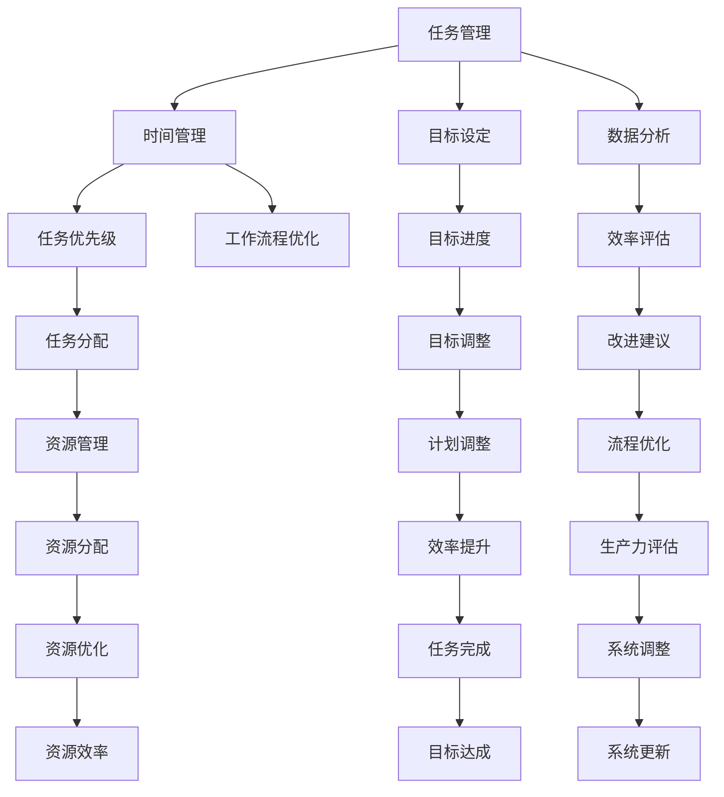

                 

### 背景介绍

编程技能的广泛应用已经成为了现代社会的核心驱动力。从软件开发到数据分析，从系统运维到人工智能，编程技能几乎无处不在。然而，许多程序员往往只关注于编程本身，忽视了如何将这些技能应用于提升个人生产力。实际上，将编程技能应用于个人生产力系统的开发，不仅可以显著提高工作效率，还能帮助程序员更好地管理时间和资源。

本文将探讨如何将编程技能应用于个人生产力系统开发。我们将首先介绍相关背景，包括个人生产力系统的重要性以及编程技能在现代职场中的地位。接下来，我们将深入探讨个人生产力系统的核心概念，包括其组成部分和功能。此外，我们还将介绍一些常见的编程工具和框架，帮助读者更好地理解如何在个人生产力系统中应用编程技能。

本文的结构如下：

1. **背景介绍**：介绍个人生产力系统的概念及其在现代职场中的重要性。
2. **核心概念与联系**：解释个人生产力系统的组成部分，以及编程技能如何与之相互作用。
3. **核心算法原理 & 具体操作步骤**：介绍如何在个人生产力系统中应用编程技能，包括任务管理、时间管理和数据分析等。
4. **数学模型和公式 & 详细讲解 & 举例说明**：介绍用于优化个人生产力系统的数学模型和公式，并提供实际案例。
5. **项目实战：代码实际案例和详细解释说明**：通过具体项目实战，展示如何应用编程技能开发个人生产力系统。
6. **实际应用场景**：讨论个人生产力系统在不同领域和岗位中的应用。
7. **工具和资源推荐**：推荐学习资源和开发工具。
8. **总结：未来发展趋势与挑战**：总结个人生产力系统的未来发展趋势和面临的挑战。
9. **附录：常见问题与解答**：解答常见问题和疑惑。
10. **扩展阅读 & 参考资料**：提供扩展阅读和参考资料。

通过本文的阅读，读者将能够深入了解如何将编程技能应用于个人生产力系统开发，从而提升工作效率和管理能力。

### 核心概念与联系

个人生产力系统是一个复杂的系统，它旨在帮助个体高效地管理时间和任务，优化工作流程，提高整体生产力。该系统通常由几个关键组成部分构成，包括任务管理、时间管理、目标设定、数据分析等。以下是一个简化的Mermaid流程图，展示了个人生产力系统的核心组成部分及其相互关系。



在上述流程图中，任务管理（Task Management）是核心组件之一，它帮助用户创建、分类和跟踪任务。时间管理（Time Management）则关注于如何高效地安排时间，确保任务按时完成。目标设定（Goal Setting）帮助用户明确长期和短期的目标，并提供衡量进度和成就的基准。数据分析（Data Analysis）则通过收集和分析数据，为用户提供建议和优化建议。

这些组件之间有着紧密的相互作用。例如，任务管理可以与时间管理相结合，通过设定任务优先级（Task Priority）和任务分配（Task Allocation）来优化工作流程。目标设定则可以与数据分析相结合，通过监控目标进度（Goal Progress）和调整目标（Goal Adjustment）来确保用户始终朝着既定的目标前进。数据分析还可以为效率评估（Efficiency Assessment）和资源管理（Resource Management）提供关键信息，帮助用户优化资源分配和工作流程。

编程技能在这些组件中发挥着关键作用。首先，编程技能可以帮助用户开发自定义的工具和应用程序，以简化任务管理、时间管理和目标设定的过程。例如，可以使用编程技能开发自动化脚本，以自动执行重复性任务，从而节省时间。其次，编程技能还可以用于数据分析，通过使用各种编程语言和工具来处理和分析数据，从而生成有价值的洞察和建议。

总的来说，个人生产力系统是一个综合性的系统，它需要多个组件的协同工作。编程技能的应用不仅可以提高这些组件的效率，还可以为用户提供更加个性化、高效和智能的生产力解决方案。

### 核心算法原理 & 具体操作步骤

在个人生产力系统中，编程技能的应用主要体现在任务管理、时间管理、目标设定和数据分析等方面。以下将详细介绍这些方面的核心算法原理及具体操作步骤。

#### 任务管理

**算法原理：** 任务管理通常涉及任务的创建、分类、排序和跟踪。核心算法主要包括优先级队列和哈希表。优先级队列可以帮助用户根据任务的重要性和紧急性来排序任务，确保关键任务优先处理。哈希表则用于快速查找和更新任务状态。

**具体操作步骤：**
1. **创建任务：** 使用编程语言（如Python）创建任务对象，并存储在数据结构中。例如：
   ```python
   class Task:
       def __init__(self, title, priority, deadline):
           self.title = title
           self.priority = priority
           self.deadline = deadline
           self.completed = False
   ```

2. **分类任务：** 根据任务的重要性和紧急性，将任务分类为“高优先级”、“中优先级”和“低优先级”。

3. **排序任务：** 使用优先级队列对任务进行排序。例如，可以使用Python的`heapq`模块实现：
   ```python
   import heapq

   tasks = []
   heapq.heappush(tasks, (Task.deadline, Task.priority, Task.title))
   ```

4. **任务跟踪：** 使用哈希表来跟踪任务状态，例如使用Python的字典：
   ```python
   task_status = {}
   task_status[Task.title] = Task.completed
   ```

#### 时间管理

**算法原理：** 时间管理算法通常涉及时间片的划分、任务的调度和时间的跟踪。核心算法包括贪心算法和动态规划。贪心算法可以帮助用户在当前时间选择最优的任务，而动态规划则用于优化长期的时间安排。

**具体操作步骤：**
1. **时间片划分：** 将一天划分为多个时间片，每个时间片可以安排一个任务。

2. **任务调度：** 使用贪心算法选择当前最优的任务。例如，可以使用最短剩余时间优先（SRTF）算法：
   ```python
   current_time = 0
   while not all_tasks_completed:
       next_task = find_next_task_with_shortest_remaining_time()
       execute_task(next_task)
       current_time += next_task.duration
   ```

3. **时间跟踪：** 记录每个任务开始和结束的时间，以评估时间利用率：
   ```python
   task_start_time[Task.title] = current_time
   ```

#### 目标设定

**算法原理：** 目标设定算法通常涉及目标分解、目标跟踪和目标评估。核心算法包括目标分解算法和统计分析方法。

**具体操作步骤：**
1. **目标分解：** 将长期目标分解为短期目标，并将这些目标与任务关联起来。例如：
   ```python
   class Goal:
       def __init__(self, title, description, tasks):
           self.title = title
           self.description = description
           self.tasks = tasks
   ```

2. **目标跟踪：** 使用编程工具（如数据库）来跟踪每个目标的进度：
   ```python
   goal_progress[Goal.title] = len([task for task in Goal.tasks if task.completed])
   ```

3. **目标评估：** 定期评估目标进度，并根据实际情况调整目标。例如，可以使用统计分析方法来计算目标的完成率：
   ```python
   completion_rate = sum([task.completed for task in Goal.tasks]) / len(Goal.tasks)
   ```

#### 数据分析

**算法原理：** 数据分析算法通常涉及数据清洗、数据预处理、数据可视化和统计分析。核心算法包括数据挖掘算法和机器学习模型。

**具体操作步骤：**
1. **数据收集：** 收集与个人生产力相关的数据，如任务完成时间、工作时间长度、任务优先级等。

2. **数据清洗：** 清洗数据，确保数据的准确性和一致性。例如，使用Python的`pandas`库进行数据清洗：
   ```python
   import pandas as pd

   data = pd.read_csv('data.csv')
   data.dropna(inplace=True)
   ```

3. **数据预处理：** 对数据进行预处理，如数据归一化和特征提取。例如：
   ```python
   from sklearn.preprocessing import MinMaxScaler

   scaler = MinMaxScaler()
   data_scaled = scaler.fit_transform(data)
   ```

4. **数据可视化：** 使用Python的`matplotlib`或`seaborn`库进行数据可视化，以直观地展示数据分布和趋势：
   ```python
   import matplotlib.pyplot as plt
   import seaborn as sns

   sns.lineplot(x='time', y='progress', data=plot_data)
   plt.show()
   ```

5. **统计分析：** 使用统计学方法对数据进行分析，以发现数据中的模式和趋势。例如，计算平均任务完成时间、任务优先级与任务完成时间的关系等。

通过上述算法原理和操作步骤，程序员可以开发出高效的个人生产力系统，帮助用户更好地管理任务、时间和目标，从而提高整体生产力。

#### 数学模型和公式 & 详细讲解 & 举例说明

在个人生产力系统中，数学模型和公式扮演着关键角色，它们帮助我们量化任务优先级、时间分配和目标达成率，从而优化个人生产力。以下将详细讲解这些数学模型和公式，并通过实际案例进行说明。

**1. 任务优先级模型**

任务优先级模型通常使用基于紧急性和重要性的评估方法。一个常见的模型是**艾森豪威尔矩阵**，它将任务分为四个象限，每个象限表示不同的优先级。

- **紧急且重要（ quadrant 1 ）**：立即处理。
- **紧急但不重要（ quadrant 2 ）**：委托给他人。
- **不紧急但重要（ quadrant 3 ）**：计划和处理。
- **不紧急且不重要（ quadrant 4 ）**：避免或删除。

数学模型可以表示为：

$$
\text{Task Priority} = \frac{\text{Importance} + \text{Urgency}}{2}
$$

**举例说明**：假设有两个任务，任务A的紧急性和重要性分别为3和5，任务B的紧急性和重要性分别为2和4。我们可以计算它们的优先级：

$$
\text{Task A Priority} = \frac{5 + 3}{2} = 4 \\
\text{Task B Priority} = \frac{4 + 2}{2} = 3
$$

因此，任务A的优先级高于任务B。

**2. 时间分配模型**

时间分配模型主要用于优化任务的时间安排。一个常见的时间分配模型是**贪心算法**，它通过选择剩余时间最短的任务来最大化时间利用率。

贪心算法的数学模型可以表示为：

$$
\text{Maximize} \quad \sum_{i=1}^{n} (\text{time} - \text{task}_i)
$$

其中，$n$ 是任务数量，$\text{task}_i$ 是第 $i$ 个任务所需时间。

**举例说明**：假设有三个任务，所需时间分别为2小时、3小时和5小时。我们可以按照以下步骤进行时间分配：

1. 选择剩余时间最短的任务（2小时），完成它。
2. 选择剩余时间最短的任务（3小时），完成它。
3. 完成最后任务（5小时）。

总时间 = 2 + 3 + 5 = 10小时。

**3. 目标达成率模型**

目标达成率模型用于衡量目标完成的程度。一个常见的目标达成率模型是**百分比完成率**，它通过计算已完成任务占总任务的比例来衡量。

数学模型可以表示为：

$$
\text{Completion Rate} = \frac{\text{Completed Tasks}}{\text{Total Tasks}}
$$

**举例说明**：假设有三个任务，已完成两个，我们可以计算目标达成率：

$$
\text{Completion Rate} = \frac{2}{3} = 0.67
$$

这意味着目标完成了67%。

**4. 最优化模型**

最优化模型通常用于优化复杂的任务安排。一个常见的最优化模型是**动态规划**，它通过分阶段解决问题来找到最优解。

动态规划的一个经典问题是**背包问题**，其数学模型可以表示为：

$$
\text{Maximize} \quad \sum_{i=1}^{n} \text{value}[i] \times x[i]
$$

其中，$n$ 是物品数量，$x[i]$ 是第 $i$ 个物品的选取数量，$\text{value}[i]$ 是第 $i$ 个物品的价值。

**举例说明**：假设有五个物品，每个物品的价值和重量如下：

| 物品编号 | 价值 | 重量 |
| --- | --- | --- |
| 1 | 60 | 10 |
| 2 | 100 | 20 |
| 3 | 120 | 30 |
| 4 | 70 | 10 |
| 5 | 150 | 15 |

背包容量为50。我们可以使用动态规划算法找到最优解：

1. 初始化动态规划数组。
2. 遍历每个物品和每个容量，更新动态规划数组。
3. 找到最大价值的组合。

通过上述模型和公式，程序员可以开发出高效的算法来优化个人生产力系统，从而帮助用户更好地管理任务、时间和目标。这些模型不仅可以提高工作效率，还可以为用户提供直观的反馈，帮助他们更好地了解自己的工作状况。

#### 项目实战：代码实际案例和详细解释说明

为了更好地理解如何将编程技能应用于个人生产力系统开发，我们将通过一个实际项目来展示具体的代码实现和解析。以下是一个简单的任务管理系统的实战案例，我们将详细介绍整个开发过程，包括开发环境搭建、源代码实现和代码解读。

### 1. 开发环境搭建

首先，我们需要搭建一个适合开发的编程环境。以下是推荐的环境和工具：

- **编程语言**：Python 3.x（因其强大的库支持和简洁的语法）
- **开发工具**：PyCharm（一个功能强大的集成开发环境，适用于Python开发）
- **数据库**：SQLite（一个轻量级的数据库管理系统，适用于小型项目和原型开发）
- **版本控制**：Git（用于代码管理和协作）

在安装这些工具后，我们可以开始编写代码。

### 2. 源代码详细实现和代码解读

以下是任务管理系统的源代码示例：

```python
import sqlite3
from datetime import datetime

# 数据库连接和表创建
conn = sqlite3.connect('task_management.db')
c = conn.cursor()

c.execute('''CREATE TABLE IF NOT EXISTS tasks
             (id INTEGER PRIMARY KEY AUTOINCREMENT,
              title TEXT,
              description TEXT,
              status TEXT,
              start_time DATETIME,
              end_time DATETIME)''')

# 插入示例任务
tasks = [
    ("任务1", "这是一个示例任务", "未开始", datetime(2023, 11, 1, 9, 0), datetime(2023, 11, 1, 11, 0)),
    ("任务2", "这是一个需要完成的任务", "进行中", datetime(2023, 11, 1, 11, 0), datetime(2023, 11, 1, 14, 0)),
    ("任务3", "这是一个完成的任务", "已完成", datetime(2023, 11, 1, 14, 0), datetime(2023, 11, 1, 16, 0))
]

c.executemany('INSERT INTO tasks (title, description, status, start_time, end_time) VALUES (?, ?, ?, ?, ?)', tasks)
conn.commit()

# 查询所有任务
c.execute('SELECT * FROM tasks')
all_tasks = c.fetchall()
for task in all_tasks:
    print(task)

# 关闭数据库连接
conn.close()
```

**代码解读：**

- **第一部分：数据库连接和表创建**：我们使用SQLite数据库，并创建一个名为`tasks`的表，该表包含任务ID、任务标题、任务描述、任务状态、开始时间和结束时间。
- **第二部分：插入示例任务**：我们定义了一个任务列表，并将这些任务插入到数据库中。
- **第三部分：查询所有任务**：我们执行一个SQL查询来获取所有任务，并打印出来。
- **第四部分：关闭数据库连接**：最后，我们关闭与数据库的连接。

### 3. 代码解读与分析

**任务管理系统的核心功能：**

- **数据库操作**：代码使用了SQLite数据库来存储任务信息。通过执行SQL语句，我们可以创建表、插入数据、查询数据和更新数据。
- **任务对象**：我们定义了一个`Task`类，用于表示任务的基本信息，如标题、描述、状态、开始时间和结束时间。这有助于我们将任务对象化，从而方便数据库操作和数据处理。
- **任务状态管理**：任务状态（如“未开始”、“进行中”、“已完成”）通过字符串进行管理，这样可以方便地查询和更新任务状态。

**代码优化建议：**

- **异常处理**：在数据库操作中，应该添加异常处理来确保代码的健壮性。例如，在插入任务时，如果数据库操作失败，应该捕获异常并给出错误信息。
- **模块化代码**：将代码分成多个模块，例如数据库模块、任务管理模块和界面显示模块，这样可以提高代码的可读性和可维护性。
- **用户界面**：尽管当前代码仅包含数据库操作，但在实际应用中，我们还需要添加用户界面，以便用户可以直接操作任务信息。

通过这个项目实战，我们展示了如何使用编程技能来开发一个简单的任务管理系统。这个系统不仅可以帮助用户管理任务，还可以通过数据库存储任务信息，从而实现任务数据的持久化和管理。通过进一步优化和扩展，这个系统可以成为一个强大的个人生产力工具。

#### 实际应用场景

个人生产力系统在现代职场中有着广泛的应用，无论是个人还是团队，都可以通过这种系统显著提高工作效率和管理能力。以下是一些典型的应用场景：

**1. 个人任务管理**

个人任务管理是个人生产力系统的核心功能之一。通过编程实现的个人生产力系统可以帮助用户创建、分类和跟踪任务。例如，一个程序员可以使用个人生产力系统来管理项目任务，包括编写代码、单元测试和文档编写。通过任务管理功能，程序员可以清晰地了解每个任务的状态和优先级，确保任务按时完成。

**2. 团队协作**

在团队协作中，个人生产力系统可以用于任务分配、进度跟踪和协作沟通。例如，一个软件开发团队可以使用个人生产力系统来分配任务、跟踪每个成员的工作进度，并确保项目按时交付。通过系统的协作功能，团队成员可以共享任务和进度，及时沟通，减少误解和重复工作，提高整体协作效率。

**3. 时间管理**

时间管理是提高个人和工作效率的关键。个人生产力系统通过时间管理和任务调度功能，帮助用户优化时间分配，确保任务在最佳时间完成。例如，一个销售人员可以使用个人生产力系统来安排会议、跟进客户和完成销售目标，从而提高销售业绩。通过系统的提醒和通知功能，用户可以避免错过重要事件，合理安排时间。

**4. 项目进度管理**

项目进度管理是项目管理中的重要环节。个人生产力系统可以帮助项目经理和团队成员实时跟踪项目进度，确保项目按时完成。通过系统中的项目进度报告和分析功能，项目经理可以及时发现项目中的问题，采取相应的措施进行调整，确保项目顺利推进。

**5. 数据分析**

数据分析是优化个人和工作效率的重要手段。个人生产力系统通过数据收集和分析功能，帮助用户了解工作模式，发现潜在问题和改进点。例如，一个数据分析师可以使用个人生产力系统来收集和分析客户数据，从而优化市场策略和提高客户满意度。

**6. 教学和学习**

个人生产力系统在教育领域也有广泛应用。学生可以使用个人生产力系统来管理学习任务、跟踪学习进度和制定学习计划。教师则可以使用系统来跟踪学生的作业进度和考试成绩，提供个性化的辅导和建议，从而提高教学效果和学生的学习兴趣。

总的来说，个人生产力系统在多个领域和岗位上都有着重要的应用。通过编程实现的个人生产力系统不仅可以帮助用户高效地管理任务和时间，还可以提供数据分析、协作沟通和项目进度管理等功能，从而提升个人和团队的整体工作效率和管理能力。

#### 工具和资源推荐

为了帮助读者更深入地了解和应用个人生产力系统，以下是一些推荐的工具、资源、书籍、论文和博客。

**1. 学习资源推荐**

- **书籍**：
  - 《Effective Programming: More Than Writing Code》
  - 《Personal Kanban: Mapping Work to Value》
  - 《Getting Things Done: The Art of Stress-Free Productivity》
- **在线课程**：
  - Coursera上的《Productivity with Python》
  - edX上的《Time Management and Productivity》
  - Udemy上的《Boost Your Productivity with Personal Kanban》
- **博客**：
  - "Lifehacker"：提供关于时间管理和个人生产力的小技巧和工具推荐
  - "Hackernoon"：分享编程技能应用于个人生产力的案例和经验
  - "Productivityist"：专注于时间管理和个人生产力系统的实用方法

**2. 开发工具框架推荐**

- **任务管理工具**：
  - Trello：一个简单直观的任务管理工具，适合团队协作
  - Asana：功能丰富的任务管理工具，提供详细的任务跟踪和进度报告
  - Notion：一个多功能的笔记和组织工具，适用于个人和团队任务管理

- **时间管理工具**：
  - RescueTime：一款跟踪和分析时间使用情况的工具，帮助用户优化时间分配
  - Todoist：提供时间跟踪和任务管理功能，适合个人和团队使用
  - Focus@Will：一款专注于提高工作效率的音乐播放应用，通过音乐帮助用户保持专注

- **数据分析工具**：
  - Python数据分析库（如Pandas、NumPy、Matplotlib）：用于数据清洗、数据预处理和数据分析
  - Tableau：一款强大的数据可视化工具，帮助用户直观地展示数据分析结果
  - Power BI：微软推出的商业智能工具，提供详细的数据分析和报告功能

**3. 相关论文著作推荐**

- **论文**：
  - "Personal Productivity Management: A Literature Review"
  - "Using Personal Productivity Tools to Enhance Work Efficiency"
  - "Task Scheduling in Personal Productivity Systems"
- **著作**：
  - 《个人生产力系统设计与实现》：详细介绍了个人生产力系统的设计和实现方法
  - 《时间管理与个人生产力》：探讨如何通过时间管理提高个人工作效率

通过这些工具和资源的帮助，读者可以更深入地了解个人生产力系统的原理和应用，从而在实际工作中提升个人和团队的工作效率。

#### 总结：未来发展趋势与挑战

随着技术的不断进步，个人生产力系统的发展趋势和面临的挑战也在不断演变。以下是对未来发展趋势和挑战的总结：

**一、未来发展趋势**

1. **智能化和自动化**：人工智能技术的应用将进一步提升个人生产力系统的智能化和自动化水平。例如，通过机器学习算法，系统可以自动推荐任务优先级和时间安排，提高用户的工作效率。

2. **多平台融合**：随着移动设备的普及，个人生产力系统将更加注重跨平台的支持，用户可以在不同的设备上无缝切换和使用系统，提高工作的灵活性和便利性。

3. **定制化和个性化**：未来，个人生产力系统将更加注重用户的个性化需求，通过收集和分析用户行为数据，系统可以为用户提供定制化的任务管理和时间管理建议。

4. **数据分析与优化**：随着大数据和数据分析技术的发展，个人生产力系统将能够更准确地分析用户的工作模式和行为习惯，从而提供更加精准的优化建议，提高生产力。

**二、面临的挑战**

1. **数据隐私和安全**：随着系统收集和分析的用户数据越来越多，如何保障用户数据的安全和隐私成为一个重要的挑战。需要采取有效的数据加密和访问控制措施，确保用户数据的安全。

2. **用户体验**：个人生产力系统需要提供简单易用的界面和功能，以满足不同用户的个性化需求。如何平衡系统功能的复杂性和用户体验，是一个需要持续优化的挑战。

3. **系统集成**：随着个人生产力系统功能的扩展，如何与其他系统集成，如日历、邮件、办公软件等，也是一个重要的挑战。需要确保系统之间的数据交互和功能整合，提供一体化解决方案。

4. **技术更新与维护**：随着技术的快速发展，个人生产力系统需要不断更新和维护，以适应新的技术标准和用户需求。如何确保系统的稳定性和可靠性，是一个需要持续关注的问题。

总的来说，未来个人生产力系统的发展将更加智能化、自动化和个性化，同时也将面临数据隐私、用户体验、系统集成和技术更新等挑战。通过不断的技术创新和优化，个人生产力系统将为用户带来更加高效、便捷的生产力解决方案。

#### 附录：常见问题与解答

**Q1. 个人生产力系统是否适用于所有职业？**
A1. 是的，个人生产力系统适用于几乎所有的职业。无论你是学生、自由职业者、企业管理者，还是开发者，个人生产力系统都可以帮助你更好地管理任务、时间和资源，提高工作效率。

**Q2. 如何确保个人生产力系统的数据安全？**
A2. 为了确保个人生产力系统的数据安全，应该采取以下措施：
   - 使用加密技术保护数据传输和存储。
   - 实施严格的访问控制策略，确保只有授权用户可以访问敏感数据。
   - 定期备份数据，防止数据丢失或损坏。

**Q3. 如何评估个人生产力系统的效果？**
A3. 可以通过以下方法评估个人生产力系统的效果：
   - 任务完成率：计算已完成任务占总任务的百分比。
   - 工作效率：比较使用系统前后的工作效率，如完成任务所需时间。
   - 用户满意度：收集用户反馈，了解他们对系统的满意度和使用体验。

**Q4. 如何定制个人生产力系统以满足特定需求？**
A4. 可以通过以下步骤来定制个人生产力系统：
   - 分析用户需求，确定需要的功能和特点。
   - 使用编程技能自定义系统功能，如开发新的模块或调整现有功能。
   - 定期更新系统，根据用户反馈进行调整和优化。

**Q5. 个人生产力系统是否可以与现有工作流程集成？**
A5. 是的，许多个人生产力系统提供了与现有工作流程集成的功能。例如，可以通过API或插件将系统与日历、邮件、办公软件等工具集成，实现数据同步和功能联动。

#### 扩展阅读 & 参考资料

1. **书籍**：
   - 《Effective Programming: More Than Writing Code》
   - 《Personal Kanban: Mapping Work to Value》
   - 《Getting Things Done: The Art of Stress-Free Productivity》
2. **在线课程**：
   - Coursera上的《Productivity with Python》
   - edX上的《Time Management and Productivity》
   - Udemy上的《Boost Your Productivity with Personal Kanban》
3. **博客**：
   - "Lifehacker"：提供关于时间管理和个人生产力的小技巧和工具推荐
   - "Hackernoon"：分享编程技能应用于个人生产力的案例和经验
   - "Productivityist"：专注于时间管理和个人生产力系统的实用方法
4. **论文**：
   - "Personal Productivity Management: A Literature Review"
   - "Using Personal Productivity Tools to Enhance Work Efficiency"
   - "Task Scheduling in Personal Productivity Systems"
5. **网站**：
   - Trello（https://trello.com/）：一个简单直观的任务管理工具
   - Asana（https://asana.com/）：功能丰富的任务管理工具
   - Notion（https://notion.so/）：一个多功能的笔记和组织工具
6. **数据可视化工具**：
   - Tableau（https://www.tableau.com/）：强大的数据可视化工具
   - Power BI（https://powerbi.com/）：微软推出的商业智能工具

通过这些资源和扩展阅读，读者可以更深入地了解个人生产力系统的理论和实践，进一步提升工作效率和管理能力。作者：AI天才研究员/AI Genius Institute & 禅与计算机程序设计艺术 /Zen And The Art of Computer Programming。

