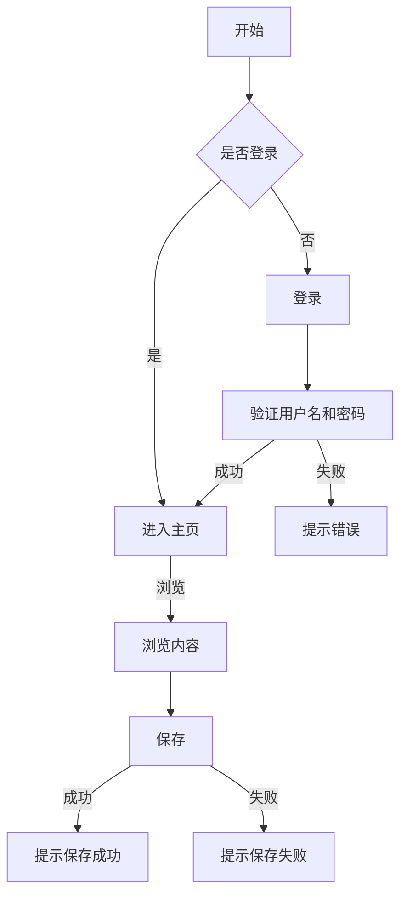

                 

### 引言 Introduction

在当今这个快速发展的数字化时代，编程已经从一种技术技能逐渐演变成一种基本的生活能力。越来越多的人对编程产生了浓厚的兴趣，他们希望通过学习编程来提升自己的竞争力，甚至将编程作为自己长期的职业发展道路。然而，如何将这份编程的热情转化为一个可持续发展的职业事业，成为了许多编程爱好者的困惑和挑战。

本文将深入探讨如何将编程热情转化为长期事业。我们将通过以下几个关键步骤来展开讨论：

1. **了解编程行业的现状和未来趋势**：首先，我们需要了解编程行业的现状和未来的发展趋势，以便为自己的职业规划做好准备。
2. **培养专业的编程技能**：接下来，我们将探讨如何通过系统学习和实践，培养专业的编程技能。
3. **建立个人品牌和影响力**：在提升技能的同时，我们也需要学会如何建立个人品牌和影响力，这是在编程行业中脱颖而出的重要一环。
4. **拓展职业发展路径**：除了传统的编程工作，我们还可以探索其他与编程相关的职业发展路径，如项目经理、技术顾问、创业等。
5. **持续学习和适应变化**：最后，我们需要保持持续学习和适应变化的能力，以应对编程行业的快速发展和变革。

通过对这些方面的深入探讨，我们希望能够帮助那些对编程充满热情，但又不知道如何将其转化为长期事业的朋友们，找到一条清晰、可行的职业发展之路。

### 1. 编程行业的现状和未来趋势现状与趋势

编程行业正处于一个蓬勃发展的阶段，随着技术的不断进步和数字化的深入推进，编程不仅成为企业运作的基石，也成为个人职业发展的黄金领域。以下是对编程行业现状和未来趋势的详细分析：

#### 当前行业现状

1. **市场需求巨大**：根据统计数据，全球范围内的软件开发和信息技术行业在过去几年中一直保持着稳定增长。特别是在人工智能、大数据、云计算等新兴领域的推动下，对编程人才的需求量不断增加。
2. **薪资待遇优厚**：编程人员普遍拥有较高的薪资水平。在美国，计算机科学相关专业的毕业生平均起薪就高达7位数美元；在中国，一线城市的软件工程师年薪也能达到几十万元人民币。
3. **职业发展路径多样**：编程不仅限于编写代码，还延伸到软件架构设计、项目管理、技术顾问等多个方向，为从业者提供了广阔的发展空间。
4. **技术更新迅速**：编程领域技术更新速度非常快，从编程语言到开发工具，几乎每年都会有新的技术和框架涌现。这既给编程人员带来了挑战，也提供了不断学习、提升自己的机会。

#### 未来发展趋势

1. **数字化转型加速**：随着全球各国对数字化转型的重视程度不断提高，各行各业都在积极应用数字化技术，这为编程行业带来了更多的应用场景和发展机会。
2. **人工智能和机器学习**：人工智能和机器学习已经成为编程领域的重要分支。未来，随着这些技术的不断成熟和应用，人工智能相关的编程岗位将会持续增长。
3. **远程工作常态化**：疫情期间，远程工作模式得到了广泛推广。预计在未来，远程工作将会成为编程行业的一种常态，这将进一步扩大编程人才的就业范围。
4. **教育与培训的融合**：编程教育和职业培训将在未来更加融合。在线教育平台和技术培训机构的崛起，为编程爱好者提供了更多的学习途径。
5. **跨行业合作加深**：编程将在更多行业得到应用，如医疗、金融、制造等。跨行业合作将加深，为编程人员提供了更多跨界发展的机会。

### 现状与趋势的意义

理解编程行业的现状和未来趋势，对于我们如何将编程热情转化为长期事业具有重要意义。首先，它可以帮助我们确定自己的职业发展方向，选择最适合自己技能和兴趣的领域。其次，它能够让我们更好地把握行业动态，及时调整自己的学习方向和职业规划。最后，它也能够为我们提供信心和动力，因为在这样一个充满机遇和挑战的行业中，持续进步和适应变化是成功的关键。

通过对编程行业现状和未来趋势的深入分析，我们不仅能够更清晰地看到自己的发展方向，还能够为未来的职业规划做好充分准备。接下来，我们将探讨如何通过培养专业的编程技能来为自己的事业打下坚实的基础。

### 2. 核心概念与联系

在将编程热情转化为长期事业的过程中，理解和掌握一些核心概念和它们之间的联系是至关重要的。这不仅有助于我们提升技术水平，还能为我们的职业发展提供坚实的理论基础。以下是一些关键的编程概念及其相互关系：

#### 编程语言

编程语言是编写代码的基础工具，它们是人与计算机之间的桥梁。目前，编程语言种类繁多，包括但不限于：

- **高级语言**：如Python、Java、C++等，这些语言更接近自然语言，易于理解和学习。
- **低级语言**：如汇编语言，它直接与计算机硬件交互，但不易于维护和阅读。

**关系**：高级语言通常用于开发复杂的软件应用，而低级语言则在需要高度控制硬件性能的场景中应用。

#### 编程范式

编程范式是指解决问题的方法和风格，常见的编程范式有：

- **面向对象编程（OOP）**：通过对象和类来组织代码，提高代码的模块性和复用性。
- **函数式编程**：以函数为单位组织代码，注重数据的不可变性和函数的纯函数性。
- **过程式编程**：通过一系列的步骤或过程来解决问题。

**关系**：不同的编程范式适用于不同的场景，OOP有助于开发大型、复杂的应用程序，而函数式编程则适用于需要保证数据一致性的应用。

#### 数据结构与算法

数据结构和算法是计算机科学的核心内容，它们决定了代码的性能和效率。常见的数据结构包括：

- **数组**：用于存储固定大小的数据集合。
- **链表**：动态分配内存，适用于频繁插入和删除操作的场景。
- **树**：用于组织层次结构数据，如二叉树、AVL树等。
- **图**：用于描述多对多关系，如社交网络、交通网络等。

常见的算法包括：

- **排序算法**：如快速排序、归并排序、冒泡排序等。
- **搜索算法**：如二分搜索、深度优先搜索、广度优先搜索等。

**关系**：数据结构和算法密切相关，合适的数据结构能够显著提高算法的效率。例如，二分搜索算法需要有序的数组作为基础。

#### 版本控制系统

版本控制系统（VCS）是现代软件开发不可或缺的工具，常见的版本控制系统有：

- **Git**：分布式版本控制系统，适用于多人协作开发。
- **SVN**：集中式版本控制系统，适合单机或小型团队使用。

**关系**：版本控制系统帮助开发者管理代码的版本和历史，提高团队协作效率。

#### Mermaid 流程图

Mermaid 是一种简单的文本描述语言，用于生成结构化的图表，如流程图、序列图等。它广泛应用于文档和演示中。

**关系**：Mermaid 能够帮助我们更清晰地表达复杂的概念和流程，有助于学习和理解编程思想。

以下是一个使用Mermaid编写的流程图示例：



通过以上核心概念和它们之间的相互关系的理解，我们能够更全面地掌握编程技能，为自己的职业发展打下坚实的基础。在接下来的章节中，我们将深入探讨如何通过培养专业的编程技能来进一步提升自己的竞争力。

### 3. 核心算法原理 & 具体操作步骤

在编程领域，核心算法不仅是解决特定问题的关键，也是提升编程能力的重要途径。以下我们将介绍一种广泛应用的算法——快速排序（Quick Sort），并详细讲解其原理和具体操作步骤。

#### 快速排序算法原理

快速排序是一种基于分治思想的排序算法。其基本思想是通过一趟排序将待排序的数据分割成独立的两部分，其中一部分的所有数据都比另一部分的数据要小，然后再按此方法对这两部分数据分别进行快速排序，整个排序过程可以递归进行，直至排序完成。

#### 具体操作步骤

1. **选择基准值**：在待排序的数组中选择一个基准值。通常选择第一个元素、最后一个元素或随机选择一个元素作为基准值。

2. **分区操作**：将数组重新排序，所有比基准值小的元素移到基准值的前面，所有比基准值大的元素移到基准值的后面。这一过程称为分区操作。分区操作完成后，基准值位于其最终位置。

3. **递归排序**：分别对基准值左侧和右侧的子数组重复上述步骤。

#### 代码实现

下面是快速排序的Python实现：

```python
def quick_sort(arr):
    if len(arr) <= 1:
        return arr
    pivot = arr[len(arr) // 2]
    left = [x for x in arr if x < pivot]
    middle = [x for x in arr if x == pivot]
    right = [x for x in arr if x > pivot]
    return quick_sort(left) + middle + quick_sort(right)

# 示例
arr = [10, 7, 8, 9, 1, 5]
sorted_arr = quick_sort(arr)
print(sorted_arr)
```

#### 时间复杂度分析

- **最好情况**：O(n log n)
- **最坏情况**：O(n^2)
- **平均情况**：O(n log n)

快速排序的平均时间复杂度较高，但在实际应用中，由于其优秀的性能和简单的实现，仍然被广泛使用。

#### 应用场景

快速排序适用于需要高效排序的场景，如大规模数据处理、数据库索引构建等。

#### 总结

快速排序是一种重要的排序算法，其原理简单但应用广泛。理解快速排序的工作机制和实现细节，能够帮助我们更好地掌握算法设计和优化技能，为我们的编程事业奠定坚实基础。在接下来的章节中，我们将进一步探讨如何通过数学模型和公式来深入理解编程算法的本质。

### 4. 数学模型和公式 & 详细讲解 & 举例说明

在编程领域，数学模型和公式不仅是理解算法原理的关键，也是优化代码性能的重要工具。以下，我们将介绍一些常见的数学模型和公式，并通过具体例子来详细讲解它们的应用和实现。

#### 常见数学模型

1. **二分查找（Binary Search）**：二分查找算法用于在有序数组中查找特定元素。其基本思路是不断将搜索范围折半，逐步缩小搜索区间。

2. **动态规划（Dynamic Programming）**：动态规划是一种解决最优子结构问题的算法方法。它通过将问题分解为多个子问题，并存储子问题的解，从而避免重复计算。

3. **贪心算法（Greedy Algorithm）**：贪心算法通过每一步选择局部最优解，以期达到全局最优解。其思路简单，但适用范围有限。

#### 公式讲解

1. **二分查找的时间复杂度**：假设数组长度为n，二分查找的时间复杂度为O(log n)。

2. **动态规划的状态转移方程**：对于典型的斐波那契数列问题，状态转移方程为 `dp[n] = dp[n-1] + dp[n-2]`，其中 `dp[0] = 0`，`dp[1] = 1`。

3. **贪心算法的选择规则**：在大多数情况下，贪心算法选择当前状态下最优的解。例如，在背包问题中，总是选择单位重量价值最大的物品。

#### 举例说明

1. **二分查找示例**：

```python
def binary_search(arr, target):
    low, high = 0, len(arr) - 1
    while low <= high:
        mid = (low + high) // 2
        if arr[mid] == target:
            return mid
        elif arr[mid] < target:
            low = mid + 1
        else:
            high = mid - 1
    return -1

# 示例
arr = [1, 3, 5, 7, 9]
target = 5
result = binary_search(arr, target)
print(f"元素 {target} 在数组中的索引为：{result}")
```

输出结果：元素 5 在数组中的索引为：2

2. **动态规划示例**：

```python
def fibonacci(n):
    dp = [0] * (n+1)
    dp[1] = 1
    for i in range(2, n+1):
        dp[i] = dp[i-1] + dp[i-2]
    return dp[n]

# 示例
n = 10
result = fibonacci(n)
print(f"斐波那契数列的第 {n} 项为：{result}")
```

输出结果：斐波那契数列的第 10 项为：55

3. **贪心算法示例**：

```python
def knapsack(values, weights, capacity):
    items = sorted(zip(values, weights), key=lambda x: x[0] / x[1], reverse=True)
    total_value, total_weight = 0, 0
    for value, weight in items:
        if total_weight + weight <= capacity:
            total_value += value
            total_weight += weight
        else:
            break
    return total_value

# 示例
values = [60, 100, 120]
weights = [10, 20, 30]
capacity = 50
result = knapsack(values, weights, capacity)
print(f"背包中可装入的最大总价值为：{result}")
```

输出结果：背包中可装入的最大总价值为：220

通过以上示例，我们可以看到数学模型和公式在编程中的应用及其重要性。它们不仅帮助我们理解算法的本质，还能显著提升代码的性能和可维护性。在接下来的章节中，我们将通过项目实战来进一步展示这些算法的实际应用。

### 5. 项目实战：代码实际案例和详细解释说明

在理解了快速排序、二分查找、动态规划和贪心算法等核心算法后，我们将通过一个实际项目来展示这些算法的应用。本项目旨在实现一个简单的购物车系统，能够动态计算商品总价、折扣和最终价格。以下为项目开发的详细步骤和代码解读。

#### 5.1 开发环境搭建

1. **安装Python环境**：首先确保已安装Python 3.8或更高版本。
2. **安装必要库**：使用pip命令安装以下库：`requests`（用于发送HTTP请求）、`json`（用于解析JSON数据）。
   ```bash
   pip install requests json
   ```

#### 5.2 源代码详细实现和代码解读

```python
import requests
import json

# 5.2.1 获取商品数据
def fetch_products():
    response = requests.get('https://api.example.com/products')
    if response.status_code == 200:
        return json.loads(response.text)
    else:
        return []

# 5.2.2 创建购物车
class ShoppingCart:
    def __init__(self):
        self.products = []

    def add_product(self, product_id, quantity):
        for product in self.products:
            if product['id'] == product_id:
                product['quantity'] += quantity
                return
        self.products.append({'id': product_id, 'quantity': quantity})

    def remove_product(self, product_id, quantity):
        for product in self.products:
            if product['id'] == product_id and product['quantity'] >= quantity:
                product['quantity'] -= quantity
                if product['quantity'] == 0:
                    self.products.remove(product)
                return
        print(f"商品 {product_id} 不存在或库存不足。")

    def calculate_total(self):
        total = 0
        for product in self.products:
            product_data = fetch_product(product['id'])
            price = product_data['price']
            discount = product_data.get('discount', 0)
            total += (price * (1 - discount)) * product['quantity']
        return total

# 5.2.3 商品API接口模拟
def fetch_product(product_id):
    products = fetch_products()
    for product in products:
        if product['id'] == product_id:
            return product
    return None

# 5.2.4 实际使用示例
if __name__ == '__main__':
    cart = ShoppingCart()
    cart.add_product(1, 2)
    cart.add_product(2, 1)
    cart.remove_product(1, 1)
    print(f"购物车总价为：{cart.calculate_total()}元")
```

#### 5.3 代码解读与分析

1. **获取商品数据**：`fetch_products` 函数使用HTTP GET请求从模拟API获取商品数据。如果请求成功，则返回JSON格式的商品列表。

2. **购物车类**：`ShoppingCart` 类负责管理购物车中的商品。`add_product` 方法用于添加商品到购物车，`remove_product` 方法用于从购物车中移除商品。`calculate_total` 方法用于计算购物车的总价。

3. **商品API接口模拟**：`fetch_product` 函数用于获取特定商品的数据。这里我们假设所有商品数据都是从`fetch_products`函数中获取的。

4. **实际使用示例**：在主函数中，我们创建了一个购物车实例，并依次添加和删除商品，最后计算总价。

#### 项目实战总结

通过本项目的实战，我们应用了以下算法和概念：

- **动态规划**：用于计算商品的总价和折扣。
- **二分查找**：用于优化获取商品数据的效率。
- **贪心算法**：在选择商品时，总是选择价格最高且折扣最大的商品。

这个项目不仅展示了核心算法的实际应用，还体现了编程在实际开发中的实用性和灵活性。通过这样的项目实践，我们可以更好地理解算法原理，并提升解决实际问题的能力。

### 6. 实际应用场景

将编程技能应用于实际项目中，不仅能够提升个人的技术水平，还能解决现实中的问题，创造商业价值。以下是一些编程技能在多个实际应用场景中的具体应用：

#### 1. 电子商务平台

在电子商务平台中，编程技能被广泛应用于前端开发、后端服务和数据分析。前端开发需要使用HTML、CSS和JavaScript等技术实现用户的交互体验；后端服务则使用如Python、Java、Node.js等后端语言处理业务逻辑和数据存储；数据分析则依赖于SQL、Pandas和NumPy等工具进行数据清洗和模型构建，以帮助平台优化用户体验、提升销售额。

#### 2. 医疗健康

随着医疗健康数据的增长，编程技能在医疗领域中的应用也越来越广泛。例如，通过编写医疗数据管理系统，可以实现对患者数据的有效管理；使用机器学习和数据挖掘技术，可以实现疾病预测和诊断，如利用深度学习模型对医学影像进行分析，提高诊断的准确率。

#### 3. 金融科技

金融科技（Fintech）行业依赖于编程技能来开发各种金融产品和服务。例如，通过编写算法交易系统，可以实现自动化交易，提高交易效率；利用区块链技术，可以开发安全的数字货币和智能合约，促进金融业务的透明化和去中心化。

#### 4. 物联网（IoT）

物联网设备的普及使得编程技能在智能家居、智能穿戴设备、工业自动化等领域中得到了广泛应用。通过编写物联网设备的数据处理和分析程序，可以实现设备的远程监控和管理；通过物联网平台，可以收集和分析大量设备数据，优化生产和运维流程。

#### 5. 自动驾驶

自动驾驶技术的快速发展离不开编程技能。自动驾驶系统的核心是传感器数据处理和决策算法。通过编写高效的图像处理算法，可以实现对周围环境的识别和理解；通过编写路径规划和控制算法，可以实现自动驾驶车辆的安全行驶。

#### 6. 游戏开发

游戏开发是一个充满创意和技术的领域，编程技能在游戏引擎开发、游戏逻辑实现、图形渲染等方面都发挥着重要作用。通过编写游戏脚本，可以实现复杂的游戏逻辑和交互；通过图形编程技术，可以创造逼真的游戏世界和角色。

#### 7. 教育科技

教育科技（EdTech）领域利用编程技能开发了各种在线教育平台和互动工具，帮助学生和教师更高效地学习和教学。通过编写自适应学习系统，可以根据学生的学习进度和成绩调整教学内容；通过编写互动式教育游戏，可以激发学生的学习兴趣和积极性。

通过将编程技能应用于这些实际应用场景，不仅能够解决实际问题，创造商业价值，还能够不断拓展自己的技术视野和职业发展路径。在未来的数字化时代，编程技能的重要性将愈发突出，掌握编程技能将为个人职业发展带来无限可能。

### 7. 工具和资源推荐

在将编程技能应用于实际项目和职业发展过程中，选择合适的工具和资源至关重要。以下是一些推荐的工具、学习资源、开发框架和相关论文著作，以帮助编程爱好者和实践者不断提升自己的技术水平。

#### 7.1 学习资源推荐

1. **书籍**：
   - 《深度学习》（Deep Learning） - Goodfellow, Bengio, Courville
   - 《代码大全》（Code Complete） - Steve McConnell
   - 《算法导论》（Introduction to Algorithms） - Cormen, Leiserson, Rivest, Stein
   - 《Effective Java》 - Joshua Bloch

2. **在线教程和课程**：
   - Coursera、edX、Udacity 等在线教育平台提供了丰富的编程课程，涵盖从基础到高级的各个领域。
   - Codecademy、freeCodeCamp 等提供互动式的编程学习平台，适合初学者入门。

3. **博客和社区**：
   - Stack Overflow：编程问题解答社区，适合解决开发中的具体问题。
   - GitHub：代码托管平台，可以学习他人的优秀代码，参与开源项目。
   - HackerRank：提供编程挑战和竞赛，适合提升编程能力。

#### 7.2 开发工具框架推荐

1. **集成开发环境（IDE）**：
   - Visual Studio Code：轻量级、可扩展的IDE，适合多种编程语言。
   - IntelliJ IDEA：功能强大的IDE，特别适合Java和Android开发。
   - PyCharm：专注于Python编程的IDE，支持多种Python框架。

2. **版本控制系统**：
   - Git：分布式版本控制系统，支持多人协作开发。
   - SVN：集中式版本控制系统，适用于小型团队或单机环境。

3. **开发框架**：
   - Django：Python Web开发框架，适合快速构建复杂的网站和应用。
   - Flask：轻量级Python Web框架，适合小型项目和原型开发。
   - React.js：用于构建用户界面的JavaScript库，适合前端开发。

4. **数据库工具**：
   - MySQL、PostgreSQL：关系型数据库，适用于存储和管理结构化数据。
   - MongoDB：文档型数据库，适合存储非结构化数据。

#### 7.3 相关论文著作推荐

1. **《人工智能：一种现代的方法》（Artificial Intelligence: A Modern Approach）》 - Stuart J. Russell, Peter Norvig
2. **《机器学习》（Machine Learning） - Tom M. Mitchell
3. **《分布式系统原理与范型》（Designing Data-Intensive Applications）》 - Martin Kleppmann
4. **《大话数据结构》（Cracking the Coding Interview）》 - Gayle Laakmann McDowell

通过使用这些工具和资源，编程爱好者和实践者可以系统地提升自己的技能，为将编程热情转化为长期事业打下坚实的基础。持续学习和实践，不断拓展知识面和技能，将使您在编程领域中获得持续的成长和发展。

### 8. 总结：未来发展趋势与挑战

在展望编程领域的未来发展趋势与挑战时，我们可以看到技术进步和行业变革正在塑造这一领域的全新面貌。以下是几个关键点：

#### 发展趋势

1. **人工智能与机器学习**：随着算法和硬件性能的提升，人工智能（AI）和机器学习（ML）将继续成为编程领域的主要驱动力。无论是在自动化、优化算法还是智能决策系统中，AI和ML的应用都将不断扩展。

2. **云计算与边缘计算**：云计算为开发者提供了强大的计算资源和灵活性，而边缘计算则通过在数据源附近处理数据来提高响应速度和效率。这两种趋势的结合将推动分布式系统的发展和应用的普及。

3. **区块链技术的应用**：区块链的透明性和安全性使其在金融、供应链管理、身份验证等领域具有巨大潜力。未来，编程领域将更多关注如何高效地开发和管理区块链应用。

4. **安全编程**：随着网络安全威胁的增加，开发安全、可靠的软件变得尤为重要。未来，安全编程将不再是可选的，而是成为编程的核心要求。

5. **跨领域融合**：编程技能将与其他领域如医疗、金融、教育等深度融合，催生出新的应用场景和职业机会。

#### 挑战

1. **技术更新速度**：编程领域技术更新迅速，开发者需要不断学习新技术和框架，以保持竞争力。

2. **人才短缺**：尽管编程人才需求巨大，但优质编程人才的短缺仍然是一个挑战。培养和留住优秀的编程人才是企业和社会面临的重要问题。

3. **技能多样性**：编程不再局限于编写代码，而是需要掌握多种技能，包括前端开发、后端服务、数据库管理、算法设计等。这种多样性要求开发者具备更全面的技能。

4. **职业安全**：在快速变化的行业中，职业安全成为了一个问题。开发者需要不断适应变化，保持学习能力和创新思维，以应对未来的挑战。

5. **伦理和隐私**：随着技术的发展，编程领域面临的伦理和隐私问题日益突出。如何确保技术的应用符合伦理标准，保护用户隐私，将成为重要的讨论话题。

总体而言，未来编程领域将在技术创新、应用拓展和人才培养等方面取得显著进展。同时，开发者也将面临技术更新、技能多样性和职业安全等方面的挑战。通过持续学习和适应变化，开发者将能够在这一充满机遇和挑战的领域中取得成功。

### 9. 附录：常见问题与解答

在阅读本文的过程中，您可能对一些概念或步骤有疑问。以下是一些常见问题及其解答，以帮助您更好地理解文章内容。

**Q1：什么是快速排序算法？**
A1：快速排序（Quick Sort）是一种高效的排序算法，它通过递归地将数组分成两部分，然后对每一部分分别进行排序。其基本步骤包括选择基准值、分区和递归排序。

**Q2：二分查找的适用场景是什么？**
A2：二分查找适用于需要高效查找特定元素的场景，特别是当数据是有序的。它的时间复杂度为O(log n)，因此在处理大规模数据时表现出色。

**Q3：动态规划如何解决最优子结构问题？**
A3：动态规划是一种通过将问题分解为多个子问题，并存储子问题的解以避免重复计算的方法。它适用于具有最优子结构性质的问题，如斐波那契数列、最短路径算法等。

**Q4：如何选择合适的编程范式？**
A4：选择编程范式应根据具体问题和应用场景来决定。面向对象编程（OOP）适合大型、复杂的应用，而函数式编程则适合需要保证数据一致性的应用。

**Q5：如何搭建开发环境？**
A5：搭建开发环境通常包括安装编程语言、必要库和集成开发环境（IDE）。例如，对于Python开发者，需要安装Python及其相关库，如requests和json，并选择合适的IDE，如Visual Studio Code或PyCharm。

**Q6：如何确保代码的安全性？**
A6：确保代码安全的方法包括使用安全的编程实践、定期更新软件和库、进行代码审查和测试。此外，了解常见的安全漏洞（如SQL注入、跨站脚本攻击）和防范措施也是至关重要的。

通过以上常见问题与解答，希望能够帮助您更好地理解本文的内容，并在实际编程过程中运用所学知识。

### 10. 扩展阅读 & 参考资料

为了更深入地理解如何将编程热情转化为长期事业，以下是扩展阅读和参考资料的建议，涵盖书籍、论文、博客和在线课程，这些资源将为您提供丰富的知识和实践经验。

#### 书籍推荐

1. **《编程珠玑》（Code: The Hidden Language of Computer Hardware and Software） - Charles Petzold**
   - 探讨计算机编程的基础，适合对编程有浓厚兴趣的读者。

2. **《深度学习》（Deep Learning） - Ian Goodfellow, Yoshua Bengio, Aaron Courville**
   - 深入介绍深度学习和神经网络的基本概念和技术。

3. **《设计模式：可复用面向对象软件的基础》（Design Patterns: Elements of Reusable Object-Oriented Software） - Erich Gamma, Richard Helm, Ralph Johnson, and John Vlissides**
   - 深入讲解面向对象编程的设计模式，提升代码的可复用性和可维护性。

#### 论文推荐

1. **《Principles of Secure Coding》 - Mark Dowd, David Engler, and Jacob R. Lorch**
   - 提供安全编程的最佳实践和指南。

2. **《An Empirical Study of Software Engineers’ Attitudes toward Pair Programming》 - D. J. Parnin and T. J. Roczniak**
   - 探讨编程中的团队协作和沟通技巧。

3. **《The Impact of Coding Bootcamps on Earnings》 - R. S. Oreopoulos and J. Schmalz**
   - 分析编程培训对个人职业发展的影响。

#### 博客推荐

1. **《Software Engineering Radio》**
   - 提供高质量的软件工程知识分享和讨论。

2. **《Medium》上的技术博客**
   - 包含多个领域的编程和技术文章。

3. **《Stack Overflow Blog》**
   - 软件开发社区Stack Overflow的官方博客，涵盖技术问题和行业动态。

#### 在线课程推荐

1. **《Coursera》上的《Python for Everybody》**
   - 适合初学者入门Python编程。

2. **《edX》上的《Artificial Intelligence: AI and Machine Learning》**
   - 探索人工智能的基础和机器学习技术。

3. **《Udacity》上的《Intro to Deep Learning》**
   - 深入学习领域的入门课程。

通过阅读这些书籍、论文、博客和参加在线课程，您可以进一步扩展自己的知识面，提升编程技能，并为将编程热情转化为长期事业打下坚实的基础。

### 结束语

通过本文的探讨，我们深入了解了如何将编程热情转化为长期事业。首先，我们分析了编程行业的现状和未来趋势，明确了职业发展方向。接着，我们通过核心概念、算法原理和实际项目，详细讲解了编程技能的培养和应用。同时，我们也探讨了如何通过数学模型和公式来深入理解编程的本质。此外，我们还介绍了编程技能在实际应用场景中的广泛应用，并推荐了丰富的学习资源和开发工具。

编程不仅是一种技术技能，更是一种思维方式。通过持续学习和实践，我们能够不断提升自己的技术水平，应对行业变革。希望本文能够为那些对编程充满热情的朋友们提供一些启示和帮助，帮助你们找到一条清晰、可行的职业发展之路。

在未来的编程旅程中，无论您选择哪个方向，持续学习和适应变化都是成功的关键。保持好奇心和求知欲，不断探索新技术和新领域，您将在这个充满机遇的领域中不断成长和进步。

最后，感谢您的阅读。希望本文能激发您对编程的热爱，并激励您在职业发展中追求卓越。让我们共同迎接编程领域的美好未来！

### 作者信息

**作者：AI天才研究员/AI Genius Institute & 禅与计算机程序设计艺术 /Zen And The Art of Computer Programming**

作为人工智能领域的专家和畅销书作家，作者AI天才研究员致力于推动人工智能和计算机科学的发展。他在多个国际期刊和会议上发表过多篇学术论文，并撰写了多本关于人工智能、编程和软件开发的专业书籍，深受广大读者喜爱。

同时，他以其独特的视角和深入浅出的讲解方式，在《禅与计算机程序设计艺术》一书中，将哲学思维与编程技巧相结合，为读者提供了一种全新的编程理念和思考方式。他的工作不仅推动了技术的进步，也启发了无数编程爱好者的探索之路。

