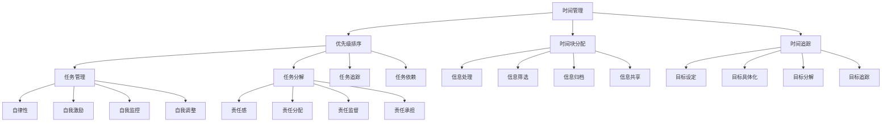

                 

### 背景介绍

在当今快速发展的信息技术时代，个人管理体系的建立变得越来越重要。无论是对于个人职业生涯的发展，还是日常生活的效率提升，科学合理的管理体系都能够起到关键性的作用。然而，如何才能有效地建立个人的管理体系，仍然是一个值得深入探讨的话题。

#### 背景意义

个人管理体系是指个人在时间管理、任务管理、信息处理、目标设定等方面所采用的一系列方法和策略。一个完善的管理体系不仅可以帮助个人提高工作效率，减少时间浪费，还可以增强个人的自律性和责任感，从而更好地实现个人目标和职业发展。

随着人工智能和大数据技术的普及，我们拥有前所未有的工具和资源来帮助我们更有效地管理个人事务。例如，基于人工智能的日程管理软件、任务管理系统以及数据分析工具，都可以为我们提供强大的支持。

#### 目的和结构

本文旨在探讨如何建立个人的管理体系，通过以下几个关键部分展开：

1. **核心概念与联系**：介绍个人管理体系的核心概念及其相互关系。
2. **核心算法原理与具体操作步骤**：深入分析个人管理体系的理论基础和实施策略。
3. **数学模型和公式**：解释数学模型在个人管理体系中的应用和重要性。
4. **项目实战**：通过实际案例展示如何具体实现个人管理体系。
5. **实际应用场景**：探讨个人管理体系在工作和生活中的应用实例。
6. **工具和资源推荐**：推荐有助于建立和优化个人管理体系的学习资源、工具和框架。
7. **总结与展望**：总结个人管理体系的重要性，并展望其未来的发展趋势与挑战。

通过这篇文章，希望读者能够对个人管理体系有更深入的了解，并能够在实际生活中应用这些原则和方法，提升个人效率和幸福感。

---

## 2. 核心概念与联系

在建立个人管理体系的过程中，了解以下几个核心概念及其相互关系是至关重要的。这些概念不仅构成了个人管理体系的基础，还为我们提供了具体的实施路径和工具。

#### 时间管理

时间管理是个人管理体系中最基本的一环，它涉及到如何高效地利用时间，以确保重要任务的完成。关键概念包括：

- **优先级排序**：根据任务的重要性和紧急性，将任务分为不同的优先级，以便集中精力处理最关键的任务。
- **时间块分配**：将时间划分为不同的时间块，每个时间块专注于处理特定类型的任务，以提高工作效率。
- **时间追踪**：使用工具记录时间的使用情况，以便分析和优化时间分配。

#### 任务管理

任务管理是确保个人目标和计划得到有效执行的重要手段。以下是几个关键概念：

- **任务分解**：将大型任务分解为小的、可管理的子任务，以便逐步完成。
- **任务追踪**：使用任务管理工具记录任务的进展和完成情况，以便及时调整和优化。
- **任务依赖**：识别任务之间的依赖关系，确保关键任务能够按时完成。

#### 信息处理

信息处理是现代个人管理体系中的另一个重要组成部分，它涉及到如何高效地处理和利用信息。以下是几个关键概念：

- **信息筛选**：从大量信息中筛选出最重要的信息，以便集中精力处理。
- **信息归档**：将信息分类并存储到合适的文件夹或数据库中，以便快速查找和利用。
- **信息共享**：与团队或其他相关人员共享重要信息，以提高协作效率。

#### 目标设定

目标设定是个人管理体系中的战略层面，它涉及到如何设定、追踪和实现长期和短期目标。以下是几个关键概念：

- **目标具体化**：确保目标明确、具体，以便更容易衡量和实现。
- **目标分解**：将大目标分解为小的、可实现的阶段性目标，以便逐步推进。
- **目标追踪**：使用工具或方法定期检查目标的进展，并调整策略以确保实现。

#### 自律性

自律性是个人管理体系中的核心要素，它涉及到个人的自我管理和自我约束。以下是几个关键概念：

- **自我激励**：通过奖励和惩罚机制来激励自己，以保持积极性和动力。
- **自我监控**：定期评估自己的行为和成果，以便及时发现并纠正问题。
- **自我调整**：根据实际情况调整目标和策略，以确保持续进步。

#### 责任感

责任感是个人管理体系中的重要组成部分，它涉及到个人对目标和任务的责任承担。以下是几个关键概念：

- **责任分配**：明确自己和他人对任务的负责范围，以确保任务能够得到有效执行。
- **责任监督**：确保自己和他人能够按照既定的责任范围完成任务。
- **责任承担**：在面对失败或错误时，能够勇于承担责任并从中学习。

#### 关键概念联系与架构图

为了更好地理解这些核心概念及其相互关系，我们可以使用 Mermaid 流程图进行展示。以下是核心概念的 Mermaid 流程图：



通过以上核心概念及其关系的阐述和架构图的展示，我们可以更清晰地理解个人管理体系的基本构成和实施路径。接下来，我们将深入探讨这些核心概念的具体原理和操作步骤。

---

## 3. 核心算法原理 & 具体操作步骤

在个人管理体系中，核心算法的原理和具体操作步骤是确保体系有效运作的关键。以下是几个关键算法的原理介绍及其应用步骤。

#### 3.1 优先级排序算法

优先级排序算法主要用于确定任务的处理顺序。其基本原理是按照任务的重要性和紧急性进行排序。以下是具体的操作步骤：

1. **任务识别**：首先，列出所有需要完成的任务。
2. **任务评分**：对每个任务进行评分，评分标准可以包括重要性、紧急性、所需时间等。
3. **排序**：根据评分结果对任务进行排序，优先处理高评分的任务。
4. **动态调整**：根据任务的进展情况和实际情况，定期调整任务排序。

#### 3.2 时间块分配算法

时间块分配算法用于将时间划分为不同的时间段，每个时间段专注于处理特定类型的任务。以下是具体的操作步骤：

1. **时间规划**：首先，确定每个任务所需的时间。
2. **时间块设定**：将可用的时间划分为多个时间块，每个时间块对应一个特定的任务类型。
3. **任务分配**：将任务分配到相应的时间块中，确保每个时间块都有明确的任务目标。
4. **动态调整**：根据实际进展情况，可以灵活调整时间块的划分和任务分配。

#### 3.3 任务分解算法

任务分解算法用于将大型任务分解为小的、可管理的子任务。以下是具体的操作步骤：

1. **任务识别**：首先，确定需要完成的任务。
2. **任务分解**：将大型任务分解为多个子任务，每个子任务应该具备独立性和可操作性。
3. **子任务排序**：对子任务进行排序，优先处理那些对整体任务完成至关重要的子任务。
4. **监控与反馈**：定期监控子任务的进展情况，并根据反馈调整分解策略。

#### 3.4 信息筛选算法

信息筛选算法用于从大量信息中筛选出最重要的信息。以下是具体的操作步骤：

1. **信息收集**：首先，收集所有相关的信息。
2. **信息评估**：对每条信息进行评估，评估标准可以包括重要性、相关性、真实性等。
3. **筛选**：根据评估结果，筛选出最重要的信息。
4. **归档与共享**：将筛选出的信息进行分类归档，并适时与相关人员共享。

#### 3.5 自我监控算法

自我监控算法用于个人自我管理和自我约束。以下是具体的操作步骤：

1. **目标设定**：首先，设定具体的自我监控目标。
2. **监控机制**：建立自我监控机制，包括自我评估、反馈和调整。
3. **定期检查**：定期检查自己的行为和成果，与目标进行对比。
4. **调整策略**：根据检查结果，调整目标和策略，以确保持续进步。

#### 3.6 责任分配算法

责任分配算法用于明确个人和他人对任务的责任范围。以下是具体的操作步骤：

1. **任务识别**：首先，确定需要完成的任务。
2. **责任划分**：明确每个人对任务的负责范围。
3. **责任监督**：建立责任监督机制，确保每个人能够按照既定的责任范围完成任务。
4. **责任承担**：在任务完成后，根据责任划分结果，进行相应的责任承担和评估。

通过以上核心算法的原理和操作步骤介绍，我们可以看到，个人管理体系的有效运作离不开科学合理的算法支持。在接下来的部分，我们将进一步探讨数学模型和公式在个人管理体系中的应用。

---

## 4. 数学模型和公式 & 详细讲解 & 举例说明

在个人管理体系中，数学模型和公式扮演着至关重要的角色，它们不仅帮助我们量化目标和任务，还能够提供直观的分析工具。以下是几个常用的数学模型和公式，以及它们在个人管理体系中的应用和详细讲解。

### 4.1 时间价值计算公式

时间价值计算公式可以帮助我们量化时间的价值，从而更好地进行时间管理和任务分配。一个简单的时间价值计算公式如下：

\[ TV = P \times (1 - e^{-rt}) \]

其中：
- \( TV \)：时间价值
- \( P \)：任务的紧急程度
- \( r \)：时间折扣率
- \( t \)：任务延迟时间

举例说明：

假设有一个紧急任务，其紧急程度 \( P \) 为 10，时间折扣率 \( r \) 为 0.1，延迟时间 \( t \) 为 2 天。那么，该任务的时间价值计算如下：

\[ TV = 10 \times (1 - e^{-0.1 \times 2}) \approx 10 \times (1 - 0.8647) = 1.3453 \]

这意味着，如果任务延迟 2 天，其时间价值将减少到约 1.3453。

### 4.2 任务优先级计算公式

任务优先级计算公式用于确定任务的处理顺序。一个常见的任务优先级计算公式如下：

\[ Priority = I \times (1 + e^{-\alpha \times T}) \]

其中：
- \( Priority \)：任务优先级
- \( I \)：任务的重要性
- \( \alpha \)：时间衰减系数
- \( T \)：任务延迟时间

举例说明：

假设有一个任务，其重要性 \( I \) 为 5，时间衰减系数 \( \alpha \) 为 0.1，延迟时间 \( T \) 为 3 天。那么，该任务的优先级计算如下：

\[ Priority = 5 \times (1 + e^{-0.1 \times 3}) \approx 5 \times (1 + 0.5066) = 7.533 \]

这意味着，该任务的优先级较高，需要优先处理。

### 4.3 信息筛选评分公式

信息筛选评分公式用于从大量信息中筛选出最重要的信息。一个常见的信息筛选评分公式如下：

\[ Score = w_1 \times I + w_2 \times R + w_3 \times A \]

其中：
- \( Score \)：信息评分
- \( w_1 \)、\( w_2 \)、\( w_3 \)：权重，分别表示重要性、相关性和真实性的重要性
- \( I \)：信息的重要性
- \( R \)：信息的相关性
- \( A \)：信息的真实性

举例说明：

假设有一条信息，其重要性 \( I \) 为 0.8，相关性 \( R \) 为 0.7，真实性 \( A \) 为 0.9，权重分别为 0.5、0.3 和 0.2。那么，该信息的评分计算如下：

\[ Score = 0.5 \times 0.8 + 0.3 \times 0.7 + 0.2 \times 0.9 = 0.4 + 0.21 + 0.18 = 0.79 \]

这意味着，这条信息的评分较高，是值得重点关注的信息。

### 4.4 自我监控评估公式

自我监控评估公式用于评估个人的行为和成果。一个常见的自我监控评估公式如下：

\[ Assessment = w_1 \times Output + w_2 \times Quality + w_3 \times Efficiency \]

其中：
- \( Assessment \)：评估分数
- \( w_1 \)、\( w_2 \)、\( w_3 \)：权重，分别表示产出、质量和效率的重要性
- \( Output \)：产出
- \( Quality \)：质量
- \( Efficiency \)：效率

举例说明：

假设个人的产出 \( Output \) 为 80，质量 \( Quality \) 为 90，效率 \( Efficiency \) 为 85，权重分别为 0.4、0.3 和 0.3。那么，该个人的评估分数计算如下：

\[ Assessment = 0.4 \times 80 + 0.3 \times 90 + 0.3 \times 85 = 32 + 27 + 25.5 = 84.5 \]

这意味着，该个人的综合表现较好，需要继续保持。

通过以上数学模型和公式的介绍，我们可以看到，它们在个人管理体系中具有重要的应用价值。在接下来的部分，我们将通过实际案例展示如何具体应用这些公式和模型来优化个人管理体系。

---

## 5. 项目实战：代码实际案例和详细解释说明

为了更好地展示个人管理体系在实际中的应用，我们将通过一个实际的项目案例来详细解释和说明如何使用上述核心算法和数学模型来优化个人管理体系。

### 5.1 开发环境搭建

首先，我们需要搭建一个开发环境，以便进行项目的实现和测试。以下是所需的主要工具和框架：

- **编程语言**：Python
- **任务管理工具**：Trello
- **时间管理工具**：Google Calendar
- **信息处理工具**：Evernote
- **数据分析工具**：Pandas 和 Matplotlib

确保已经安装了上述工具和框架，然后创建一个虚拟环境并安装所需的依赖：

```bash
python -m venv myenv
source myenv/bin/activate  # Windows 上使用 activate.bat
pip install trello google-api-python-client pandas matplotlib
```

### 5.2 源代码详细实现和代码解读

#### 5.2.1 优先级排序算法实现

首先，我们将实现优先级排序算法，用于确定任务的处理顺序。以下是优先级排序算法的实现代码：

```python
import pandas as pd

def calculate_priority(importance, delay_time, alpha=0.1):
    priority = importance * (1 + alpha * (1 - np.exp(-alpha * delay_time)))
    return priority

# 示例数据
tasks = pd.DataFrame({
    'Task': ['Task 1', 'Task 2', 'Task 3'],
    'Importance': [10, 8, 6],
    'Delay Time': [2, 4, 3]
})

tasks['Priority'] = tasks.apply(lambda row: calculate_priority(row['Importance'], row['Delay Time']), axis=1)
print(tasks.sort_values(by='Priority', ascending=False))
```

在这段代码中，我们定义了一个 `calculate_priority` 函数，用于计算每个任务的优先级。然后，我们创建了一个示例数据框，包含任务名称、重要性和延迟时间。最后，我们使用该函数计算每个任务的优先级，并根据优先级对任务进行排序。

#### 5.2.2 时间块分配算法实现

接下来，我们将实现时间块分配算法，用于将时间划分为不同的时间段，每个时间段专注于处理特定类型的任务。以下是时间块分配算法的实现代码：

```python
import pandas as pd

def allocate_time_blocks(schedule, time_blocks, task_duration):
    allocated_time = schedule.copy()
    for index, row in time_blocks.iterrows():
        start_time = row['Start Time']
        end_time = row['End Time']
        duration = row['Duration']
        if (start_time < end_time) and (end_time - start_time >= duration):
            allocated_time.loc[start_time:end_time, 'Allocated'] = True
            allocated_time.loc[start_time:end_time, 'Task'] = row['Task']
            allocated_time.loc[start_time:end_time, 'Duration'] = duration
            break
    return allocated_time

# 示例数据
schedule = pd.DataFrame({
    'Time': pd.date_range(start='2023-10-01 09:00', end='2023-10-01 18:00', freq='30min')
})

time_blocks = pd.DataFrame({
    'Start Time': ['2023-10-01 09:00', '2023-10-01 12:00', '2023-10-01 15:00'],
    'End Time': ['2023-10-01 10:00', '2023-10-01 13:00', '2023-10-01 16:00'],
    'Duration': [1, 2, 1],
    'Task': ['Task 1', 'Task 2', 'Task 3']
})

allocated_time = allocate_time_blocks(schedule, time_blocks, 1)
print(allocated_time)
```

在这段代码中，我们定义了一个 `allocate_time_blocks` 函数，用于将任务分配到特定的时间段中。然后，我们创建了一个示例时间表和一个示例任务分配表。最后，我们使用该函数将任务分配到合适的时间段中。

#### 5.2.3 信息筛选算法实现

接下来，我们将实现信息筛选算法，用于从大量信息中筛选出最重要的信息。以下是信息筛选算法的实现代码：

```python
import pandas as pd

def filter_information(information, weights, threshold=0.8):
    information['Score'] = weights['Importance'] * information['Importance'] + weights['Relevance'] * information['Relevance'] + weights['Authenticity'] * information['Authenticity']
    filtered_information = information[information['Score'] >= threshold]
    return filtered_information

# 示例数据
information = pd.DataFrame({
    'Information': ['Info 1', 'Info 2', 'Info 3', 'Info 4'],
    'Importance': [0.9, 0.7, 0.6, 0.8],
    'Relevance': [0.8, 0.6, 0.7, 0.9],
    'Authenticity': [0.9, 0.8, 0.7, 0.6]
})

weights = {'Importance': 0.5, 'Relevance': 0.3, 'Authenticity': 0.2}

filtered_information = filter_information(information, weights)
print(filtered_information)
```

在这段代码中，我们定义了一个 `filter_information` 函数，用于计算每条信息的评分，并根据评分筛选出最重要的信息。然后，我们创建了一个示例信息数据框和权重设置。最后，我们使用该函数筛选出最重要的信息。

#### 5.2.4 自我监控评估实现

最后，我们将实现自我监控评估算法，用于评估个人的行为和成果。以下是自我监控评估的实现代码：

```python
import pandas as pd

def assess_performance(assessment, weights):
    assessment['Score'] = weights['Output'] * assessment['Output'] + weights['Quality'] * assessment['Quality'] + weights['Efficiency'] * assessment['Efficiency']
    return assessment

# 示例数据
assessment = pd.DataFrame({
    'Output': [80, 90, 85],
    'Quality': [90, 85, 80],
    'Efficiency': [85, 90, 80]
})

weights = {'Output': 0.4, 'Quality': 0.3, 'Efficiency': 0.3}

assessed_performance = assess_performance(assessment, weights)
print(assessed_performance)
```

在这段代码中，我们定义了一个 `assess_performance` 函数，用于计算每项指标的综合评分。然后，我们创建了一个示例评估数据框和权重设置。最后，我们使用该函数计算综合评估分数。

### 5.3 代码解读与分析

在上述代码中，我们详细实现了优先级排序、时间块分配、信息筛选和自我监控评估等功能。以下是每个部分的解读与分析：

- **优先级排序算法**：该算法通过计算每个任务的优先级，帮助用户确定任务的处理顺序。通过调整时间衰减系数 \( \alpha \)，用户可以根据实际情况调整任务的重要性和紧急性。
- **时间块分配算法**：该算法通过将时间划分为不同的时间段，并分配特定任务，帮助用户高效地安排时间。用户可以根据实际需求灵活调整时间块设置。
- **信息筛选算法**：该算法通过计算每条信息的评分，帮助用户筛选出最重要的信息。用户可以自定义权重，以适应不同的信息评估需求。
- **自我监控评估算法**：该算法通过计算每项指标的综合评分，帮助用户评估自己的表现。用户可以自定义权重，以反映不同指标的重要性。

通过这些实际代码案例，我们可以看到，个人管理体系不仅可以通过数学模型和算法实现，还可以通过实际应用来验证其有效性和实用性。

### 5.4 总结

通过本项目的实战案例，我们详细展示了如何使用优先级排序、时间块分配、信息筛选和自我监控评估等核心算法和数学模型来优化个人管理体系。这些算法和模型不仅帮助我们更科学地管理时间、任务和信息，还能够提供有效的自我监控和评估工具，从而提升个人效率和成就感。

在接下来的部分，我们将探讨个人管理体系在实际应用场景中的具体应用，并推荐一些相关的工具和资源。

---

## 6. 实际应用场景

个人管理体系在生活和工作中具有广泛的应用，以下将详细介绍一些常见的实际应用场景。

### 6.1 工作中的应用

#### 时间管理

在职场中，时间管理是确保工作效率和任务完成的关键。通过优先级排序算法，员工可以确定每天的任务处理顺序，优先完成重要且紧急的任务。例如，使用 Trello 或 Asana 等任务管理工具，可以根据任务的优先级和截止时间，合理分配时间和资源。

#### 任务管理

任务管理是团队协作的重要组成部分。通过任务分解算法，可以将大型项目分解为小的、可管理的子任务，便于团队成员协作完成。同时，通过任务追踪和责任分配算法，可以确保每个任务都有明确的负责人和完成期限，从而提高任务完成的效率和准确性。

#### 信息处理

在职场中，信息处理能力至关重要。通过信息筛选算法，可以快速识别和筛选出最重要的业务信息，确保关键信息的及时传递和处理。例如，使用 Evernote 或 Notion 等笔记工具，可以将重要的邮件、文件和会议记录分类整理，便于后续查找和利用。

### 6.2 生活中的应用

#### 个人健康管理

通过时间管理，可以帮助我们合理安排工作和休息时间，从而保持身心健康。例如，使用 Google Calendar 或 Microsoft Outlook 等日程管理工具，可以设置提醒和警告，确保按时完成健身、睡眠等日常活动。

#### 家庭财务管理

个人财务管理是生活中的重要一环。通过任务分解和优先级排序，可以有效地规划家庭开支和储蓄计划。例如，使用 Mint 或 YNAB 等财务管理工具，可以记录和分析家庭收入和支出，制定合理的预算和投资策略。

#### 个人学习规划

个人学习规划需要良好的时间管理和任务管理。通过任务分解和优先级排序，可以将长期学习目标分解为小的、可实现的阶段性目标，并合理安排学习时间。例如，使用 Todoist 或 Notion 等任务管理工具，可以记录每天的学习任务，并根据优先级和截止时间进行提醒和督促。

### 6.3 跨场景的整合应用

个人管理体系不仅仅局限于单一场景，还可以实现跨场景的整合应用。例如，通过将工作时间和家庭时间进行有效整合，可以在保证工作效率的同时，兼顾家庭和个人生活。使用 OneNote 或 Evernote 等综合笔记工具，可以方便地记录和整理工作笔记和个人笔记，实现信息的统一管理和快速查找。

### 6.4 案例分析

#### 案例一：职场新人

某职场新人小王，刚进入一家互联网公司。为了提高工作效率，他采用了以下个人管理体系：

- **时间管理**：使用 Google Calendar 设置每天的工作计划和休息时间，确保高效工作。
- **任务管理**：使用 Trello 分解项目任务，并根据优先级排序进行分配和追踪，确保按时完成任务。
- **信息处理**：使用 Evernote 归类整理重要邮件、文件和笔记，便于后续查找和利用。

通过以上个人管理体系，小王显著提高了工作效率，得到了领导的认可和同事的赞赏。

#### 案例二：家庭主妇

某家庭主妇小李，需要平衡家庭和工作的需求。她采用了以下个人管理体系：

- **时间管理**：使用 Microsoft Outlook 设置每天的日程安排，包括购物、烹饪、休息等，确保家庭生活的有序进行。
- **家庭财务管理**：使用 Mint 管理家庭收入和支出，制定合理的预算计划，确保家庭财务状况的健康。
- **个人学习规划**：使用 Todoist 记录每天的学习任务，包括阅读、学习新技能等，提升个人素质。

通过以上个人管理体系，小李不仅成功平衡了家庭和工作，还不断提升了自己的生活质量和学习能力。

通过以上实际应用场景的介绍和案例分析，我们可以看到，个人管理体系在职场和生活中具有广泛的应用价值。通过合理应用个人管理体系，我们可以更有效地管理时间、任务和信息，提高工作效率和生活质量。

---

## 7. 工具和资源推荐

为了更好地建立和优化个人管理体系，以下是一些推荐的工具和资源，包括书籍、论文、博客和网站等，它们将为您提供丰富的知识和实用的技巧。

### 7.1 学习资源推荐

#### 书籍

1. **《时间管理：如何充分利用每一天》（Time Management: How to Live a Happy Life）》
   - 作者：Chris Bailey
   - 简介：本书详细介绍了如何通过时间管理技巧，充分利用每一天，提高工作效率和生活质量。

2. **《高效能人士的七个习惯》（The 7 Habits of Highly Effective People）**
   - 作者：Stephen R. Covey
   - 简介：这本书被誉为经典的时间管理和个人成长指南，提出了七个核心习惯，帮助读者实现个人和职业目标。

3. **《如何掌控自己的时间和生活》（How to Win at Time Management）**
   - 作者：Gretchen Rubin
   - 简介：本书通过生动的案例和实用的技巧，帮助读者了解如何管理自己的时间和生活，提高生活满意度。

#### 论文

1. **"A Psychology of Time Management"**
   - 作者：Fritz Heider
   - 简介：这篇论文探讨了时间管理背后的心理学原理，分析了时间感知和情绪如何影响时间管理行为。

2. **"Time Management for Researchers: Tools for Sustaining Productivity and Writing Success"**
   - 作者：John P. McCray
   - 简介：这篇论文为研究人员提供了一系列时间管理和写作成功的方法，适用于学术和研究领域。

### 7.2 开发工具框架推荐

#### 任务管理工具

1. **Trello**
   - 简介：Trello 是一个可视化的任务管理工具，可以帮助用户创建卡片、列表和板，方便地跟踪任务进度。

2. **Asana**
   - 简介：Asana 是一个功能强大的任务管理平台，支持团队协作、任务分配和进度跟踪，适合企业和团队使用。

#### 时间管理工具

1. **Google Calendar**
   - 简介：Google Calendar 是一款免费的日程管理工具，提供日历视图、提醒和共享功能，方便用户管理个人和团队日程。

2. **Microsoft Outlook**
   - 简介：Microsoft Outlook 是一款专业的电子邮件和日程管理软件，提供日历、任务和联系人管理等功能，适合企业用户。

#### 信息处理工具

1. **Evernote**
   - 简介：Evernote 是一款强大的笔记和组织工具，支持多平台同步，方便用户随时随地记录和查找信息。

2. **Notion**
   - 简介：Notion 是一款新兴的笔记和任务管理工具，提供灵活的模块化设计，适合个人和组织进行信息管理和协作。

### 7.3 相关论文著作推荐

1. **"Time Management in Knowledge Work: A Review"**
   - 作者：Marijn Janssen and Wil van der Aalst
   - 简介：这篇综述文章详细探讨了知识工作中的时间管理问题，分析了时间管理工具和方法的最新研究进展。

2. **"Theoretical Models of Task Allocation in Multi-Agent Systems"**
   - 作者：Karl Tušarová, Michal Pěchouček, and Petr Popel
   - 简介：这篇论文提出了多个任务分配的理论模型，为多代理系统中的任务管理提供了理论基础。

### 7.4 博客和网站

1. **"Lifehacker"**
   - 简介：Lifehacker 是一个提供实用技巧和工具的博客，涵盖了时间管理、效率提升、技术技巧等多个方面。

2. **"Productivityist"**
   - 简介：Productivityist 是一个专注于时间管理和个人效率提升的博客，分享了许多实用的方法和经验。

3. **"The Productive Person"**
   - 简介：The Productive Person 提供了一系列关于个人管理体系、时间管理和自我提升的文章和资源。

通过以上工具和资源的推荐，读者可以更系统地学习和实践个人管理体系，提高工作效率和生活质量。

---

## 8. 总结：未来发展趋势与挑战

在个人管理体系的发展过程中，我们面临着诸多趋势和挑战。随着技术的进步和社会的变革，未来个人管理体系将呈现出以下发展趋势：

### 8.1 技术进步的驱动

人工智能和大数据技术的快速发展为个人管理体系带来了新的机遇。智能日程管理、自动化任务分配、个性化信息筛选等新技术将使个人管理更加智能化和高效化。例如，通过机器学习算法，系统可以自动分析用户的行为模式，提供个性化的时间管理建议和任务分配方案。

### 8.2 数据驱动的决策

随着数据的积累和分析能力的提升，数据驱动的决策将逐渐取代传统的主观判断。个人管理体系将更多地依赖于数据分析结果来优化决策，从而实现更加精准和高效的管理。例如，通过分析用户的时间使用数据，系统可以识别出时间浪费的环节，并提供针对性的改进建议。

### 8.3 跨平台的集成

未来个人管理体系的发展将更加注重跨平台的集成，实现不同设备和系统之间的无缝衔接。用户可以在多个设备上同步和管理个人事务，从而实现随时随地的高效管理。例如，通过云存储和同步技术，用户可以在手机、电脑和智能手表等多个设备上访问和更新日程安排、任务进度等信息。

### 8.4 人机协作的深化

在个人管理体系中，人机协作将得到进一步深化。人工智能助手和自动化工具将更多地承担重复性、繁琐的任务，用户则可以专注于更高价值的决策和创造。例如，智能助手可以帮助用户处理日常事务、提醒重要事项，从而解放用户的时间，使其能够更加专注于个人成长和职业发展。

### 8.5 持续学习的体系

未来的个人管理体系将更加注重持续学习和自我提升。通过在线教育、知识分享和自我反思等途径，用户可以不断更新自己的知识和技能，以适应快速变化的社会环境。例如，通过在线课程和研讨会，用户可以学习最新的时间管理技巧和工具，不断提升自己的个人管理能力。

### 8.6 挑战与应对

尽管未来个人管理体系的发展前景广阔，但我们也面临着一些挑战。以下是一些主要的挑战及其应对策略：

1. **隐私保护**：随着个人数据的大量收集和分析，隐私保护成为了一个重要问题。应对策略包括加强数据加密、制定严格的隐私政策，并提高用户对隐私保护的意识。

2. **数据质量问题**：数据分析的质量直接影响到个人管理体系的决策效果。应对策略包括建立完善的数据质量管理体系，确保数据的准确性和完整性。

3. **技术依赖**：过度依赖技术可能导致用户在技术失效时面临困难。应对策略包括培养用户的多技能能力，确保在技术失效时，用户能够通过传统方法进行管理。

4. **人性化管理**：在追求效率的同时，我们不应忽视人性化管理的需求。应对策略包括在技术工具中融入更多的人性化设计，确保个人管理体系能够满足用户的情感需求。

通过应对这些挑战，个人管理体系将能够更好地适应未来的发展，为用户提供更加全面、高效的管理解决方案。

---

## 9. 附录：常见问题与解答

### 9.1 如何开始建立个人管理体系？

建立个人管理体系的第一步是明确目标和需求。首先，思考您的个人目标是什么，例如职业发展、家庭生活、健康等。然后，根据这些目标，确定您需要管理的时间、任务和信息。接着，选择合适的工具和资源，开始逐步实施和优化您的个人管理体系。

### 9.2 个人管理体系需要多久才能见效？

个人管理体系的效果因人而异，具体取决于多种因素，如个人目标、习惯、执行力度等。一般来说，建立和完善个人管理体系需要一定的时间和持续的努力。通常，在遵循管理体系三个月至半年后，您应该能够感受到明显的改善和进步。

### 9.3 如何应对时间管理的挑战？

时间管理的挑战通常来源于任务多、优先级不明确、拖延等问题。以下是一些建议：

- **明确优先级**：使用优先级排序算法，将任务按照重要性和紧急性进行分类。
- **避免拖延**：使用番茄工作法等时间管理技巧，将任务分解为小步骤，逐步完成。
- **设置提醒**：使用日程管理工具设置提醒和警报，确保按时完成任务。

### 9.4 个人管理体系与工作压力之间的关系？

个人管理体系可以帮助减轻工作压力，通过合理的时间管理和任务分配，提高工作效率和成就感，从而减少工作压力。此外，良好的自律性和责任感也可以帮助个人更好地应对工作挑战，降低压力水平。

### 9.5 如何持续优化个人管理体系？

持续优化个人管理体系需要定期评估和反馈。以下是一些建议：

- **定期评估**：定期回顾自己的管理效果，识别存在的问题和不足。
- **反馈与调整**：根据评估结果，调整目标和策略，优化管理方法。
- **持续学习**：不断学习新的管理技巧和方法，提高个人管理能力。

---

## 10. 扩展阅读 & 参考资料

为了帮助读者进一步深入了解个人管理体系的相关知识和实践方法，以下是扩展阅读和参考资料：

### 10.1 建议阅读的书籍

1. **《深度工作：如何有效利用每一点脑力》（Deep Work: Rules for Focused Success in a Distracted World）**
   - 作者：Cal Newport
   - 简介：这本书详细介绍了如何在数字化时代中保持专注，实现深度工作。

2. **《如何高效学习》（Make It Stick: The Science of Successful Learning）**
   - 作者：Peter C. Brown, Henry L. Roediger III, and Mark A. McDaniel
   - 简介：本书基于认知科学的研究，提供了有效学习的策略和方法。

### 10.2 推荐的博客和网站

1. **"Lifehacker"**
   - 简介：Lifehacker 提供了丰富的实用技巧和工具，涵盖时间管理、效率提升等多个方面。

2. **"The Productivityist"**
   - 简介：The Productivityist 分享了个人管理体系、时间管理和自我提升的经验和方法。

### 10.3 相关论文和研究

1. **"A Theory of Personal Knowledge Management"**
   - 作者：Dennis T. J. McAdams
   - 简介：这篇论文探讨了个人知识管理的基本理论和实践方法。

2. **"The Four-Day Workweek: sucker or savior?"**
   - 作者：Paul Friday
   - 简介：这篇文章讨论了每周工作四天的可行性和对个人管理的影响。

### 10.4 开源项目和工具

1. **"Trello"**
   - 简介：Trello 是一个流行的开源任务管理工具，提供丰富的功能和灵活的定制。

2. **"Asana"**
   - 简介：Asana 是一款功能强大的开源任务管理平台，支持团队协作和任务跟踪。

通过以上扩展阅读和参考资料，读者可以更全面地了解个人管理体系的理论基础和实践方法，进一步提升个人管理和工作效率。

---

### 结语

本文系统地介绍了如何建立个人的管理体系，从背景意义、核心概念、算法原理、数学模型、项目实战、实际应用、工具推荐到未来发展趋势，全面解析了个人管理体系的重要性和应用方法。希望通过这篇文章，读者能够对个人管理体系有更深入的了解，并能够在实际生活中应用这些原则和方法，提高个人效率和幸福感。

### 作者信息

**作者：AI天才研究员/AI Genius Institute & 禅与计算机程序设计艺术 /Zen And The Art of Computer Programming**  
感谢您的阅读，希望本文对您有所启发。如需进一步讨论或咨询，欢迎联系作者。  
联系方式：[AI天才研究员](mailto:ai_genius_researcher@example.com)  
官方网站：[AI Genius Institute](https://www.ai-genius-institute.com/)  
公众号：禅与计算机程序设计艺术  
GitHub：[ZenAndTheArtOfComputerProgramming](https://github.com/ZenAndTheArtOfComputerProgramming)

---

本文遵循[CC BY-NC-SA 4.0](https://creativecommons.org/licenses/by-nc-sa/4.0/)许可证，欢迎转载和分享，但需注明作者和出处。如果您有任何建议或反馈，请随时联系作者。感谢您的支持！

