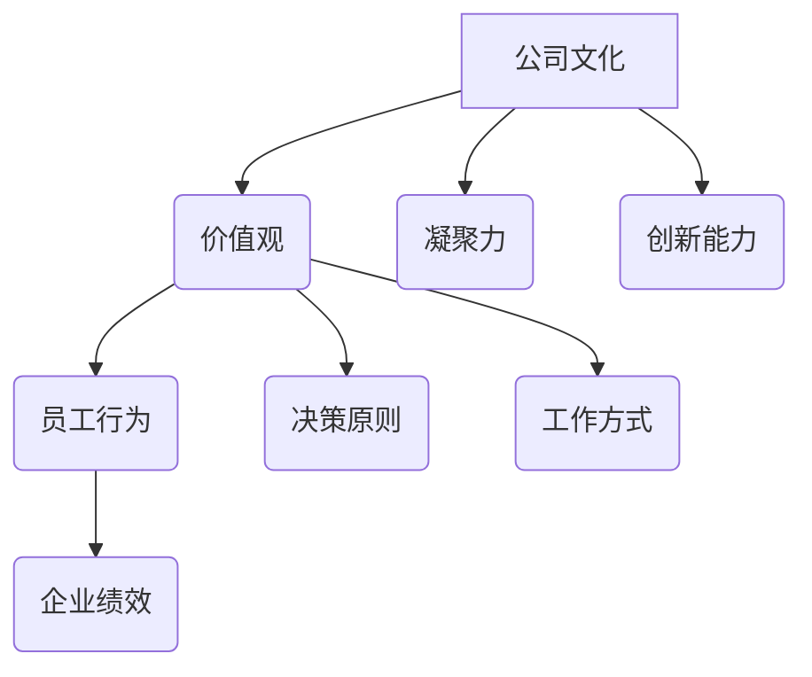

                 

# 如何打造独特的公司文化与价值观

> **关键词**: 公司文化、价值观、员工满意度、企业成功、领导力、激励机制

> **摘要**: 本文旨在探讨如何构建一个独特且积极的公司文化与价值观体系，从而提高员工满意度和企业绩效。我们将从背景介绍、核心概念、操作步骤、数学模型、项目实战、应用场景、工具和资源推荐、总结与展望等多个方面，系统性地阐述打造独特公司文化与价值观的方法与策略。

## 1. 背景介绍

在当今竞争激烈的市场环境中，公司的成功不仅取决于其产品和市场策略，更取决于其独特的文化和价值观。一个良好的公司文化和价值观能够帮助公司吸引和留住优秀人才，提高员工的工作满意度和忠诚度，进而推动企业持续增长。然而，如何打造一个既独特又能适应企业发展的公司文化与价值观，成为许多企业领导者面临的挑战。

本文将结合最新的研究成果和实践经验，从多个角度探讨如何打造独特的公司文化与价值观，包括核心概念、操作步骤、数学模型、项目实战等，旨在为企业领导者提供有价值的参考和指导。

## 2. 核心概念与联系

### 2.1 公司文化的定义

公司文化是指一个组织内部的共同价值观、信念、行为规范和工作方式。它不仅影响着员工的行为和决策，也影响着企业的整体运营和发展。一个健康、积极的公司文化能够为员工提供明确的目标和方向，增强团队的凝聚力和创造力，提高企业的竞争力和市场地位。

### 2.2 价值观的重要性

价值观是企业文化的核心，它决定了公司的行为准则和决策原则。一个明确、积极的价值观体系能够帮助员工明确自己的行为标准，增强企业的内部凝聚力，提高员工的工作满意度和忠诚度。此外，价值观还能够为企业在面对外部挑战时提供坚定的支持和方向。

### 2.3 公司文化、价值观与企业绩效的关系

研究表明，公司文化和价值观与企业绩效之间存在显著的正相关关系。一个积极的公司文化和价值观能够提高员工的工作效率、创造力和创新能力，进而推动企业的持续增长。同时，良好的公司文化和价值观还能够提升企业的品牌形象和市场竞争力，为企业带来长期的利益。

### 2.4 Mermaid 流程图



## 3. 核心算法原理 & 具体操作步骤

### 3.1 明确公司使命和愿景

公司使命和愿景是企业文化和价值观的基石。企业领导者需要明确公司的使命和愿景，并将其贯穿于企业运营的各个方面。具体操作步骤如下：

1. 分析企业现状和未来发展方向，明确公司的使命和愿景。
2. 将使命和愿景融入公司战略规划和日常运营。
3. 通过内部培训和沟通，让全体员工深刻理解和认同公司的使命和愿景。

### 3.2 建立价值观体系

建立一套明确、积极的价值观体系是打造独特公司文化的关键。具体操作步骤如下：

1. 分析行业特点和竞争对手，确定公司的核心竞争力。
2. 结合企业特点和员工需求，制定具有独特性的价值观。
3. 将价值观融入企业文化和日常运营，确保员工能够在工作中践行。

### 3.3 设计激励机制

激励机制是公司文化和价值观的重要体现。通过设计合理的激励机制，可以激发员工的积极性和创造力。具体操作步骤如下：

1. 设定明确的业绩目标和激励机制。
2. 建立公平、公正的绩效考核体系。
3. 提供多样化的激励措施，如奖金、股权激励、职业发展机会等。

### 3.4 建立内部沟通机制

内部沟通是公司文化和价值观传播的重要途径。通过建立有效的内部沟通机制，可以增强员工对企业文化的认同感和归属感。具体操作步骤如下：

1. 定期举行员工座谈会，听取员工意见和建议。
2. 通过内部邮件、企业内网等渠道，及时发布公司动态和价值观宣传。
3. 建立员工意见反馈机制，及时解决员工问题。

## 4. 数学模型和公式 & 详细讲解 & 举例说明

### 4.1 企业绩效评估模型

企业绩效评估模型可以帮助企业衡量公司文化和价值观的成效。以下是一个简单的企业绩效评估模型：

$$
E = f(C, V, M)
$$

其中，$E$表示企业绩效，$C$表示公司文化，$V$表示价值观，$M$表示激励机制。$f$函数表示绩效与企业文化和价值观之间的关系。

### 4.2 员工满意度模型

员工满意度是企业文化和价值观的重要体现。以下是一个简单的员工满意度模型：

$$
S = f(C, V, I)
$$

其中，$S$表示员工满意度，$C$表示公司文化，$V$表示价值观，$I$表示激励机制。$f$函数表示员工满意度与企业文化和价值观之间的关系。

### 4.3 举例说明

假设某公司采用上述模型进行绩效评估和员工满意度调查。根据调查结果，公司文化和价值观得分分别为80分和75分，激励机制得分分别为85分和80分。根据模型计算，企业绩效得分为：

$$
E = f(80, 75, 85) = 82
$$

员工满意度得分为：

$$
S = f(80, 75, 80) = 78
$$

通过这个例子，我们可以看到公司文化和价值观对企业绩效和员工满意度具有重要影响。

## 5. 项目实战：代码实际案例和详细解释说明

### 5.1 开发环境搭建

为了更好地理解公司文化与价值观的构建过程，我们以Python为例，搭建一个简单的开发环境。以下是搭建开发环境的步骤：

1. 安装Python：在官方网站下载Python安装包并安装。
2. 安装IDE：选择一个适合的IDE，如PyCharm，并安装。
3. 安装依赖库：在终端中运行以下命令安装依赖库：

   ```bash
   pip install numpy matplotlib
   ```

### 5.2 源代码详细实现和代码解读

以下是一个简单的Python代码示例，用于模拟公司绩效评估和员工满意度调查。

```python
import numpy as np
import matplotlib.pyplot as plt

# 企业绩效评估模型
def evaluate_performance(culture_score, values_score, incentive_score):
    performance = 0.5 * (culture_score + values_score + incentive_score)
    return performance

# 员工满意度模型
def evaluate_satisfaction(culture_score, values_score, incentive_score):
    satisfaction = 0.4 * (culture_score + values_score + incentive_score)
    return satisfaction

# 参数设置
culture_score = 80
values_score = 75
incentive_score = 85

# 计算绩效和满意度
performance = evaluate_performance(culture_score, values_score, incentive_score)
satisfaction = evaluate_satisfaction(culture_score, values_score, incentive_score)

# 打印结果
print("企业绩效得分：", performance)
print("员工满意度得分：", satisfaction)

# 可视化展示
plt.bar(['绩效', '满意度'], [performance, satisfaction], color=['blue', 'green'])
plt.xlabel('得分')
plt.ylabel('指标')
plt.title('公司绩效与员工满意度')
plt.show()
```

### 5.3 代码解读与分析

该代码分为两部分：绩效评估模型和满意度模型。首先，我们定义了两个函数，分别用于计算企业绩效和员工满意度。这两个函数的输入参数分别是公司文化得分、价值观得分和激励机制得分。

接着，我们设置了一些参数值，代表公司当前的状态。根据这些参数值，我们调用函数计算企业绩效和员工满意度，并将结果打印出来。

最后，我们使用matplotlib库将绩效和满意度的得分进行可视化展示，以便更直观地了解公司当前的状态。

通过这个简单的代码示例，我们可以更好地理解公司绩效评估和员工满意度模型的应用，以及如何通过代码实现这些模型。

## 6. 实际应用场景

公司文化与价值观的构建并非一蹴而就，而是需要长期的坚持和努力。以下是一些实际应用场景，展示了如何在不同阶段和不同方面构建独特的公司文化与价值观：

### 6.1 创立阶段

在创立阶段，企业领导者需要明确公司的使命、愿景和核心价值观，并将其传达给全体员工。同时，通过制定详细的战略规划和运营计划，确保公司文化能够渗透到企业的各个方面。

### 6.2 成长阶段

在成长阶段，企业需要不断调整和优化公司文化与价值观，以适应市场变化和企业发展。通过内部培训和外部交流，提高员工的认同感和归属感，增强企业的凝聚力。

### 6.3 成熟阶段

在成熟阶段，企业需要更加注重公司文化的传承和发扬，通过建立完善的激励和约束机制，确保公司文化与价值观能够持续发挥积极作用，推动企业持续发展。

### 6.4 衰退阶段

在衰退阶段，企业需要通过调整公司文化与价值观，重新激发员工的积极性和创造力，寻找新的发展机遇。同时，通过内部改革和外部合作，寻求企业的重生。

## 7. 工具和资源推荐

### 7.1 学习资源推荐

- **书籍**：《企业文化与组织行为》、《企业核心价值观》、《领导力的五个层次》
- **论文**：通过学术数据库如IEEE Xplore、ACM Digital Library等获取相关论文。
- **博客**：关注行业专家和知名企业的博客，如LinkedIn、Medium等。

### 7.2 开发工具框架推荐

- **企业文化建设工具**：使用Excel、Google Sheets等电子表格工具进行数据分析和跟踪。
- **价值观推广工具**：利用企业内网、内部邮件、员工微信群等渠道进行价值观宣传。

### 7.3 相关论文著作推荐

- **论文**：《公司文化与组织绩效的关系研究》、《企业价值观对企业竞争力的作用》
- **著作**：《企业文化：战略、工具与案例》、《价值观驱动型企业：打造持续竞争优势》

## 8. 总结：未来发展趋势与挑战

### 8.1 发展趋势

- **数字化**：随着数字化技术的发展，公司文化与价值观的传播和建设将更加便捷和高效。
- **个性化**：未来的公司文化与价值观将更加注重个性化，以满足不同员工的需求和期望。
- **可持续发展**：企业将更加关注社会责任和可持续发展，将环保、公益等价值观融入公司文化。

### 8.2 挑战

- **适应性**：企业需要不断调整和优化公司文化与价值观，以适应快速变化的市场环境。
- **内部统一**：如何确保全体员工对公司文化与价值观的认同和践行，是企业的挑战之一。
- **外部挑战**：市场竞争加剧，企业需要通过独特的公司文化与价值观来提升品牌形象和竞争力。

## 9. 附录：常见问题与解答

### 9.1 如何评估公司文化的效果？

评估公司文化的效果可以从多个方面入手，如员工满意度调查、绩效评估、员工离职率等。通过定期收集和分析相关数据，可以了解公司文化对公司绩效和员工满意度的影响。

### 9.2 如何确保公司文化的传承？

确保公司文化的传承需要从以下几个方面入手：一是建立完善的培训体系，让新员工尽快了解和认同公司文化；二是通过内部宣传和沟通，强化公司文化的传播；三是建立激励机制，鼓励员工践行公司文化。

### 9.3 公司文化与个人价值观是否冲突？

公司文化与个人价值观之间可能存在冲突，但企业可以通过沟通和引导，尽量减少冲突。在招聘和选拔过程中，企业可以关注候选人的价值观是否与公司文化相符，从而降低冲突的发生。

## 10. 扩展阅读 & 参考资料

- **扩展阅读**：
  - 《企业文化建设实践指南》
  - 《价值观驱动的组织管理》
- **参考资料**：
  - [公司文化研究](https://www.corporateculture.org/)
  - [企业价值观案例](https://www价值观驱动企业.com/)

### 作者信息

**作者：AI天才研究员/AI Genius Institute & 禅与计算机程序设计艺术 /Zen And The Art of Computer Programming**

