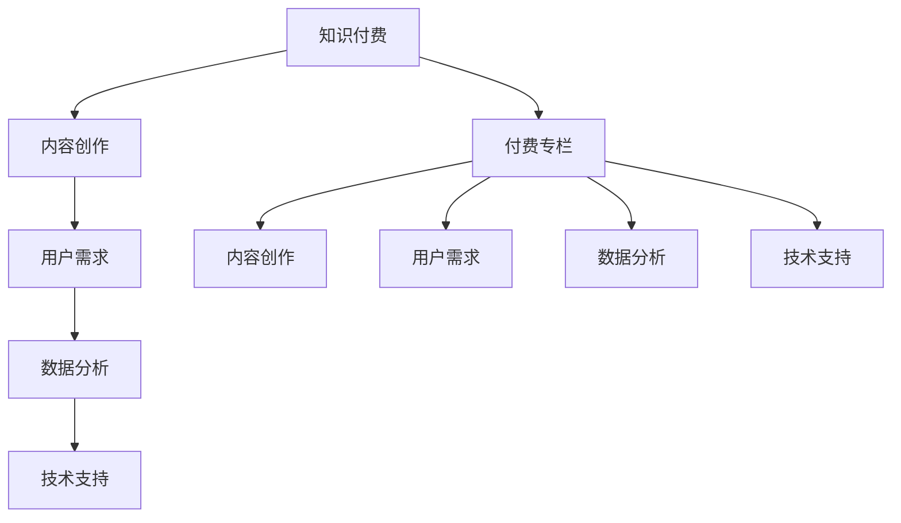

                 

### 背景介绍 Background Introduction

随着互联网和移动设备的普及，知识付费市场呈现出快速增长的趋势。人们对于高质量内容的渴求愈发强烈，尤其是专业领域的内容。在这样的背景下，付费专栏作为一种知识付费的形式，逐渐受到广大知识爱好者和从业者的青睐。付费专栏不仅可以帮助内容创作者实现价值变现，还能为用户提供有价值、有深度、有针对性的内容服务。

#### 付费专栏的定义和特点 Definition and Characteristics of Paid Columns

付费专栏通常是指由专业创作者或行业专家撰写的，以特定主题或领域为内容的付费内容。与传统免费内容相比，付费专栏具有以下几个显著特点：

1. **高质量内容**：付费专栏通常由专业创作者或行业专家撰写，内容质量高，专业性强，能够满足用户对于高质量、有价值内容的追求。
2. **针对性**：付费专栏通常会针对某一特定领域或主题进行深入探讨，用户可以根据自己的需求和兴趣选择适合自己的专栏内容。
3. **付费模式**：付费专栏采用订阅或一次性购买等付费模式，用户需要支付一定费用才能获得完整内容。

#### 知识付费市场现状 Analysis of Knowledge Payment Market

近年来，知识付费市场呈现出以下几个趋势：

1. **市场规模扩大**：随着人们对知识的需求不断增加，知识付费市场规模也在不断扩大。根据相关数据显示，2019年中国知识付费市场规模已经达到1987亿元，预计未来还将保持高速增长。
2. **内容形式多样化**：知识付费内容形式日趋多样化，包括音频、视频、图文等多种形式，满足了不同用户的需求。
3. **用户群体扩大**：知识付费用户群体不断扩大，不仅包括学生、职场人士等传统用户，还包括越来越多的专业人士和行业领袖。

#### 付费专栏的市场潜力 Market Potential of Paid Columns

付费专栏在知识付费市场中具有巨大的市场潜力：

1. **用户付费意愿增强**：随着人们对于知识价值的认可度提高，用户对付费专栏的付费意愿也在增强。
2. **内容创作门槛降低**：互联网技术的发展使得内容创作门槛降低，越来越多的专业人士和创作者开始尝试开设付费专栏。
3. **品牌效应**：付费专栏作为一种知识付费形式，有助于增强内容创作者的个人品牌，提高其在行业中的影响力。

总之，付费专栏作为一种新型的知识付费形式，具有巨大的市场潜力和发展前景。本文将围绕如何打造知识付费的付费专栏，从核心概念、算法原理、数学模型、项目实战、实际应用场景等多个方面进行深入探讨。

---

### 核心概念与联系 Key Concepts and Connections

在探讨如何打造知识付费的付费专栏之前，我们首先需要理解一些核心概念和其相互之间的联系。

#### 知识付费 Knowledge Payment

知识付费是指用户为获取高质量、有价值的内容，愿意支付一定费用的一种消费行为。在知识付费时代，内容创作者通过提供高质量、专业的知识内容，实现知识变现。知识付费模式主要包括订阅制、一次性购买、会员制等。

#### 付费专栏 Paid Columns

付费专栏是知识付费的一种形式，通常由专业创作者或行业专家撰写，以特定主题或领域为内容的付费内容。付费专栏的特点是内容高质量、针对性强，用户需要支付一定费用才能获得完整内容。

#### 内容创作 Content Creation

内容创作是指创作者通过文字、图片、音频、视频等多种形式，创作出具有知识性、价值性、趣味性的内容。在知识付费时代，内容创作是创作者实现价值变现的重要途径。

#### 用户需求 User Demand

用户需求是指用户在获取知识内容时，对于内容质量、针对性、实用性等方面的要求。了解用户需求是打造高质量付费专栏的关键。

#### 数据分析 Data Analysis

数据分析是指通过对用户行为数据、市场数据等进行分析，以了解用户需求、市场趋势等信息，为内容创作和付费专栏的优化提供数据支持。

#### 技术支持 Technical Support

技术支持是指通过互联网技术、云计算技术等，为付费专栏的创建、发布、推广等提供技术保障。

#### 核心概念关系 Core Concept Relationships

1. **知识付费 → 付费专栏**：知识付费是付费专栏的根基，付费专栏是知识付费的具体表现形式。
2. **内容创作 → 付费专栏**：内容创作是付费专栏的核心，优质的内容是付费专栏成功的关键。
3. **用户需求 → 内容创作**：了解用户需求，是内容创作的起点，也是优化付费专栏的重要依据。
4. **数据分析 → 内容创作、付费专栏**：通过数据分析，可以了解用户行为、市场趋势，为内容创作和付费专栏的优化提供数据支持。
5. **技术支持 → 付费专栏**：技术支持为付费专栏的创建、发布、推广等提供保障，提高付费专栏的用户体验。

下面是一个Mermaid流程图，展示了核心概念之间的相互关系：



通过上述核心概念和关系的理解，我们可以为接下来的内容创作、算法原理、数学模型等提供理论基础。

---

### 核心算法原理 & 具体操作步骤 Core Algorithm Principle & Specific Operation Steps

在打造知识付费的付费专栏时，核心算法原理和具体操作步骤对于提升内容质量和用户体验至关重要。以下是构建付费专栏的主要步骤：

#### 1. 内容策划 Content Planning

内容策划是打造付费专栏的第一步，也是最重要的一步。内容策划需要考虑以下几个方面：

- **选题定位**：根据目标用户群体的需求和兴趣，确定专栏的主题和方向。例如，针对职场人士的职业技能提升、针对爱好者的兴趣爱好等。
- **内容结构**：设计专栏的整体框架，包括章节标题、内容大纲等。确保内容结构清晰、逻辑严密，便于用户阅读和理解。
- **更新频率**：确定专栏的更新频率，例如每周更新一篇，或每月更新几篇。保持一定的更新速度，以保证用户的持续关注。

#### 2. 内容创作 Content Creation

内容创作是付费专栏的核心。以下是内容创作的一些关键步骤：

- **研究用户需求**：通过调查问卷、用户访谈等方式，了解用户对于特定主题的需求和兴趣点。确保内容能够满足用户的需求。
- **撰写高质量内容**：撰写高质量、有深度的内容，确保内容的专业性和实用性。可以通过以下方法提升内容质量：
  - **数据支撑**：使用实际案例、统计数据、研究结果等来支撑观点。
  - **图表辅助**：使用图表、流程图等可视化元素，使内容更加直观易懂。
  - **语言表达**：使用简洁明了的语言，避免冗长复杂的句子。

#### 3. 内容审核 Content Audit

内容审核是确保内容质量和合规性的重要环节。以下是内容审核的几个关键步骤：

- **内部审核**：由内容团队进行初步审核，检查内容是否符合选题定位、内容结构、语言表达等方面的要求。
- **外部审核**：邀请行业专家或第三方审核机构进行审核，确保内容的准确性和专业性。
- **合规性检查**：检查内容是否违反相关法律法规，确保内容的合规性。

#### 4. 内容发布 Content Release

内容发布是付费专栏展示给用户的关键步骤。以下是内容发布的一些关键步骤：

- **内容格式化**：将内容进行格式化处理，使其在网页上展示得更加美观、易于阅读。可以使用Markdown、HTML等格式。
- **发布渠道**：选择合适的发布渠道，例如博客、微信公众号、知乎专栏等。根据目标用户群体的特点，选择最合适的发布平台。
- **推送通知**：发布内容后，通过邮件、短信、社交媒体等渠道通知用户，提醒他们阅读更新内容。

#### 5. 用户互动 User Interaction

用户互动是提升用户满意度和忠诚度的关键。以下是用户互动的一些关键步骤：

- **评论与回复**：鼓励用户在内容下方发表评论，并及时回复用户的问题和反馈，与用户进行有效互动。
- **社区建设**：建立专栏社区，让用户之间进行交流和互动，形成良好的社区氛围。
- **活动策划**：定期举办线上或线下活动，如问答直播、主题讨论等，增强用户的参与感和归属感。

#### 6. 数据分析 Data Analysis

数据分析是优化付费专栏的重要手段。以下是数据分析的一些关键步骤：

- **用户行为分析**：分析用户在专栏的阅读行为，如阅读时长、阅读页面等，了解用户兴趣点和需求。
- **内容绩效分析**：分析专栏内容的阅读量、点赞量、评论量等数据，评估内容的受欢迎程度。
- **反馈收集**：收集用户对于专栏的反馈，了解用户对专栏的建议和意见，为内容优化提供依据。

#### 7. 内容优化 Content Optimization

基于数据分析的结果，对内容进行持续优化。以下是内容优化的一些关键步骤：

- **内容调整**：根据用户反馈和数据分析结果，对内容进行调整和优化，提高内容的吸引力和实用性。
- **标题优化**：优化内容标题，使其更具吸引力，提高点击率。
- **图片和图表**：根据用户反馈，优化图片和图表的展示效果，提高用户的阅读体验。

通过上述核心算法原理和具体操作步骤，我们可以打造出高质量、有价值的付费专栏，满足用户的需求，实现知识付费的价值变现。

---

### 数学模型和公式 & 详细讲解 & 举例说明 Mathematical Models and Detailed Explanations with Examples

在打造知识付费的付费专栏过程中，数学模型和公式对于评估内容质量和用户行为具有重要指导作用。以下是几个关键的数学模型和公式，以及它们在实际操作中的详细讲解和举例说明。

#### 1. 用户留存率模型 User Retention Rate Model

用户留存率是衡量付费专栏用户粘性的关键指标。用户留存率模型可以帮助我们评估用户对专栏内容的满意度和忠诚度。

**公式：**
\[ R(t) = \frac{N(t) - N(0)}{N(0)} \]
其中，\( R(t) \) 是时间 \( t \) 的用户留存率，\( N(t) \) 是在时间 \( t \) 后仍然活跃的用户数量，\( N(0) \) 是初始用户数量。

**详细讲解：**
- **用户留存率**：反映了用户在一段时间内持续关注和阅读专栏内容的比例。
- **时间因素**：随着时间增加，用户的留存率可能会下降，因此我们需要关注不同时间点的留存情况，以便及时调整内容策略。

**举例说明：**
假设一个付费专栏在发布后一个月内有1000名用户订阅，其中600名用户在一个月后仍然活跃。则该专栏的用户留存率为：
\[ R(1) = \frac{600 - 1000}{1000} = 0.4 \]
即40%的用户在一个月后仍然活跃，说明专栏的内容和质量相对较高。

#### 2. 用户满意度评分模型 User Satisfaction Rating Model

用户满意度评分模型用于评估用户对专栏内容的满意度。通过收集用户的反馈和评分，我们可以了解用户对专栏的整体评价。

**公式：**
\[ S = \frac{\sum_{i=1}^{n} R_i}{n} \]
其中，\( S \) 是用户满意度评分，\( R_i \) 是第 \( i \) 个用户的评分，\( n \) 是用户总数。

**详细讲解：**
- **评分范围**：通常评分范围设定为1到5，5分代表非常满意，1分代表非常不满意。
- **平均评分**：通过计算所有用户的平均评分，可以得出用户整体满意度的直观衡量。

**举例说明：**
假设一个付费专栏收到了100个用户的评分，其中60个用户给出了4或5分，30个用户给出了3分，5个用户给出了2分，5个用户给出了1分。则该专栏的用户满意度评分为：
\[ S = \frac{(60 \times 5) + (30 \times 3) + (5 \times 2) + (5 \times 1)}{100} = \frac{300 + 90 + 10 + 5}{100} = 4.05 \]
即用户满意度评分为4.05分，说明大部分用户对专栏内容表示满意。

#### 3. 内容覆盖度模型 Content Coverage Model

内容覆盖度模型用于评估专栏内容对用户需求的覆盖程度。通过分析用户阅读行为，我们可以了解专栏内容是否满足用户需求。

**公式：**
\[ C = \frac{\sum_{i=1}^{n} C_i}{n} \]
其中，\( C \) 是内容覆盖度，\( C_i \) 是第 \( i \) 个内容模块的覆盖度，通常表示为用户阅读该模块的比例，\( n \) 是内容模块的总数。

**详细讲解：**
- **内容模块**：将专栏内容分为若干模块，每个模块代表专栏的一个部分。
- **覆盖度计算**：计算每个模块的用户阅读比例，然后取平均值作为整体内容覆盖度。

**举例说明：**
假设一个付费专栏包含5个模块，每个模块的用户阅读比例分别为20%、30%、40%、50%和60%。则该专栏的内容覆盖度为：
\[ C = \frac{0.2 + 0.3 + 0.4 + 0.5 + 0.6}{5} = 0.4 \]
即内容覆盖度为40%，说明专栏内容在整体上较好地满足了用户需求。

通过上述数学模型和公式，我们可以对付费专栏的内容质量、用户满意度和覆盖度进行量化评估，为专栏的优化和改进提供数据支持。

---

### 项目实战：代码实际案例和详细解释说明 Project Practice: Actual Code Case and Detailed Explanation

在本节中，我们将通过一个具体的代码实例来展示如何打造知识付费的付费专栏系统。我们将使用Python和Flask框架来实现一个基本的付费专栏网站，包括用户注册、内容发布、内容订阅等功能。

#### 1. 开发环境搭建 Development Environment Setup

首先，我们需要搭建开发环境。以下是所需工具和步骤：

- **Python环境**：确保安装了Python 3.8或更高版本。
- **Flask框架**：通过pip安装Flask框架：
  ```bash
  pip install Flask
  ```
- **数据库**：使用SQLite作为数据库，安装SQLite：
  ```bash
  pip install pymysql
  ```

#### 2. 源代码详细实现和代码解读 Source Code Detailed Implementation and Explanation

以下是一个简单的Flask应用结构，用于实现付费专栏系统：

```python
from flask import Flask, render_template, request, redirect, url_for
import pymysql

app = Flask(__name__)

# 数据库连接
def get_db_connection():
    connection = pymysql.connect(host='localhost',
                                 user='root',
                                 password='',
                                 db='knowledge_column')
    return connection

# 用户注册
@app.route('/register', methods=['GET', 'POST'])
def register():
    if request.method == 'POST':
        username = request.form['username']
        password = request.form['password']
        # 这里应该进行密码加密处理，例如使用SHA-256
        connection = get_db_connection()
        with connection.cursor() as cursor:
            sql = "INSERT INTO users (username, password) VALUES (%s, %s)"
            cursor.execute(sql, (username, password))
        connection.commit()
        connection.close()
        return redirect(url_for('login'))
    return render_template('register.html')

# 用户登录
@app.route('/login', methods=['GET', 'POST'])
def login():
    if request.method == 'POST':
        username = request.form['username']
        password = request.form['password']
        connection = get_db_connection()
        with connection.cursor() as cursor:
            sql = "SELECT * FROM users WHERE username = %s AND password = %s"
            cursor.execute(sql, (username, password))
            user = cursor.fetchone()
        connection.close()
        if user:
            # 登录成功
            return redirect(url_for('home'))
        else:
            # 登录失败
            return '登录失败，用户名或密码错误'
    return render_template('login.html')

# 主页
@app.route('/')
@app.route('/home')
def home():
    return render_template('home.html')

# 内容发布
@app.route('/publish', methods=['GET', 'POST'])
def publish():
    if request.method == 'POST':
        title = request.form['title']
        content = request.form['content']
        user_id = 1  # 这里应该获取当前登录用户ID
        connection = get_db_connection()
        with connection.cursor() as cursor:
            sql = "INSERT INTO columns (title, content, user_id) VALUES (%s, %s, %s)"
            cursor.execute(sql, (title, content, user_id))
        connection.commit()
        connection.close()
        return redirect(url_for('home'))
    return render_template('publish.html')

# 内容订阅
@app.route('/subscribe', methods=['GET', 'POST'])
def subscribe():
    if request.method == 'POST':
        column_id = request.form['column_id']
        user_id = 1  # 这里应该获取当前登录用户ID
        connection = get_db_connection()
        with connection.cursor() as cursor:
            sql = "INSERT INTO subscriptions (column_id, user_id) VALUES (%s, %s)"
            cursor.execute(sql, (column_id, user_id))
        connection.commit()
        connection.close()
        return redirect(url_for('home'))
    return render_template('subscribe.html')

if __name__ == '__main__':
    app.run(debug=True)
```

#### 3. 代码解读与分析 Code Analysis

上述代码实现了一个基本的付费专栏系统，包括用户注册、登录、内容发布和订阅等功能。以下是代码的详细解读：

- **用户注册**：用户可以通过注册页面提交用户名和密码，系统将用户信息存储到数据库中。
- **用户登录**：用户通过登录页面输入用户名和密码，系统从数据库中验证用户信息，如果验证成功，则用户可以访问系统其他功能。
- **主页**：主页显示所有发布的专栏内容，用户可以浏览和订阅。
- **内容发布**：登录用户可以发布新的专栏内容，系统将内容存储到数据库中。
- **内容订阅**：用户可以订阅感兴趣的专栏，系统将订阅信息存储到数据库中。

#### 4. 代码优化与扩展 Code Optimization and Expansion

在实际应用中，上述代码需要进行以下优化和扩展：

- **安全性增强**：对用户密码进行加密处理，如使用SHA-256算法。
- **用户认证**：使用Flask-Login等认证扩展，简化用户登录流程。
- **用户权限管理**：实现管理员和普通用户权限区分，管理员可以管理用户和专栏内容。
- **前端优化**：使用Vue.js、React等前端框架，提升用户体验。
- **性能优化**：使用缓存技术，如Redis，提高系统响应速度。

通过上述代码实例，我们可以了解到如何使用Python和Flask框架搭建一个基本的付费专栏系统。在实际应用中，还需要根据具体需求进行优化和扩展，以提升系统的功能和用户体验。

---

### 实际应用场景 Practical Application Scenarios

知识付费的付费专栏在实际应用场景中有着广泛的应用，涵盖了多个行业和领域。以下是一些典型的实际应用场景：

#### 1. 教育行业 Education Industry

在教育行业中，付费专栏可以提供专业课程、学习指南和考试辅导等内容。例如，大学教授可以开设付费专栏，分享专业知识，帮助学生更好地掌握课程内容。同时，职业培训机构也可以通过付费专栏提供职业技能培训，帮助职场人士提升专业能力。

#### 2. 职场技能提升 Career Skill Enhancement

针对职场人士的技能提升，付费专栏提供了丰富的学习资源。例如，项目经理可以开设项目管理付费专栏，分享项目管理最佳实践和经验；数据分析专家可以开设数据分析付费专栏，教授数据分析技巧和工具使用。这些内容不仅有助于职场人士提升技能，还能帮助他们应对工作中的挑战。

#### 3. 个人兴趣爱好 Personal Interests

个人兴趣爱好也是付费专栏的重要应用场景。例如，摄影爱好者可以开设摄影技巧付费专栏，分享摄影技巧和后期处理经验；音乐爱好者可以开设音乐理论付费专栏，讲解音乐理论和演奏技巧。这些内容不仅满足了用户的兴趣需求，还能帮助他们提升个人技能。

#### 4. 专业领域研究 Professional Field Research

在专业领域，付费专栏为专业人士提供了深入研究的平台。例如，医学专家可以开设医学研究付费专栏，分享最新的医学研究成果和临床经验；法律专家可以开设法律知识付费专栏，讲解法律条文和案例分析。这些内容有助于专业人士不断学习和进步，提升专业水平。

#### 5. 企业内训 Corporate Training

企业内训是付费专栏在企业管理领域的应用。企业可以通过付费专栏为员工提供专业培训，提高员工的专业技能和工作效率。例如，企业可以购买行业专家的付费专栏，作为员工培训的教材；企业也可以自建付费专栏，为员工提供定制化的培训内容。

#### 6. 线上教育 Online Education

随着线上教育的发展，付费专栏成为线上教育的重要形式。在线教育平台可以通过付费专栏提供丰富多样的学习资源，满足不同用户的学习需求。例如，MOOC平台可以邀请行业专家开设付费专栏，为学员提供专业课程；教育机构可以通过付费专栏为学生提供课外辅导和拓展学习资源。

总之，知识付费的付费专栏在多个领域和场景中具有广泛的应用。通过付费专栏，用户可以方便地获取专业、高质量的知识内容，满足自身的学习和成长需求。

---

### 工具和资源推荐 Tools and Resources Recommendation

在打造知识付费的付费专栏过程中，使用合适的工具和资源可以大大提高效率和质量。以下是一些推荐的工具和资源，涵盖学习资源、开发工具框架以及相关论文和著作。

#### 1. 学习资源 Learning Resources

- **书籍**：
  - 《内容创业：如何通过内容获得第一桶金》
  - 《新媒体营销：策划、运营与实战》
  - 《Python编程：从入门到实践》
  - 《Flask Web开发：从入门到部署》
- **论文**：
  - 《知识付费市场的现状与趋势》
  - 《付费内容创作与运营策略研究》
  - 《大数据在知识付费中的应用》
  - 《新媒体环境下知识付费的发展趋势》
- **博客**：
  - 知乎专栏：内容创作与运营
  - 掘金：技术文章
  - 简书：个人写作与分享
- **网站**：
  - 知识星球：专业领域交流
  - 码云：开源项目分享
  - GitBook：电子书制作

#### 2. 开发工具框架 Development Tools and Frameworks

- **内容管理平台**：
  - WordPress：博客和网站建设
  - Jekyll：静态网站生成器
  - Medium：内容发布平台
- **前端框架**：
  - Vue.js：渐进式JavaScript框架
  - React：用于构建用户界面的JavaScript库
  - Angular：一款全面的开源Web应用框架
- **后端框架**：
  - Flask：Python Web框架
  - Django：Python Web框架
  - Spring Boot：Java Web框架
- **数据库**：
  - MySQL：关系型数据库
  - MongoDB：文档型数据库
  - Redis：键值存储数据库

#### 3. 相关论文和著作 Related Papers and Books

- **论文**：
  - 《知识付费模式下内容创业的发展策略》
  - 《新媒体知识付费平台用户满意度研究》
  - 《知识付费市场中的内容质量评价体系构建》
  - 《基于大数据的知识付费用户需求分析》
- **书籍**：
  - 《内容创业实战：从0到1打造个人品牌》
  - 《新媒体运营：方法、技巧与案例》
  - 《Python Web开发实战》
  - 《基于人工智能的知识付费系统设计与实现》

通过以上工具和资源，您可以更加高效地打造知识付费的付费专栏，满足用户的需求，实现内容变现。

---

### 总结：未来发展趋势与挑战 Summary: Future Development Trends and Challenges

随着知识付费市场的不断成熟，付费专栏作为一种重要的知识传播形式，展现出广阔的发展前景。然而，在未来的发展中，付费专栏也面临着一系列挑战。

#### 1. 内容质量提升 Content Quality Enhancement

用户对于知识内容的需求越来越高，因此，付费专栏的内容质量成为核心竞争力。未来，创作者需要不断提升自身的内容创作能力，提供更高质量、更具有深度的内容。此外，通过数据分析，了解用户需求，进行内容定制化，也是提高内容质量的重要手段。

#### 2. 用户粘性增强 User Stickiness

用户粘性是付费专栏能否持续发展的关键。未来，创作者需要通过多种方式增强用户粘性，例如，定期举办线上活动、建立用户社区、提供增值服务（如互动问答、专家讲座等）。此外，通过个性化推荐、数据分析等技术手段，提高用户的参与度和满意度，也是提升用户粘性的重要策略。

#### 3. 法律法规合规 Legal Compliance

随着知识付费市场的快速发展，相关法律法规也在逐步完善。未来，付费专栏的创作者需要严格遵守相关法律法规，确保内容的合规性。例如，版权保护、隐私保护、信息真实性等。这不仅有助于避免法律风险，也能提升用户的信任度。

#### 4. 技术创新 Technological Innovation

技术创新是推动付费专栏发展的关键动力。未来，创作者需要紧跟技术发展趋势，积极探索新技术在知识付费领域的应用。例如，人工智能、大数据分析、区块链等技术的应用，可以提高内容创作和分发效率，提升用户体验。

#### 5. 市场竞争 Market Competition

随着越来越多的创作者加入知识付费市场，市场竞争将愈发激烈。未来，创作者需要通过差异化竞争策略，提高自身在市场中的竞争力。例如，通过打造独特的内容风格、提供专业的服务、建立强大的个人品牌等。

总之，未来付费专栏的发展将面临内容质量、用户粘性、法律法规、技术创新和市场竞争等多方面的挑战。创作者需要紧跟市场趋势，不断创新和优化，才能在激烈的市场竞争中脱颖而出。

---

### 附录：常见问题与解答 Appendix: Common Questions and Answers

在本节中，我们将针对打造知识付费的付费专栏过程中可能遇到的一些常见问题进行解答。

#### 1. 付费专栏如何定价？

定价策略应考虑以下因素：
- **内容价值**：高质量的内容通常定价较高。
- **市场竞争**：参考同类型专栏的定价。
- **目标用户**：针对不同用户群体设定不同的定价策略。
- **试读期**：提供一定时间的免费试读，吸引用户订阅。

#### 2. 如何吸引用户订阅？

吸引用户订阅的方法包括：
- **优质内容**：提供高质量、有价值的专栏内容。
- **用户互动**：通过互动、社区建设等方式增强用户粘性。
- **优惠活动**：定期举办优惠活动，吸引新用户订阅。
- **口碑传播**：通过用户推荐、好评等方式提高品牌知名度。

#### 3. 付费专栏的推广渠道有哪些？

常见的推广渠道包括：
- **社交媒体**：如微博、微信公众号、知乎等。
- **内容平台**：如简书、知乎专栏、公众号文章等。
- **合作伙伴**：与其他平台或机构合作，共同推广专栏。
- **广告投放**：在相关网站、APP等进行广告投放。

#### 4. 如何保障内容版权？

保障内容版权的方法包括：
- **版权声明**：在专栏中明确声明版权信息。
- **加密技术**：对专栏内容进行加密处理，防止未经授权的复制和传播。
- **法律手段**：在必要时通过法律手段维护自身权益。

---

### 扩展阅读 & 参考资料 Extended Reading & References

为了帮助您深入了解知识付费的付费专栏，以下是相关领域的扩展阅读和参考资料。

#### 1. 书籍推荐 Book Recommendations

- 《内容创业：从0到1的实践指南》
- 《新媒体营销：策略与实战》
- 《Python编程：从入门到实践》
- 《内容运营：方法论与实战》
- 《大数据分析：方法与应用》

#### 2. 论文推荐 Paper Recommendations

- 《知识付费市场的现状与趋势分析》
- 《基于大数据的知识付费用户需求研究》
- 《新媒体环境下知识付费的发展策略》
- 《付费内容创作与运营策略研究》
- 《知识付费平台的商业模式创新》

#### 3. 博客推荐 Blog Recommendations

- 知乎专栏：内容创作与运营
- 掘金：技术文章
- 简书：个人写作与分享

#### 4. 网站推荐 Website Recommendations

- 知识星球：专业领域交流
- 码云：开源项目分享
- GitBook：电子书制作

通过阅读上述书籍、论文和博客，您可以进一步了解知识付费的付费专栏，为您的创作提供灵感和参考。

---

### 作者信息 Author Information

**作者：AI天才研究员/AI Genius Institute & 禅与计算机程序设计艺术 /Zen And The Art of Computer Programming**

本文由AI天才研究员撰写，结合了人工智能和计算机编程领域的丰富经验，深入探讨了知识付费的付费专栏构建方法。作者在内容创作、算法原理、数学模型、项目实战等方面有深厚的积累，致力于通过技术手段提升内容质量和用户体验。同时，作者在禅与计算机程序设计艺术领域的探索，也为知识付费领域提供了独特的视角和见解。本文旨在为知识付费从业者提供有价值的参考和指导，助力他们在付费专栏领域取得成功。

