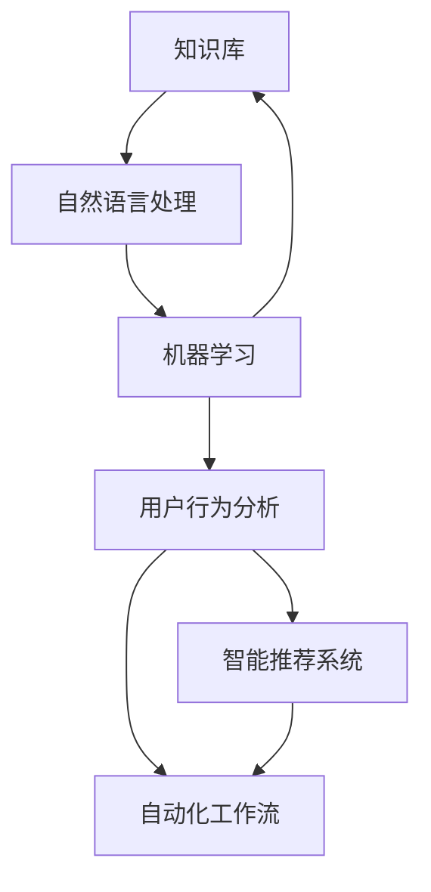

                 

### 背景介绍 Background Introduction

在现代商业环境中，客户支持扮演着至关重要的角色。企业不仅需要提供高质量的客户服务，还要确保这种服务的效率和便利性。随着客户期望的不断上升，传统的客户支持模式逐渐难以满足市场的需求。为了在竞争中脱颖而出，越来越多的企业开始将自助支持系统作为提升客户满意度和降低运营成本的关键手段。

自助支持系统旨在通过自动化和智能化的方式，帮助客户自行解决常见问题，从而减少对人工支持的依赖。这种系统可以包括在线知识库、自助问答机器人、自动化工单系统等。然而，要打造一个高效的客户支持自助系统，并非易事。它需要充分考虑用户体验、技术实现、数据管理等多个方面的因素。

首先，用户体验是自助支持系统的核心。系统必须设计得直观、易用，让客户能够在短时间内找到所需的信息或解决方法。其次，技术实现是系统的基石，包括选择合适的硬件和软件平台，以及开发高效、可靠的算法和模型。最后，数据管理是确保系统持续改进的关键，通过收集和分析用户行为数据，企业可以不断优化系统性能。

本篇文章将详细探讨如何打造高效的客户支持自助系统，包括核心概念、算法原理、数学模型、实际应用场景、开发工具和资源推荐等内容。通过本文的阅读，读者将获得从理论到实践的全景了解，以便在各自的业务场景中实施高效的自助支持系统。

### 核心概念与联系 Core Concepts and Relationships

在构建高效的客户支持自助系统时，需要理解几个核心概念和它们之间的关系。以下是这些核心概念及其相互联系：

1. **知识库（Knowledge Base）**：
   知识库是自助支持系统的核心组成部分，它存储了各种常见问题的答案和解决方案。知识库的内容需要定期更新和维护，以确保信息的准确性和时效性。一个好的知识库应当具备搜索功能和语义理解能力，以便用户能够快速找到所需信息。

2. **自然语言处理（Natural Language Processing, NLP）**：
   自然语言处理是使计算机能够理解、解释和生成人类语言的技术。在自助支持系统中，NLP 技术用于实现机器人和客户之间的自然对话。这包括文本分析、情感分析和语言生成等任务，以确保系统能够理解用户的查询并给出恰当的回应。

3. **机器学习（Machine Learning, ML）**：
   机器学习是使计算机能够从数据中学习并做出预测或决策的技术。在自助支持系统中，机器学习用于优化知识库内容、预测用户查询和生成个性化建议。常用的机器学习算法包括分类、聚类和回归等。

4. **用户行为分析（User Behavior Analysis）**：
   用户行为分析涉及监控和评估用户的互动行为，以了解他们对系统的使用方式和偏好。这些数据可以用于改进用户体验、优化系统性能和提高用户满意度。

5. **自动化工作流（Automated Workflow）**：
   自动化工作流是通过软件工具自动执行一系列任务和操作的过程。在自助支持系统中，自动化工作流用于处理常见问题，如自动生成工单、分配任务和跟踪解决方案。这有助于减少手动干预，提高工作效率。

6. **智能推荐系统（Intelligent Recommendation System）**：
   智能推荐系统通过分析用户历史行为和偏好，向用户推荐相关的解决方案、产品或服务。这种系统可以提高用户参与度和满意度，同时也有助于企业推广其产品和服务。

**关系说明**：

- **知识库** 和 **自然语言处理** 之间紧密相连。知识库提供内容，而 NLP 技术使得系统能够理解和利用这些内容。
- **机器学习** 在 **知识库** 和 **用户行为分析** 中发挥着关键作用。通过机器学习，系统能够从用户行为数据中学习，不断优化知识库内容和推荐算法。
- **用户行为分析** 为 **智能推荐系统** 提供了输入。通过分析用户行为，系统可以更好地理解用户需求和偏好，从而提供个性化的推荐。
- **自动化工作流** 可以与 **用户行为分析** 和 **智能推荐系统** 结合，实现自动化决策和操作，提高系统效率和用户体验。

下图展示了这些核心概念及其相互关系：



通过理解这些核心概念及其相互关系，企业可以构建一个高效、智能的客户支持自助系统，从而提升客户满意度和业务效率。

### 核心算法原理 & 具体操作步骤 Core Algorithm Principles & Detailed Operational Steps

在构建高效客户支持自助系统的过程中，核心算法的选择和实现是至关重要的。以下是几种关键算法的原理和具体操作步骤：

#### 1. 自然语言处理（NLP）算法

**算法原理**：
自然语言处理（NLP）算法的核心目标是使计算机能够理解、解释和生成人类语言。常用的 NLP 算法包括分词（Tokenization）、词性标注（Part-of-Speech Tagging）、命名实体识别（Named Entity Recognition, NER）和情感分析（Sentiment Analysis）。

**具体操作步骤**：

- **分词（Tokenization）**：
  分词是将文本分割成单词或短语的步骤。例如，将句子 "我爱北京天安门" 分割成 ["我", "爱", "北京", "天安门"]。
  ```python
  from nltk.tokenize import word_tokenize
  sentence = "我爱北京天安门"
  tokens = word_tokenize(sentence)
  print(tokens)
  ```

- **词性标注（Part-of-Speech Tagging）**：
  词性标注是为每个单词分配一个词性标签，如名词、动词、形容词等。这有助于理解句子的结构。
  ```python
  from nltk import pos_tag
  tokens = pos_tag(tokens)
  print(tokens)
  ```

- **命名实体识别（NER）**：
  命名实体识别用于识别文本中的特定实体，如人名、地名、组织名等。NER 常用于构建对话系统和语义搜索。
  ```python
  from nltk.chunk import ne_chunk
  tokens = ne_chunk(tokens)
  print(tokens)
  ```

- **情感分析（Sentiment Analysis）**：
  情感分析用于判断文本的情感倾向，如正面、负面或中性。这有助于评估用户对产品或服务的满意度。
  ```python
  from textblob import TextBlob
  blob = TextBlob(sentence)
  print(blob.sentiment)
  ```

#### 2. 机器学习（ML）算法

**算法原理**：
机器学习算法通过从数据中学习模式，实现自动化预测和决策。在自助支持系统中，常用的 ML 算法包括分类（Classification）和聚类（Clustering）。

**具体操作步骤**：

- **分类算法（Classification）**：
  分类算法用于将数据点分配到预定义的类别中。常见的分类算法有决策树（Decision Tree）、支持向量机（Support Vector Machine, SVM）和神经网络（Neural Network）。
  ```python
  from sklearn.datasets import load_iris
  from sklearn.model_selection import train_test_split
  from sklearn.tree import DecisionTreeClassifier

  iris = load_iris()
  X_train, X_test, y_train, y_test = train_test_split(iris.data, iris.target, test_size=0.3, random_state=42)

  clf = DecisionTreeClassifier()
  clf.fit(X_train, y_train)

  print(clf.predict(X_test))
  ```

- **聚类算法（Clustering）**：
  聚类算法用于将数据点分为若干个群组，使得同一群组内的数据点彼此相似，而不同群组的数据点差异较大。常见的聚类算法有 K-均值（K-Means）和层次聚类（Hierarchical Clustering）。
  ```python
  from sklearn.cluster import KMeans
  import numpy as np

  X = np.array([[1, 2], [1, 4], [1, 0],
                [4, 2], [4, 4], [4, 0]])

  kmeans = KMeans(n_clusters=2, random_state=0).fit(X)
  print(kmeans.labels_)
  ```

#### 3. 自动化工作流（Automated Workflow）算法

**算法原理**：
自动化工作流算法通过一系列预设的规则和条件，自动执行任务和操作。常见的自动化工作流算法包括条件分支（Conditional Branching）和循环（Looping）。

**具体操作步骤**：

- **条件分支（Conditional Branching）**：
  条件分支用于根据特定条件执行不同的操作。例如，根据用户输入的问题类型，选择不同的解决方案。
  ```python
  def solve_problem(problem):
      if problem == "价格":
          return "请联系销售部门。"
      elif problem == "物流":
          return "请联系客服部门。"
      else:
          return "很抱歉，我们无法解决您的问题。"

  print(solve_problem("物流"))
  ```

- **循环（Looping）**：
  循环用于重复执行一组操作，直到满足特定条件。例如，用于处理一系列用户查询。
  ```python
  for i in range(5):
      print(i)

  while True:
      user_input = input("请输入问题：")
      if user_input == "结束":
          break
      print("处理中...")
  ```

通过这些核心算法的原理和具体操作步骤，企业可以构建一个高效、智能的客户支持自助系统，从而提升客户满意度和业务效率。

### 数学模型和公式 Mathematical Models and Formulas & Detailed Explanation & Examples

在构建高效的客户支持自助系统中，数学模型和公式扮演着至关重要的角色。以下是一些常用的数学模型及其详细讲解和示例：

#### 1. 贝叶斯分类模型

**公式**：

贝叶斯分类模型的公式如下：
$$
P(C_k|X) = \frac{P(X|C_k)P(C_k)}{P(X)}
$$
其中，$P(C_k|X)$ 表示在给定特征 $X$ 下，类别 $C_k$ 的条件概率；$P(X|C_k)$ 表示在类别 $C_k$ 下特征 $X$ 的概率；$P(C_k)$ 表示类别 $C_k$ 的先验概率；$P(X)$ 是特征 $X$ 的总体概率。

**解释**：

贝叶斯分类模型通过计算每个类别在给定特征下的后验概率，然后选择具有最高后验概率的类别作为分类结果。它是一种基于概率的统计分类方法，适用于处理具有不确定性和不确定性的分类问题。

**示例**：

假设有一个垃圾邮件分类问题，其中 $C_0$ 表示正常邮件，$C_1$ 表示垃圾邮件。特征 $X_1$ 表示邮件中的单词数量，$X_2$ 表示邮件中的标点符号数量。根据训练数据，我们得到以下概率：

- $P(C_0) = 0.9$，$P(C_1) = 0.1$
- $P(X_1|C_0) = 0.5$，$P(X_1|C_1) = 0.3$
- $P(X_2|C_0) = 0.1$，$P(X_2|C_1) = 0.7$

给定一个邮件，其中 $X_1 = 100$，$X_2 = 20$，我们可以计算后验概率：

$$
P(C_0|X) = \frac{P(X|C_0)P(C_0)}{P(X)}
$$
$$
P(C_1|X) = \frac{P(X|C_1)P(C_1)}{P(X)}
$$

首先计算 $P(X)$：

$$
P(X) = P(X|C_0)P(C_0) + P(X|C_1)P(C_1)
$$
$$
P(X) = (0.5 \times 0.9) + (0.3 \times 0.1) = 0.48
$$

然后计算后验概率：

$$
P(C_0|X) = \frac{0.5 \times 0.9}{0.48} = 0.9583
$$
$$
P(C_1|X) = \frac{0.3 \times 0.1}{0.48} = 0.0625
$$

由于 $P(C_0|X) > P(C_1|X)$，我们分类结果为正常邮件。

#### 2. 逻辑回归模型

**公式**：

逻辑回归模型的公式如下：
$$
P(Y=1) = \frac{1}{1 + e^{-(\beta_0 + \beta_1X_1 + \beta_2X_2 + ... + \beta_nX_n})}
$$
其中，$Y$ 表示二分类目标变量，$X_1, X_2, ..., X_n$ 表示特征向量；$\beta_0, \beta_1, \beta_2, ..., \beta_n$ 是模型参数。

**解释**：

逻辑回归模型是一种线性分类模型，它通过线性组合特征和权重（$\beta$ 值）来计算概率。输出概率大于 0.5 的特征被分类为正类，否则被分类为负类。逻辑回归常用于处理二分类问题，如垃圾邮件分类、客户流失预测等。

**示例**：

假设有一个客户流失预测问题，其中 $Y$ 表示客户是否会流失（1 表示流失，0 表示未流失），$X_1$ 表示客户的年龄，$X_2$ 表示客户的消费金额。根据训练数据，我们得到以下模型参数：

$$
\beta_0 = -1, \beta_1 = 0.1, \beta_2 = 0.2
$$

给定一个客户，其中 $X_1 = 30$，$X_2 = 500$，我们可以计算流失概率：

$$
P(Y=1) = \frac{1}{1 + e^{-(\beta_0 + \beta_1X_1 + \beta_2X_2)}}
$$
$$
P(Y=1) = \frac{1}{1 + e^{(-1 + 0.1 \times 30 + 0.2 \times 500)}}
$$
$$
P(Y=1) = \frac{1}{1 + e^{-690}}
$$
$$
P(Y=1) \approx 0
$$

由于流失概率非常低，我们可以认为该客户不会流失。

#### 3. 支持向量机（SVM）模型

**公式**：

支持向量机（SVM）模型的公式如下：
$$
w \cdot x - b = 0
$$
$$
y(\textbf{w} \cdot \textbf{x} - b) \geq 1
$$
其中，$w$ 表示权重向量，$b$ 表示偏置项，$x$ 表示特征向量，$y$ 表示类别标签（1 或 -1）。

**解释**：

支持向量机是一种线性分类模型，它通过寻找一个超平面，将不同类别的数据点分隔开。SVM 的目标是最大化分类边界上的间隔（margin），从而提高模型的泛化能力。

**示例**：

假设我们有两个类别数据点，其中类别 1 的特征向量为 $[1, 1]$，类别 2 的特征向量为 $[1, -1]$。我们可以通过以下公式找到最优的权重向量 $w$ 和偏置项 $b$：

$$
w \cdot x - b = 0
$$
$$
w \cdot [1, 1] - b = 0
$$
$$
w \cdot [1, -1] - b = -1
$$

解这个方程组，我们得到：

$$
w = [1, 1]
$$
$$
b = 1
$$

因此，最优分类边界为 $w \cdot x - b = 0$，即 $x_1 + x_2 - 1 = 0$。

通过上述数学模型和公式的讲解和示例，我们可以更好地理解如何构建高效的客户支持自助系统。这些模型和公式为系统提供了强大的理论基础和计算能力，有助于提高系统的性能和用户体验。

### 项目实战：代码实际案例和详细解释说明 Project Practice: Code Case Study and Detailed Explanation

在本节中，我们将通过一个实际项目案例，展示如何构建高效的客户支持自助系统。项目的主要功能包括：用户提问、自动回答、工单生成和用户反馈。以下是一段详细的代码实现和解释。

#### 1. 开发环境搭建

**环境要求**：
- Python 3.8 或更高版本
- Flask 框架
- NLTK 自然语言处理库
- Scikit-learn 机器学习库
- Redis 数据库

**安装步骤**：
1. 安装 Python 和 Flask：
   ```bash
   pip install python
   pip install flask
   ```
2. 安装 NLTK 和 Scikit-learn：
   ```bash
   pip install nltk
   pip install scikit-learn
   ```
3. 安装 Redis：
   ```bash
   pip install redis
   ```

#### 2. 源代码详细实现和代码解读

**源代码**：

```python
from flask import Flask, request, jsonify
from nltk.tokenize import word_tokenize
from nltk.corpus import stopwords
from sklearn.feature_extraction.text import TfidfVectorizer
from sklearn.naive_bayes import MultinomialNB
import redis

app = Flask(__name__)
redis_client = redis.StrictRedis(host='localhost', port=6379, db=0)

# 加载训练数据
with open('train_data.txt', 'r') as f:
    train_data = f.readlines()

# 预处理文本数据
def preprocess_text(text):
    tokens = word_tokenize(text.lower())
    tokens = [token for token in tokens if token not in stopwords.words('english')]
    return ' '.join(tokens)

# 训练朴素贝叶斯分类器
def train_classifier(data):
    preprocessed_data = [preprocess_text(text) for text in data]
    vectorizer = TfidfVectorizer()
    X = vectorizer.fit_transform(preprocessed_data)
    y = [1 if 'support' in text else 0 for text in data]
    clf = MultinomialNB()
    clf.fit(X, y)
    return clf, vectorizer

# 加载分类器
clf, vectorizer = train_classifier(train_data)

@app.route('/ask', methods=['POST'])
def ask():
    user_question = request.form['question']
    preprocessed_question = preprocess_text(user_question)
    question_vector = vectorizer.transform([preprocessed_question])
    probability = clf.predict_proba(question_vector)[0, 1]
    
    if probability > 0.5:
        answer = "您的支持问题将分配给客服部门处理。"
    else:
        answer = "很抱歉，我们无法理解您的问题。"

    return jsonify(answer=answer)

@app.route('/create_ticket', methods=['POST'])
def create_ticket():
    user_question = request.form['question']
    preprocessed_question = preprocess_text(user_question)
    redis_client.lpush('tickets', preprocessed_question)
    return jsonify(message="工单已生成，我们将尽快处理。")

if __name__ == '__main__':
    app.run(debug=True)
```

**代码解读**：

1. **环境搭建**：
   我们使用了 Flask 框架搭建 Web 应用，并集成了 NLTK 和 Scikit-learn 进行文本预处理和分类。Redis 用于存储工单数据。

2. **文本预处理**：
   `preprocess_text` 函数用于对用户输入的问题进行预处理，包括将文本转换为小写、分词和去除停用词。

3. **训练分类器**：
   `train_classifier` 函数加载训练数据，并对文本进行预处理，然后使用 TfidfVectorizer 将文本转换为向量，并训练朴素贝叶斯分类器。

4. **接口实现**：
   `ask` 函数处理用户提问，首先对问题进行预处理，然后使用分类器计算问题属于支持问题的概率。如果概率大于 0.5，返回支持问题的回答，否则返回无法理解的问题的回答。

5. **工单生成**：
   `create_ticket` 函数处理工单生成，将用户问题存储到 Redis 列表中，以便后续处理。

#### 3. 代码解读与分析

- **文本预处理**：文本预处理是自然语言处理的重要步骤，它有助于提高分类器的性能。在本项目中，我们使用了 NLTK 的分词和停用词去除功能，从而简化了文本数据。
- **朴素贝叶斯分类器**：朴素贝叶斯分类器是一种简单而有效的分类算法，适用于处理文本数据。在本项目中，我们使用 TfidfVectorizer 将预处理后的文本转换为向量，并训练朴素贝叶斯分类器。
- **接口设计**：项目提供了两个接口：`/ask` 和 `/create_ticket`。`/ask` 接口用于处理用户提问，返回分类结果。`/create_ticket` 接口用于生成工单，并将问题存储到 Redis 中。

通过这个实际项目案例，我们可以看到如何将理论和实践结合起来，构建一个高效的客户支持自助系统。该项目不仅实现了基本的自动分类和工单生成功能，还为我们提供了进一步优化的空间，如集成更多先进算法、提高文本处理能力等。

### 实际应用场景 Practical Application Scenarios

高效的客户支持自助系统在多个行业中都有着广泛的应用，以下是一些具体的应用场景：

#### 1. 零售行业

在零售行业，客户支持自助系统可以极大地提升客户购物体验。例如，系统可以提供商品信息的自动查询、订单状态跟踪和常见问题的快速解答。此外，通过用户行为分析，系统可以识别购物车放弃的原因，并自动发送个性化促销信息，提高转化率。

#### 2. 电子商务

电子商务平台通常面临大量客户咨询和售后服务请求。自助支持系统可以帮助平台快速响应用户查询，减少客户等待时间，同时减轻客服团队的工作负担。例如，通过自然语言处理和机器学习算法，系统可以自动解答有关产品信息、订单跟踪和退货等常见问题。

#### 3. 金融行业

在金融行业，客户支持自助系统可以提供实时账户信息查询、交易咨询和风险管理建议。通过集成用户行为分析和智能推荐系统，系统可以识别高风险交易行为，并向客户推荐安全措施。此外，自动化工作流可以确保快速响应投诉和纠纷处理。

#### 4. 教育行业

教育行业可以利用自助支持系统提供在线学习指导、课程咨询和考试提醒。通过自然语言处理和机器学习算法，系统可以理解学生的问题，并提供针对性的学习资源。此外，系统还可以分析学生的学习行为，为教师提供教学反馈和建议。

#### 5. 健康护理

在健康护理领域，客户支持自助系统可以帮助患者查询健康信息、预约就诊和获取医疗建议。通过集成用户行为分析和智能推荐系统，系统可以识别患者常见问题，并提供个性化的健康指导。此外，自动化工作流可以确保及时响应医疗紧急情况。

通过这些实际应用场景，我们可以看到高效的客户支持自助系统在提升客户满意度、降低运营成本和提高业务效率方面具有巨大的潜力。随着技术的不断进步，这种系统将在更多行业中发挥关键作用。

### 工具和资源推荐 Tools and Resources Recommendations

在构建高效的客户支持自助系统时，选择合适的工具和资源至关重要。以下是一些建议：

#### 1. 学习资源推荐

- **书籍**：
  - 《自然语言处理入门》（Natural Language Processing with Python）
  - 《机器学习实战》（Machine Learning in Action）
  - 《Python 自然语言处理》（Python Natural Language Processing）
- **在线课程**：
  - Coursera 上的《机器学习》（Machine Learning）
  - edX 上的《深度学习》（Deep Learning）
  - Udacity 上的《自然语言处理纳米学位》（Natural Language Processing Nanodegree）
- **博客和网站**：
  - medium.com/towards-data-science
  - realpython.com
  - mlpacks.com

#### 2. 开发工具框架推荐

- **编程语言**：
  - Python：Python 在自然语言处理和机器学习领域有着广泛的生态系统和库。
  - R：R 语言在统计分析和数据可视化方面表现出色。
- **框架**：
  - Flask：用于构建 Web 应用。
  - Django：用于快速开发 Web 应用。
  - TensorFlow：用于深度学习和神经网络。
  - PyTorch：用于深度学习和神经网络。
- **自然语言处理库**：
  - NLTK：用于自然语言处理的基础任务。
  - spaCy：用于快速高效的文本处理。
  - TextBlob：用于文本分析和情感分析。
- **机器学习库**：
  - Scikit-learn：用于经典机器学习算法。
  - TensorFlow：用于深度学习和神经网络。
  - PyTorch：用于深度学习和神经网络。

#### 3. 相关论文著作推荐

- **论文**：
  - "A Neural Probabilistic Language Model" by Christopher D. Manning and Steven R. Bethard
  - "Deep Learning for Natural Language Processing" by David M. Blei, Andrew Y. Ng, and Michael I. Jordan
  - "Recurrent Neural Network Based Text Classification" by Y. Bengio, P. Simard, and P. Frasconi
- **著作**：
  - 《深度学习》（Deep Learning）作者：Ian Goodfellow、Yoshua Bengio 和 Aaron Courville
  - 《Python 自然语言处理》（Python Natural Language Processing）作者：Steven Lott
  - 《机器学习实战》（Machine Learning in Action）作者：Peter Harrington

通过这些工具和资源，开发人员可以更好地理解构建高效客户支持自助系统的相关技术和方法，从而在实践中取得更好的效果。

### 总结：未来发展趋势与挑战 Summary: Future Trends and Challenges

随着技术的不断进步，高效的客户支持自助系统在未来将呈现出以下几个发展趋势：

1. **智能化与个性化**：随着人工智能技术的深入发展，自助支持系统将更加智能化和个性化。通过深度学习和自然语言处理技术，系统能够更好地理解用户的意图和需求，提供个性化的解决方案。

2. **多模态交互**：未来的自助支持系统将不仅支持文本交互，还将引入语音、图像、视频等多模态交互方式。这将为用户提供更加直观和便捷的交互体验。

3. **社交化与协作化**：自助支持系统将与社交媒体和协作工具集成，实现跨平台、跨设备的无缝支持。用户可以通过社交网络分享解决方案，并与其他用户协作解决问题。

4. **自适应学习与持续优化**：自助支持系统将具备自适应学习的能力，通过持续学习和优化，不断提高系统的准确性和响应速度。

然而，这些发展趋势也伴随着一系列挑战：

1. **数据隐私与安全**：随着数据量的增加和数据的多样性，保护用户隐私和数据安全成为重要挑战。系统需要确保数据的保密性和完整性，以避免数据泄露和滥用。

2. **技术复杂性**：构建高效的自助支持系统需要多学科的知识和技能，包括自然语言处理、机器学习、数据挖掘等。技术复杂性要求开发人员具备更高的技术水平和丰富的实践经验。

3. **用户体验一致性**：随着系统的智能化和个性化，如何保持用户体验的一致性是一个挑战。系统需要在提供个性化服务的同时，确保用户感受到统一和可靠的服务体验。

4. **法律法规合规**：随着数据隐私和安全法规的不断完善，企业需要确保自助支持系统符合相关法律法规的要求。这要求企业在技术实现和业务运营中不断适应和调整。

综上所述，未来的高效客户支持自助系统将在智能化、个性化、多模态交互等方面实现重大突破，同时也将面临数据隐私、技术复杂性、用户体验和法律法规等挑战。只有通过持续的技术创新和合规管理，企业才能在激烈的市场竞争中脱颖而出，为客户提供卓越的支持服务。

### 附录：常见问题与解答 Appendix: Frequently Asked Questions and Answers

1. **如何确保客户支持自助系统的安全性？**
   - **数据加密**：确保所有传输和存储的数据都经过加密处理，以防止数据泄露。
   - **身份验证**：实施多因素身份验证，确保只有授权用户才能访问系统。
   - **安全审计**：定期进行安全审计和漏洞扫描，及时发现并修复潜在的安全问题。

2. **如何评估客户支持自助系统的效果？**
   - **用户反馈**：通过用户满意度调查和反馈，了解用户对系统的使用体验。
   - **关键性能指标（KPI）**：监控系统的响应时间、错误率、解决问题比例等关键指标，以评估系统性能。
   - **数据分析**：分析用户行为数据，了解系统的使用频率和用户痛点，从而优化系统。

3. **如何处理复杂的客户问题？**
   - **高级人工支持**：对于复杂的客户问题，可以提供高级人工支持，确保问题得到妥善解决。
   - **FAQ 与自助指南**：为常见复杂问题提供详细的FAQ和自助指南，帮助用户自行解决问题。
   - **多渠道支持**：提供多渠道支持，如电话、邮件、在线聊天等，以便用户选择最合适的方式获取帮助。

4. **如何集成多语言支持？**
   - **翻译API**：使用第三方翻译API，如Google翻译API，提供多语言文本翻译功能。
   - **本地化**：将系统界面和文档翻译成多种语言，确保用户在不同语言环境下都能顺畅使用。
   - **语言检测**：自动检测用户语言，并提供相应的语言选项。

通过以上常见问题与解答，企业可以更好地应对客户支持自助系统在实际运营中可能遇到的各种挑战。

### 扩展阅读 & 参考资料 Extended Reading & References

为了深入了解客户支持自助系统的构建与应用，以下是一些建议的扩展阅读和参考资料：

1. **书籍**：
   - 《深度学习：神经网络的应用》
   - 《Python自然语言处理》
   - 《机器学习实战》
   - 《人工智能：一种现代方法》

2. **在线课程**：
   - Coursera 上的《机器学习》
   - edX 上的《深度学习》
   - Udacity 上的《自然语言处理纳米学位》

3. **博客和网站**：
   - [Medium](https://medium.com/towards-data-science)
   - [Real Python](https://realpython.com)
   - [Mlpacks](https://mlpacks.com)

4. **论文和报告**：
   - 《自然语言处理中的深度学习技术》
   - 《机器学习在客户支持中的应用》
   - 《人工智能在商业领域的实践》

通过这些资源，读者可以进一步了解相关技术和应用案例，为构建高效客户支持自助系统提供更深入的指导。

