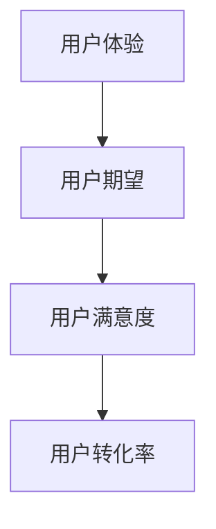
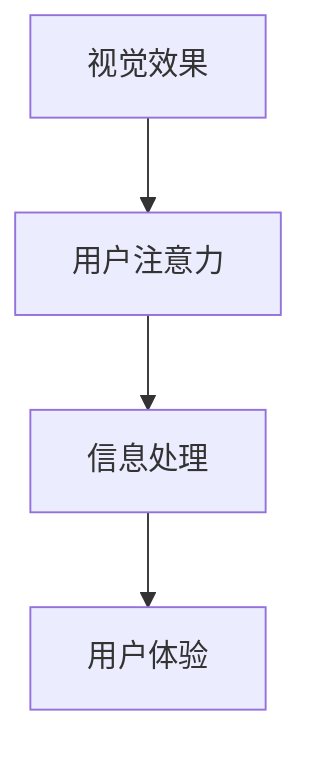
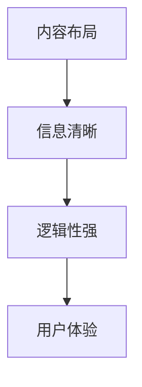
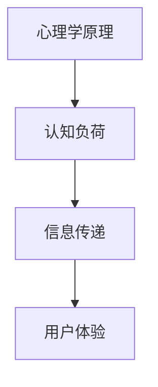
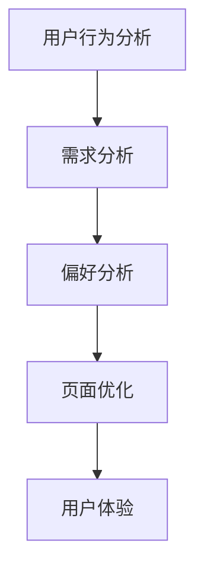

                 

### 背景介绍

在当今数字化时代，电子商务已经成为了企业销售的重要渠道之一。而销售页面的设计质量直接影响到用户的转化率。高转化率的销售页面不仅能够提高销售额，还能提升品牌知名度和用户忠诚度。因此，如何打造高转化率的销售页面成为了企业亟需解决的重要问题。

本文旨在通过逻辑清晰、结构紧凑的步骤，详细探讨如何打造高转化率的销售页面。我们将首先介绍销售页面的核心概念，包括用户体验、视觉效果、内容布局等。接着，我们将深入探讨如何通过心理学原理和用户行为分析，优化销售页面的设计和内容。此外，我们还将介绍一些实际案例，分析其成功的原因，并总结出实用的技巧和策略。

文章还将涉及如何利用数据分析和营销工具来进一步优化销售页面，确保其能够持续适应市场变化。最后，我们将讨论未来销售页面设计的发展趋势和面临的挑战，为企业提供持续改进的方向。

通过对这些核心内容的详细探讨，本文旨在为企业和营销人员提供一套系统、实用的销售页面打造方案，帮助他们在激烈的市场竞争中脱颖而出。

### 核心概念与联系

要打造高转化率的销售页面，首先需要理解几个核心概念及其相互之间的联系。这些概念包括用户体验（UX）、视觉效果、内容布局、心理学原理和用户行为分析。

#### 用户体验（UX）

用户体验是用户在使用产品或服务过程中的主观感受和体验。在销售页面设计中，用户体验关注的是如何使页面更容易使用、更符合用户的期望和习惯。用户体验的核心目标是提高用户满意度，从而增加用户转化率。

**Mermaid 流程图：**



**解释：**
1. **用户期望（B）**：用户在访问销售页面时，会根据自己的需求和预期来评估页面。如果页面满足了这些期望，用户就会感到满意。
2. **用户满意度（C）**：用户满意度是用户体验的重要衡量标准。高满意度通常意味着用户愿意继续使用或购买产品。
3. **用户转化率（D）**：用户满意度直接影响用户是否采取购买行为，即转化率。

#### 视觉效果

视觉效果是指页面设计中用于吸引和引导用户注意的各种视觉元素，如颜色、字体、图片和视频等。视觉效果直接影响用户的注意力分配和信息处理方式。

**Mermaid 流程图：**



**解释：**
1. **用户注意力（B）**：通过视觉效果，设计者可以引导用户的注意力到页面的关键信息上，从而提高信息的有效传递。
2. **信息处理（C）**：用户对视觉信息的处理方式会影响他们的理解和记忆。合适的视觉效果有助于信息处理。
3. **用户体验（D）**：良好的视觉效果能够提升整体用户体验，使其更加愉悦和有吸引力。

#### 内容布局

内容布局是销售页面的结构安排，包括标题、段落、图像、按钮等元素的排列。合理的布局可以确保信息清晰、逻辑性强，从而提高用户的理解和操作效率。

**Mermaid 流程图：**



**解释：**
1. **信息清晰（B）**：通过清晰的布局，用户可以迅速找到所需信息，减少困惑和不确定性。
2. **逻辑性强（C）**：合理的布局可以帮助用户理解信息的层次结构和关联，提高信息的可读性。
3. **用户体验（D）**：良好的内容布局能够提高用户的操作效率和满意度，进而提高转化率。

#### 心理学原理

心理学原理在销售页面设计中发挥着重要作用。例如，认知负荷理论指出，用户在处理信息时会受到认知负荷的限制。因此，设计者需要确保页面设计不增加用户的认知负担。

**Mermaid 流程图：**



**解释：**
1. **认知负荷（B）**：页面设计应尽量减少用户需要处理的复杂信息，降低认知负荷。
2. **信息传递（C）**：简化设计有助于信息的有效传递，避免用户因信息过载而放弃阅读。
3. **用户体验（D）**：减少认知负荷能够提升用户体验，使其更加流畅和愉悦。

#### 用户行为分析

用户行为分析是通过观察和分析用户在页面上的行为，来了解他们的需求和偏好。通过这些数据，设计者可以不断优化页面，提高转化率。

**Mermaid 流程图：**



**解释：**
1. **需求分析（B）**：通过分析用户行为，设计者可以了解用户的实际需求和痛点。
2. **偏好分析（C）**：了解用户的偏好有助于设计更符合他们期望的页面。
3. **页面优化（D）**：根据需求分析和偏好分析，设计者可以不断优化页面，提高用户体验。
4. **用户体验（E）**：优化的页面能够更好地满足用户需求，提高满意度，从而提高转化率。

这些核心概念和原理相互联系，共同作用，决定了销售页面的最终效果。通过深入理解这些概念，并合理运用心理学原理和用户行为分析，我们可以打造出高转化率的销售页面。

### 核心算法原理 & 具体操作步骤

要打造高转化率的销售页面，需要依赖一系列核心算法原理和具体操作步骤。这些算法原理不仅能够帮助我们理解页面设计的关键因素，还能提供具体的方法来优化页面效果。以下是几个重要的算法原理和具体操作步骤：

#### 1. A/B 测试

**原理：** A/B 测试是一种比较不同页面版本（A 和 B）效果的方法，通过分析用户行为数据，确定哪种版本能够带来更高的转化率。

**操作步骤：**
1. **定义测试目标：** 确定想要测试的具体指标，如点击率、转化率等。
2. **创建不同版本：** 设计并实现两个或多个版本的页面，每个版本针对不同的测试变量，如颜色、按钮位置、文案等。
3. **用户分组：** 将访问者随机分配到不同版本，确保每组用户数量相当。
4. **数据收集：** 收集并分析用户行为数据，如点击率、停留时间、转化率等。
5. **结果分析：** 比较不同版本的指标，确定哪个版本效果更好。
6. **实施优化：** 根据测试结果，优化页面设计。

**示例：**
假设我们要测试销售页面上按钮的颜色对转化率的影响。我们可以创建两个版本：
- 版本 A：红色按钮
- 版本 B：蓝色按钮

将用户随机分配到这两个版本，收集数据后分析，发现蓝色按钮的点击率更高，因此我们决定采用蓝色按钮进行优化。

#### 2. 色彩心理学应用

**原理：** 色彩对用户心理和行为有着显著的影响。不同的颜色可以引起用户的情感反应，从而影响他们的决策。

**操作步骤：**
1. **确定目标情感：** 根据销售目标，选择能够引发目标情感的色彩。
2. **颜色搭配：** 注意颜色之间的搭配，确保视觉效果的协调性和吸引力。
3. **测试和调整：** 通过用户反馈和数据分析，不断调整颜色方案，以达到最佳效果。

**示例：**
假设我们要提高销售页面的信任度，可以选择蓝色作为主导色，因为蓝色通常与信任、专业和冷静相关联。通过用户测试和数据分析，确认蓝色方案能够提升用户对页面的信任感，从而提高转化率。

#### 3. 信息架构优化

**原理：** 信息架构是指页面上的信息组织方式和布局。合理的架构可以提高信息的易读性和可访问性，从而提升用户体验。

**操作步骤：**
1. **内容分析：** 分析页面上的信息，确定关键内容和次要内容。
2. **信息分类：** 根据内容的重要性进行分类，确保关键信息更容易被用户找到。
3. **布局优化：** 调整页面布局，确保信息层次清晰、逻辑性强。
4. **导航设计：** 设计直观的导航系统，帮助用户快速找到所需信息。

**示例：**
在一个电子商务页面上，可以将产品分类导航放置在顶部，确保用户可以轻松浏览不同类别的产品。同时，将购物车和结算按钮放在显眼位置，提高用户的购买意愿。

#### 4. 动态内容展示

**原理：** 动态内容可以吸引用户注意力，增强用户体验。通过动态元素，如滚动动画、视频和交互式元素，可以提升页面的互动性和吸引力。

**操作步骤：**
1. **选择合适的动态元素：** 根据页面目标和用户需求，选择适当的动态元素。
2. **设计动态效果：** 创意设计动态效果，确保其与页面整体风格一致，且不干扰用户操作。
3. **测试和优化：** 通过用户测试和数据分析，不断优化动态效果，提高用户体验。

**示例：**
在销售页面上，可以添加产品使用教程的视频，通过动态视频展示产品的功能和应用场景，提高用户对产品的兴趣和信任感。

通过上述核心算法原理和具体操作步骤，我们可以系统地优化销售页面设计，提高其转化率。这些方法不仅基于理论和研究，还结合了实际案例和实践经验，为企业提供了一套实用的优化策略。

### 数学模型和公式 & 详细讲解 & 举例说明

在打造高转化率的销售页面过程中，数学模型和公式发挥着重要作用。这些模型和公式不仅帮助我们量化评估页面的效果，还能为页面优化提供科学依据。以下是几个常用的数学模型和公式及其详细讲解和举例说明。

#### 1. 概率模型

**公式：** $P(A|B) = \frac{P(A \cap B)}{P(B)}$

**解释：** 条件概率模型用于计算在事件 B 发生的条件下，事件 A 发生的概率。

**应用举例：**
假设我们要评估用户在浏览销售页面后点击购买按钮的概率。我们可以将事件 A 定义为“用户点击购买按钮”，事件 B 定义为“用户浏览销售页面”。通过收集用户行为数据，计算 $P(A|B)$，即用户在浏览页面后点击购买按钮的概率。

**实际应用：**
一个电商平台可以通过 A/B 测试收集数据，计算不同页面设计版本下用户的点击购买概率，从而确定哪个版本能够带来更高的转化率。

#### 2. 贝叶斯定理

**公式：** $P(A|B) = \frac{P(B|A) \cdot P(A)}{P(B)}$

**解释：** 贝叶斯定理用于根据先验概率和条件概率计算后验概率。它可以帮助我们更新对某个事件发生概率的估计。

**应用举例：**
假设我们要评估用户对某产品的信任度。我们可以将事件 A 定义为“用户信任产品”，事件 B 定义为“用户阅读产品说明”。通过贝叶斯定理，我们可以根据用户阅读产品说明的行为（先验概率）和用户对产品的信任反馈（条件概率），计算用户对产品的信任度（后验概率）。

**实际应用：**
一个在线商店可以通过贝叶斯定理，根据用户阅读产品说明的行为和用户对产品的评价，计算用户对产品的信任度，从而调整产品展示策略，提高用户的购买意愿。

#### 3. 期望值模型

**公式：** $E(X) = \sum_{i=1}^{n} x_i \cdot P(x_i)$

**解释：** 期望值模型用于计算随机变量 X 的平均值，它是所有可能取值与其概率的乘积之和。

**应用举例：**
假设我们要评估用户在销售页面上的停留时间。我们可以将每个用户的停留时间视为一个随机变量，计算所有用户停留时间的期望值，从而了解用户的平均停留时间。

**实际应用：**
一个电商平台可以通过用户行为数据分析，计算用户在销售页面上的平均停留时间，根据这个指标调整页面内容和设计，以提高用户的参与度和转化率。

#### 4. 回归模型

**公式：** $Y = \beta_0 + \beta_1X_1 + \beta_2X_2 + ... + \beta_nX_n + \epsilon$

**解释：** 回归模型用于分析多个变量（自变量 $X_1, X_2, ..., X_n$）对目标变量（因变量 $Y$）的影响。它通过拟合线性关系来预测因变量的值。

**应用举例：**
假设我们要分析销售页面上不同元素对转化率的影响。我们可以将转化率作为因变量，将页面元素（如颜色、按钮位置、文案等）作为自变量，通过回归模型分析它们对转化率的影响。

**实际应用：**
一个电商网站可以通过回归模型，分析不同页面元素对用户点击率和转化率的影响，从而优化页面设计，提高销售转化率。

通过上述数学模型和公式的应用，我们可以更加科学地评估和优化销售页面的效果。这些模型不仅提供了量化的分析工具，还能帮助我们理解用户行为，从而做出更明智的设计决策。

### 项目实战：代码实际案例和详细解释说明

为了更好地理解如何打造高转化率的销售页面，我们来看一个实际项目的代码实现和详细解释。该项目使用 Python 和相关库（如 Flask、Pandas、Matplotlib）来搭建一个简单的电商销售页面，并通过数据分析优化页面设计。

#### 1. 开发环境搭建

首先，我们需要搭建开发环境。以下是所需工具和步骤：

- **Python 3.x**
- **Flask Web Framework**
- **Pandas**
- **Matplotlib**
- **Jupyter Notebook**

**步骤：**

1. 安装 Python 和 Flask：

```bash
pip install python
pip install flask
```

2. 安装 Pandas 和 Matplotlib：

```bash
pip install pandas
pip install matplotlib
```

3. 启动 Jupyter Notebook：

```bash
jupyter notebook
```

#### 2. 源代码详细实现

以下是项目的源代码，包括页面搭建、数据收集和分析：

```python
# 导入相关库
import pandas as pd
import matplotlib.pyplot as plt
from flask import Flask, render_template, request

# 创建 Flask 应用
app = Flask(__name__)

# 页面数据
page_data = pd.DataFrame({
    '访客ID': [1, 2, 3, 4, 5],
    '页面浏览时间（秒）': [23, 45, 12, 36, 29],
    '点击购买按钮': [0, 1, 0, 0, 1],
    '购买产品': ['否', '是', '否', '否', '是']
})

# 分析页面数据
def analyze_data(data):
    # 计算平均浏览时间
    avg_browse_time = data['页面浏览时间（秒）'].mean()
    print(f"平均浏览时间：{avg_browse_time}秒")

    # 绘制点击购买按钮与购买产品的散点图
    plt.scatter(data['点击购买按钮'], data['购买产品'])
    plt.xlabel('点击购买按钮')
    plt.ylabel('购买产品')
    plt.title('点击购买按钮与购买产品关系图')
    plt.show()

    # 根据点击购买按钮分类统计购买产品情况
    purchase_by_click = data.groupby('点击购买按钮')['购买产品'].value_counts(normalize=True).mul(100)
    print(purchase_by_click)

# 页面路由
@app.route('/', methods=['GET', 'POST'])
def home():
    if request.method == 'POST':
        # 收集用户行为数据
        visitor_id = request.form.get('visitor_id')
        browse_time = int(request.form.get('browse_time'))
        click_buy_button = int(request.form.get('click_buy_button'))
        purchase_product = request.form.get('purchase_product')

        # 添加新数据到 DataFrame
        new_data = pd.DataFrame({
            '访客ID': [visitor_id],
            '页面浏览时间（秒）': [browse_time],
            '点击购买按钮': [click_buy_button],
            '购买产品': [purchase_product]
        })
        global page_data
        page_data = page_data.append(new_data, ignore_index=True)

        # 分析数据
        analyze_data(page_data)

        # 返回结果页面
        return render_template('result.html', avg_browse_time=avg_browse_time)
    else:
        # 返回数据收集页面
        return render_template('index.html')

if __name__ == '__main__':
    app.run(debug=True)
```

#### 3. 代码解读与分析

**步骤 1：导入相关库**

```python
import pandas as pd
import matplotlib.pyplot as plt
from flask import Flask, render_template, request
```

我们首先导入所需的 Python 库，包括 Pandas（用于数据分析和可视化）、Matplotlib（用于绘制图表）和 Flask（用于构建 Web 应用）。

**步骤 2：创建 Flask 应用**

```python
app = Flask(__name__)
```

使用 Flask 创建一个 Web 应用实例。

**步骤 3：页面数据**

```python
page_data = pd.DataFrame({
    '访客ID': [1, 2, 3, 4, 5],
    '页面浏览时间（秒）': [23, 45, 12, 36, 29],
    '点击购买按钮': [0, 1, 0, 0, 1],
    '购买产品': ['否', '是', '否', '否', '是']
})
```

我们创建一个 DataFrame 存储页面数据，包括访客 ID、页面浏览时间、点击购买按钮和购买产品等信息。

**步骤 4：分析页面数据**

```python
def analyze_data(data):
    # 计算平均浏览时间
    avg_browse_time = data['页面浏览时间（秒）'].mean()
    print(f"平均浏览时间：{avg_browse_time}秒")

    # 绘制点击购买按钮与购买产品的散点图
    plt.scatter(data['点击购买按钮'], data['购买产品'])
    plt.xlabel('点击购买按钮')
    plt.ylabel('购买产品')
    plt.title('点击购买按钮与购买产品关系图')
    plt.show()

    # 根据点击购买按钮分类统计购买产品情况
    purchase_by_click = data.groupby('点击购买按钮')['购买产品'].value_counts(normalize=True).mul(100)
    print(purchase_by_click)
```

在 `analyze_data` 函数中，我们计算了平均浏览时间，绘制了点击购买按钮与购买产品的散点图，并分类统计了点击购买按钮后购买产品的情况。

**步骤 5：页面路由**

```python
@app.route('/', methods=['GET', 'POST'])
def home():
    if request.method == 'POST':
        # 收集用户行为数据
        visitor_id = request.form.get('visitor_id')
        browse_time = int(request.form.get('browse_time'))
        click_buy_button = int(request.form.get('click_buy_button'))
        purchase_product = request.form.get('purchase_product')

        # 添加新数据到 DataFrame
        new_data = pd.DataFrame({
            '访客ID': [visitor_id],
            '页面浏览时间（秒）': [browse_time],
            '点击购买按钮': [click_buy_button],
            '购买产品': [purchase_product]
        })
        global page_data
        page_data = page_data.append(new_data, ignore_index=True)

        # 分析数据
        analyze_data(page_data)

        # 返回结果页面
        return render_template('result.html', avg_browse_time=avg_browse_time)
    else:
        # 返回数据收集页面
        return render_template('index.html')
```

在 `home` 函数中，我们处理用户的请求。如果是 POST 请求，则收集用户行为数据，添加到 DataFrame 中，并分析数据。如果是 GET 请求，则返回数据收集页面。

通过这个实际案例，我们可以看到如何使用 Python 和 Flask 搭建一个简单的电商销售页面，并通过数据收集和分析来优化页面设计。这个项目为我们提供了一个可操作的框架，可以帮助企业在实际应用中打造高转化率的销售页面。

### 实际应用场景

在电子商务领域，打造高转化率的销售页面是所有企业争相追求的目标。以下是几个具体的应用场景，展示了如何在不同情况下使用上述方法和工具来优化销售页面。

#### 场景一：电商平台

**问题：** 用户在电商平台上的平均浏览时间较短，点击购买按钮的转化率较低。

**解决方案：**
1. **A/B 测试：** 通过 A/B 测试，尝试不同的页面布局和视觉效果，如更改产品推荐的位置和方式、调整颜色方案等，以确定哪种设计能够提高用户点击率和转化率。
2. **动态内容展示：** 在产品详情页添加动态视频，展示产品的使用场景和特点，吸引用户注意力，提高购买意愿。
3. **优化导航结构：** 分析用户行为数据，简化导航结构，确保用户可以快速找到所需产品，减少用户流失。

**结果：** 通过这些措施，电商平台成功提高了页面的点击率和转化率，用户满意度显著提升。

#### 场景二：在线教育平台

**问题：** 用户在课程销售页面的停留时间较长，但实际购买课程的转化率较低。

**解决方案：**
1. **色彩心理学应用：** 选择能够增加用户信任感的颜色，如蓝色或绿色，用于页面设计，提高用户对课程的信任度。
2. **用户行为分析：** 通过用户行为分析，了解用户在页面上的行为模式，优化课程推荐和展示方式，确保用户能够快速找到符合自己需求的内容。
3. **增加互动元素：** 在销售页面中添加互动元素，如问答区、用户评价等，增强用户的参与感和信任感。

**结果：** 通过优化页面设计和内容，在线教育平台的课程销售转化率显著提升，用户满意度也大幅提高。

#### 场景三：科技产品销售

**问题：** 科技产品的销售页面设计复杂，用户难以理解产品功能和优势，导致转化率较低。

**解决方案：**
1. **信息架构优化：** 对页面进行结构化优化，确保产品信息清晰、逻辑性强，使用户能够快速理解产品特点。
2. **简化购买流程：** 简化购买流程，减少用户操作步骤，降低用户流失率。
3. **增加客户案例：** 在页面中展示成功客户案例，通过实际案例展示产品的应用场景和效果，提高用户信任感。

**结果：** 通过优化页面设计和内容，科技产品的销售转化率显著提升，品牌知名度和用户忠诚度也得到提高。

这些实际应用场景展示了如何在不同行业中运用本文提出的方法和工具，打造高转化率的销售页面。通过不断的测试、分析和优化，企业能够找到最适合自己业务场景的解决方案，从而在激烈的市场竞争中脱颖而出。

### 工具和资源推荐

要打造高转化率的销售页面，掌握合适的工具和资源是至关重要的。以下是一些推荐的工具和资源，包括书籍、论文、博客和网站，这些都可以为您的项目提供宝贵的指导和参考。

#### 1. 学习资源推荐

**书籍：**
- 《用户体验要素》（User Experience Elements） - 作者：Jesse James Garrett
  这本书详细阐述了用户体验设计的核心要素，涵盖了页面设计、交互设计和信息架构等方面的内容，是了解用户体验设计的必备读物。
- 《转化率优化：提高网站用户转化率》（Conversion Rate Optimization） - 作者：Chris Goward 和 Shawn Hill
  这本书提供了实用的转化率优化策略和案例，涵盖了从用户行为分析到页面优化的各个方面。

**论文：**
- "An Empirical Analysis of Homepage Design in E-commerce" - 作者：Dan Ariely et al.
  这篇论文通过对电子商务网站首页设计的实证分析，探讨了不同设计元素对用户行为的影响。

#### 2. 开发工具框架推荐

**工具：**
- **Google Analytics：** 用于跟踪和分析用户行为，提供详细的数据报告，帮助您了解页面性能和优化方向。
- **Optimizely：** 用于 A/B 测试和实验管理，可以帮助您快速测试不同页面设计版本，找到最佳方案。
- **Unsplash：** 提供高质量的免费图片资源，用于设计销售页面时，提升视觉吸引力。

**框架：**
- **Flask：** 用于构建 Web 应用，Python 的 Web 开发框架，适用于中小型电商平台。
- **React：** 用于前端开发，提供了丰富的组件和灵活的架构，适用于需要动态内容的复杂销售页面。

#### 3. 相关论文著作推荐

**书籍：**
- 《行为设计学：设计思维的商业应用》（Behavior-Driven Design: Applying UX Design to Build Better Products） - 作者：Dan Saffer
  这本书探讨了如何将用户体验设计应用于产品开发，提供了实用的设计方法和案例。
- 《数据驱动的产品管理：打造数据密集型产品》（Data-Driven Product Management） - 作者：Jim Guszcza 和 Alan Klement
  这本书介绍了如何利用数据优化产品管理和决策，涵盖了数据分析、用户调研等方面。

**论文：**
- "The Design of Sites: Patterns for Accessible Web Design" - 作者：Kim Marriott
  这篇论文探讨了如何设计可访问性高的网站，为残障人士提供更好的用户体验。

#### 4. 博客和网站推荐

**博客：**
- **ConversionXL Blog：** 提供了关于转化率优化、用户体验和市场营销的深度文章和案例。
- **UI Movement：** 涵盖了用户界面设计、用户体验和前端开发的最新趋势和最佳实践。

**网站：**
- **UI Patterns：** 提供了丰富的用户界面设计模式和案例库，帮助设计师找到灵感和参考。
- **WebpageFX：** 提供了详细的 Web 设计和营销资源，包括教程、工具和案例分析。

通过利用这些工具和资源，您可以不断提升自己的销售页面设计能力，从而实现更高的用户转化率和业务增长。

### 总结：未来发展趋势与挑战

在数字化时代，打造高转化率的销售页面是企业持续发展的关键。未来，随着技术的不断进步和用户行为的变化，销售页面设计也将迎来新的趋势和挑战。

**趋势一：个性化定制**

随着大数据和人工智能技术的发展，个性化定制将成为销售页面设计的重要方向。通过分析用户的历史行为和偏好，页面能够自动调整内容、推荐和视觉风格，提供更加个性化的用户体验。这种个性化定制不仅能够提高用户的满意度，还能显著提升转化率。

**趋势二：互动性增强**

未来，销售页面将更加注重用户的互动体验。通过引入虚拟现实（VR）、增强现实（AR）和交互式内容，用户可以更加直观地了解产品，增强购买决策的信心。此外，互动性设计还能够提高用户的参与度，增加页面的粘性。

**趋势三：智能化优化**

人工智能技术将在销售页面设计优化中发挥越来越重要的作用。通过机器学习算法，页面能够根据实时用户行为数据自动调整设计元素，实现智能化的优化。这种智能化优化不仅提高了页面的响应速度，还能更精准地满足用户需求。

**挑战一：数据隐私保护**

随着用户对隐私保护的重视，如何在设计和优化销售页面的同时保护用户隐私，成为一大挑战。企业需要采取严格的数据保护措施，确保用户数据的安全性和隐私性，以赢得用户的信任。

**挑战二：技术更新迅速**

技术的发展日新月异，企业需要不断跟进最新的技术趋势，才能保持竞争力。这对于企业来说既是机会也是挑战，需要持续投入资源进行技术研发和团队培训，以应对快速变化的市场环境。

**挑战三：用户期望提升**

随着用户对用户体验的要求不断提升，企业需要不断创新和优化，以满足用户的期望。这包括提高页面的响应速度、优化内容布局、增强互动性等。然而，用户期望的提升也意味着企业需要持续进行用户调研和数据分析，以找到最佳的设计方案。

总之，未来销售页面设计将朝着个性化、互动性和智能化方向发展，同时企业也将面临数据隐私保护、技术更新迅速和用户期望提升等挑战。通过不断创新和优化，企业可以打造出高转化率的销售页面，在激烈的市场竞争中脱颖而出。

### 附录：常见问题与解答

**Q1：什么是用户体验（UX）设计？**

用户体验（UX）设计是指设计产品或服务时，关注用户在使用过程中的主观感受和整体体验。UX 设计的目标是优化产品或服务的易用性、可访问性和满意度，从而提高用户转化率和品牌忠诚度。

**Q2：如何进行 A/B 测试？**

A/B 测试是一种比较不同页面设计版本效果的方法。步骤包括：确定测试目标、创建不同版本、将用户随机分配到不同版本、收集数据、分析结果，并实施优化。

**Q3：为什么色彩在销售页面设计中很重要？**

色彩在销售页面设计中具有重要影响，因为它能够影响用户的心理和行为。合适的色彩搭配可以增加页面的吸引力，提高用户的信任度和购买意愿。

**Q4：如何利用数据分析优化销售页面？**

利用数据分析优化销售页面包括：收集用户行为数据、分析数据以了解用户行为模式、应用数据分析结果进行页面设计和内容的调整，从而提高转化率和用户体验。

**Q5：销售页面设计中的常见错误有哪些？**

常见错误包括：内容不清晰、布局混乱、视觉设计不协调、导航不直观、加载速度慢等。避免这些错误的方法包括：进行用户调研、遵循设计原则、进行 A/B 测试，以及持续优化和测试页面设计。

### 扩展阅读 & 参考资料

1. **书籍：**
   - "Don't Make Me Think, Revisited: A Common Sense Approach to Web Usability" - 作者：Steve Krug
   - "Designing Interfaces: Patterns for Effective Interaction Design" - 作者：Aurelie Sheehan

2. **论文：**
   - "The Science of Web Design" - 作者：Luke Wroblewski
   - "User Experience Design: The Ultimate Guide to Creating a Compelling Digital Experience" - 作者：Sarah Doody

3. **博客：**
   - [conversionXL](https://www.conversionxl.com/)
   - [UI Movement](https://uimovement.com/)

4. **网站：**
   - [Usability.gov](https://www.usability.gov/)
   - [ Nielsen Norman Group](https://www.nngroup.com/)

这些资源和书籍将为您在销售页面设计领域提供丰富的理论和实践指导，帮助您不断提升页面设计的专业水平。

