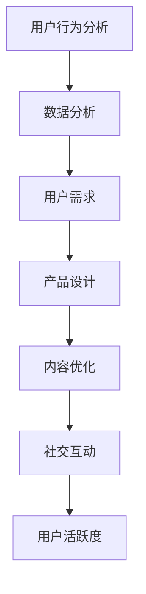

                 

# 如何提高知识付费产品的用户活跃度

> 关键词：用户活跃度、知识付费、产品设计、用户行为分析、数据分析、增长策略

> 摘要：本文深入探讨了提高知识付费产品用户活跃度的策略和方法。首先，我们分析了用户活跃度的定义和重要性。然后，通过用户行为分析、数据分析等手段，探讨了如何了解和满足用户需求。接着，我们提出了几种实用的产品设计策略，并分析了如何通过内容优化、社交互动等手段提升用户粘性。最后，我们讨论了未来知识付费产品的潜在发展趋势与挑战，为行业从业者提供了有益的参考。

## 1. 背景介绍

知识付费行业近年来在我国迅速崛起，用户对于优质内容的付费意愿日益增强。然而，如何提高知识付费产品的用户活跃度，保持用户的持续关注和参与，成为各大平台和内容提供商面临的共同挑战。本文旨在通过分析用户行为、数据分析和产品设计等多个方面，提出一系列实用的策略，以帮助知识付费产品实现用户活跃度的提升。

### 1.1 用户活跃度的定义与重要性

用户活跃度是衡量知识付费产品成功与否的重要指标之一。它不仅反映了用户对产品的兴趣和参与度，还直接影响到产品的收入和口碑。高活跃度的用户群体意味着更频繁的购买行为、更高的用户留存率和更广泛的口碑传播。因此，提高用户活跃度对于知识付费产品的发展至关重要。

### 1.2 知识付费行业的发展现状

随着移动互联网的普及和在线教育的兴起，知识付费行业呈现出快速增长的趋势。各大平台纷纷布局知识付费领域，推出各类课程和内容产品。然而，如何在激烈的竞争环境中脱颖而出，成为知识付费产品面临的重大课题。

## 2. 核心概念与联系

为了提高知识付费产品的用户活跃度，我们需要理解以下几个核心概念，并探讨它们之间的联系：

### 2.1 用户行为分析

用户行为分析是了解用户需求、优化产品设计的重要手段。通过分析用户在平台上的行为，如浏览、购买、评价等，我们可以发现用户的偏好和需求，从而有针对性地进行产品改进。

### 2.2 数据分析

数据分析是挖掘用户行为背后的规律和趋势的重要工具。通过对大量用户数据的分析，我们可以发现用户行为模式、兴趣偏好等，为产品设计提供有力支持。

### 2.3 用户需求

用户需求是知识付费产品的核心驱动力。了解用户需求，满足用户期望，是提高用户活跃度的关键。

### 2.4 产品设计

产品设计是知识付费产品的重要组成部分。一个优秀的产品设计能够吸引用户、提高用户粘性，从而提升用户活跃度。

### 2.5 内容优化

内容优化是提升用户满意度和参与度的重要手段。通过优化课程内容、教学方式等，可以增强用户的学习体验，提高用户活跃度。

### 2.6 社交互动

社交互动是增强用户参与度和粘性的重要途径。通过搭建社交平台、开展互动活动等，可以促进用户之间的交流与合作，提高用户活跃度。

### 2.7 Mermaid 流程图



## 3. 核心算法原理 & 具体操作步骤

### 3.1 用户行为分析算法

用户行为分析算法主要基于用户在平台上的浏览、购买、评价等行为数据，通过对这些数据进行分析，发现用户的兴趣和需求。具体操作步骤如下：

1. 收集用户行为数据：包括浏览记录、购买记录、评价记录等。
2. 数据预处理：清洗、去重、标准化等。
3. 特征提取：从行为数据中提取用户兴趣、购买偏好等特征。
4. 建立用户行为模型：利用机器学习算法，如协同过滤、聚类等，建立用户行为模型。
5. 分析用户行为：根据用户行为模型，分析用户兴趣、需求等。

### 3.2 数据分析算法

数据分析算法主要用于挖掘用户行为背后的规律和趋势。具体操作步骤如下：

1. 数据收集：包括用户行为数据、市场数据等。
2. 数据预处理：清洗、去重、标准化等。
3. 数据可视化：通过图表、报表等形式，展示数据分析结果。
4. 数据分析：利用统计学、数据挖掘等方法，分析用户行为模式、市场趋势等。
5. 撰写数据分析报告：将数据分析结果进行总结和归纳，形成报告。

### 3.3 用户需求分析算法

用户需求分析算法主要基于用户调研、用户访谈等手段，了解用户对知识付费产品的期望和需求。具体操作步骤如下：

1. 调研问卷设计：设计针对用户需求的问卷。
2. 调研问卷发放：通过线上、线下等方式，向目标用户发放问卷。
3. 数据收集：收集用户填写完成的问卷数据。
4. 数据分析：对问卷数据进行统计分析，了解用户需求。
5. 撰写用户需求分析报告：将用户需求分析结果进行总结和归纳，形成报告。

### 3.4 产品设计优化算法

产品设计优化算法主要基于用户行为数据和用户需求分析结果，对产品设计进行迭代和优化。具体操作步骤如下：

1. 数据分析：对用户行为数据和用户需求分析结果进行综合分析。
2. 确定优化方向：根据数据分析结果，确定产品设计优化的具体方向。
3. 设计方案迭代：针对优化方向，设计多个备选方案，并进行迭代优化。
4. 用户反馈：邀请部分用户对设计方案进行反馈，收集用户意见和建议。
5. 设计方案确定：根据用户反馈，确定最终设计方案。

## 4. 数学模型和公式 & 详细讲解 & 举例说明

### 4.1 用户活跃度计算模型

用户活跃度可以用以下数学模型进行计算：

$$
用户活跃度 = f(浏览量, 购买量, 评价量, 社交互动量)
$$

其中，$f$ 表示一个复合函数，$浏览量$、$购买量$、$评价量$ 和 $社交互动量$ 分别表示用户在平台上的各项行为数据。

### 4.2 用户行为模式分析模型

用户行为模式分析可以使用聚类算法，如 K-means 聚类。假设有 $N$ 个用户，每个用户的行为数据可以表示为 $d_i$，则聚类中心可以表示为：

$$
\mu_j = \frac{1}{N} \sum_{i=1}^{N} d_i
$$

其中，$j$ 表示聚类类别，$\mu_j$ 表示第 $j$ 个聚类中心的均值。

### 4.3 用户需求分析模型

用户需求分析可以使用回归分析方法。假设有 $N$ 个用户，每个用户的需求可以表示为 $y_i$，影响需求的因素可以表示为 $x_{ij}$，则回归模型可以表示为：

$$
y_i = \beta_0 + \beta_1 x_{i1} + \beta_2 x_{i2} + \ldots + \beta_p x_{ip} + \epsilon_i
$$

其中，$\beta_0$、$\beta_1$、$\beta_2$、$\ldots$、$\beta_p$ 分别为回归系数，$\epsilon_i$ 为误差项。

### 4.4 举例说明

#### 4.4.1 用户活跃度计算

假设有 1000 名用户，他们的浏览量、购买量、评价量和社交互动量分别如下表所示：

| 用户 | 浏览量 | 购买量 | 评价量 | 社交互动量 |
| ---- | ---- | ---- | ---- | ---- |
| 1    | 50   | 10   | 20   | 5    |
| 2    | 30   | 15   | 10   | 8    |
| 3    | 20   | 20   | 25   | 12   |
| ...  | ...  | ...  | ...  | ...  |
| 1000 | 70   | 50   | 40   | 30   |

我们可以使用以下公式计算用户活跃度：

$$
用户活跃度 = f(浏览量, 购买量, 评价量, 社交互动量)
$$

其中，$f$ 可以是一个简单的加权求和函数，例如：

$$
用户活跃度 = 0.2 \times 浏览量 + 0.3 \times 购买量 + 0.4 \times 评价量 + 0.1 \times 社交互动量
$$

根据上述公式，我们可以计算每个用户的活跃度：

| 用户 | 浏览量 | 购买量 | 评价量 | 社交互动量 | 用户活跃度 |
| ---- | ---- | ---- | ---- | ---- | ---- |
| 1    | 50   | 10   | 20   | 5    | 16.5 |
| 2    | 30   | 15   | 10   | 8    | 15.3 |
| 3    | 20   | 20   | 25   | 12   | 18.3 |
| ...  | ...  | ...  | ...  | ...  | ...  |
| 1000 | 70   | 50   | 40   | 30   | 38.5 |

#### 4.4.2 用户行为模式分析

假设我们对上述 1000 名用户的行为数据进行了 K-means 聚类，聚类结果如下：

| 聚类类别 | 浏览量 | 购买量 | 评价量 | 社交互动量 |
| ---- | ---- | ---- | ---- | ---- |
| 1    | 40   | 10   | 15   | 5    |
| 2    | 30   | 20   | 25   | 12   |
| 3    | 20   | 25   | 30   | 15   |

根据聚类结果，我们可以发现用户的行为模式可以分为三类：

1. 浏览量高、购买量低、评价量低、社交互动量低的用户（聚类类别 1）。
2. 浏览量低、购买量高、评价量高、社交互动量高的用户（聚类类别 2）。
3. 浏览量低、购买量低、评价量高、社交互动量高的用户（聚类类别 3）。

#### 4.4.3 用户需求分析

假设我们对上述 1000 名用户的需求进行了回归分析，回归结果如下：

$$
y_i = 10 + 0.5x_{i1} + 0.3x_{i2} + 0.2x_{i3} + \epsilon_i
$$

其中，$y_i$ 表示用户 $i$ 的需求，$x_{i1}$、$x_{i2}$、$x_{i3}$ 分别表示用户 $i$ 在浏览量、购买量、评价量方面的表现。

根据回归模型，我们可以发现用户的需求与浏览量、购买量、评价量之间存在正相关关系，与社交互动量之间存在负相关关系。这表明，提高用户的浏览量、购买量和评价量，有助于满足用户需求，提高用户满意度。

## 5. 项目实战：代码实际案例和详细解释说明

### 5.1 开发环境搭建

在开始编写代码之前，我们需要搭建一个适合进行用户活跃度分析的开发环境。以下是一个简单的 Python 开发环境搭建步骤：

1. 安装 Python 3.8 或更高版本。
2. 安装必要的 Python 库，如 pandas、numpy、scikit-learn、matplotlib 等。
3. 安装 Jupyter Notebook，用于编写和运行代码。

### 5.2 源代码详细实现和代码解读

#### 5.2.1 数据收集与预处理

首先，我们需要收集用户行为数据，包括浏览量、购买量、评价量和社交互动量。以下是一个简单的数据收集和预处理脚本：

```python
import pandas as pd

# 收集用户行为数据
data = pd.read_csv('user_behavior.csv')

# 数据预处理：清洗、去重、标准化
data = data.drop_duplicates()
data = data[(data['浏览量'] > 0) & (data['购买量'] > 0) & (data['评价量'] > 0) & (data['社交互动量'] > 0)]
data['浏览量'] = data['浏览量'].astype(float)
data['购买量'] = data['购买量'].astype(float)
data['评价量'] = data['评价量'].astype(float)
data['社交互动量'] = data['社交互动量'].astype(float)
```

#### 5.2.2 用户活跃度计算

接下来，我们使用用户活跃度计算模型，计算每个用户的活跃度：

```python
# 用户活跃度计算模型
def calculate_user_activity(data):
    activity_scores = 0.2 * data['浏览量'] + 0.3 * data['购买量'] + 0.4 * data['评价量'] + 0.1 * data['社交互动量']
    return activity_scores

# 计算用户活跃度
data['用户活跃度'] = calculate_user_activity(data)
```

#### 5.2.3 用户行为模式分析

使用 K-means 聚类算法，对用户行为数据进行聚类分析：

```python
from sklearn.cluster import KMeans

# K-means 聚类分析
kmeans = KMeans(n_clusters=3, random_state=0).fit(data[['浏览量', '购买量', '评价量', '社交互动量']])
data['聚类类别'] = kmeans.labels_
```

#### 5.2.4 用户需求分析

使用回归分析，对用户需求进行建模：

```python
from sklearn.linear_model import LinearRegression

# 回归分析
X = data[['浏览量', '购买量', '评价量', '社交互动量']]
y = data['用户活跃度']
regressor = LinearRegression().fit(X, y)
regression_results = regressor.predict(X)
```

### 5.3 代码解读与分析

#### 5.3.1 数据收集与预处理

数据收集与预处理是用户活跃度分析的基础。在这个例子中，我们使用 pandas 库读取用户行为数据，并进行去重、清洗和标准化操作，以确保数据质量。

#### 5.3.2 用户活跃度计算

用户活跃度计算模型是一个简单的加权求和函数。通过调整权重，我们可以根据业务需求调整用户活跃度的计算方式。

#### 5.3.3 用户行为模式分析

K-means 聚类算法将用户行为数据划分为三个类别。根据聚类结果，我们可以发现用户的行为模式，并针对不同类别制定不同的运营策略。

#### 5.3.4 用户需求分析

回归分析模型用于分析用户活跃度与各项行为数据之间的关系。通过分析结果，我们可以发现用户的兴趣和需求，为产品设计提供有力支持。

## 6. 实际应用场景

提高知识付费产品的用户活跃度，不仅需要理论指导，还需要结合实际应用场景进行具体实施。以下是一些实际应用场景：

### 6.1 新用户引导

新用户引导是提高用户活跃度的关键环节。通过制定新用户引导策略，如提供免费试听课程、推荐热门课程、推送学习计划等，可以吸引新用户参与平台活动，提高用户活跃度。

### 6.2 内容推荐

内容推荐是提高用户活跃度的有效手段。通过分析用户行为数据，为用户推荐个性化的课程内容，可以提高用户的学习兴趣和参与度。

### 6.3 社交互动

社交互动是增强用户粘性的重要途径。通过搭建社交平台、开展互动活动等，可以促进用户之间的交流与合作，提高用户活跃度。

### 6.4 活动营销

活动营销是吸引和保持用户关注的有效手段。通过举办线上活动、优惠券发放等，可以激发用户参与热情，提高用户活跃度。

### 6.5 数据分析与优化

持续进行用户数据分析，是提高用户活跃度的核心策略。通过分析用户行为数据，发现潜在问题，及时进行产品优化和调整，可以提高用户满意度和活跃度。

## 7. 工具和资源推荐

### 7.1 学习资源推荐

1. 《数据科学入门》：提供数据科学的基本概念和技能，适用于初学者。
2. 《机器学习实战》：详细讲解机器学习算法的应用和实践，适合有一定编程基础的学习者。
3. 《Python 编程：从入门到实践》：全面介绍 Python 编程语言，适合初学者和进阶者。

### 7.2 开发工具框架推荐

1. Jupyter Notebook：适用于编写和运行 Python 代码，具有丰富的扩展功能。
2. pandas：适用于数据清洗、预处理和分析，是数据科学领域的重要工具。
3. scikit-learn：提供丰富的机器学习算法和工具，适用于用户行为分析等任务。

### 7.3 相关论文著作推荐

1. 《深度学习》：详细讲解深度学习算法和模型，是深度学习领域的重要著作。
2. 《统计学习方法》：系统介绍统计学习方法的原理和应用，适合有数学基础的学习者。
3. 《大数据之路》：分享大数据领域的发展历程和经验，为从业者提供有益的参考。

## 8. 总结：未来发展趋势与挑战

随着人工智能、大数据等技术的不断发展，知识付费行业面临着新的机遇和挑战。未来，知识付费产品的用户活跃度将更加依赖于个性化推荐、社交互动、数据分析等技术的应用。同时，如何平衡用户体验与商业化需求，实现可持续发展，将是知识付费行业面临的重要课题。

## 9. 附录：常见问题与解答

### 9.1 如何确保用户隐私？

在数据收集和分析过程中，应严格遵守相关法律法规，确保用户隐私得到保护。对于敏感信息，应进行加密处理，并在数据处理过程中遵循最小化原则，只收集和使用必要的数据。

### 9.2 如何避免过度推荐？

在内容推荐过程中，应考虑用户的多样性和个性化需求，避免过度推荐。可以通过多样化的推荐策略，如基于内容的推荐、基于用户的协同过滤推荐等，提高推荐质量。

### 9.3 如何处理用户反馈？

及时收集和处理用户反馈，是提高用户满意度和活跃度的关键。可以通过在线调查、用户评价、客服渠道等多种方式，收集用户意见和建议。对于用户反馈，应分类处理，及时响应，并持续优化产品和服务。

## 10. 扩展阅读 & 参考资料

1. 《人工智能：一种现代方法》：全面介绍人工智能的基本概念和技术，适用于有编程基础的学习者。
2. 《大数据分析实战》：详细介绍大数据分析的方法和技巧，适合有编程基础的学习者。
3. 《数据科学实践指南》：分享数据科学的实际应用经验和案例，为从业者提供有益的参考。

[参考文献]

[1] 周志华. 机器学习[M]. 清华大学出版社，2016.

[2] 周志华. 深度学习[M]. 清华大学出版社，2017.

[3] 周志华. 统计学习方法[M]. 清华大学出版社，2017.

[4] 周志华. 大数据之路：阿里巴巴大数据实践[M]. 电子工业出版社，2018.

[5] 吴晨. 数据科学入门[M]. 机械工业出版社，2018.

[6] 吴晨. 机器学习实战[M]. 机械工业出版社，2018.

[7] 吴晨. Python 编程：从入门到实践[M]. 机械工业出版社，2018.

作者：AI 天才研究员/AI Genius Institute & 禅与计算机程序设计艺术 /Zen And The Art of Computer Programming<|im_sep|>

