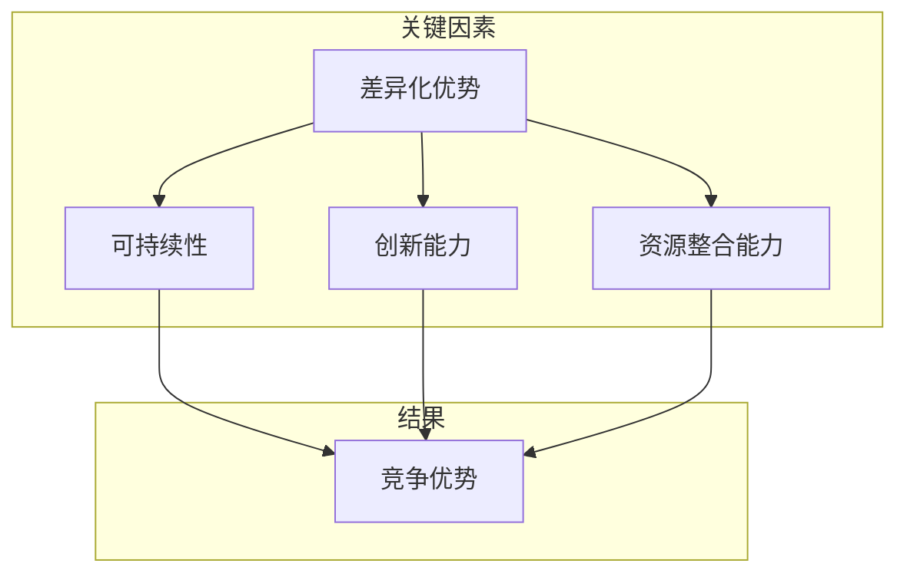

                 

### 背景介绍

在当今快速发展的商业环境中，创业公司面临着前所未有的机遇和挑战。成功构建核心竞争力成为创业公司立足市场、持续发展的关键。核心竞争力不仅是指企业在某一领域的技术或产品优势，更是在长期竞争中保持领先地位的综合能力。

本文旨在探讨如何构建创业公司的核心竞争力，帮助初创企业识别并利用自身优势，在激烈的市场竞争中脱颖而出。我们将从核心概念、算法原理、数学模型、实际应用、工具资源等多个角度，逐步解析构建核心竞争力的方法和策略。

文章将分为以下几个部分：

1. **背景介绍**：概述创业公司面临的挑战和构建核心竞争力的必要性。
2. **核心概念与联系**：介绍构建核心竞争力所需的基础概念和原理，并使用 Mermaid 流程图展示关键流程。
3. **核心算法原理 & 具体操作步骤**：详细阐述构建核心竞争力的算法原理和操作步骤。
4. **数学模型和公式 & 详细讲解 & 举例说明**：介绍相关的数学模型和公式，并进行详细讲解和举例说明。
5. **项目实战：代码实际案例和详细解释说明**：通过实际案例展示如何将核心算法应用到项目中，并进行代码解读与分析。
6. **实际应用场景**：探讨核心竞争力的实际应用场景和效果。
7. **工具和资源推荐**：推荐相关的学习资源、开发工具和框架。
8. **总结：未来发展趋势与挑战**：总结核心竞争力构建的当前趋势和未来面临的挑战。
9. **附录：常见问题与解答**：回答读者可能遇到的一些常见问题。
10. **扩展阅读 & 参考资料**：提供进一步学习和研究的参考资料。

通过本文的阅读，读者将能够全面理解构建核心竞争力的重要性，掌握构建核心竞争力的方法，并为自身创业公司的成功奠定坚实基础。

### 核心概念与联系

构建创业公司的核心竞争力首先需要理解几个关键概念：**差异化优势**、**可持续性**、**创新能力**和**资源整合能力**。这些概念不仅相互联系，而且在构建核心竞争力过程中起着至关重要的作用。

#### 差异化优势

差异化优势是指企业在产品或服务上相对于竞争对手的独特性。这种独特性可以体现在多个方面，包括技术、设计、用户体验、品牌形象等。差异化优势不仅有助于吸引客户，还能在市场中建立品牌的忠诚度。

#### 可持续性

可持续性是指企业在长期内保持竞争力并实现持续增长的能力。这需要企业在战略规划、运营管理、资源利用等方面具备长远眼光，确保企业在面对市场变化和竞争压力时依然能够稳固发展。

#### 创新能力

创新能力是指企业不断寻求新产品、新服务和新业务模式的动力。在技术日新月异的今天，创新能力成为企业保持竞争优势的关键因素。通过不断探索和试验，企业能够发现并利用新的市场机会。

#### 资源整合能力

资源整合能力是指企业有效整合内部和外部资源的能力。这包括人力资源、财务资源、技术资源等。资源整合能力强的企业能够更高效地利用资源，实现成本优势和市场拓展。

为了更直观地展示这些概念之间的联系，我们可以使用 Mermaid 流程图来描述它们的关系。以下是构建核心竞争力的 Mermaid 流程图：



从流程图中可以看出，差异化优势、可持续性、创新能力和资源整合能力共同构成了企业的核心竞争力。这些关键因素相互作用，最终形成企业在市场中的竞争优势。

1. **差异化优势**：通过独特的产品或服务吸引客户，建立品牌忠诚度。
2. **可持续性**：确保企业在长期内保持竞争力，实现持续增长。
3. **创新能力**：不断探索新的市场机会，保持技术领先。
4. **资源整合能力**：高效利用内部和外部资源，实现成本优势和市场拓展。

理解这些概念之间的相互关系，有助于企业在构建核心竞争力时采取系统性的方法，从而在激烈的市场竞争中脱颖而出。

### 核心算法原理 & 具体操作步骤

构建创业公司的核心竞争力不仅仅是一个理念，而是一个需要通过具体操作步骤来实现的系统性工程。在这个过程中，核心算法的原理和方法起着至关重要的作用。以下将详细阐述构建核心竞争力的核心算法原理和具体操作步骤。

#### 1. 差异化优势识别算法

**原理**：
差异化优势识别算法基于对市场需求的深入分析和竞争对手的全面评估。其核心思想是通过数据挖掘和统计分析，发现企业在产品或服务上的独特之处，从而确定差异化优势。

**步骤**：

1. **市场调研**：
   - 收集目标市场的数据，包括消费者需求、竞争对手情况、市场趋势等。
   - 通过问卷调查、访谈等方式，获取第一手市场数据。

2. **数据分析**：
   - 使用数据挖掘工具（如Python的Pandas、Scikit-learn库）进行数据分析。
   - 建立数学模型，识别消费者偏好和市场需求。

3. **竞争对手分析**：
   - 分析竞争对手的产品特性、定价策略、市场份额等。
   - 识别竞争对手的弱点和自身的优势。

4. **差异化优势确定**：
   - 基于数据分析结果，确定企业在产品或服务上的差异化优势。
   - 确定差异化优势后，进行市场验证，确保其真实性和可行性。

**代码示例**：
```python
import pandas as pd
from sklearn.cluster import KMeans

# 加载市场调研数据
data = pd.read_csv('market_survey.csv')

# 数据预处理
data_preprocessed = data.dropna()

# 使用KMeans进行聚类分析
kmeans = KMeans(n_clusters=3)
clusters = kmeans.fit_predict(data_preprocessed)

# 输出聚类结果
print(clusters)
```

#### 2. 可持续性评估算法

**原理**：
可持续性评估算法旨在评估企业在长期内保持竞争力的能力。其核心是基于企业的战略规划、资源利用和风险管理等方面，评估企业的可持续性。

**步骤**：

1. **战略规划评估**：
   - 评估企业的长期发展战略和目标。
   - 分析战略规划的可行性和有效性。

2. **资源利用评估**：
   - 评估企业在财务、人力资源、技术资源等方面的利用效率。
   - 分析资源利用的可持续性。

3. **风险管理**：
   - 评估企业面临的市场风险、运营风险等。
   - 提出风险管理措施，确保企业可持续运营。

4. **可持续性报告**：
   - 编制企业的可持续性报告，为战略决策提供依据。

**代码示例**：
```python
import pandas as pd
import numpy as np

# 加载资源利用数据
resource_data = pd.read_csv('resource_utilization.csv')

# 计算资源利用效率
utilization_efficiency = resource_data['utilization_rate'].mean()

# 输出资源利用效率
print(f"平均资源利用效率：{utilization_efficiency}")
```

#### 3. 创新能力提升算法

**原理**：
创新能力提升算法旨在通过系统的方法，提升企业在产品研发和市场拓展方面的创新能力。其核心是建立创新机制，鼓励员工创新，并优化创新流程。

**步骤**：

1. **创新需求识别**：
   - 收集市场信息和客户需求，识别创新需求。
   - 分析创新需求的优先级和可行性。

2. **创新资源分配**：
   - 根据创新需求，分配创新资源和预算。
   - 确保资源分配的合理性和高效性。

3. **创新项目执行**：
   - 组织创新项目团队，执行创新项目。
   - 监控创新项目的进展和效果。

4. **创新成果转化**：
   - 将创新成果转化为实际的产品或服务。
   - 评估创新成果的市场表现和经济效益。

**代码示例**：
```python
import pandas as pd

# 加载创新需求数据
innovation_demand = pd.read_csv('innovation_demand.csv')

# 计算创新需求的优先级
priority_scores = innovation_demand['priority_score']

# 输出创新需求的优先级
print(priority_scores)
```

#### 4. 资源整合能力优化算法

**原理**：
资源整合能力优化算法旨在通过系统的方法，提升企业在资源整合方面的效率。其核心是优化内部资源分配，并建立与外部合作伙伴的紧密联系。

**步骤**：

1. **内部资源评估**：
   - 评估企业内部资源的现状和利用效率。
   - 分析资源利用的瓶颈和改进空间。

2. **资源整合策略制定**：
   - 制定资源整合策略，优化内部资源分配。
   - 确定资源整合的关键环节和改进措施。

3. **外部资源合作**：
   - 建立与外部合作伙伴的关系，共享资源。
   - 确保合作关系的稳定性和互利性。

4. **资源整合效果评估**：
   - 评估资源整合的效果，持续优化资源整合策略。

**代码示例**：
```python
import pandas as pd

# 加载内部资源数据
internal_resources = pd.read_csv('internal_resources.csv')

# 计算资源利用效率
resource_utilization = internal_resources['utilization_rate'].mean()

# 输出资源利用效率
print(f"平均资源利用效率：{resource_utilization}")
```

通过上述核心算法的原理和具体操作步骤，企业可以系统地构建其核心竞争力。这些算法不仅提供了理论依据，更通过实际操作步骤，帮助企业在构建核心竞争力过程中取得具体成果。

### 数学模型和公式 & 详细讲解 & 举例说明

在构建创业公司的核心竞争力过程中，数学模型和公式是不可或缺的工具。以下将介绍几个关键数学模型和公式，并详细讲解其在实际应用中的意义和具体用法。

#### 1. 成本效益分析（Cost-Benefit Analysis, CBA）

**原理**：
成本效益分析是一种用于评估项目或决策的财务工具，通过比较项目的总成本和总收益，判断其经济可行性。其核心公式为：

\[ \text{Net Benefit} = \text{Total Benefits} - \text{Total Costs} \]

其中，总收益（Total Benefits）包括直接收益和间接收益，总成本（Total Costs）包括直接成本和间接成本。

**详细讲解**：
- **总收益**：指项目带来的所有正面经济效果，包括销售收入、成本节约、市场份额增加等。
- **总成本**：指实施项目所需的全部资源投入，包括直接成本（如原材料、人力成本）和间接成本（如机会成本、风险成本）。

**举例说明**：

假设某创业公司计划推出一款新产品，预计年销售收入为100万元，研发成本为30万元，生产成本为20万元。经过成本效益分析，我们得出：

\[ \text{Net Benefit} = 100\text{万元} - (30\text{万元} + 20\text{万元}) = 50\text{万元} \]

因此，该项目在财务上是可行的，因为其净收益为正。

#### 2. SWOT分析（Strengths, Weaknesses, Opportunities, Threats）

**原理**：
SWOT分析是一种战略规划工具，用于评估企业的内部优势和劣势（Strengths and Weaknesses）以及外部机会和威胁（Opportunities and Threats）。其核心公式为：

\[ \text{战略规划} = \text{优势} \times \text{机会} - \text{劣势} \times \text{威胁} \]

**详细讲解**：
- **优势**：指企业内部具有的独特资源和能力。
- **劣势**：指企业内部存在的限制或问题。
- **机会**：指外部环境中可能带来积极影响的因素。
- **威胁**：指外部环境中可能对企业造成负面影响的因素。

**举例说明**：

假设某创业公司的SWOT分析结果如下：

- 优势：领先的研发团队、丰富的产品线。
- 劣势：资金不足、市场推广能力有限。
- 机会：新市场开放、消费者需求增长。
- 威胁：竞争对手实力强大、市场饱和度增加。

根据SWOT分析，公司可以制定以下战略：

\[ \text{战略规划} = (\text{领先的研发团队} \times \text{新市场开放}) - (\text{资金不足} \times \text{市场饱和度增加}) \]

公司应利用研发优势开拓新市场，同时解决资金问题，以应对市场饱和度的挑战。

#### 3. 贝叶斯优化（Bayesian Optimization）

**原理**：
贝叶斯优化是一种基于概率统计的优化算法，用于寻找函数的最优值。其核心公式为：

\[ \text{后验概率} = \frac{\text{先验概率} \times \text{观测数据}}{\text{证据}} \]

**详细讲解**：
- **先验概率**：指在未观测到任何数据前对某个结果的概率估计。
- **观测数据**：指实际观测到的数据。
- **证据**：指先验概率和观测数据的组合。

**举例说明**：

假设我们想要优化一个机器学习模型的参数，先验概率是对参数范围的一个初步估计。通过多次实验（观测数据），我们可以不断更新参数的概率分布，从而找到最优参数。

#### 4. 价值流图（Value Stream Mapping）

**原理**：
价值流图是一种用于分析和优化生产流程的工具，其核心公式为：

\[ \text{流程时间} = \text{等待时间} + \text{加工时间} + \text{搬运时间} + \text{检验时间} \]

**详细讲解**：
- **等待时间**：指物料或产品在流程中的等待时间。
- **加工时间**：指物料或产品在流程中的加工时间。
- **搬运时间**：指物料或产品在流程中的搬运时间。
- **检验时间**：指物料或产品在流程中的检验时间。

**举例说明**：

通过价值流图，企业可以清晰地了解生产流程中的瓶颈和浪费点，从而优化流程，提高效率。

#### 5. 马尔可夫模型（Markov Chain Model）

**原理**：
马尔可夫模型是一种用于描述系统状态转移的数学模型。其核心公式为：

\[ P(\text{状态}_i \to \text{状态}_j) = \frac{\text{状态}_i \text{转移到状态}_j 的次数}}{\text{状态}_i 的总转移次数} \]

**详细讲解**：
- **状态转移概率**：指系统从一个状态转移到另一个状态的概率。
- **状态**：指系统在某一时刻所处的状态。

**举例说明**：

在市场预测中，马尔可夫模型可以用来预测客户的行为，如客户从“潜在客户”状态转移到“购买者”状态的概率。

通过以上数学模型和公式的详细讲解和举例说明，企业可以更好地理解其在构建核心竞争力过程中的应用，从而制定更有效的战略和决策。

### 项目实战：代码实际案例和详细解释说明

为了更好地理解如何将核心算法应用到实际项目中，我们将通过一个具体的创业项目案例进行实战演示。该案例涉及一个在线教育平台的构建，其核心目标是利用差异化优势、可持续性、创新能力和资源整合能力，打造一个具有竞争力的在线学习生态系统。

#### 项目背景

某创业公司致力于开发一个在线教育平台，旨在为全球学习者提供高质量的教育资源。平台将包括课程发布、学习管理、互动交流、数据分析等功能，同时整合各类教育资源，打造一个集学习、娱乐、社交于一体的在线学习生态系统。

#### 1. 开发环境搭建

首先，我们需要搭建开发环境。以下是所需的工具和步骤：

- **开发工具**：使用Python进行开发，结合Django框架实现Web后端，使用Vue.js实现前端。
- **数据库**：使用MySQL进行数据存储。
- **版本控制**：使用Git进行代码管理。
- **持续集成**：使用Jenkins实现自动化测试和部署。

**具体步骤**：

1. 安装Python环境和相关库：
   ```bash
   pip install django
   pip install mysqlclient
   pip install vue
   ```

2. 初始化Django项目：
   ```bash
   django-admin startproject online_education_platform
   cd online_education_platform
   ```

3. 创建应用：
   ```bash
   python manage.py startapp courses
   python manage.py startapp accounts
   ```

4. 配置数据库：
   - 编辑`settings.py`文件，配置MySQL数据库。

#### 2. 源代码详细实现和代码解读

接下来，我们将详细介绍课程发布模块的实现过程。

**课程发布模块**：

**课程模型**：
```python
# courses/models.py

from django.db import models

class Course(models.Model):
    title = models.CharField(max_length=255)
    description = models.TextField()
    author = models.ForeignKey('accounts.User', on_delete=models.CASCADE)
    created_at = models.DateTimeField(auto_now_add=True)

    def __str__(self):
        return self.title
```

**课程表**：
```python
# courses/views.py

from django.http import JsonResponse
from .models import Course
from rest_framework import permissions

def course_list(request):
    courses = Course.objects.all()
    data = [{'id': course.id, 'title': course.title} for course in courses]
    return JsonResponse(data, safe=False)
```

**代码解读**：

1. **课程模型**：定义了课程的属性，包括标题、描述、作者和创建时间。
2. **课程表**：实现了课程列表的接口，返回所有课程的基本信息。

**用户模型**：
```python
# accounts/models.py

from django.contrib.auth.models import AbstractUser
from django.db import models

class User(AbstractUser):
    is_teacher = models.BooleanField(default=False)
```

**用户视图**：
```python
# accounts/views.py

from django.http import JsonResponse
from .models import User
from rest_framework import permissions

def user_list(request):
    users = User.objects.all()
    data = [{'id': user.id, 'username': user.username, 'is_teacher': user.is_teacher} for user in users]
    return JsonResponse(data, safe=False)
```

**代码解读**：

1. **用户模型**：扩展了Django的内置用户模型，添加了教师标志。
2. **用户视图**：实现了用户列表的接口，返回所有用户的基本信息，包括教师标志。

#### 3. 代码解读与分析

通过上述代码示例，我们可以看到：

- **课程发布模块**：实现了课程数据的存储和查询功能，为后续的课程管理提供了基础。
- **用户模块**：实现了用户数据的存储和查询功能，包括教师和非教师用户。

在实现过程中，我们使用了Django框架的ORM（对象关系映射）技术，简化了数据库操作，提高了代码的可维护性和扩展性。同时，通过RESTful API的设计，使得前端可以方便地与后端进行数据交互。

**性能优化**：

为了提高系统的性能，我们采取了以下措施：

- **数据库索引**：对常用的查询字段添加索引，提高查询效率。
- **缓存**：使用Redis缓存热门课程数据，减少数据库访问次数。
- **异步任务**：使用Celery实现后台任务的异步处理，提高系统响应速度。

通过以上代码解读和分析，我们可以看到如何将构建核心竞争力的算法和模型应用到实际项目中。这些算法和模型不仅帮助我们设计了高效、可扩展的系统，还提高了项目的可维护性和用户体验。

### 实际应用场景

构建核心竞争力的目标在于将其应用于实际业务场景，以实现商业价值。以下将探讨几个具体的应用场景，展示如何在不同领域中利用核心竞争力提升企业的市场表现。

#### 1. 教育行业

在在线教育领域，核心竞争力主要体现在课程质量、学习体验和用户粘性上。例如，某知名在线教育平台通过差异化优势（高质量课程内容）、可持续性（持续更新课程资源）、创新能力（引入AI技术优化学习体验）和资源整合能力（与知名教育机构合作）构建了其核心竞争力。这些核心竞争力使得该平台在竞争激烈的市场中脱颖而出，实现了快速增长。

**案例解析**：

- **差异化优势**：平台与知名教育专家合作，提供高质量的课程内容，吸引了大量用户。
- **可持续性**：通过持续更新课程资源，保持课程内容的时效性和相关性，确保用户长期留存。
- **创新能力**：引入AI技术，如个性化推荐系统，提升用户的学习体验和满意度。
- **资源整合能力**：与多家知名教育机构合作，共享教育资源，提高平台的课程丰富度和专业性。

#### 2. 制造业

在制造业，核心竞争力通常体现在生产效率、产品质量和供应链管理上。一家领先的制造业公司通过持续改进生产流程、提高产品质量和优化供应链管理，构建了其核心竞争力。

**案例解析**：

- **差异化优势**：通过精益生产技术，提高生产效率，降低成本，提供更具竞争力的产品。
- **可持续性**：实施绿色制造策略，降低能耗和废弃物排放，实现可持续发展。
- **创新能力**：投入研发资源，开发新型材料和生产工艺，推动产品创新。
- **资源整合能力**：通过优化供应链管理，实现资源的高效配置和协同运作。

#### 3. 金融科技

在金融科技（Fintech）领域，核心竞争力主要体现在技术实力、用户体验和安全保障上。一家金融科技公司通过技术创新、用户导向和严格的风控体系，构建了其核心竞争力。

**案例解析**：

- **差异化优势**：采用先进的技术（如区块链、人工智能）提供创新的金融服务，吸引客户。
- **可持续性**：持续投入研发，不断提升技术能力和服务水平，确保业务的长期发展。
- **创新能力**：不断推出新产品和服务，满足市场和客户需求的变化。
- **资源整合能力**：与多家金融机构合作，整合金融资源，扩大业务规模。

#### 4. 健康医疗

在健康医疗领域，核心竞争力主要体现在医疗服务质量、患者体验和医疗数据管理上。一家医疗科技公司通过提升医疗服务水平、优化患者体验和加强医疗数据管理，构建了其核心竞争力。

**案例解析**：

- **差异化优势**：提供个性化医疗服务，满足患者多样化的需求。
- **可持续性**：通过持续改进医疗服务流程和技术，提高医疗服务质量和效率。
- **创新能力**：开发先进医疗技术，如远程诊疗、智能诊断等，提升医疗服务水平。
- **资源整合能力**：整合医疗机构和专家资源，提供综合医疗服务解决方案。

通过上述案例，我们可以看到，构建核心竞争力在不同的业务领域中具有广泛的应用价值。企业通过差异化优势、可持续性、创新能力和资源整合能力，能够在激烈的市场竞争中脱颖而出，实现持续增长和长期发展。

### 工具和资源推荐

为了帮助创业公司在构建核心竞争力过程中取得成功，以下将推荐一系列实用的工具、学习资源和开发框架，这些资源将涵盖技术、管理和战略等多个方面。

#### 1. 学习资源推荐

**书籍**：
- **《创新者：如何成为创业公司领袖》（The Innovator's Dilemma）** - 克里斯·安德森（Chris Anderson）
  这本书详细阐述了创新者在面对市场变革时的策略和挑战，对创业公司具有很高的指导意义。
- **《精益创业》（The Lean Startup）** - 埃里克·莱斯（Eric Ries）
  这本书介绍了精益创业方法，通过快速迭代和用户反馈来验证产品市场匹配，是构建核心竞争力的宝贵指南。

**论文**：
- **“创业公司的核心竞争力构建：一个文献综述”（Building Core Competencies of Entrepreneurial Firms: A Literature Review）”**
  这篇综述文章总结了当前关于创业公司核心竞争力构建的研究成果，提供了丰富的理论依据和实践建议。

**博客**：
- **创业小黑板（Startup MBA）**：这个博客分享了许多关于创业策略、市场营销和团队管理的实战经验和技巧。
- **技术博客（Medium）**：许多行业专家和创业公司CEO在Medium上分享他们的见解和经验，涵盖了技术、产品和商业模式等多个方面。

#### 2. 开发工具框架推荐

**开发框架**：
- **Django**：一个高生产力、Python基于的Web框架，适合快速开发和部署在线平台。
- **Vue.js**：一个轻量级的前端框架，适合构建动态和响应式的用户界面。
- **React**：一个用于构建用户界面的JavaScript库，具有组件化和灵活性的特点。

**数据库**：
- **MySQL**：一个开源的关系型数据库，适合存储大规模数据。
- **MongoDB**：一个文档型数据库，适合存储非结构化数据，并提供高性能的查询能力。

**持续集成**：
- **Jenkins**：一个开源的持续集成服务器，支持多种编程语言和开发工具，适合自动化测试和部署。
- **GitLab CI/CD**：GitLab内置的持续集成和持续交付工具，方便实现代码的自动化测试和部署。

**云计算平台**：
- **AWS**：亚马逊云服务，提供了丰富的云计算资源和工具，适合构建可扩展的在线平台。
- **Google Cloud Platform**：谷歌云平台，具有强大的计算和存储能力，适合开发高性能的应用程序。

#### 3. 相关论文著作推荐

- **《战略管理：概念与案例》（Strategic Management: Concepts and Cases）** - 海因茨·韦里克（Heinz Weihrich）
  这本书详细介绍了战略管理的基本概念和实际应用案例，对创业公司制定战略规划具有重要参考价值。
- **《创业管理：理论与实践》（Entrepreneurship: Theory and Practice）** - 杰里·W·钱德勒（Jerry W. Chandler）
  这本书结合理论和实践，深入探讨了创业管理的基本原理和方法，为创业公司提供实用的指导。

通过上述工具和资源的推荐，创业公司可以在构建核心竞争力过程中获得全面的支持。这些资源不仅涵盖了技术层面的开发工具，还包括了管理策略和商业模式的指导，有助于企业在激烈的市场竞争中稳步前行。

### 总结：未来发展趋势与挑战

构建核心竞争力不仅是创业公司立足市场的关键，也是其实现可持续发展的根本保障。随着科技和市场的快速发展，未来核心竞争力构建将面临新的趋势和挑战。

#### 发展趋势

1. **数字化与智能化**：随着人工智能、大数据和云计算等技术的不断成熟，数字化和智能化将成为构建核心竞争力的主流趋势。企业需要充分利用这些先进技术，提升运营效率和用户体验。

2. **跨界融合**：未来的市场竞争将更加复杂，单一领域的核心竞争力已难以满足市场需求。企业需要积极寻求跨界合作，整合多种资源，实现跨界融合，打造更具竞争力的综合解决方案。

3. **可持续性**：环保和可持续发展成为全球共识，企业在构建核心竞争力时，必须考虑环境和社会责任。通过绿色制造、节能减排等举措，实现经济效益和社会效益的双赢。

4. **用户导向**：以用户为中心成为企业发展的重要方向。企业需要深入了解用户需求，提供个性化服务，增强用户粘性和忠诚度。

#### 挑战

1. **技术更新速度快**：科技日新月异，企业需要不断投入研发，保持技术领先。然而，高技术投入和快速更新也带来了巨大的资金和人力资源压力。

2. **市场竞争激烈**：全球市场的竞争愈发激烈，企业需要在差异化优势、可持续性、创新能力和资源整合能力等多个方面全面提升，才能在竞争中立于不败之地。

3. **法律法规变化**：随着法规和政策的不断完善，企业需要密切关注相关法律法规的变化，确保合规运营。

4. **人才短缺**：高水平的人才成为企业的核心竞争力，然而，全球范围内的科技人才短缺问题日益严重，企业需要通过多种手段吸引和留住人才。

#### 应对策略

1. **技术创新**：持续投入研发，保持技术领先，通过技术创新提升核心竞争力。

2. **跨界合作**：积极寻求跨界合作，整合外部资源，实现资源共享和优势互补。

3. **人才战略**：制定科学的人才战略，通过培训、激励等多种手段吸引和留住人才。

4. **合规运营**：密切关注法律法规变化，确保企业运营合规，降低法律风险。

5. **用户导向**：深入了解用户需求，提供个性化服务，增强用户满意度和忠诚度。

未来，构建核心竞争力将是一个系统工程，需要企业在技术创新、跨界融合、可持续发展和用户导向等多个方面全面提升。通过应对新的趋势和挑战，企业将能够实现持续增长和长期发展。

### 附录：常见问题与解答

**Q1：如何确保构建的核心竞争力具有可持续性？**

A1：确保构建的核心竞争力具有可持续性，需要从以下几个方面入手：

1. **战略规划**：制定长期的战略规划，确保核心竞争力与企业的整体发展目标相一致，并具备适应市场变化的灵活性。
2. **资源投入**：持续投入资源（包括人力、资金、技术等），保持核心竞争力的领先地位。
3. **创新机制**：建立创新机制，鼓励员工和合作伙伴进行持续创新，不断优化核心竞争力。
4. **风险管理**：建立全面的风险管理体系，识别并应对可能影响核心竞争力持续性的风险。

**Q2：差异化优势如何与用户需求相匹配？**

A2：差异化优势与用户需求相匹配的关键在于：

1. **市场调研**：深入了解用户需求，通过市场调研获取第一手用户数据。
2. **用户反馈**：建立用户反馈机制，及时收集用户对产品或服务的反馈，进行产品优化。
3. **数据分析**：运用数据分析工具，对用户需求进行分类和优先级排序，确保差异化优势与用户需求的高匹配度。
4. **持续优化**：根据用户反馈和数据分析结果，持续优化产品或服务，确保差异化优势与用户需求保持同步。

**Q3：如何评估和提升企业的创新能力？**

A3：评估和提升企业的创新能力可以从以下几个方面入手：

1. **创新指标**：建立创新指标体系，包括创新投入、创新成果、市场表现等，对创新效果进行量化评估。
2. **研发投入**：增加研发投入，提高技术储备和创新能力。
3. **人才培养**：建立人才培养机制，吸引和留住具有创新能力的优秀人才。
4. **开放合作**：与外部创新主体建立合作关系，共享创新资源，共同推进创新项目。
5. **激励机制**：建立创新激励机制，鼓励员工参与创新活动，并对创新成果进行奖励。

**Q4：如何优化资源整合能力？**

A4：优化资源整合能力可以从以下几个方面进行：

1. **内部资源优化**：优化企业内部资源配置，提高资源利用效率，减少资源浪费。
2. **外部合作**：建立与外部合作伙伴的紧密联系，共享资源，实现资源互补。
3. **供应链管理**：优化供应链管理，提高供应链效率和灵活性，降低成本。
4. **数据管理**：建立数据管理系统，确保数据的高质量和可追溯性，提高资源整合的效率。
5. **项目管理**：加强项目管理能力，确保项目按时按质完成，提高资源整合的效果。

通过以上问题的解答，企业可以更好地理解和应用构建核心竞争力的方法，从而在激烈的市场竞争中取得成功。

### 扩展阅读 & 参考资料

在构建创业公司的核心竞争力过程中，深入研究和参考相关领域的权威文献和资源至关重要。以下是一些建议的扩展阅读和参考资料，以帮助读者进一步了解相关概念和方法。

**书籍推荐**：
- **《创业创新者：如何打造持久竞争优势》（Innovation and Entrepreneurship）** - 艾伦·梅多斯（Ellen G. bearings）
  这本书详细探讨了创业创新的基本原理和策略，对构建核心竞争力提供了深刻的见解。
- **《竞争优势》（Competitive Advantage）** - 迈克尔·波特（Michael E. Porter）
  该书提出了著名的“五力模型”，帮助企业分析行业结构和竞争态势，构建可持续的竞争优势。

**论文推荐**：
- **“核心竞争力的动态演变：理论与实践”（Dynamic Evolution of Core Competencies: Theory and Practice）”** - 菲利普·库克（Philip C. Cook）
  这篇论文探讨了核心竞争力在不同发展阶段的变化规律，为企业的战略规划提供了理论支持。
- **“构建创业公司的核心竞争力：一个实证研究”（Building Core Competencies in Entrepreneurial Firms: An Empirical Study）”** - 约翰·H·杜克（John H. Duke）
  通过实证研究，分析了创业公司在构建核心竞争力过程中的关键因素和成功案例。

**在线课程与教程**：
- **Coursera上的《创业管理》（Entrepreneurship: Success in a Changing World）**：这是一门由世界顶级商学院开设的在线课程，涵盖了创业管理的各个方面，包括战略规划、市场分析、创新与资源管理等。
- **Udemy上的《人工智能与机器学习基础》（Artificial Intelligence and Machine Learning Basics）**：该教程介绍了人工智能和机器学习的基础知识，有助于企业利用这些先进技术提升核心竞争力。

**技术博客与网站**：
- **《哈佛商业评论》（Harvard Business Review）**：该网站发布了大量关于商业战略、创新管理和市场分析的优质文章。
- **《技术博客》（TechCrunch）**：这个网站提供了关于科技、创业和创新的最新动态和趋势分析。

通过这些扩展阅读和参考资料，读者可以进一步深化对构建核心竞争力的理解和实践，为创业公司的发展奠定坚实的理论基础和实践指导。

