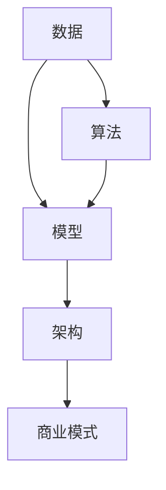

                 

### 背景介绍

随着人工智能（AI）技术的快速发展，其应用领域也在不断拓展，从简单的图像识别到复杂的自然语言处理，AI已经在众多行业中发挥了重要作用。然而，随着AI技术的广泛应用，如何构建一个可扩展的AI商业模式成为了企业和研究人员面临的重要课题。

一个可扩展的AI商业模式，不仅能够满足当前的需求，还能够随着技术的进步和市场的变化，持续地发展和优化。这不仅仅是一个技术问题，更是一个商业战略问题。因此，本文将深入探讨如何构建可扩展的AI商业模式，包括核心概念、算法原理、数学模型、项目实战以及实际应用场景等。

本文旨在为读者提供一个系统化的指南，帮助他们在构建AI商业模式时，能够从理论到实践都有所收获。无论您是AI领域的专业人士，还是对此感兴趣的普通读者，本文都希望能为您提供有价值的见解和实用的建议。

本文将按照以下结构展开：

1. **核心概念与联系**：介绍构建可扩展AI商业模式所需了解的核心概念，并使用Mermaid流程图展示它们之间的关系。
2. **核心算法原理 & 具体操作步骤**：详细讲解构建AI商业模式所需的核心算法原理，并给出具体的操作步骤。
3. **数学模型和公式 & 详细讲解 & 举例说明**：介绍构建AI商业模式所需的数学模型和公式，并通过实例进行详细讲解。
4. **项目实战：代码实际案例和详细解释说明**：通过一个实际项目案例，展示如何将理论知识应用到实践中。
5. **实际应用场景**：探讨AI商业模式在不同行业中的应用场景。
6. **工具和资源推荐**：推荐一些学习和开发AI商业模式所需的工具和资源。
7. **总结：未来发展趋势与挑战**：总结本文的主要观点，并展望未来发展趋势和面临的挑战。
8. **附录：常见问题与解答**：回答读者可能关心的一些常见问题。
9. **扩展阅读 & 参考资料**：提供一些扩展阅读和参考资料，以便读者进一步深入学习。

现在，我们开始详细探讨第一个主题：核心概念与联系。

---

## 核心概念与联系

构建可扩展的AI商业模式，首先需要理解几个核心概念，它们是：数据、算法、模型和架构。以下是这些概念的定义以及它们之间的关系。

### 数据

数据是AI商业模式的基础。高质量的数据能够提升模型的准确性和泛化能力，从而增强商业价值。数据可以分为结构化数据和非结构化数据。结构化数据如数据库中的表格，非结构化数据如文本、图像和语音等。

### 算法

算法是处理数据和生成模型的核心。常见的算法包括机器学习算法、深度学习算法等。算法的选择直接影响模型的性能和效率。

### 模型

模型是对现实世界问题的抽象和表达。通过训练算法，可以从数据中学习并生成模型。模型可以是简单的线性回归模型，也可以是复杂的神经网络模型。

### 架构

架构是支持模型运行的环境和系统结构。一个好的架构能够确保模型的高效、可扩展和可靠运行。

### Mermaid流程图

下面是一个简单的Mermaid流程图，展示了这些核心概念之间的关系。

### 关系

- **数据驱动**：数据是整个流程的起点，所有模型和算法都需要数据作为输入。
- **算法和模型**：算法用于处理数据，生成模型。模型是对数据的抽象和表达。
- **模型和架构**：模型需要运行在特定的架构上，以确保其高效、可扩展地运行。
- **架构和商业模式**：架构是实现商业目标的基础，它决定了商业模式能否成功。

通过理解这些核心概念及其之间的关系，我们可以更好地构建一个可扩展的AI商业模式。

---

在接下来的章节中，我们将深入探讨这些核心概念，包括核心算法原理、数学模型和公式，以及如何将理论知识应用到实际项目中。请继续阅读，以获取更多有价值的见解和实用的建议。

