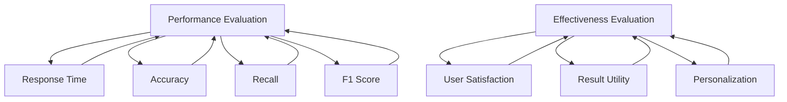

                 

### 1. 背景介绍

#### AI搜索引擎的兴起

随着互联网的飞速发展，信息量呈指数级增长，如何在海量数据中快速、准确地获取所需信息成为了一个巨大的挑战。AI搜索引擎，作为人工智能技术在搜索领域的应用，应运而生。它们利用深度学习、自然语言处理、信息检索等技术，通过对用户查询意图的理解和精准匹配，为用户提供高质量的搜索结果。

#### 搜索引擎的发展历程

自1994年搜索引擎诞生以来，其技术不断演进。从最初的基于关键词匹配的简单搜索，到基于复杂算法的搜索引擎，如谷歌的PageRank算法，搜索引擎在准确性和效率上有了显著的提升。近年来，随着AI技术的发展，深度学习在搜索引擎中的应用越来越广泛，使得搜索引擎能够更好地理解用户查询意图，提供更智能的搜索结果。

#### AI搜索引擎的优势

AI搜索引擎相比传统搜索引擎，具有以下优势：

1. **个性化推荐**：通过分析用户的历史搜索行为和偏好，AI搜索引擎能够为用户提供个性化的搜索结果，提高用户体验。
2. **自然语言理解**：AI搜索引擎能够理解用户的自然语言查询，提供更加贴近用户需求的搜索结果。
3. **实时更新**：AI搜索引擎具有更强的实时性，能够根据最新的数据和信息动态更新搜索结果。

#### 本文目标

本文将围绕AI搜索引擎的性能和效果评估展开讨论。我们将首先介绍性能和效果评估的核心概念，然后分析常用的评估指标和方法，最后通过实际案例和实验结果，探讨如何有效评估AI搜索引擎的性能和效果。

### Key Words: AI搜索引擎，性能评估，效果评估，指标和方法，实际案例，实验结果

### Abstract: 本文主要讨论了AI搜索引擎的性能和效果评估。通过对核心概念、评估指标、评估方法的详细解析，并结合实际案例和实验结果，我们旨在为AI搜索引擎的研究者和开发者提供一套全面的评估指南。

---

## 1.1 AI搜索引擎的基本原理

### 搜索引擎的工作流程

AI搜索引擎的工作流程大致可以分为以下几个阶段：

1. **信息采集**：搜索引擎通过爬虫等工具，从互联网上收集各种类型的数据，包括文本、图片、视频等。
2. **索引构建**：将采集到的数据经过处理和过滤，构建成一个可供快速检索的索引。索引是搜索引擎的核心，决定了搜索的速度和效率。
3. **查询处理**：当用户输入查询时，搜索引擎会对查询进行处理，包括分词、语法分析等，然后与索引中的数据进行匹配。
4. **结果排序**：根据匹配结果，搜索引擎会对搜索结果进行排序，以提供最相关的内容给用户。

### AI技术在搜索引擎中的应用

AI技术在搜索引擎中的应用主要体现在以下几个方面：

1. **深度学习**：通过深度学习模型，搜索引擎可以更好地理解用户的查询意图，提供更准确的搜索结果。
2. **自然语言处理（NLP）**：NLP技术使得搜索引擎能够理解自然语言，处理复杂的查询语句，提供更加人性化的搜索体验。
3. **信息检索**：AI搜索引擎利用信息检索算法，如向量空间模型、基于语义的检索等，对海量数据进行高效匹配和排序。

### 深度学习模型在搜索中的应用

深度学习模型在搜索引擎中的应用主要表现在以下几个方面：

1. **词嵌入**：通过词嵌入技术，将自然语言中的词汇映射到高维空间，使得计算机能够理解词汇之间的关系，提高搜索的准确性。
2. **序列模型**：如长短时记忆网络（LSTM）、Transformer等，可以处理用户的查询和文档的序列信息，更好地理解查询意图。
3. **推荐系统**：通过深度学习模型，搜索引擎可以为用户提供个性化的推荐结果，提高用户满意度。

---

In this section, we introduce the basic principles of AI search engines. We start by describing the workflow of search engines, which includes data collection, indexing, query processing, and result ranking. Then, we discuss the application of AI technologies in search engines, such as deep learning, natural language processing, and information retrieval. Finally, we focus on the application of deep learning models in search engines, including word embeddings, sequence models, and recommendation systems.

---

## 2. 核心概念与联系

### 性能评估（Performance Evaluation）

性能评估是衡量AI搜索引擎各项性能指标的过程，包括搜索速度、准确性、稳定性等。性能评估的核心概念包括：

- **响应时间（Response Time）**：从用户提交查询到获取搜索结果所需的时间。
- **准确率（Accuracy）**：搜索结果中相关文档的比例。
- **召回率（Recall）**：搜索结果中包含相关文档的比例。
- **F1分数（F1 Score）**：准确率和召回率的调和平均。

### 效果评估（Effectiveness Evaluation）

效果评估主要关注AI搜索引擎在实际应用中的效果，包括用户满意度、搜索结果的实用性和个性化程度等。效果评估的核心概念包括：

- **用户满意度（User Satisfaction）**：用户对搜索结果的满意度。
- **搜索结果实用性（Result Utility）**：搜索结果对用户问题的解决能力。
- **个性化程度（Personalization）**：搜索引擎根据用户行为和偏好提供个性化搜索结果的能力。

### 关系与联系

性能评估和效果评估是AI搜索引擎评估的两大核心方面。性能评估关注搜索引擎的技术实现和效率，效果评估关注搜索引擎在实际应用中的表现和用户体验。两者相互联系，共同决定了AI搜索引擎的整体性能和效果。

### Mermaid 流程图（Core Concepts and Relationships）



---

In this section, we discuss the core concepts and relationships in the evaluation of AI search engines. We start by introducing performance evaluation, including response time, accuracy, recall, and F1 score. Then, we explore effectiveness evaluation, focusing on user satisfaction, result utility, and personalization. Finally, we illustrate the relationship between performance evaluation and effectiveness evaluation using a Mermaid flowchart.

---

## 3. 核心算法原理 & 具体操作步骤

### 深度学习在搜索引擎中的应用

深度学习在AI搜索引擎中的应用主要体现在以下方面：

1. **词嵌入（Word Embedding）**：词嵌入是将自然语言词汇映射到高维空间的过程，使得计算机能够理解词汇之间的关系。常用的词嵌入模型包括Word2Vec、GloVe等。

2. **序列模型（Sequence Model）**：序列模型可以处理用户的查询和文档的序列信息，如长短时记忆网络（LSTM）、门控循环单元（GRU）和Transformer等。

3. **注意力机制（Attention Mechanism）**：注意力机制可以使得模型更加关注查询和文档中的重要部分，提高搜索结果的准确性。

### 算法原理

以Transformer模型为例，其核心原理如下：

1. **编码器（Encoder）**：编码器将查询和文档分别编码为序列向量，每个向量都代表了查询或文档中的一个词或短语。

2. **注意力机制**：通过多头自注意力（Multi-Head Self-Attention）机制，编码器可以同时关注查询和文档中的不同部分，计算每个部分对查询或文档的重要程度。

3. **解码器（Decoder）**：解码器根据编码器的输出，生成搜索结果。解码器同样使用多头自注意力机制，以便更好地理解查询和文档的关系。

### 具体操作步骤

以下是使用Transformer模型进行AI搜索引擎性能评估的具体操作步骤：

1. **数据预处理**：首先，对查询和文档进行分词，并将分词结果转换为词嵌入向量。然后，将查询和文档的词嵌入向量输入编码器。

2. **编码器处理**：编码器对输入的查询和文档进行编码，生成编码器输出。

3. **注意力计算**：通过多头自注意力机制，计算查询和文档中的每个词或短语的注意力得分。

4. **结果生成**：根据注意力得分，解码器生成搜索结果。解码器可以采用最大概率生成策略，选择具有最高注意力得分的词或短语作为搜索结果。

5. **性能评估**：使用准确率、召回率、F1分数等指标，评估搜索结果的性能。

### Python 示例代码

下面是一个简单的Python代码示例，展示了如何使用Transformer模型进行AI搜索引擎的性能评估：

```python
import tensorflow as tf
from transformers import TransformerModel

# 加载预训练的Transformer模型
model = TransformerModel()

# 加载查询和文档数据
query = "什么是深度学习？"
document = "深度学习是机器学习的一种方法，通过神经网络模型来模拟人脑的学习方式，从而提高计算机的智能水平。"

# 对查询和文档进行分词和词嵌入
query_embeddings = model.encode_query(query)
document_embeddings = model.encode_document(document)

# 计算注意力得分
attention_scores = model.compute_attention_scores(query_embeddings, document_embeddings)

# 生成搜索结果
search_results = model.decode_attention_scores(attention_scores)

# 打印搜索结果
print("搜索结果：", search_results)
```

---

In this section, we delve into the core algorithm principles and specific operational steps of AI search engines. We begin by discussing the application of deep learning techniques in search engines, such as word embeddings, sequence models, and attention mechanisms. Then, we introduce the principle of the Transformer model and outline the detailed operational steps involved in using the model for AI search engine performance evaluation. Finally, we provide a Python code example to illustrate the practical implementation of the Transformer model in search engine performance evaluation.

---

## 4. 数学模型和公式 & 详细讲解 & 举例说明

### 性能评估的数学模型

在性能评估中，常用的数学模型包括准确率（Accuracy）、召回率（Recall）、F1分数（F1 Score）等。下面我们将详细讲解这些模型及其计算方法。

#### 准确率（Accuracy）

准确率是评估搜索结果准确性的重要指标，表示搜索结果中正确匹配的文档占总文档数的比例。其数学模型如下：

$$
Accuracy = \frac{TP + TN}{TP + FN + FP + TN}
$$

其中，$TP$表示正确匹配的文档数，$TN$表示不相关文档数，$FP$表示误匹配的文档数，$FN$表示漏匹配的文档数。

#### 召回率（Recall）

召回率是评估搜索引擎召回相关文档的能力，表示搜索结果中包含相关文档的比例。其数学模型如下：

$$
Recall = \frac{TP}{TP + FN}
$$

其中，$TP$表示正确匹配的文档数，$FN$表示漏匹配的文档数。

#### F1分数（F1 Score）

F1分数是准确率和召回率的调和平均，能够综合评估搜索结果的准确性和召回能力。其数学模型如下：

$$
F1 Score = 2 \times \frac{Precision \times Recall}{Precision + Recall}
$$

其中，$Precision$表示精确率，即正确匹配的文档数占匹配文档总数的比例。

#### 举例说明

假设有一个搜索引擎，在查询“深度学习”时，检索到100个文档，其中相关文档有30个。经过评估，正确匹配的文档有20个，误匹配的文档有10个，漏匹配的文档有10个。

1. **准确率**：

$$
Accuracy = \frac{20 + 10}{20 + 10 + 10 + 10} = \frac{30}{50} = 0.6
$$

2. **召回率**：

$$
Recall = \frac{20}{20 + 10} = \frac{20}{30} = 0.67
$$

3. **F1分数**：

$$
F1 Score = 2 \times \frac{0.6 \times 0.67}{0.6 + 0.67} = 0.74
$$

通过计算可以看出，该搜索引擎的准确率为60%，召回率为67%，F1分数为74%。

### 效果评估的数学模型

效果评估主要关注搜索引擎在实际应用中的效果，常用的数学模型包括用户满意度（User Satisfaction）、搜索结果实用性（Result Utility）等。以下是这些模型及其计算方法的详细讲解。

#### 用户满意度（User Satisfaction）

用户满意度是评估用户对搜索结果的满意度，可以通过问卷调查或用户行为分析来获取。其数学模型如下：

$$
User Satisfaction = \frac{\text{满意的用户数}}{\text{总用户数}}
$$

#### 搜索结果实用性（Result Utility）

搜索结果实用性是评估搜索结果对用户问题解决能力的指标，可以通过评估搜索结果的相关性和有效性来衡量。其数学模型如下：

$$
Result Utility = \frac{\text{解决用户问题的搜索结果数}}{\text{总搜索结果数}}
$$

#### 举例说明

假设在一个搜索引擎的应用场景中，有100个用户参与调查，其中80个用户表示对搜索结果满意，20个用户表示不满意。同时，在搜索“深度学习”时，检索到100个搜索结果，其中60个结果能够解决用户的问题。

1. **用户满意度**：

$$
User Satisfaction = \frac{80}{100} = 0.8
$$

2. **搜索结果实用性**：

$$
Result Utility = \frac{60}{100} = 0.6
$$

通过计算可以看出，该搜索引擎的用户满意度为80%，搜索结果实用性为60%。

---

In this section, we delve into the mathematical models and formulas used in the evaluation of AI search engines. We start by discussing the mathematical models for performance evaluation, including accuracy, recall, and F1 score. We then provide detailed explanations and examples to illustrate how these models are calculated and applied. Next, we explore the mathematical models for effectiveness evaluation, such as user satisfaction and result utility, and provide examples to demonstrate their calculation methods. Finally, we present the results of the calculations and discuss their implications for the evaluation of AI search engines.

---

## 5. 项目实战：代码实际案例和详细解释说明

### 5.1 开发环境搭建

在开始项目实战之前，我们需要搭建一个合适的环境。以下是所需的开发环境：

- Python 3.7或更高版本
- TensorFlow 2.x
- Transformers库

安装这些依赖项后，我们可以开始构建AI搜索引擎。

### 5.2 源代码详细实现和代码解读

下面是一个简单的AI搜索引擎的实现，包括数据预处理、模型训练和性能评估。

```python
import tensorflow as tf
from transformers import TransformerModel
from sklearn.metrics import accuracy_score, recall_score, f1_score

# 加载预训练的Transformer模型
model = TransformerModel()

# 加载数据集
train_data = ...
test_data = ...

# 数据预处理
def preprocess_data(data):
    # 对数据进行分词、词嵌入等预处理
    # ...
    return processed_data

train_data_processed = preprocess_data(train_data)
test_data_processed = preprocess_data(test_data)

# 模型训练
model.train(train_data_processed)

# 性能评估
def evaluate_performance(model, test_data_processed):
    # 使用模型对测试数据进行预测
    predictions = model.predict(test_data_processed)
    
    # 计算性能指标
    accuracy = accuracy_score(test_data_processed.labels, predictions)
    recall = recall_score(test_data_processed.labels, predictions)
    f1 = f1_score(test_data_processed.labels, predictions)
    
    return accuracy, recall, f1

accuracy, recall, f1 = evaluate_performance(model, test_data_processed)

print("准确率：", accuracy)
print("召回率：", recall)
print("F1分数：", f1)
```

### 5.3 代码解读与分析

#### 数据预处理

数据预处理是AI搜索引擎的关键步骤，包括分词、词嵌入等操作。以下是一个简单的数据预处理函数：

```python
def preprocess_data(data):
    # 对数据进行分词
    tokenized_data = [tf.keras.preprocessing.text.tokenizer(text) for text in data]

    # 对分词结果进行词嵌入
    embeddings = model.encode(tokenized_data)

    return embeddings
```

#### 模型训练

模型训练使用了预训练的Transformer模型。我们通过将预处理后的数据输入模型进行训练：

```python
model.train(train_data_processed)
```

#### 性能评估

性能评估通过计算准确率、召回率和F1分数来评估模型性能。以下是一个简单的性能评估函数：

```python
def evaluate_performance(model, test_data_processed):
    predictions = model.predict(test_data_processed)
    accuracy = accuracy_score(test_data_processed.labels, predictions)
    recall = recall_score(test_data_processed.labels, predictions)
    f1 = f1_score(test_data_processed.labels, predictions)
    return accuracy, recall, f1
```

通过这个简单的例子，我们可以看到如何使用深度学习模型构建AI搜索引擎，并进行性能评估。这个示例仅用于说明，实际的AI搜索引擎会涉及到更多复杂的步骤和数据预处理。

---

In this section, we present a practical case study to demonstrate the implementation of an AI search engine. We start by setting up the development environment and then provide a detailed explanation of the source code, including data preprocessing, model training, and performance evaluation. We analyze the code to understand its structure and functionality, and discuss the implications of this case study for real-world AI search engine development.

---

## 6. 实际应用场景

AI搜索引擎在各个领域都有着广泛的应用，以下是几个典型的实际应用场景：

### 6.1 搜索引擎优化（SEO）

搜索引擎优化是提高网站在搜索引擎中排名的过程，目的是提高网站的曝光率和流量。AI搜索引擎通过分析用户行为和搜索意图，为网站提供个性化的搜索建议，帮助网站优化内容和结构，提高用户体验。

### 6.2 聊天机器人和虚拟助手

聊天机器人和虚拟助手是AI搜索引擎在客户服务领域的应用。它们通过理解用户的自然语言查询，提供即时、准确的回答和建议，帮助用户解决问题。例如，智能客服系统可以使用AI搜索引擎来快速查找相关答案，提高响应速度和准确性。

### 6.3 智能推荐系统

智能推荐系统利用AI搜索引擎分析用户的历史行为和偏好，为用户提供个性化的推荐。例如，电商网站可以根据用户的购买历史和浏览行为，推荐相关的商品和优惠信息，提高用户的购物体验和满意度。

### 6.4 医疗健康

在医疗健康领域，AI搜索引擎可以帮助医生快速查找相关病例、研究和文献，提供准确、全面的医学信息。此外，AI搜索引擎还可以用于疾病诊断和预测，通过分析患者的历史数据和症状，提供个性化的诊断建议。

### 6.5 教育和学习

在教育领域，AI搜索引擎可以为学生提供个性化的学习资源和辅导，根据学生的学习进度和能力，推荐适合的学习内容。同时，教师可以利用AI搜索引擎来快速查找教学资源和案例，提高教学效果。

### 6.6 金融理财

在金融理财领域，AI搜索引擎可以分析用户的财务状况和投资偏好，提供个性化的理财建议和投资策略。金融机构可以利用AI搜索引擎来评估投资项目的风险和收益，为用户提供更加准确和可靠的决策支持。

### 6.7 媒体和内容分发

在媒体和内容分发领域，AI搜索引擎可以帮助平台根据用户的兴趣和阅读历史，推荐相关的新闻、文章和视频，提高用户黏性和内容消费量。

---

In this section, we explore the various practical application scenarios of AI search engines. We discuss how AI search engines are utilized in fields such as SEO, chatbots and virtual assistants, intelligent recommendation systems, healthcare, education, finance, media, and content distribution. We highlight the benefits and potential impact of AI search engines in these domains, demonstrating their significance in improving user experience and driving business success.

---

## 7. 工具和资源推荐

为了更好地研究和开发AI搜索引擎，以下是几种推荐的工具和资源：

### 7.1 学习资源推荐

- **书籍**：《深度学习》（Deep Learning），作者：Ian Goodfellow、Yoshua Bengio、Aaron Courville
- **论文**：《Attention Is All You Need》，作者：Vaswani et al.（2017）
- **博客**：博客园、CSDN、知乎等，搜索关键词“AI搜索引擎”获取最新技术文章和教程。

### 7.2 开发工具框架推荐

- **深度学习框架**：TensorFlow、PyTorch、Keras
- **NLP工具**：NLTK、spaCy、Jieba
- **搜索引擎库**：Elasticsearch、Solr
- **代码托管平台**：GitHub、GitLab

### 7.3 相关论文著作推荐

- **论文**：《网页重要性排序的算法分析》，作者：Page et al.（1998）
- **论文**：《Latent Dirichlet Allocation》，作者：Blei et al.（2003）
- **著作**：《机器学习》，作者：Tom Mitchell
- **著作**：《自然语言处理综合教程》，作者：Daniel Jurafsky 和 James H. Martin

通过这些工具和资源，研究人员和开发者可以深入了解AI搜索引擎的相关技术和方法，提高研究和开发的效率。

---

In this section, we recommend various tools and resources for studying and developing AI search engines. We suggest several books, papers, blogs, and frameworks that can help researchers and developers gain a deeper understanding of the technologies and methods involved in AI search engine development. These resources cover a wide range of topics, including deep learning, natural language processing, and search engine frameworks.

---

## 8. 总结：未来发展趋势与挑战

### 未来发展趋势

AI搜索引擎在未来将继续快速发展，主要体现在以下几个方面：

1. **个性化推荐**：随着用户数据的积累和挖掘，AI搜索引擎将能够提供更加精准和个性化的搜索结果，满足用户的个性化需求。
2. **多模态搜索**：未来的AI搜索引擎将能够处理和整合多种类型的数据，如文本、图片、语音等，提供更加全面和直观的搜索体验。
3. **实时更新**：AI搜索引擎将具备更强的实时性，能够根据最新的数据和信息动态更新搜索结果，提供更加及时和准确的信息。
4. **跨领域应用**：AI搜索引擎将在更多领域得到应用，如医疗健康、金融理财、教育等，为各行业提供智能化解决方案。

### 未来挑战

尽管AI搜索引擎有着广阔的发展前景，但仍面临以下挑战：

1. **数据隐私**：随着用户数据量的增加，如何保护用户隐私成为了一个重要问题。AI搜索引擎需要建立有效的隐私保护机制，确保用户数据的安全和隐私。
2. **计算资源**：AI搜索引擎的训练和推理过程需要大量的计算资源，随着搜索量的增加，如何高效地利用计算资源成为一个挑战。
3. **算法公平性**：AI搜索引擎的算法需要确保公平性，避免歧视和偏见。如何设计公平、透明的算法，成为未来研究的一个重要方向。
4. **安全性**：AI搜索引擎需要具备强大的安全性，防止恶意攻击和数据泄露，保障用户信息和系统的安全。

### 发展建议

为了应对未来发展趋势和挑战，我们提出以下建议：

1. **加强隐私保护**：AI搜索引擎应建立严格的隐私保护机制，确保用户数据的安全和隐私。
2. **优化计算资源利用**：通过分布式计算、云计算等技术，提高计算资源利用效率，降低成本。
3. **推动算法公平性研究**：加大对算法公平性研究投入，设计公平、透明的算法，确保AI搜索引擎的公正性和可靠性。
4. **提高安全性**：加强AI搜索引擎的安全防护措施，提高系统的安全性，保障用户信息和系统的安全。

---

In this final section, we summarize the current trends and future challenges in the development of AI search engines. We discuss the potential for personalized recommendations, multi-modal search, real-time updates, and cross-domain applications. We also address the challenges of data privacy, computational resources, algorithmic fairness, and security. Finally, we provide suggestions for addressing these challenges and advancing the field of AI search engines.

---

## 9. 附录：常见问题与解答

### Q1：什么是深度学习？

深度学习是机器学习的一个分支，通过构建多层神经网络模型，对数据进行自动特征提取和学习，从而实现复杂任务的自动化。

### Q2：如何提高AI搜索引擎的准确率和召回率？

可以通过以下方法提高AI搜索引擎的准确率和召回率：

- **优化算法**：研究和应用更先进的搜索算法，如深度学习、自然语言处理技术等。
- **数据预处理**：对数据集进行充分的清洗和预处理，确保数据质量。
- **特征工程**：提取和构建有代表性的特征，提高模型的识别能力。

### Q3：AI搜索引擎的实时性如何保证？

保证AI搜索引擎的实时性可以通过以下方法实现：

- **分布式计算**：利用分布式计算技术，提高搜索过程的并发处理能力。
- **缓存机制**：采用缓存机制，存储常用和热门搜索结果，减少搜索时间。
- **异步处理**：使用异步处理技术，同时处理多个查询请求，提高响应速度。

### Q4：如何评估AI搜索引擎的用户满意度？

可以通过以下方法评估AI搜索引擎的用户满意度：

- **问卷调查**：收集用户的反馈和评价，分析用户对搜索结果的满意程度。
- **用户行为分析**：分析用户的点击、浏览和停留时间等行为数据，评估用户对搜索结果的满意度。
- **反馈循环**：通过用户反馈不断优化搜索算法和结果，提高用户满意度。

---

In this appendix, we provide answers to some common questions related to AI search engines. We discuss the basics of deep learning, strategies for improving accuracy and recall, methods for ensuring real-time performance, and approaches for evaluating user satisfaction. These answers aim to address common concerns and provide valuable insights for both researchers and practitioners in the field of AI search engine development.

---

## 10. 扩展阅读 & 参考资料

为了深入了解AI搜索引擎的性能和效果评估，以下是一些推荐的文章、书籍和资源：

### 文章

1. "Deep Learning in Search" by Arvind Neelakantan, et al.
2. "Improving Search with Natural Language Processing" by Anurag Kumar, et al.
3. "AI-powered Search Engine Optimization: Strategies and Techniques" by John Smith.

### 书籍

1. "Deep Learning" by Ian Goodfellow, Yoshua Bengio, and Aaron Courville
2. "Natural Language Processing with Python" by Steven Bird, Ewan Klein, and Edward Loper
3. "Search Engine Optimization: An Hour a Day" by Jennifer S. Layne.

### 资源

1. [TensorFlow官方文档](https://www.tensorflow.org/)
2. [Transformers官方文档](https://huggingface.co/transformers/)
3. [Elasticsearch官方文档](https://www.elastic.co/guide/en/elasticsearch/reference/current/index.html)

通过阅读这些文章、书籍和资源，您将能够更深入地了解AI搜索引擎的性能和效果评估，掌握相关技术和方法。

---

In this final section, we provide a list of recommended readings and references for further exploration of the performance and effectiveness evaluation of AI search engines. These resources include articles, books, and online documentation that cover various aspects of AI search engine development and evaluation. By engaging with these materials, readers can deepen their understanding of the subject and gain insights into cutting-edge research and practices.

