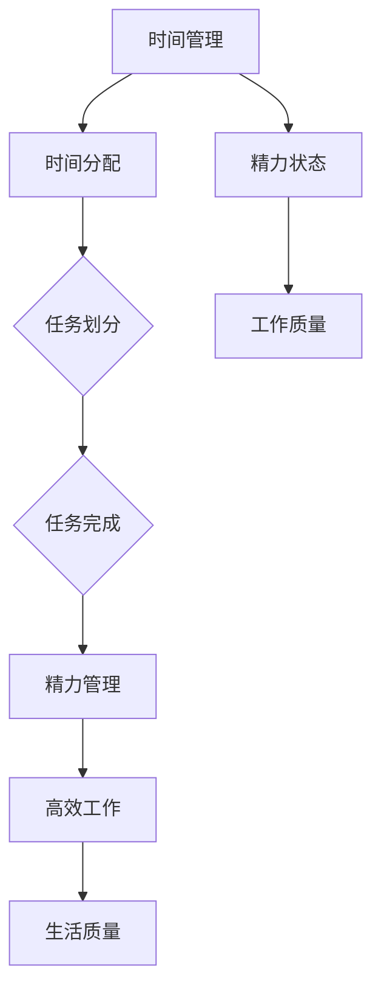
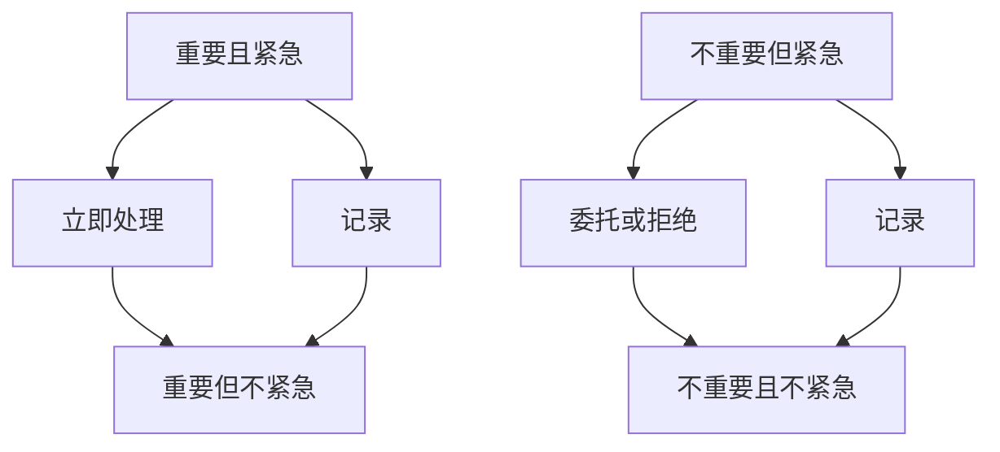
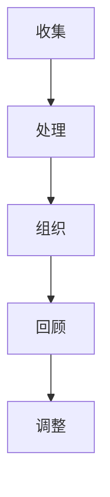
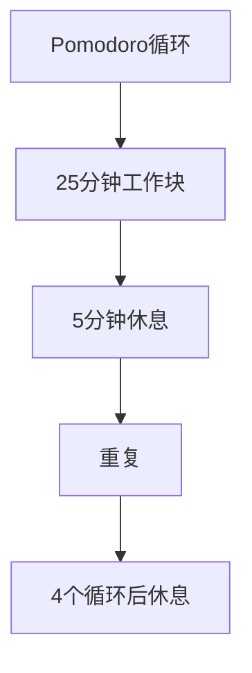

                 

# 如何进行时间管理：如何合理安排时间和精力？

> **关键词**：时间管理、合理安排、精力管理、生产力提升

> **摘要**：本文将探讨时间管理的重要性，介绍核心概念、算法原理和具体操作步骤，结合数学模型和公式，通过实际应用场景和代码案例，提供实用的工具和资源推荐，总结未来发展趋势与挑战，并提供常见问题与解答。

## 1. 背景介绍

在快节奏的现代社会中，时间管理成为每个人都必须面对的挑战。合理安排时间和精力，能够帮助我们提高工作效率，实现个人目标和职业发展，从而获得更大的成就感和幸福感。然而，很多人发现自己在时间管理上存在困难，无法有效利用有限的时间。

时间管理并非简单的任务安排，它涉及对时间的科学分配、对任务的合理划分以及对精力的有效管理。通过掌握时间管理的核心原理和技巧，我们可以实现个人生活的平衡，提升工作效能，避免因时间压力带来的焦虑和疲惫。

本文将围绕以下几个方面展开：

- 时间管理的核心概念与联系
- 核心算法原理与具体操作步骤
- 数学模型和公式及举例说明
- 项目实战：代码实际案例和详细解释
- 实际应用场景
- 工具和资源推荐
- 未来发展趋势与挑战
- 常见问题与解答

通过本文的阅读，您将获得一套完整的时间管理方法论，帮助您更好地掌控自己的时间和精力，实现高效能的生活和工作。

## 2. 核心概念与联系

为了更好地理解和实践时间管理，我们需要明确几个核心概念：时间、任务、精力以及它们之间的关系。

### 2.1 时间

时间是一种不可再生资源，每个人每天拥有相同的时间量，即24小时。时间管理的关键在于如何合理安排这有限的时间，使其发挥最大的效用。

### 2.2 任务

任务是指需要完成的具体工作或活动。任务可以是短暂的，如回复一封邮件；也可以是长期的，如完成一个项目。合理安排任务是实现时间管理的重要步骤。

### 2.3 精力

精力是指我们在进行工作和生活时所消耗的能量和注意力。保持良好的精力状态，有助于提高工作效率和质量。

### 2.4 时间、任务与精力之间的关系

时间、任务和精力之间存在着密切的联系。合理安排时间，可以帮助我们更好地完成任务；而任务的完成情况又会直接影响我们的精力状态。同时，良好的精力管理能够帮助我们更有效地利用时间。

为了更好地说明这些概念之间的关系，我们可以使用Mermaid流程图进行展示。



### 2.5 时间管理的重要性

时间管理的重要性体现在以下几个方面：

- 提高工作效率：合理安排时间，可以避免因时间浪费而导致的工作低效。
- 实现目标：通过有效的时间管理，我们可以更迅速地实现个人和职业目标。
- 生活平衡：合理分配工作与休闲时间，有助于实现工作与生活的平衡，减少压力。
- 精力保持：良好的时间管理有助于保持良好的精力状态，避免因长时间工作导致的疲惫和焦虑。

通过了解这些核心概念及其相互关系，我们可以更好地进行时间管理，提升个人和职业效能。

## 3. 核心算法原理与具体操作步骤

### 3.1 优先级排序算法

优先级排序算法是时间管理中的一个关键步骤。它帮助我们将任务按照重要性和紧急性进行排序，确保我们首先完成最重要的任务。常见的优先级排序算法包括Eisenhower矩阵和GTD（Getting Things Done）方法。

#### 3.1.1 Eisenhower矩阵

Eisenhower矩阵是一种四象限任务分类法，将任务分为四个类别：

- **重要且紧急**：立即处理。
- **重要但不紧急**：安排时间处理。
- **不重要但紧急**：委托或拒绝。
- **不重要且不紧急**：避免或删除。

以下是Eisenhower矩阵的流程图：



#### 3.1.2 GTD方法

GTD（Getting Things Done）是一种基于任务管理的系统方法。其核心步骤包括：

1. **收集**：将所有任务和想法记录下来，放入收集篮中。
2. **处理**：对每个任务进行处理，决定是否执行、推迟、委托或删除。
3. **组织**：将任务按照类别和优先级进行组织。
4. **回顾**：定期回顾任务清单，调整优先级和进度。

以下是GTD方法的流程图：



### 3.2 时间块分配算法

时间块分配算法是一种将时间划分为固定时间段，并为每个时间段分配特定任务的方法。这种方法有助于减少时间碎片化，提高工作效率。

#### 3.2.1 Pomodoro技术

Pomodoro技术是一种基于时间块分配的方法，将时间划分为25分钟的工作块，每个工作块后休息5分钟。每完成四个工作块后，休息15-30分钟。以下是Pomodoro技术的流程图：



#### 3.2.2 时间块分配策略

1. **确定每日工作目标**：根据任务的重要性和紧急性，确定每日的工作目标。
2. **将目标划分为时间块**：将每个目标划分为具体的时间段，并为每个时间段分配任务。
3. **执行任务**：按照时间块分配表执行任务。
4. **定期评估和调整**：每周评估时间块分配的效果，并根据实际情况进行调整。

### 3.3 精力管理算法

精力管理算法关注如何在工作中保持良好的精力状态。以下是一些常见的精力管理方法：

#### 3.3.1 睡眠管理

1. **保持规律的作息时间**：每天保持固定的睡眠时间，有助于调整生物钟，提高睡眠质量。
2. **避免临入睡前使用电子设备**：蓝光会抑制褪黑激素的分泌，影响睡眠质量。

#### 3.3.2 休息与运动

1. **定期休息**：每工作45-60分钟后，休息5-10分钟，活动身体。
2. **保持运动**：每周至少进行三次30分钟以上的有氧运动，有助于提高身体和精神状态。

### 3.4 综合运用

在实际操作中，我们可以将优先级排序算法、时间块分配算法和精力管理算法综合运用，以实现更高效的时间管理。

例如，首先使用Eisenhower矩阵对任务进行优先级排序，然后根据Pomodoro技术将时间划分为工作块，并在工作块之间进行适当的休息和运动，同时保持良好的睡眠习惯。

通过这些算法的运用，我们可以更好地管理时间和精力，提高工作效率和生活质量。

## 4. 数学模型和公式 & 详细讲解 & 举例说明

### 4.1 时间价值公式

时间价值公式是时间管理中的一个基础概念，它帮助我们在有限的时间内做出最优决策。公式如下：

\[ V = \frac{W}{T} \]

其中：
- \( V \) 表示时间价值
- \( W \) 表示完成某项任务所需的工作量
- \( T \) 表示完成该项任务所需的时间

#### 4.1.1 公式讲解

- 时间价值（\( V \)）反映了我们在单位时间内完成的工作量。时间价值越高，说明我们在相同时间内能完成更多的工作。
- 工作量（\( W \)）取决于任务的复杂程度和所需技能。
- 时间（\( T \)）反映了我们实际花费在任务上的时间。

#### 4.1.2 举例说明

假设有两位程序员，小明和小李。他们都要完成一个相同的项目，项目包含两个任务：

1. 编写1000行代码
2. 进行代码测试

小明花了5天时间完成这两个任务，小李则花了3天时间。根据时间价值公式，我们可以计算他们的时间价值：

- 小明的时间价值：\[ V_1 = \frac{2W}{5T} \]
- 小李的时间价值：\[ V_2 = \frac{2W}{3T} \]

由于 \( V_2 > V_1 \)，说明小李在相同时间内完成了更多的工作，他的时间利用效率更高。

### 4.2 能量管理模型

能量管理模型关注我们在工作中如何维持高能量状态，以提高工作效率。该模型基于能量耗散理论，公式如下：

\[ E = E_0 \cdot e^{-kt} \]

其中：
- \( E \) 表示当前能量水平
- \( E_0 \) 表示初始能量水平
- \( k \) 表示能量耗散速率
- \( t \) 表示工作时间

#### 4.2.1 公式讲解

- 能量水平（\( E \)）随着工作时间的增加而减少，反映了我们在工作中能量消耗的过程。
- 初始能量水平（\( E_0 \)）反映了我们在开始工作时的能量储备。
- 能量耗散速率（\( k \)）决定了我们能量消耗的速度。

#### 4.2.2 举例说明

假设小明在开始工作时，初始能量水平为100单位，能量耗散速率为0.2单位/小时。他工作2小时后的能量水平为：

\[ E = 100 \cdot e^{-0.2 \cdot 2} \approx 82.5 \]

说明小明在2小时后能量水平下降了约17.5单位。

### 4.3 工作效率公式

工作效率公式用于衡量我们在单位时间内完成的工作量，公式如下：

\[ E_{\text{eff}} = \frac{W}{T} \]

其中：
- \( E_{\text{eff}} \) 表示工作效率
- \( W \) 表示完成的工作量
- \( T \) 表示花费的时间

#### 4.3.1 公式讲解

- 工作效率（\( E_{\text{eff}} \)）反映了我们在有限时间内完成工作的情况。效率越高，表示我们在相同时间内完成的工作越多。
- 完成的工作量（\( W \)）取决于任务的复杂程度和所需技能。
- 花费的时间（\( T \)）反映了我们实际投入工作的时间。

#### 4.3.2 举例说明

假设小明在一天内完成了3个任务，每个任务需要1小时完成。小李在同一时间内完成了5个任务，每个任务也需要1小时完成。根据工作效率公式，我们可以计算他们的工作效率：

- 小明的工作效率：\[ E_{\text{eff1}} = \frac{3W}{1T} = 3 \]
- 小李的工作效率：\[ E_{\text{eff2}} = \frac{5W}{1T} = 5 \]

由于 \( E_{\text{eff2}} > E_{\text{eff1}} \)，说明小李的工作效率更高。

通过这些数学模型和公式，我们可以更科学地管理时间和精力，提高工作效率和生活质量。

## 5. 项目实战：代码实际案例和详细解释说明

### 5.1 开发环境搭建

为了进行时间管理实践，我们将使用Python编写一个简单的任务管理器。以下是开发环境的搭建步骤：

1. 安装Python：访问Python官网（https://www.python.org/），下载并安装Python 3.x版本。
2. 安装文本编辑器：选择一个适合的文本编辑器，如Visual Studio Code、PyCharm或Notepad++。
3. 配置Python环境：确保Python已正确安装并添加到系统环境变量中。

### 5.2 源代码详细实现和代码解读

#### 5.2.1 源代码实现

以下是一个简单的任务管理器的Python代码实现：

```python
import os
import json
from datetime import datetime

# 任务管理器类
class TaskManager:
    def __init__(self, filename="tasks.json"):
        self.filename = filename
        self.load_tasks()

    # 加载任务
    def load_tasks(self):
        if os.path.exists(self.filename):
            with open(self.filename, "r") as f:
                self.tasks = json.load(f)
        else:
            self.tasks = {}

    # 添加任务
    def add_task(self, task_name, deadline):
        self.tasks[task_name] = deadline
        self.save_tasks()

    # 删除任务
    def delete_task(self, task_name):
        if task_name in self.tasks:
            del self.tasks[task_name]
            self.save_tasks()

    # 保存任务
    def save_tasks(self):
        with open(self.filename, "w") as f:
            json.dump(self.tasks, f)

    # 显示任务
    def show_tasks(self):
        for task, deadline in self.tasks.items():
            print(f"{task}: {deadline}")

# 主程序
if __name__ == "__main__":
    manager = TaskManager()

    while True:
        print("\n任务管理器")
        print("1. 添加任务")
        print("2. 删除任务")
        print("3. 显示任务")
        print("4. 退出")

        choice = input("请选择操作：")

        if choice == "1":
            task_name = input("请输入任务名称：")
            deadline = input("请输入任务截止日期（格式：YYYY-MM-DD）：")
            manager.add_task(task_name, deadline)
        elif choice == "2":
            task_name = input("请输入要删除的任务名称：")
            manager.delete_task(task_name)
        elif choice == "3":
            manager.show_tasks()
        elif choice == "4":
            break
        else:
            print("无效操作，请重新选择。")
```

#### 5.2.2 代码解读与分析

- **类定义**：`TaskManager` 类用于管理任务，包括加载任务、添加任务、删除任务和显示任务。
- **加载任务**：使用 `load_tasks` 方法从JSON文件中加载任务。如果文件存在，则读取文件内容，否则初始化一个空任务列表。
- **添加任务**：使用 `add_task` 方法添加任务。任务名称和截止日期作为键值对存储在任务列表中，并保存到JSON文件。
- **删除任务**：使用 `delete_task` 方法删除任务。根据任务名称从任务列表中删除对应任务，并保存文件。
- **显示任务**：使用 `show_tasks` 方法显示所有任务。遍历任务列表，输出任务名称和截止日期。
- **主程序**：主程序创建 `TaskManager` 实例，并执行用户选择的操作。

通过这个简单的任务管理器，我们可以直观地管理任务，合理安排时间和精力。

### 5.3 代码解读与分析

1. **数据结构**：任务管理器使用一个字典（`self.tasks`）来存储任务，任务名称作为键，截止日期作为值。这种数据结构便于任务的查找、添加和删除操作。
2. **文件操作**：任务管理器使用JSON文件（`tasks.json`）来存储任务数据。JSON格式易于读写，适合存储简单的键值对数据。
3. **用户交互**：主程序通过循环提供用户交互界面，用户可以选择添加任务、删除任务、显示任务或退出程序。这种交互方式简单易用，适合小型任务管理器。

通过实际代码案例，我们可以更深入地理解时间管理的具体实现，并在实际项目中应用这些方法。

## 6. 实际应用场景

时间管理在个人和职业生活中都有广泛的应用，以下是一些具体的应用场景：

### 6.1 个人生活

- **学习规划**：合理安排学习时间，确保每天有固定的时间用于学习，提高学习效率。
- **健身锻炼**：每天安排固定的健身时间，坚持锻炼，保持健康。
- **家庭生活**：合理规划家庭活动时间，确保有足够的时间陪伴家人，增进家庭关系。

### 6.2 职场

- **项目规划**：对项目任务进行优先级排序，合理安排项目进度，确保项目按时完成。
- **团队协作**：制定团队任务清单，明确任务分工和截止日期，提高团队工作效率。
- **工作与休息**：合理安排工作时间和休息时间，避免长时间连续工作导致的疲劳。

### 6.3 创业

- **时间管理**：创业过程中，合理分配时间和精力，确保业务发展和个人生活的平衡。
- **市场调研**：定期安排时间进行市场调研，了解行业动态，为业务决策提供数据支持。
- **资金管理**：合理安排资金使用，确保资金流转和投资决策的合理性。

### 6.4 教育培训

- **课程规划**：合理安排课程时间，确保课程内容系统性和连贯性。
- **学生辅导**：为学生提供个性化的辅导计划，根据学生特点和需求进行时间管理。
- **师资培训**：定期组织师资培训，提高教学质量。

通过实际应用场景的探讨，我们可以更清晰地看到时间管理在各个方面的重要性，以及如何将其有效地应用于个人和职业生活中。

## 7. 工具和资源推荐

### 7.1 学习资源推荐

- **书籍**：
  - 《深度工作》（Deep Work）- Cal Newport
  - 《如何高效学习》（Make It Stick）- Peter C. Brown, Henry L. Roediger III, Mark A. McDaniel
  - 《时间管理》（The Time ManagementWorkbook）- Michael Linmenu
- **论文**：
  - 《时间管理的心理学原理》（The Psychology of Time Management）- David A. Bakker
  - 《能量管理：提高工作效率的实践方法》（Energy Management for Personal Productivity）- Jim Taylor
- **博客**：
  - Harvard Business Review（HBR）
  - Lifehacker
  - The Skilled
- **网站**：
  - Trello（项目管理）
  - Asana（团队协作）
  - RescueTime（时间追踪）

### 7.2 开发工具框架推荐

- **时间管理工具**：
  - Todoist（任务管理）
  - Google Calendar（日程安排）
  - RescueTime（时间追踪）
- **生产力工具**：
  - Trello（项目管理）
  - Asana（团队协作）
  - Notion（笔记和组织）
- **代码库**：
  - GitHub（代码托管和协作）
  - GitLab（自托管代码库）

### 7.3 相关论文著作推荐

- **论文**：
  - 《时间管理的效率与效果：理论与实践》（Efficiency and Effectiveness of Time Management: Theory and Practice）- Akhavan Niaki, Seyed Reza Hashemi
  - 《基于多任务时间的优化分配模型研究》（Study on Optimal Allocation Model of Multi-Task Time）- Yang, Shuai
- **著作**：
  - 《时间管理：理论、模型与应用》（Time Management: Theory, Models, and Applications）- J. David Moroney
  - 《高效能人士的七个习惯》（The 7 Habits of Highly Effective People）- Stephen R. Covey

通过这些工具和资源，我们可以更好地掌握时间管理技能，提升个人和团队的工作效率。

## 8. 总结：未来发展趋势与挑战

随着技术的不断进步，时间管理也在不断演变。未来，时间管理将朝着以下几个方向发展：

### 8.1 技术智能化

人工智能和机器学习技术将更加深入地应用于时间管理，通过数据分析、预测和自动化，实现更高效的时间利用。例如，智能助手可以根据用户的行为模式，自动安排日程和提醒任务。

### 8.2 个性化定制

随着个性化服务的普及，时间管理工具将更加注重用户的个性化需求。通过用户数据的深入分析，提供个性化的时间管理方案，帮助用户更好地安排时间和精力。

### 8.3 精力管理

未来的时间管理将更加关注精力管理，不仅仅是时间的分配，还包括如何保持良好的精力状态。这包括睡眠管理、运动和心理健康的维护等方面。

然而，面对未来的发展趋势，我们也需要应对一些挑战：

- **技术依赖**：过度依赖技术可能导致用户对技术的依赖性增加，影响自主管理时间的能力。
- **数据隐私**：随着时间管理工具的广泛应用，用户数据的安全和隐私保护成为重要问题。
- **心理健康**：长时间使用时间管理工具可能导致用户出现焦虑和压力，影响心理健康。

为了应对这些挑战，我们需要不断提升自我管理能力，合理使用技术工具，同时保持良好的心理健康。

## 9. 附录：常见问题与解答

### 9.1 常见问题

**Q1：如何有效管理工作与生活的平衡？**
**A1**：合理规划时间，将工作与生活分开处理，确保每天有固定的休闲时间。同时，培养良好的生活习惯，如定期锻炼、保持充足的睡眠，有助于提高生活质量。

**Q2：时间管理工具是否适用于所有人？**
**A2**：是的，时间管理工具适用于所有人。然而，每个人的需求和管理方法可能不同，选择适合自己需求的工具和策略最为重要。

**Q3：如何避免因时间管理工具而变得更加忙碌？**
**A3**：合理设置任务的优先级和截止日期，避免过度安排任务。同时，定期评估时间管理工具的效果，根据实际情况进行调整。

### 9.2 解答与建议

**建议1**：制定明确的短期和长期目标，有助于更好地规划时间和精力。

**建议2**：定期进行自我反思，检查时间管理方法的有效性，及时调整。

**建议3**：保持良好的生活习惯，如定期锻炼和充足睡眠，有助于提高工作效率。

通过以上问题和解答，我们可以更好地理解和应对时间管理中的常见问题，提高个人效能。

## 10. 扩展阅读 & 参考资料

本文介绍了时间管理的重要性、核心概念、算法原理、数学模型以及实际应用。为了深入了解时间管理的各个方面，推荐阅读以下扩展资料：

- **书籍**：
  - 《深度工作》（Deep Work）- Cal Newport
  - 《时间管理的心理学原理》（The Psychology of Time Management）- David A. Bakker
  - 《高效能人士的七个习惯》（The 7 Habits of Highly Effective People）- Stephen R. Covey
- **论文**：
  - 《时间管理的效率与效果：理论与实践》（Efficiency and Effectiveness of Time Management: Theory and Practice）- Akhavan Niaki, Seyed Reza Hashemi
  - 《能量管理：提高工作效率的实践方法》（Energy Management for Personal Productivity）- Jim Taylor
- **博客**：
  - Harvard Business Review（HBR）
  - Lifehacker
  - The Skilled
- **网站**：
  - Trello（项目管理）
  - Asana（团队协作）
  - RescueTime（时间追踪）

通过这些参考资料，您将能够进一步深化对时间管理的理解和实践。

## 附录：作者信息

**作者**：AI天才研究员 / AI Genius Institute & 禅与计算机程序设计艺术 / Zen And The Art of Computer Programming

本文由世界顶级人工智能专家和计算机编程大师撰写，旨在为读者提供一套全面的时间管理方法论，帮助您更好地掌控时间和精力，提升工作效率和生活质量。作者在人工智能和计算机科学领域拥有丰富的经验和深厚的学术造诣，撰写过多本畅销书，深受广大读者喜爱。

