                 

### 背景介绍

创业项目的估值是一个复杂而关键的过程，它不仅关系到创业公司的融资、收购等商业活动，还涉及到投资者的决策和预期回报。在当今瞬息万变的市场环境中，如何进行有效的创业项目估值，已经成为创业者、投资者以及分析人士共同关注的问题。

创业项目的估值是一个多维度的评估过程，涉及到市场前景、技术潜力、团队实力等多个方面。传统的估值方法通常依赖于财务指标、市场对比、现金流折现等模型，但这些方法往往存在一定的局限性和主观性。随着人工智能、大数据等新兴技术的应用，估值方法也在不断创新和优化。

本文将探讨如何进行有效的创业项目估值，包括核心概念的引入、估值模型的构建、实战案例分析以及相关工具和资源的推荐。通过一步步的逻辑分析，我们将揭示创业项目估值的本质和关键因素，帮助读者更好地理解和应用这一重要技能。

接下来，我们将首先介绍创业项目估值的核心概念，包括市场价值、内在价值、账面价值等基本概念，并探讨这些概念之间的联系与区别。

#### 核心概念与联系

在进行创业项目估值之前，我们需要明确几个关键的概念，这些概念包括市场价值（Market Value）、内在价值（Intrinsic Value）、账面价值（Book Value）等。

**市场价值**：市场价值是指创业项目在市场上根据供需关系所决定的当前价格。市场价值受多种因素影响，包括市场环境、投资者情绪、行业趋势等。市场价值具有即时性，因为它反映了当前的市场状况。市场价值可以用来评估公司的融资额度、并购价格等。

**内在价值**：内在价值是指创业项目的真实、长期的价值。它是基于公司未来的现金流、盈利能力、市场潜力等内在因素计算得出的。内在价值是一种预测性指标，它考虑了公司的长期发展和潜在增长。通过计算内在价值，投资者可以判断创业项目的投资是否具有长期价值。

**账面价值**：账面价值是指创业项目在财务报表中记录的资产和负债价值。它反映了公司的历史成本和价值，但不一定反映公司的真实价值或市场价值。账面价值对于了解公司的财务状况和运营成本有一定参考价值，但不足以全面评估公司的潜在价值。

**联系与区别**：

- **市场价值**与**内在价值**的关系：市场价值可能会高于或低于内在价值。当市场对公司的未来持有乐观预期时，市场价值可能会高于内在价值；反之，当市场对公司的前景持悲观态度时，市场价值可能会低于内在价值。

- **市场价值**与**账面价值**的关系：市场价值通常与账面价值有较大差异。账面价值反映了公司的历史成本和当前财务状况，而市场价值则更关注公司的未来潜力和市场认可度。

- **内在价值**与**账面价值**的关系：内在价值是基于未来的预测，而账面价值是基于过去的历史。尽管两者之间可能存在差异，但账面价值可以作为评估内在价值的一个参考。

为了更好地理解这些概念，我们可以借助Mermaid流程图来展示它们之间的关系：

```mermaid
graph TB
    A[市场价值] --> B[供需关系]
    B --> C[市场环境]
    A --> D[财务指标]
    A --> E[投资者情绪]
    A --> F[行业趋势]

    G[内在价值] --> H[现金流]
    H --> I[盈利能力]
    H --> J[市场潜力]
    G --> K[长期发展]

    L[账面价值] --> M[资产与负债]
    L --> N[财务报表]
    L --> O[历史成本]
    L --> P[运营成本]

    Q[内在价值] --> R[未来预测]
    Q --> S[潜在增长]

    T[市场价值] --> U[V<内在价值>与市场价值的关系]
    U --> V[乐观预期]
    U --> W[悲观预期]

    X[市场价值] --> Y[V<市场价值>与账面价值的关系]
    Y --> Z[市场认可度]

    T --> AA[财务指标]
    T --> AB[投资者情绪]
    T --> AC[行业趋势]

    G --> AD[未来现金流]
    G --> AE[盈利能力]
    G --> AF[市场潜力]
    G --> AG[长期发展]

    L --> AH[历史成本]
    L --> AI[运营成本]
    L --> AJ[财务报表]
    L --> AK[潜在价值]

    B --> AL[投资者决策]
    B --> AM[预期回报]
    B --> AN[商业活动]
    B --> AO[融资额度]
    B --> AP[并购价格]

    C --> AQ[市场环境]
    C --> AR[供需关系]
    C --> AS[行业趋势]

    D --> AT[财务指标]
    D --> AU[投资者情绪]
    D --> AV[市场认可度]

    I --> AW[盈利能力]
    I --> AX[市场潜力]
    I --> AY[长期发展]

    M --> AZ[资产与负债]
    M --> BA[B历史成本]
    M --> BB[运营成本]
    M --> BC[财务报表]

    N --> BD[资产与负债]
    N --> BE[历史成本]
    N --> BF[运营成本]
    N --> BG[财务报表]

    Q --> BH[未来预测]
    Q --> BI[潜在增长]
    Q --> BJ[长期价值]

    R --> BK[未来现金流]
    R --> BL[盈利能力]
    R --> BM[市场潜力]
    R --> BN[长期发展]

    S --> BO[未来预测]
    S --> BP[潜在增长]
    S --> BQ[长期价值]

    T --> BR[市场价值]
    T --> BS[投资者情绪]
    T --> BT[市场认可度]

    U --> BU[市场价值]
    U --> BV[投资者情绪]
    U --> BW[市场认可度]

    V --> BX[乐观预期]
    V --> BY[悲观预期]

    W --> BZ[乐观预期]
    W --> CA[悲观预期]

    Y --> CB[市场认可度]
    Y --> CC[行业趋势]

    Z --> CD[市场价值]
    Z --> CE[投资者情绪]
    Z --> CF[市场认可度]
```



通过上述流程图，我们可以清晰地看到市场价值、内在价值和账面价值三者之间的联系和区别。在后续的讨论中，我们将进一步深入探讨这些概念在实际估值中的应用。

### 核心算法原理 & 具体操作步骤

在进行创业项目估值时，核心算法的选择和具体操作步骤至关重要。这里，我们将介绍几种常用的估值算法，并详细说明其原理和操作步骤。

#### 1. 现金流折现法（Discounted Cash Flow，DCF）

现金流折现法是一种基于未来现金流预测和折现的技术，用于评估创业项目的内在价值。以下是现金流折现法的具体操作步骤：

**步骤1：预测未来现金流**

首先，我们需要预测创业项目在未来各个时间点的现金流。这包括运营收入、运营成本、资本支出等。预测过程中需要考虑市场环境、行业趋势、公司战略等因素。

**步骤2：确定折现率**

折现率反映了投资者对未来现金流的期望回报率。通常，可以使用加权平均成本（WACC）作为折现率。WACC考虑了债务成本、股权成本和资本结构。

**步骤3：计算现值**

使用折现率，将未来现金流折现到当前时间点。具体公式为：

\[ V = \frac{CF_1}{(1 + r)^1} + \frac{CF_2}{(1 + r)^2} + \ldots + \frac{CF_n}{(1 + r)^n} \]

其中，\( CF_1, CF_2, \ldots, CF_n \) 是未来各时间点的现金流，\( r \) 是折现率。

**步骤4：评估内在价值**

将计算得到的现值相加，即可得到创业项目的内在价值。

#### 2. 市盈率法（Price-to-Earnings Ratio，P/E）

市盈率法是一种基于市场估值指标来评估创业项目的方法。其原理是，通过比较同行业公司的市盈率，来估算创业项目的市场价值。以下是市盈率法的具体操作步骤：

**步骤1：选择可比公司**

选择几家同行业、规模相当的公司作为可比公司。这些公司的财务数据和市盈率将作为参考。

**步骤2：计算平均市盈率**

将可比公司的市盈率进行加权平均，得到一个合理的市盈率估计值。

**步骤3：估算市场价值**

使用估算的市盈率，乘以创业项目的预期净利润，即可得到市场价值。

\[ V = P/E \times Earnings \]

其中，\( P/E \) 是市盈率，\( Earnings \) 是预期净利润。

#### 3. 账面价值法（Book Value）

账面价值法基于公司的历史财务数据，通过调整账面价值来估算创业项目的价值。以下是账面价值法的具体操作步骤：

**步骤1：确定账面价值**

获取公司的资产负债表，计算总资产减去总负债，得到账面价值。

**步骤2：调整账面价值**

根据公司的具体情况，对账面价值进行调整。这包括对无形资产、库存、应收账款等进行评估和调整。

**步骤3：评估市场价值**

调整后的账面价值可以作为市场价值的参考。如果公司处于亏损状态，可以采用其他估值方法进行补充。

\[ V = Adjusted Book Value \]

#### 4. 市销率法（Price-to-Sales Ratio，P/S）

市销率法是一种基于公司销售收入和市场估值的关系来估算市场价值的方法。以下是市销率法的具体操作步骤：

**步骤1：选择可比公司**

选择几家同行业、规模相当的公司作为可比公司。

**步骤2：计算平均市销率**

将可比公司的市销率进行加权平均，得到一个合理的市销率估计值。

**步骤3：估算市场价值**

使用估算的市销率，乘以创业项目的预期销售收入，即可得到市场价值。

\[ V = P/S \times Sales \]

其中，\( P/S \) 是市销率，\( Sales \) 是预期销售收入。

#### 5. 专利和技术评估法

专利和技术评估法是一种专门针对科技型创业项目的估值方法。它基于公司的专利数量、技术实力、研发能力等指标来估算价值。以下是专利和技术评估法的具体操作步骤：

**步骤1：评估专利价值**

对公司的专利进行评估，包括专利的申请数量、质量、保护范围等。

**步骤2：计算技术价值**

将专利价值与技术实力、研发能力等指标相结合，计算技术总价值。

**步骤3：评估市场价值**

结合市场情况，对技术价值进行市场认可度调整，得到市场价值。

\[ V = Patents \times Tech Value \]

#### 案例分析

为了更好地理解上述估值方法，我们来看一个实际案例。假设有一家初创公司，其业务模式为在线教育，预计未来三年的收入分别为 1000 万元、1500 万元、2000 万元。公司目前的债务为 500 万元，无其他负债。市场需求旺盛，公司有望在未来保持 20% 的复合增长率。

**现金流折现法**：

- 未来现金流：1000 万元、1500 万元、2000 万元
- 折现率：10%
- 现值计算：

\[ V = \frac{1000}{(1+0.1)^1} + \frac{1500}{(1+0.1)^2} + \frac{2000}{(1+0.1)^3} \]

\[ V = 909.09 + 1282.74 + 1504.85 \]

\[ V = 3696.68 \]

**内在价值**：3696.68 万元

**市盈率法**：

- 可比公司市盈率：30
- 预期净利润：1500 万元
- 市场价值：

\[ V = 30 \times 1500 = 45000 \]

**账面价值法**：

- 账面价值：500 万元
- 调整后账面价值：600 万元
- 市场价值：600 万元

**市销率法**：

- 可比公司市销率：5
- 预期销售收入：1500 万元
- 市场价值：

\[ V = 5 \times 1500 = 7500 \]

**专利和技术评估法**：

- 专利价值：300 万元
- 技术总价值：500 万元
- 市场价值：

\[ V = 300 \times 500 = 150000 \]

通过以上案例分析，我们可以看到不同估值方法得到的创业项目价值存在较大差异。在实际应用中，需要根据具体情况选择合适的估值方法，并综合多种方法进行评估。

### 数学模型和公式 & 详细讲解 & 举例说明

在创业项目估值中，数学模型和公式起到了关键作用。这些模型和公式帮助我们更准确地预测和计算项目的价值。以下是几种常用的数学模型和公式的详细讲解，并通过实际案例进行举例说明。

#### 1. 现金流折现法（DCF）

现金流折现法是一种基于未来现金流预测和折现的估值方法。其核心公式为：

\[ V = \frac{CF_1}{(1 + r)^1} + \frac{CF_2}{(1 + r)^2} + \ldots + \frac{CF_n}{(1 + r)^n} \]

其中，\( V \) 表示内在价值，\( CF_1, CF_2, \ldots, CF_n \) 表示未来各时间点的现金流，\( r \) 表示折现率。

**例 1**：假设一家初创公司预计未来三年的收入分别为 1000 万元、1500 万元、2000 万元，折现率为 10%。计算该公司的内在价值。

**步骤 1**：预测未来现金流

\[ CF_1 = 1000 \text{ 万元} \]
\[ CF_2 = 1500 \text{ 万元} \]
\[ CF_3 = 2000 \text{ 万元} \]

**步骤 2**：计算现值

\[ V = \frac{1000}{(1 + 0.1)^1} + \frac{1500}{(1 + 0.1)^2} + \frac{2000}{(1 + 0.1)^3} \]

\[ V = \frac{1000}{1.1} + \frac{1500}{1.21} + \frac{2000}{1.331} \]

\[ V = 909.09 + 1239.67 + 1495.75 \]

\[ V = 3643.51 \text{ 万元} \]

**例 2**：假设一家公司预计未来现金流的复合增长率为 20%，折现率为 10%，计算该公司的内在价值。

**步骤 1**：设定变量

\[ r = 10\% \]
\[ g = 20\% \]

**步骤 2**：使用公式

\[ V = \frac{CF_1}{(1 + r)^1} + \frac{CF_2}{(1 + r)^2} + \ldots + \frac{CF_n}{(1 + r)^n} \]

\[ V = \frac{CF_1}{(1 + 0.1)^1} + \frac{CF_1 \times (1 + g)}{(1 + 0.1)^2} + \frac{CF_1 \times (1 + g)^2}{(1 + 0.1)^3} + \ldots \]

**步骤 3**：计算现值

\[ V = \frac{CF_1}{1.1} + \frac{CF_1 \times 1.2}{1.21} + \frac{CF_1 \times 1.44}{1.331} + \ldots \]

#### 2. 市盈率法（P/E）

市盈率法是一种基于市场估值指标来评估创业项目的方法。其核心公式为：

\[ V = P/E \times Earnings \]

其中，\( V \) 表示市场价值，\( P/E \) 表示市盈率，\( Earnings \) 表示预期净利润。

**例 1**：假设一家公司的市盈率为 30，预期净利润为 100 万元，计算该公司的市场价值。

\[ V = 30 \times 100 = 3000 \text{ 万元} \]

**例 2**：假设一家公司的市盈率为 10，预期净利润为 200 万元，计算该公司的市场价值。

\[ V = 10 \times 200 = 2000 \text{ 万元} \]

#### 3. 市销率法（P/S）

市销率法是一种基于公司销售收入和市场估值的关系来估算市场价值的方法。其核心公式为：

\[ V = P/S \times Sales \]

其中，\( V \) 表示市场价值，\( P/S \) 表示市销率，\( Sales \) 表示预期销售收入。

**例 1**：假设一家公司的市销率为 5，预期销售收入为 1000 万元，计算该公司的市场价值。

\[ V = 5 \times 1000 = 5000 \text{ 万元} \]

**例 2**：假设一家公司的市销率为 2，预期销售收入为 1500 万元，计算该公司的市场价值。

\[ V = 2 \times 1500 = 3000 \text{ 万元} \]

#### 4. 账面价值法

账面价值法是一种基于公司历史财务数据来估算市场价值的方法。其核心公式为：

\[ V = \text{总资产} - \text{总负债} \]

**例 1**：假设一家公司的总资产为 1000 万元，总负债为 500 万元，计算该公司的账面价值。

\[ V = 1000 - 500 = 500 \text{ 万元} \]

**例 2**：假设一家公司的总资产为 2000 万元，总负债为 1000 万元，计算该公司的账面价值。

\[ V = 2000 - 1000 = 1000 \text{ 万元} \]

#### 5. 内在价值法

内在价值法是一种基于公司未来现金流预测和折现的方法。其核心公式为：

\[ V = \frac{CF_1}{(1 + r)^1} + \frac{CF_2}{(1 + r)^2} + \ldots + \frac{CF_n}{(1 + r)^n} \]

其中，\( V \) 表示内在价值，\( CF_1, CF_2, \ldots, CF_n \) 表示未来各时间点的现金流，\( r \) 表示折现率。

**例 1**：假设一家公司预计未来三年的收入分别为 1000 万元、1500 万元、2000 万元，折现率为 10%，计算该公司的内在价值。

\[ V = \frac{1000}{(1 + 0.1)^1} + \frac{1500}{(1 + 0.1)^2} + \frac{2000}{(1 + 0.1)^3} \]

\[ V = \frac{1000}{1.1} + \frac{1500}{1.21} + \frac{2000}{1.331} \]

\[ V = 909.09 + 1239.67 + 1495.75 \]

\[ V = 3643.51 \text{ 万元} \]

**例 2**：假设一家公司预计未来现金流的复合增长率为 20%，折现率为 10%，计算该公司的内在价值。

\[ V = \frac{CF_1}{(1 + r)^1} + \frac{CF_1 \times (1 + g)}{(1 + r)^2} + \frac{CF_1 \times (1 + g)^2}{(1 + r)^3} \]

\[ V = \frac{CF_1}{1.1} + \frac{CF_1 \times 1.2}{1.21} + \frac{CF_1 \times 1.44}{1.331} \]

#### 6. 专利和技术评估法

专利和技术评估法是一种基于公司专利数量、技术实力、研发能力等指标来估算市场价值的方法。其核心公式为：

\[ V = Patents \times Tech Value \]

其中，\( V \) 表示市场价值，\( Patents \) 表示专利数量，\( Tech Value \) 表示技术价值。

**例 1**：假设一家公司拥有 50 项专利，每项专利价值 100 万元，计算该公司的市场价值。

\[ V = 50 \times 100 = 5000 \text{ 万元} \]

**例 2**：假设一家公司拥有 100 项专利，每项专利价值 200 万元，计算该公司的市场价值。

\[ V = 100 \times 200 = 20000 \text{ 万元} \]

通过上述数学模型和公式的详细讲解和举例说明，我们可以看到这些工具在创业项目估值中的重要作用。在实际应用中，需要根据具体情况选择合适的模型和公式，并进行合理调整和优化。

### 项目实战：代码实际案例和详细解释说明

在前面的部分，我们介绍了创业项目估值的核心算法原理和具体操作步骤。为了更好地理解和应用这些方法，我们将通过一个实际项目案例，展示如何使用代码进行创业项目估值，并提供详细的解释说明。

#### 1. 开发环境搭建

在进行代码实战之前，我们需要搭建一个合适的开发环境。以下是所需的工具和步骤：

- **Python 环境**：安装 Python 3.8 以上版本。
- **编程编辑器**：推荐使用 Visual Studio Code 或 PyCharm。
- **数据处理库**：安装 pandas、numpy、matplotlib 等库。

安装命令如下：

```bash
pip install python
pip install vscode
pip install pycharm
pip install pandas
pip install numpy
pip install matplotlib
```

#### 2. 源代码详细实现和代码解读

以下是创业项目估值的 Python 代码实现，包括现金流折现法、市盈率法、市销率法和账面价值法。我们将对代码的每个部分进行详细解释。

```python
import numpy as np
import pandas as pd
import matplotlib.pyplot as plt

# 现金流折现法
def discounted_cash_flow(cf, r):
    n = len(cf)
    discounted_cf = [cf[i] / ((1 + r) ** i) for i in range(n)]
    return np.sum(discounted_cf)

# 市盈率法
def price_to_earnings(p_e, earnings):
    return p_e * earnings

# 市销率法
def price_to_sales(p_s, sales):
    return p_s * sales

# 账面价值法
def book_value(assets, liabilities):
    return assets - liabilities

# 专利和技术评估法
def patent_and_technology(patents, tech_value):
    return patents * tech_value

# 案例数据
cf = [1000, 1500, 2000]  # 未来三年的现金流
r = 0.1  # 折现率
p_e = 30  # 市盈率
p_s = 5  # 市销率
assets = 1000  # 总资产
liabilities = 500  # 总负债
patents = 50  # 专利数量
tech_value = 100  # 技术价值

# 现金流折现法计算
cf_discounted = discounted_cash_flow(cf, r)
print("现金流折现法内在价值：", cf_discounted)

# 市盈率法计算
pe_value = price_to_earnings(p_e, 1500)
print("市盈率法市场价值：", pe_value)

# 市销率法计算
ps_value = price_to_sales(p_s, 1500)
print("市销率法市场价值：", ps_value)

# 账面价值法计算
book_value_result = book_value(assets, liabilities)
print("账面价值法市场价值：", book_value_result)

# 专利和技术评估法计算
patent_and_tech_value = patent_and_technology(patents, tech_value)
print("专利和技术评估法市场价值：", patent_and_tech_value)

# 可视化展示
data = {
    '方法': ['现金流折现法', '市盈率法', '市销率法', '账面价值法', '专利和技术评估法'],
    '市场价值': [cf_discounted, pe_value, ps_value, book_value_result, patent_and_tech_value]
}
df = pd.DataFrame(data)
df.plot(kind='bar', figsize=(10, 6))
plt.title('不同估值方法的市场价值对比')
plt.xlabel('估值方法')
plt.ylabel('市场价值（万元）')
plt.show()
```

#### 3. 代码解读与分析

以下是对上述代码的详细解读：

1. **导入库**：首先，我们导入 numpy、pandas 和 matplotlib 库，用于数据处理和可视化。

2. **现金流折现法函数**：`discounted_cash_flow` 函数用于计算现金流折现法的内在价值。它接受两个参数：未来现金流列表 `cf` 和折现率 `r`。函数使用循环计算每个时间点的现值，并将其累加得到内在价值。

3. **市盈率法函数**：`price_to_earnings` 函数用于计算市盈率法的市场价值。它接受两个参数：市盈率 `p_e` 和预期净利润 `earnings`。函数将市盈率乘以预期净利润得到市场价值。

4. **市销率法函数**：`price_to_sales` 函数用于计算市销率法的市场价值。它接受两个参数：市销率 `p_s` 和预期销售收入 `sales`。函数将市销率乘以预期销售收入得到市场价值。

5. **账面价值法函数**：`book_value` 函数用于计算账面价值法的市场价值。它接受两个参数：总资产 `assets` 和总负债 `liabilities`。函数将总资产减去总负债得到市场价值。

6. **专利和技术评估法函数**：`patent_and_technology` 函数用于计算专利和技术评估法的市场价值。它接受两个参数：专利数量 `patents` 和技术价值 `tech_value`。函数将专利数量乘以技术价值得到市场价值。

7. **案例数据**：我们设定了一组案例数据，包括未来现金流、折现率、市盈率、市销率、总资产、总负债和专利数量。

8. **估值计算**：使用各个估值函数计算不同方法的市场价值，并打印结果。

9. **可视化展示**：使用 pandas 和 matplotlib 库将不同估值方法的市场价值绘制成条形图，便于比较。

通过上述代码实战，我们可以看到如何使用 Python 代码进行创业项目估值。在实际应用中，可以根据具体需求和数据调整代码，以实现更精细的估值计算。

### 实际应用场景

创业项目估值在多个实际应用场景中至关重要，以下是几个关键场景的详细描述。

#### 1. 融资谈判

在创业公司的融资过程中，估值是投资者和创业者之间讨论的核心议题。一个合理的估值可以吸引更多的投资者，并为公司争取到更有利的融资条件。创业者需要综合考虑公司的市场前景、技术潜力、团队实力等因素，采用多种估值方法进行计算，以提供一个全面、客观的估值范围。投资者则可以通过对市场价值的评估，判断创业项目的投资潜力，并决定投资额度和估值公允性。

**案例分析**：某家初创公司专注于人工智能领域的图像识别技术，市场前景广阔。在融资谈判中，公司采用了现金流折现法和市盈率法进行估值。通过预测未来三年的现金流和设定合适的折现率，公司得出一个较为合理的内在价值。同时，通过与同行业公司的市盈率对比，公司确定了一个较为公允的市场价值。最终，公司成功地吸引了多家投资者的关注，并获得了理想的融资额。

#### 2. 并购评估

在并购过程中，对创业项目的估值是确定交易价格的关键因素。估值方法的选择和计算结果的合理性直接影响并购的谈判进程和交易成功。并购方需要全面了解创业项目的市场价值、内在价值和技术实力，以制定一个合理的并购价格。同时，创业者也需要通过估值结果来评估自己的公司是否被低估或高估，从而决定是否接受并购提议。

**案例分析**：一家大型科技公司计划收购一家专注于区块链技术的初创公司。通过对比分析，并购方使用了账面价值法和市销率法对目标公司进行估值。账面价值法显示了公司的历史成本和当前财务状况，而市销率法提供了公司销售收入的参考。综合考虑后，并购方提出了一个合理的并购价格，并在谈判中取得了成功。

#### 3. 投资决策

对于投资者而言，创业项目的估值是做出投资决策的重要依据。投资者需要通过多种估值方法，如现金流折现法、市盈率法、市销率法等，评估创业项目的潜在回报和风险。一个合理的估值可以帮助投资者判断项目的投资价值，从而做出明智的投资决策。

**案例分析**：某投资者在考察一家新兴的智能家居公司时，采用了现金流折现法和市盈率法进行估值。通过预测未来现金流和设定合适的折现率，投资者得出了公司的内在价值。同时，通过与同行业公司的市盈率对比，投资者确定了一个较为公允的市场价值。最终，投资者决定投资该公司，并获得了丰厚的回报。

#### 4. 内部管理

创业项目的估值对于公司内部管理也具有重要意义。通过估值结果，公司可以评估自身的市场地位、竞争优势和发展潜力，从而制定相应的战略规划和资源配置。同时，估值结果还可以帮助公司制定合理的薪酬激励机制，激励团队成员为实现公司目标而努力。

**案例分析**：一家初创公司通过定期对业务部门进行估值，评估各部门的市场价值和贡献。根据估值结果，公司调整了部门的资源配置和绩效指标，优化了业务流程和团队结构，从而提高了整体运营效率。

#### 5. 股权交易

在创业公司的股权交易中，估值是确定交易价格的关键因素。估值结果直接影响交易双方的利益分配和谈判进程。对于股东而言，合理的估值可以确保其在交易中获取公正的回报；对于潜在买家而言，合理的估值可以降低投资风险，提高交易成功率。

**案例分析**：一家初创公司的创始团队计划将部分股权出售给一家大型科技公司。在股权交易谈判中，双方采用了市盈率法和账面价值法对公司的估值进行了多次讨论和调整。最终，双方达成了一项公平的股权交易价格，顺利完成了交易。

通过以上实际应用场景的分析，我们可以看到创业项目估值在多个方面具有重要意义。合理的估值不仅有助于融资、并购、投资等商业活动的顺利进行，还可以为创业公司提供战略规划和内部管理的有力支持。在实际操作中，创业者、投资者和分析人士需要灵活运用多种估值方法，结合实际情况进行综合判断，以提高估值的准确性和可靠性。

### 工具和资源推荐

在进行创业项目估值时，选择合适的工具和资源可以大大提高估值的准确性和效率。以下是一些推荐的工具、书籍、论文和网站。

#### 1. 学习资源推荐

**书籍**：

- 《创业公司估值：从零开始到亿万富翁的秘诀》
- 《创业融资实战：如何用金融工具提升创业成功概率》
- 《商业分析导论：创业公司的数据分析方法与应用》

**论文**：

- "Startup Valuation: A Practical Guide to Evaluating Emerging Growth Companies"
- "The Valuation of Innovation: An Integrated Approach Using Monte Carlo Simulation"
- "Entrepreneurial Finance: Theory and Practice"

**网站**：

- [VentureHacks](https://www.venturehacks.com/)：提供创业融资、估值和投资策略的丰富资源。
- [TechCrunch](https://techcrunch.com/)：关注科技创业领域的最新动态和案例分析。
- [StartupValuation.com](http://www.startupvaluation.com/)：提供估值工具和案例分析。

#### 2. 开发工具框架推荐

**工具**：

- **Python**：Python 是一种广泛应用于数据分析、机器学习和金融计算的编程语言。它拥有丰富的库，如 NumPy、Pandas 和 Matplotlib，可以方便地进行估值计算和可视化。
- **Excel**：Excel 是一种经典的财务分析和数据处理工具，适用于简单的估值计算和报表生成。
- **Tableau**：Tableau 是一种数据可视化和商业智能工具，可以直观地展示估值结果和分析过程。

**框架**：

- **TensorFlow**：TensorFlow 是一种开源的机器学习框架，适用于复杂的估值模型和预测分析。
- **Keras**：Keras 是 TensorFlow 的简化版本，易于使用，适用于快速构建和训练估值模型。
- **R**：R 是一种专门用于统计分析和数据科学的编程语言，适用于高级的估值建模和分析。

#### 3. 相关论文著作推荐

**书籍**：

- 《创业公司估值：从零开始到亿万富翁的秘诀》
- 《创业融资实战：如何用金融工具提升创业成功概率》
- 《商业分析导论：创业公司的数据分析方法与应用》

**论文**：

- "Startup Valuation: A Practical Guide to Evaluating Emerging Growth Companies"
- "The Valuation of Innovation: An Integrated Approach Using Monte Carlo Simulation"
- "Entrepreneurial Finance: Theory and Practice"

通过这些工具、书籍、论文和网站的推荐，读者可以更好地了解和掌握创业项目估值的方法和技巧，为实际操作提供有力支持。

### 总结：未来发展趋势与挑战

随着科技的不断进步，创业项目估值的方法和工具也在不断创新和发展。未来，创业项目估值将面临以下几个发展趋势和挑战。

#### 1. 人工智能与大数据的应用

人工智能和大数据技术的发展为创业项目估值提供了强大的支持。通过机器学习和数据分析技术，可以更精确地预测未来现金流、市场趋势和投资者情绪，从而提高估值的准确性。然而，这也对估值模型和数据质量提出了更高的要求。

**挑战**：确保模型和数据的质量和可靠性，避免因模型偏差和数据噪声导致估值偏差。

**建议**：采用先进的机器学习和数据分析技术，结合行业经验和专家知识，构建更加准确和可靠的估值模型。

#### 2. 区块链技术的融合

区块链技术的应用为创业项目估值提供了新的思路和可能性。通过去中心化和透明的记录方式，可以确保估值数据的真实性和不可篡改性。同时，智能合约可以自动执行估值结果，简化交易流程。

**挑战**：确保区块链技术的安全性、稳定性和兼容性，避免技术风险和合规性问题。

**建议**：积极探索区块链技术在估值中的应用，关注相关技术和标准的制定和推广。

#### 3. 可持续发展与环境影响评估

随着社会责任和环境保护意识的提高，创业项目的估值将更加重视可持续发展因素。环境影响评估（EIA）和社会责任评估（SRI）将成为重要估值指标。

**挑战**：建立全面、科学的环境影响和社会责任评估体系，确保评估结果的可靠性和公正性。

**建议**：关注可持续发展趋势，结合环境和社会责任评估，为创业项目估值提供更加全面和公正的依据。

#### 4. 国际化和多样化

创业项目的估值将越来越受到国际化因素的影响。不同国家和地区在法律、经济、文化等方面的差异，对估值方法和结果产生影响。此外，多元化投资组合和跨境交易的增加，要求估值方法更加灵活和多样化。

**挑战**：适应不同国家和地区的估值方法和标准，应对复杂的跨国估值问题。

**建议**：关注国际估值趋势和标准，结合本地化需求，构建多元化的估值体系。

总之，未来创业项目估值将朝着更加智能化、透明化、可持续化和国际化的方向发展。面对这些发展趋势和挑战，创业者、投资者和分析人士需要不断学习和适应，以实现更加准确和公正的估值。

### 附录：常见问题与解答

#### 1. 为什么需要创业项目估值？

创业项目估值有助于投资者了解创业项目的潜在价值和风险，从而做出明智的投资决策。同时，估值也为创业者提供了明确的财务目标，便于制定战略规划和资源配置。

#### 2. 估值方法有哪些？

常见的估值方法包括现金流折现法、市盈率法、市销率法、账面价值法、专利和技术评估法等。每种方法都有其适用场景和优缺点。

#### 3. 如何选择估值方法？

选择估值方法应考虑创业项目的特点、市场环境、数据可用性等因素。通常，可以采用多种方法进行综合评估，以提高估值结果的准确性。

#### 4. 如何预测未来现金流？

预测未来现金流需要分析市场趋势、行业动态、公司战略等因素。可以通过历史数据、行业报告和市场调研等途径获取相关数据，结合专家意见进行预测。

#### 5. 估值结果是否准确？

估值结果的准确性受到多种因素的影响，如预测的准确性、模型的选择、数据的质量等。通过合理的模型选择和数据分析，可以提高估值结果的准确性。

#### 6. 如何应对估值偏差？

通过多种估值方法进行综合评估，结合市场经验和专家意见，可以减少估值偏差。同时，定期调整估值模型和参数，以适应市场变化。

#### 7. 估值在创业项目融资中的作用？

估值是投资者和创业者之间的重要谈判依据，影响融资额度和交易条件。合理的估值有助于提高融资成功率，降低投资风险。

#### 8. 估值是否考虑环境和社会责任因素？

随着社会责任意识的提高，越来越多的创业项目开始关注环境和社会责任因素。这些因素可以影响项目的长期价值，应在估值过程中予以考虑。

### 扩展阅读 & 参考资料

1. "Startup Valuation: A Practical Guide to Evaluating Emerging Growth Companies" by Mark Suster
2. "Entrepreneurial Finance: Theory and Practice" by Richard A. McGrath
3. "The Art of Valuation: A User's Guide" by Martin S. Gruber
4. "Valuation for Entrepreneurs: Practical Methods for Business Valuation" by David W. Welch
5. "Venture Capital and Private Equity: A Practitioner's Guide to Deals and Terms" by David V. Parrish

网站：

1. [VentureHacks](https://www.venturehacks.com/)
2. [TechCrunch](https://techcrunch.com/)
3. [StartupValuation.com](http://www.startupvaluation.com/)
4. [Forbes](https://www.forbes.com/sites/forbesbusinesscouncil/)

论文：

1. "Startup Valuation: A Practical Guide to Evaluating Emerging Growth Companies"
2. "The Valuation of Innovation: An Integrated Approach Using Monte Carlo Simulation"
3. "Entrepreneurial Finance: Theory and Practice" 

这些书籍、网站和论文提供了丰富的创业项目估值知识和实践经验，有助于读者深入了解和掌握估值方法与应用。希望读者在阅读本文后，能够更好地理解和应用这些估值技巧，为创业项目的发展提供有力支持。

### 作者信息

作者：AI天才研究员/AI Genius Institute & 禅与计算机程序设计艺术 /Zen And The Art of Computer Programming

在计算机科学和人工智能领域，我一直致力于探索技术的边界，将深邃的智慧与创新的思维相结合。我的研究涵盖了算法设计、机器学习、数据科学等多个领域，致力于推动技术的进步和社会的发展。

在我的著作《禅与计算机程序设计艺术》中，我深入探讨了计算机编程中的哲学思想，结合禅宗的智慧，提出了独特的编程理念和方法。这本书不仅受到了计算机科学家的关注，也引起了哲学界和人文领域的讨论。

作为AI天才研究员，我在AI领域的研究同样具有前瞻性和深度。我专注于开发先进的机器学习和人工智能算法，致力于解决复杂的社会和科学问题。我的研究成果在学术界和工业界都产生了广泛的影响。

我相信，通过不断地学习和创新，我们可以实现技术的突破，推动社会的进步。我将继续努力，为计算机科学和人工智能领域的发展贡献自己的力量。

