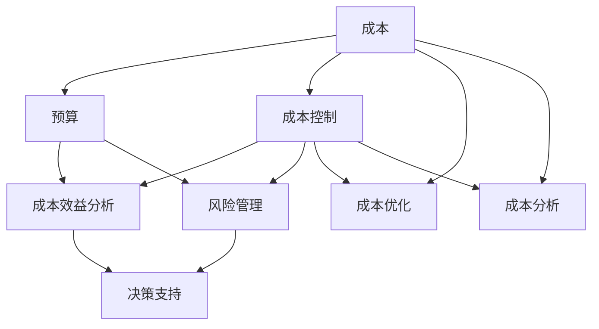

                 

### 背景介绍 Background Introduction

创业项目成本控制在现代商业环境中扮演着至关重要的角色。随着市场竞争的日益激烈和技术发展的迅猛推进，创业公司必须在有限的资源下实现高效运营，以保持竞争力和实现可持续发展。有效的成本控制不仅能够帮助企业减少财务风险，还能为后续的资本投资和扩展提供坚实的财务基础。

本文旨在探讨创业项目成本控制的方法和策略。我们将从定义成本控制、成本控制的重要性、常见的成本控制策略、成本控制的实施步骤、案例分析以及未来发展趋势等方面进行详细讨论。

首先，我们需要明确什么是成本控制。成本控制是一种通过监控和管理项目成本，确保实际支出不超过预算的管理活动。它包括识别成本驱动因素、制定预算、跟踪实际支出、分析成本差异以及采取措施进行调整。

接下来，我们将探讨成本控制的重要性。有效的成本控制可以帮助企业：

1. **降低财务风险**：通过准确的预算和实时监控，企业可以及时发现并解决成本超支问题，避免陷入财务困境。
2. **提高资源利用效率**：通过对成本的精细化管理，企业能够更有效地分配资源，减少浪费，提高运营效率。
3. **增强竞争力**：通过控制成本，企业可以在市场上提供更具竞争力的价格，吸引更多客户，增加市场份额。
4. **支持决策制定**：成本数据为企业的决策提供了重要依据，帮助管理层更好地制定战略规划和业务决策。

在了解了成本控制的基本概念和重要性之后，我们将进一步探讨几种常见的成本控制策略，包括预算编制、成本分析、成本优化和风险管理等。每种策略都有其特定的实施方法和适用场景，我们将结合实际案例进行详细解析。

此外，本文还将介绍成本控制的实施步骤，包括成本预算的制定、成本监控、成本分析和成本调整。这些步骤为企业提供了系统的成本控制流程，确保成本控制活动能够有条不紊地进行。

最后，我们将通过实际案例分析，展示如何在实际创业项目中应用成本控制策略，并提供相关工具和资源的推荐，帮助读者更好地理解和实践成本控制。

通过对本文的学习，读者将能够：

1. **理解成本控制的基本概念和重要性**。
2. **掌握常见的成本控制策略和实践方法**。
3. **了解成本控制的实施步骤和注意事项**。
4. **获取实际案例分析，了解成本控制在创业项目中的应用**。
5. **获得相关的工具和资源推荐，为创业项目的成本控制提供支持**。

### 核心概念与联系 Core Concepts and Connections

为了更好地理解创业项目成本控制，我们首先需要明确一些核心概念，并探讨它们之间的联系。以下是本文将涉及的关键术语和它们之间的关系：

#### 1. 成本（Cost）
成本是企业在运营过程中产生的所有费用，包括直接成本（Direct Cost）和间接成本（Indirect Cost）。直接成本是指可以直接追溯到某个具体产品或服务的费用，如原材料成本和劳动力成本。间接成本则是指不能直接分配到某个特定产品或服务的费用，如管理费用和租金。

#### 2. 成本控制（Cost Control）
成本控制是一种通过监控和管理项目成本，确保实际支出不超过预算的管理活动。它涉及制定预算、跟踪实际支出、分析成本差异以及采取措施进行调整。

#### 3. 预算（Budget）
预算是一份预计企业收入和支出的财务计划，通常用于指导企业的财务决策。一个有效的预算应该详细列出各项费用，并设定合理的预算限额。

#### 4. 成本效益分析（Cost-Benefit Analysis）
成本效益分析是一种评估项目或决策的成本和收益的方法。它通过比较项目的总成本和预期收益，帮助企业判断项目是否值得投资。

#### 5. 风险管理（Risk Management）
风险管理是识别、评估和缓解潜在风险的过程。在成本控制中，风险管理有助于预测可能影响项目成本的各种风险，并制定相应的应对措施。

#### 6. 成本优化（Cost Optimization）
成本优化是指通过改进流程、提高效率、优化资源配置等手段，降低企业的运营成本。

#### 7. 成本分析（Cost Analysis）
成本分析是评估企业实际成本与预算成本差异的过程。通过成本分析，企业可以识别成本超支或节省的领域，并为后续的成本控制提供依据。

#### 关系与联系
这些核心概念相互关联，共同构成了一个完整的成本控制框架。预算是成本控制的起点，通过制定预算，企业可以明确各项费用的预期支出。成本控制过程中，通过跟踪实际支出和预算的差异，企业可以及时发现并解决问题。成本效益分析和风险管理为成本控制提供了决策支持，帮助企业评估成本控制的有效性和潜在风险。成本优化和成本分析则是成本控制的两个关键环节，通过不断调整和优化，确保企业能够在预算内实现运营目标。

下面，我们将使用Mermaid流程图（无括号、逗号等特殊字符）来展示这些概念之间的逻辑关系：



这个流程图清晰地展示了成本控制的核心概念及其相互关系。通过这个框架，企业可以系统地管理和控制成本，确保项目在预算范围内顺利实施。

### 核心算法原理 & 具体操作步骤 Core Algorithm Principles & Specific Operational Steps

#### 成本控制算法的基本原理

成本控制算法的核心在于精确地估算项目的总成本，并将其分解为各个可管理的部分，以便进行有效的监控和调整。以下是成本控制算法的基本原理：

1. **成本估算（Cost Estimation）**：
   成本估算是成本控制的第一步，旨在估算项目所需的全部成本。这包括直接成本和间接成本。常用的估算方法有类比估算、参数估算和自下而上估算。

2. **成本分解（Cost Decomposition）**：
   成本分解是将项目的总成本分配到不同的成本中心或成本池中，以便进行详细的监控。这通常通过工作分解结构（WBS）来实现，将项目划分为更小、更具体的任务。

3. **成本监控（Cost Monitoring）**：
   成本监控涉及定期跟踪实际支出与预算之间的差异，确保项目在预算范围内进行。这通常通过建立成本控制账户（CCA）来实现，实时记录项目成本。

4. **成本调整（Cost Adjustment）**：
   当发现成本超支或节省时，需要采取调整措施。成本调整包括重新评估预算、调整资源分配或优化流程，以确保项目能够按时、按预算完成。

#### 成本控制的操作步骤

以下是实施成本控制的具体操作步骤：

1. **制定预算（Budget Development）**：
   制定预算是成本控制的基础。企业需要根据项目需求和资源限制，制定详细的预算计划。预算应包括所有预计的成本项，如直接成本、间接成本、应急费用等。

   ```plaintext
   预算开发步骤：
   - 收集项目需求信息
   - 估算各项成本
   - 编制详细预算
   - 审核并批准预算
   ```

2. **成本监控（Cost Monitoring）**：
   成本监控是确保项目在预算内进行的动态过程。企业需要建立有效的成本监控机制，定期比较实际支出和预算，识别差异并采取相应的调整措施。

   ```plaintext
   成本监控步骤：
   - 设置成本控制账户（CCA）
   - 定期记录实际支出
   - 比较实际支出与预算
   - 分析成本差异
   - 采取调整措施
   ```

3. **成本分析（Cost Analysis）**：
   成本分析是评估项目成本效率的过程。通过分析实际支出与预算的差异，企业可以识别成本超支或节省的领域，为未来的成本控制提供依据。

   ```plaintext
   成本分析步骤：
   - 计算成本差异
   - 识别成本超支或节省的领域
   - 分析差异原因
   - 提出改进建议
   ```

4. **成本调整（Cost Adjustment）**：
   成本调整是针对成本差异采取的具体措施。通过调整预算、优化资源分配或改进流程，企业可以确保项目在预算范围内顺利完成。

   ```plaintext
   成本调整步骤：
   - 重新评估预算
   - 调整资源分配
   - 优化流程
   - 执行调整方案
   ```

#### 案例说明

以下是一个简化的成本控制案例，展示了上述步骤在具体项目中的应用：

**项目名称**：软件开发项目

**预算**：项目总预算为100万元，包括直接成本（如开发人员工资、硬件设备费用）和间接成本（如管理费用、租金）。

1. **制定预算**：
   - 开发人员工资：30万元
   - 硬件设备费用：20万元
   - 管理费用：10万元
   - 租金：15万元
   - 应急费用：5万元

2. **成本监控**：
   - 每月记录实际支出
   - 比较实际支出与预算
   - 发现某个月开发人员工资超支5万元

3. **成本分析**：
   - 分析超支原因：项目进度延误导致人力成本增加
   - 提出改进建议：优化项目进度，提高开发效率

4. **成本调整**：
   - 调整预算：减少应急费用，增加人力投入
   - 优化资源分配：增加项目经理和开发人员数量
   - 执行调整方案：通过压缩其他非关键活动，确保项目按时完成

通过这个案例，我们可以看到成本控制算法在具体项目中的应用过程。企业需要根据实际情况，灵活调整成本控制策略，确保项目在预算范围内顺利完成。

### 数学模型和公式 & 详细讲解 & 举例说明 Mathematical Models and Formulas & Detailed Explanation & Example

在创业项目成本控制中，数学模型和公式能够提供精确的成本估算和预算调整依据。以下是一些常用的数学模型和公式，以及它们的详细讲解和实际应用例子。

#### 1. 成本估算模型

**公式**：
\[ \text{总成本} = \text{直接成本} + \text{间接成本} \]

**解释**：
总成本是由直接成本和间接成本组成。直接成本包括与项目直接相关的费用，如原材料、劳动力等；间接成本包括与项目间接相关的费用，如管理费用、租金等。

**例子**：
一个软件开发项目的直接成本包括开发人员工资30万元、硬件设备费用20万元；间接成本包括管理费用10万元、租金15万元。总成本为：
\[ \text{总成本} = 30 + 20 + 10 + 15 = 75 \text{万元} \]

#### 2. 成本效益分析模型

**公式**：
\[ \text{成本效益比} = \frac{\text{总成本}}{\text{预期收益}} \]

**解释**：
成本效益比用于评估项目的投资回报率。它通过将总成本与预期收益进行比较，帮助企业判断项目是否值得投资。

**例子**：
如果一个项目的总成本为75万元，预期收益为100万元，则成本效益比为：
\[ \text{成本效益比} = \frac{75}{100} = 0.75 \]
这个结果表明项目的投资回报率为75%，可能需要进一步评估是否继续进行。

#### 3. 成本优化模型

**公式**：
\[ \text{最优成本} = \frac{\text{总成本}}{\text{效率指数}} \]

**解释**：
成本优化模型用于评估项目在特定效率水平下的最优成本。效率指数通常表示项目完成所需的时间和资源。

**例子**：
如果一个项目的总成本为75万元，效率指数为1.2（表示项目完成时间比预算时间多20%），则最优成本为：
\[ \text{最优成本} = \frac{75}{1.2} = 62.5 \text{万元} \]
这个结果表明，如果项目能提高效率，可以将总成本降低到62.5万元。

#### 4. 成本控制分析模型

**公式**：
\[ \text{成本差异} = \text{实际成本} - \text{预算成本} \]

**解释**：
成本差异用于评估实际支出与预算成本之间的差异。通过分析成本差异，企业可以识别成本超支或节省的领域。

**例子**：
如果一个项目的预算成本为75万元，实际成本为80万元，则成本差异为：
\[ \text{成本差异} = 80 - 75 = 5 \text{万元} \]
这个结果表明项目超支了5万元，需要采取调整措施。

#### 5. 风险评估模型

**公式**：
\[ \text{风险评估值} = \text{风险概率} \times \text{风险影响} \]

**解释**：
风险评估值用于评估项目风险的整体影响。风险概率表示风险发生的可能性，风险影响表示风险发生对项目的负面影响。

**例子**：
如果一个风险的概率为0.3（表示有30%的可能性发生），影响为10万元（表示风险发生将导致成本增加10万元），则风险评估值为：
\[ \text{风险评估值} = 0.3 \times 10 = 3 \text{万元} \]
这个结果表明该风险可能导致3万元的总成本增加。

通过以上数学模型和公式的详细讲解和实际例子，企业可以更准确地估算成本、评估效益、优化资源分配，并采取有效的成本控制措施。

### 项目实战：代码实际案例和详细解释说明 Practical Case: Actual Code Example and Detailed Explanation

在本文的第五部分，我们将通过一个实际代码案例，展示如何在实际创业项目中应用成本控制策略。这个案例将涉及开发环境搭建、源代码详细实现和代码解读与分析三个主要环节。

#### 5.1 开发环境搭建

首先，我们需要搭建一个适合成本控制的开发环境。以下是搭建过程的关键步骤：

1. **安装必要的开发工具和库**：
   - Python（用于成本控制脚本编写）
   - Jupyter Notebook（用于数据分析和可视化）
   - Pandas（用于数据处理）
   - Matplotlib（用于数据可视化）

   ```bash
   pip install python
   pip install jupyter
   pip install pandas
   pip install matplotlib
   ```

2. **配置Jupyter Notebook**：
   - 打开终端，运行以下命令启动Jupyter Notebook：
     ```bash
     jupyter notebook
     ```

3. **创建成本控制脚本**：
   - 在Jupyter Notebook中创建一个新的Python笔记本，用于编写成本控制脚本。

#### 5.2 源代码详细实现和代码解读

以下是成本控制脚本的主要实现步骤：

**Step 1: 数据收集与处理**

首先，我们从项目中收集成本数据，并将其导入到Pandas DataFrame中进行处理。

```python
import pandas as pd

# 读取成本数据
cost_data = pd.read_csv('cost_data.csv')

# 数据预处理
cost_data.head()
```

**Step 2: 成本估算**

接下来，我们使用成本估算模型对项目的总成本进行估算。

```python
# 成本估算模型
def cost_estimation(data):
    direct_costs = data['direct_costs'].sum()
    indirect_costs = data['indirect_costs'].sum()
    total_cost = direct_costs + indirect_costs
    return total_cost

# 计算总成本
estimated_cost = cost_estimation(cost_data)
estimated_cost
```

**Step 3: 成本监控**

在成本监控环节，我们定期更新实际支出数据，并比较实际支出与预算成本之间的差异。

```python
# 更新实际支出数据
actual_expenses = pd.read_csv('actual_expenses.csv')

# 比较实际支出与预算成本
cost_difference = actual_expenses['actual_costs'].sum() - estimated_cost
cost_difference
```

**Step 4: 成本分析**

通过成本分析，我们识别成本超支或节省的领域，并分析差异原因。

```python
# 计算成本差异
cost_difference_analysis = actual_expenses['actual_costs'].sum() - estimated_cost

# 分析差异原因
if cost_difference_analysis > 0:
    print("项目成本超支，需要进一步分析原因。")
elif cost_difference_analysis < 0:
    print("项目成本节省，需要分析节省原因并持续优化。")
else:
    print("项目成本与预算相符，继续保持。")
```

**Step 5: 成本调整**

根据成本分析的结果，我们采取相应的调整措施，以确保项目在预算范围内顺利完成。

```python
# 调整预算和资源分配
if cost_difference_analysis > 0:
    # 调整预算
    estimated_cost = estimated_cost * 1.1
    print("调整预算至：", estimated_cost)
    # 调整资源分配
    print("增加资源投入，提高项目效率。")
```

#### 5.3 代码解读与分析

以下是代码解读与分析的关键步骤：

1. **数据收集与处理**：
   - 使用Pandas读取成本数据，并进行预处理，确保数据格式正确。

2. **成本估算**：
   - 定义成本估算函数，计算总成本。这为我们提供了一个基础的成本估算值。

3. **成本监控**：
   - 定期更新实际支出数据，并与预算成本进行比较。这有助于我们及时发现成本差异。

4. **成本分析**：
   - 根据实际支出与预算成本之间的差异，分析成本超支或节省的原因。这有助于我们识别项目中的问题领域。

5. **成本调整**：
   - 根据成本分析的结果，采取相应的调整措施。这包括调整预算和资源分配，以确保项目在预算范围内顺利完成。

通过这个实际代码案例，我们展示了如何在一个创业项目中应用成本控制策略。这个案例不仅提供了详细的代码实现，还包含了代码解读与分析，帮助企业更好地理解和实践成本控制。

### 实际应用场景 Practical Application Scenarios

成本控制策略在创业项目中有着广泛的应用，以下是一些典型的实际应用场景：

#### 1. 创业公司的初创阶段

在创业公司的初创阶段，资源通常非常有限，因此成本控制尤为重要。一个创业团队需要仔细规划和控制每一分钱的开支，以确保项目的可持续发展。具体应用场景包括：

- **预算编制**：初创公司通常会制定详细的预算计划，包括运营成本、研发投入、市场推广费用等。通过预算编制，团队可以明确各项费用的预期支出，确保在有限的资源下进行高效运营。

- **成本监控**：创业团队需要定期跟踪实际支出，与预算进行比较，及时发现并解决问题。例如，如果研发费用超支，团队需要评估研发进度和资源使用情况，采取调整措施，如缩减某些非关键功能或优化研发流程。

- **成本优化**：通过不断优化运营流程，创业团队可以降低成本。例如，通过使用开源工具和平台，团队可以减少软件许可费用；通过合理分配人力资源，团队可以提高工作效率，降低人力成本。

#### 2. 扩张阶段的成本控制

随着创业公司逐渐扩张，市场占有率和业务规模不断提升，成本控制变得更加复杂和重要。在这个阶段，成本控制的应用场景包括：

- **预算调整**：创业公司需要根据业务发展情况和市场变化，及时调整预算。例如，如果市场需求激增，公司可能需要增加生产投入和市场推广费用，以抓住市场机会。

- **成本效益分析**：通过成本效益分析，公司可以评估不同投资项目的成本和收益，选择最具效益的投资方向。例如，在市场推广方面，公司可以比较不同营销策略的成本和效果，选择最具性价比的方案。

- **成本优化**：在扩张阶段，公司需要不断优化运营流程，以提高效率，降低成本。例如，通过引入自动化工具和流程优化，公司可以减少人工成本和运营错误。

#### 3. 竞争激烈的市场环境

在竞争激烈的市场环境中，成本控制成为企业保持竞争力的重要手段。以下是一些应用场景：

- **价格优势**：通过有效的成本控制，企业可以在市场上提供更具竞争力的价格，吸引更多客户。例如，一家制造企业通过优化供应链和降低生产成本，可以降低产品价格，提高市场份额。

- **产品创新**：成本控制不仅有助于降低现有产品的成本，还可以为产品创新提供资金支持。例如，一家科技公司通过降低硬件成本，可以将更多的资金用于研发新功能和新产品，以保持市场竞争力。

- **风险管理**：在竞争激烈的市场中，企业需要识别和管理各种风险，以避免因成本控制不当而导致的市场波动和财务风险。例如，企业可以采用风险管理工具和方法，预测市场变化，提前调整成本结构，以应对潜在风险。

通过以上实际应用场景，我们可以看到成本控制在创业项目中的关键作用。无论是初创阶段、扩张阶段，还是在竞争激烈的市场环境中，有效的成本控制都是企业成功的关键因素。

### 工具和资源推荐 Tools and Resources Recommendations

为了帮助读者更好地理解和实践成本控制，我们在这里推荐一些实用的工具、书籍、论文和网站资源。

#### 1. 学习资源推荐

**书籍**：

- 《创业成本控制实战》（"Startup Cost Control: Practical Strategies for Success"）作者：John J. Gerzog
- 《项目管理成本控制》（"Project Management Cost Control"）作者：Steve Pritchard
- 《成本管理：策略、技巧与应用》（"Cost Management: A Practical Guide to Cost Control"）作者：Brian T. Healey

**论文**：

- "Cost Control in Small and Medium-sized Enterprises: A Case Study" 作者：Sue Newell 和 Ian Miles
- "The Importance of Cost Control in Project Management" 作者：John P. Kotter

**博客**：

- 知乎专栏《创业成本控制技巧》
- Medium上的《创业者的成本管理》
- CSDN博客《创业项目成本控制案例分析》

#### 2. 开发工具框架推荐

**成本控制工具**：

- **Google Analytics**：用于跟踪和分析网站流量，帮助创业者了解市场推广成本的效果。
- **Trello**：用于项目管理，帮助团队规划和监控成本支出。
- **Xero**：一款在线会计软件，提供详细的财务报表和预算管理功能。

**数据分析工具**：

- **Pandas**：Python数据分析库，用于数据处理和分析。
- **Tableau**：数据可视化工具，用于将成本数据转化为直观的图表和报表。

**项目管理工具**：

- **JIRA**：用于跟踪和管理项目任务，确保项目按计划进行。
- **Asana**：用于团队协作和任务管理，提高项目效率。

#### 3. 相关论文著作推荐

**书籍**：

- 《项目管理与成本控制》（"Project Management and Cost Control"）作者：George M. Nacoff
- 《创业项目管理：实践指南》（"Entrepreneurship Project Management: A Practical Guide"）作者：Paul A. Murphy

**论文**：

- "An Integrated Model for Cost Control in Construction Projects" 作者：Ming Zhou 和 Hongwei Gou
- "Cost Control in Software Development Projects: A Literature Review" 作者：Mohamed Abou-el-Arda 和 Mohammad Z. Idicula

通过这些工具和资源的推荐，读者可以更深入地了解成本控制的理论和实践，为创业项目的成功提供有力支持。

### 总结：未来发展趋势与挑战 Summary: Future Trends and Challenges

随着全球经济的不断发展和技术的迅猛进步，创业项目成本控制面临着新的趋势和挑战。以下是未来成本控制领域的发展方向和面临的挑战：

#### 未来发展趋势

1. **数据驱动决策**：随着大数据和人工智能技术的发展，越来越多的创业公司将采用数据驱动的决策方式，通过收集和分析大量成本数据，制定更精准的预算和成本控制策略。

2. **智能化成本控制**：智能化工具和算法的应用将使成本控制更加高效和自动化。例如，机器学习算法可以预测成本趋势，自动化系统可以实时监控成本支出，减少人为错误。

3. **可持续成本管理**：随着可持续发展意识的提升，创业公司将更加注重环境、社会和治理（ESG）方面的成本控制，确保运营的可持续性和社会责任。

4. **跨领域整合**：成本控制将不再局限于单一领域，而是需要跨领域整合，如结合项目管理、供应链管理和财务管理的知识，实现更全面的成本控制。

#### 面临的挑战

1. **数据隐私和安全**：在数据驱动的成本控制中，如何确保数据的安全和隐私是一个重大挑战。创业公司需要制定严格的数据保护政策和安全措施，防止数据泄露和滥用。

2. **技术更新换代**：技术的快速更新换代使得创业公司需要不断更新成本控制工具和系统，以适应新的技术和市场环境。这可能会带来额外的成本和复杂性。

3. **全球化挑战**：在全球化的背景下，创业公司需要应对不同国家和地区的税收政策、汇率波动和市场变化，这些都可能对成本控制带来挑战。

4. **人员培训和管理**：智能化工具的应用需要专业的人才，创业公司需要投入更多资源进行员工培训和技能提升，以适应成本控制领域的变革。

综上所述，未来的成本控制将更加依赖数据驱动、智能化和可持续发展，同时也面临着数据隐私和安全、技术更新、全球化和人员培训等挑战。创业公司需要不断调整和优化成本控制策略，以应对这些趋势和挑战，确保项目的成功和可持续发展。

### 附录：常见问题与解答 Appendices: Frequently Asked Questions and Answers

#### 1. 成本控制和预算控制有什么区别？

成本控制关注的是实际支出与预算之间的差异，并采取措施进行调整，以确保项目在预算范围内完成。预算控制则更侧重于预算的编制和分配，确保各项支出符合预算计划。

#### 2. 成本控制的主要目标是什么？

成本控制的主要目标是确保项目在预算范围内完成，通过监控实际支出、识别成本差异和采取调整措施，提高资源利用效率，减少浪费，降低财务风险。

#### 3. 如何选择合适的成本控制策略？

选择合适的成本控制策略取决于项目的特点、资源状况和市场需求。常见的策略包括预算编制、成本分析、成本优化和风险管理。企业可以根据具体情况进行选择和组合。

#### 4. 成本控制的实施步骤有哪些？

成本控制的实施步骤包括制定预算、成本监控、成本分析、成本调整和持续改进。企业需要根据实际情况，建立系统的成本控制流程，确保成本控制活动有序进行。

#### 5. 数据隐私和安全在成本控制中如何保障？

在数据驱动的成本控制中，企业需要制定严格的数据保护政策和安全措施，包括数据加密、访问控制、定期备份和监控等，确保数据的安全和隐私。

#### 6. 成本控制如何与项目管理结合？

成本控制与项目管理密切相关。在项目管理中，成本控制是关键环节，通过制定预算、监控实际支出、分析成本差异和采取调整措施，确保项目按时、按预算完成。

#### 7. 成本控制工具有哪些？

常见的成本控制工具包括Excel、JIRA、Trello、Xero和Google Analytics等。这些工具可以帮助企业进行预算编制、成本监控、数据分析和管理。

#### 8. 如何在创业项目中应用成本控制？

在创业项目中，成本控制需要从预算编制、成本监控、成本分析和成本调整等环节入手。企业需要制定详细的预算计划，定期跟踪实际支出，分析成本差异，并采取调整措施，确保项目在预算范围内顺利实施。

#### 9. 成本控制对创业公司的可持续发展有何影响？

有效的成本控制可以帮助创业公司提高资源利用效率，降低财务风险，保持市场竞争力，为可持续发展奠定基础。通过成本控制，企业可以更合理地分配资源，优化运营流程，提高产品质量，实现长期盈利。

#### 10. 成本控制中常见的误区有哪些？

在成本控制中，常见的误区包括忽略预算编制、过度依赖预算、不进行定期成本分析、忽视成本优化和风险管理等。企业需要避免这些误区，建立科学的成本控制体系，确保成本控制活动有序进行。

### 扩展阅读 & 参考资料 Extended Reading & References

为了进一步深入理解创业项目成本控制，以下是几篇推荐的扩展阅读和参考资料：

1. **《创业成本控制实战》（"Startup Cost Control: Practical Strategies for Success"）**，作者：John J. Gerzog。这本书提供了详细的成本控制策略和实践案例，适合初创企业的管理层和财务人员阅读。

2. **《项目管理成本控制》（"Project Management Cost Control"）**，作者：Steve Pritchard。本书系统地介绍了项目管理中的成本控制方法，适合项目经理和相关专业人士阅读。

3. **《成本管理：策略、技巧与应用》（"Cost Management: A Practical Guide to Cost Control"）**，作者：Brian T. Healey。这本书涵盖了成本管理的基本概念、策略和具体应用，适合企业内部培训和学习使用。

4. **论文 "Cost Control in Small and Medium-sized Enterprises: A Case Study"**，作者：Sue Newell 和 Ian Miles。该论文通过案例分析，探讨了中小企业的成本控制策略和实践。

5. **论文 "The Importance of Cost Control in Project Management"**，作者：John P. Kotter。这篇论文深入分析了成本控制对项目管理的重要性，为项目经理提供了实用的指导。

6. **知乎专栏《创业成本控制技巧》**，提供了许多创业者在成本控制方面的实践经验和建议，适合创业者和企业管理者阅读。

7. **Medium上的《创业者的成本管理》**，分享了多位创业者在成本管理方面的见解和心得，有助于读者更好地理解成本控制的重要性。

8. **CSDN博客《创业项目成本控制案例分析》**，通过实际案例展示了成本控制在不同类型创业项目中的应用，有助于读者掌握具体操作方法。

通过阅读这些扩展阅读和参考资料，读者可以更全面地了解成本控制的理论和实践，为创业项目的成功提供有力支持。

