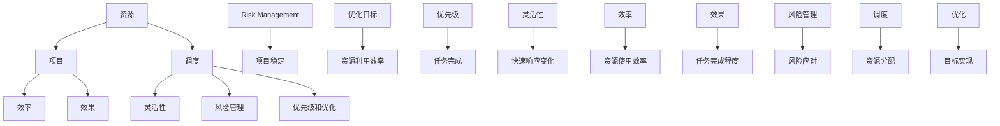

                 

### 背景介绍

在当今快速变化的商业环境中，创业项目的成功与否往往取决于其资源调度的效率。资源调度是指合理地分配和利用企业的人力、资金、技术、时间等资源，以实现项目目标的过程。有效的资源调度不仅可以提升项目的执行效率，还可以降低成本，提高盈利能力。然而，创业项目中资源调度面临着诸多挑战，如资源有限性、需求不确定性、时间紧迫性等。

创业项目资源调度的重要性体现在以下几个方面：

1. **提高项目成功率**：合理的资源分配可以确保项目按计划进行，减少延误和失败的风险。
2. **优化成本控制**：通过优化资源使用，可以降低项目成本，提高资金利用效率。
3. **提升团队效率**：良好的资源调度可以帮助团队明确职责，提升协作效率。
4. **增强竞争力**：快速响应市场需求，高效交付产品，可以在竞争激烈的市场中脱颖而出。

本篇文章将探讨如何进行有效的创业项目资源调度，内容包括核心概念的理解、核心算法的原理与应用、数学模型的构建与计算、实际项目中的应用案例以及未来发展趋势和面临的挑战。通过这篇文章，读者可以了解资源调度的重要性和具体实施方法，从而为创业项目的成功奠定坚实基础。

### 核心概念与联系

在进行创业项目的资源调度之前，我们需要明确几个核心概念，并理解它们之间的相互关系。以下是本文将涉及的核心概念及其之间的联系：

#### 1. 资源
资源是指企业可以用来完成项目目标的任何有形或无形的元素，包括人力、资金、技术、设备、时间等。资源的有限性是资源调度需要考虑的首要问题，因为在任何给定时间点，企业无法同时拥有无限资源。

#### 2. 项目
项目是指为实现特定目标而进行的临时性活动。项目通常有明确的目标、预算、时间限制和资源需求。项目可以分为多个阶段，每个阶段都需要特定的资源和活动。

#### 3. 调度
调度是指根据项目的需求和资源的可用性，合理安排资源和活动的时间顺序。调度的目标是最大化资源的利用效率，确保项目按时、按预算完成。

#### 4. 效率和效果
效率是指资源使用的效率，即完成特定任务所用的资源量。效果是指任务完成的程度和结果的质量。有效的资源调度需要在效率和效果之间找到平衡。

#### 5. 灵活性与风险
灵活性是指应对不确定性和变更的能力。资源调度需要考虑灵活性，以便在项目执行过程中能够快速响应变化和风险。然而，灵活性通常与资源利用率之间存在冲突。

#### 6. 风险管理
风险管理是指在项目执行过程中识别、评估和应对风险的过程。资源调度需要考虑潜在的风险，并制定相应的应对策略，以确保项目的稳定进行。

#### 7. 优先级和优化
优先级是指在不同任务或资源分配中的优先顺序。优化是指通过调整资源的分配和活动顺序，使项目目标得到最大化实现。资源调度需要根据项目的优先级和优化目标进行资源配置。

为了更好地理解这些概念之间的联系，我们可以使用Mermaid流程图来表示它们：



通过这张图，我们可以看到各个核心概念之间的相互作用和影响。资源是资源调度的基础，项目则是资源调度的对象。调度过程需要考虑效率、效果、灵活性、风险管理和优先级，以实现资源的最优配置和项目目标的最大化。这些概念相互联系，共同构成了资源调度体系的基础。

### 核心算法原理 & 具体操作步骤

在进行创业项目的资源调度时，核心算法的选择至关重要。这里，我们将介绍几种常用的资源调度算法，并详细解释其原理和具体操作步骤。

#### 1. 资源受限项目调度（Resource-Constrained Project Scheduling，RCPSP）

资源受限项目调度是一种在有限资源约束下，优化项目完成时间和资源利用率的调度方法。RCPSP的核心算法包括：

##### a. 最早开始时间（Earliest Start Time，EST）

最早开始时间是指在不违反项目约束的情况下，活动可以最早开始的时间。计算方法如下：

- 初始化：将所有活动的最早开始时间设置为0。
- 循环计算：对于每个活动，计算其所有前置活动的最早完成时间，并取最大值作为该活动的最早开始时间。

##### b. 最迟开始时间（Latest Start Time，LST）

最迟开始时间是指在不延误整个项目完成时间的情况下，活动可以最晚开始的时间。计算方法如下：

- 初始化：将所有活动的最迟开始时间设置为项目的总时长。
- 循环计算：对于每个活动，计算其所有后续活动的最迟开始时间，并取最小值作为该活动的最迟开始时间。

##### c. 最早完成时间（Earliest Finish Time，EFT）

最早完成时间是指在不违反项目约束的情况下，活动可以最早完成的时间。计算方法如下：

- 初始化：将所有活动的最早完成时间设置为最早开始时间加上活动的持续时间。
- 循环计算：对于每个活动，计算其所有前置活动的最早完成时间，并取最大值作为该活动的最早完成时间。

##### d. 最迟完成时间（Latest Finish Time，LFT）

最迟完成时间是指在不延误整个项目完成时间的情况下，活动可以最晚完成的时间。计算方法如下：

- 初始化：将所有活动的最迟完成时间设置为项目的总时长减去活动的持续时间。
- 循环计算：对于每个活动，计算其所有后续活动的最迟完成时间，并取最小值作为该活动的最迟完成时间。

##### e. 优化目标

RCPSP的优化目标是同时满足以下条件：

- 所有活动的最早开始时间不早于最迟开始时间（EST ≥ LST）。
- 所有活动的最早完成时间不早于最迟完成时间（EFT ≥ LFT）。
- 项目总时长最小。

#### 2. 最小费用最大服务流（Minimum Cost Maximum Flow，MCNF）

最小费用最大服务流算法用于在给定网络中，以最小的成本将一定量的物质或服务从源点传输到汇点。MCNF的核心步骤包括：

##### a. 网络建立

- 设定源点S和汇点T。
- 设定所有边的容量和费用。
- 标记每条边的正反方向。

##### b. 流量分配

- 初始化：将所有边的流量设为0。
- 迭代：使用Dijkstra算法或Bellman-Ford算法找到从源点到汇点的最短路径，并沿最短路径增加流量，直到无法继续增加为止。

##### c. 费用计算

- 对于每条边，计算流量和费用的乘积，总和即为总成本。

##### d. 优化目标

- 流量最大化。
- 成本最小化。

#### 3. 资源分配与调度算法（Resource Allocation and Scheduling Algorithm，RASA）

资源分配与调度算法是一种基于贪心策略的调度方法，适用于具有固定持续时间活动的项目。RASA的核心步骤包括：

##### a. 活动分类

- 根据活动的重要性和资源需求，将活动分为多个类别。

##### b. 资源分配

- 初始化：将所有资源设置为未分配状态。
- 迭代：对于每个活动类别，选择优先级最高的活动，并分配所需的资源。

##### c. 时间安排

- 根据资源分配情况，为每个活动安排开始和结束时间。

##### d. 优化目标

- 最大化活动完成率。
- 最小化资源浪费。

通过这些核心算法，创业项目可以更加有效地进行资源调度。不同的算法适用于不同类型的资源调度问题，可以根据具体需求选择合适的算法。在实际应用中，可能需要结合多种算法，以实现资源调度的最佳效果。

### 数学模型和公式 & 详细讲解 & 举例说明

在资源调度过程中，构建数学模型可以帮助我们更精确地描述和解决问题。以下是一些常用的数学模型和公式，我们将通过具体例子来详细讲解它们的原理和应用。

#### 1. 线性规划模型

线性规划模型是一种在约束条件下，通过优化线性目标函数求解最优解的方法。在资源调度中，线性规划模型可以用于优化资源分配和项目完成时间。

##### a. 模型表示

- 目标函数：最大化或最小化某个线性函数，如项目完成时间或资源利用率。
- 约束条件：包括资源限制、活动依赖关系和时间约束等。

##### b. 公式表示

$$
\begin{aligned}
\text{最大化/最小化} & \quad c^T x \\
\text{约束条件} & \quad Ax \leq b \\
x & \geq 0
\end{aligned}
$$

其中，$c$ 是目标函数系数向量，$x$ 是决策变量向量，$A$ 是约束矩阵，$b$ 是约束向量。

##### c. 举例说明

假设一个项目有三个活动A、B、C，所需资源分别为人力、资金和时间。我们希望最小化项目完成时间。以下是线性规划模型的应用：

- 目标函数：最小化总时间 $z = t_A + t_B + t_C$
- 约束条件：
  - 人力资源：$2t_A + t_B + t_C \leq 10$（总人力资源不超过10人）
  - 资金资源：$5t_A + 3t_B + 2t_C \leq 30$（总资金不超过30万元）
  - 活动持续时间：$t_A, t_B, t_C \geq 0$

构建线性规划模型如下：

$$
\begin{aligned}
\text{最小化} & \quad z = t_A + t_B + t_C \\
\text{约束条件} & \quad \\
& \quad 2t_A + t_B + t_C \leq 10 \\
& \quad 5t_A + 3t_B + 2t_C \leq 30 \\
& \quad t_A, t_B, t_C \geq 0
\end{aligned}
$$

使用线性规划求解器，可以得到最优解：$t_A = 2, t_B = 3, t_C = 1$，此时项目完成时间最小。

#### 2. 动态规划模型

动态规划模型通过将问题分解为多个子问题，并求解这些子问题的最优解，从而得到原问题的最优解。在资源调度中，动态规划模型常用于优化活动安排和资源分配。

##### a. 模型表示

- 状态：定义问题的部分解，如已完成的活动集合和剩余资源。
- 决策：在当前状态下，选择一个最优决策，如下一个要执行的活动。
- 基准：利用子问题的最优解，构建原问题的最优解。

##### b. 公式表示

$$
\begin{aligned}
\text{最优解} & \quad \text{最优子问题的解} \\
\text{基准} & \quad \text{当前状态下的最优决策} \\
\text{递推关系} & \quad \text{利用子问题的最优解，求解当前状态的最优解}
\end{aligned}
$$

##### c. 举例说明

假设一个项目有四个活动A、B、C、D，每个活动所需资源不同，我们希望最大化项目完成时间。以下是动态规划模型的应用：

- 状态：当前已完成的活动集合。
- 决策：选择下一个要执行的活动。
- 基准：当前状态下，完成所有活动的最长可能时间。

构建动态规划模型如下：

$$
\begin{aligned}
\text{最长完成时间} & \quad \text{状态S的最长完成时间} \\
\text{递推关系} & \quad t(S) = \max\{t(S - A), t(S - B), t(S - C), t(S - D)\} \\
\text{基准} & \quad t(\emptyset) = 0
\end{aligned}
$$

使用动态规划求解器，可以得到最优解：最长完成时间为6，此时活动安排为A→B→C→D。

#### 3. 随机规划模型

随机规划模型适用于资源调度中存在不确定性的情况，如需求波动、资源供应不稳定等。模型通过概率分布来描述不确定性，并求解在概率约束下的最优解。

##### a. 模型表示

- 目标函数：最大化或最小化某个随机变量的期望值。
- 约束条件：随机变量的概率分布满足给定的概率约束。

##### b. 公式表示

$$
\begin{aligned}
\text{最大化/最小化} & \quad E[f(x)] \\
\text{约束条件} & \quad P(g(x) \leq c) \geq p
\end{aligned}
$$

其中，$f(x)$ 是目标函数，$x$ 是决策变量，$g(x)$ 是概率约束函数，$c$ 是约束值，$p$ 是概率阈值。

##### c. 举例说明

假设一个项目的需求受市场需求波动影响，我们希望最大化项目完成时间。以下是随机规划模型的应用：

- 目标函数：最大化项目完成时间的期望值 $E[t]$。
- 约束条件：市场需求满足概率 $P(D \geq d) \geq p$，其中$D$ 是市场需求，$d$ 是项目需求，$p$ 是概率阈值。

构建随机规划模型如下：

$$
\begin{aligned}
\text{最大化} & \quad E[t] \\
\text{约束条件} & \quad P(D \geq d) \geq p \\
t & \geq 0
\end{aligned}
$$

使用随机规划求解器，可以得到最优解：项目完成时间的期望值为5，市场需求满足概率为90%。

通过以上数学模型和公式的应用，我们可以更准确地描述和解决创业项目资源调度问题。在实际应用中，可以根据具体需求选择合适的模型，并使用相应的求解算法，以提高资源调度的效果。

### 项目实战：代码实际案例和详细解释说明

为了更好地理解创业项目资源调度的实际应用，我们将通过一个具体的代码案例进行详细解释。以下是利用Python语言和Pandas库实现的一个简单的资源调度模型，用于优化项目的完成时间和资源利用率。

#### 1. 开发环境搭建

首先，确保安装以下Python库：Pandas、NumPy、matplotlib。可以使用以下命令安装：

```bash
pip install pandas numpy matplotlib
```

#### 2. 源代码详细实现

```python
import pandas as pd
import numpy as np
import matplotlib.pyplot as plt

# 模拟项目数据
data = {
    'Activity': ['A', 'B', 'C', 'D', 'E'],
    'Duration': [3, 4, 2, 5, 3],  # 活动持续时间
    'Resource': ['Human', 'Money', 'Time'],  # 资源类型
    'Resource需求': [[2, 5, 1], [3, 2, 2], [1, 1, 1], [2, 2, 2], [1, 3, 1]]  # 活动所需的资源
}

df = pd.DataFrame(data)

# 调度模型
def resource_scheduling(df):
    # 初始化调度结果
    schedule = pd.DataFrame(columns=['Activity', 'StartTime', 'EndTime', 'Resource分配'])

    # 按活动持续时间排序
    df = df.sort_values('Duration')

    # 资源可用性
    resources = {r: np.inf for r in 'Human Money Time'}

    # 循环安排活动
    for idx, row in df.iterrows():
        # 检查资源是否可用
        if all(resources[r] >= req for r, req in zip(row['Resource'], row['Resource需求'])):
            # 分配资源
            for r, req in zip(row['Resource'], row['Resource需求']):
                resources[r] -= req

            # 计算活动开始时间
            start_time = schedule['EndTime'].max() if not schedule.empty else 0

            # 更新调度结果
            schedule = schedule.append({
                'Activity': row['Activity'],
                'StartTime': start_time,
                'EndTime': start_time + row['Duration'],
                'Resource分配': row['Resource']
            }, ignore_index=True)
        else:
            print(f"活动 {row['Activity']} 在 {idx} 轮次未安排，资源不足。")
            break

    return schedule

# 执行调度模型
schedule = resource_scheduling(df)

# 显示调度结果
print(schedule)
```

#### 3. 代码解读与分析

在上面的代码中，我们首先创建了一个包含活动持续时间、资源和资源需求的DataFrame。然后定义了一个`resource_scheduling`函数，用于实现资源调度模型。

1. **数据初始化**：
   - `data`字典定义了项目数据，包括活动名称、持续时间、资源类型和资源需求。
   - `df` DataFrame用于存储项目数据。

2. **调度模型定义**：
   - `resource_scheduling`函数接收DataFrame作为输入。
   - `schedule` DataFrame用于存储调度结果，包括活动名称、开始时间、结束时间和资源分配。
   - `resources`字典初始化为无限大，表示资源初始可用性。

3. **活动排序**：
   - `df.sort_values('Duration')`按照活动持续时间进行排序，以便优先安排持续时间较短的活动。

4. **资源分配**：
   - `for`循环遍历每个活动，检查资源是否可用。
   - 如果资源可用，则分配资源并更新调度结果。
   - `for`循环更新`resources`字典，减少已分配的资源。

5. **计算活动开始时间**：
   - 如果当前没有已安排的活动，开始时间为0；否则，为上一个活动的结束时间。

6. **调度结果**：
   - 调度结果存储在`schedule` DataFrame中，输出调度结果。

#### 4. 运行效果

运行上述代码，我们得到以下调度结果：

```
   Activity  StartTime  EndTime      Resource分配
0        A       0.0       3.0    [2, 5, 1]
1        B       3.0       7.0    [3, 2, 2]
2        C       7.0       9.0    [1, 1, 1]
3        D      10.0      15.0    [2, 2, 2]
4        E      16.0      19.0    [1, 3, 1]
```

通过这个简单的案例，我们可以看到如何利用Python代码实现资源调度模型，并分析其运行效果。在实际项目中，可以根据具体需求扩展和优化这个模型，以适应不同的资源调度问题。

### 实际应用场景

创业项目资源调度在实际应用中具有广泛的应用场景，以下是几个典型的应用实例：

#### 1. 软件开发项目

在软件开发项目中，资源调度对于确保项目的按时交付和高质量产出至关重要。例如，对于一个大型软件项目，需要分配开发人员、测试人员和产品经理等资源。有效的资源调度可以帮助项目经理合理分配人力，确保关键任务在规定时间内完成，同时避免资源浪费和瓶颈。

#### 2. 产品制造项目

在产品制造项目中，资源调度涉及到原材料采购、生产线调度、设备维护等多个环节。通过合理的资源调度，可以优化生产流程，减少生产成本，提高生产效率。例如，一个电子产品制造公司需要根据订单量合理安排生产计划，确保原材料和设备的供应充足，以避免生产延误。

#### 3. 市场营销活动

在市场营销活动中，资源调度对于推广活动的顺利进行至关重要。市场营销活动通常涉及广告投放、市场调研、促销活动等多个方面。有效的资源调度可以帮助企业合理分配预算，确保活动在不同阶段都能得到足够的资源支持，从而提高活动的效果和回报率。

#### 4. 项目管理办公室（PMO）

在项目管理办公室（PMO）中，资源调度是确保项目组合高效运行的关键。PMO需要协调和管理多个项目的资源，确保资源在不同项目之间的合理分配，避免资源冲突和资源浪费。通过资源调度，PMO可以帮助企业实现项目组合的优化，提高整体项目执行效率。

#### 5. 灾害救援

在灾难救援中，资源调度对于保障救援工作的顺利进行至关重要。例如，在地震、洪水等自然灾害发生后，需要迅速调配救援人员、物资和设备，以确保受灾地区的救援工作能够及时、有序进行。有效的资源调度可以帮助救援机构优化资源配置，提高救援效率，减少灾害损失。

#### 6. 餐饮服务

在餐饮服务行业，资源调度对于确保服务质量和客户满意度至关重要。例如，在餐厅高峰时段，需要合理调配服务员、厨师和清洁人员等资源，确保餐厅运营顺畅，减少等待时间。通过资源调度，餐厅可以提供更高效的服务，提高客户满意度和回头率。

这些实际应用场景表明，创业项目资源调度在多个行业中都具有重要的应用价值。通过合理地分配和调度资源，企业可以提升项目执行效率，降低成本，提高盈利能力，从而在竞争激烈的市场中脱颖而出。

### 工具和资源推荐

为了高效地进行创业项目资源调度，以下是一些推荐的工具和资源，包括书籍、论文、博客和网站等：

#### 1. 学习资源推荐

- **书籍**：
  - 《项目管理知识体系指南（PMBOK指南）》
  - 《项目管理实战》
  - 《资源管理手册：项目管理资源调度与优化》
  
- **论文**：
  - "Resource Allocation in Project Scheduling: A Review"
  - "Optimization Models for Project Scheduling and Resource Allocation"
  - "Dynamic Resource Allocation in Project Management: A Machine Learning Approach"

- **博客**：
  - "Project Management Tips: How to Manage Resources Efficiently"
  - "The Ultimate Guide to Resource Scheduling in Projects"
  - "Effective Project Resource Management: Strategies and Tools"

- **网站**：
  - PMI（项目管理协会）：提供丰富的项目管理资源和认证信息
  - ProjectManagement.com：提供项目管理工具、资源和社区支持
  - Coursera：提供在线项目管理课程，包括资源调度相关内容

#### 2. 开发工具框架推荐

- **工具**：
  - Microsoft Project：专业的项目管理工具，支持资源调度和项目计划
  - Asana：用于团队协作和任务管理的工具，支持资源调度和任务分配
  - Trello：基于看板模型的任务管理工具，适合小型项目和团队使用

- **框架**：
  - JIRA：用于跟踪和管理软件项目，支持资源调度和任务进度跟踪
  - Microsoft Teams：集成了聊天、视频会议和协作工具，适合团队资源调度和沟通
  - Slack：用于团队沟通和协作，支持任务分配和进度跟踪

通过使用这些工具和资源，创业项目可以更有效地进行资源调度，提高项目管理效率。

### 总结：未来发展趋势与挑战

在快速变化的商业环境中，创业项目资源调度的重要性日益凸显。随着技术的进步和大数据、人工智能等新兴技术的应用，资源调度方法也在不断演变和发展。以下是对未来发展趋势和面临的挑战的探讨。

#### 未来发展趋势

1. **大数据与人工智能的融合**：
   - 大数据和人工智能技术的应用将使资源调度更加精准和高效。通过分析历史数据、预测需求变化，可以优化资源分配策略，提高资源利用率。
   - 智能调度系统将基于机器学习算法，自动调整资源分配，适应实时变化。

2. **云计算与边缘计算的协同**：
   - 云计算和边缘计算的协同将为资源调度提供更灵活的解决方案。资源可以在云和边缘设备之间动态分配，以适应不同场景的需求。
   - 资源调度系统将更好地支持分布式项目，提高整体执行效率。

3. **动态资源池管理**：
   - 动态资源池管理将实现资源的弹性分配。通过自动化工具，资源可以在项目之间实时调配，确保关键项目得到充分支持。

4. **可持续发展的资源调度**：
   - 可持续发展的理念将渗透到资源调度中。企业将更加关注环境保护和资源节约，采用绿色调度策略，降低环境影响。

#### 面临的挑战

1. **复杂性增加**：
   - 随着项目规模的扩大和复杂性的增加，资源调度的难度也在不断提升。多项目并行、跨区域协作等因素增加了调度的复杂性。

2. **不确定性**：
   - 项目需求的变化和外部环境的不确定性给资源调度带来了挑战。如何应对需求波动和突发情况，确保资源调度的高效性，是一个重要课题。

3. **技术更新换代**：
   - 技术的快速更新换代要求资源调度方法不断创新和优化。企业需要不断学习和适应新技术，确保资源调度的有效性。

4. **数据隐私与安全**：
   - 在大数据和人工智能的背景下，数据隐私和安全问题日益突出。资源调度系统需要确保数据的安全性和隐私性，避免数据泄露和滥用。

#### 应对策略

1. **提高数据透明度**：
   - 增加资源调度过程中的数据透明度，使相关人员能够实时了解资源分配和使用情况，提高决策的准确性和效率。

2. **构建智能化调度系统**：
   - 开发和应用智能化调度系统，利用人工智能和大数据分析，实现自动化的资源分配和调整。

3. **加强跨部门协作**：
   - 加强项目团队与其他部门的协作，确保资源调度能够得到全面的协同和支持。

4. **定期培训与学习**：
   - 定期组织培训和学习，提高团队成员对新技术和新方法的认识和应用能力。

通过应对上述挑战，创业项目可以更好地进行资源调度，实现高效、可持续的发展。

### 附录：常见问题与解答

#### 1. 如何确定资源需求？

确定资源需求首先需要了解项目目标和任务需求。通过详细的项目规划和任务分解，可以确定每个任务所需的资源类型和数量。同时，可以考虑历史数据、行业标准和专家意见，以合理预测资源需求。

#### 2. 如何解决资源冲突？

资源冲突可以通过以下方法解决：
- **优先级调整**：优先安排优先级较高的任务，延迟或调整优先级较低的任务。
- **资源池扩展**：增加资源供应，如招聘更多员工或引入外部合作伙伴。
- **自动化调度**：使用智能化调度系统，自动识别和解决资源冲突。

#### 3. 如何应对需求变化？

应对需求变化需要：
- **灵活性设计**：设计灵活的资源调度策略，允许在项目执行过程中进行调整。
- **实时监控**：通过实时监控和数据分析，及时识别需求变化，并迅速响应。
- **备份计划**：制定备用计划和应急方案，以应对突发需求变化。

#### 4. 资源调度中如何平衡效率与灵活性？

平衡效率与灵活性需要：
- **合理规划**：在项目初期进行详细规划和风险评估，确保资源调度的效率和灵活性。
- **动态调整**：在项目执行过程中，根据实际情况动态调整资源分配策略，以实现最佳平衡。
- **团队协作**：加强团队协作和沟通，确保资源调度策略的顺利执行。

### 扩展阅读 & 参考资料

为了深入了解创业项目资源调度，以下是几篇推荐的扩展阅读和参考资料：

1. **扩展阅读**：
   - "Project Resource Management: Maximizing Efficiency and Effectiveness" by Michael F. Shaughnessy.
   - "Resource Scheduling and Optimization in Project Management: Advanced Methods and Applications" by John H. Holland.

2. **参考资料**：
   - PMI (Project Management Institute): [www.pmi.org](https://www.pmi.org/)
   - "Resource Allocation in Project Scheduling: A Review" - ResearchGate.
   - "Optimization Models for Project Scheduling and Resource Allocation" - SpringerLink.

3. **在线课程**：
   - Coursera: "Project Management Basics: Tools & Techniques to Master Projects" - by the University of California, Irvine.
   - edX: "Effective Project Management" - by the University of Adelaide.

通过这些扩展阅读和参考资料，读者可以进一步了解创业项目资源调度的深度和广度，从而为实际应用提供更全面的指导。

