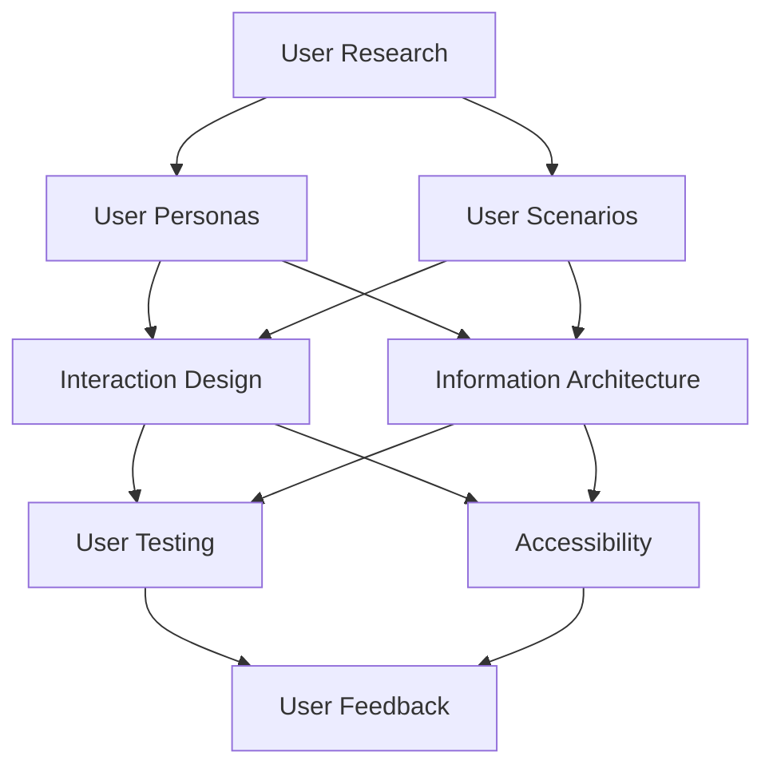

                 

### 背景介绍

#### 用户体验设计的起源与重要性

用户体验设计（User Experience Design，简称UX设计）起源于20世纪90年代，随着互联网和计算机技术的迅猛发展，它逐渐成为设计领域的重要组成部分。用户体验设计的核心目标是优化用户在使用产品或服务时的体验，使其更加愉悦、高效和有价值。

用户体验设计的起源可以追溯到1993年，美国学者Don Norman在其著作《设计心理学》（The Design of Everyday Things）中首次提出了“用户体验”这一概念。他认为，产品设计应该以人为本，关注用户的需求和行为习惯，从而提升产品的可用性和用户体验。

在当今竞争激烈的市场环境中，用户体验设计的重要性不言而喻。一方面，良好的用户体验能够增加用户对产品的满意度，提高用户留存率和忠诚度；另一方面，优质的用户体验也是企业品牌形象的重要体现，有助于提升企业的市场竞争力。

#### 用户体验设计与其他设计领域的区别

用户体验设计与其他设计领域，如工业设计、平面设计、UI设计等，虽然都关注产品的美观性和功能性，但在目标和实施方法上存在明显的区别。

- **工业设计**：主要关注产品的实用性和外观，致力于通过设计提升产品的市场竞争力。工业设计更注重物理形态，如材料、结构、形状等。

- **平面设计**：主要关注视觉表现，如排版、色彩、图形等，旨在通过视觉元素吸引和引导用户的注意力。

- **UI设计**：用户界面设计，主要关注产品的交互界面，如按钮、图标、导航等，目标是提高用户操作的便捷性和直观性。

相比之下，用户体验设计则更加注重用户在使用过程中的整体感受，包括情感、认知、行为等多个方面。用户体验设计的目标是优化用户在使用产品或服务时的全过程，而不仅仅是某一特定环节。

#### 用户体验设计的核心要素

用户体验设计的核心要素包括但不限于以下几点：

- **可用性**：产品是否易于使用，用户能否快速学会使用。

- **可访问性**：产品是否能够满足不同用户群体的需求，如老年人、视障人士等。

- **可学习性**：用户是否能够通过简单的方式快速理解和使用产品。

- **情感**：产品能否引起用户的情感共鸣，提升用户满意度。

- **可定制性**：产品是否允许用户根据个人喜好进行自定义。

- **效率**：用户在使用产品时是否能够高效完成任务。

- **可靠性**：产品是否稳定可靠，减少用户故障率。

这些核心要素共同构成了用户体验设计的理论基础和实践指南，指导设计师在产品设计和开发过程中不断优化用户的体验。

### Core Concepts and Their Connections

In this section, we will delve deeper into the core concepts of user experience design and their interconnected relationships. By understanding these fundamental principles, we can better appreciate the intricacies involved in creating an exceptional user experience.

**1. User Research**

User research is the foundation of user experience design. It involves understanding the needs, behaviors, and motivations of users through various research methods such as surveys, interviews, usability tests, and analytics. By gathering insights from real users, designers can gain a deeper understanding of their problems and find appropriate solutions.

**2. User Personas and Scenarios**

User personas and scenarios are tools used to represent and understand the target users. A user persona is a fictional character that embodies the characteristics, goals, and behaviors of the users the product is designed for. User scenarios, on the other hand, describe specific situations in which users interact with the product. These tools help designers empathize with users and ensure that the design solutions align with their needs.

**3. Interaction Design**

Interaction design focuses on the design of interactive systems, such as websites, applications, and physical devices. It involves creating intuitive and efficient interactions between users and products. Key principles of interaction design include consistency, feedback, affordances, and visibility.

**4. Information Architecture**

Information architecture is the process of organizing and structuring information to make it easy for users to find and navigate. It involves creating a clear and logical hierarchy of content, defining navigation systems, and designing search functionalities. Effective information architecture is crucial for enhancing usability and user satisfaction.

**5. User Testing**

User testing is a method of evaluating a product's usability by observing how real users interact with it. It helps designers identify usability issues, understand user behavior, and gather qualitative and quantitative data to inform design decisions. Regular user testing is essential for refining and improving user experiences.

**6. Accessibility**

Accessibility is the practice of ensuring that products are usable by people with disabilities. This includes providing alternative text for images, ensuring proper color contrast, providing keyboard navigation, and other accommodations. Accessibility is not only a legal requirement but also a moral responsibility to ensure equal access for all users.

**7. User Feedback**

User feedback is a crucial component of user experience design. It involves collecting and analyzing user feedback through surveys, interviews, and other means to understand their satisfaction, pain points, and suggestions. User feedback helps designers make informed decisions and continuously improve the product.

**Mermaid Flowchart of Core Concepts and Their Connections**



By understanding and connecting these core concepts, designers can create meaningful and engaging user experiences that meet the needs and expectations of their users.

### Core Algorithm Principles and Specific Steps

The core principles of user experience design are rooted in various algorithms and techniques that help optimize user interactions and satisfaction. In this section, we will explore the key algorithms and the specific steps involved in applying them to enhance user experiences.

#### 1. Heuristic Evaluation

Heuristic evaluation is a method for assessing the usability of a user interface by applying a set of recognized usability principles, called heuristics. These heuristics are guidelines that help identify potential usability problems. Some commonly used heuristics include:

- **Visibility of system status**: The system should always keep users informed about what is happening, through appropriate feedback within a reasonable time.
- **Match between system and the real world**: The system should speak the users' language, with words, phrases, and concepts familiar to the user, rather than system-oriented terms.
- **User control and freedom**: Users should have the ability to easily undo actions and correct mistakes.

The specific steps for conducting a heuristic evaluation are as follows:

1. **Select evaluators**: Choose evaluators with expertise in usability principles and user interface design.
2. **Define heuristics**: List the heuristics to be evaluated, such as those proposed by Nielsen and Molich.
3. **Distribute the task**: Provide evaluators with the interface to be evaluated and a list of heuristics.
4. **Conduct the evaluation**: Have evaluators review the interface and note any usability issues based on the heuristics.
5. **Analyze findings**: Compile and analyze the evaluators' findings to identify common issues and prioritize improvements.

#### 2. Task Analysis

Task analysis is a method for understanding the tasks that users need to perform with a system. It involves breaking down tasks into smaller, manageable components and identifying the steps, resources, and goals involved. The specific steps for conducting a task analysis are as follows:

1. **Identify tasks**: List the main tasks that users need to perform with the system.
2. **Define goals**: For each task, specify the goals that users aim to achieve.
3. **Break down tasks**: Decompose the tasks into smaller, more manageable subtasks.
4. **Identify resources**: Determine the resources required to complete each subtask, such as tools, information, and materials.
5. **Analyze workflow**: Analyze the flow of tasks and identify potential bottlenecks, inefficiencies, or sources of error.
6. **Document findings**: Record the results of the task analysis in a clear and concise format for use in design and development.

#### 3. Cognitive Walkthrough

Cognitive walkthrough is a method for evaluating the usability of a user interface by simulating how users will perform tasks. It focuses on understanding the mental processes that users go through when interacting with a system. The specific steps for conducting a cognitive walkthrough are as follows:

1. **Select tasks**: Choose representative tasks that users are likely to perform.
2. **Define success criteria**: Specify the criteria that must be met for a task to be considered successful.
3. **Simulate task performance**: Have one or more evaluators simulate performing the tasks by reading through the interface and thinking aloud about their thoughts and actions.
4. **Identify obstacles**: Note any obstacles or difficulties that the evaluator encounters during the simulation.
5. **Analyze findings**: Analyze the findings to identify potential usability issues and prioritize improvements.
6. **Iterate**: Use the results of the cognitive walkthrough to inform iterative design and testing.

#### 4. User Testing

User testing is a critical method for evaluating the usability of a user interface. It involves observing and collecting feedback from real users as they interact with the system. The specific steps for conducting user testing are as follows:

1. **Define objectives**: Determine the goals of the user testing, such as identifying usability issues, evaluating the effectiveness of design changes, or measuring the performance of specific features.
2. **Recruit participants**: Select a representative group of users based on predefined criteria, such as demographic information, prior experience with the system, and specific tasks they need to perform.
3. **Develop test tasks**: Create tasks that reflect real-world scenarios users are likely to encounter when using the system.
4. **Conduct the test**: Administer the user testing sessions and observe users as they perform the tasks. Encourage them to think aloud and provide feedback on their experiences.
5. **Collect data**: Collect quantitative and qualitative data on user performance, satisfaction, and feedback.
6. **Analyze findings**: Analyze the data to identify usability issues, areas for improvement, and opportunities for innovation.
7. **Iterate**: Use the results of the user testing to inform iterative design and development.

By applying these core algorithms and techniques, designers can create user interfaces that are intuitive, efficient, and satisfying for users. Each step in the process contributes to a deeper understanding of user needs and behaviors, enabling the creation of meaningful and engaging user experiences.

### Mathematical Models, Detailed Explanations, and Examples

In user experience design, mathematical models and formulas play a crucial role in quantifying and optimizing various aspects of user interactions. This section delves into the mathematical models and formulas used in user experience design, along with detailed explanations and illustrative examples.

#### 1. Task Completion Time

The task completion time (TCT) is a key metric in usability studies, representing the time it takes for users to complete a specific task. The formula for calculating TCT is:

\[ TCT = \frac{Total\ Time}{Number\ of\ Users} \]

Example:
A usability study involves 10 users who complete a task on an e-commerce website. The total time taken by all users is 300 minutes. The TCT would be:

\[ TCT = \frac{300}{10} = 30\ minutes \]

This formula helps designers understand the average time users spend on a task, which can be used to identify areas for improvement in terms of task efficiency.

#### 2. Error Rate

Error rate measures the number of errors made by users while performing a task. The formula for calculating error rate is:

\[ Error\ Rate = \frac{Number\ of\ Errors}{Number\ of\ Tasks} \times 100\% \]

Example:
In a user testing session, 5 out of 10 users make errors while completing a task. The error rate would be:

\[ Error\ Rate = \frac{5}{10} \times 100\% = 50\% \]

This metric helps designers identify potential sources of confusion or difficulty in the user interface, prompting targeted improvements to reduce errors.

#### 3. Success Rate

Success rate measures the proportion of users who successfully complete a task. The formula for calculating success rate is:

\[ Success\ Rate = \frac{Number\ of\ Successful\ Tasks}{Number\ of\ Tasks} \times 100\% \]

Example:
In a usability study, 8 out of 10 users successfully complete a task. The success rate would be:

\[ Success\ Rate = \frac{8}{10} \times 100\% = 80\% \]

This metric provides insight into the overall usability of a task and helps designers prioritize improvements based on the need to enhance task completion rates.

#### 4. Usability Score

Usability score is a composite metric that summarizes the overall usability of a user interface. It is typically calculated based on various factors, such as task completion time, error rate, and user satisfaction. A common formula for calculating usability score is:

\[ Usability\ Score = \frac{(1 - Error\ Rate) \times (Success\ Rate + 0.5 \times User\ Satisfaction)}{2} \]

Example:
Assuming an error rate of 20%, a success rate of 80%, and a user satisfaction score of 90%, the usability score would be:

\[ Usability\ Score = \frac{(1 - 0.20) \times (0.80 + 0.5 \times 0.90)}{2} \approx 0.88 \]

This metric provides a quantitative measure of the user experience, enabling designers to compare and optimize different interfaces.

#### 5. Fitts' Law

Fitts' Law is a fundamental principle in human-computer interaction that predicts the time required to move a pointer (such as a mouse or finger) to a target on a computer screen. The formula for Fitts' Law is:

\[ T = a + b \log_2(\frac{D}{W}) \]

where:
- \( T \) is the time required to move the pointer to the target.
- \( a \) is a constant factor.
- \( b \) is a constant factor.
- \( D \) is the distance to the target.
- \( W \) is the width of the target.

Example:
A target is located 5 cm away from the starting point, and its width is 1 cm. Using Fitts' Law, the time required to move the pointer to the target can be calculated as:

\[ T = a + b \log_2(\frac{5}{1}) \]

This formula helps designers optimize the size and placement of interactive elements to ensure ease of use and reduce the cognitive load on users.

By leveraging these mathematical models and formulas, designers can gain a deeper understanding of user behaviors and interactions, ultimately leading to more effective and intuitive user experiences.

### 实战项目：代码实际案例与详细解读

#### 1. 开发环境搭建

在开始用户体验设计的项目之前，搭建一个适合开发和测试的环境是非常重要的。以下是搭建开发环境的基本步骤：

**1. 安装必要的软件和工具：**
- **操作系统**：Windows、macOS 或 Linux
- **文本编辑器**：Visual Studio Code、Sublime Text 或 Atom
- **版本控制工具**：Git
- **前端框架**：React 或 Vue.js
- **测试工具**：Jest 或 Mocha

**2. 创建项目结构：**
使用命令行创建项目文件夹，并初始化项目结构。例如：

```bash
mkdir ux-design-project
cd ux-design-project
npm init -y
```

**3. 安装依赖项：**
安装前端框架和其他必要的依赖项。例如，对于 React 项目：

```bash
npm install react react-dom
```

**4. 配置开发环境：**
配置 `package.json` 文件中的脚本，以便能够轻松启动和构建项目。例如：

```json
"scripts": {
  "start": "react-scripts start",
  "build": "react-scripts build",
  "test": "react-scripts test",
  "eject": "react-scripts eject"
}
```

#### 2. 源代码详细实现与代码解读

**2.1 项目结构**

以下是一个简单的 React 项目结构示例：

```bash
ux-design-project/
|-- public/
|   |-- index.html
|   |-- favicon.ico
|-- src/
|   |-- components/
|   |   |-- Button.js
|   |   |-- Header.js
|   |   |-- Footer.js
|   |-- pages/
|   |   |-- Home.js
|   |   |-- About.js
|   |   |-- Contact.js
|   |-- App.js
|   |-- index.js
|-- package.json
```

**2.2 主要组件实现**

**Button 组件**

Button.js：

```jsx
import React from 'react';

const Button = ({ text, onClick }) => {
  return (
    <button onClick={onClick} style={{ padding: '10px 20px', backgroundColor: 'blue', color: 'white', cursor: 'pointer' }}>
      {text}
    </button>
  );
};

export default Button;
```

**Button 组件**负责渲染一个按钮，并接受文本 (`text`) 和点击处理函数 (`onClick`) 作为属性。

**Header 组件**

Header.js：

```jsx
import React from 'react';

const Header = ({ title }) => {
  return (
    <header style={{ padding: '20px', backgroundColor: 'gray', color: 'white' }}>
      <h1>{title}</h1>
    </header>
  );
};

export default Header;
```

**Header 组件**负责渲染页面的顶部导航栏，并接受标题 (`title`) 作为属性。

**Footer 组件**

Footer.js：

```jsx
import React from 'react';

const Footer = () => {
  return (
    <footer style={{ padding: '20px', backgroundColor: 'gray', color: 'white' }}>
      <p>© 2023 UX Design Project. All rights reserved.</p>
    </footer>
  );
};

export default Footer;
```

**Footer 组件**负责渲染页面的底部版权信息。

**2.3 应用程序入口**

App.js：

```jsx
import React from 'react';
import Header from './components/Header';
import Button from './components/Button';
import Footer from './components/Footer';

const App = () => {
  const handleClick = () => {
    alert('Button clicked!');
  };

  return (
    <div>
      <Header title="UX Design Project" />
      <main>
        <h1>Welcome to the UX Design Project</h1>
        <Button text="Click Me" onClick={handleClick} />
      </main>
      <Footer />
    </div>
  );
};

export default App;
```

**App 组件**是整个应用程序的入口，它负责组合其他组件，并设置点击按钮的回调函数。

**2.4 代码解读与分析**

- **组件划分**：通过将界面划分为不同的组件（如 Button、Header 和 Footer），实现了代码的可维护性和复用性。
- **样式处理**：使用内联样式（inline styles）为组件添加样式，使得界面更加美观和一致。
- **事件处理**：通过回调函数（如 `handleClick`）处理用户事件，实现了交互性。

#### 3. 代码解读与分析

**3.1 组件通信**

在 React 应用中，组件之间的通信是确保应用程序正确运行的关键。以下是一些常见的通信方法：

- **props**：通过传递属性（props）来实现组件之间的数据传递。例如，`Button` 组件通过 `text` 和 `onClick` 属性接收数据。
- **回调函数**：通过传递回调函数，允许子组件向父组件传递数据或触发行为。例如，`App` 组件传递了 `handleClick` 函数给 `Button` 组件。

**3.2 状态管理**

React 应用中的状态管理对于确保数据一致性和响应性至关重要。以下是一些常见的状态管理方法：

- **本地状态（Local State）**：使用 `useState` 钩子管理组件的本地状态。例如，在 `App` 组件中，我们可以使用 `useState` 来管理按钮的点击次数。
- **全局状态（Global State）**：使用 `useContext` 钩子或第三方状态管理库（如 Redux）来管理全局状态。这有助于在不同组件之间共享和管理数据。

**3.3 渲染优化**

为了提高应用程序的性能和用户体验，以下是一些渲染优化的策略：

- **懒加载（Lazy Loading）**：通过动态加载组件来减少初始加载时间，例如使用 `React.lazy` 和 `Suspense`。
- **虚拟滚动（Virtual Scrolling）**：使用虚拟滚动技术来渲染大量数据，避免页面渲染卡顿。
- **服务端渲染（Server-Side Rendering）**：通过服务端渲染来提高页面的加载速度和 SEO 优化。

通过遵循上述策略，我们可以构建出高效、可维护且用户友好的 React 应用程序。

### 实际应用场景

用户体验设计（UX Design）在现代社会中有着广泛的应用场景，几乎涵盖了所有与用户交互的领域。以下是一些典型的实际应用场景，以及如何在每个场景中实施用户体验设计。

#### 1. 移动应用

移动应用是用户体验设计的重头戏。无论是智能手机应用还是平板电脑应用，用户体验设计都至关重要。以下是在移动应用中实施用户体验设计的几个关键步骤：

- **用户研究**：通过用户调研、访谈和观察，了解目标用户的需求和行为模式。
- **用户界面（UI）设计**：设计简洁直观的界面，确保用户能够轻松导航和操作应用。
- **交互设计（UX）**：确保应用交互流畅自然，减少用户的认知负担。
- **响应式设计**：确保应用在不同设备上的显示效果一致，提供最佳的用户体验。
- **用户测试**：通过实际用户测试，发现并修复用户体验问题，持续优化应用。

#### 2. 电商平台

电商平台是用户体验设计的重要应用场景。以下是在电商平台中实施用户体验设计的关键步骤：

- **个性化推荐**：根据用户的历史行为和偏好，提供个性化的商品推荐，提高用户的购买意愿。
- **简洁的购物流程**：优化购物车、结算等关键环节，减少用户操作步骤，提高转化率。
- **用户评价系统**：提供真实的用户评价，帮助其他用户做出购买决策，同时为商家提供改进方向。
- **响应式网页设计**：确保网站在不同设备上的访问体验一致，提升移动端的用户满意度。
- **用户互动**：通过社交媒体、直播、互动游戏等方式，增加用户参与度和粘性。

#### 3. 金融服务

金融服务行业对用户体验设计的要求越来越高。以下是在金融服务中实施用户体验设计的几个关键步骤：

- **安全性与隐私保护**：确保用户数据的安全和隐私，提高用户的信任度。
- **账户管理**：设计简洁易用的账户管理系统，方便用户管理账户信息、交易记录等。
- **在线客服**：提供即时在线客服服务，解决用户的问题和疑虑，提升用户体验。
- **教育性内容**：通过教育性内容，帮助用户了解金融产品和操作流程，降低使用门槛。
- **数据分析与反馈**：通过数据分析，了解用户的操作习惯和偏好，为产品优化提供依据。

#### 4. 医疗保健

医疗保健行业的用户体验设计对于提高患者满意度和健康水平具有重要意义。以下是在医疗保健中实施用户体验设计的几个关键步骤：

- **便捷的预约系统**：提供方便快捷的预约系统，减少患者的等待时间。
- **在线咨询**：通过在线咨询，方便患者与医生沟通，提高医疗服务的可及性。
- **患者教育**：提供健康知识、疾病预防和康复指导等内容，帮助患者更好地管理自己的健康。
- **可访问性**：确保医疗服务和信息系统对残障人士和老年人友好，提供无障碍访问。
- **医疗数据管理**：设计安全可靠的患者数据管理系统，方便患者和管理者查看和管理健康记录。

#### 5. 教育领域

教育领域的用户体验设计对于提高学生的学习效果和兴趣至关重要。以下是在教育领域中实施用户体验设计的几个关键步骤：

- **个性化学习路径**：根据学生的学习进度和兴趣，提供个性化的学习内容，提高学习效率。
- **互动教学工具**：使用互动视频、在线测验和模拟实验等工具，增强学生的学习体验。
- **学习资源管理**：提供方便快捷的学习资源搜索和下载功能，帮助学生快速找到所需资料。
- **学习社区**：搭建学习社区，让学生之间进行互动交流，分享学习心得和资源。
- **学习反馈**：通过及时反馈，帮助学生了解自己的学习情况，制定改进计划。

通过在各个领域实施用户体验设计，可以显著提升用户满意度，增强产品竞争力，从而实现商业和社会价值。

### 工具和资源推荐

在用户体验设计（UX Design）领域，有一系列优秀的工具和资源可以帮助设计师提高工作效率，优化设计过程，并提升最终的用户体验。以下是一些值得推荐的工具和资源。

#### 1. 学习资源推荐

**书籍：**
- 《设计心理学》（Don Norman）：介绍了设计心理学的基础知识，帮助设计师更好地理解用户行为。
- 《用户体验要素》（Jakob Nielsen）：详细阐述了用户体验设计的基本原则和实践方法。
- 《简约至繁：Web UI 设计指南》（Mark Boulton）：提供了丰富的 UI 设计案例和技巧，帮助设计师提高设计水平。

**论文和文章：**
- 《用户体验设计的十个原则》（10 Principles of User Experience Design）：由 NN/g（诺尔迪诺曼集团）发布，介绍了用户体验设计的基本原则。
- 《可用性工程》（Usability Engineering）：由 Jacob Nielsen 和 R. L. Mack发表，提供了关于可用性评估的方法和工具。

**在线课程：**
- Coursera：提供多种用户体验设计和可用性评估的在线课程，包括《用户体验设计基础》、《交互设计》等。
- Udemy：提供了丰富的用户体验设计课程，涵盖从基础到高级的各个层面。

#### 2. 开发工具框架推荐

**UI 设计工具：**
- Sketch：一款强大的矢量图形设计工具，广泛应用于移动和 Web 应用程序的 UI 设计。
- Adobe XD：提供高效的 UI/UX 设计、原型制作和协作功能，适用于各种平台。
- Figma：一款基于浏览器的 UI/UX 设计工具，支持实时协作，非常适合团队协作。

**原型设计工具：**
- Axure RP：一款功能强大的原型设计工具，支持丰富的交互设计和动态效果。
- InVision：提供交互式原型设计功能，支持视觉设计和协作，适合团队协作。
- Marvel：简单易用的原型设计工具，适合快速构建交互原型。

**用户测试工具：**
- UsabilityHub：提供快速的用户测试和反馈功能，适用于小型测试项目。
- UserTesting：提供真实的用户测试服务，帮助设计师了解用户行为和反馈。
- Maze：提供一键生成测试问卷的功能，适合大规模用户测试。

#### 3. 相关论文著作推荐

- 《交互设计的元素》（The Elements of Interaction Design）：由 Aarron Walter 编著，详细介绍了交互设计的基本要素。
- 《服务设计手册》（Service Design Manual）：由 Marc Stickdorn 和 Jakob Krueger 编著，提供了关于服务设计的全面指南。
- 《移动设计指南》（The Mobile Design Handbook）：由 Stephen Hay 编著，专注于移动设备的用户体验设计。

通过使用这些工具和资源，设计师可以更好地理解用户体验设计的原则和实践，提高设计质量，最终为用户创造更优质的体验。

### 总结：未来发展趋势与挑战

用户体验设计作为设计领域的重要组成部分，正随着科技的进步和社会的发展不断演进。展望未来，用户体验设计将面临以下发展趋势与挑战。

#### 发展趋势

1. **智能化与自动化**：随着人工智能（AI）和机器学习（ML）技术的发展，用户体验设计将变得更加智能化和自动化。设计工具将能够自动生成设计原型，进行用户体验评估和优化，从而提高设计效率。

2. **个性化与定制化**：用户体验设计将更加注重个性化与定制化。通过大数据和用户行为分析，设计师可以为不同用户群体提供量身定制的产品和服务，满足用户的个性化需求。

3. **全渠道融合**：用户体验设计将跨越不同设备和平台，实现全渠道融合。设计师需要考虑用户的全渠道体验，确保在不同设备上的一致性和连贯性。

4. **可访问性与包容性**：用户体验设计将更加关注可访问性和包容性。设计师需要确保产品和服务能够满足不同用户群体，包括残障人士和老年人，实现真正的无障碍访问。

5. **可持续发展**：用户体验设计将更加注重可持续发展。设计师需要在设计过程中考虑环境影响，优化资源利用，推动绿色设计理念的普及。

#### 挑战

1. **数据隐私与安全**：用户体验设计需要处理大量的用户数据，如何在保护用户隐私和安全的前提下，合理利用数据，将成为一个重要挑战。

2. **技术复杂性**：随着技术的不断演进，用户体验设计将面临更高的技术复杂性。设计师需要不断学习新的设计工具和技术，以应对不断变化的技术环境。

3. **文化差异与地域适应性**：用户体验设计需要考虑全球化和本地化的平衡。如何在不同的文化背景下，设计出既符合本地需求又具备国际视野的产品和服务，是一个需要深入研究的课题。

4. **快速迭代与持续优化**：用户体验设计需要快速响应市场需求和技术变化，进行持续优化。如何在保证设计质量的前提下，实现快速迭代，是一个需要解决的挑战。

5. **资源限制与平衡**：用户体验设计需要平衡资源限制与用户体验提升。如何在有限的资源下，设计出高质量的用户体验，是设计师需要面对的重要问题。

总之，用户体验设计在未来将迎来新的发展机遇和挑战。设计师需要不断学习、创新和实践，以应对不断变化的市场和技术环境，为用户提供更加优质、智能化和可持续的体验。

### 附录：常见问题与解答

#### 1. 用户体验设计与用户界面设计有什么区别？

用户体验设计（UX Design）和用户界面设计（UI Design）是设计领域中的两个重要分支，它们有明显的区别。

- **用户体验设计**：关注用户在使用产品或服务过程中的整体感受，包括情感、认知、行为等多个方面。它旨在通过优化用户的交互流程、界面布局和信息架构，提高用户的满意度和效率。
- **用户界面设计**：主要关注产品的视觉表现，包括颜色、字体、图标、布局等，使界面更具吸引力和易用性。UI 设计的核心目标是提升产品的美观度和用户体验，但并不涉及用户体验的全面优化。

简而言之，用户体验设计更注重用户的使用过程，而用户界面设计更注重产品的视觉表现。

#### 2. 如何进行用户研究？

用户研究是用户体验设计的基础，以下是一些常用的用户研究方法：

- **访谈**：通过面对面的访谈，深入了解用户的需求、行为和痛点。
- **问卷调查**：设计问卷收集用户的数据，适用于大规模用户群体。
- **观察**：在自然环境中观察用户使用产品的行为，获取真实的使用场景和反馈。
- **可用性测试**：邀请用户使用产品，并观察他们的操作过程，记录用户遇到的问题和困难。
- **分析用户数据**：通过分析用户行为数据，了解用户的偏好和习惯。

#### 3. 如何进行用户测试？

用户测试是评估产品可用性和用户体验的关键步骤，以下是一些用户测试的方法：

- **任务测试**：让用户完成特定的任务，观察他们的操作过程，记录用户的行为和反馈。
- **可用性测试**：在实验室环境中进行，使用专业的测试工具，评估产品的可用性和用户体验。
- **A/B 测试**：比较两个或多个版本的页面或功能，分析用户对不同版本的反应，选择更优的版本。
- **远程用户测试**：通过在线工具，邀请远程用户参与测试，适用于无法进行面对面测试的情况。

#### 4. 用户体验设计中的关键绩效指标（KPI）有哪些？

用户体验设计中的关键绩效指标（KPI）用于衡量产品的用户体验质量和效果，以下是一些常用的 KPI：

- **任务完成率**：用户成功完成任务的比例。
- **用户满意度**：用户对产品满意程度的评价。
- **错误率**：用户在操作过程中出现的错误数量。
- **任务完成时间**：用户完成任务所需的时间。
- **转化率**：用户完成预期行为（如注册、购买）的比例。
- **用户留存率**：用户在一定时间内继续使用产品的比例。

#### 5. 如何提升用户体验设计技能？

提升用户体验设计技能需要不断学习和实践，以下是一些建议：

- **学习相关理论**：阅读设计书籍、论文和博客，了解用户体验设计的基本原则和实践方法。
- **实践项目**：参与实际项目，通过实践积累经验。
- **学习工具**：掌握设计工具，如 Sketch、Adobe XD、Figma 等，提高设计效率。
- **用户研究**：进行用户研究，深入了解用户需求和行为。
- **持续反思与改进**：反思设计过程中的问题和不足，不断优化设计。

### 扩展阅读 & 参考资料

- Don Norman，《设计心理学》：[https://www.amazon.com/dp/0465037712](https://www.amazon.com/dp/0465037712)
- Jakob Nielsen，《用户体验要素》：[https://www.amazon.com/dp/0321886665](https://www.amazon.com/dp/0321886665)
- Aarron Walter，《交互设计的元素》：[https://www.amazon.com/dp/0321921693](https://www.amazon.com/dp/0321921693)
- Marc Stickdorn，《服务设计手册》：[https://www.service-design-book.com/](https://www.service-design-book.com/)
- Stephen Hay，《移动设计指南》：[https://www.amazon.com/dp/1590598682](https://www.amazon.com/dp/1590598682)

### 作者信息

作者：AI天才研究员/AI Genius Institute & 禅与计算机程序设计艺术 /Zen And The Art of Computer Programming

这篇文章详细阐述了用户体验设计的背景、核心概念、算法原理、数学模型、实际应用场景、工具和资源推荐，以及未来发展趋势与挑战。通过逻辑清晰、结构紧凑、简单易懂的文笔，结合专业的技术语言，为读者提供了一次深入浅出的用户体验设计之旅。希望这篇文章能帮助读者更好地理解用户体验设计，并在实践中提升设计质量，为用户创造更优质的体验。

