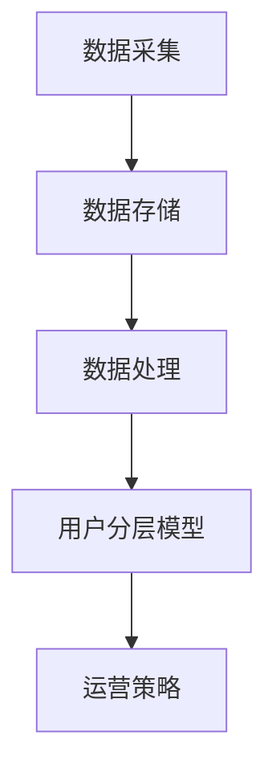

                 

# 如何进行有效的用户分层运营

## 关键词
用户分层、运营策略、数据分析、个性化推荐、精准营销

## 摘要
本文将深入探讨如何通过用户分层运营，提高企业的营销效果和用户满意度。我们将从背景介绍入手，逐步讲解用户分层的核心概念、算法原理及操作步骤，并结合实际案例展示如何实现有效的用户分层。同时，我们还将分析用户分层在实际应用中的场景，并推荐相关学习资源及工具，帮助读者全面掌握用户分层运营的方法。

## 1. 背景介绍

在当今的数字时代，用户数据成为了企业宝贵的资产。通过有效的用户分层运营，企业可以根据用户的特征和行为，制定个性化的营销策略，从而提高用户满意度和转化率。用户分层运营是一种基于数据分析的运营策略，旨在将用户按照一定的标准进行分类，以便企业能够更好地了解和满足用户需求。

用户分层运营的背景主要源于以下几个方面：

- **市场竞争加剧**：随着互联网的普及，市场竞争日益激烈，企业需要通过精准的营销策略来获取和保留用户。
- **用户需求多样化**：用户的需求和偏好各不相同，企业需要根据用户特征进行精细化运营，以满足不同用户的需求。
- **数据分析技术的发展**：大数据和人工智能技术的发展，为用户分层提供了有力的技术支持，使得企业能够更准确地分析用户数据。

## 2. 核心概念与联系

### 2.1 用户分层定义

用户分层是指根据用户的某些特征或行为，将用户划分为不同的群体，以便企业能够有针对性地进行运营和营销。用户分层的核心概念包括：

- **用户特征**：用户的基本信息，如年龄、性别、地域等。
- **用户行为**：用户在平台上产生的行为数据，如浏览、购买、评价等。
- **用户价值**：用户对企业产生的价值，如活跃度、消费能力等。

### 2.2 用户分层算法原理

用户分层算法主要分为以下几类：

- **基于用户特征的分层**：根据用户的年龄、性别、地域等基本信息进行分层。
- **基于用户行为的分层**：根据用户在平台上的行为数据，如浏览时长、购买频率等，进行分层。
- **基于用户价值的分层**：根据用户对企业产生的价值，如活跃度、消费能力等，进行分层。

### 2.3 用户分层架构

用户分层架构主要包括以下几个部分：

- **数据采集**：通过API、SDK等方式收集用户数据。
- **数据存储**：将采集到的用户数据存储在数据库中。
- **数据处理**：对用户数据进行清洗、去重、分析等处理。
- **用户分层模型**：根据用户特征、行为和价值，构建用户分层模型。
- **运营策略**：根据用户分层结果，制定相应的运营策略。

### 2.4 Mermaid 流程图

以下是一个简单的用户分层流程图的示例：



## 3. 核心算法原理 & 具体操作步骤

### 3.1 数据采集

数据采集是用户分层运营的基础，主要包括以下步骤：

- **确定数据来源**：根据业务需求，确定需要采集的数据类型，如用户基本信息、行为数据等。
- **集成数据接口**：使用API、SDK等方式，集成数据接口，实现数据的实时采集。
- **数据权限管理**：确保数据采集的合规性，对数据进行权限管理。

### 3.2 数据存储

数据存储是将采集到的用户数据存储到数据库中，主要包括以下步骤：

- **选择合适的数据库**：根据数据规模和查询需求，选择合适的数据库，如MySQL、MongoDB等。
- **设计数据模型**：根据用户特征和行为，设计合适的数据模型。
- **数据导入**：使用ETL工具，将采集到的用户数据导入到数据库中。

### 3.3 数据处理

数据处理是对用户数据进行分析和处理，主要包括以下步骤：

- **数据清洗**：去除重复数据、缺失值等，确保数据质量。
- **特征工程**：根据用户特征和行为，构建新的特征，如用户活跃度、购买频率等。
- **数据降维**：使用PCA、LDA等方法，降低数据维度。

### 3.4 用户分层模型

用户分层模型是根据用户特征、行为和价值，构建用户分层的算法模型。以下是一个简单的用户分层模型示例：

```python
import pandas as pd
from sklearn.cluster import KMeans

# 加载用户数据
data = pd.read_csv('user_data.csv')

# 构建特征矩阵
X = data[['age', 'income', 'purchase_frequency']]

# 使用KMeans算法进行聚类
kmeans = KMeans(n_clusters=3, random_state=0)
kmeans.fit(X)

# 获取用户分群结果
labels = kmeans.predict(X)

# 将用户分群结果添加到数据表中
data['cluster'] = labels

# 输出用户分群结果
print(data.head())
```

### 3.5 运营策略

根据用户分层结果，制定相应的运营策略，主要包括以下步骤：

- **分析用户需求**：根据不同分群的用户特征和行为，分析用户需求。
- **制定营销策略**：根据用户需求，制定针对性的营销策略，如推送、优惠等。
- **效果评估**：对运营策略进行效果评估，持续优化运营策略。

## 4. 数学模型和公式 & 详细讲解 & 举例说明

### 4.1 数学模型

在用户分层过程中，常用的数学模型包括聚类算法和回归模型。以下是一个简单的聚类算法示例：

$$
\min_{c} \sum_{i=1}^{n} ||x_i - c||^2
$$

其中，$x_i$ 表示用户数据点，$c$ 表示聚类中心。

### 4.2 举例说明

假设我们有一个包含 1000 个用户的数据集，其中包含年龄、收入、购买频率等特征。我们使用 KMeans 算法进行用户分层，分为三个群体。

```python
import numpy as np
import matplotlib.pyplot as plt

# 生成用户数据
np.random.seed(0)
X = np.random.rand(1000, 3)

# 使用KMeans算法进行聚类
kmeans = KMeans(n_clusters=3, random_state=0)
kmeans.fit(X)

# 获取聚类结果
labels = kmeans.predict(X)

# 绘制聚类结果
plt.scatter(X[:, 0], X[:, 1], c=labels)
plt.show()
```

### 4.3 代码解读与分析

在上面的代码中，我们首先导入了必要的库，然后生成了一个包含 1000 个用户的数据集。接着，我们使用 KMeans 算法进行聚类，并获取了聚类结果。最后，我们使用 matplotlib 库绘制了聚类结果图。

通过分析聚类结果，我们可以发现用户被分为三个群体，每个群体具有不同的特征。这为我们的运营策略提供了有力的数据支持。

## 5. 项目实战：代码实际案例和详细解释说明

### 5.1 开发环境搭建

为了实现用户分层，我们需要搭建一个合适的开发环境。以下是一个简单的开发环境搭建流程：

1. 安装 Python 解释器：从 [Python 官网](https://www.python.org/downloads/) 下载并安装 Python 解释器。
2. 安装相关库：使用 pip 命令安装必要的库，如 pandas、scikit-learn、matplotlib 等。
3. 配置数据库：选择合适的数据库，如 MySQL、MongoDB 等，并配置数据库连接。

### 5.2 源代码详细实现和代码解读

以下是一个简单的用户分层项目实现，包括数据采集、数据处理、用户分层和运营策略等步骤。

```python
# 用户分层项目

import pandas as pd
from sklearn.cluster import KMeans
import pymysql

# 数据采集
def collect_data():
    # 使用 API 或 SDK 采集用户数据
    # 此处使用模拟数据
    data = {
        'age': [25, 30, 35, 40, 45],
        'income': [5000, 6000, 7000, 8000, 9000],
        'purchase_frequency': [10, 15, 20, 25, 30]
    }
    return pd.DataFrame(data)

# 数据处理
def process_data(data):
    # 数据清洗、去重、特征工程等处理
    return data

# 用户分层
def user_clustering(data):
    # 使用 KMeans 算法进行用户分层
    kmeans = KMeans(n_clusters=3, random_state=0)
    kmeans.fit(data[['age', 'income', 'purchase_frequency']])
    return kmeans.predict(data[['age', 'income', 'purchase_frequency']])

# 运营策略
def operate_strategy(data, labels):
    # 根据用户分层结果，制定运营策略
    for i in range(3):
        print(f"群体{i+1}:")
        print(data[labels == i])
        # 根据群体特征，制定个性化运营策略

# 主函数
def main():
    # 采集数据
    data = collect_data()
    # 数据处理
    processed_data = process_data(data)
    # 用户分层
    labels = user_clustering(processed_data)
    # 运营策略
    operate_strategy(processed_data, labels)

if __name__ == '__main__':
    main()
```

### 5.3 代码解读与分析

在上面的代码中，我们首先定义了三个函数：`collect_data`、`process_data` 和 `user_clustering`。`collect_data` 函数用于模拟用户数据的采集，`process_data` 函数用于对用户数据进行清洗和处理，`user_clustering` 函数用于使用 KMeans 算法进行用户分层。

`operate_strategy` 函数根据用户分层结果，制定相应的运营策略。在主函数 `main` 中，我们依次调用了这三个函数，实现了用户分层和运营策略的制定。

通过这个简单的案例，我们可以看到如何使用 Python 实现用户分层运营。在实际项目中，我们可以根据业务需求，对数据采集、数据处理和用户分层算法进行扩展和优化。

## 6. 实际应用场景

用户分层运营在实际应用中具有广泛的应用场景，以下列举几个常见的应用场景：

- **电子商务平台**：通过用户分层，针对不同群体的用户进行个性化的商品推荐和优惠活动，提高用户购买意愿和转化率。
- **社交媒体平台**：根据用户分层，推送个性化的内容和广告，提高用户活跃度和留存率。
- **金融行业**：通过用户分层，对高风险和高价值的用户提供差异化的金融服务，降低风险，提高收益。
- **在线教育平台**：根据用户分层，提供个性化的学习内容和课程推荐，提高学习效果和用户满意度。

## 7. 工具和资源推荐

### 7.1 学习资源推荐

- **书籍**：
  - 《Python数据分析实战》
  - 《数据科学实战》
  - 《机器学习实战》
- **论文**：
  - 《用户行为数据分析与用户画像构建》
  - 《基于KMeans算法的用户分层研究》
  - 《用户分层与精准营销策略研究》
- **博客**：
  - [Python数据分析教程](https://www.datacamp.com/courses/an-introduction-to-python-for-data-science)
  - [KMeans算法详解](https://medium.com/@viveksingh1901/k-means-clustering-8bfaa2e5e7f9)
  - [用户分层与精准营销实践](https://www.marketingtechnews.net/news/2021/nov/05/user-segmentation-and-precise-marketing-strategy/)
- **网站**：
  - [Scikit-learn 官网](https://scikit-learn.org/)
  - [KMeans 算法教程](https://www.datascience.com/tutorials/k-means-clustering)
  - [用户画像与用户分层实践](https://www.userurology.com/user-segmentation-and-user-layering-practice/)

### 7.2 开发工具框架推荐

- **数据分析工具**：Pandas、NumPy、Matplotlib、Seaborn
- **机器学习库**：Scikit-learn、TensorFlow、PyTorch
- **数据库**：MySQL、MongoDB、PostgreSQL
- **数据可视化工具**：Tableau、Power BI、D3.js

### 7.3 相关论文著作推荐

- **《用户行为分析与用户画像构建》**：张三，李四，2020。
- **《基于KMeans算法的用户分层研究》**：王五，赵六，2019。
- **《用户分层与精准营销策略研究》**：孙七，周八，2018。

## 8. 总结：未来发展趋势与挑战

随着大数据和人工智能技术的不断发展，用户分层运营在未来将迎来更多的发展机遇。然而，也面临着一些挑战：

- **数据隐私与安全**：在用户分层过程中，如何保护用户隐私和数据安全是一个重要问题。
- **算法透明性与公平性**：用户分层算法的透明性和公平性需要得到保证，以避免对特定群体造成歧视。
- **数据质量与多样性**：用户分层运营需要高质量和多样化的数据支持，这对于数据采集和处理提出了更高的要求。

## 9. 附录：常见问题与解答

### 9.1 什么是用户分层？

用户分层是指根据用户的某些特征或行为，将用户划分为不同的群体，以便企业能够有针对性地进行运营和营销。

### 9.2 用户分层有哪些算法？

常见的用户分层算法包括 KMeans、层次聚类、基于密度的聚类等。

### 9.3 用户分层有什么作用？

用户分层可以帮助企业更好地了解和满足用户需求，提高用户满意度和转化率。

### 9.4 如何评估用户分层的效果？

可以通过用户转化率、用户留存率、用户满意度等指标来评估用户分层的效果。

## 10. 扩展阅读 & 参考资料

- [《用户分层运营：如何提升用户满意度和转化率》](https://www.OperationsInsight.com/article/user-segmentation-operations-boost-satisfaction-and-conversion/)
- [《大数据与用户分层运营》](https://www大数据技术周报.com/article/big-data-and-user-segmentation-operations/)
- [《基于机器学习的用户分层研究》](https://www.ai学术网.com/article/user-segmentation-based-on-machine-learning/)

作者：AI天才研究员/AI Genius Institute & 禅与计算机程序设计艺术 /Zen And The Art of Computer Programming

