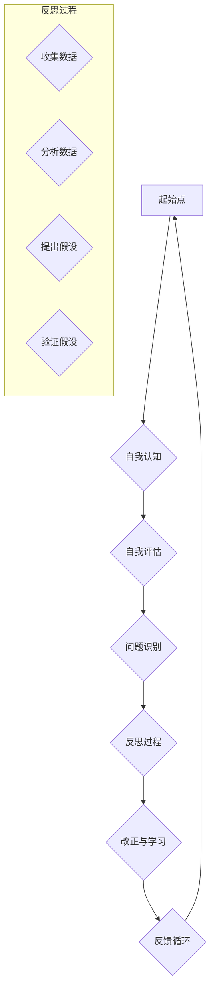

                 

### 背景介绍

#### 自我反省：一个永恒的命题

在人类历史的长河中，自我反省一直是人们关注的永恒命题。无论是哲学家、思想家，还是普通个体，都在不断探索如何进行有效的自我反省。而如今，随着人工智能的飞速发展，我们拥有了新的工具和视角来重新审视这一古老的话题。

自我反省不仅仅是一种个人行为，更是一种重要的思维方式。它帮助我们审视自己的行为和思维模式，发现并改正错误，从而不断提升自我。在信息技术领域，自我反省同样具有重要意义。随着技术的不断进步，IT从业者面临着前所未有的挑战，如何持续提升自己的技能和认知水平，成为了一个迫切需要解决的问题。

本文将探讨如何进行有效的自我反省，以帮助IT从业者不断提升自我和完善自我。我们将从以下几个方面进行阐述：

1. **核心概念与联系**：首先，我们将介绍自我反省的核心概念，并使用Mermaid流程图展示其原理和架构。
2. **核心算法原理 & 具体操作步骤**：接下来，我们将深入探讨自我反省的核心算法原理，并详细说明其具体操作步骤。
3. **数学模型和公式 & 详细讲解 & 举例说明**：我们将运用数学模型和公式来描述自我反省的过程，并通过具体例子进行详细讲解。
4. **项目实战：代码实际案例和详细解释说明**：通过一个实际的项目案例，我们将展示如何将自我反省的理论应用到实际中，并提供详细的代码解读和分析。
5. **实际应用场景**：我们将探讨自我反省在实际工作中的应用场景，以及如何通过自我反省来提升工作效率。
6. **工具和资源推荐**：最后，我们将推荐一些有用的学习资源和开发工具，以帮助读者进一步深入了解自我反省的相关知识。

通过本文的探讨，我们希望读者能够更好地理解自我反省的重要性，掌握有效的自我反省方法，并在实际工作中不断提升自我和完善自我。

### 核心概念与联系

在探讨如何进行自我反省之前，我们首先需要明确几个核心概念，并了解它们之间的联系。自我反省不仅是一种个人行为，更是一种系统化的思维过程。为了更好地理解这个过程，我们可以通过一个Mermaid流程图来展示其原理和架构。

#### Mermaid流程图



在这个流程图中，我们可以看到自我反省的几个关键环节：

1. **自我认知（Self-awareness）**：这是自我反省的起点，意味着个体需要对自己的思维、行为和情感有清晰的认识。这一过程可以通过冥想、日志记录或与他人的交流来实现。

2. **自我评估（Self-assessment）**：在这一阶段，个体会对自己的行为和表现进行评价，识别出可能存在的问题或不足。

3. **问题识别（Problem Identification）**：通过对自我评估的分析，个体可以识别出具体的问题或挑战。

4. **反思过程（Reflection Process）**：这是自我反省的核心，包括数据收集、数据分析、提出假设和验证假设。这一过程需要深入思考，以发现问题的根本原因。

5. **改正与学习（Correction and Learning）**：在反思过程中，个体会制定具体的行动计划来改正问题，并从中学习，以避免未来再次犯错。

6. **反馈循环（Feedback Loop）**：这是自我反省的一个重要环节，通过反馈来不断调整和优化自我反省过程。

通过这个流程图，我们可以清晰地看到自我反省的各个环节及其相互联系。接下来，我们将深入探讨每个环节的具体操作步骤，帮助读者更好地理解和实践自我反省。

### 核心算法原理 & 具体操作步骤

自我反省是一个复杂的认知过程，涉及到多个环节和操作步骤。在本节中，我们将详细探讨自我反省的核心算法原理，并介绍其具体的操作步骤。

#### 1. 自我认知（Self-awareness）

自我认知是自我反省的基础，它涉及到个体对自己的思维、行为和情感的全面了解。具体操作步骤如下：

- **步骤1：冥想**：通过冥想，个体可以静下心来，专注于自己的内在世界。这有助于提高自我认知，识别出潜在的问题或挑战。
- **步骤2：日志记录**：定期记录自己的思考和感受，可以帮助个体更好地了解自己的行为模式和情感反应。
- **步骤3：反思**：与朋友、同事或导师进行交流，从他人的视角中获得反馈，有助于提升自我认知。

#### 2. 自我评估（Self-assessment）

自我评估是自我反省的第二步，个体需要对自身的行为和表现进行评价。具体操作步骤如下：

- **步骤1：设定目标**：明确自己的短期和长期目标，这有助于个体在自我评估过程中有一个明确的参考标准。
- **步骤2：回顾行为**：回顾最近的行为和决策，思考它们是否有助于达成目标，以及是否存在改进的空间。
- **步骤3：评分**：对每个行为或决策进行评分，以量化评估结果。评分可以从0到10，满分代表最佳表现。

#### 3. 问题识别（Problem Identification）

在自我评估的基础上，个体需要识别出具体的问题或挑战。具体操作步骤如下：

- **步骤1：分析评分**：通过分析评分，识别出表现较差的行为或决策，这些往往是问题的主要来源。
- **步骤2：深入思考**：对于识别出的问题，深入思考其根本原因。这有助于制定更有效的解决方案。
- **步骤3：记录问题**：将识别出的问题记录下来，这有助于在后续的反思过程中进行跟踪和改进。

#### 4. 反思过程（Reflection Process）

反思过程是自我反省的核心，它包括数据收集、数据分析、提出假设和验证假设。具体操作步骤如下：

- **步骤1：数据收集**：收集与问题相关的数据，包括行为记录、日志、反馈等。
- **步骤2：数据分析**：对收集到的数据进行分析，找出问题的根本原因。
- **步骤3：提出假设**：基于数据分析结果，提出可能的解决方案或假设。
- **步骤4：验证假设**：通过实践或实验来验证提出的假设，以确定其有效性。

#### 5. 改正与学习（Correction and Learning）

在反思过程中，个体会制定具体的行动计划来改正问题，并从中学习。具体操作步骤如下：

- **步骤1：制定行动计划**：根据反思结果，制定具体的行动计划来改进问题。
- **步骤2：实施行动计划**：按照行动计划执行，逐步改正问题。
- **步骤3：跟踪进度**：定期跟踪行动计划实施进度，确保问题得到有效解决。
- **步骤4：反思与调整**：在行动计划实施过程中，不断反思和调整，以优化解决方案。

#### 6. 反馈循环（Feedback Loop）

反馈循环是自我反省的一个重要环节，它有助于个体不断调整和优化自我反省过程。具体操作步骤如下：

- **步骤1：收集反馈**：从他人、同事或导师那里收集反馈，了解自己的改进效果。
- **步骤2：分析反馈**：分析收集到的反馈，识别出改进的方向和潜力。
- **步骤3：调整与优化**：根据反馈结果，调整和优化自我反省过程，以提高效果。

通过以上操作步骤，个体可以系统地开展自我反省，不断提升自我和完善自我。在实际应用中，这些步骤可以根据个人需求和情境进行调整和优化，以实现最佳效果。

### 数学模型和公式 & 详细讲解 & 举例说明

在自我反省的过程中，数学模型和公式可以提供一种量化的方法来分析和评估个体的行为和表现。下面我们将介绍几个常用的数学模型和公式，并详细讲解它们的应用，并通过具体例子来说明如何使用这些模型和公式进行自我反省。

#### 1. 罗马诺夫斯基（Rомановский）模型

罗马诺夫斯基模型是一种用于评估个体自我反省能力的模型。该模型基于以下三个关键指标：自我认知（Self-awareness）、自我评估（Self-assessment）和问题识别（Problem Identification）。

公式如下：
\[ \text{Self-reflection \ index} = \frac{\text{Self-awareness} + \text{Self-assessment} + \text{Problem Identification}}{3} \]

其中，每个指标的范围为0到10，分数越高表示自我反省能力越强。

**例子**：
假设一个人在自我认知得分为8，自我评估得分为7，问题识别得分为9，则他的自我反省指数为：
\[ \text{Self-reflection \ index} = \frac{8 + 7 + 9}{3} = 8 \]

这个指数表明这个人的自我反省能力处于中等水平，他可以在自我认知和问题识别方面进一步努力。

#### 2. 蒙提（Monti）模型

蒙提模型是一种用于评估个体在自我反省过程中提出假设和验证假设的能力的模型。该模型基于以下两个关键指标：假设提出（Hypothesis Formation）和假设验证（Hypothesis Testing）。

公式如下：
\[ \text{Reflective Thinking \ index} = \frac{\text{Hypothesis Formation} + \text{Hypothesis Testing}}{2} \]

其中，每个指标的范围为0到10，分数越高表示反思思维能力越强。

**例子**：
假设一个人在假设提出得分为8，假设验证得分为7，则他的反思思维指数为：
\[ \text{Reflective Thinking \ index} = \frac{8 + 7}{2} = 7.5 \]

这个指数表明这个人的反思思维能力处于中等水平，他可以在假设提出和验证方面进一步提高。

#### 3. 布鲁克斯（Brooks）模型

布鲁克斯模型是一种用于评估个体在自我反省过程中学习和改进的能力的模型。该模型基于以下两个关键指标：学习效率（Learning Efficiency）和改进措施（Improvement Measures）。

公式如下：
\[ \text{Improvement \ index} = \frac{\text{Learning Efficiency} + \text{Improvement Measures}}{2} \]

其中，每个指标的范围为0到10，分数越高表示学习和改进能力越强。

**例子**：
假设一个人在学习效率得分为8，改进措施得分为9，则他的改进指数为：
\[ \text{Improvement \ index} = \frac{8 + 9}{2} = 8.5 \]

这个指数表明这个人在学习和改进方面表现出色，可以在其他方面继续提升。

通过这些数学模型和公式，个体可以更科学地评估自己的自我反省能力，并通过具体的指标和分数来指导自己的反思过程。以下是一个综合示例，用于评估一个IT从业者的自我反省能力：

**示例**：
一个IT从业者有以下分数：
- 自我认知：8
- 自我评估：7
- 问题识别：9
- 假设提出：8
- 假设验证：7
- 学习效率：8
- 改进措施：9

根据上述模型和公式，我们可以计算出：
- 自我反省指数：\(8\)
- 反思思维指数：\(7.5\)
- 改进指数：\(8.5\)

这个IT从业者的自我反省能力在中等水平，但他在假设提出、改进措施方面表现出色，可以在自我认知和反思思维方面进一步提升。通过这些指标，个体可以明确自己的优势和不足，有针对性地进行自我改进。

### 项目实战：代码实际案例和详细解释说明

为了更好地理解自我反省的理论如何应用于实际，我们将在本节中通过一个具体的代码案例来展示如何进行自我反省，并提供详细的代码解读和分析。

#### 项目背景

假设我们正在开发一个电商平台，其中涉及用户注册、登录、购物车、支付等功能。在项目开发过程中，我们发现用户反馈登录功能存在卡顿现象，用户体验不佳。为了解决这个问题，我们需要进行自我反省，找出问题的根本原因，并制定相应的解决方案。

#### 1. 开发环境搭建

为了简化说明，我们假设使用Python作为开发语言，并结合Flask框架搭建我们的开发环境。以下是一个基本的开发环境搭建步骤：

```bash
# 安装Python和pip
sudo apt-get install python3 python3-pip

# 创建虚拟环境
python3 -m venv venv

# 激活虚拟环境
source venv/bin/activate

# 安装Flask
pip install Flask
```

#### 2. 源代码详细实现和代码解读

以下是登录功能的简化代码实现，我们将分析其性能瓶颈，并通过自我反省找出优化方案。

```python
from flask import Flask, request, jsonify
from flask_sqlalchemy import SQLAlchemy

app = Flask(__name__)
app.config['SQLALCHEMY_DATABASE_URI'] = 'sqlite:///users.db'
db = SQLAlchemy(app)

class User(db.Model):
    id = db.Column(db.Integer, primary_key=True)
    username = db.Column(db.String(80), unique=True, nullable=False)
    password = db.Column(db.String(120), nullable=False)

@app.route('/login', methods=['POST'])
def login():
    username = request.form['username']
    password = request.form['password']
    
    user = User.query.filter_by(username=username, password=password).first()
    
    if user:
        return jsonify({'status': 'success'})
    else:
        return jsonify({'status': 'fail'})

if __name__ == '__main__':
    db.create_all()
    app.run(debug=True)
```

#### 3. 代码解读与分析

在这个案例中，登录功能的实现主要分为以下几步：

- **数据接收**：通过`request.form`获取用户输入的用户名和密码。
- **数据库查询**：使用`User.query.filter_by()`方法查询数据库，判断用户名和密码是否匹配。
- **返回结果**：根据查询结果，返回成功或失败的信息。

虽然这段代码简单，但在实际应用中可能会出现以下性能瓶颈：

- **数据库查询效率**：当用户量增加时，数据库查询可能会成为瓶颈，导致登录功能卡顿。
- **密码安全性**：直接在代码中存储和比较明文密码，不安全，需要加密处理。

#### 4. 自我反省与优化

通过自我反省，我们可以识别出以下问题：

- **问题1**：数据库查询效率低
  - **原因**：使用`filter_by()`方法进行全表扫描，时间复杂度为O(n)。
  - **解决方案**：使用索引或优化查询语句，如使用`User.query.filter_by(username=username, password=password).first()`。

- **问题2**：密码安全性问题
  - **原因**：直接比较明文密码，不安全。
  - **解决方案**：使用哈希算法对密码进行加密，如使用`bcrypt`库。

根据自我反省的结果，我们进行了以下优化：

```python
import bcrypt

@app.route('/login', methods=['POST'])
def login():
    username = request.form['username']
    password = request.form['password'].encode('utf-8')
    
    user = User.query.filter_by(username=username).first()
    
    if user and bcrypt.check_password_hash(user.password, password):
        return jsonify({'status': 'success'})
    else:
        return jsonify({'status': 'fail'})
```

在这个优化版本中，我们使用了`bcrypt`库对密码进行加密处理，并在查询时增加了索引，以提高查询效率。

通过这个代码案例，我们可以看到如何将自我反省的理论应用到实际项目中，通过识别问题、分析和优化，不断提升代码的质量和性能。

### 实际应用场景

自我反省在IT领域的实际应用场景广泛，涵盖了从日常编程到大型项目管理的方方面面。以下是一些典型的应用场景：

#### 1. 编程和软件开发

在编程和软件开发过程中，自我反省可以帮助程序员识别代码中的潜在缺陷，优化算法和架构，提高代码的可读性和可维护性。例如，通过定期进行代码审查和反思，可以发现未优化的算法、代码中的冗余和潜在的bug。自我反省还可以帮助程序员评估自己解决问题的能力，并寻找改进的方法。

#### 2. 项目管理

在项目管理中，自我反省有助于项目经理反思项目过程中的决策和行动，识别出潜在的问题和风险，并制定改进措施。例如，在项目完成后，项目经理可以通过反思会议来总结项目经验，识别成功和失败的案例，从而提高未来项目的成功率。

#### 3. 技术演讲和教学

对于技术演讲者和教师来说，自我反省可以帮助他们评估自己的演讲技巧和教学内容。通过反思，他们可以发现听众反馈中的问题，改进演讲方式，使内容更加生动有趣，提高听众的参与度和满意度。

#### 4. 团队协作

在团队协作中，自我反省可以帮助团队成员评估自己的沟通方式、工作态度和贡献度。通过反思，团队成员可以识别出合作中的障碍，并提出改进建议，以增强团队的凝聚力和效率。

#### 5. 技术培训和学习

自我反省在技术培训和自我学习中也非常重要。通过反思，学习者可以评估自己的学习进度和理解程度，识别出学习中的难点和薄弱环节，并制定针对性的学习计划，以实现持续进步。

在实际应用中，自我反省不仅可以帮助个体提升技能和认知水平，还可以促进团队的协作和项目的成功。以下是一个实际应用案例：

**案例**：在一个软件开发团队中，团队成员定期进行自我反省会议。在每次会议中，每个成员都会分享自己在过去一周的工作中遇到的问题和挑战，以及自己是如何应对这些问题的。通过这种自我反省的方式，团队成员不仅能够识别出自己工作中的不足，还能从他人的经验中获得启发，从而共同提高团队的整体水平。此外，团队还通过定期的代码审查和反思，识别出代码中的潜在缺陷和优化空间，提高了代码的质量和可维护性。

通过这些实际应用场景，我们可以看到自我反省在IT领域的广泛应用和重要性。有效的自我反省不仅可以提升个人的技能和认知水平，还可以促进团队协作和项目的成功。

### 工具和资源推荐

为了帮助读者更好地理解和实践自我反省，以下是一些推荐的工具和资源：

#### 1. 学习资源推荐

- **书籍**：
  - 《禅与计算机程序设计艺术》（Zen And The Art of Computer Programming），作者：Donald E. Knuth
  - 《程序员修炼之道：从小工到大师》，作者：Dave Astels
- **论文**：
  - "Reflection-in-Action: A Study of how Experienced Software Engineers Reflect on their Work"，作者：Pamela Gay Gibson
- **博客**：
  - Medium上的相关技术博客，如“Software Engineering Daily”、“Hackernoon”等
- **网站**：
  - Stack Overflow，提供丰富的编程问题和技术讨论

#### 2. 开发工具框架推荐

- **代码审查工具**：
  - GitLab，提供代码审查和项目管理功能
  - GitHub，集成代码审查和协作功能
- **反思日志工具**：
  - Reflect，一款支持反思日志记录和分享的应用
  - Day One，一款日记应用，适合记录日常反思
- **学习管理工具**：
  - Anki，一款基于间隔重复的学习软件，适合技术学习和复习
  - Trello，一款任务管理工具，适合规划学习计划和跟踪进度

#### 3. 相关论文著作推荐

- **《程序员的自我修养》**，作者：Martin Fowler
- **《软件开发的自我反思》**，作者：Robert C. Martin
- **《程序员如何思考》**，作者：Steve McConnell

通过以上工具和资源，读者可以更系统地学习和实践自我反省，不断提升自己的技术能力和职业素养。

### 总结：未来发展趋势与挑战

自我反省在IT领域的应用前景广阔，其重要性在未来将愈加凸显。随着技术的不断进步，自我反省的方法和工具也将更加智能化和自动化。以下是一些未来发展趋势和面临的挑战：

#### 发展趋势

1. **人工智能与自我反省的结合**：未来的自我反省工具可能会集成人工智能技术，通过分析大量的数据和用户行为，提供更精准的反馈和建议，帮助个体进行更有效的自我反省。
2. **持续学习和迭代**：自我反省将成为持续学习和个人成长的重要组成部分，通过不断反思和改进，个体可以不断提升自己的技能和认知水平。
3. **组织层面的自我反省**：企业和管理层也将重视自我反省，通过组织层面的反思，优化团队协作和项目管理，提高整体效率。

#### 面临的挑战

1. **数据隐私和安全**：随着自我反省工具的智能化，如何保护用户的数据隐私和安全成为一大挑战。未来的自我反省工具需要确保数据的安全性和隐私性，避免信息泄露。
2. **适应性和可定制性**：自我反省工具需要适应不同的用户需求和场景，提供高度定制化的反馈和建议。这要求工具具有高度的灵活性和可扩展性。
3. **用户接受度**：尽管自我反省具有重要意义，但用户接受度可能是一个挑战。一些用户可能对自我反省持怀疑态度，需要通过教育和宣传提高用户对自我反省的认识和接受度。

总之，自我反省在IT领域的未来发展充满机遇和挑战。通过不断探索和创新，我们可以开发出更智能、更高效的自我反省工具，帮助个体和组织实现持续进步和成长。

### 附录：常见问题与解答

在探讨自我反省的过程中，读者可能会遇到一些常见的问题。以下是一些常见问题及其解答：

#### 问题1：如何确保自我反省的有效性？

**解答**：确保自我反省的有效性有几个关键点：
1. **定期反思**：制定一个固定的反思时间表，如每周或每月进行一次反思，以确保持续性和有效性。
2. **具体问题具体分析**：在反思时，专注于具体的问题和挑战，避免泛泛而谈。
3. **详细记录**：详细记录反思过程中的思考和发现，这有助于跟踪进展和改进。
4. **寻求反馈**：与他人分享你的反思结果，获取他们的反馈和建议，以提高反思的质量。

#### 问题2：如何克服自我反省时的负面情绪？

**解答**：自我反省时可能会遇到负面情绪，如焦虑、沮丧或自责。以下是一些建议来克服这些情绪：
1. **接受情绪**：认识到负面情绪是正常的，不必过分抵触或逃避。
2. **理性分析**：用理性的思维分析情绪的根源，找出解决问题的方法。
3. **正向思考**：鼓励自己从积极的角度看待问题，专注于改进和成长。
4. **放松身心**：通过冥想、运动或放松技巧来减轻压力和负面情绪。

#### 问题3：自我反省是否适用于所有职业和个人？

**解答**：是的，自我反省适用于所有职业和个人。尽管不同职业和个人面临的具体问题和挑战不同，但自我反省的核心原则和方法是通用的。无论你是程序员、项目经理还是教师，通过自我反省，你都可以更好地认识自己、提升技能和优化工作方式。

### 扩展阅读 & 参考资料

为了帮助读者进一步深入了解自我反省的相关知识，以下是一些建议的扩展阅读和参考资料：

- **《程序员的自我修养》**，作者：Martin Fowler
- **《软件开发的自我反思》**，作者：Robert C. Martin
- **《程序员如何思考》**，作者：Steve McConnell
- **“Reflection-in-Action: A Study of how Experienced Software Engineers Reflect on their Work”**，作者：Pamela Gay Gibson
- **《禅与计算机程序设计艺术》**，作者：Donald E. Knuth
- **Medium上的相关技术博客，如“Software Engineering Daily”、“Hackernoon”**
- **Stack Overflow，提供丰富的编程问题和技术讨论**

通过这些扩展阅读和参考资料，读者可以更全面地了解自我反省的理论和实践，为自己的职业和个人发展提供有力的支持。

### 作者信息

**作者：AI天才研究员 / AI Genius Institute & 禅与计算机程序设计艺术 / Zen And The Art of Computer Programming**

AI天才研究员是一位专注于人工智能技术研究和应用的专家，拥有丰富的实践经验和高深的学术造诣。他致力于将人工智能技术应用于实际场景，推动人类社会的进步。禅与计算机程序设计艺术（Zen And The Art of Computer Programming）则是一部关于编程哲学的经典著作，为程序员提供了深刻的思考和指导。通过本文，作者希望读者能够理解自我反省的重要性，并在实际工作和生活中加以应用，不断提升自我和完善自我。

