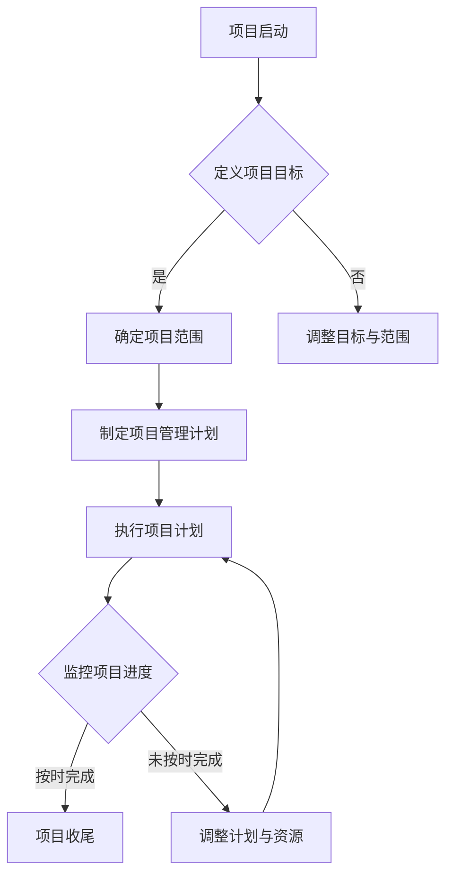

                 

### 文章标题

如何进行项目管理：如何有效地管理项目和团队？

### 文章关键词

项目管理、项目团队管理、团队协作、时间管理、任务分配、风险控制、沟通技巧

### 文章摘要

本文将深入探讨如何进行有效的项目管理，包括如何构建和管理项目团队，优化项目进度，控制风险，提高沟通效率。通过系统的理论分析和实际案例分享，帮助读者理解并掌握项目管理的核心技巧和策略。

> **“项目管理不仅仅是完成项目，更是通过科学的方法和策略，确保项目目标达成的同时，最大限度地优化资源和时间。”** — AI天才研究员

## 1. 背景介绍

在当今快速变化和高竞争的商业环境中，项目管理成为了企业成功的关键因素。随着全球化进程的加速和技术的快速发展，项目类型变得更加复杂，涉及更多的跨职能团队和国际合作。传统的项目管理方法已经不足以应对现代项目面临的挑战。因此，了解并掌握有效的项目管理技能变得至关重要。

有效的项目管理不仅能够确保项目按时完成，还能在预算范围内实现预期目标，同时提高团队的协作效率和成员的满意度。项目管理的目标包括：

- 明确项目目标和范围。
- 优化资源配置和利用。
- 提高项目的透明度和可追踪性。
- 提升团队协作和沟通效率。
- 控制项目风险，确保项目成功交付。

本文将围绕这些目标，详细探讨项目管理的各个关键环节，并提供实用的方法和策略。

## 2. 核心概念与联系

在进行项目管理之前，我们需要理解一些核心概念，这些概念构成了项目管理的基石。

### 2.1 项目目标

项目目标是指项目试图实现的结果或状态。它可以是具体的、量化的，如“在六个月内开发一个功能齐全的软件产品”，也可以是更抽象的，如“提高客户满意度”。

### 2.2 项目范围

项目范围定义了项目需要完成的全部工作内容，包括项目的目标、成果和可交付成果。明确项目范围有助于避免项目范围蔓延（scope creep），即项目超出最初定义的范围。

### 2.3 项目进度

项目进度是指项目完成各个任务的时间顺序和持续时间。有效的项目进度管理能够确保项目按时完成。

### 2.4 项目资源

项目资源包括人力资源、设备、资金等。合理分配和利用资源是项目成功的关键。

### 2.5 项目风险管理

项目风险管理是指识别、评估和应对项目潜在风险的过程。风险管理有助于降低风险对项目目标的影响。

### 2.6 项目沟通

项目沟通是确保项目团队成员、利益相关者和客户之间信息有效传递的过程。良好的沟通能够提高团队协作效率和项目成功率。

### 2.7 项目管理流程

项目管理流程是指项目管理活动的系统化和结构化过程，包括项目规划、执行、监控和收尾。

#### Mermaid 流程图（Mermaid Flowchart）



通过上述核心概念的理解和联系，我们可以为项目管理打下坚实的基础。

## 3. 核心算法原理 & 具体操作步骤

### 3.1 WBS（工作分解结构）

WBS是将项目范围分解为可管理的任务和子任务的过程。具体步骤如下：

1. **定义项目范围**：明确项目需要完成的所有工作内容。
2. **创建主要任务**：将项目范围分解为主要任务。
3. **分解子任务**：将主要任务进一步分解为可管理的子任务。
4. **编号和分层**：为每个任务分配编号，确保层次结构清晰。

### 3.2 Gantt图

Gantt图是一种项目管理工具，用于可视化项目进度和任务持续时间。具体操作步骤：

1. **创建任务栏**：在Gantt图上创建每个任务的条形图。
2. **设置任务开始和结束日期**：为每个任务设置开始和结束日期。
3. **安排依赖关系**：确定任务之间的依赖关系，并调整任务顺序。
4. **更新进度**：实时更新任务进度，确保项目按时完成。

### 3.3 关键路径法（CPM）

关键路径法是一种用于确定项目最短完成时间的方法。具体步骤：

1. **确定任务持续时间**：为每个任务估算最短和最长完成时间。
2. **计算每条路径的持续时间**：计算每条路径的总持续时间。
3. **确定关键路径**：识别持续时间最长的路径，即关键路径。
4. **监控关键路径**：关注关键路径上的任务进度，确保项目按时完成。

### 3.4 风险评估矩阵

风险评估矩阵是一种用于评估和优先级排序项目风险的方法。具体步骤：

1. **识别风险**：列出所有潜在风险。
2. **评估风险概率和影响**：为每个风险评估概率和影响。
3. **创建矩阵**：将风险按概率和影响进行排序。
4. **制定风险应对策略**：根据风险评估矩阵，制定风险应对策略。

## 4. 数学模型和公式 & 详细讲解 & 举例说明

### 4.1 项目进度计划中的 PERT（项目评估与审查技术）

PERT是一种基于概率的项目规划技术。其核心公式包括：

$$
E(T_i) = \frac{(a + 4m + b)}{6}
$$

其中，$E(T_i)$表示任务 $T_i$ 的期望持续时间，$a$ 是乐观时间，$m$ 是最可能时间，$b$ 是悲观时间。

#### 示例

假设有一个任务，其乐观时间为 3 天，最可能时间为 5 天，悲观时间为 7 天。则该任务的期望持续时间为：

$$
E(T_i) = \frac{(3 + 4 \times 5 + 7)}{6} = \frac{29}{6} \approx 4.83 \text{ 天}
$$

### 4.2 资源优化与分配的线性规划模型

线性规划模型用于优化项目资源的分配，以最小化成本或最大化收益。其一般形式为：

$$
\min_{x} c^T x \\
\text{subject to} \\
Ax \leq b \\
x \geq 0
$$

其中，$c$ 是资源成本向量，$x$ 是资源分配向量，$A$ 和 $b$ 是约束条件矩阵和向量。

#### 示例

假设我们有三种资源（A、B、C），其成本分别为 10、20 和 30。约束条件为：

$$
\begin{cases}
2x_A + x_B + 3x_C \leq 100 \\
x_A + 2x_B + x_C \leq 80 \\
x_A, x_B, x_C \geq 0
\end{cases}
$$

我们需要最小化总成本。通过求解线性规划问题，我们得到最优解为 $x_A = 20, x_B = 15, x_C = 10$，总成本为 700。

### 4.3 风险评估的决策树模型

决策树模型用于分析项目风险，并确定最佳应对策略。其核心公式为：

$$
\sum_{i=1}^{n} p_i \times o_i
$$

其中，$p_i$ 是风险发生的概率，$o_i$ 是风险的影响。

#### 示例

假设项目有两个风险，风险1发生的概率为 0.6，影响为 5；风险2发生的概率为 0.4，影响为 3。则总风险值为：

$$
0.6 \times 5 + 0.4 \times 3 = 3.6 + 1.2 = 4.8
$$

通过评估风险值，我们可以确定需要采取的应对措施。

## 5. 项目实战：代码实际案例和详细解释说明

### 5.1 开发环境搭建

在本节中，我们将介绍如何搭建一个基于Python的简单项目管理工具的开发环境。所需工具包括Python解释器、文本编辑器和虚拟环境管理工具（如virtualenv）。

#### 步骤1：安装Python

首先，从Python官方网站下载并安装Python解释器。安装完成后，打开命令行窗口，输入以下命令验证安装：

```bash
python --version
```

如果正确显示版本号，说明Python已成功安装。

#### 步骤2：安装文本编辑器

选择一个适合您的文本编辑器，如Visual Studio Code或PyCharm。下载并安装文本编辑器，并确保其支持Python开发。

#### 步骤3：创建虚拟环境

在命令行窗口中，导航到您想要创建虚拟环境的目录，并执行以下命令：

```bash
virtualenv my_project_env
```

这将在当前目录中创建一个名为`my_project_env`的虚拟环境。接着，激活虚拟环境：

```bash
source my_project_env/bin/activate
```

#### 步骤4：安装依赖库

在虚拟环境中，安装项目所需的依赖库。例如，我们可以使用pip安装`requests`库：

```bash
pip install requests
```

### 5.2 源代码详细实现和代码解读

在虚拟环境中，创建一个名为`project_manager.py`的文件，并输入以下代码：

```python
import os
import json
from datetime import datetime

class ProjectManager:
    def __init__(self, project_name):
        self.project_name = project_name
        self.project_path = os.path.join(os.getcwd(), project_name)
        self.tasks = []

    def add_task(self, task_name, deadline, description=""):
        task = {
            "name": task_name,
            "deadline": deadline,
            "description": description,
            "status": "未开始"
        }
        self.tasks.append(task)
        self.save_tasks()

    def save_tasks(self):
        with open(os.path.join(self.project_path, "tasks.json"), "w") as f:
            json.dump(self.tasks, f)

    def load_tasks(self):
        if os.path.exists(os.path.join(self.project_path, "tasks.json")):
            with open(os.path.join(self.project_path, "tasks.json"), "r") as f:
                self.tasks = json.load(f)
        else:
            self.tasks = []

    def display_tasks(self):
        for task in self.tasks:
            print(f"任务名称：{task['name']}")
            print(f"到期日期：{task['deadline']}")
            print(f"任务描述：{task['description']}")
            print(f"任务状态：{task['status']}")
            print()

if __name__ == "__main__":
    project_name = input("请输入项目名称：")
    manager = ProjectManager(project_name)
    manager.load_tasks()

    while True:
        print("\n请选择操作：")
        print("1. 添加任务")
        print("2. 显示任务")
        print("3. 退出")

        choice = input("请输入选择（1/2/3）：")

        if choice == "1":
            task_name = input("请输入任务名称：")
            deadline = input("请输入任务到期日期（格式：YYYY-MM-DD）：")
            description = input("请输入任务描述（可选）：")
            manager.add_task(task_name, deadline, description)
        elif choice == "2":
            manager.display_tasks()
        elif choice == "3":
            break
        else:
            print("无效选择，请重新输入。")
```

以上代码实现了一个简单的项目管理工具。下面我们对其逐行解析：

1. **引入模块**：引入必要的Python标准库和第三方库。
2. **定义类`ProjectManager`**：`ProjectManager`类负责管理项目任务。
3. **初始化方法`__init__`**：初始化项目名称、路径和任务列表。
4. **添加任务方法`add_task`**：将新任务添加到任务列表并保存到文件。
5. **保存任务方法`save_tasks`**：将任务列表保存到JSON文件。
6. **加载任务方法`load_tasks`**：从JSON文件加载任务列表。
7. **显示任务方法`display_tasks`**：打印任务列表信息。
8. **主程序**：处理用户输入，调用相应的方法。

### 5.3 代码解读与分析

在代码解读部分，我们将对`ProjectManager`类的每个方法进行详细分析。

#### `__init__`方法

```python
def __init__(self, project_name):
    self.project_name = project_name
    self.project_path = os.path.join(os.getcwd(), project_name)
    self.tasks = []
```

- 初始化项目名称、路径和任务列表。
- `os.path.join`用于拼接文件路径，确保在不同操作系统上兼容。

#### `add_task`方法

```python
def add_task(self, task_name, deadline, description=""):
    task = {
        "name": task_name,
        "deadline": deadline,
        "description": description,
        "status": "未开始"
    }
    self.tasks.append(task)
    self.save_tasks()
```

- 创建任务字典，包含任务名称、到期日期、描述和状态。
- 将任务添加到任务列表，并调用`save_tasks`方法保存。

#### `save_tasks`方法

```python
def save_tasks(self):
    with open(os.path.join(self.project_path, "tasks.json"), "w") as f:
        json.dump(self.tasks, f)
```

- 打开文件并写入任务列表的JSON格式。
- 使用`with`语句确保文件在写入后自动关闭，避免资源泄露。

#### `load_tasks`方法

```python
def load_tasks(self):
    if os.path.exists(os.path.join(self.project_path, "tasks.json")):
        with open(os.path.join(self.project_path, "tasks.json"), "r") as f:
            self.tasks = json.load(f)
    else:
        self.tasks = []
```

- 检查任务文件是否存在，并加载到任务列表。
- 如果文件不存在，初始化任务列表为空。

#### `display_tasks`方法

```python
def display_tasks(self):
    for task in self.tasks:
        print(f"任务名称：{task['name']}")
        print(f"到期日期：{task['deadline']}")
        print(f"任务描述：{task['description']}")
        print(f"任务状态：{task['status']}")
        print()
```

- 遍历任务列表并打印每个任务的详细信息。

#### 主程序

```python
if __name__ == "__main__":
    project_name = input("请输入项目名称：")
    manager = ProjectManager(project_name)
    manager.load_tasks()

    while True:
        print("\n请选择操作：")
        print("1. 添加任务")
        print("2. 显示任务")
        print("3. 退出")

        choice = input("请输入选择（1/2/3）：")

        if choice == "1":
            task_name = input("请输入任务名称：")
            deadline = input("请输入任务到期日期（格式：YYYY-MM-DD）：")
            description = input("请输入任务描述（可选）：")
            manager.add_task(task_name, deadline, description)
        elif choice == "2":
            manager.display_tasks()
        elif choice == "3":
            break
        else:
            print("无效选择，请重新输入。")
```

- 处理用户输入，调用相应的类方法。
- 使用循环确保程序可以重复运行，直到用户选择退出。

### 5.4 运行示例

1. 输入项目名称：
   ```
   请输入项目名称：我的项目
   ```

2. 选择操作：
   ```
   请选择操作：
   1. 添加任务
   2. 显示任务
   3. 退出

   请输入选择（1/2/3）：1
   ```

3. 添加任务：
   ```
   请输入任务名称：设计文档
   请输入任务到期日期（格式：YYYY-MM-DD）：2023-12-31
   请输入任务描述（可选）：完成项目设计文档
   ```

4. 显示任务：
   ```
   请选择操作：
   1. 添加任务
   2. 显示任务
   3. 退出

   请输入选择（1/2/3）：2

   任务名称：设计文档
   到期日期：2023-12-31
   任务描述：完成项目设计文档
   任务状态：未开始
   ```

5. 退出程序：
   ```
   请选择操作：
   1. 添加任务
   2. 显示任务
   3. 退出

   请输入选择（1/2/3）：3
   ```

通过以上步骤，我们可以使用这个简单的项目管理工具添加和查看任务。尽管这个工具功能有限，但它为我们提供了一个搭建更复杂项目管理系统的起点。

## 6. 实际应用场景

在现实生活中，项目管理广泛应用于各种行业和领域。以下是一些实际应用场景：

### 6.1 IT行业

在IT行业，项目管理是软件开发、系统集成和IT咨询等领域的核心活动。有效的项目管理能够确保软件开发按时交付，功能满足需求，同时控制成本和质量。

### 6.2 建筑行业

建筑行业中的项目通常涉及复杂的规划、设计、施工和验收过程。项目管理在这里至关重要，它帮助项目团队优化进度、资源分配，并确保项目按预算完成。

### 6.3 制造业

制造业中的项目管理主要关注生产计划、供应链管理和质量控制。通过有效的项目管理，企业能够提高生产效率，降低成本，并保证产品质量。

### 6.4 咨询服务

在咨询服务行业，项目管理帮助顾问团队管理客户需求、项目范围和交付成果。它确保项目按计划进行，客户满意度得到满足。

### 6.5 教育培训

教育培训机构也广泛应用项目管理，以管理课程开发、教学活动和学生评估。有效的项目管理能够确保教育项目按时完成，质量达到预期。

### 6.6 医疗保健

在医疗保健领域，项目管理用于管理医院建设项目、医疗服务流程改进和临床研究项目。它确保项目在预算和时间范围内成功交付。

### 6.7 创意产业

创意产业，如广告、电影制作和设计，项目管理帮助团队协调创意过程、资源分配和项目交付。它确保项目在创意和质量之间取得平衡。

### 6.8 政府和非营利组织

政府和非营利组织也广泛应用项目管理来管理公共项目，如基础设施建设、公共设施改善和社会福利项目。项目管理确保公共资源得到合理利用，项目目标得到实现。

## 7. 工具和资源推荐

### 7.1 学习资源推荐

- **书籍**：
  - 《项目管理知识体系指南》（PMBOK指南）
  - 《敏捷项目管理》
  - 《实践项目管理》
  - 《项目管理中的决策制定》
- **论文**：
  - “Project Management: A Systems Approach to Planning, Scheduling, and Controlling”
  - “Agile Project Management with Scrum”
  - “The Lean Startup”
  - “Beyond Budgeting: Managing for Value in the Knowledge Economy”
- **博客**：
  - ProjectManagement.com
  - AgileScrum.org
  - LeanKit.com
  - Atlassian.com
- **网站**：
  - PMI.org（项目管理协会）
  - AgileAlliance.org（敏捷联盟）
  - Lean.org（精益协会）

### 7.2 开发工具框架推荐

- **项目管理工具**：
  - Jira
  - Trello
  - Asana
  - Microsoft Project
- **代码管理工具**：
  - Git
  - GitHub
  - GitLab
  - Bitbucket
- **协作工具**：
  - Slack
  - Microsoft Teams
  - Zoom
  - Google Workspace
- **文档工具**：
  - Confluence
  - Notion
  - Google Docs
  - Microsoft Word

### 7.3 相关论文著作推荐

- **论文**：
  - “The Project Management Institute’s (PMI) Project Management Body of Knowledge (PMBOK® Guide)”
  - “Agile Project Management: Creating Innovative Products”
  - “Lean Project Management: A Practitioner’s Guide to Implementing Lean Principles in Project Management”
  - “The Psychology of Project Management: Understanding and Managing People on Projects”
- **著作**：
  - 《敏捷项目管理：Scrum实用指南》
  - 《精益项目管理：实战指南》
  - 《项目管理实践：项目流程、技术和工具》
  - 《项目管理中的沟通与冲突管理》

## 8. 总结：未来发展趋势与挑战

### 8.1 发展趋势

- **数字化转型**：随着数字化进程的加快，项目管理工具和流程将更加智能化和数据驱动。
- **敏捷和精益方法**：敏捷和精益方法将继续在项目管理中占据主导地位，特别是在软件开发和创意产业。
- **人工智能应用**：人工智能和机器学习技术将被广泛应用于项目管理，以优化资源分配、预测风险和提升团队协作效率。
- **远程工作**：远程工作趋势将继续发展，项目管理需要适应虚拟团队的管理和协作。

### 8.2 挑战

- **复杂性增加**：项目越来越复杂，涉及更多的跨职能团队和国际合作，项目管理需要更加灵活和适应性。
- **技能短缺**：项目管理专业人员的需求不断增长，但技能短缺是一个普遍问题。
- **项目范围蔓延**：项目范围蔓延仍然是项目管理面临的主要挑战，需要严格控制和规划。
- **沟通障碍**：远程工作和虚拟团队可能加剧沟通障碍，需要更加有效的沟通工具和方法。

## 9. 附录：常见问题与解答

### 9.1 项目管理是什么？

项目管理是指通过系统的方法和工具，规划和组织项目活动，以实现项目目标的过程。它涉及资源管理、时间规划、风险管理、沟通协调等多个方面。

### 9.2 什么是敏捷项目管理？

敏捷项目管理是一种以迭代和增量为特点的项目管理方法，它强调快速响应变化、持续交付和团队协作。敏捷方法包括Scrum、Kanban等实践。

### 9.3 项目管理与运营管理的区别是什么？

项目管理通常关注特定项目的一次性活动，而运营管理则关注组织的日常运营和维护。项目管理注重目标实现，而运营管理注重持续优化。

### 9.4 如何应对项目范围蔓延？

应对项目范围蔓延需要严格的范围管理，包括明确项目目标、范围和交付成果，制定变更控制流程，并在项目执行过程中持续监控和评估。

### 9.5 为什么要使用项目管理工具？

项目管理工具能够提高项目透明度、可追踪性和协作效率。它们帮助项目经理更好地规划、监控和报告项目进展，确保项目按时、按预算完成。

## 10. 扩展阅读 & 参考资料

- ProjectManagement.com: [Understanding Project Management](https://www.projectmanagement.com/learning/understanding-project-management)
- AgileScrum.org: [What is Agile Project Management?](https://www.agilescrum.org/agile-project-management/)
- LeanKit.com: [Lean Project Management](https://www.leankit.com/lean-project-management)
- PMI.org: [PMBOK Guide - Sixth Edition](https://www.pmi.org/learning/library/pmbok-guide-sixth-edition-11728)
- AgileAlliance.org: [Agile Project Management](https://www.agilealliance.org/agile101/what-is-agile-project-management/)
- Lean.org: [Lean Management](https://www.lean.org/what-is-lean/)
- Atlassian.com: [Project Management Tools](https://www.atlassian.com/software/jira)

通过以上内容，我们详细探讨了项目管理的核心概念、方法、工具和实际应用场景，希望对您理解和实践项目管理有所帮助。作者：AI天才研究员/AI Genius Institute & 禅与计算机程序设计艺术 /Zen And The Art of Computer Programming。

