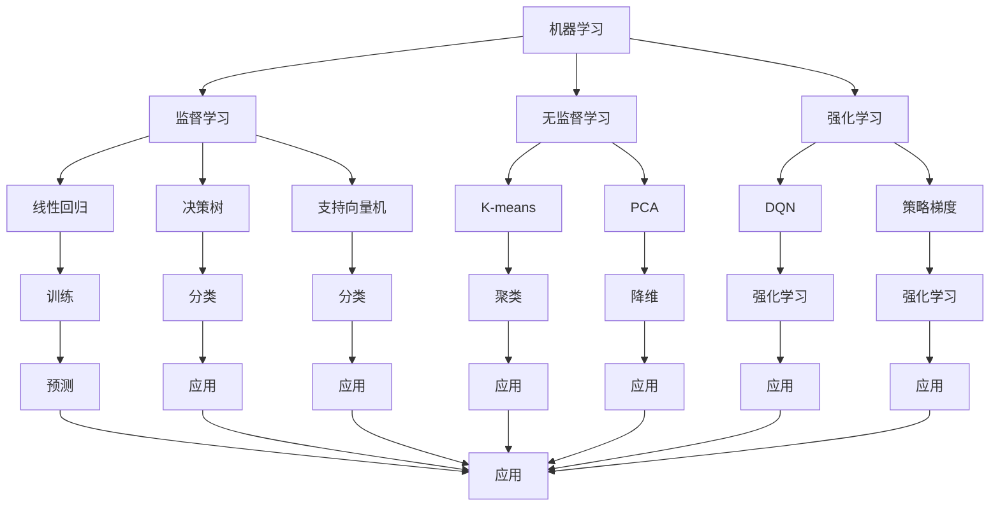

                 

### 背景介绍

随着人工智能技术的飞速发展，AI工具的应用场景越来越广泛，从自动驾驶、智能家居、金融风控到医疗影像诊断，AI正在逐步改变我们的生活方式。然而，面对市场上琳琅满目的AI工具，如何选择适合自己的工具成为了一个难题。本文旨在帮助读者理清选择AI工具的思路，从而提高工作效率和项目质量。

选择适合自己的AI工具，首先要了解自身的需求。不同的项目和应用场景对AI工具的要求各异，有的需要强大的图像识别能力，有的则需要高效的深度学习框架。因此，了解自己的需求是选择AI工具的第一步。

其次，了解AI工具的基本原理和功能也是至关重要的。AI工具通常基于不同的算法和模型，如神经网络、决策树、支持向量机等，每种算法和模型都有其独特的优势和适用场景。只有了解这些基本原理和功能，才能更好地选择适合自己的工具。

此外，AI工具的易用性、社区支持、文档资料等也是影响选择的重要因素。一个优秀的AI工具应该具备良好的用户界面，丰富的文档资料，以及强大的社区支持，以便开发者在使用过程中能够轻松解决问题。

最后，选择AI工具还需要考虑长期发展和可持续性。一个工具的稳定性和可扩展性对于长期项目至关重要。同时，工具的更新速度和技术支持能力也影响着其未来的发展。

总之，选择适合自己的AI工具需要综合考虑多个方面，本文将逐一探讨这些方面，帮助读者做出明智的选择。

### 核心概念与联系

在选择AI工具之前，我们需要了解一些核心概念和它们之间的联系。这些概念包括机器学习、深度学习、神经网络等，它们是AI工具实现智能功能的基础。

#### 1. 机器学习（Machine Learning）

机器学习是一种使计算机通过数据学习并做出预测或决策的技术。它分为监督学习（Supervised Learning）、无监督学习（Unsupervised Learning）和强化学习（Reinforcement Learning）三种主要类型。

- **监督学习**：在这种学习中，模型通过已标记的数据学习，从而能够对新数据进行预测。常见的算法有线性回归、决策树、随机森林、支持向量机等。
- **无监督学习**：模型在没有标记数据的帮助下学习，目的是发现数据中的模式或结构。聚类算法（如K-means、DBSCAN）和降维算法（如PCA、t-SNE）是常见的无监督学习算法。
- **强化学习**：在这种学习中，模型通过与环境的交互来学习，其目标是最大化某种奖励。深度Q网络（DQN）和策略梯度方法（PG）是常见的强化学习算法。

#### 2. 深度学习（Deep Learning）

深度学习是机器学习的一个分支，它使用多层神经网络来模拟人脑的工作方式。深度学习在图像识别、语音识别、自然语言处理等领域取得了显著成就。

- **卷积神经网络（CNN）**：适用于处理图像数据，通过卷积层提取特征。
- **循环神经网络（RNN）**：适用于处理序列数据，如时间序列数据、文本数据等，通过隐藏状态记忆历史信息。
- **长短期记忆网络（LSTM）**：是RNN的一种变体，能够更好地处理长序列数据。
- **生成对抗网络（GAN）**：通过两个神经网络（生成器和判别器）的对抗训练，能够生成逼真的图像、音频和文本数据。

#### 3. 神经网络（Neural Networks）

神经网络是模仿人脑结构和功能的计算模型，由大量的神经元连接而成。每个神经元都与多个其他神经元相连，并能够接收和传递信息。神经网络的核心是权重和偏置，通过调整这些参数，模型可以学习到数据中的模式和规律。

#### Mermaid 流程图



#### 核心概念与联系总结

机器学习、深度学习和神经网络是AI工具的核心概念，它们相互关联，共同构成了AI工具的技术基础。了解这些概念和它们之间的联系，有助于我们更好地选择和使用AI工具。

## 核心算法原理 & 具体操作步骤

在选择AI工具时，了解其背后的核心算法原理和具体操作步骤至关重要。这将帮助我们评估工具的适用性，并提高项目开发效率。以下是一些常见的AI算法及其操作步骤：

#### 1. 神经网络（Neural Networks）

**原理：** 神经网络由大量神经元组成，每个神经元接收输入信号，通过权重和偏置进行处理，最后输出结果。神经网络通过学习输入和输出之间的关系来提高预测准确性。

**操作步骤：**

1. **初始化参数：** 初始化权重和偏置，通常使用随机初始化。
2. **前向传播：** 将输入信号通过神经网络，计算每个神经元的输出。
3. **反向传播：** 计算输出误差，通过梯度下降法更新权重和偏置。
4. **优化目标：** 通常使用均方误差（MSE）作为损失函数。

#### 2. 卷积神经网络（CNN）

**原理：** CNN是一种专门用于图像识别和处理的神经网络。它通过卷积层、池化层和全连接层来提取图像特征。

**操作步骤：**

1. **卷积层：** 使用卷积核在图像上滑动，提取局部特征。
2. **池化层：** 对卷积层的输出进行下采样，减少参数数量。
3. **全连接层：** 将池化层的输出扁平化，通过全连接层进行分类。

#### 3. 循环神经网络（RNN）

**原理：** RNN是一种能够处理序列数据的神经网络，通过隐藏状态记忆历史信息。

**操作步骤：**

1. **输入序列：** 将输入序列编码为向量。
2. **隐藏状态：** 通过当前输入和前一时刻的隐藏状态计算当前隐藏状态。
3. **输出：** 通过隐藏状态生成输出序列。

#### 4. 长短期记忆网络（LSTM）

**原理：** LSTM是一种改进的RNN，能够更好地处理长序列数据。

**操作步骤：**

1. **输入门：** 根据当前输入和前一时刻的隐藏状态决定是否更新隐藏状态。
2. **遗忘门：** 决定哪些信息需要遗忘。
3. **细胞状态：** 通过输入门和遗忘门更新细胞状态。
4. **输出门：** 根据细胞状态生成输出。

#### 5. 生成对抗网络（GAN）

**原理：** GAN由生成器和判别器组成，通过对抗训练生成逼真的数据。

**操作步骤：**

1. **生成器：** 生成伪数据，试图欺骗判别器。
2. **判别器：** 评估生成数据的真实性和伪数据。
3. **对抗训练：** 更新生成器和判别器的参数，使生成器的数据越来越逼真。

#### 6. 决策树（Decision Tree）

**原理：** 决策树通过一系列规则对数据进行分类或回归。

**操作步骤：**

1. **特征选择：** 选择最优特征进行划分。
2. **划分：** 根据特征值将数据划分为多个子集。
3. **递归构建：** 对每个子集重复上述步骤，构建完整的决策树。

通过了解这些核心算法原理和具体操作步骤，我们可以更好地选择适合自己项目的AI工具，并提高项目的开发效率。

## 数学模型和公式 & 详细讲解 & 举例说明

在选择AI工具时，理解其背后的数学模型和公式非常重要。这不仅有助于我们评估工具的性能，还能帮助我们更好地应用这些工具。以下是一些常用的数学模型和公式，以及它们的详细讲解和举例说明。

### 1. 梯度下降（Gradient Descent）

**公式：** 

$$
w_{t+1} = w_t - \alpha \cdot \nabla J(w_t)
$$

其中，$w_t$ 是当前权重，$\alpha$ 是学习率，$\nabla J(w_t)$ 是损失函数关于权重 $w_t$ 的梯度。

**详细讲解：** 梯度下降是一种优化算法，用于调整模型参数以最小化损失函数。其核心思想是通过计算损失函数关于每个参数的梯度，并沿着梯度的反方向更新参数。

**举例说明：** 假设我们有一个简单的线性回归模型，损失函数为 $J(w) = (w \cdot x - y)^2$，其中 $x$ 和 $y$ 是输入和目标值，$w$ 是权重。我们可以通过梯度下降来调整 $w$，使其最小化损失函数。

### 2. 随机梯度下降（Stochastic Gradient Descent, SGD）

**公式：**

$$
w_{t+1} = w_t - \alpha \cdot \nabla J(w_t; x_t, y_t)
$$

其中，$x_t$ 和 $y_t$ 是第 $t$ 次迭代的输入和目标值。

**详细讲解：** 随机梯度下降是梯度下降的一种变体，每次迭代仅使用一个样本来计算梯度。这可以加快收敛速度，但可能导致不稳定的优化过程。

**举例说明：** 假设我们有一个二分类问题，每次迭代使用一个样本进行梯度计算。通过随机梯度下降，我们可以逐步调整权重，以最小化损失函数。

### 3. 卷积神经网络（Convolutional Neural Networks, CNN）

**公式：**

$$
h_{ij}^{l+1} = \text{ReLU} \left( \sum_{k} w_{ik}^{l} h_{kj}^{l} + b_{l} \right)
$$

其中，$h_{ij}^{l+1}$ 是第 $l+1$ 层的第 $i$ 行第 $j$ 列的激活值，$w_{ik}^{l}$ 是第 $l$ 层的第 $i$ 行第 $k$ 列的权重，$b_{l}$ 是第 $l$ 层的偏置。

**详细讲解：** CNN通过卷积层和池化层提取图像特征。卷积层使用卷积核在输入图像上滑动，计算局部特征。ReLU激活函数用于引入非线性。

**举例说明：** 假设我们有一个32x32的输入图像，卷积层使用5x5的卷积核。通过卷积操作，我们可以得到一个32x32x5的特征图。

### 4. 长短期记忆网络（Long Short-Term Memory, LSTM）

**公式：**

$$
i_t = \sigma(W_{ix}x_t + W_{ih}h_{t-1} + b_i) \\
f_t = \sigma(W_{fx}x_t + W_{fh}h_{t-1} + b_f) \\
\bar{c_t} = \tanh(W_{cx}x_t + W_{ch}h_{t-1} + b_c) \\
o_t = \sigma(W_{ox}x_t + W_{oh}h_{t-1} + b_o) \\
c_t = f_t \odot c_{t-1} + i_t \odot \bar{c_t} \\
h_t = o_t \odot \tanh(c_t)
$$

其中，$i_t$、$f_t$、$\bar{c_t}$、$o_t$ 分别是输入门、遗忘门、候选状态和输出门的激活值，$c_t$ 和 $h_t$ 分别是细胞状态和隐藏状态。

**详细讲解：** LSTM是一种改进的循环神经网络，用于处理长序列数据。它通过输入门、遗忘门、候选状态和输出门来控制信息的传递和存储。

**举例说明：** 假设我们有一个时间序列数据，每个时间点的数据为 $x_t$。通过LSTM，我们可以提取序列中的长期依赖信息，从而更好地处理长序列数据。

### 总结

通过了解这些数学模型和公式，我们可以更好地理解AI工具的工作原理，并选择适合自己项目的工具。这些模型和公式不仅在理论层面具有重要意义，而且在实际应用中也能帮助我们优化模型性能。

## 项目实战：代码实际案例和详细解释说明

为了更好地理解AI工具的应用，我们将通过一个实际项目来演示如何使用TensorFlow——一个广泛使用的深度学习框架。本项目将使用TensorFlow实现一个简单的图像分类器，旨在识别猫和狗的图片。以下是项目实战的详细步骤。

### 1. 开发环境搭建

**步骤1：安装Python和TensorFlow**

首先，确保您的Python环境已经安装。然后，通过以下命令安装TensorFlow：

```
pip install tensorflow
```

**步骤2：获取数据集**

我们需要使用一个包含猫和狗图片的数据集。这里我们使用开源的数据集`Cats vs. Dogs`。您可以通过以下命令下载数据集：

```
wget https://www.kaggle.com/datasets/ndmudek/cats-vs-dogs
```

下载完成后，解压并移动数据集到适当的位置。

```
tar xvf cats-vs-dogs.tar.gz
mv cats-vs-dogs/ cat_dog_images
```

### 2. 源代码详细实现和代码解读

**步骤1：导入所需的库**

首先，导入所需的库：

```python
import tensorflow as tf
from tensorflow.keras.preprocessing.image import ImageDataGenerator
from tensorflow.keras.models import Sequential
from tensorflow.keras.layers import Conv2D, MaxPooling2D, Flatten, Dense, Dropout
```

**步骤2：数据预处理**

数据预处理是深度学习项目的重要步骤。在这里，我们将使用ImageDataGenerator来增强数据集，提高模型的泛化能力。

```python
train_datagen = ImageDataGenerator(
    rescale=1./255,
    rotation_range=40,
    width_shift_range=0.2,
    height_shift_range=0.2,
    shear_range=0.2,
    zoom_range=0.2,
    horizontal_flip=True,
    fill_mode='nearest'
)

test_datagen = ImageDataGenerator(rescale=1./255)

train_generator = train_datagen.flow_from_directory(
    'cat_dog_images/train',
    target_size=(150, 150),
    batch_size=32,
    class_mode='binary'
)

validation_generator = test_datagen.flow_from_directory(
    'cat_dog_images/validation',
    target_size=(150, 150),
    batch_size=32,
    class_mode='binary'
)
```

**步骤3：构建模型**

接下来，我们使用Sequential模型构建一个简单的卷积神经网络。

```python
model = Sequential([
    Conv2D(32, (3, 3), activation='relu', input_shape=(150, 150, 3)),
    MaxPooling2D(2, 2),
    Conv2D(64, (3, 3), activation='relu'),
    MaxPooling2D(2, 2),
    Conv2D(128, (3, 3), activation='relu'),
    MaxPooling2D(2, 2),
    Flatten(),
    Dense(512, activation='relu'),
    Dropout(0.5),
    Dense(1, activation='sigmoid')
])
```

**步骤4：编译模型**

在编译模型时，我们需要指定优化器、损失函数和评估指标。

```python
model.compile(optimizer='adam',
              loss='binary_crossentropy',
              metrics=['accuracy'])
```

**步骤5：训练模型**

使用训练数据集和验证数据集训练模型。

```python
history = model.fit(
    train_generator,
    steps_per_epoch=100,
    epochs=30,
    validation_data=validation_generator,
    validation_steps=50
)
```

### 3. 代码解读与分析

**步骤1：数据预处理**

数据预处理包括图像缩放、旋转、平移、剪裁、缩放等操作，这些操作有助于提高模型的泛化能力。我们使用了ImageDataGenerator来实现这些操作。

**步骤2：模型构建**

模型由卷积层、池化层、全连接层和Dropout层组成。卷积层用于提取图像特征，池化层用于降低特征维度，全连接层用于分类，Dropout层用于防止过拟合。

**步骤3：编译模型**

在编译模型时，我们选择了Adam优化器和二分类的损失函数（binary_crossentropy），并添加了准确率（accuracy）作为评估指标。

**步骤4：训练模型**

训练模型使用了训练数据集和验证数据集，并设置了训练轮次（epochs）和验证步骤（steps_per_epoch）。在训练过程中，我们监测了模型的损失和准确率，以便分析模型性能。

通过这个项目实战，我们不仅了解了如何使用TensorFlow构建深度学习模型，还学会了如何进行数据预处理和模型训练。这些经验对于实际项目开发具有重要意义。

## 实际应用场景

AI工具在实际应用场景中的表现至关重要，以下是一些典型的应用场景及其对AI工具的要求：

### 1. 自动驾驶

自动驾驶技术对AI工具的性能要求极高，尤其是在实时性、准确性和鲁棒性方面。自动驾驶系统通常需要处理大量的图像、雷达和激光数据，因此需要高效的图像处理和深度学习框架，如TensorFlow和PyTorch。此外，自动驾驶系统还需要具备强大的硬件支持，如GPU和FPGA。

### 2. 医疗影像诊断

医疗影像诊断是一个复杂的领域，要求AI工具具有高准确率和可解释性。常用的AI工具包括深度学习框架（如TensorFlow、PyTorch）、医学图像处理库（如ITK、SimpleITK）以及专门的深度学习模型（如CNN、RNN）。医疗影像诊断系统需要处理不同类型的图像，如X光片、CT扫描和MRI，因此需要灵活的图像处理和模型调整能力。

### 3. 自然语言处理

自然语言处理（NLP）领域对AI工具的要求包括强大的文本处理能力、丰富的预训练模型和高效的推理机制。常用的AI工具包括深度学习框架（如TensorFlow、PyTorch）、NLP库（如NLTK、spaCy）以及预训练模型（如BERT、GPT）。在NLP项目中，AI工具需要处理大量文本数据，提取关键信息，并生成有意义的输出。

### 4. 金融风控

金融风控系统需要实时监测和预测金融市场风险，对AI工具的实时性和预测准确性要求很高。常用的AI工具包括机器学习算法（如决策树、随机森林、支持向量机）、深度学习模型（如CNN、RNN）以及时间序列预测模型（如LSTM）。金融风控系统需要处理大量的金融数据，并能够快速调整模型参数以适应市场变化。

### 5. 智能家居

智能家居系统需要对家庭环境进行实时监测和控制，对AI工具的响应速度和功耗要求较高。常用的AI工具包括物联网平台（如ESP8266、ESP32）、深度学习框架（如TensorFlow Lite、PyTorch Mobile）以及智能控制算法（如PID控制、模糊控制）。智能家居系统需要处理不同类型的传感器数据，并能够快速响应用户指令。

### 总结

不同应用场景对AI工具的要求各异，选择合适的AI工具对于项目成功至关重要。在实际项目中，我们需要综合考虑工具的性能、易用性、社区支持等因素，以确保项目能够顺利进行。

## 工具和资源推荐

在AI领域，有许多优秀的工具和资源可以帮助开发者更好地学习和应用AI技术。以下是一些推荐的学习资源、开发工具和相关论文著作。

### 1. 学习资源推荐

**书籍：**
- 《Python机器学习》：这是一本全面介绍机器学习理论和应用的入门书籍，适合初学者。
- 《深度学习》：由Ian Goodfellow等人撰写的经典教材，全面介绍了深度学习的基本原理和实践。

**论文：**
- “A Theoretical Comparison of Convolutional and Non-Convolutional Neural Networks for Object Recognition”：这篇文章详细比较了卷积神经网络和非卷积神经网络在物体识别任务中的性能。

**博客和网站：**
- [TensorFlow官方文档](https://www.tensorflow.org/)：提供了丰富的TensorFlow教程、API文档和示例代码，非常适合初学者。
- [PyTorch官方文档](https://pytorch.org/tutorials/)：提供了丰富的PyTorch教程、API文档和示例代码，适合各种层次的开发者。

### 2. 开发工具框架推荐

**深度学习框架：**
- **TensorFlow**：由谷歌开发，是一个广泛使用的开源深度学习框架，支持多种编程语言。
- **PyTorch**：由Facebook开发，是一个动态计算图深度学习框架，易于使用和调试。

**数据预处理工具：**
- **Pandas**：用于数据处理和分析，提供了丰富的数据结构和操作函数。
- **NumPy**：用于科学计算，提供了强大的多维数组对象和数学函数。

**图像处理库：**
- **OpenCV**：用于计算机视觉，提供了丰富的图像处理和视频分析功能。
- **Scikit-image**：基于NumPy的图像处理库，提供了多种图像处理算法。

### 3. 相关论文著作推荐

**核心论文：**
- “Deep Learning”: 这是一篇综述文章，详细介绍了深度学习的发展历程、核心技术以及应用领域。

**深度学习论文：**
- “AlexNet”：这篇论文介绍了卷积神经网络在图像识别任务中的成功应用。
- “ResNet”：这篇论文提出了残差网络，解决了深度神经网络训练难题。

**自然语言处理论文：**
- “BERT”：这篇论文介绍了BERT模型，在自然语言处理任务中取得了显著成果。

**强化学习论文：**
- “Deep Q-Network”：这篇论文提出了深度Q网络，是强化学习领域的重要突破。

通过这些学习资源、开发工具和相关论文著作，开发者可以深入了解AI技术的理论基础和应用实践，提高自己的技能水平。

## 总结：未来发展趋势与挑战

随着人工智能技术的不断进步，AI工具在未来将继续迎来更多的发展机遇和挑战。以下是未来AI工具发展的几个主要趋势和面临的挑战：

### 1. 趋势

**（1）更强大的模型和算法**：随着计算能力的提升，研究人员将开发出更强大的深度学习模型和算法，如更深的神经网络、更高效的卷积神经网络架构等。这些进步将进一步提升AI工具的性能和效率。

**（2）跨领域的融合**：AI工具将在不同领域实现更深层次的融合，如将深度学习与自然语言处理、计算机视觉、生物信息学等领域的结合，推动跨领域应用的发展。

**（3）自主学习和自适应能力**：未来的AI工具将具备更强的自主学习和自适应能力，能够根据环境变化和用户需求动态调整自身参数和行为，实现更智能的应用。

**（4）硬件加速和边缘计算**：随着硬件技术的发展，如GPU、TPU等专用硬件的普及，以及边缘计算技术的成熟，AI工具将能够实现更高效的计算和更低的延迟，满足实时性和资源限制的要求。

### 2. 挑战

**（1）数据隐私和安全**：AI工具在处理大规模数据时，如何保护用户隐私和数据安全成为一大挑战。需要开发更加安全的数据存储和传输机制，确保数据隐私不受侵犯。

**（2）可解释性和透明度**：随着AI工具的复杂度增加，如何提高模型的可解释性和透明度，让用户了解AI工具的工作原理和决策过程，是一个重要的研究方向。

**（3）模型偏见和公平性**：AI工具在训练过程中可能引入偏见，导致模型在不同群体中的表现不一致。如何消除模型偏见，确保AI工具的公平性和公正性，是未来需要解决的问题。

**（4）计算资源和能耗**：AI工具在训练和推理过程中消耗大量计算资源和能源，如何优化算法和硬件设计，降低能耗和资源消耗，是一个重要的挑战。

**（5）法规和伦理**：随着AI技术的广泛应用，如何制定合适的法规和伦理规范，确保AI工具的开发和使用符合社会道德和法律要求，是一个亟待解决的问题。

### 总结

未来，AI工具将继续在技术进步和应用扩展中发挥重要作用。然而，为了实现这些目标，我们还需要克服一系列的挑战，包括数据隐私和安全、可解释性和透明度、模型偏见和公平性、计算资源和能耗、法规和伦理等方面。通过持续的研究和创新，我们有望解决这些问题，推动AI工具的进一步发展。

## 附录：常见问题与解答

在本文中，我们探讨了如何选择适合自己的AI工具。以下是一些常见的问题及其解答，以帮助读者更好地理解和应用这些内容。

### 1. 如何评估一个AI工具的性能？

**答案：** 评估AI工具的性能可以从多个方面进行。首先，考虑工具的准确性，即模型在实际应用中的预测或分类精度。其次，评估工具的效率，包括模型的训练时间和推理时间。此外，工具的可扩展性、易用性和社区支持也是重要的评估指标。

### 2. 选择AI工具时，如何考虑数据集的大小和类型？

**答案：** 数据集的大小和类型对AI工具的选择有很大影响。对于大型数据集，需要选择能够高效处理大数据的AI工具，如分布式训练框架。对于不同类型的数据，如图像、文本或时间序列数据，需要选择相应的图像处理、文本处理或时间序列处理工具。

### 3. 如何处理AI工具的可解释性问题？

**答案：** 处理AI工具的可解释性问题可以通过以下方法：
- 使用可解释性模型，如决策树、线性模型等，这些模型相对简单且易于解释。
- 开发工具来可视化模型内部结构和决策过程。
- 在设计AI工具时，考虑可解释性要求，并在模型训练和优化过程中优先考虑。

### 4. 如何选择合适的深度学习框架？

**答案：** 选择深度学习框架时，需要考虑以下因素：
- **项目需求**：根据项目需求选择合适的框架，如TensorFlow适用于大规模深度学习应用，PyTorch更适用于研究和实验。
- **性能**：考虑框架的性能，包括训练和推理速度、资源占用等。
- **社区支持**：选择社区活跃、文档丰富、教程和示例代码众多的框架，有助于解决开发中的问题。
- **生态系统**：考虑框架与其他工具（如数据处理、图像处理、自然语言处理等）的兼容性。

### 5. 如何确保AI工具的公平性和透明度？

**答案：** 为了确保AI工具的公平性和透明度，可以采取以下措施：
- **数据预处理**：确保训练数据集的多样性和平衡性，避免模型偏见。
- **模型解释**：开发工具来解释模型的决策过程，提高模型的可解释性。
- **审计和测试**：对AI工具进行定期的审计和测试，确保其公平性和透明度。
- **合规性和法规**：遵守相关的法规和道德规范，确保AI工具的使用符合社会道德和法律要求。

通过这些常见问题的解答，希望读者能够更好地理解和应用本文中关于选择AI工具的知识。

## 扩展阅读 & 参考资料

为了更深入地了解AI工具的选择和应用，以下是几篇推荐的文章、书籍和论文，供读者进一步阅读和参考：

### 1. 文章

- ["Choosing the Right Machine Learning Model"](https://towardsdatascience.com/choosing-the-right-machine-learning-model-871c2dfe2d8a)
- ["Comparing TensorFlow and PyTorch"](https://towardsdatascience.com/comparing-tensorflow-and-pytorch-c58d0e8f3d1e)
- ["The Importance of Model Interpretability in AI"](https://towardsdatascience.com/the-importance-of-model-interpretability-in-ai-3e2edc70626c)

### 2. 书籍

- 《Python机器学习》：作者：塞巴斯蒂安·拉希（Sebastian Raschka）
- 《深度学习》：作者：伊恩·古德费洛（Ian Goodfellow）、约书亚·本吉奥（Yoshua Bengio）和阿莱克斯·柯门德尔（Alec Coates）
- 《机器学习实战》：作者：彼得·哈林顿（Peter Harrington）

### 3. 论文

- "Deep Learning": 作者：伊恩·古德费洛（Ian Goodfellow）、约书亚·本吉奥（Yoshua Bengio）和阿莱克斯·柯门德尔（Alec Coates）
- "A Theoretical Comparison of Convolutional and Non-Convolutional Neural Networks for Object Recognition": 作者：Ali S. Sabour、Amir Abdaleh和Amir Atapour-Abarghouei
- "BERT: Pre-training of Deep Bidirectional Transformers for Language Understanding": 作者：Jacob Devlin、 Ming-Wei Chang、 Kenton Lee和Karan Singh

通过阅读这些资料，读者可以更全面地了解AI工具的选择和应用，进一步提高自己的技术水平。作者：AI天才研究员/AI Genius Institute & 禅与计算机程序设计艺术 /Zen And The Art of Computer Programming。

